# Chapter 1: Streaming 101

> The vocabulary and mental model that the whole book builds on: what streaming is, why the event-time/processing-time distinction matters, and the three shapes data can take — bounded, unbounded batched, and unbounded streamed.

_Also known as: SS Ch01 · Event Time · Processing Time · Bounded vs Unbounded_

## Flow

### What streaming is — terminology

> **Why this matters:** Every later chapter assumes you can tell a bounded dataset from an unbounded one and an event-time answer from a processing-time answer, so this section pins the vocabulary down before any of the mechanics.

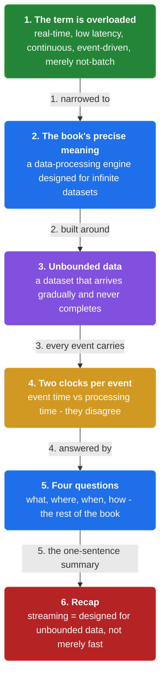

1. **The term "streaming" is overloaded** — "Streaming" means different things to different teams — real-time, low latency, continuous computation, event-driven, or merely "not batch". The book pins it to one precise meaning: **a data processing engine designed with infinite datasets in mind, and a dataset that is unbounded — one that arrives gradually and never completes.**

2. **Two critical dimensions of time** — Every event carries two timestamps that disagree. **Event time** is when the event actually happened (recorded by the producer). **Processing time** is when the processing system observed it. They diverge because of network delay, queueing, backpressure, and replays.

3. **Why the divergence breaks naive systems** — A system that buckets by processing time groups events by when it happened to be busy, not by when the user clicked. **A correct answer to "how many clicks at 12:00?" must use event time — the processing-time answer silently shifts under load.**

4. **The rest of the book in one sentence** — The book is a systematic answer to four questions you can ask of any data-processing pipeline — **what** results are computed, **where** in event time they are computed, **when** in processing time they are materialized, and **how** later refinements relate to earlier results.

```java
// STREAM SIDE — one user click carries two timestamps that disagree; correct analytics must pick the right one
// DEF: event time — when the click happened, stamped by the user's device = 12:00:59
// DEF: processing time — when the pipeline observed the click = 12:04:11 (3m12s later)
// DEF: watermark — the pipeline's statement of how complete event time is at this moment = 12:03:00
// -> click : {user: 42, url: "/shoe/x", event_time: "12:00:59", processing_time: "12:04:11"}
//    step 1 · the network + queue delayed the click : 12:00:59 -> observed at 12:04:11   BECAUSE the device was offline for 3 minutes
//    step 2 · bucket by event time -> the click lands in the 12:00 window
//    step 3 · bucket by processing time -> the same click lands in the 12:04 window
// <- wrong answer : 12:04 bucket says 1 click when the user really clicked at 12:00   BECAUSE processing time measures the pipeline, not the user
//    alt watermark at 12:03:00 : the 12:00 window is declared complete -> the click arriving now is a late (straggler) event
//    derivation : lag = 12:04:11 - 12:00:59 = 3m12s   BECAUSE processing time trails event time by the network delay
```

### Event time vs processing time

> **Why this matters:** Because the two clocks disagree, a pipeline must decide which one its answers are about, so this section makes the distinction concrete with a metric that changes meaning when the clock is wrong.

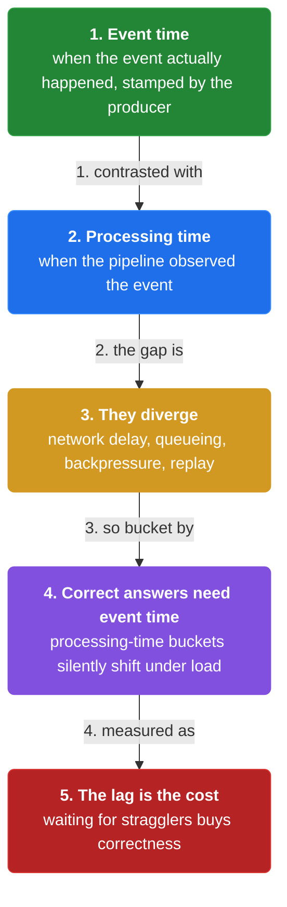

1. **Event time is the meaningful one** — For almost any question about users or business — clicks per minute, latency, correctness — the answer should be keyed to **when things happened**, not when your system happened to look at them.

2. **Processing time is the cheap one** — Processing time needs no special machinery — the system clock is right there. **It is the correct clock only for questions about the system itself**, such as current queue depth or "how many events did I process this second".

3. **The lag between them is the cost of correctness** — Event-time correctness requires waiting for stragglers, and waiting costs latency. **The whole art of the Beam model is choosing how long to wait (watermarks) and what to do with events that arrive later (triggers, allowed lateness).**

### Three shapes of data

> **Why this matters:** A pipeline's design falls out of whether its input has an end, so this section separates bounded, unbounded-as-batch, and unbounded-as-streaming and shows which machinery each forces on you.

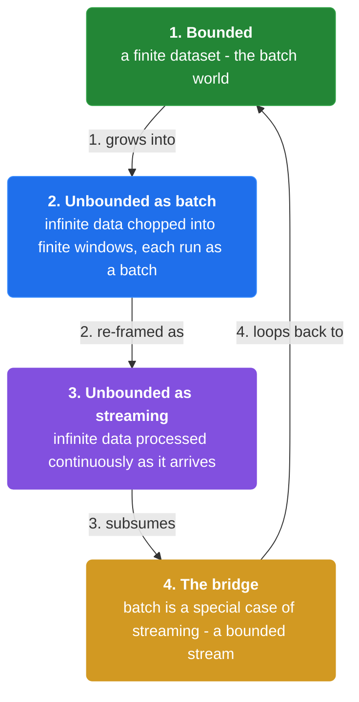

1. **Bounded data** — A finite dataset — one day of logs, a database snapshot. **You can process it to completion; when the job ends you have a final answer.** Classic batch engines (MapReduce) assume this shape.

2. **Unbounded data, processed as batch** — Data that never ends, but the pipeline artificially slices it into finite chunks (a day at a time) and runs a batch over each chunk. **The cost: a change is reflected only at the next chunk boundary — up to a day late.**

3. **Unbounded data, processed as streaming** — Process every event as it arrives, continuously, with no artificial end. **This is what the book means by streaming — the engine is built for infinite datasets, and answers are always "as complete as the watermark says".**

4. **Streaming is the generalization** — Batch is a special case of streaming: a bounded dataset is just an unbounded one that happens to stop. **A model that handles unbounded data well (the Beam model) therefore also handles batch — one abstraction for both.**

```java
// DATA SERVER SIDE — the same click pipeline over three input shapes; only the unbounded-streaming shape gives a live answer
// DEF: bounded — a finite dataset, e.g. one day of clicks = 86,400 events, processed to a final answer
// DEF: unbounded batched — clicks sliced into 1-day chunks, each chunk run as a batch at midnight
// DEF: unbounded streaming — every click processed as it arrives, no artificial boundary
// -> click : {user: 42, url: "/shoe/x", ts: "12:00:59"}
//    step 1 · bounded : the click joins an 86,400-event file; count : 0 -> 1 at end-of-day   BECAUSE the whole day must finish first
//    step 2 · unbounded batched : the click waits for the midnight boundary; count : 0 -> 1 at the boundary   BECAUSE results lag by up to 24h
//    step 3 · unbounded streaming : the click is counted on arrival; count : 0 -> 1 in seconds   BECAUSE no artificial boundary is waited on
// <- answer : "clicks at 12:00" = 1 in all three shapes; only the streaming shape reports it live
//    derivation : batch latency = up to 1 chunk = 24h; streaming latency = the watermark wait = ~ minutes
```


## System Design Interview

> **The question:** Design a real-time clicks-per-minute dashboard. Use case: ops watches live click counts. Premise: each click is stamped with its event time, but the network delays it by minutes, so a click at 12:00:59 processed at 12:04:11 must land in the 12:00 window (event time), not 12:04.

**The pipeline:** writer (event producer) -> transport (unbounded stream) -> collector (processor) -> aggregator/store (window state) -> reader (dashboard)

### writer (event producer)

_Role: writer — stamps events with event time_

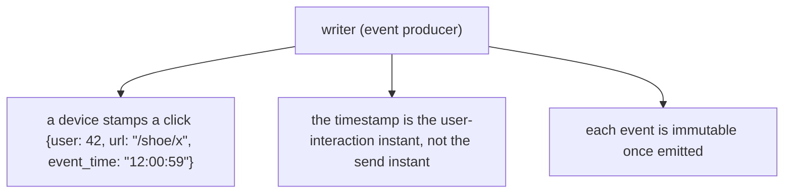

### transport (unbounded stream)

_Role: transport — carries events and delays them_

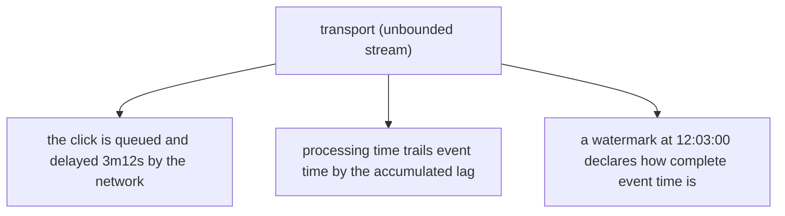

### collector (processor)

_Role: collector — reads events and assigns buckets_

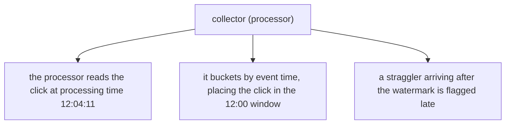

### aggregator/store (window state)

_Role: aggregator/store — holds per-window counts_

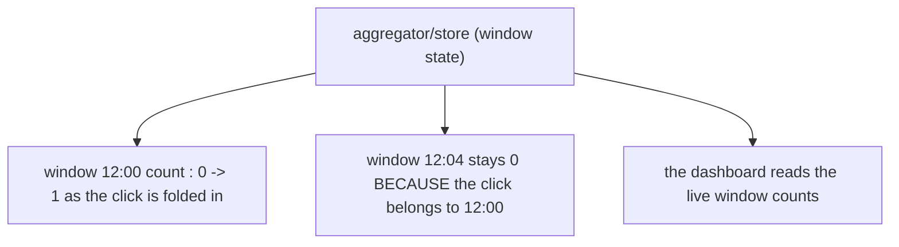

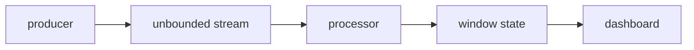

```java
// SYSTEM DESIGN — a producer emits a click, the stream delays it, the processor buckets by event time, the dashboard reads the count
// DEF: click — the immutable event {user: 42, url: "/shoe/x", event_time: "12:00:59"}
// DEF: watermark — the stream's completeness signal = 12:03:00
// DEF: window — an event-time bucket that aggregates the count of events inside it
// STATE (before):
//    window_state : { "12:00": 0, "12:04": 0 }
// -> input : producer emits click {user: 42, url: "/shoe/x", event_time: "12:00:59"}
//    step 1 · the stream queues the click -> processing_time : 12:00:59 -> 12:04:11   BECAUSE the network delayed it
//    step 2 · the processor buckets by event time -> window_state["12:00"] : 0 -> 1
//    step 3 · the processor keys the dashboard read -> window_state["12:04"] : 0 -> 0, unchanged   BECAUSE event time, not processing time, is the key
// <- outcome : the dashboard reads window_state["12:00"] = 1   BECAUSE the click was keyed to when it happened
//    derivation : lag = 12:04:11 - 12:00:59 = 3m12s   BECAUSE processing time trails event time
```

## Interview Questions

### Q1

A dashboard shows clicks per minute, but under a traffic spike the numbers shift into the wrong minutes — a click that happened at 12:00:59 lands in the 12:04 bucket because the pipeline was busy.

**Interviewer's question:** Which clock should the dashboard bucket by, and why?

**Solution:** Bucket by event time, not processing time, so a click is grouped by when it happened rather than when the busy pipeline happened to see it.

**System-design components:**
- Event time — when the click happened
- Processing time — when the pipeline observed it
- Lag — the gap between the two clocks

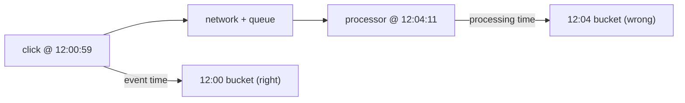

```java
// the click carries two timestamps
//   event_time    = 12:00:59  (the user's real click time)
//   processing_time = 12:04:11 (when the busy pipeline saw it)
// bucket by processing_time -> the click lands at 12:04 -> wrong
// bucket by event_time      -> the click lands at 12:00 -> right
```

_This is exactly the Event time vs Processing time distinction in this chapter._

_Covers:_ 2. Event time · 3. Processing time · 4. Event vs processing time

_From the 28 problems:_ 20-metrics-monitoring · 21-ad-click-aggregation

### Q2

A team runs a daily ETL job over a click stream. A fraud alert that should fire the moment a card is used instead fires the next morning, because every answer waits for the midnight batch boundary.

**Interviewer's question:** What is the shape of this data, and what changes if it is processed as a stream instead of batch?

**Solution:** The data is unbounded but processed as batch, so results lag by up to one chunk. Processing it as a stream removes the artificial boundary and reflects each event as it arrives.

**System-design components:**
- Unbounded data — never completes
- Batch chunk — the artificial 24h boundary
- Streaming — process each event on arrival

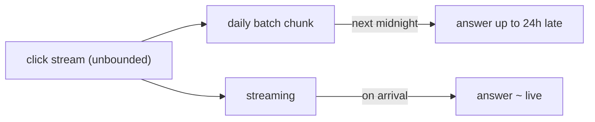

```java
// unbounded-as-batch : slice into 1-day chunks, run a job per chunk
//   -> a change is reflected only at the next chunk boundary (up to 24h)
// unbounded-as-streaming : process each event on arrival
//   -> no artificial boundary, latency ~ watermark wait
```

_This is exactly the Three shapes of data distinction in this chapter._

_Covers:_ 5. Bounded data · 6. Unbounded as batch · 7. Unbounded as streaming

_From the 28 problems:_ 21-ad-click-aggregation · 20-metrics-monitoring

## Key Concepts

### The Problem

**1. "Streaming" means too many things.** The book fixes the term to one meaning: an engine designed for infinite datasets, applied to data that arrives gradually and never completes.


### The Solution

Event time is the time at which an event actually occurred, as stamped by the producing system.


### Key Facts

| Fact | Detail | In the wild |
|---|---|---|
| 2. Event time | Event time is the time at which an event actually occurred, as stamped by the producing system. | A device timestamp on a mobile click is event time. |
| 3. Processing time | Processing time is the time at which the processing system observes an event. | A Flink operator wall-clock timestamp is processing time. |
| 5. Bounded data | Bounded data is a finite, complete dataset such as a day of logs or a database snapshot. | A nightly Hive table scan is bounded data processing. |
| 7. Unbounded as streaming | Unbounded data processed as streaming handles each event continuously, with results always "complete up to the watermark". | A Kafka-to-Flink pipeline is unbounded streaming. |
| 8. Batch is a special case of streaming | A bounded dataset is just an unbounded dataset that stops, so a streaming model generalizes batch for free. | Apache Beam runs the same pipeline on batch and streaming runners. |
| 4. Event vs processing time | Event time measures the user; processing time measures the pipeline — and network delay, queueing, and replay keep them apart. | Event-time mode in Flink is the production fix for this divergence. |
| 6. Unbounded as batch | Unbounded data processed as batch divides the stream into finite chunks and runs a batch job per chunk, so results lag by up to one chunk. | Daily ETL over a click stream is unbounded-as-batch. |


### Tradeoffs & When

- Event time measures the user; processing time measures the pipeline — and network delay, queueing, and replay keep them apart.
- Unbounded data processed as batch divides the stream into finite chunks and runs a batch job per chunk, so results lag by up to one chunk.


### Real-World Examples

- **Apache Flink** — Stream processor with first-class event-time and watermark support
- **Apache Kafka** — The unbounded transport that makes streams concrete
- **Apache Beam** — Unified model over batch and streaming runners
- **MapReduce** — The classic bounded-data batch engine


<details><summary>All concepts (index)</summary>

### Why: 1. "Streaming" means too many things

**Why.** If "streaming" can mean real-time, low latency, event-driven, or merely not-batch, then a team can agree on a word and still disagree on the system they are building.

**Claim.** The book fixes the term to one meaning: an engine designed for infinite datasets, applied to data that arrives gradually and never completes.

**Grounding.** The whole book is the answer to what/where/when/how for that one definition.

**In the wild.** A Flink job over a Kafka topic is streaming in this precise sense.

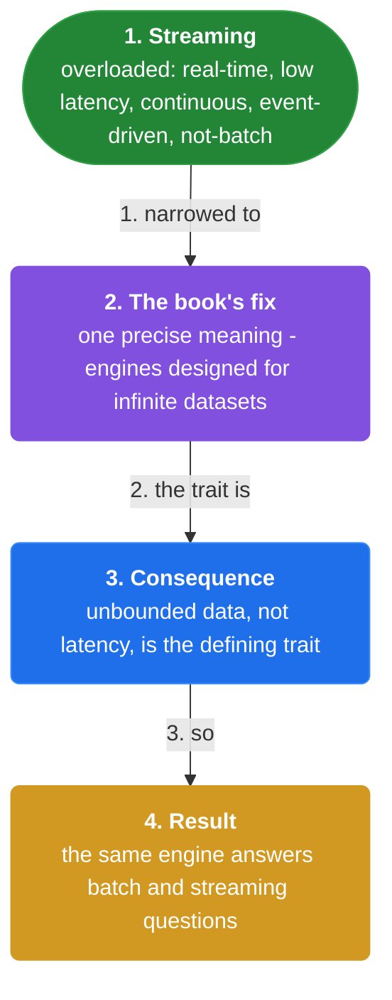
### Definition: 2. Event time

**Why.** Every business question is about when things happened, so the pipeline must record and reason with that instant rather than the instant it looked.

**Claim.** Event time is the time at which an event actually occurred, as stamped by the producing system.

**Grounding.** It is the correct key for "clicks per minute", "latency", and correctness.

**In the wild.** A device timestamp on a mobile click is event time.

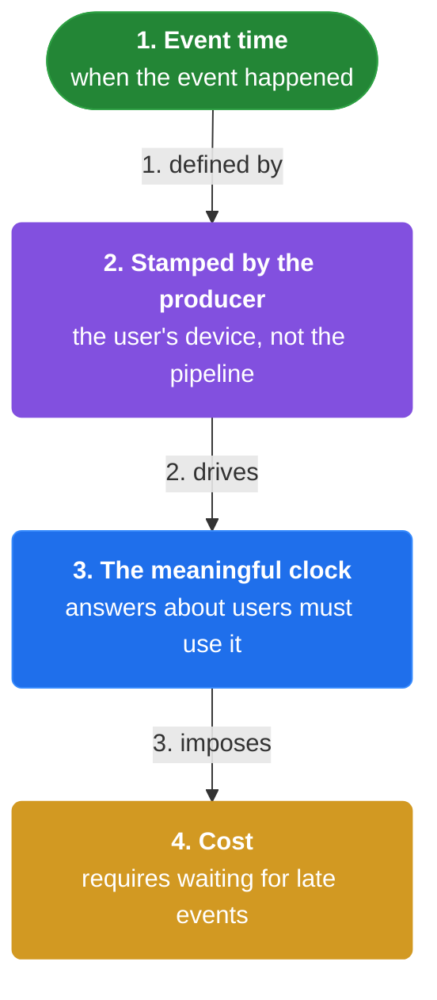
### Definition: 3. Processing time

**Why.** The system still needs its own clock to answer questions about itself, even though it is the wrong clock for user behavior.

**Claim.** Processing time is the time at which the processing system observes an event.

**Grounding.** It is correct only for system questions — queue depth, events processed per second.

**In the wild.** A Flink operator wall-clock timestamp is processing time.

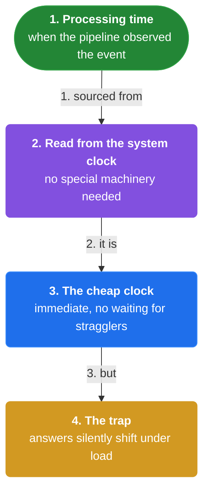
### Distinction: 4. Event vs processing time

**Why.** Bucketing by the wrong clock silently corrupts every aggregate, and the corruption worsens exactly when the system is under load.

**Claim.** Event time measures the user; processing time measures the pipeline — and network delay, queueing, and replay keep them apart.

**Grounding.** A click at 12:00:59 processed at 12:04:11 lands in different windows under the two clocks.

**In the wild.** Event-time mode in Flink is the production fix for this divergence.

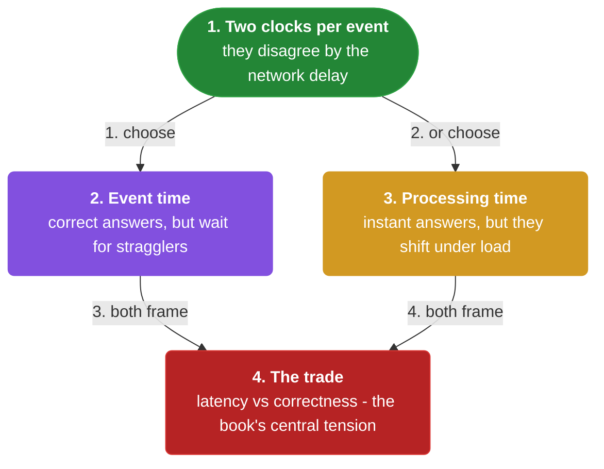
### Shape: 5. Bounded data

**Why.** Finite inputs are the one case where a job can run to completion and hand back a final answer, so they are the natural fit for classic batch.

**Claim.** Bounded data is a finite, complete dataset such as a day of logs or a database snapshot.

**Grounding.** MapReduce and friends assume this shape.

**In the wild.** A nightly Hive table scan is bounded data processing.

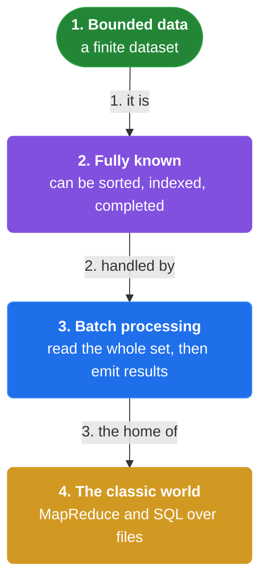
### Shape: 6. Unbounded as batch

**Why.** Teams slice never-ending data into chunks because batch tooling is familiar, but the chunk boundary becomes the maximum freshness of every answer.

**Claim.** Unbounded data processed as batch divides the stream into finite chunks and runs a batch job per chunk, so results lag by up to one chunk.

**Grounding.** A daily aggregation reflects a change only at the next midnight.

**In the wild.** Daily ETL over a click stream is unbounded-as-batch.

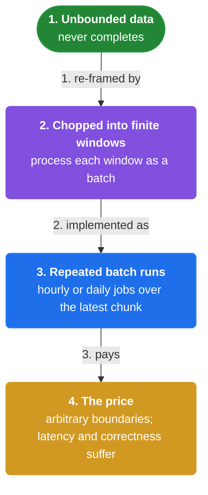
### Shape: 7. Unbounded as streaming

**Why.** When a change must be visible in seconds, the only option is to process each event as it arrives and give up the idea of a finished answer.

**Claim.** Unbounded data processed as streaming handles each event continuously, with results always "complete up to the watermark".

**Grounding.** The engine is designed for infinite datasets from the start.

**In the wild.** A Kafka-to-Flink pipeline is unbounded streaming.

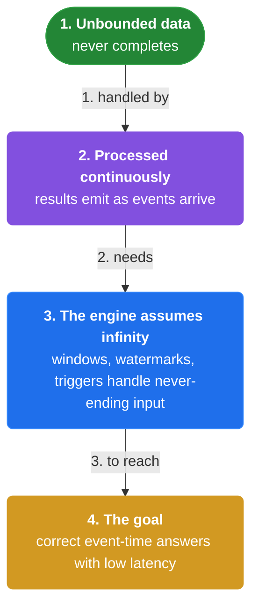
### Model: 8. Batch is a special case of streaming

**Why.** If one abstraction covers both finite and infinite inputs, you maintain one pipeline instead of two that must agree.

**Claim.** A bounded dataset is just an unbounded dataset that stops, so a streaming model generalizes batch for free.

**Grounding.** The Beam model treats both with one what/where/when/how vocabulary.

**In the wild.** Apache Beam runs the same pipeline on batch and streaming runners.

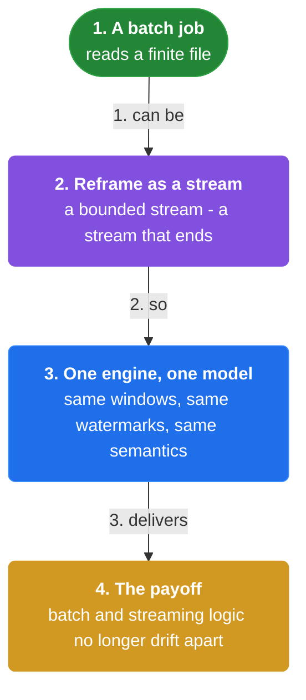

</details>


## Quiz

1. What precise meaning does the book give to 'streaming'?

   - A. Any program that is not batch
   - B. A data processing engine designed with infinite datasets in mind, applied to unbounded data that arrives gradually and never completes
   - C. A synonym for low latency
   - D. A synonym for event-driven architecture

<details><summary>Reveal answer</summary>

**B.** The book fixes 'streaming' to one meaning — an engine for infinite datasets — rather than letting it mean merely 'fast' or 'not batch'.

</details>

2. Which timestamp should a clicks-per-minute dashboard key on?

   - A. Processing time
   - B. Event time
   - C. Ingestion time
   - D. Server wall-clock time

<details><summary>Reveal answer</summary>

**B.** Business questions are about when things happened, so event time is the correct key; processing time measures the pipeline, not the user.

</details>

3. What is the cost of unbounded data processed as batch?

   - A. Higher throughput
   - B. Results lag by up to one chunk boundary
   - C. It cannot scale
   - D. It loses events

<details><summary>Reveal answer</summary>

**B.** Slicing a never-ending stream into fixed chunks means a change is reflected only at the next boundary.

</details>

4. How does batch relate to streaming in the Beam model?

   - A. They are unrelated
   - B. Batch is a special case of streaming — a bounded dataset is an unbounded one that stops
   - C. Streaming is a special case of batch
   - D. Batch always outperforms streaming

<details><summary>Reveal answer</summary>

**B.** One model handles both: bounded data is just unbounded data that happens to end.

</details>

5. Why do event time and processing time diverge?

   - A. They never diverge
   - B. Network delay, queueing, backpressure, and replay keep them apart
   - C. Because of clock drift only
   - D. Because event time is measured in a different timezone

<details><summary>Reveal answer</summary>

**B.** The gap is caused by everything between the producer and the processor: network, queues, and replays.

</details>

