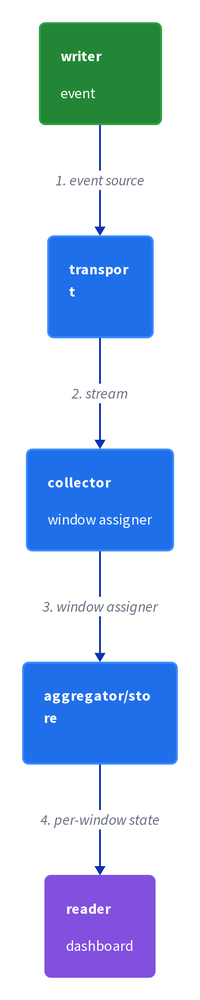
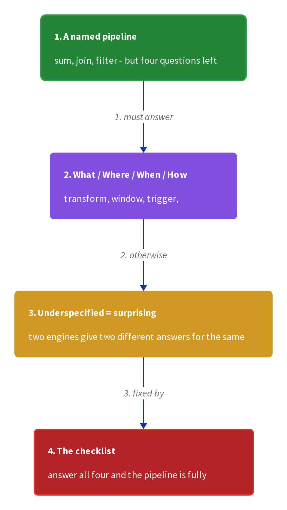
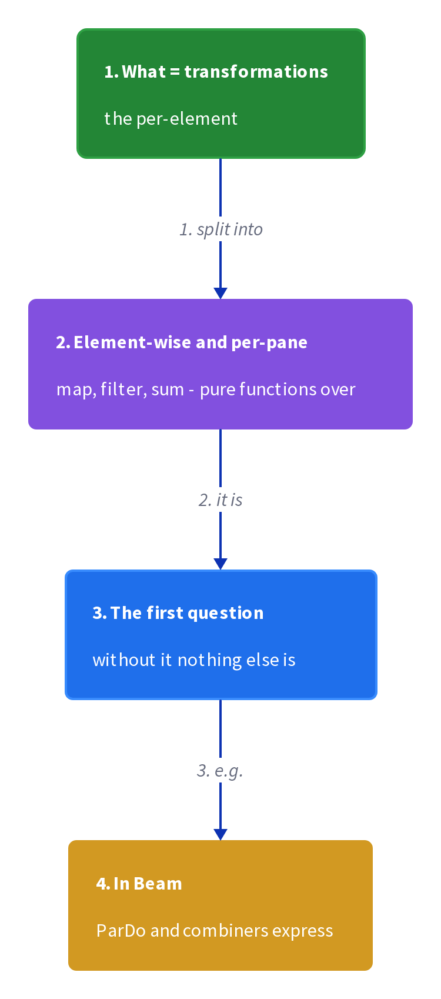
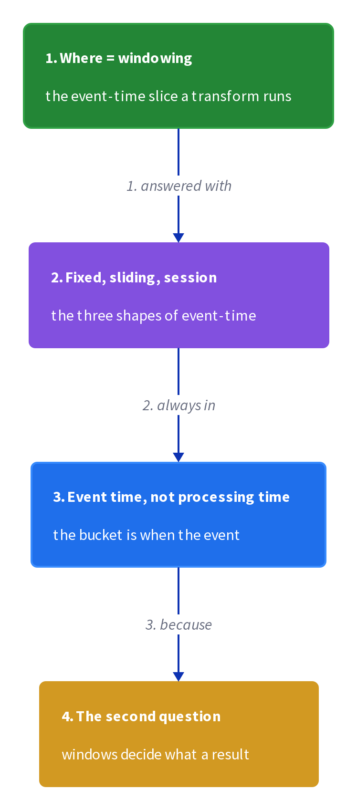
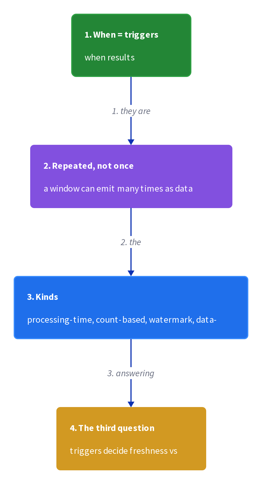
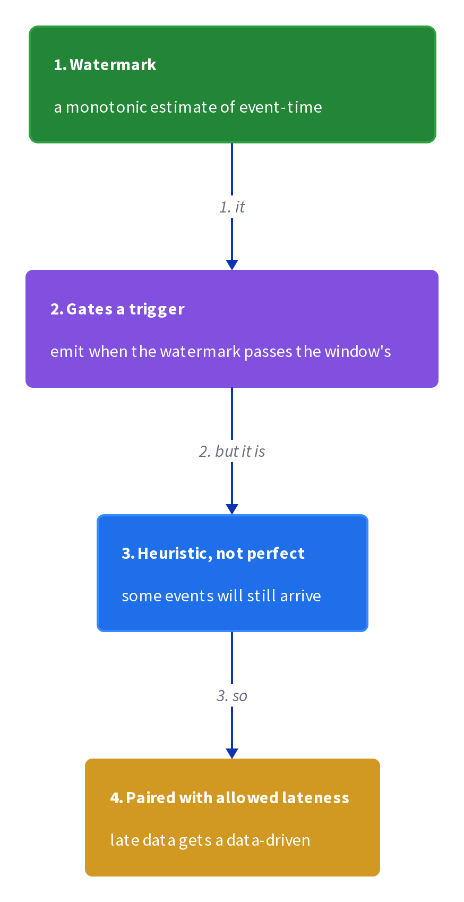
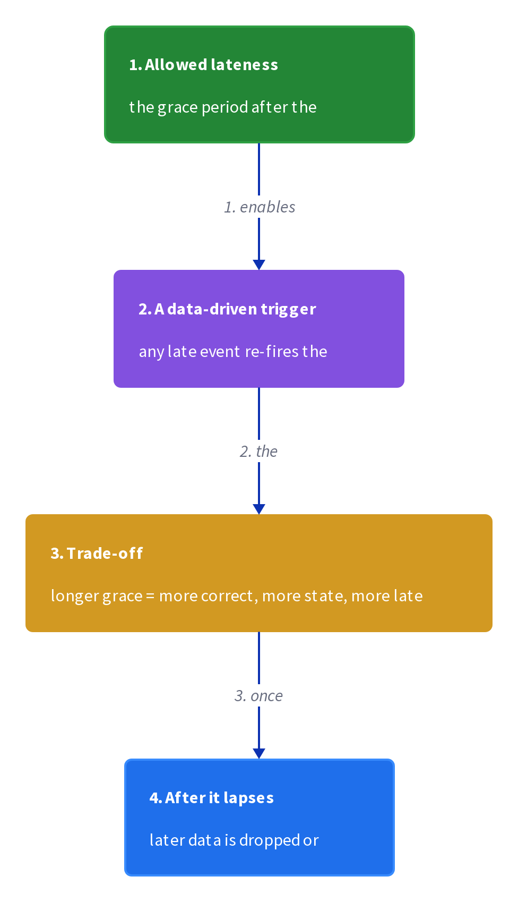
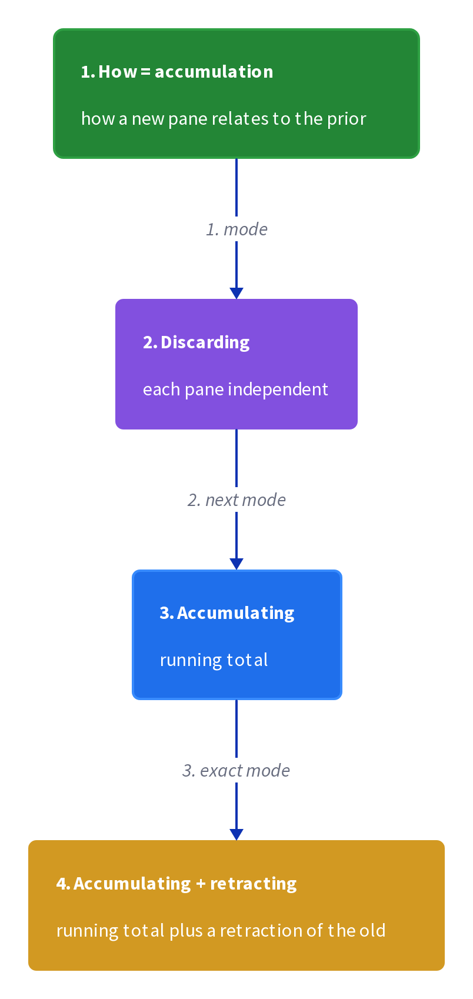
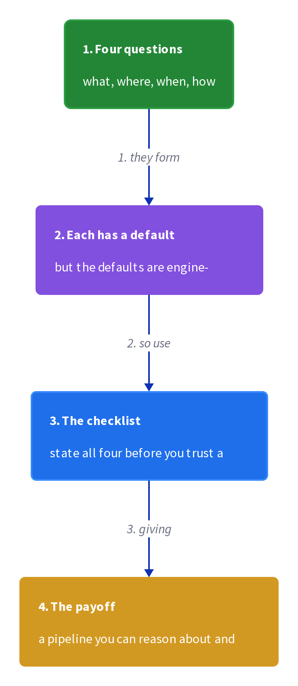

# Chapter 2: The What, Where, When, and How of Data Processing

> The four questions that completely describe any pipeline: what results are computed (transformations), where in event time they are computed (windowing), when in processing time they are materialized (triggers + watermarks), and how later refinements relate to earlier results (accumulation).

_Also known as: SS Ch02 · Beam Model · Transformations · Windowing · Triggers · Watermarks · Accumulation_

## Flow

### What and Where — transformations and windowing

> **Why this matters:** Before anything can be said about correctness or latency, a pipeline must say what it computes and over which slice of event time, so this section fixes those two axes first.

1. **What: transformations** — The answer to "what" is a computation over the data — a sum, a filter, a join, a keyed aggregation. In the Beam model **a pipeline is a directed acyclic graph of transforms, and the transform decides what the output is.**

2. **Where: windowing** — The answer to "where" is the slice of event time a value is computed over. **Windowing cuts an unbounded stream into finite, event-time-aligned pieces** — fixed windows, sliding windows, session windows — so an aggregate has a well-defined boundary.

3. **The two axes are independent** — Choosing what to compute and choosing where to compute it are separate decisions. **You can sum per fixed window, per session, or over all time — the transform is the same, the window changes the grouping.**

4. **Batch already answers what and where** — A classic MapReduce job also has transformations and (implicitly) windowing — the input file is one big fixed window. **The streaming model makes the window explicit and unbounded.**

```java
// DATA SERVER SIDE — one keyed sum computed over two different window shapes gives two different answers
// DEF: transform — the "what": sum the value of each click, keyed by user
// DEF: window — the "where": the event-time slice the sum is computed over
// -> click : {user: 42, amount: 10, event_time: "12:04:00"}
//    step 1 · fixed 5-min window : the click falls in [12:00, 12:05) -> sum42 : 0 -> 10
//    step 2 · session window (30-min gap) : the click opens a new session -> sessions42 : [] -> [s1]
//    step 3 · all-time window : the click is added to the single global sum -> total : 0 -> 10
// <- answer : sum(42) = 10 in every window shape, but the boundary that will later trigger output differs
//    derivation : fixed window = 5 min = 300 s   BECAUSE fixed windows are equal, non-overlapping spans
```

### When — triggers and watermarks

> **Why this matters:** A window is useless until the pipeline decides when to emit its result, and that "when" is a processing-time decision driven by triggers and watermarks, so this section covers the timing machinery that the rest of the book leans on.

1. **Triggers decide when results materialize** — A trigger is the mechanism that says "emit the current window result now". **Triggers can fire on processing time (every N seconds), on event-time progress (the watermark passes the window end), or on data arrival (count of elements).**

2. **Watermarks declare event-time completeness** — A watermark is a signal that "no more events with event time earlier than t will arrive". **It is the pipeline's best estimate of how complete the event-time axis is, and it lets a trigger close a window.**

3. **Early, on-time, and late triggers** — A pipeline can emit a window's result **early** (speculative, before the watermark), **on-time** (when the watermark passes the window end), and **late** (after the watermark, for stragglers). Each is a separate trigger.

4. **Allowed lateness bounds the waiting** — After the watermark passes, a pipeline may keep accepting stragglers for an "allowed lateness" horizon, then discard them. **Allowed lateness is garbage collection for window state — it bounds how long late data can still update a result.**

```java
// STREAM SIDE — one window emits three times as time advances; the watermark drives on-time, allowed lateness bounds the rest
// DEF: watermark — "no events with event_time < t will arrive"; current value = 12:05:00
// DEF: allowed lateness — how long after the watermark a window still accepts stragglers = 1 min
// DEF: trigger — the rule that emits the window result = on-time at the watermark
// -> window : fixed [12:00, 12:05), sum so far = 3 clicks
//    step 1 · early trigger fires at 12:02 -> emitted : {window: "12:00-12:05", sum: 3, pane: "early"}
//    step 2 · watermark passes 12:05:00 -> on-time trigger fires -> emitted : {window: "12:00-12:05", sum: 3, pane: "on-time"}
//    step 3 · a straggler {event_time: "12:04:59"} arrives at 12:06:00 -> inside allowed lateness -> sum : 3 -> 4, late pane emitted
// <- answer : sum = 4 after the late pane, but 3 until it   BECAUSE allowed lateness kept the window alive for 1 min past the watermark
//    derivation : late arrival age = 12:06:00 - 12:04:59 = 1m01s, still <= allowed lateness 1 min? 61s > 60s -> it would be dropped instead
```

### How — accumulation

> **Why this matters:** When a window emits more than once, the consumer must know whether each result replaces or refines the previous one, so this section covers the four accumulation modes that relate later panes to earlier ones.

1. **Accumulation relates panes** — The answer to "how" is the relationship between a window's successive results. **Accumulating mode adds to the previous pane; discarding mode replaces it; accumulating-and-retracting also emits a retraction so downstream can undo the old value.**

2. **Why retractions exist** — If a downstream system stores the first result, a later refined result would double-count unless the old value is retracted. **Accumulating-and-retracting emits the delta and a retraction of the previous pane, so a sink can stay correct.**

3. **The four questions are a checklist** — Ask all four — what, where, when, how — of any pipeline and its behavior is fully specified. **Omit "when" and you cannot reason about latency; omit "how" and you cannot reason about correctness under refinement.**

```java
// DATA SERVER SIDE — one window emits twice; the accumulation mode decides whether the sink's total is 3, 4, or 7
// DEF: pane — one emitted result for the window; pane1 = {sum: 3}, pane2 = {sum: 4}
// DEF: sink — the downstream store that persists the window result; here keyed by window id "12:00-12:05"
// DEF: retraction — a signal that undoes pane1 so a sink can subtract it
// STATE (before):
//    sink_total : { "12:00-12:05": 0 }
// -> input : window [12:00, 12:05) emits pane1 {sum: 3}, then a late event raises it to pane2 {sum: 4}
//    step 1 · accumulating mode -> sink_total["12:00-12:05"] : 0 -> 3, then 3 -> 7   BECAUSE each pane adds to the previous
//    step 2 · discarding mode -> sink_total["12:00-12:05"] : 0 -> 3, then 3 -> 4   BECAUSE pane2 replaces pane1
//    step 3 · accumulating-and-retracting mode -> sink_total["12:00-12:05"] : 0 -> 3, then 3 -> 4 via -3 +4   BECAUSE the retraction undoes pane1 before pane2 lands
// <- correct total : 4 in discarding and retracting modes, 7 in accumulating   BECAUSE 7 double-counts the same window's two panes
//    derivation : retracting total = 3 - 3 + 4 = 4   BECAUSE the retraction subtracts the old pane exactly once
```


## System Design Interview

> **The question:** Design a purchase-counting pipeline that answers what, where, when, and how for one result. Premise: a purchase arrives late, so the pipeline must close the window on the watermark and let allowed lateness correct the already-emitted count.

**The pipeline:** writer (event source) -> transport (stream) -> collector (window assigner) -> aggregator/store (per-window state) -> reader (dashboard)

<a href="../diagrams/d2/decomp/ch02-0.png"></a>

### writer (event source)

_Role: writer — emits events with event time_

- a purchase event {user: 42, amount: 10, event_time: "12:04:00"} is emitted
- event time is stamped by the source, not the pipeline
- events are immutable once produced

### transport (stream)

_Role: transport — carries events and computes the watermark_

- the stream delivers the event and tracks the watermark = 12:05:00
- the watermark says no events earlier than 12:05:00 will arrive
- network delay keeps the watermark behind the wall clock

### collector (window assigner)

_Role: collector — assigns events to event-time windows_

- the window assigner places the event in fixed window [12:00, 12:05)
- a trigger decides when the window result is emitted
- allowed lateness keeps the window open for stragglers

### aggregator/store (per-window state)

_Role: aggregator/store — holds the running sum per window_

- window [12:00, 12:05) sum : 0 -> 10 as the purchase folds in
- an early pane emits {sum: 10}, an on-time pane re-emits {sum: 10}
- a late straggler updates sum : 10 -> 20 if inside allowed lateness

```java
// SYSTEM DESIGN — a purchase flows through a fixed window; the watermark closes it on time, allowed lateness catches a straggler
// DEF: purchase — the event {user: 42, amount: 10, event_time: "12:04:00"}
// DEF: window — the fixed event-time slice [12:00, 12:05)
// DEF: watermark — completeness signal = 12:05:00
// STATE (before):
//    window_state : { "12:00-12:05": 0 }
// -> input : the source emits purchase {user: 42, amount: 10, event_time: "12:04:00"}
//    step 1 · the window assigner places it -> window_state["12:00-12:05"] : 0 -> 10   BECAUSE event time 12:04:00 is inside the window
//    step 2 · the watermark reaches 12:05:00 -> the on-time trigger fires -> emitted {sum: 10}
//    step 3 · a straggler {event_time: "12:04:59"} arrives -> window_state["12:00-12:05"] : 10 -> 20   BECAUSE allowed lateness still accepts it
// <- outcome : the dashboard shows 10 on-time, then 20 after the late pane   BECAUSE accumulation refines the earlier result
//    derivation : the window spans 12:05:00 - 12:00:00 = 5 min   BECAUSE fixed windows are equal spans
```

## Interview Questions

### Q1

A real-time dashboard sums purchases per 5-minute window, but it can't say whether a number is final — an event that happened at 12:04 can still arrive after the window was shown.

**Interviewer's question:** How do you decide when a window's result is ready to emit, and what do you do about events that arrive later?

**Solution:** Use a watermark to declare event-time completeness; emit on-time when the watermark passes the window end, and keep the window alive for an allowed-lateness horizon so late events can update the result.

**System-design components:**
- Fixed window — the event-time slice
- Watermark — completeness signal
- On-time trigger — fires at the watermark
- Allowed lateness — bounds late updates

```java
// window [12:00,12:05), sum = 3
//   watermark 12:05:00 -> on-time trigger -> emit {sum:3}
//   straggler event_time 12:04:59 at 12:06 -> allowed lateness 1 min
//     -> update sum 3->4, emit late pane {sum:4}
//   beyond allowed lateness -> drop the straggler
```

_This is exactly the When (triggers + watermarks) and How (accumulation) material in this chapter._

_Covers:_ 4. Triggers (when) · 5. Watermarks · 6. Allowed lateness · 7. Accumulation (how)

_From the 28 problems:_ 21-ad-click-aggregation · 20-metrics-monitoring

### Q2

Two teams build 'the same' streaming aggregation, but one emits a running total and the other replaces each number — downstream sums them and double-counts.

**Interviewer's question:** What axis did the teams fail to specify, and how do you fix the double-count?

**Solution:** They failed to specify the accumulation mode (how). Use accumulating-and-retracting so each refined pane retracts the previous value before adding the new one.

**System-design components:**
- Accumulation mode — how panes relate
- Retraction — undo the previous pane
- Sink — applies retractions correctly

```java
// accumulating : sink = 3 then 3+4 = 7 -> double counts
// retracting  : pane1 {sum:3} -> retract -> pane2 {sum:4}
//   sink sees 3, then -3 +4 = 4 -> correct
```

_This is exactly the How (accumulation) axis in this chapter._

_Covers:_ 7. Accumulation (how) · 8. The four-question checklist

_From the 28 problems:_ 21-ad-click-aggregation

## Key Concepts

### The Problem

**1. Pipelines are underspecified.** A pipeline is fully specified only when it answers what, where, when, and how.


### The Solution

Transformations are the computations — sum, filter, join, keyed aggregation — applied to the data.

```java
// window [12:00,12:05), sum = 3
//   watermark 12:05:00 -> on-time trigger -> emit {sum:3}
//   straggler event_time 12:04:59 at 12:06 -> allowed lateness 1 min
//     -> update sum 3->4, emit late pane {sum:4}
//   beyond allowed lateness -> drop the straggler
```


### Key Facts

| Fact | Detail | In the wild |
|---|---|---|
| 2. Transformations (what) | Transformations are the computations — sum, filter, join, keyed aggregation — applied to the data. | A Beam ParDo or a Flink map/keyBy/sum is a transform. |
| 3. Windowing (where) | Windowing cuts the stream into finite, event-time-aligned pieces — fixed, sliding, or session windows. | A 5-minute fixed window in Flink is a windowing choice. |
| 4. Triggers (when) | Triggers decide when a window's result materializes — on processing time, on the watermark, or on element count. | Flink's trigger API fires on watermark passage by default. |
| 5. Watermarks | A watermark is the statement "no more events with event time earlier than t will arrive". | Flink and Dataflow watermarks are the production completeness signal. |
| 6. Allowed lateness | Allowed lateness is the horizon after the watermark during which a window still accepts and updates late events. | Dataflow's allowed-lateness setting is the production form. |
| 7. Accumulation (how) | Accumulation modes — accumulating, discarding, accumulating-and-retracting — define how later panes relate to earlier ones. | Beam's accumulation modes are the production expression of "how". |
| 8. The four-question checklist | Ask what, where, when, and how of every pipeline, and its behavior is fully specified. | The book's recurring worked example (team score over sessions) is defined by exactly these four answers. |


### Tradeoffs & When

- Ask what, where, when, and how of every pipeline, and its behavior is fully specified.


### Real-World Examples

- **Apache Beam** — Exposes what/where/when/how as PTransform, Window, Trigger, AccumulationMode
- **Apache Flink** — Event-time windows with watermark-driven triggers
- **Google Cloud Dataflow** — Fully managed Beam runner with watermarks and allowed lateness


<details><summary>All concepts (index)</summary>

### Why: 1. Pipelines are underspecified

**Why.** Two teams can build "the same" pipeline that behaves differently because one never said when results emit or how later results relate to earlier ones.

**Claim.** A pipeline is fully specified only when it answers what, where, when, and how.

**Grounding.** The four questions are the Beam model's complete description of a pipeline.

**In the wild.** Beam's PTransform (what), Window (where), Trigger (when), and AccumulationMode (how) map one-to-one onto the four questions.

<a href="../diagrams/d2/card/ch02-0.png"></a>
### Axis: 2. Transformations (what)

**Why.** The output of a pipeline is whatever its transforms compute, so the transform is the first thing a design must pin down.

**Claim.** Transformations are the computations — sum, filter, join, keyed aggregation — applied to the data.

**Grounding.** A pipeline is a DAG of transforms in the Beam model.

**In the wild.** A Beam ParDo or a Flink map/keyBy/sum is a transform.

<a href="../diagrams/d2/card/ch02-1.png"></a>
### Axis: 3. Windowing (where)

**Why.** An unbounded stream has no natural boundary, so aggregates need an explicit event-time slice to be well-defined.

**Claim.** Windowing cuts the stream into finite, event-time-aligned pieces — fixed, sliding, or session windows.

**Grounding.** The window is the "where" an aggregate is computed over.

**In the wild.** A 5-minute fixed window in Flink is a windowing choice.

<a href="../diagrams/d2/card/ch02-2.png"></a>
### Axis: 4. Triggers (when)

**Why.** Without a trigger a window result sits unemitted forever, so the pipeline must name the processing-time conditions that fire output.

**Claim.** Triggers decide when a window's result materializes — on processing time, on the watermark, or on element count.

**Grounding.** Early, on-time, and late are three trigger points for the same window.

**In the wild.** Flink's trigger API fires on watermark passage by default.

<a href="../diagrams/d2/card/ch02-3.png"></a>
### Signal: 5. Watermarks

**Why.** The pipeline needs a signal for how complete event time is before it can safely close a window.

**Claim.** A watermark is the statement "no more events with event time earlier than t will arrive".

**Grounding.** The watermark passing a window's end is what makes an on-time trigger fire.

**In the wild.** Flink and Dataflow watermarks are the production completeness signal.

<a href="../diagrams/d2/card/ch02-4.png"></a>
### Bound: 6. Allowed lateness

**Why.** After the watermark passes, late data still exists, and the pipeline must bound how long it keeps window state around for stragglers.

**Claim.** Allowed lateness is the horizon after the watermark during which a window still accepts and updates late events.

**Grounding.** Beyond it, stragglers are dropped — it is garbage collection for window state.

**In the wild.** Dataflow's allowed-lateness setting is the production form.

<a href="../diagrams/d2/card/ch02-5.png"></a>
### Mode: 7. Accumulation (how)

**Why.** A window that emits early and on-time produces multiple panes, and downstream must know if each pane adds to or replaces the last.

**Claim.** Accumulation modes — accumulating, discarding, accumulating-and-retracting — define how later panes relate to earlier ones.

**Grounding.** Retracting mode undoes the previous pane so sinks do not double-count.

**In the wild.** Beam's accumulation modes are the production expression of "how".

<a href="../diagrams/d2/card/ch02-6.png"></a>
### Checklist: 8. The four-question checklist

**Why.** A design review that omits one axis ships a pipeline whose latency or correctness is an accident rather than a decision.

**Claim.** Ask what, where, when, and how of every pipeline, and its behavior is fully specified.

**Grounding.** Omit "when" and latency is unspecified; omit "how" and refinement correctness is unspecified.

**In the wild.** The book's recurring worked example (team score over sessions) is defined by exactly these four answers.

<a href="../diagrams/d2/card/ch02-7.png"></a>

</details>


## Quiz

1. Which four questions fully specify a pipeline in the Beam model?

   - A. Who, what, when, why
   - B. What, where, when, how
   - C. Where, why, which, how
   - D. What, where, when, who

<details><summary>Reveal answer</summary>

**B.** The four axes are what (transformations), where (windowing), when (triggers), and how (accumulation).

</details>

2. What does a watermark declare?

   - A. The exact wall-clock time
   - B. That no more events with event time earlier than t will arrive
   - C. The number of events processed
   - D. The system's CPU load

<details><summary>Reveal answer</summary>

**B.** A watermark is the pipeline's statement of event-time completeness — the threshold past which it expects no older events.

</details>

3. What is allowed lateness?

   - A. A window that never closes
   - B. The horizon after the watermark during which a window still accepts late events
   - C. The maximum event size
   - D. A type of trigger

<details><summary>Reveal answer</summary>

**B.** Allowed lateness bounds how long after the watermark a window keeps accepting and updating with stragglers.

</details>

4. Which accumulation mode avoids double-counting when a window refines an earlier result?

   - A. Discarding
   - B. Accumulating
   - C. Accumulating-and-retracting
   - D. None of the above

<details><summary>Reveal answer</summary>

**C.** Accumulating-and-retracting emits the delta plus a retraction of the previous pane so sinks can undo the old value.

</details>

5. When does an on-time trigger fire?

   - A. When the first event arrives
   - B. When the watermark passes the window end
   - C. Every second
   - D. When the window is empty

<details><summary>Reveal answer</summary>

**B.** On-time emission is driven by the watermark crossing the window's end.

</details>

