# Chapter 2: The What, Where, When, and How of Data Processing

> The four questions that completely describe any pipeline: what results are computed (transformations), where in event time they are computed (windowing), when in processing time they are materialized (triggers + watermarks), and how later refinements relate to earlier results (accumulation).

_Also known as: SS Ch02 · Beam Model · Transformations · Windowing · Triggers · Watermarks · Accumulation_

## Flow

### What and Where — transformations and windowing

> **Why this matters:** Before anything can be said about correctness or latency, a pipeline must say what it computes and over which slice of event time, so this section fixes those two axes first.

1. **What: transformations** — The answer to "what" is a computation over the data — a sum, a filter, a join, a keyed aggregation. In the Beam model **a pipeline is a directed acyclic graph of transforms, and the transform decides what the output is.**

2. **Where: windowing** — The answer to "where" is the slice of event time a value is computed over. **Windowing cuts an unbounded stream into finite, event-time-aligned pieces** — fixed windows, sliding windows, session windows — so an aggregate has a well-defined boundary.

3. **The two axes are independent** — Choosing what to compute and choosing where to compute it are separate decisions. **You can sum per fixed window, per session, or over all time — the transform is the same, the window changes the grouping.**

4. **Batch already answers what and where** — A classic MapReduce job also has transformations and (implicitly) windowing — the input file is one big fixed window. **The streaming model makes the window explicit and unbounded.**

<!-- ch02-whatwhere:begin — generated by tools/gen_ch02.js; do not hand-edit -->

#### Why these are two questions and not one

**WHAT is the computation.** A sum, a count, a max, a filter, a join — in the Beam model, a transform in a directed graph. Hold the window fixed at [12:00, 12:02) and vary only the transform: `sum(v)` gives **19**, `count` gives **4**, `max(v)` gives **7**, `count distinct key` gives **2**. Four answers, same 4 events, and the window was never mentioned.

**WHERE is the slice of event time** each value covers. Windowing cuts an unbounded stream into finite, event-time-aligned pieces. Hold the transform fixed at `sum(v)` and vary only the windowing:

- **global window** — one result: **45**.
- **fixed 120s windows** — 4 results: 19, 11, 7, 8, totalling 45.
- **sliding, 120s wide every 60s** — 7 results, totalling **78**.
- **session windows, 120s gap** — key `a` gets 3 sessions, key `b` gets 2.

Read the sliding row twice. Its results sum to 78 over a dataset containing 45, because each event falls into up to 2 overlapping windows. Nothing was duplicated — **overlap is a property of the windowing**, and partitioning windowings (fixed, global) preserve the total while overlapping ones do not.

**And the two axes are genuinely independent.** Three transforms × three windowings is nine legal pipelines; picking a row constrains no column. So "we sum purchases" leaves the answer undetermined, and so does "we use session windows".

#### When each windowing is the right one, and what batch was doing all along

**Global window** when the question has no time boundary — a lifetime total, a running all-time count. On unbounded input this means state that never retires, so it is rarer than it sounds.

**Fixed windows** when the question names a period: purchases per minute, errors per hour. They partition event time, so results sum to the total — which makes them the easy case to reconcile against a batch job.

**Sliding windows** when you want a smooth moving measure — "revenue over the last 120s, refreshed every 60s". Expect ~2× the output volume, and never compare their sum to the input total.

**Session windows** when the boundary is defined by the DATA, not the clock: a burst of activity separated from the next by a gap of 120s or more. Note these are per key — `a` has 3 sessions while `b` has 2 over the same span, because sessions are a fact about each key's own activity.

**What this does not settle:** when any of these results is emitted. All the numbers above are what the windows eventually contain, and nothing here says when a consumer sees them — or that they might be published more than once. That is "when", and it is the next concept.

A MapReduce job answers both of these questions too: WHAT is the map and reduce, WHERE is the input file — one implicit window over everything. The streaming model does not add questions; it removes the defaults.

#### Visual walkthrough — vary one axis, then the other, then both

The animation loops through all 4 steps. Expand any step to study it on its own.



<details>
<summary><b>Step 1 of 4</b> — WHAT is one choice: the transformation</summary>


Hold the window still and vary the computation: four answers from the same 4 events. That is "what" — a sum, a count, a max, a distinct count. Notice the last row needs the KEY field while the first needs only `v`; the transform decides which fields matter, and still says nothing about where a boundary falls.

</details>
<details>
<summary><b>Step 2 of 4</b> — WHERE is a separate choice: the windowing</summary>

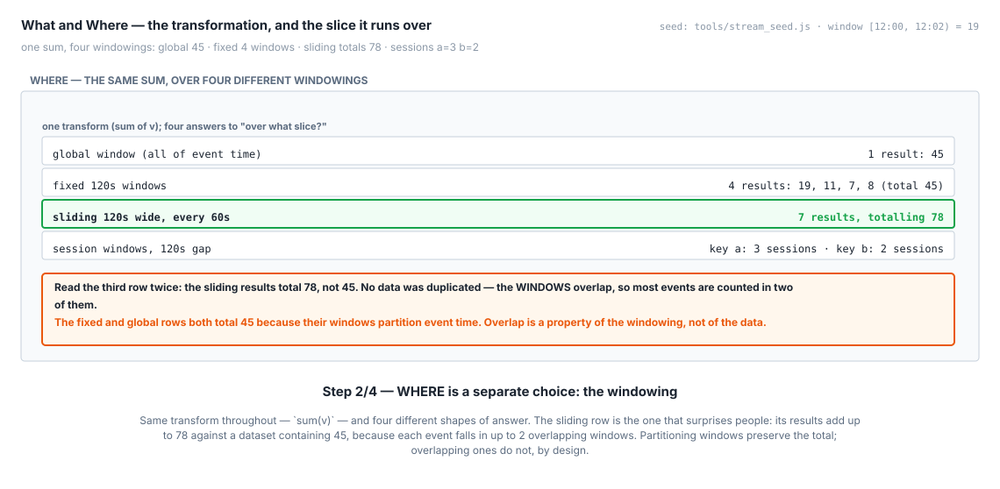

Same transform throughout — `sum(v)` — and four different shapes of answer. The sliding row is the one that surprises people: its results add up to 78 against a dataset containing 45, because each event falls in up to 2 overlapping windows. Partitioning windows preserve the total; overlapping ones do not, by design.

</details>
<details>
<summary><b>Step 3 of 4</b> — the two axes really are independent</summary>

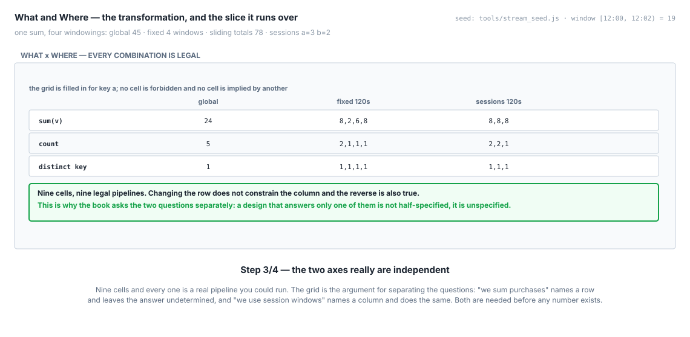

Nine cells and every one is a real pipeline you could run. The grid is the argument for separating the questions: "we sum purchases" names a row and leaves the answer undetermined, and "we use session windows" names a column and does the same. Both are needed before any number exists.

</details>
<details>
<summary><b>Step 4 of 4</b> — batch already answers both — implicitly</summary>

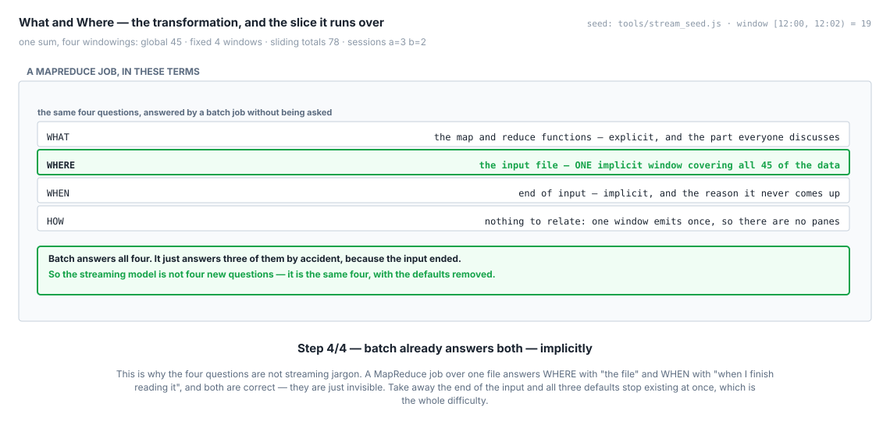

This is why the four questions are not streaming jargon. A MapReduce job over one file answers WHERE with "the file" and WHEN with "when I finish reading it", and both are correct — they are just invisible. Take away the end of the input and all three defaults stop existing at once, which is the whole difficulty.

</details>

<sub>The sliding-window total 78 and every per-window sum are computed from the seed and asserted against the fixed total 45. Generated by `node tools/gen_ch02.js`.</sub>

<!-- ch02-whatwhere:end -->

<!-- ch02-whatwhere-memory:begin — generated by tools/gen_ch02.js; do not hand-edit -->

#### What and Where as two arguments — stack and heap at every step

**What is being answered.** Why "what" and "where" are two questions — as a function that takes them as two arguments.

`assign(events, where)` answers WHERE and names no transform. `compute(grouped, what)` answers WHAT and contains no window rule. Every pipeline in this concept is one call to each, and swapping either argument leaves the other untouched.

Watch the inner loop in step 1: `windowsOf` returns a **list**, so one event can be appended to several windows. That single fact is why `tSliding` reaches 78 against a dataset of 45 — the overlap is in the windowing, not in the data.

The animation steps through the code, holding each line long enough to read the STACK (call frames and their locals) and the HEAP (allocated arrays and objects) as they are AT THAT MOMENT. Expand any step to study it on its own.



<details>
<summary><b>Step 1 of 4</b> — WHERE: an event can belong to MORE THAN ONE window</summary>


`windowsOf(245, "sliding")` returns [180, 240] — 2 windows for ONE event, so the inner loop runs 2 times and id 4's 6 is appended twice. This is the loop that makes the sliding total exceed the data.

</details>
<details>
<summary><b>Step 2 of 4</b> — WHAT: the transform never sees the window rule</summary>

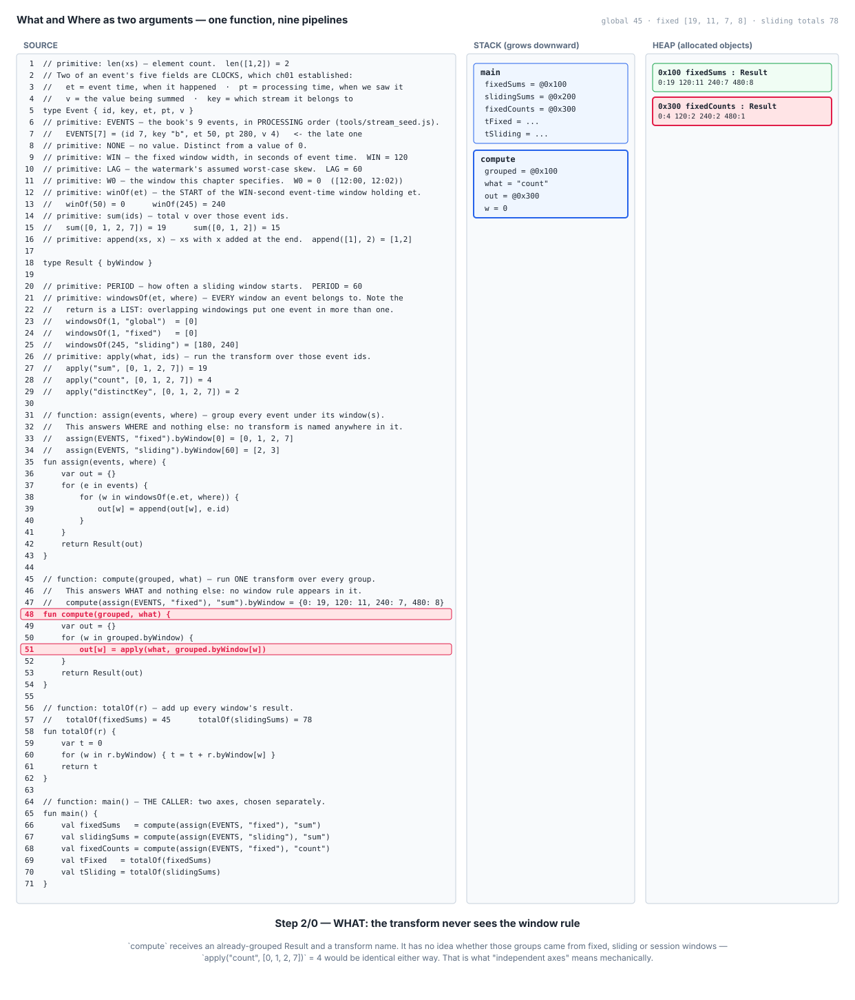

`compute` receives an already-grouped Result and a transform name. It has no idea whether those groups came from fixed, sliding or session windows — `apply("count", [0, 1, 2, 7])` = 4 would be identical either way. That is what "independent axes" means mechanically.

</details>
<details>
<summary><b>Step 3 of 4</b> — so the sliding total exceeds the data, by construction</summary>

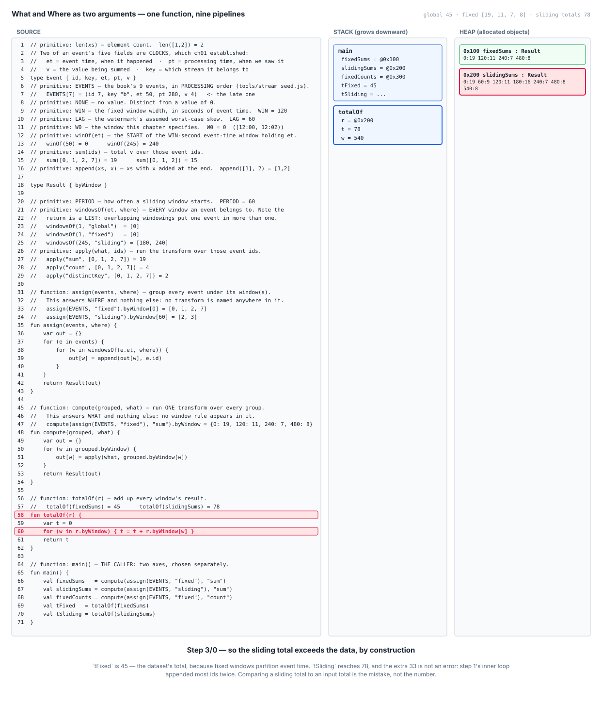

`tFixed` is 45 — the dataset's total, because fixed windows partition event time. `tSliding` reaches 78, and the extra 33 is not an error: step 1's inner loop appended most ids twice. Comparing a sliding total to an input total is the mistake, not the number.

</details>
<details>
<summary><b>Step 4 of 4</b> — and nine combinations, all legal</summary>

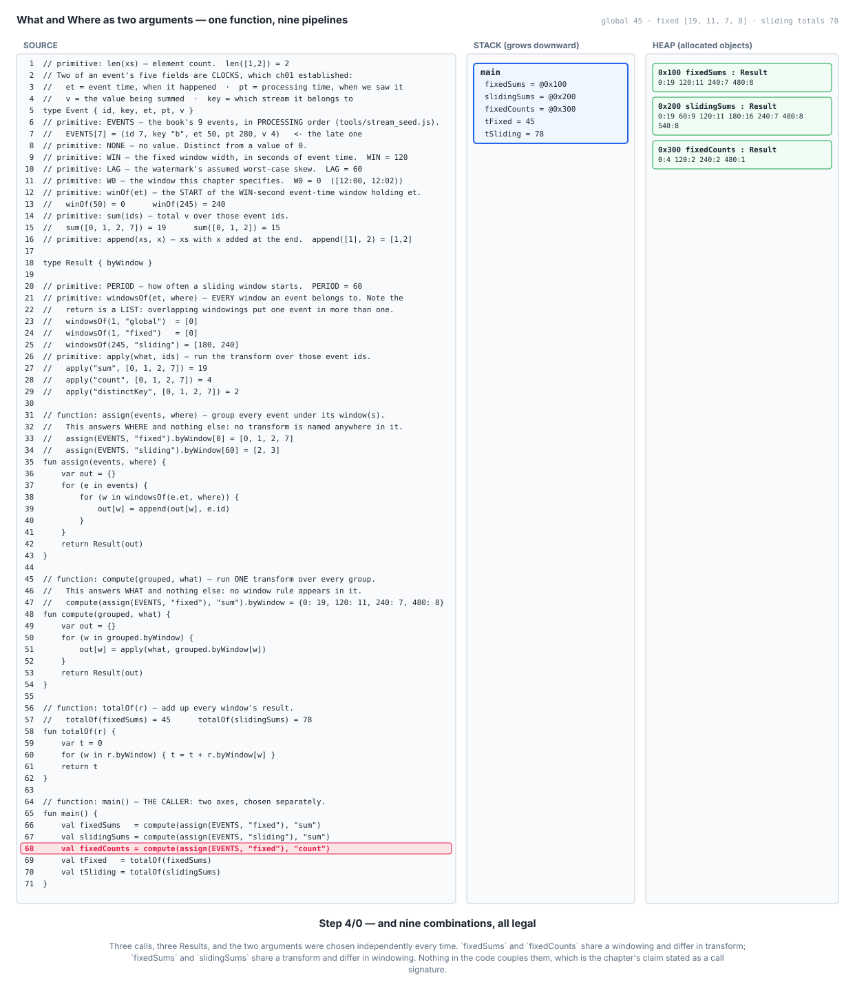

Three calls, three Results, and the two arguments were chosen independently every time. `fixedSums` and `fixedCounts` share a windowing and differ in transform; `fixedSums` and `slidingSums` share a transform and differ in windowing. Nothing in the code couples them, which is the chapter's claim stated as a call signature.

</details>

<sub>The sliding total and every per-window value are computed from the seed and asserted against the fixed total. Generated by `node tools/gen_ch02.js` on `tools/memkit.js`.</sub>

<!-- ch02-whatwhere-memory:end -->

### When — triggers and watermarks

> **Why this matters:** A window is useless until the pipeline decides when to emit its result, and that "when" is a processing-time decision driven by triggers and watermarks, so this section covers the timing machinery that the rest of the book leans on.

1. **Triggers decide when results materialize** — A trigger is the mechanism that says "emit the current window result now". **Triggers can fire on processing time (every N seconds), on event-time progress (the watermark passes the window end), or on data arrival (count of elements).**

2. **Watermarks declare event-time completeness** — A watermark is a signal that "no more events with event time earlier than t will arrive". **It is the pipeline's best estimate of how complete the event-time axis is, and it lets a trigger close a window.**

3. **Early, on-time, and late triggers** — A pipeline can emit a window's result **early** (speculative, before the watermark), **on-time** (when the watermark passes the window end), and **late** (after the watermark, for stragglers). Each is a separate trigger.

4. **Allowed lateness bounds the waiting** — After the watermark passes, a pipeline may keep accepting stragglers for an "allowed lateness" horizon, then discard them. **Allowed lateness is garbage collection for window state — it bounds how long late data can still update a result.**

<!-- ch02-when:begin — generated by tools/gen_ch02.js; do not hand-edit -->

#### Why "when" is a processing-time decision about an event-time question

A window is useless until something decides to emit it. That decision is a **trigger**, and triggers come in kinds that differ in what they are reacting to.

**A processing-time trigger fires on the clock** — every 60s, say. Following window [12:00, 12:02), it emits 8, then 15, then 15, then 15: whatever had arrived. It first reaches the right answer, 19, at 12:05:00 — and it cannot tell that firing apart from the ones before it.

**A watermark is a completeness signal:** "no event with an event time earlier than *t* will arrive." That lets a trigger make a different kind of claim — fire when the watermark passes 12:02, because the window is *done*. It fires exactly once, after event id 4 at 12:04:06, emitting **15** from ids 0, 1, 2.

15, not 19: id 7 has not arrived. **The claim of completeness and the error are the same event** — the watermark was the pipeline's best estimate and it was wrong.

**So a real pipeline wants three triggers on one window,** not a choice between them: **early** (speculative, before the watermark — 8, 15, 15), **on-time** (at the watermark — 15), and **late** (once per straggler — 19 at 12:04:40). They serve three different consumers and all three fire.

**Allowed lateness** bounds the waiting: it is how long window state is kept after the watermark passes, which is garbage collection for that state. And it has an exact threshold here. When id 7 arrives, the watermark stands at 12:03:20 (200s); state survives while the watermark is below 12:02 + allowed, so **allowed lateness must be at least 81s** for the correction to land. At 80s the state is already gone and 15 stands forever.

Note that 81s is *not* id 7's 230s of skew, which is the number a reader would guess. It comes from how far the watermark had advanced — it jumped from 12:01:10 to 12:03:05 in a single event. **The knob is calibrated against the watermark, not against the data.**

#### When to use each trigger, and what allowed lateness costs

**Use a processing-time trigger when a consumer needs a number on a schedule** and can tolerate it being provisional — a live dashboard, a progress bar. It never stalls, which is its real virtue: a watermark that stops advancing stops your output, and a clock does not.

**Use the watermark trigger when the result is meant to be an answer** rather than a status — a report, an hourly figure, anything someone will quote. It fires once per window with a meaningful claim attached.

**Use late triggers whenever correctness outranks simplicity,** and accept that your published numbers will move.

**Set allowed lateness from your skew tail, then price the memory.** It keeps window state alive, so the bill is (open windows × state per window). With 4 windows that is nothing; with a million open session windows it is the dominant cost of the pipeline.

**What this does not settle:** "when" produced 5 separate published values for ONE window, and nothing here says what a consumer should do with the second one. If a sink stored 15 and then receives 19, does it add or replace? That question is "how", and until it is answered the pipeline's correctness is undefined — not merely unoptimised.

#### Visual walkthrough — a clock trigger, a watermark trigger, and one threshold

The animation loops through all 4 steps. Expand any step to study it on its own.



<details>
<summary><b>Step 1 of 4</b> — a trigger is the thing that says "emit now"</summary>


A processing-time trigger is the simplest possible "when": fire every 60s. It is never blocked and never wrong about its own rule — and it emits 8, then 15, then 15. The right answer appears at 12:05:00, indistinguishable from the firings before it.

</details>
<details>
<summary><b>Step 2 of 4</b> — a watermark lets a trigger say "the window is COMPLETE"</summary>

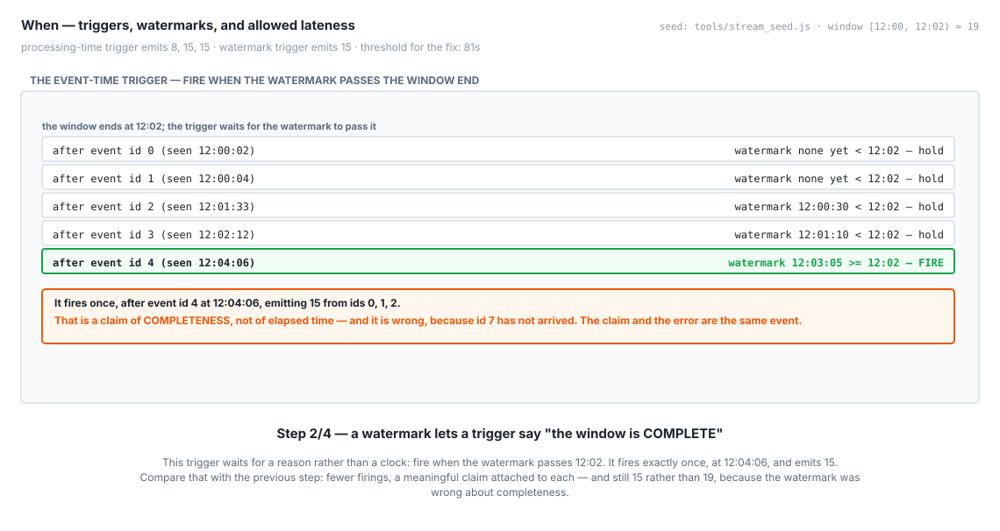

This trigger waits for a reason rather than a clock: fire when the watermark passes 12:02. It fires exactly once, at 12:04:06, and emits 15. Compare that with the previous step: fewer firings, a meaningful claim attached to each — and still 15 rather than 19, because the watermark was wrong about completeness.

</details>
<details>
<summary><b>Step 3 of 4</b> — so a pipeline wants THREE triggers, not one</summary>

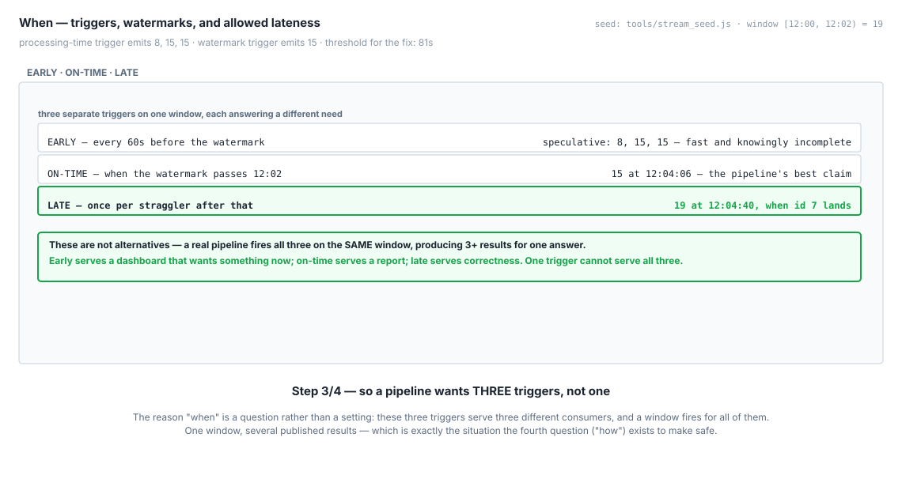

The reason "when" is a question rather than a setting: these three triggers serve three different consumers, and a window fires for all of them. One window, several published results — which is exactly the situation the fourth question ("how") exists to make safe.

</details>
<details>
<summary><b>Step 4 of 4</b> — and allowed lateness decides whether the fix ever lands</summary>

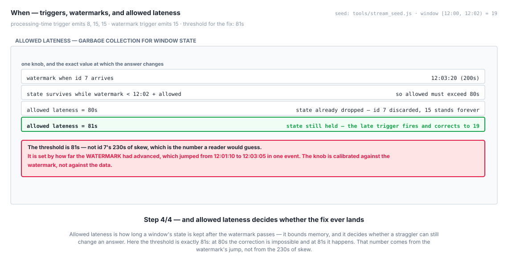

Allowed lateness is how long a window's state is kept after the watermark passes — it bounds memory, and it decides whether a straggler can still change an answer. Here the threshold is exactly 81s: at 80s the correction is impossible and at 81s it happens. That number comes from the watermark's jump, not from the 230s of skew.

</details>

<sub>The trigger sequences and the 81s threshold are computed from the seed's watermarks and asserted. Generated by `node tools/gen_ch02.js`.</sub>

<!-- ch02-when:end -->

<!-- ch02-when-memory:begin — generated by tools/gen_ch02.js; do not hand-edit -->

#### When — stack and heap at every step

**What is being answered.** What a trigger actually is, and where allowed lateness takes effect — as one `feed` function replayed over the stream.

Three predicates do all the work. `onTimeDue(i)` asks whether the watermark has passed the window end. `stillOpen(i)` asks whether the window's STATE is still held — and that is the only thing that decides whether a straggler can change an answer.

Step 3 is the one to read closely: the comparison is `watermarkAfter(7) < 120 + ALLOWED`, which is 200 < 201. One second lower and it fails. The threshold is 81s because of where the **watermark** stood — not because of id 7's 230s of skew.

The animation steps through the code, holding each line long enough to read the STACK (call frames and their locals) and the HEAP (allocated arrays and objects) as they are AT THAT MOMENT. Expand any step to study it on its own.



<details>
<summary><b>Step 1 of 4</b> — the watermark has not passed 12:02, so nothing fires</summary>


`watermarkAfter(3)` is 70, and `W0 + WIN` is 120, so 70 >= 120 is false and the window holds. Its state already contains ids 0, 1, 2 — the answer exists, it is just not claimed yet.

</details>
<details>
<summary><b>Step 2 of 4</b> — it passes, and the ON-TIME pane is published</summary>

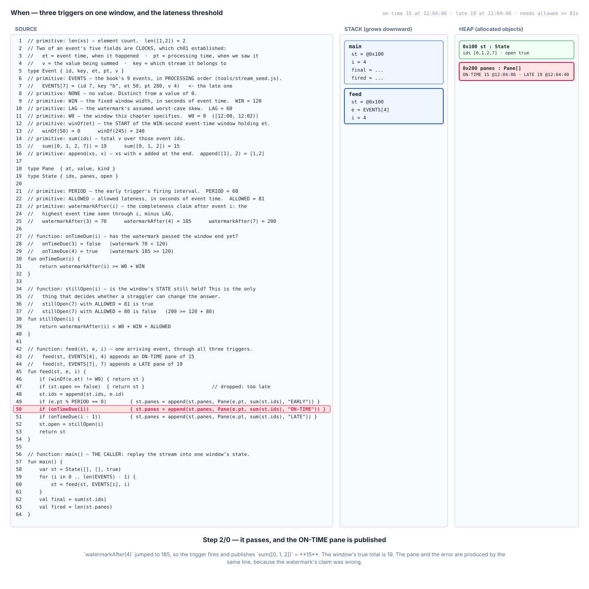

`watermarkAfter(4)` jumped to 185, so the trigger fires and publishes `sum([0, 1, 2])` = **15**. The window's true total is 19. The pane and the error are produced by the same line, because the watermark's claim was wrong.

</details>
<details>
<summary><b>Step 3 of 4</b> — id 7 arrives — and `open` is what decides its fate</summary>


`watermarkAfter(7)` is 200 and the bound is 120 + ALLOWED. With ALLOWED = 81 that is 201, so 200 < 201 holds and the state survives. With ALLOWED = 80 the bound is 200 and the comparison fails — one second of configuration decides between 19 and 15.

</details>
<details>
<summary><b>Step 4 of 4</b> — so one window published twice, and the second one is right</summary>

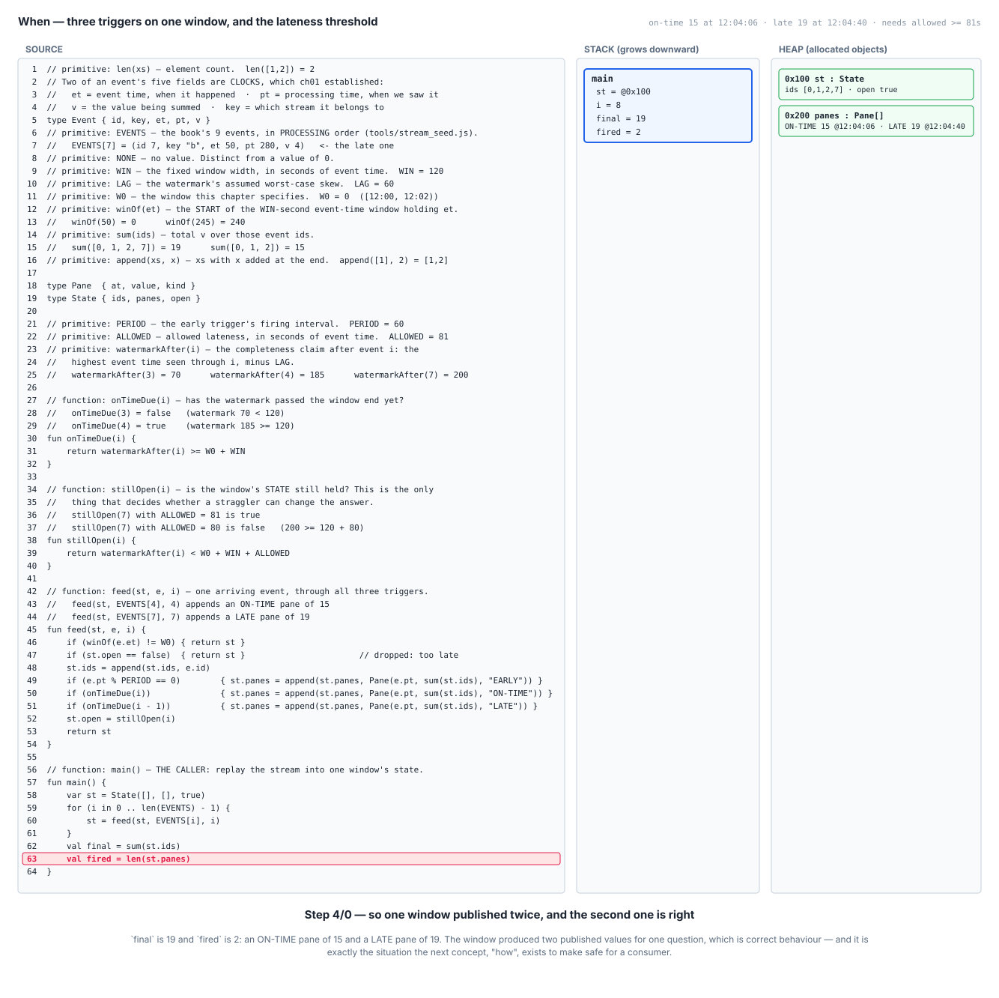

`final` is 19 and `fired` is 2: an ON-TIME pane of 15 and a LATE pane of 19. The window produced two published values for one question, which is correct behaviour — and it is exactly the situation the next concept, "how", exists to make safe for a consumer.

</details>

<sub>The trigger firings and the 81s threshold are computed from the seed's watermarks and asserted. Generated by `node tools/gen_ch02.js` on `tools/memkit.js`.</sub>

<!-- ch02-when-memory:end -->

### How — accumulation

> **Why this matters:** When a window emits more than once, the consumer must know whether each result replaces or refines the previous one, so this section covers the four accumulation modes that relate later panes to earlier ones.

1. **Accumulation relates panes** — The answer to "how" is the relationship between a window's successive results. **Accumulating mode adds to the previous pane; discarding mode replaces it; accumulating-and-retracting also emits a retraction so downstream can undo the old value.**

2. **Why retractions exist** — If a downstream system stores the first result, a later refined result would double-count unless the old value is retracted. **Accumulating-and-retracting emits the delta and a retraction of the previous pane, so a sink can stay correct.** The previous value is read from the operator's **keyed state** — the running fold for that key — never by re-scanning the stream, which is immutable history.

3. **The four questions are a checklist** — Ask all four — what, where, when, how — of any pipeline and its behavior is fully specified. **Omit "when" and you cannot reason about latency; omit "how" and you cannot reason about correctness under refinement.**

<!-- ch02-how:begin — generated by tools/gen_ch02.js; do not hand-edit -->

#### Why a correct pipeline plus a correct sink can still be wrong

"When" allowed one window to fire twice. Window [12:00, 12:02) emitted **15** on time at 12:04:06, then id 7 arrived at 12:04:40 and the window held **19**. Both panes were correct when produced.

**Nothing in the numbers says what the second one means.** Is 19 a replacement for 15, or something to add to it? "How" is the name of that agreement, and there are three standard answers:

- **Discarding** — each pane is only the NEW data: panes **15, 4**. The second pane is id 7's 4 alone. A sink must SUM.
- **Accumulating** — each pane is the window's total so far: panes **15, 19**. A sink must REPLACE.
- **Accumulating and retracting** — the new total preceded by an undo of the old one: panes **15, -15, 19**. A sink that can only add is still correct.

**Now the part that makes this a correctness question rather than a preference.** Pair each mode with each kind of sink:

- discarding (15, 4) into a summing sink → **19** ✓
- accumulating (15, 19) into a replacing sink → **19** ✓
- retracting (15, -15, 19) into a summing sink → **19** ✓
- accumulating into a **summing** sink → **34**, double counted by 15
- discarding into a **replacing** sink → **4**, pane 1 thrown away

19, 34 or 4 — same window, same events, same two firings. **The pipeline is correct in all five rows**, and nothing in the data reveals a mismatch. That is why retractions exist: they make the pane stream correct for the sink that cannot be changed.

#### When each mode is right, and why the four questions are a checklist

**Discarding when the sink aggregates and bandwidth matters.** It transmits 4 instead of 19, which on a wide window is the difference between a delta and a full re-send. Requires that nothing ever re-reads a pane.

**Accumulating when the sink is a keyed store you overwrite** — a cache, a dashboard row, `SET key value`. Simplest to reason about, and the mode most people assume is in use.

**Accumulating and retracting when the sink can only append** — a downstream aggregation, an event log, another streaming job. It is the only mode that is safe when you do not control the consumer, and the cost is that the operator must keep the previous pane's value in its keyed state in order to emit the undo.

**And this is why the four questions are a checklist rather than a summary.** Each one was shown to change an observable number: omit WHEN and the 81s lateness threshold and the 15-then-19 sequence both vanish from the spec; omit HOW and the sink's final value is undetermined among 19, 34 and 4.

**What this does not settle:** retraction assumes the sink accepts a negative value. A counter in a key-value store usually does; an append-only ledger that has already billed on 15 usually does not, and no accumulation mode fixes that — it is a conversation about what the downstream system promised.

#### Visual walkthrough — two panes, three modes, five outcomes

The animation loops through all 4 steps. Expand any step to study it on its own.



<details>
<summary><b>Step 1 of 4</b> — one window emitted twice: now what do the two mean?</summary>


Two panes for one window, both correct at the moment they were produced. The numbers alone do not say whether 19 is a replacement for 15 or an addition to it — and a sink has to decide. "How" is the name of that agreement, and it is the fourth question because it only exists once "when" allows more than one firing.

</details>
<details>
<summary><b>Step 2 of 4</b> — three accumulation modes, three different pane streams</summary>

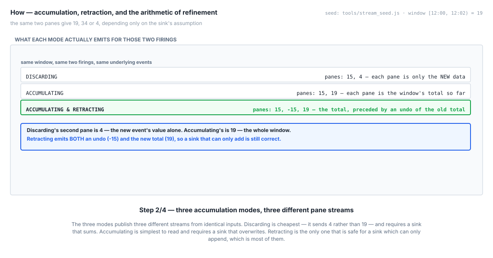

The three modes publish three different streams from identical inputs. Discarding is cheapest — it sends 4 rather than 19 — and requires a sink that sums. Accumulating is simplest to read and requires a sink that overwrites. Retracting is the only one that is safe for a sink which can only append, which is most of them.

</details>
<details>
<summary><b>Step 3 of 4</b> — and a mismatched sink is wrong by a specific amount</summary>

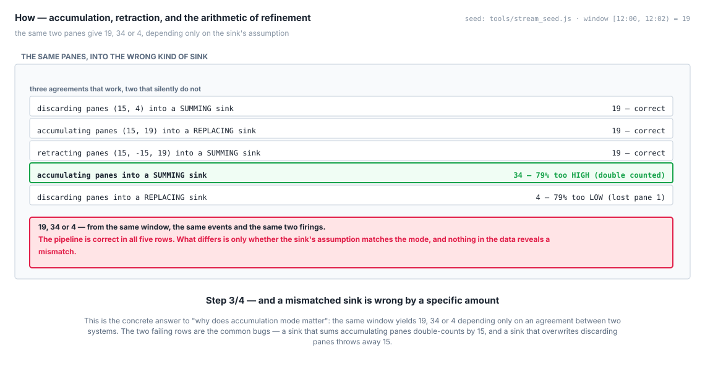

This is the concrete answer to "why does accumulation mode matter": the same window yields 19, 34 or 4 depending only on an agreement between two systems. The two failing rows are the common bugs — a sink that sums accumulating panes double-counts by 15, and a sink that overwrites discarding panes throws away 15.

</details>
<details>
<summary><b>Step 4 of 4</b> — so the four questions are a completeness checklist</summary>

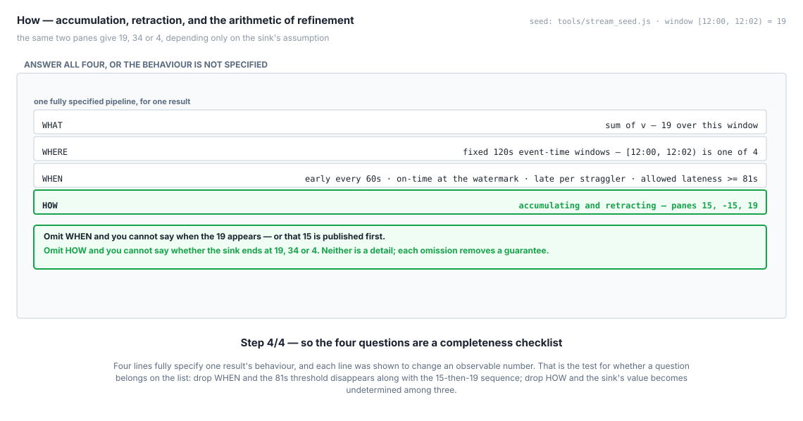

Four lines fully specify one result's behaviour, and each line was shown to change an observable number. That is the test for whether a question belongs on the list: drop WHEN and the 81s threshold disappears along with the 15-then-19 sequence; drop HOW and the sink's value becomes undetermined among three.

</details>

<sub>All five mode-and-sink outcomes are computed from the seed and asserted: three reach 19, two do not. Generated by `node tools/gen_ch02.js`.</sub>

<!-- ch02-how:end -->

<!-- ch02-how-memory:begin — generated by tools/gen_ch02.js; do not hand-edit -->

#### How — stack and heap at every step

**What is being answered.** Why accumulation mode is a correctness setting — as three pane streams and two sinks, all five pairings computed.

`panesFor(mode)` is the pipeline: it decides what gets published for the window's two firings. `sinkSum` and `sinkReplace` are the two things a consumer can do with a pane. Neither sink can see which mode produced its input.

That is the whole lesson. Three pairings reach 19; `badSum` reaches **34** and `badRepl` reaches **4**. Every function in the listing is correct in all five cases, and the only thing that varied was an agreement nobody wrote down.

The animation steps through the code, holding each line long enough to read the STACK (call frames and their locals) and the HEAP (allocated arrays and objects) as they are AT THAT MOMENT. Expand any step to study it on its own.



<details>
<summary><b>Step 1 of 4</b> — discarding publishes the DELTA, not the total</summary>


The second pane is DELTA = 4, which is id 7's own `v` — not the window's 19. Cheapest to transmit, and it only means anything to a sink that adds. Read that pane in isolation and it looks like a window containing 4.

</details>
<details>
<summary><b>Step 2 of 4</b> — a summing sink reaches the right answer from those panes</summary>

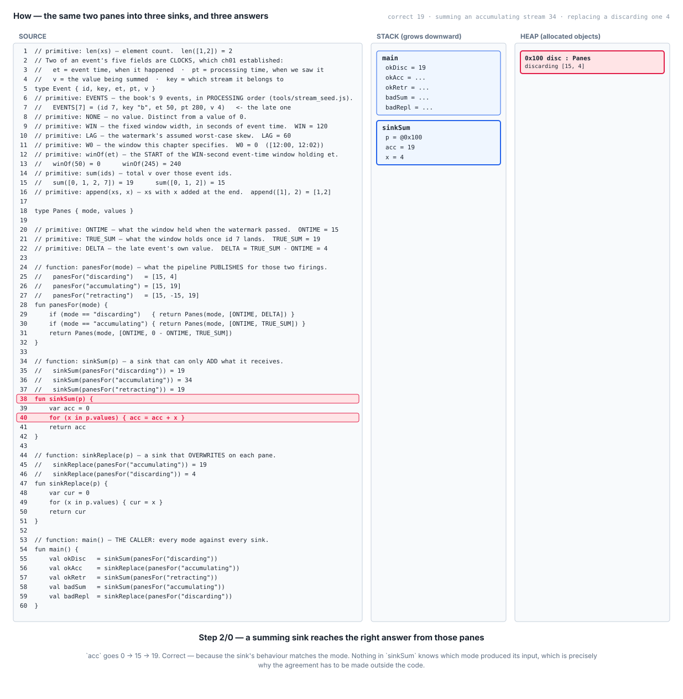

`acc` goes 0 → 15 → 19. Correct — because the sink's behaviour matches the mode. Nothing in `sinkSum` knows which mode produced its input, which is precisely why the agreement has to be made outside the code.

</details>
<details>
<summary><b>Step 3 of 4</b> — the SAME sink, given accumulating panes, double counts</summary>

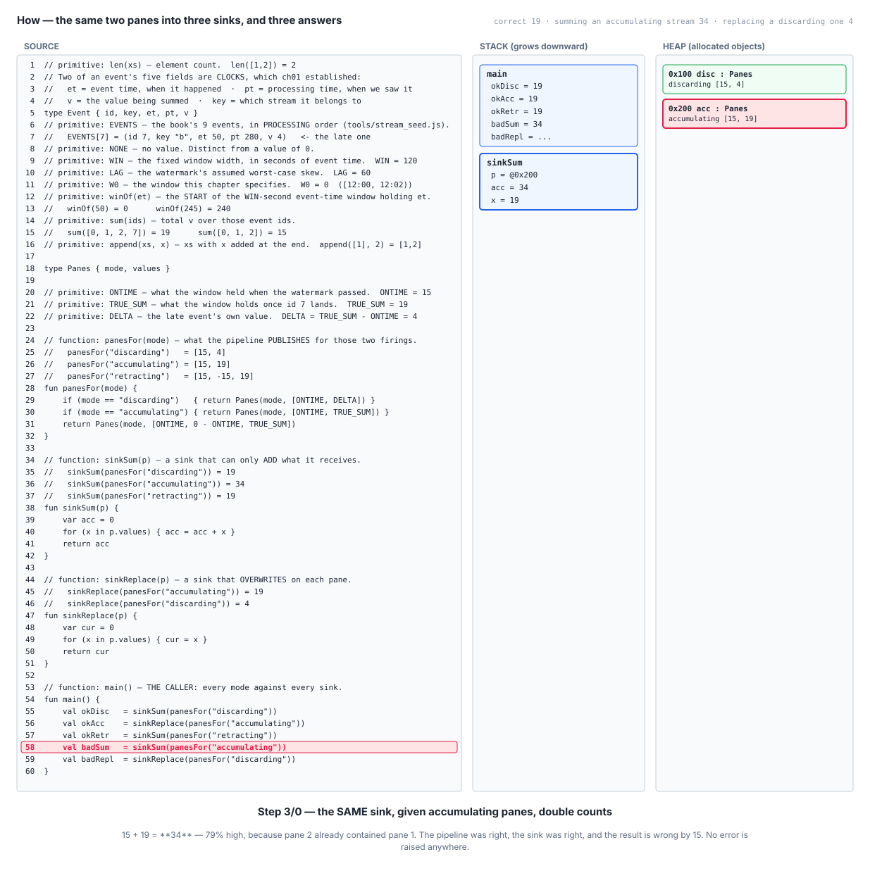

15 + 19 = **34** — 79% high, because pane 2 already contained pane 1. The pipeline was right, the sink was right, and the result is wrong by 15. No error is raised anywhere.

</details>
<details>
<summary><b>Step 4 of 4</b> — which is why retraction exists: an undo makes adding safe</summary>

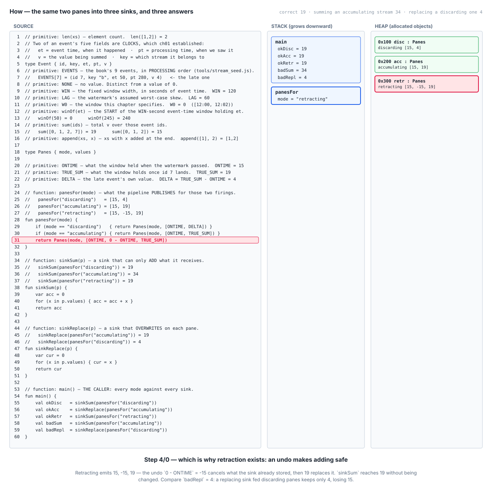

Retracting emits 15, -15, 19 — the undo `0 - ONTIME` = -15 cancels what the sink already stored, then 19 replaces it. `sinkSum` reaches 19 without being changed. Compare `badRepl` = 4: a replacing sink fed discarding panes keeps only 4, losing 15.

</details>

<sub>All five mode-and-sink outcomes are computed from the seed and asserted: three equal 19, two do not. Generated by `node tools/gen_ch02.js` on `tools/memkit.js`.</sub>

<!-- ch02-how-memory:end -->


## Links & The Bigger Picture

Concepts this chapter mentions but does not fully unpack are linked below — each pointer names the chapter where the concept is covered in depth and gives a concrete example that ties the two chapters together.

- **[Chapter 1: Streaming 101 → Event time vs processing time](ch01-streaming-101.md#event-time-vs-processing-time)** — the "when" axis only matters because the two clocks disagree; ch01 pins down event time vs processing time and the lag between them.
  - _Example:_ ch02's on-time trigger fires when the watermark passes the window end; ch01 explains why the watermark is needed at all — the same click at 12:00:59 processed at 12:04:11 lands in different windows under the two clocks.
- **[Chapter 3: Watermarks → Propagation and correctness](ch03-watermarks.md#propagation-and-correctness)** — the watermark that drives this chapter's on-time trigger is defined in full in ch03 — perfect vs heuristic, the skew formula, and how it propagates as the minimum across inputs.
  - _Example:_ ch02 says "the watermark passes 12:05:00"; ch03 shows where that number comes from — max_seen 12:08:30 − skew 120 s = 12:06:30 — and that a multi-input stage takes min(12:06:00, 12:04:30) = 12:04:30.
- **[Chapter 4: Advanced Windowing → The window lifecycle](ch04-advanced-windowing.md#the-window-lifecycle)** — the "where" axis (windows) is named here but its full lifecycle — assign, merge, group, trigger, accumulate, garbage-collect — lives in ch04, with session merging as the canonical dynamic case.
  - _Example:_ ch02's session window (30-min gap) opens s1; ch04 shows two sessions [12:00,12:10) and [12:40,12:50) merging into [12:00,12:50) when a bridge event lands at 12:20:00.
- **[Chapter 6: Streams and Tables → The duality](ch06-streams-and-tables.md#the-duality)** — the "how" axis (accumulation, retractions) is the stream-table duality in motion — each pane is a changelog record, and the table is the accumulated view.
  - _Example:_ ch02's accumulating-and-retracting mode (3 − 3 + 4 = 4) is ch06's changelog fold: retract the old value, set the new one, so a sink never double-counts.

## System Design Interview

> **The question:** Design a purchase-counting pipeline that answers what, where, when, and how for one result. Premise: a purchase arrives late, so the pipeline must close the window on the watermark and let allowed lateness correct the already-emitted count.

**The pipeline:** writer (event source) -> transport (stream) -> collector (window assigner) -> aggregator/store (per-window state) -> reader (dashboard)

<a href="../diagrams/d2/decomp/ch02-0.png">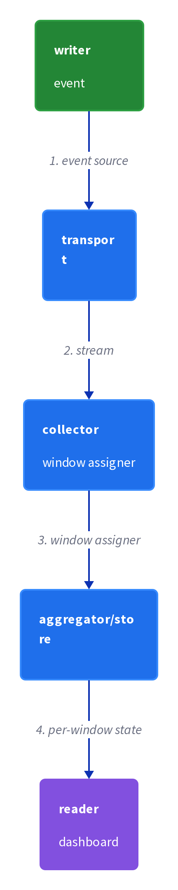</a>

### writer (event source)

_Role: writer — emits events with event time_

- a purchase event {user: 42, amount: 10, event_time: "12:04:00"} is emitted
- event time is stamped by the source, not the pipeline
- events are immutable once produced

### transport (stream)

_Role: transport — carries events and computes the watermark_

- the stream delivers the event and tracks the watermark = 12:05:00
- the watermark says no events earlier than 12:05:00 will arrive
- network delay keeps the watermark behind the wall clock

### collector (window assigner)

_Role: collector — assigns events to event-time windows_

- the window assigner places the event in fixed window [12:00, 12:05)
- a trigger decides when the window result is emitted
- allowed lateness keeps the window open for stragglers

### aggregator/store (per-window state)

_Role: aggregator/store — holds the running sum per window_

- window [12:00, 12:05) sum : 0 -> 10 as the purchase folds in
- an early pane emits {sum: 10}, an on-time pane re-emits {sum: 10}
- a late straggler updates sum : 10 -> 20 if inside allowed lateness


<!-- ch02-system:begin — generated by tools/gen_ch02.js; do not hand-edit -->

#### Why one result needs all four answers before it is defined

**The question.** Count purchases per window. A purchase arrives late, so the pipeline must close the window on the watermark and let allowed lateness correct the already-emitted count.

**The pipeline:** writer (event source) → transport (stream, which also computes the watermark) → collector (window assigner) → aggregator/store (per-window state).

Note where the four questions live: **WHERE** is the collector's single rule (assign by event time to fixed 120s windows), and **WHAT, WHEN and HOW all live in the aggregator's state**. That is also where every difficulty is — which is why "where is the state?" is the first useful question about any streaming system.

**The window being specified** is [12:00, 12:02): ids 0, 1, 2, 7, true sum **19**. One of them, id 7, arrives at 12:04:40 — 230s after it happened, and after the window has already been published.

**So here is what a consumer actually receives, in order:**

- 12:01:00 — early pane **8** (ids 0, 1 had arrived)
- 12:02:00 — early pane **15**
- 12:04:06 — on-time pane **15**, the watermark having passed 12:02
- 12:04:40 — retraction **-15** then late pane **19**

Five values for one question, over 220s. Every one was the right answer to "what do you know now?", and a consumer that treats the first as final is the bug.

#### When this design is right, the two thresholds, and four gaps

**Two settings decide whether it is ever correct, and both have numeric thresholds rather than judgement calls:**

**1. Allowed lateness ≥ 81s.** Below that, window state is already collected when id 7 arrives: the event is discarded and 15 stands forever, 21% low. At or above it, the late trigger fires and corrects to 19. The threshold comes from the watermark's position (200s) when the straggler lands — **not** from its 230s of skew.

**2. The accumulation mode must match the sink.** Retracting into a summing sink gives 19; accumulating into the same sink gives 34. These are independent of setting 1 — correct lateness with a mismatched sink still produces 34.

**Use this design when the consumer can accept a moving number.** A dashboard, a cache, a downstream aggregation: all fine. An append-only ledger that bills on the first value published is not, and that is a contract problem rather than a configuration one.

**What this does NOT settle — four gaps:**

1. **Allowed lateness is memory.** Holding state past the watermark costs (open windows × state per window). With 4 windows it is free; with a million open windows it is the pipeline's dominant cost.
2. **Retractions require a sink that accepts negatives.** -15 has to be representable and meaningful downstream.
3. **The 81s threshold was computed from watermarks visible in full.** A live pipeline sets that number before observing them, and is therefore guessing.
4. **Only one window was specified.** The window starting 12:08 is never published by ANY of the three triggers, because the watermark never passes its end — a complete answer to all four questions still says nothing about a window whose "when" never arrives.

#### Visual walkthrough — four stages, five published values, two thresholds

The animation loops through all 4 steps. Expand any step to study it on its own.



<details>
<summary><b>Step 1 of 4</b> — the pipeline, and the one window it is specified for</summary>


A deliberately small design, so every number is checkable. The four questions are not spread across the pipeline evenly: WHERE is the collector's single rule, and WHAT, WHEN and HOW all live in the aggregator's state. That is also where every difficulty in this design is, which is why "where is the state?" is the useful first question about any streaming system.

</details>
<details>
<summary><b>Step 2 of 4</b> — the publish sequence, with real times</summary>

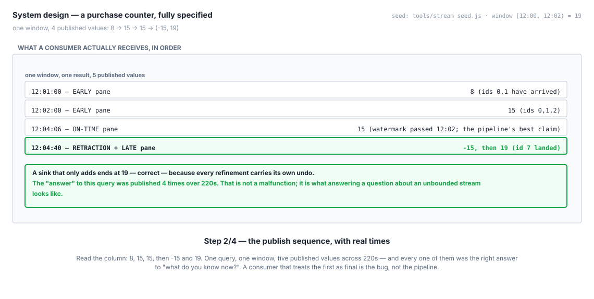

Read the column: 8, 15, 15, then -15 and 19. One query, one window, five published values across 220s — and every one of them was the right answer to "what do you know now?". A consumer that treats the first as final is the bug, not the pipeline.

</details>
<details>
<summary><b>Step 3 of 4</b> — the two settings that decide whether it is ever right</summary>

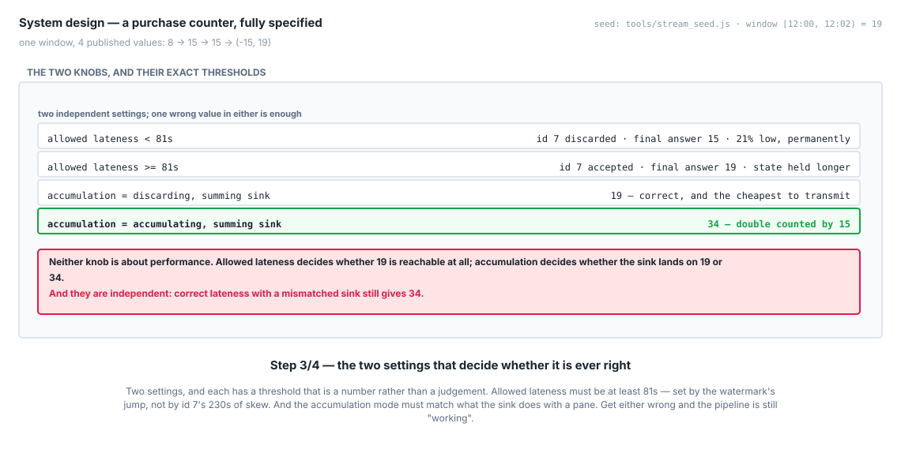

Two settings, and each has a threshold that is a number rather than a judgement. Allowed lateness must be at least 81s — set by the watermark's jump, not by id 7's 230s of skew. And the accumulation mode must match what the sink does with a pane. Get either wrong and the pipeline is still "working".

</details>
<details>
<summary><b>Step 4 of 4</b> — and what this design does NOT settle</summary>

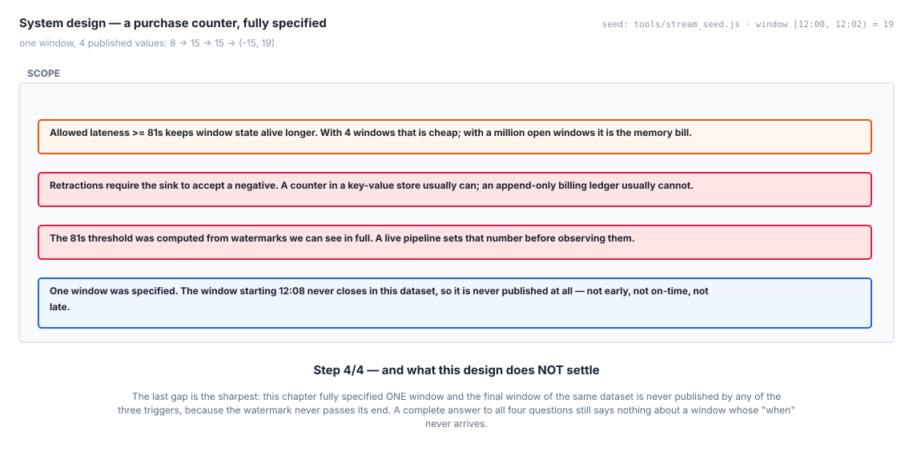

The last gap is the sharpest: this chapter fully specified ONE window and the final window of the same dataset is never published by any of the three triggers, because the watermark never passes its end. A complete answer to all four questions still says nothing about a window whose "when" never arrives.

</details>

<sub>The publish sequence, the 81s lateness threshold and the 34-vs-19 sink outcomes are all derived from the seed and asserted. Generated by `node tools/gen_ch02.js`.</sub>

<!-- ch02-system:end -->

<!-- ch02-system-memory:begin — generated by tools/gen_ch02.js; do not hand-edit -->

#### The purchase counter — stack and heap at every step

**What is being answered.** The four questions as four lines of one loop, with the real published values.

`SPEC` holds the four answers as data: `"sum"`, `"fixed 120s"`, early every 60s with allowed lateness 81s, and `"retracting"`. Each step below highlights the line that implements one of them.

Two lines are worth reading twice. The `continue` in step 2 is where allowed lateness takes effect — one second lower and id 7 disappears. The retraction in step 3 is what keeps a sink that can only ADD on the right answer; skip it and `stored` ends at 34 instead of 19.

The animation steps through the code, holding each line long enough to read the STACK (call frames and their locals) and the HEAP (allocated arrays and objects) as they are AT THAT MOMENT. Expand any step to study it on its own.



<details>
<summary><b>Step 1 of 4</b> — WHERE: anything outside this window is skipped</summary>


`winOf(130)` = 120, which is not W0 = 0, so event id 3 is skipped entirely. That one line is the whole of the collector's job — the WHERE answer — and it reads `e.et`, never the arrival time.

</details>
<details>
<summary><b>Step 2 of 4</b> — WHEN: the allowed-lateness check is what can drop an event</summary>

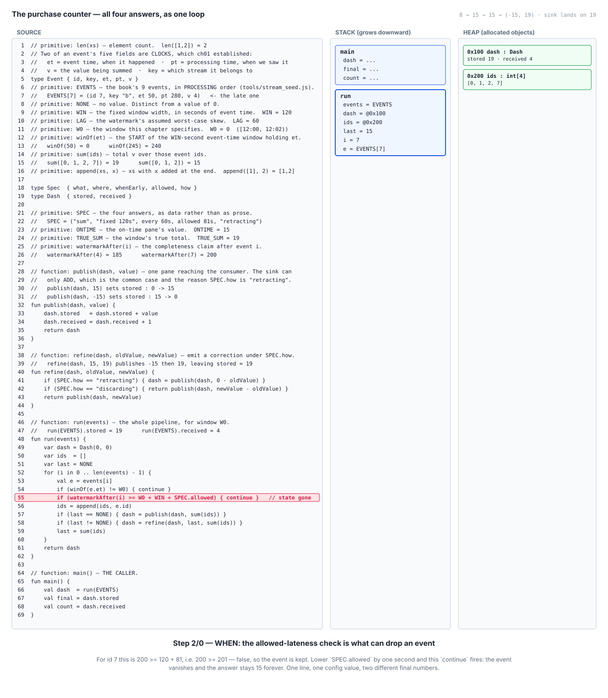

For id 7 this is 200 >= 120 + 81, i.e. 200 >= 201 — false, so the event is kept. Lower `SPEC.allowed` by one second and this `continue` fires: the event vanishes and the answer stays 15 forever. One line, one config value, two different final numbers.

</details>
<details>
<summary><b>Step 3 of 4</b> — HOW: the refinement emits an undo before the new total</summary>

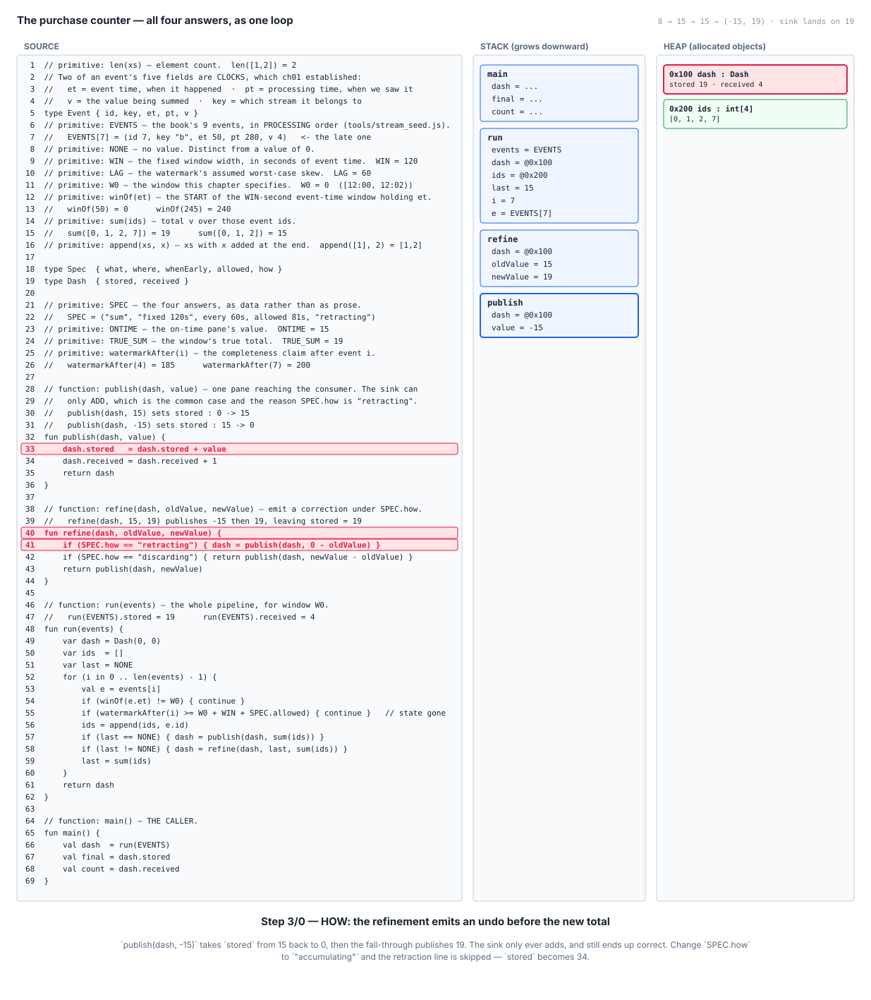

`publish(dash, -15)` takes `stored` from 15 back to 0, then the fall-through publishes 19. The sink only ever adds, and still ends up correct. Change `SPEC.how` to `"accumulating"` and the retraction line is skipped — `stored` becomes 34.

</details>
<details>
<summary><b>Step 4 of 4</b> — WHAT: and the consumer ends on the right number</summary>

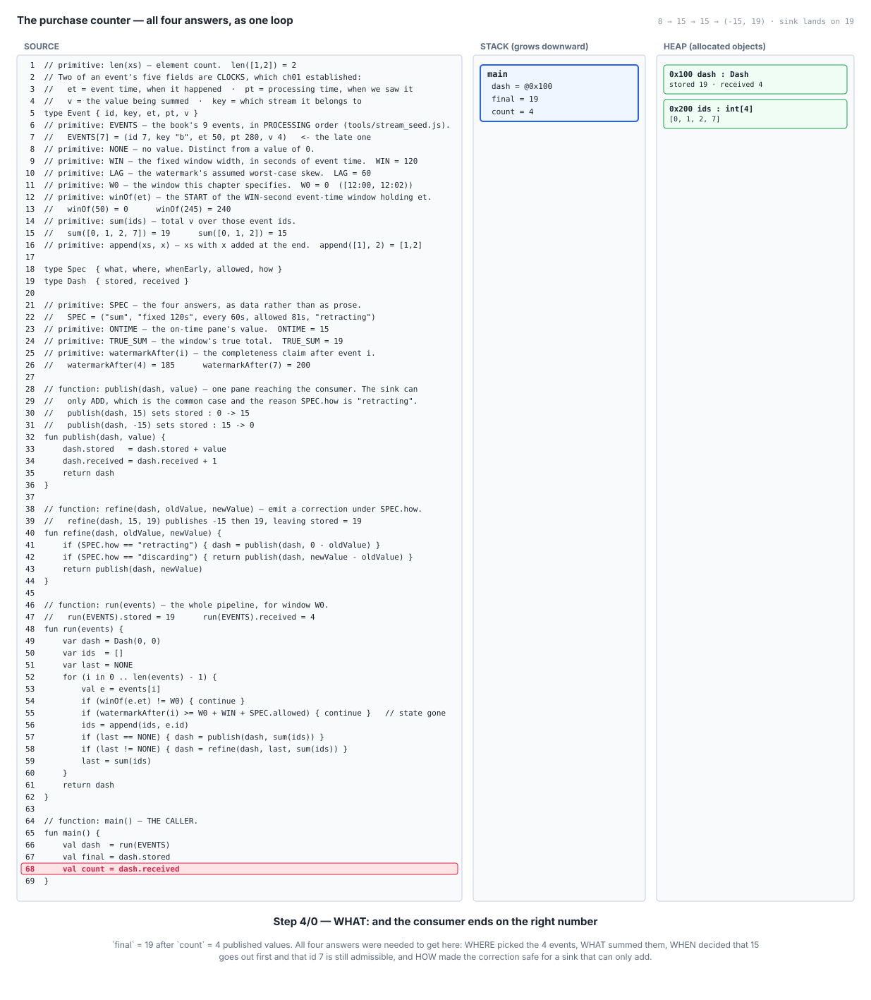

`final` = 19 after `count` = 4 published values. All four answers were needed to get here: WHERE picked the 4 events, WHAT summed them, WHEN decided that 15 goes out first and that id 7 is still admissible, and HOW made the correction safe for a sink that can only add.

</details>

<sub>The publish sequence, the lateness comparison and both sink outcomes are derived from the seed and asserted. Generated by `node tools/gen_ch02.js` on `tools/memkit.js`.</sub>

<!-- ch02-system-memory:end -->

## Interview Questions

### Q1

A real-time dashboard sums purchases per 5-minute window, but it can't say whether a number is final — an event that happened at 12:04 can still arrive after the window was shown.

**Interviewer's question:** How do you decide when a window's result is ready to emit, and what do you do about events that arrive later?

**Solution:** Use a watermark to declare event-time completeness; emit on-time when the watermark passes the window end, and keep the window alive for an allowed-lateness horizon so late events can update the result.

**System-design components:**
- Fixed window — the event-time slice
- Watermark — completeness signal
- On-time trigger — fires at the watermark
- Allowed lateness — bounds late updates

```java
// window [12:00,12:05), sum = 3
//   watermark 12:05:00 -> on-time trigger -> emit {sum:3}
//   straggler event_time 12:04:59 at 12:06 -> allowed lateness 1 min
//     -> update sum 3->4, emit late pane {sum:4}
//   beyond allowed lateness -> drop the straggler
```

_This is exactly the When (triggers + watermarks) and How (accumulation) material in this chapter._

_Covers:_ 4. Triggers (when) · 5. Watermarks · 6. Allowed lateness · 7. Accumulation (how)

_From the 28 problems:_ 21-ad-click-aggregation · 20-metrics-monitoring

### Q2

Two teams build 'the same' streaming aggregation, but one emits a running total and the other replaces each number — downstream sums them and double-counts.

**Interviewer's question:** What axis did the teams fail to specify, and how do you fix the double-count?

**Solution:** They failed to specify the accumulation mode (how). Use accumulating-and-retracting so each refined pane retracts the previous value before adding the new one.

**System-design components:**
- Accumulation mode — how panes relate
- Retraction — undo the previous pane
- Sink — applies retractions correctly

```java
// accumulating : sink = 3 then 3+4 = 7 -> double counts
// retracting  : pane1 {sum:3} -> retract -> pane2 {sum:4}
//   sink sees 3, then -3 +4 = 4 -> correct
```

_This is exactly the How (accumulation) axis in this chapter._

_Covers:_ 7. Accumulation (how) · 8. The four-question checklist

_From the 28 problems:_ 21-ad-click-aggregation

## Key Concepts

### The Problem

**1. Pipelines are underspecified.** A pipeline is fully specified only when it answers what, where, when, and how.


### The Solution

Transformations are the computations — sum, filter, join, keyed aggregation — applied to the data.

```java
// window [12:00,12:05), sum = 3
//   watermark 12:05:00 -> on-time trigger -> emit {sum:3}
//   straggler event_time 12:04:59 at 12:06 -> allowed lateness 1 min
//     -> update sum 3->4, emit late pane {sum:4}
//   beyond allowed lateness -> drop the straggler
```


### Key Facts

| Fact | Detail | In the wild |
|---|---|---|
| 2. Transformations (what) | Transformations are the computations — sum, filter, join, keyed aggregation — applied to the data. | A Beam ParDo or a Flink map/keyBy/sum is a transform. |
| 3. Windowing (where) | Windowing cuts the stream into finite, event-time-aligned pieces — fixed, sliding, or session windows. | A 5-minute fixed window in Flink is a windowing choice. |
| 4. Triggers (when) | Triggers decide when a window's result materializes — on processing time, on the watermark, or on element count. | Flink's trigger API fires on watermark passage by default. |
| 5. Watermarks | A watermark is the statement "no more events with event time earlier than t will arrive". | Flink and Dataflow watermarks are the production completeness signal. |
| 6. Allowed lateness | Allowed lateness is the horizon after the watermark during which a window still accepts and updates late events. | Dataflow's allowed-lateness setting is the production form. |
| 7. Accumulation (how) | Accumulation modes — accumulating, discarding, accumulating-and-retracting — define how later panes relate to earlier ones. | Beam's accumulation modes are the production expression of "how". |
| 8. The four-question checklist | Ask what, where, when, and how of every pipeline, and its behavior is fully specified. | The book's recurring worked example (team score over sessions) is defined by exactly these four answers. |


### Tradeoffs & When

- Ask what, where, when, and how of every pipeline, and its behavior is fully specified.


### Real-World Examples

- **Apache Beam** — What/where/when/how exposed as PTransform, Window, Trigger, and AccumulationMode
- **Apache Flink** — Event-time windows with watermark-driven triggers and early/on-time/late firing
- **Google Cloud Dataflow** — Fully managed Beam runner with watermarks and allowed lateness
- **Flink SQL** — TUMBLE windows plus watermark emission — a declarative spelling of where and when


<details><summary>All concepts (index)</summary>

### Why: 1. Pipelines are underspecified

**Why.** Two teams can build "the same" pipeline that behaves differently because one never said when results emit or how later results relate to earlier ones.

**Claim.** A pipeline is fully specified only when it answers what, where, when, and how.

**Grounding.** The four questions are the Beam model's complete description of a pipeline.

**In the wild.** Beam's PTransform (what), Window (where), Trigger (when), and AccumulationMode (how) map one-to-one onto the four questions.

<a href="../diagrams/d2/card/ch02-0.png">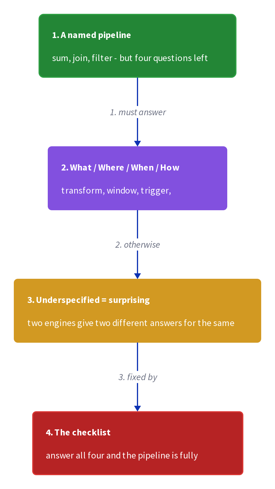</a>
### Axis: 2. Transformations (what)

**Why.** The output of a pipeline is whatever its transforms compute, so the transform is the first thing a design must pin down.

**Claim.** Transformations are the computations — sum, filter, join, keyed aggregation — applied to the data.

**Grounding.** A pipeline is a DAG of transforms in the Beam model.

**In the wild.** A Beam ParDo or a Flink map/keyBy/sum is a transform.

<a href="../diagrams/d2/card/ch02-1.png">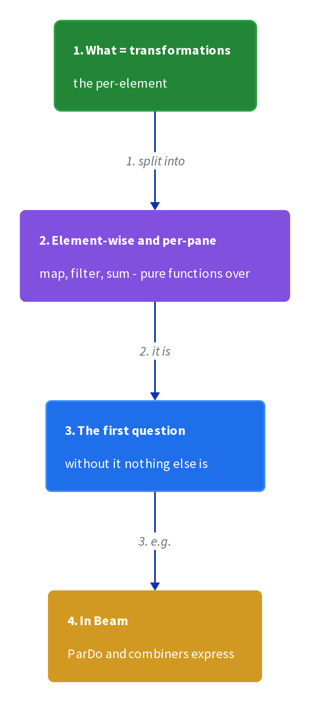</a>
### Axis: 3. Windowing (where)

**Why.** An unbounded stream has no natural boundary, so aggregates need an explicit event-time slice to be well-defined.

**Claim.** Windowing cuts the stream into finite, event-time-aligned pieces — fixed, sliding, or session windows.

**Grounding.** The window is the "where" an aggregate is computed over.

**In the wild.** A 5-minute fixed window in Flink is a windowing choice.

<a href="../diagrams/d2/card/ch02-2.png">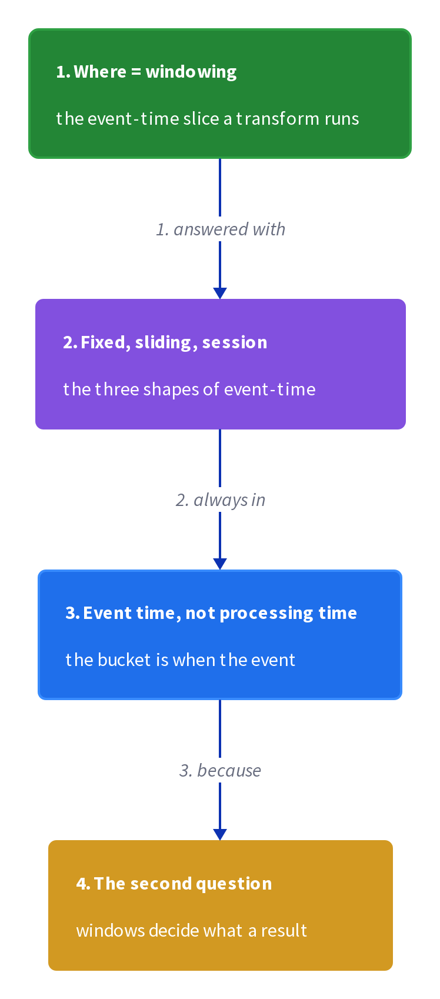</a>
### Axis: 4. Triggers (when)

**Why.** Without a trigger a window result sits unemitted forever, so the pipeline must name the processing-time conditions that fire output.

**Claim.** Triggers decide when a window's result materializes — on processing time, on the watermark, or on element count.

**Grounding.** Early, on-time, and late are three trigger points for the same window.

**In the wild.** Flink's trigger API fires on watermark passage by default.

<a href="../diagrams/d2/card/ch02-3.png">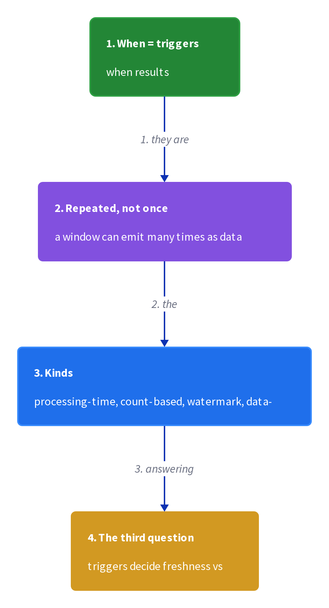</a>
### Signal: 5. Watermarks

**Why.** The pipeline needs a signal for how complete event time is before it can safely close a window.

**Claim.** A watermark is the statement "no more events with event time earlier than t will arrive".

**Grounding.** The watermark passing a window's end is what makes an on-time trigger fire.

**In the wild.** Flink and Dataflow watermarks are the production completeness signal.

<a href="../diagrams/d2/card/ch02-4.png">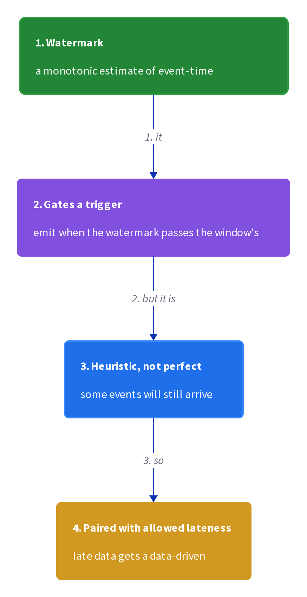</a>
### Bound: 6. Allowed lateness

**Why.** After the watermark passes, late data still exists, and the pipeline must bound how long it keeps window state around for stragglers.

**Claim.** Allowed lateness is the horizon after the watermark during which a window still accepts and updates late events.

**Grounding.** Beyond it, stragglers are dropped — it is garbage collection for window state.

**In the wild.** Dataflow's allowed-lateness setting is the production form.

<a href="../diagrams/d2/card/ch02-5.png">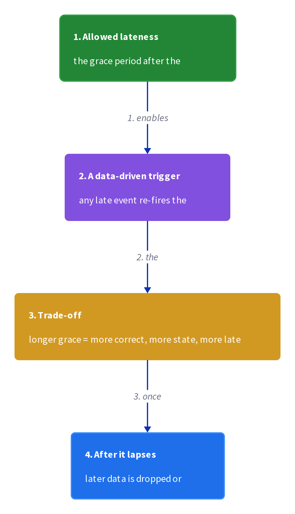</a>
### Mode: 7. Accumulation (how)

**Why.** A window that emits early and on-time produces multiple panes, and downstream must know if each pane adds to or replaces the last.

**Claim.** Accumulation modes — accumulating, discarding, accumulating-and-retracting — define how later panes relate to earlier ones.

**Grounding.** Retracting mode undoes the previous pane so sinks do not double-count; the old value is read from the operator's keyed state, not re-scanned from the stream.

**In the wild.** Beam's accumulation modes are the production expression of "how".

<a href="../diagrams/d2/card/ch02-6.png">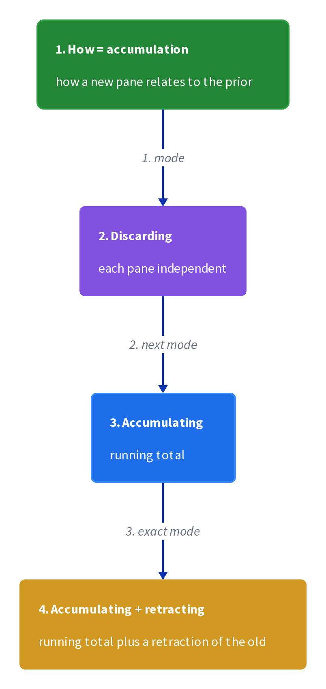</a>
### Checklist: 8. The four-question checklist

**Why.** A design review that omits one axis ships a pipeline whose latency or correctness is an accident rather than a decision.

**Claim.** Ask what, where, when, and how of every pipeline, and its behavior is fully specified.

**Grounding.** Omit "when" and latency is unspecified; omit "how" and refinement correctness is unspecified.

**In the wild.** The book's recurring worked example (team score over sessions) is defined by exactly these four answers.

<a href="../diagrams/d2/card/ch02-7.png">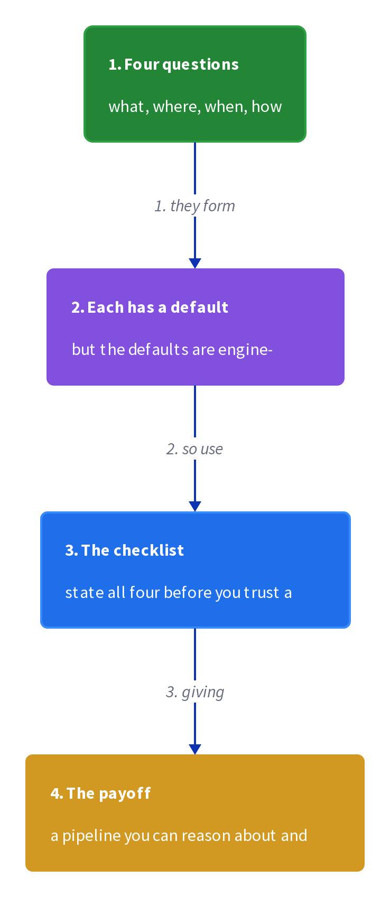</a>

</details>


## Quiz

1. Which four questions fully specify a pipeline in the Beam model?

   - A. Who, what, when, why
   - B. What, where, when, how
   - C. Where, why, which, how
   - D. What, where, when, who

<details><summary>Reveal answer</summary>

**B.** The four axes are what (transformations), where (windowing), when (triggers), and how (accumulation).

</details>

2. What does a watermark declare?

   - A. The exact wall-clock time
   - B. That no more events with event time earlier than t will arrive
   - C. The number of events processed
   - D. The system's CPU load

<details><summary>Reveal answer</summary>

**B.** A watermark is the pipeline's statement of event-time completeness — the threshold past which it expects no older events.

</details>

3. What is allowed lateness?

   - A. A window that never closes
   - B. The horizon after the watermark during which a window still accepts late events
   - C. The maximum event size
   - D. A type of trigger

<details><summary>Reveal answer</summary>

**B.** Allowed lateness bounds how long after the watermark a window keeps accepting and updating with stragglers.

</details>

4. Which accumulation mode avoids double-counting when a window refines an earlier result?

   - A. Discarding
   - B. Accumulating
   - C. Accumulating-and-retracting
   - D. None of the above

<details><summary>Reveal answer</summary>

**C.** Accumulating-and-retracting emits the delta plus a retraction of the previous pane so sinks can undo the old value.

</details>

5. When does an on-time trigger fire?

   - A. When the first event arrives
   - B. When the watermark passes the window end
   - C. Every second
   - D. When the window is empty

<details><summary>Reveal answer</summary>

**B.** On-time emission is driven by the watermark crossing the window's end.

</details>

## Sources

- [Tyler Akidau — "The world beyond batch: Streaming 102"](https://www.oreilly.com/radar/the-world-beyond-batch-streaming-102/) — The original statement of the what/where/when/how questions and their triggers, watermarks, and accumulation
- [Akidau et al. — "The Dataflow Model" (VLDB 2015)](https://www.vldb.org/pvldb/vol8/p1792-Akidau.pdf) — The formal model behind the four questions
- [Apache Beam programming guide](https://beam.apache.org/documentation/programming-guide/) — The four questions as first-class API concepts
- [Apache Flink — Concepts: Time](https://nightlies.apache.org/flink/flink-docs-stable/docs/concepts/time/) — Windowing and watermark semantics in a production engine

