# Chapter 3: Watermarks

> A watermark is a monotonically increasing timestamp that declares how complete the event-time axis is; it is the mechanism that lets a pipeline trade latency against correctness when closing windows.

_Also known as: SS Ch03 · Watermark · Event-time Progress · Heuristic Watermark · Perfect Watermark · Skew_

## Flow

### What a watermark is

> **Why this matters:** A window cannot close until the pipeline believes no more data for that window will arrive, so watermarks exist to state that belief explicitly and let downstream stages act on it.

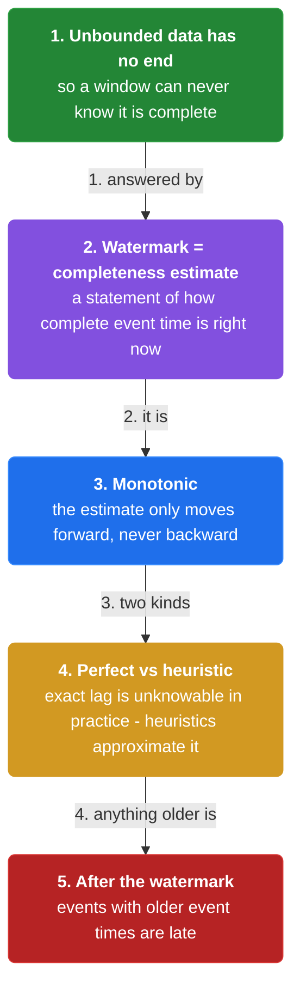

1. **A timestamp that moves forward** — A watermark is a **monotonically increasing** event-time value: once it advances past a point, the pipeline declares it will not see event time earlier than that point again.

2. **It is a statement about completeness** — The watermark is the pipeline's best estimate of event-time completeness. **It is not the wall clock and it is not a guarantee — it is a promise the pipeline makes so triggers can fire.**

3. **Two kinds of watermarks** — A **perfect** watermark is possible when you know inputs are in order (e.g. ingestion-time processing of a single log). A **heuristic** watermark is an estimate when inputs can be out of order (e.g. mobile devices that go offline).

4. **Watermarks drive on-time triggers** — The on-time trigger for a window fires when the watermark passes the window's end. **Everything else — early, late, allowed lateness — is defined relative to the watermark.**

```java
// STREAM SIDE — a perfect watermark advances as a single ordered log is consumed
// DEF: watermark — the pipeline's event-time completeness signal, currently 12:05:00
// DEF: window — the fixed event-time slice [12:00, 12:05)
// -> input : the reader consumes log record {event_time: "12:05:01"}
//    step 1 · the record is in order -> watermark : 12:05:00 -> 12:05:01   BECAUSE a single ordered log has no out-of-order arrivals
//    step 2 · the new watermark passes 12:05:00 -> the window [12:00, 12:05) is now complete
//    step 3 · the on-time trigger fires -> emitted : {window: "12:00-12:05", sum: 7, pane: "on-time"}
// <- outcome : the watermark at 12:05:01 closed the window   BECAUSE 12:05:01 > 12:05:00
//    derivation : this is a perfect watermark because the source is one ordered log, not a set of out-of-order devices
```

### Heuristic watermarks and skew

> **Why this matters:** Real sources are out of order — a phone with no network can send an hour-old event — so pipelines estimate watermarks from what they have seen, and the estimate can be wrong in both directions.

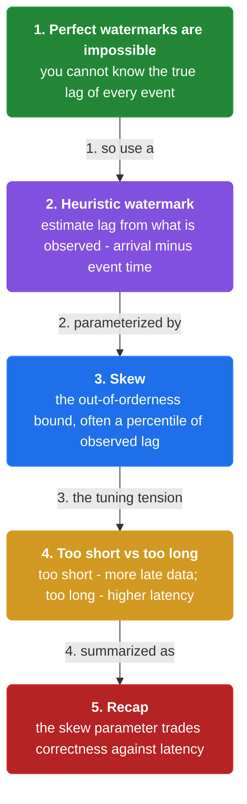

1. **Estimate from observed event time minus lag** — A common heuristic: track the **maximum event time seen so far** and subtract a fixed skew (a bound on out-of-orderness). **watermark = max_seen_event_time - skew.**

2. **Too fast = late data looks late** — If the heuristic advances faster than the true arrival pattern, events that are merely delayed get classified as late. **An over-eager watermark loses data correctness to gain latency.**

3. **Too slow = correct but high latency** — If the skew is too conservative, the watermark lags and windows stay open longer. **An over-cautious watermark keeps results correct but delays on-time output.**

4. **Per-source tracking is more accurate** — When each source has its own idleness pattern, tracking a watermark **per source and taking the minimum** is safer than one global watermark — a single idle source stops dragging the whole pipeline's watermark forward.

```java
// AGGREGATOR SIDE — a heuristic watermark from the max seen event time minus a skew
// DEF: skew — the pipeline's bound on out-of-orderness = 2 min
// DEF: watermark — max_seen_event_time - skew = 12:05:00 (12:07:00 - 2:00), recomputed on every record
// DEF: max_seen — the largest event_time observed so far = 12:07:00
// -> input : the pipeline ingests record {event_time: "12:08:30"}
//    step 1 · the record is newer -> max_seen : 12:07:00 -> 12:08:30   BECAUSE 12:08:30 > 12:07:00
//    step 2 · recompute the watermark -> watermark : 12:05:00 -> 12:06:30   BECAUSE 12:08:30 - 2 min skew = 12:06:30
//    step 3 · a delayed record {event_time: "12:05:10"} arrives -> it is 80 s older than the watermark -> marked late
// <- outcome : the watermark at 12:06:30 closed windows up to 12:06:30, and the 12:05:10 record arrived as a late straggler
//    derivation : watermark = max_seen - skew = 12:08:30 - 2:00 = 12:06:30   BECAUSE the heuristic assumes no record is more than 2 min late
```

### Propagation and correctness

> **Why this matters:** A watermark only matters if every downstream stage sees a coherent value, and a coherent value only helps if the pipeline knows what to do when the estimate is wrong, so this section covers propagation and the failure mode.

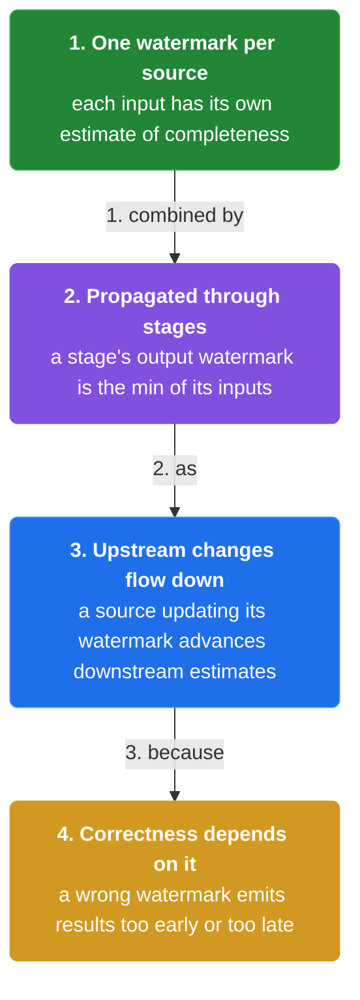

1. **The watermark is the minimum across inputs** — When a stage has multiple upstream sources, **its watermark is the minimum of its inputs' watermarks** — a stage cannot claim more completeness than its least-complete input.

2. **A watermark is an estimate, not a guarantee** — Because heuristics can be wrong, **a watermark that passed does not mean late data will never arrive** — it means the pipeline has chosen to treat the window as closed.

3. **Allowed lateness is the safety net** — When the heuristic is wrong and data arrives after the watermark, **allowed lateness lets the window still accept it** for a bounded horizon, then discard it.

4. **Watermarks are what make event-time pipelines tractable** — Without watermarks, a pipeline can never emit a result that a user can trust as "done for now". **Watermarks convert an unbounded stream into a stream with a notion of progress.**

```java
// JOIN STAGE — two inputs, the stage watermark is the minimum of the two
// DEF: watermark — the stage's completeness signal = min of upstream watermarks = 12:04:30
// DEF: input_a — watermark from the click source = 12:06:00
// DEF: input_b — watermark from the purchase source = 12:04:30
// DEF: stage — the join operator that combines input_a and input_b = the pipeline operator
// STATE (before):
//    stage_watermark : { value: 12:06:00 }
// -> input : the join stage polls input_a at 12:06:00 and input_b at 12:04:30
//    step 1 · read input_a watermark -> stage_watermark : 12:06:00 -> 12:06:00   BECAUSE it is the min of the two so far
//    step 2 · read input_b watermark -> stage_watermark : 12:06:00 -> 12:04:30   BECAUSE 12:04:30 < 12:06:00
//    step 3 · the stage cannot emit a join result keyed at 12:05:00 -> it waits   BECAUSE input_b may still deliver 12:05:00 records
// <- outcome : the stage watermark sits at 12:04:30 until input_b catches up   BECAUSE completeness is bounded by the slowest input
//    derivation : stage_watermark = min(12:06:00, 12:04:30) = 12:04:30
```


## System Design Interview

> **The question:** Design the watermark generator for an event-time pipeline. Premise: the watermark advances as max_seen event time minus a skew bound, so windows close on time and a straggler after the watermark is flagged late.

**The pipeline:** sources (events with event time) -> watermark generator (max_seen − skew) -> window assigner -> per-window state -> trigger/emitter -> dashboard

### sources (events with event time)

_Role: sources — emit events that may be out of order_

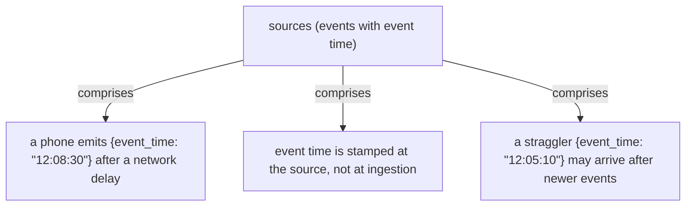

### watermark generator (max_seen − skew)

_Role: watermark generator — estimates event-time completeness_

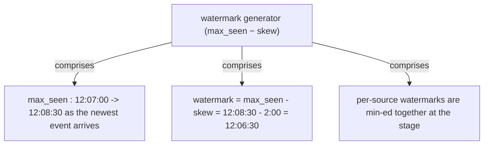

### window assigner

_Role: window assigner — assigns events to event-time windows_

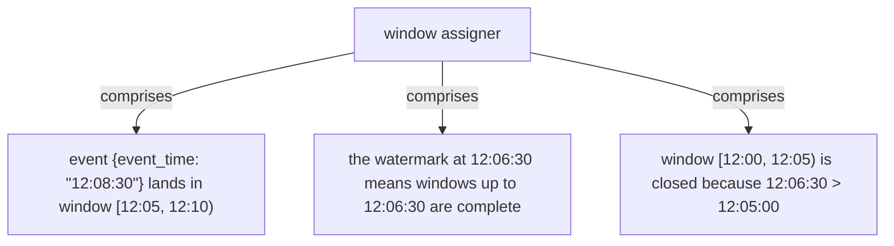

### trigger/emitter

_Role: trigger/emitter — fires on the watermark and handles late data_

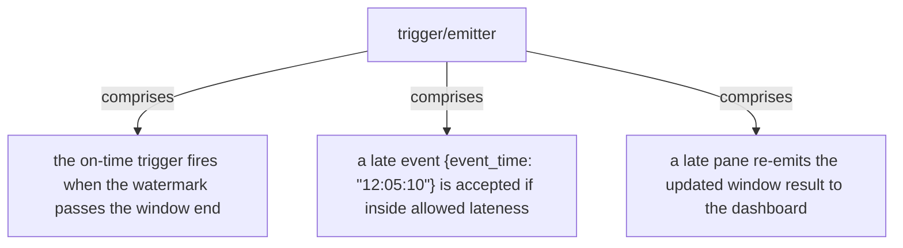

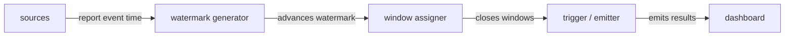

```java
// SYSTEM DESIGN — a watermark closes a window on time and allowed lateness catches one straggler
// DEF: watermark — the pipeline's completeness signal = max_seen - skew = 12:06:30
// DEF: skew — the out-of-orderness bound = 2 min
// DEF: allowed lateness — the horizon after the watermark = 1 min
// DEF: window — the fixed event-time slice = [12:00, 12:05)
// STATE (before):
//    window_state : { "12:00-12:05": 7 }
// -> input : the source emits record {event_time: "12:08:30"}
//    step 1 · max_seen updates -> max_seen : 12:07:00 -> 12:08:30   BECAUSE the record is newer than anything seen
//    step 2 · the watermark recomputes -> watermark : 12:05:00 -> 12:06:30   BECAUSE 12:08:30 - 2:00 skew = 12:06:30
//    step 3 · the on-time trigger fires -> emitted : {window: "12:00-12:05", sum: 7}   BECAUSE 12:06:30 > 12:05:00
// <- outcome : a late record {event_time: "12:05:10"} still updates the window   BECAUSE it is inside allowed lateness
//    derivation : watermark = max_seen - skew = 12:08:30 - 2:00 = 12:06:30
```

## Interview Questions

### Q1

A mobile analytics pipeline groups events by event time, but phones that go offline send events up to an hour late — so some 12:04 events arrive after the 12:05 window has already been reported.

**Interviewer's question:** How do you compute event-time completeness when inputs are out of order, and what do you do about data that arrives after you declared the window complete?

**Solution:** Use a heuristic watermark — max seen event time minus a skew (out-of-orderness bound) — and keep windows alive for an allowed-lateness horizon after the watermark so late events can still update the result.

**System-design components:**
- Heuristic watermark — max_seen − skew
- Skew — bound on out-of-orderness
- Allowed lateness — accepts late data for a bounded horizon
- On-time trigger — fires at the watermark

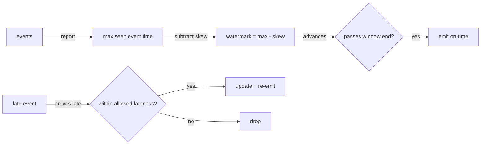

```java
// max_seen = 12:08:30, skew = 2 min
//   watermark = 12:08:30 - 2:00 = 12:06:30
//   window [12:00,12:05) -> closed (12:06:30 > 12:05:00)
//   event @ 12:05:10 arrives -> 80 s older than watermark -> late
//   allowed lateness 1 min -> still accepted -> re-emit
```

_This is exactly the heuristic watermark and skew material in this chapter._

_Covers:_ 3. Heuristic watermarks · 4. Skew (out-of-orderness bound) · 8. Watermarks + allowed lateness

_From the 28 problems:_ 21-ad-click-aggregation · 20-metrics-monitoring

### Q2

A streaming join reads two sources, one fast and one slow; results for 12:05 keep getting emitted with missing data from the slow source.

**Interviewer's question:** Why does the join emit incomplete results, and how do you fix it?

**Solution:** The join stage's watermark is the minimum of its inputs' watermarks, so the slow input stalls completeness; fix it with per-source watermarks and/or buffer the fast side until the slow side's watermark catches up.

**System-design components:**
- Watermark propagation — min across inputs
- Per-source watermarks
- Join buffer — holds the fast side

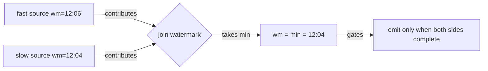

```java
// stage_watermark = min(12:06:00, 12:04:30) = 12:04:30
//   join keyed at 12:05:00 -> cannot emit -> waits on slow source
//   per-source watermarks let the fast side advance independently
```

_This is exactly the watermark-propagation material in this chapter._

_Covers:_ 5. Per-source watermarks · 6. Watermark propagation

_From the 28 problems:_ 21-ad-click-aggregation

## Key Concepts

### The Problem

**1. Unbounded data has no natural "done".** A watermark is that signal — a monotonically increasing event-time timestamp declaring completeness.


### The Solution

A perfect watermark is possible for ordered inputs — a single log consumed in order, or ingestion-time processing.


### Key Facts

| Fact | Detail | In the wild |
|---|---|---|
| 2. Perfect watermarks | A perfect watermark is possible for ordered inputs — a single log consumed in order, or ingestion-time processing. | Ingestion-time pipelines over a single Kafka partition are the classic perfect-watermark case. |
| 3. Heuristic watermarks | A heuristic watermark estimates completeness from observed data — typically max seen event time minus a skew. | Flink's BoundedOutOfOrdernessWatermarkGenerator implements exactly this. |
| 4. Skew (out-of-orderness bound) | Skew is the assumed bound on out-of-orderness subtracted from the max seen event time. | The skew parameter in a Dataflow pipeline is the production form. |
| 5. Per-source watermarks | Track a watermark per source and take the minimum; this lets fast sources advance without being blocked by slow ones. | Per-partition watermarks in Flink are the production form. |
| 6. Watermark propagation | A stage's watermark is the minimum of its inputs' watermarks. | Flink's watermark alignment (min across inputs) is the production form. |
| 7. Latency vs correctness | An eager watermark emits early and risks late data; a cautious watermark waits and delays output. | Tuning the out-of-orderness bound is a routine production decision. |
| 8. Watermarks + allowed lateness | Allowed lateness keeps the window alive for a bounded horizon after the watermark, then drops stragglers. | Dataflow's allowed-lateness setting is the production form. |


### Tradeoffs & When

- An eager watermark emits early and risks late data; a cautious watermark waits and delays output.
- Allowed lateness keeps the window alive for a bounded horizon after the watermark, then drops stragglers.


### Real-World Examples

- **Apache Flink** — BoundedOutOfOrdernessWatermarkGenerator and per-partition watermarks
- **Google Cloud Dataflow** — Watermarks with allowed lateness and trigger configuration
- **Apache Beam** — Watermark as a first-class pipeline concept


<details><summary>All concepts (index)</summary>

### Why: 1. Unbounded data has no natural "done"

**Why.** A stream never ends, so a pipeline cannot know when a window has seen all its data without a signal of progress.

**Claim.** A watermark is that signal — a monotonically increasing event-time timestamp declaring completeness.

**Grounding.** The watermark is the book's central mechanism for event-time progress.

**In the wild.** Dataflow, Flink, and Beam all expose watermarks as first-class concepts.

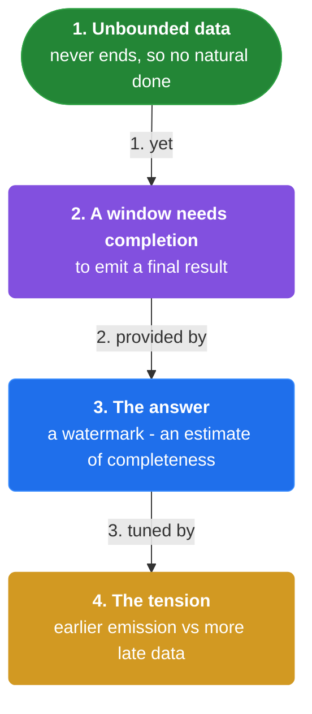
### Perfect: 2. Perfect watermarks

**Why.** If a source is provably ordered, the pipeline can know completeness exactly rather than estimating it.

**Claim.** A perfect watermark is possible for ordered inputs — a single log consumed in order, or ingestion-time processing.

**Grounding.** For an ordered log, every record is at or ahead of the watermark, so the watermark can advance to each record's timestamp.

**In the wild.** Ingestion-time pipelines over a single Kafka partition are the classic perfect-watermark case.

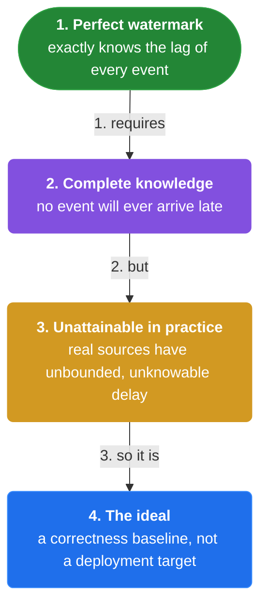
### Heuristic: 3. Heuristic watermarks

**Why.** Out-of-order sources (mobile devices, retries, multi-region collectors) make a perfect watermark impossible.

**Claim.** A heuristic watermark estimates completeness from observed data — typically max seen event time minus a skew.

**Grounding.** watermark = max_seen_event_time − skew is the book's canonical heuristic.

**In the wild.** Flink's BoundedOutOfOrdernessWatermarkGenerator implements exactly this.

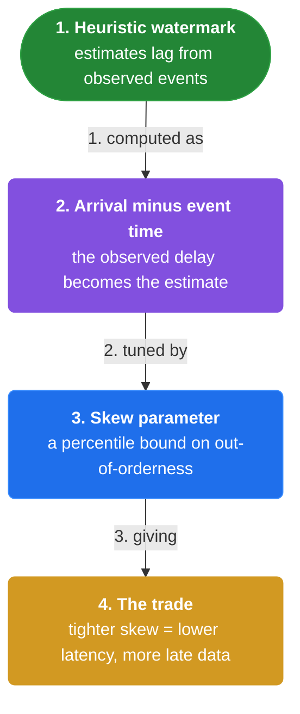
### Parameter: 4. Skew (out-of-orderness bound)

**Why.** A heuristic needs a knob that says how out-of-order the source can be, to trade latency against correctness.

**Claim.** Skew is the assumed bound on out-of-orderness subtracted from the max seen event time.

**Grounding.** Too small a skew mislabels delayed data as late; too large a skew delays on-time output.

**In the wild.** The skew parameter in a Dataflow pipeline is the production form.

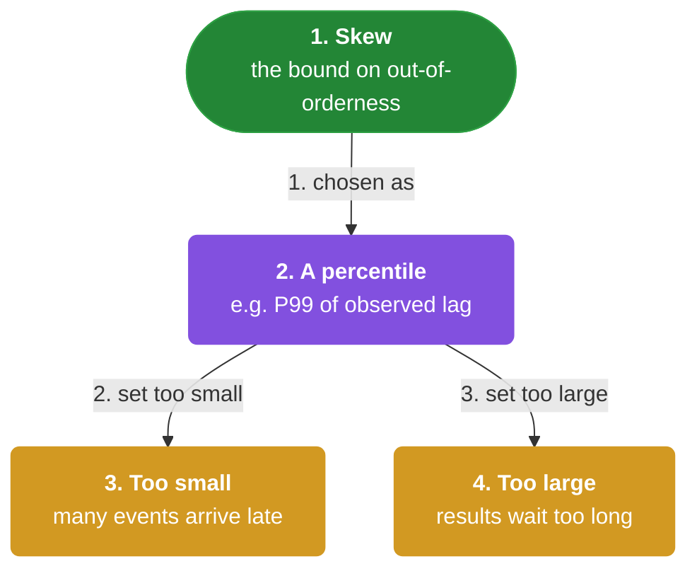
### Bound: 5. Per-source watermarks

**Why.** One global watermark is dragged down by the slowest source — a single idle device stalls completeness for everything.

**Claim.** Track a watermark per source and take the minimum; this lets fast sources advance without being blocked by slow ones.

**Grounding.** The minimum across per-source watermarks is the stage's watermark.

**In the wild.** Per-partition watermarks in Flink are the production form.

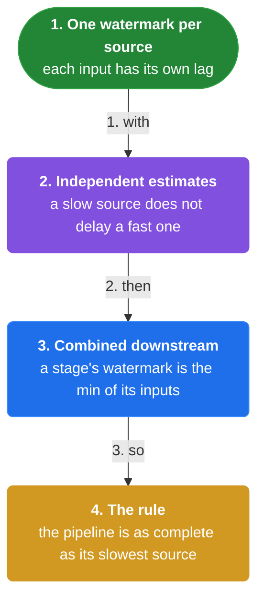
### Propagation: 6. Watermark propagation

**Why.** A stage with multiple inputs cannot claim more completeness than its least-complete input.

**Claim.** A stage's watermark is the minimum of its inputs' watermarks.

**Grounding.** The join stage in the book waits on the slower input before emitting a keyed result.

**In the wild.** Flink's watermark alignment (min across inputs) is the production form.

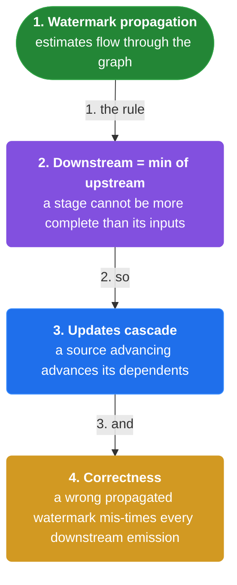
### Tradeoff: 7. Latency vs correctness

**Why.** The watermark's aggressiveness is the single knob that trades result latency against late-data correctness.

**Claim.** An eager watermark emits early and risks late data; a cautious watermark waits and delays output.

**Grounding.** Skew is the parameter that moves the pipeline along this tradeoff.

**In the wild.** Tuning the out-of-orderness bound is a routine production decision.

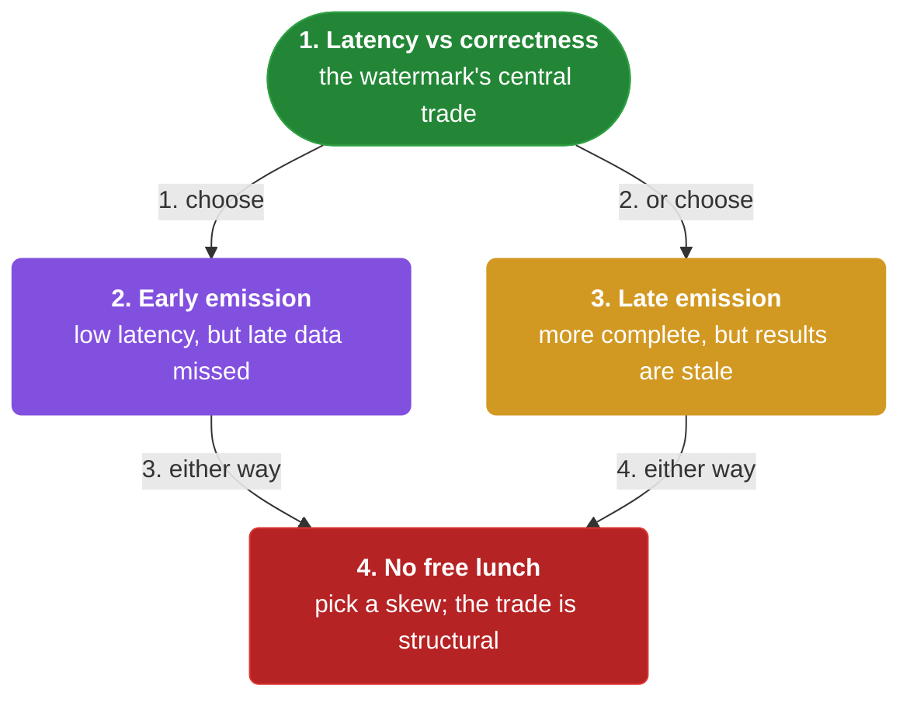
### Safety net: 8. Watermarks + allowed lateness

**Why.** A heuristic watermark can be wrong, so a pipeline needs a bounded way to accept data that arrives after the watermark.

**Claim.** Allowed lateness keeps the window alive for a bounded horizon after the watermark, then drops stragglers.

**Grounding.** It is the garbage collector for window state that outlives the watermark.

**In the wild.** Dataflow's allowed-lateness setting is the production form.

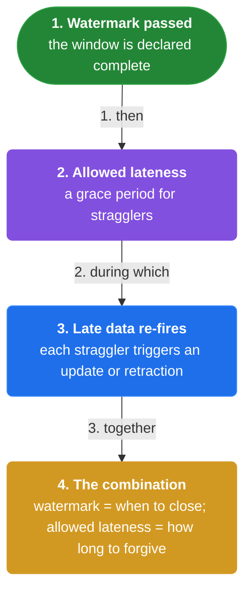

</details>


## Quiz

1. What is a watermark?

   - A. The wall-clock time
   - B. A monotonically increasing timestamp declaring event-time completeness
   - C. The number of events in a window
   - D. A type of window

<details><summary>Reveal answer</summary>

**B.** A watermark is the pipeline's estimate of how complete the event-time axis is.

</details>

2. When is a perfect watermark possible?

   - A. When inputs are out of order
   - B. When the source is provably ordered
   - C. When there are many sources
   - D. When there is no skew

<details><summary>Reveal answer</summary>

**B.** Perfect watermarks require ordered input, such as a single log consumed in order.

</details>

3. What is the canonical heuristic watermark formula?

   - A. watermark = wall clock + skew
   - B. watermark = min event time + skew
   - C. watermark = max seen event time − skew
   - D. watermark = event count / skew

<details><summary>Reveal answer</summary>

**C.** The heuristic subtracts a skew (out-of-orderness bound) from the max seen event time.

</details>

4. A stage's watermark with multiple inputs is the ___ of its inputs' watermarks.

   - A. maximum
   - B. minimum
   - C. sum
   - D. average

<details><summary>Reveal answer</summary>

**B.** Completeness is bounded by the least-complete input, so the stage watermark is the minimum.

</details>

5. What is the downside of an over-eager (too-fast) watermark?

   - A. Higher latency
   - B. Delayed data is mislabeled as late
   - C. Windows never close
   - D. Memory exhaustion

<details><summary>Reveal answer</summary>

**B.** An over-eager watermark gains latency but loses correctness by treating delayed data as late.

</details>

