# Chapter 3: Watermarks

> A watermark is a monotonically increasing timestamp that declares how complete the event-time axis is; it is the mechanism that lets a pipeline trade latency against correctness when closing windows.

_Also known as: SS Ch03 · Watermark · Event-time Progress · Heuristic Watermark · Perfect Watermark · Skew_

## Flow

### What a watermark is

> **Why this matters:** A window cannot close until the pipeline believes no more data for that window will arrive, so watermarks exist to state that belief explicitly and let downstream stages act on it.

1. **A timestamp that moves forward** — A watermark is a **monotonically increasing** event-time value: once it advances past a point, the pipeline declares it will not see event time earlier than that point again.

2. **It is a statement about completeness** — The watermark is the pipeline's best estimate of event-time completeness. **It is not the wall clock and it is not a guarantee — it is a promise the pipeline makes so triggers can fire.**

3. **Two kinds of watermarks** — A **perfect** watermark is possible when you know inputs are in order (e.g. ingestion-time processing of a single log). A **heuristic** watermark is an estimate when inputs can be out of order (e.g. mobile devices that go offline).

4. **Watermarks drive on-time triggers** — The on-time trigger for a window fires when the watermark passes the window's end. **Everything else — early, late, allowed lateness — is defined relative to the watermark.**

<!-- ch03-watermark:begin — generated by tools/gen_ch03.js; do not hand-edit -->

#### Why a watermark is an estimate, and what a correct one would cost

**A watermark is a single event-time value that only moves forward.** Once it advances past a point, the pipeline declares it will not see an event time earlier than that point again.

Monotonicity is not an accident. Event times in this dataset go backwards 2 times — id 6 at 12:03:40 arrives after id 5 at 12:04:20, and id 7 at 12:00:50 arrives last of all. The watermark never decreases, because it is computed from the **maximum** event time seen, which cannot shrink.

**It is a claim about completeness, not a clock reading.** After event id 4 the watermark is 12:03:05 while the wall clock says 12:04:06. Those are not comparable numbers: one asserts which events can still arrive, the other says what time it is. And the assertion is **false** — id 7 (12:00:50) has not arrived.

**A perfect watermark is possible in principle.** Define it as the largest time *t* for which no event with event time below *t* is still to come. Compute it over this stream and it sits at **12:00:50 for 6 of the 9 events**, because id 7 is always still coming. It is correct and useless: nothing can be emitted while it is stalled.

The heuristic reached 12:03:05 over that same span — **135s of apparent progress, all of it an unverified guess.**

**And that is exactly the price of the on-time answer.** Window [12:00, 12:02) holds ids 0, 1, 2, 7, true sum **19**. Under the heuristic it closes after event id 4 and publishes **15** at 12:04:06 — 21% low. Under the perfect watermark it closes after event id 7 and publishes **19** at 12:04:40 — correct, and **34s later**.

#### When a perfect watermark is actually available, and what to do otherwise

**A perfect watermark is available when you know the input is ordered.** Processing a single append-only log by ingestion time is the clean case: the last record's time *is* the completeness bound, with no guess in it. Same for replaying a sorted file.

**It is not available the moment inputs can be out of order** — mobile clients that go offline, multiple partitions merged, retries. Then the only option is a heuristic, which is why this book treats heuristic watermarks as the normal case rather than the fallback.

**The practical consequence: never read "the watermark passed" as "the data is complete."** Read it as "the pipeline decided to stop waiting." The first phrasing makes late data look like a bug; the second makes it a case you design for.

**What this does not settle:** how to pick the skew bound. 60s was assumed here and produced a 21% error on this window. The next concept sweeps that number and finds the exact value at which the error disappears — which turns out not to be the one you would guess.

#### Visual walkthrough — monotonicity, the claim, and the perfect alternative

The animation loops through all 4 steps. Expand any step to study it on its own.



<details>
<summary><b>Step 1 of 4</b> — event times jump around; the watermark only moves forward</summary>


A watermark is a single event-time value that only ever moves forward. Compare the two bottom rows: event times arrive out of order 2 times, and the watermark still never decreases. That is not luck — `max(seen)` cannot shrink, and monotonicity is what lets a window be closed once rather than re-opened.

</details>
<details>
<summary><b>Step 2 of 4</b> — it is a claim about completeness, not a clock reading</summary>

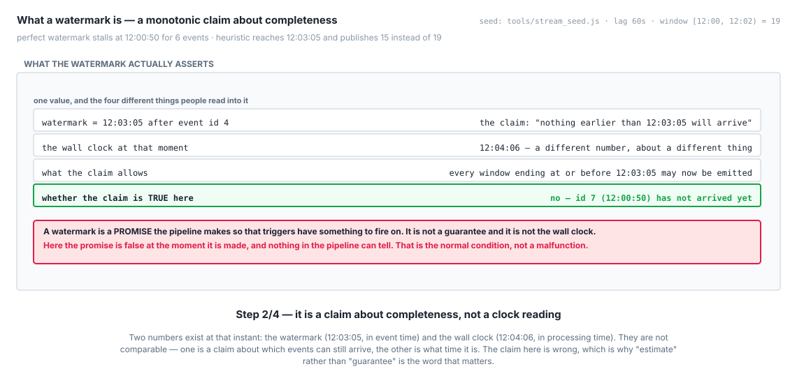

Two numbers exist at that instant: the watermark (12:03:05, in event time) and the wall clock (12:04:06, in processing time). They are not comparable — one is a claim about which events can still arrive, the other is what time it is. The claim here is wrong, which is why "estimate" rather than "guarantee" is the word that matters.

</details>
<details>
<summary><b>Step 3 of 4</b> — a PERFECT watermark exists — and it stalls</summary>

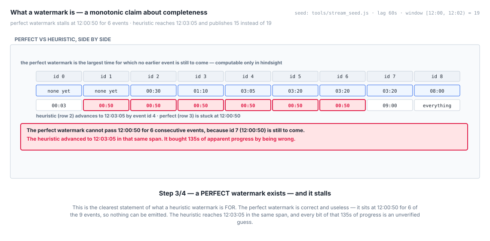

This is the clearest statement of what a heuristic watermark is FOR. The perfect watermark is correct and useless — it sits at 12:00:50 for 6 of the 9 events, so nothing can be emitted. The heuristic reaches 12:03:05 in the same span, and every bit of that 135s of progress is an unverified guess.

</details>
<details>
<summary><b>Step 4 of 4</b> — and that is exactly the price of the on-time answer</summary>

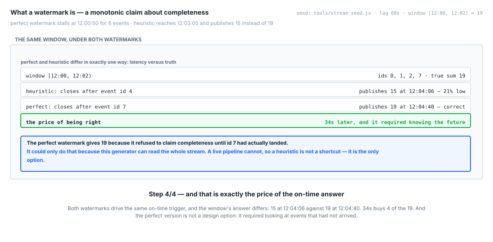

Both watermarks drive the same on-time trigger, and the window's answer differs: 15 at 12:04:06 against 19 at 12:04:40. 34s buys 4 of the 19. And the perfect version is not a design option: it required looking at events that had not arrived.

</details>

<sub>The perfect watermark, its 6-event stall and the 34s latency price are computed from the seed and asserted. Generated by `node tools/gen_ch03.js`.</sub>

<!-- ch03-watermark:end -->

<!-- ch03-watermark-memory:begin — generated by tools/gen_ch03.js; do not hand-edit -->

#### The watermark, computed two ways — stack and heap at every step

**What is being answered.** What a watermark is, by computing two of them over the same stream and feeding both to the same trigger.

`heuristic(events)` reads only `events[0..i]`. `perfect(events)` has an inner loop starting at `i + 1` — it reads events that have not arrived, which is precisely why it is unavailable in production and why step 2 is worth staring at.

`closeW0(wm)` takes a watermark array and does not know which generator made it. Same trigger, same window, same events: 15 at index 4 against 19 at index 7. The 34s difference is the price of the correct answer.

The animation steps through the code, holding each line long enough to read the STACK (call frames and their locals) and the HEAP (allocated arrays and objects) as they are AT THAT MOMENT. Expand any step to study it on its own.



<details>
<summary><b>Step 1 of 4</b> — the max is what makes the watermark monotonic</summary>


Event id 6 has `et` = 220, which is BELOW `seen` = 260, so the `if` does not fire and `seen` is unchanged. The appended watermark is 200 — the same as the previous one. An out-of-order event cannot move the watermark backwards; it simply does not move it.

</details>
<details>
<summary><b>Step 2 of 4</b> — the perfect watermark reads the FUTURE, which is the catch</summary>

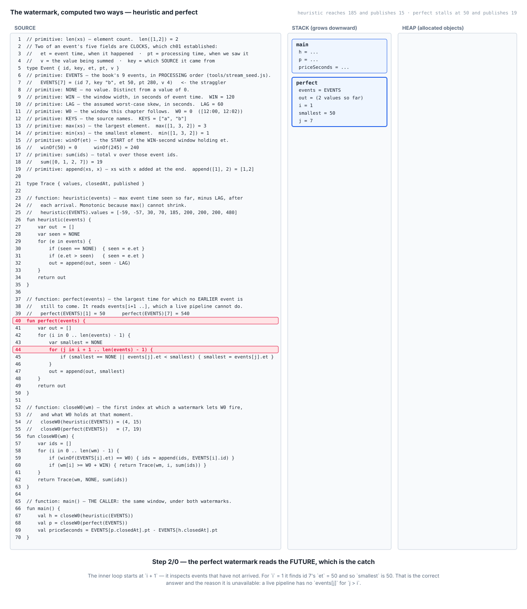

The inner loop starts at `i + 1` — it inspects events that have not arrived. For `i` = 1 it finds id 7's `et` = 50 and so `smallest` is 50. That is the correct answer and the reason it is unavailable: a live pipeline has no `events[j]` for `j > i`.

</details>
<details>
<summary><b>Step 3 of 4</b> — so the perfect watermark is stuck at 50 for 6 events</summary>

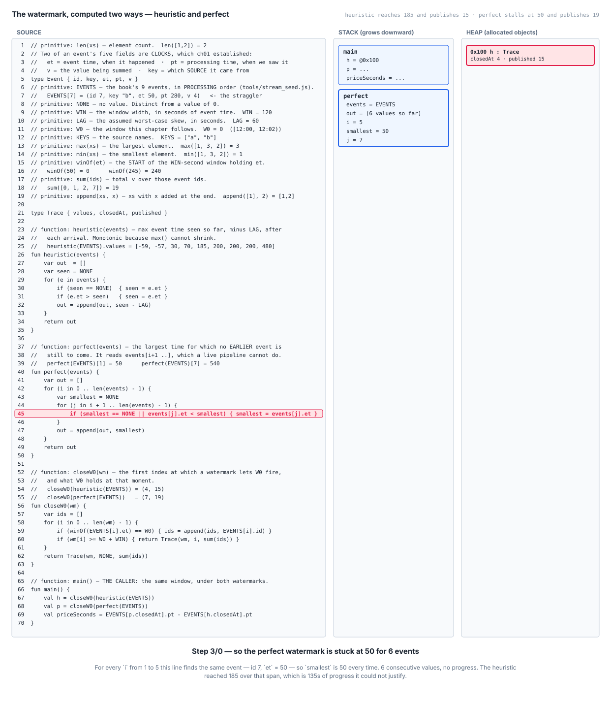

For every `i` from 1 to 5 this line finds the same event — id 7, `et` = 50 — so `smallest` is 50 every time. 6 consecutive values, no progress. The heuristic reached 185 over that span, which is 135s of progress it could not justify.

</details>
<details>
<summary><b>Step 4 of 4</b> — and the window's answer differs by 4</summary>

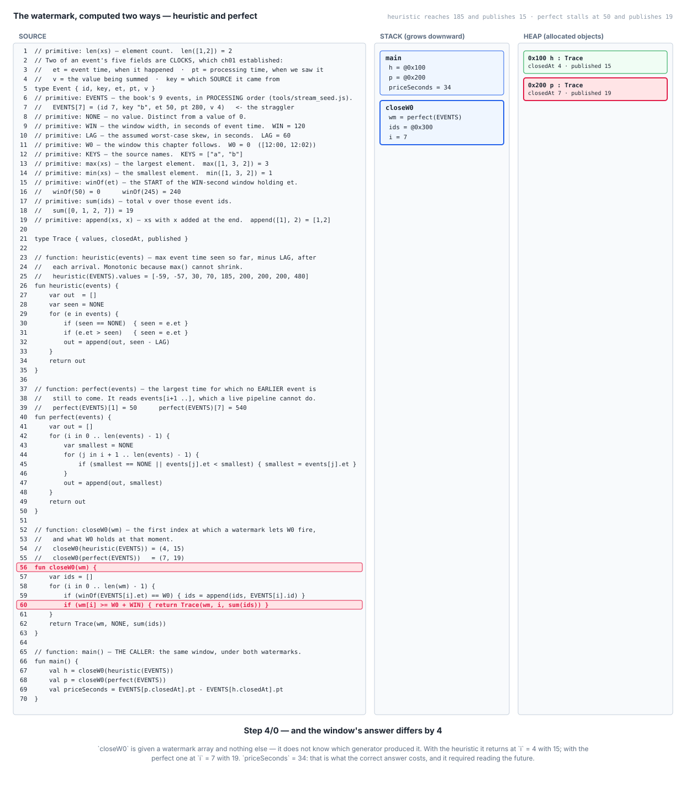

`closeW0` is given a watermark array and nothing else — it does not know which generator produced it. With the heuristic it returns at `i` = 4 with 15; with the perfect one at `i` = 7 with 19. `priceSeconds` = 34: that is what the correct answer costs, and it required reading the future.

</details>

<sub>The 6-event stall, both published values and the 34s price are computed from the seed and asserted. Generated by `node tools/gen_ch03.js` on `tools/memkit.js`.</sub>

<!-- ch03-watermark-memory:end -->

### Heuristic watermarks and skew

> **Why this matters:** Real sources are out of order — a phone with no network can send an hour-old event — so pipelines estimate watermarks from what they have seen, and the estimate can be wrong in both directions.

1. **Estimate from observed event time minus lag** — A common heuristic: track the **maximum event time seen so far** and subtract a fixed skew (a bound on out-of-orderness). **watermark = max_seen_event_time - skew.**

2. **Too fast = late data looks late** — If the heuristic advances faster than the true arrival pattern, events that are merely delayed get classified as late. **An over-eager watermark loses data correctness to gain latency.**

3. **Too slow = correct but high latency** — If the skew is too conservative, the watermark lags and windows stay open longer. **An over-cautious watermark keeps results correct but delays on-time output.**

4. **Per-source tracking is more accurate** — When each source has its own idleness pattern, tracking a watermark **per source and taking the minimum** is safer than one global watermark — a single idle source stops dragging the whole pipeline's watermark forward.

<!-- ch03-skew:begin — generated by tools/gen_ch03.js; do not hand-edit -->

#### Why the skew bound is the only judgement in the formula — and what each value buys

The common heuristic is one line: **watermark = max event time seen so far − skew**. The max is free and exact. The skew is a bound on out-of-orderness that a human chose, and it is the only judgement in the whole mechanism.

**Sweep it and watch what changes.** For window [12:00, 12:02), true sum 19:

- **skew 0s** → closes at 12:02:12, publishes **15**, 2 event(s) classified late (id 6, 7)
- **skew 60s** → closes at 12:04:06, publishes **15**, 1 event(s) classified late (id 7)
- **skew 120s** → closes at 12:04:06, publishes **15**, 1 event(s) classified late (id 7)
- **skew 180s** → closes at 12:09:02, publishes **19**, 0 event(s) classified late
- **skew 141s** → closes at 12:09:02, publishes **19**, 0 event(s) classified late

**Too fast means real events look late.** At skew 0s the pipeline calls 2 events late; at 141s it calls 0 late. Nothing about the data changed between those rows. **"Late" is a verdict the watermark passes, not a property of an event** — an over-eager watermark does not detect lateness, it creates it.

**Too slow means correct and slow.** The threshold is exactly **141s**: at 140s the window still publishes 15, at 141s it publishes 19. The cost is **296s** of added latency on every window.

And note the threshold is **not** id 7's 230s of skew, which is the number most readers would reach for. It is `12:04:20 − 12:02 + 1` — the highest event time seen before the straggler, minus the **window's end**. The watermark only has to stay below the window boundary until the straggler lands; it never has to reach back to 12:00:50. Tuning skew to your worst observed delay over-pays by 89s per window.

#### When to tune skew up, when to track per source, and what neither fixes

**Tune skew up when a late answer is cheaper than a wrong one** — billing, compliance, anything reconciled against another system. You are buying correctness with latency at a measurable rate: here 296s for 4 of 19.

**Tune skew down when a stale answer is worse than an incomplete one** — an ops dashboard, an autoscaler. Accept that some events will be classified late and make sure something downstream can absorb a correction.

**Track per source when sources have different idleness patterns.** Source "a" reaches 12:08:00 by the end of this stream while "b" stops at 12:03:20. A single global watermark would claim 12:08:00 — **280s more completeness than source "b" can back.** Taking the minimum is correct and costs 2 window's output (11, 7).

**What none of this fixes:** the skew bound is unverifiable from inside the pipeline. A run with zero late events is indistinguishable from a run whose late events were silently discarded, so you cannot tell a well-tuned skew from an over-eager one by looking at the output. And per-source tracking introduces its own failure: a source that goes permanently quiet pins the watermark at 12:03:20 forever unless an idleness timeout declares it finished — which is a decision, not a measurement.

#### Visual walkthrough — the formula, the sweep, and the threshold

The animation loops through all 4 steps. Expand any step to study it on its own.



<details>
<summary><b>Step 1 of 4</b> — the heuristic is one line: max seen, minus a guess</summary>


The whole heuristic is `max(seen) − skew`. The max is free and exact; the skew is a number a human chose. So every watermark in this book is one measured quantity minus one guess, and the next two steps are about what happens when the guess is too small or too large.

</details>
<details>
<summary><b>Step 2 of 4</b> — too FAST: the guess is small, so real events look late</summary>

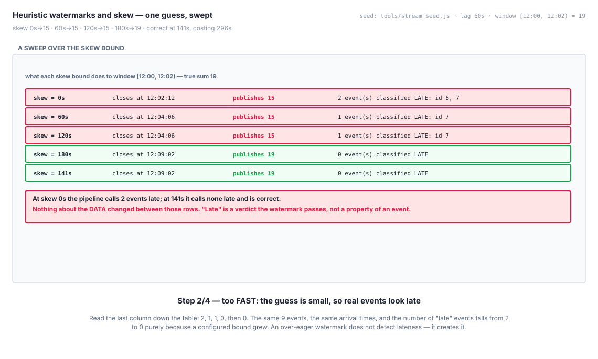

Read the last column down the table: 2, 1, 1, 0, then 0. The same 9 events, the same arrival times, and the number of "late" events falls from 2 to 0 purely because a configured bound grew. An over-eager watermark does not detect lateness — it creates it.

</details>
<details>
<summary><b>Step 3 of 4</b> — too SLOW: correct, and the answer arrives much later</summary>

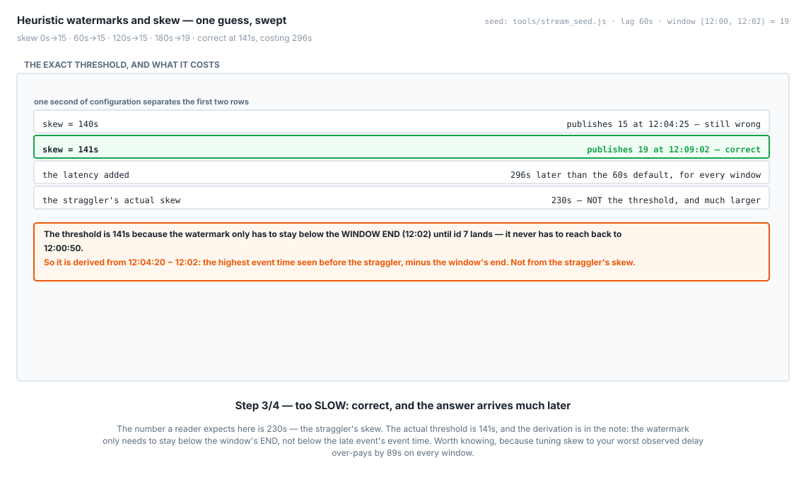

The number a reader expects here is 230s — the straggler's skew. The actual threshold is 141s, and the derivation is in the note: the watermark only needs to stay below the window's END, not below the late event's event time. Worth knowing, because tuning skew to your worst observed delay over-pays by 89s on every window.

</details>
<details>
<summary><b>Step 4 of 4</b> — and per-source tracking beats one global guess</summary>

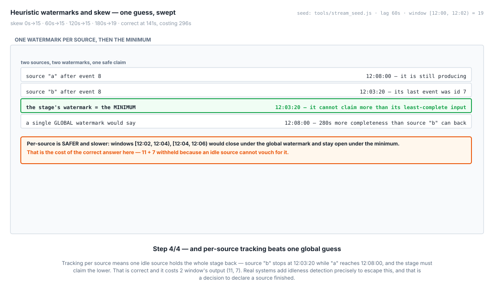

Tracking per source means one idle source holds the whole stage back — source "b" stops at 12:03:20 while "a" reaches 12:08:00, and the stage must claim the lower. That is correct and it costs 2 window's output (11, 7). Real systems add idleness detection precisely to escape this, and that is a decision to declare a source finished.

</details>

<sub>The sweep, the 141s threshold and the per-source minimum are computed from the seed and asserted; 140s is checked to be still wrong. Generated by `node tools/gen_ch03.js`.</sub>

<!-- ch03-skew:end -->

<!-- ch03-skew-memory:begin — generated by tools/gen_ch03.js; do not hand-edit -->

#### Sweeping the skew bound — stack and heap at every step

**What is being answered.** Where "late" comes from — as one function, `evaluate(lag)`, run at four different skew bounds over the same 9 events.

The line to read twice is in `isLate`: `return c < i`. It compares the **window's closing index** with the **event's arrival index**, and never looks at the event's own skew. That is the mechanical form of "late is a verdict, not a property".

`LAG_MIN` = 141 is derived rather than chosen: the highest event time seen before the straggler (260) minus the window's end (120), plus one. It is far below the straggler's 230s of skew, because the watermark only has to stay under the window boundary.

The animation steps through the code, holding each line long enough to read the STACK (call frames and their locals) and the HEAP (allocated arrays and objects) as they are AT THAT MOMENT. Expand any step to study it on its own.



<details>
<summary><b>Step 1 of 4</b> — the whole heuristic is one subtraction</summary>


`maxEtThrough(3)` is 130 and `lag` is 0, so the watermark is 130 — already past 120, so W0 fires at index 3. With `lag` = 60 it would be 70 and the window would hold. One subtraction, and it decides when every window in the pipeline speaks.

</details>
<details>
<summary><b>Step 2 of 4</b> — "late" is a verdict about the WINDOW, not about the event</summary>

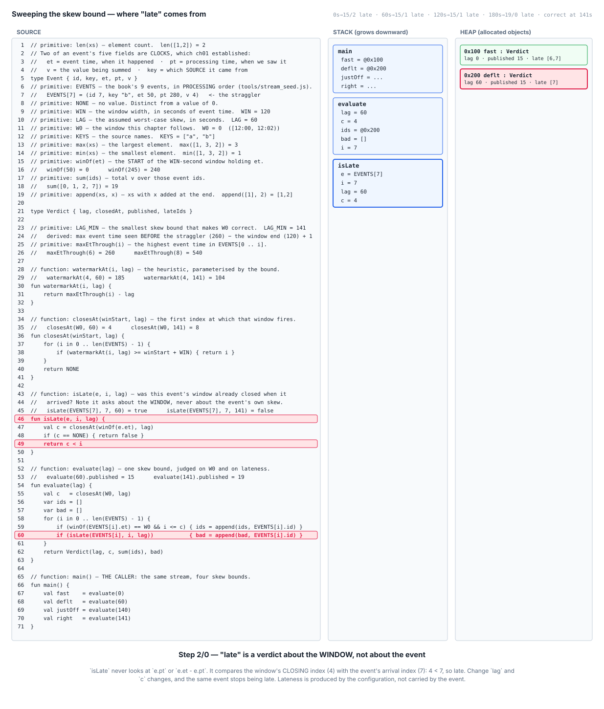

`isLate` never looks at `e.pt` or `e.et - e.pt`. It compares the window's CLOSING index (4) with the event's arrival index (7): 4 < 7, so late. Change `lag` and `c` changes, and the same event stops being late. Lateness is produced by the configuration, not carried by the event.

</details>
<details>
<summary><b>Step 3 of 4</b> — one second below the threshold is still wrong</summary>

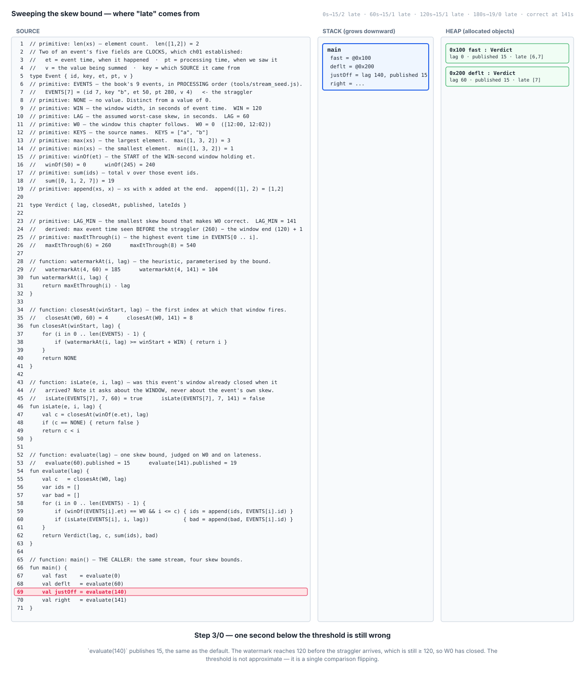

`evaluate(140)` publishes 15, the same as the default. The watermark reaches 120 before the straggler arrives, which is still ≥ 120, so W0 has closed. The threshold is not approximate — it is a single comparison flipping.

</details>
<details>
<summary><b>Step 4 of 4</b> — and at the threshold, nothing is late at all</summary>

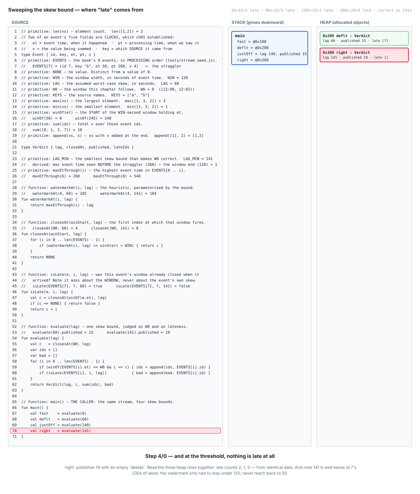

`right` publishes 19 with an empty `lateIds`. Read the three heap rows together: late counts 2, 1, 0 — from identical data. And note 141 is well below id 7's 230s of skew: the watermark only had to stay under 120, never reach back to 50.

</details>

<sub>The sweep, the 141s threshold and the 140s counter-check are computed from the seed and asserted. Generated by `node tools/gen_ch03.js` on `tools/memkit.js`.</sub>

<!-- ch03-skew-memory:end -->

### Propagation and correctness

> **Why this matters:** A watermark only matters if every downstream stage sees a coherent value, and a coherent value only helps if the pipeline knows what to do when the estimate is wrong, so this section covers propagation and the failure mode.

1. **The watermark is the minimum across inputs** — When a stage has multiple upstream sources, **its watermark is the minimum of its inputs' watermarks** — a stage cannot claim more completeness than its least-complete input.

2. **A watermark is an estimate, not a guarantee** — Because heuristics can be wrong, **a watermark that passed does not mean late data will never arrive** — it means the pipeline has chosen to treat the window as closed.

3. **Allowed lateness is the safety net** — When the heuristic is wrong and data arrives after the watermark, **allowed lateness lets the window still accept it** for a bounded horizon, then discard it.

4. **Watermarks are what make event-time pipelines tractable** — Without watermarks, a pipeline can never emit a result that a user can trust as "done for now". **Watermarks convert an unbounded stream into a stream with a notion of progress.**

<!-- ch03-propagation:begin — generated by tools/gen_ch03.js; do not hand-edit -->

#### Why a stage takes the minimum, and why "closed" is not "complete"

**When a stage has several upstream inputs, its watermark is the minimum of theirs.** The reason is a one-liner: a stage cannot claim more completeness than its least-complete input.

Trace it on this stream, treating the two keys as two sources. Until source "b" has produced anything, the stage has **no claim at all** — not a generous one — because silence is indistinguishable from "an old event is still coming". At the end, source "a" has reached 12:08:00 and "b" is at 12:03:20, so the stage must claim **12:03:20**.

**And a passed watermark is a decision, not a fact.** Four readings of the same event, only the last accurate:

- the watermark passed 12:02 after event id 4 — a fact about the pipeline's arithmetic
- "no event earlier than 12:02 will arrive" — the claim it implies, and it is false
- id 7 (12:00:50) arrives 3 events later — the counter-example nothing predicted
- so the window was not **complete**; it was **closed** — the pipeline chose to stop waiting

Substituting "complete" for "closed" is what makes late data feel like a bug. It is the pipeline having decided, with an error attached: 21% of this window's answer.

**So allowed lateness is the safety net under the estimate**, and the three mechanisms layer in order: the watermark estimates completeness and is wrong; the on-time trigger acts on the estimate and publishes 15; allowed lateness keeps the state so id 7 can correct it to 19. Each exists because the previous one is imperfect — and the horizon is bounded on purpose, because unbounded recovery means unbounded state.

#### When the minimum rule bites, and what watermarks actually buy

**The minimum rule bites whenever one input is slower or quieter than the others.** 2 window here — [12:02, 12:04), [12:04, 12:06), holding 11, 7 — closes under a single global watermark and stays open under the minimum. The data for it has all arrived. It is withheld because one source cannot vouch for the time range.

**That is correct behaviour and it looks like a bug in production.** The symptom is output stopping while the pipeline reports healthy, and the cause is an input nobody is watching. It is the reason real systems add idleness detection — which is a decision to declare a source finished, not a measurement of anything.

**And the thing watermarks actually buy:** without one, window [12:00, 12:02) can **never** be emitted. On an unbounded stream there is no moment at which "everything has arrived" becomes true. The alternatives are a processing-time trigger, which answers a different question, or waiting forever, which answers none.

So watermarks do not make event-time processing *correct* — they make it *possible*. This window is emitted 21% wrong and correctable, and that trade is the foundation the rest of the book builds on.

**What this does not settle:** 2 window stays open because a source went quiet, and no amount of skew tuning fixes it — that is a structural property of taking the minimum. The fix is an idleness timeout, which trades the correctness the minimum was protecting.

#### Visual walkthrough — the minimum, the decision, and the safety net

The animation loops through all 4 steps. Expand any step to study it on its own.



<details>
<summary><b>Step 1 of 4</b> — a stage cannot claim more than its least-complete input</summary>


Propagation is a one-line rule with a sharp consequence: a stage's watermark is the minimum over its inputs. Read the first two columns — the stage cannot claim anything while source "b" is silent, because silence is indistinguishable from "an old event is still coming". Taking the maximum, or ignoring a quiet input, is how a pipeline claims completeness it has no basis for.

</details>
<details>
<summary><b>Step 2 of 4</b> — the watermark passing is a DECISION, not a fact</summary>

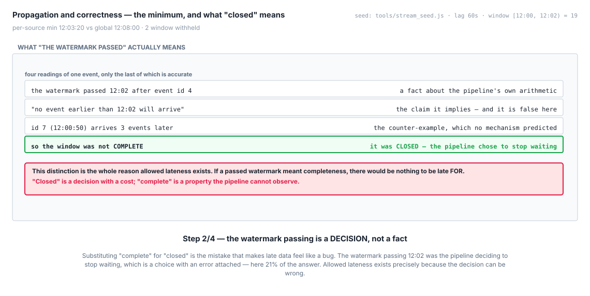

Substituting "complete" for "closed" is the mistake that makes late data feel like a bug. The watermark passing 12:02 was the pipeline deciding to stop waiting, which is a choice with an error attached — here 21% of the answer. Allowed lateness exists precisely because the decision can be wrong.

</details>
<details>
<summary><b>Step 3 of 4</b> — so allowed lateness is the safety net under the estimate</summary>

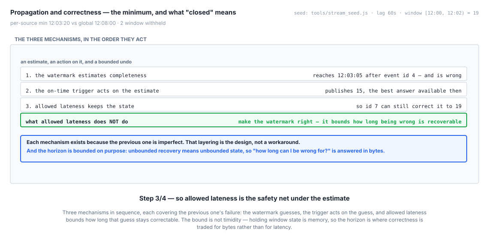

Three mechanisms in sequence, each covering the previous one's failure: the watermark guesses, the trigger acts on the guess, and allowed lateness bounds how long that guess stays correctable. The bound is not timidity — holding window state is memory, so the horizon is where correctness is traded for bytes rather than for latency.

</details>
<details>
<summary><b>Step 4 of 4</b> — and this is what makes an event-time pipeline usable at all</summary>

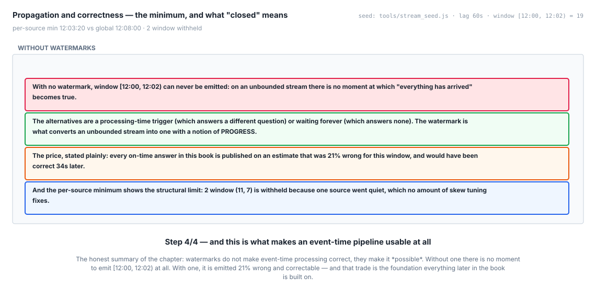

The honest summary of the chapter: watermarks do not make event-time processing correct, they make it *possible*. Without one there is no moment to emit [12:00, 12:02) at all. With one, it is emitted 21% wrong and correctable — and that trade is the foundation everything later in the book is built on.

</details>

<sub>The per-source watermarks, their minimum and the withheld window are computed from the seed and asserted. Generated by `node tools/gen_ch03.js`.</sub>

<!-- ch03-propagation:end -->

<!-- ch03-propagation-memory:begin — generated by tools/gen_ch03.js; do not hand-edit -->

#### Propagation — stack and heap at every step

**What is being answered.** Why a stage takes the minimum over its inputs, and what that costs — as three watermark functions over the same stream, treating the two keys as two sources.

`stageWatermark(i)` has the line that matters: `if (w == NONE) { return NONE }`. A source that has produced nothing blocks the claim completely, because silence cannot be distinguished from a pending old event.

`globalWatermark(i)` is the shortcut — max over everything, ignoring sources — and it claims 480 where the safe answer is 200. Step 4 shows the price of being right: window [12:02, 12:04) holds 11, has received every one of its events, and is withheld anyway.

The animation steps through the code, holding each line long enough to read the STACK (call frames and their locals) and the HEAP (allocated arrays and objects) as they are AT THAT MOMENT. Expand any step to study it on its own.



<details>
<summary><b>Step 1 of 4</b> — a source that has said nothing blocks the claim entirely</summary>


At `i` = 0 only source "a" has produced anything, so `sourceWatermark("b", 0)` is NONE and this line returns immediately. The stage makes NO claim — not a generous one. Silence is indistinguishable from "an old event is still coming", so it cannot be treated as completeness.

</details>
<details>
<summary><b>Step 2 of 4</b> — the claim is the lowest of the inputs, never the highest</summary>

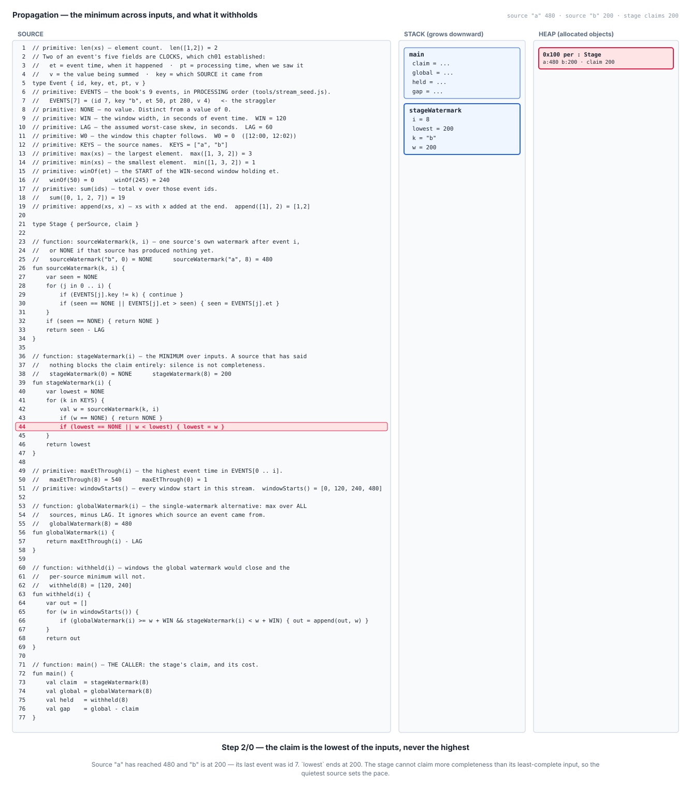

Source "a" has reached 480 and "b" is at 200 — its last event was id 7. `lowest` ends at 200. The stage cannot claim more completeness than its least-complete input, so the quietest source sets the pace.

</details>
<details>
<summary><b>Step 3 of 4</b> — a single global watermark would over-claim</summary>

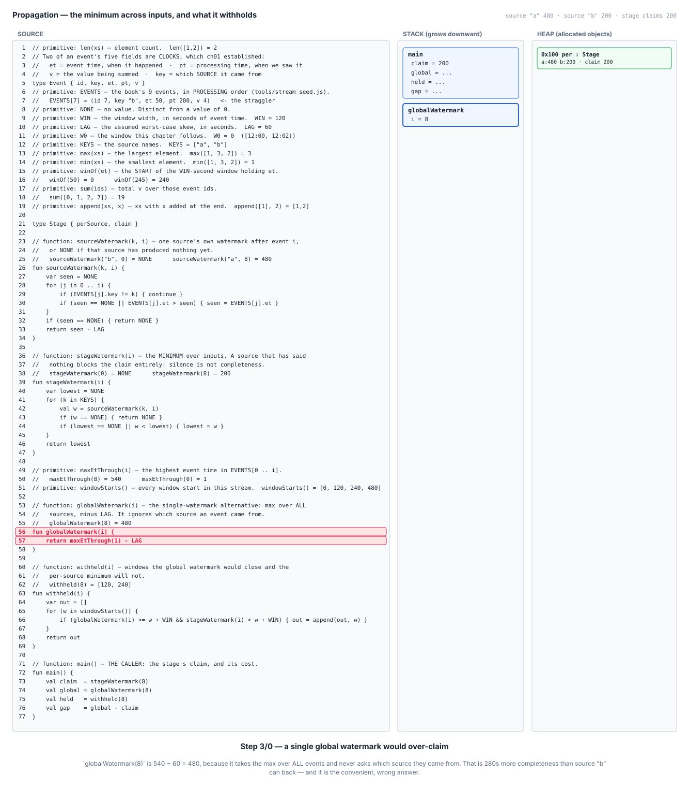

`globalWatermark(8)` is 540 − 60 = 480, because it takes the max over ALL events and never asks which source they came from. That is 280s more completeness than source "b" can back — and it is the convenient, wrong answer.

</details>
<details>
<summary><b>Step 4 of 4</b> — and the correct claim withholds a window that is actually complete</summary>

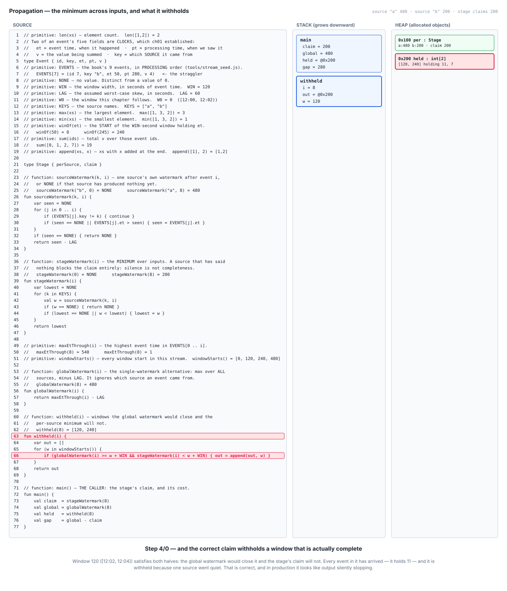

Window 120 ([12:02, 12:04)) satisfies both halves: the global watermark would close it and the stage's claim will not. Every event in it has arrived — it holds 11 — and it is withheld because one source went quiet. That is correct, and in production it looks like output silently stopping.

</details>

<sub>The per-source watermarks, the minimum, and the withheld window list are computed from the seed and asserted. Generated by `node tools/gen_ch03.js` on `tools/memkit.js`.</sub>

<!-- ch03-propagation-memory:end -->


## Links & The Bigger Picture

Concepts this chapter mentions but does not fully unpack are linked below — each pointer names the chapter where the concept is covered in depth and gives a concrete example that ties the two chapters together.

- **[Chapter 1: Streaming 101 → Event time vs processing time](ch01-streaming-101.md#event-time-vs-processing-time)** — why a watermark is needed at all — the two clocks diverge, so the pipeline must state its belief about event-time completeness rather than trust the wall clock.
  - _Example:_ ch03's watermark 12:06:30 marks a 12:05:10 record late; ch01 explains the root cause: a click at 12:00:59 processed at 12:04:11 is late by 192 s of queueing delay.
- **[Chapter 2: The What, Where, When, and How of Data Processing → When — triggers and watermarks](ch02-the-what-where-when-and-how-of-data-processing.md#when--triggers-and-watermarks)** — where the watermark sits in the four-question model — it is the mechanism behind the "when" axis, driving early/on-time/late triggers.
  - _Example:_ ch03's on-time trigger fires when the watermark passes 12:05:00; ch02 shows the same window emitting early (12:02), on-time (12:05), and late (12:06) panes as the watermark moves.
- **[Chapter 4: Advanced Windowing → Session semantics and pitfalls](ch04-advanced-windowing.md#session-semantics-and-pitfalls)** — the watermark is what lets a pipeline garbage-collect window state — sessions and other windows die when the watermark passes their end plus allowed lateness.
  - _Example:_ ch03's allowed-lateness horizon (60 s) is the garbage collector; ch04 shows a late event at 12:20:00 reviving two already-emitted sessions and forcing a retraction because the watermark had not yet passed their end + lateness.
- **[Chapter 8: Streaming SQL → Windows in SQL](ch08-streaming-sql.md#windows-in-sql)** — streaming SQL hides the watermark mechanics but not its semantics — the same completeness signal is what makes a TUMBLE/HOP/SESSION result emit.
  - _Example:_ ch03's watermark 12:06:30 closing window [12:00,12:05) is exactly what ch08's TUMBLE(event_time, 5 min) query waits for before emitting its COUNT row.
- **[Chapter 9: Streaming Joins → Why joins are hard on streams](ch09-streaming-joins.md#why-joins-are-hard-on-streams)** — a multi-input watermark propagates as the minimum of its inputs — and that single rule is what bounds a windowed join.
  - _Example:_ ch03's join stage takes min(12:06:00, 12:04:30) = 12:04:30 and waits; ch09 shows that same minimum gating when a click 12:03 matches an impression 12:02 but holds until both sides pass 12:05:00.

## System Design Interview

> **The question:** Design the watermark generator for an event-time pipeline. Premise: the watermark advances as max_seen event time minus a skew bound, so windows close on time and a straggler after the watermark is flagged late.

**The pipeline:** sources (events with event time) -> watermark generator (max_seen − skew) -> window assigner -> per-window state -> trigger/emitter -> dashboard

<a href="../diagrams/d2/decomp/ch03-0.png">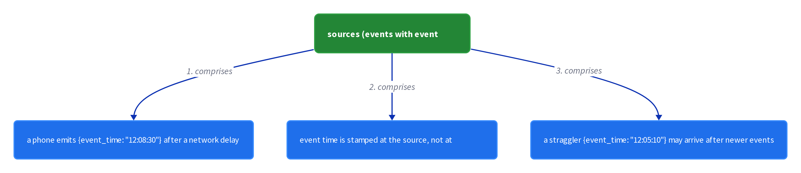</a>

### sources (events with event time)

_Role: sources — emit events that may be out of order_

- a phone emits {event_time: "12:08:30"} after a network delay
- event time is stamped at the source, not at ingestion
- a straggler {event_time: "12:05:10"} may arrive after newer events

### watermark generator (max_seen − skew)

_Role: watermark generator — estimates event-time completeness_

- max_seen : 12:07:00 -> 12:08:30 as the newest event arrives
- watermark = max_seen - skew = 12:08:30 - 2:00 = 12:06:30
- per-source watermarks are min-ed together at the stage

### window assigner

_Role: window assigner — assigns events to event-time windows_

- event {event_time: "12:08:30"} lands in window [12:05, 12:10)
- the watermark at 12:06:30 means windows up to 12:06:30 are complete
- window [12:00, 12:05) is closed because 12:06:30 > 12:05:00

### trigger/emitter

_Role: trigger/emitter — fires on the watermark and handles late data_

- the on-time trigger fires when the watermark passes the window end
- a late event {event_time: "12:05:10"} is accepted if inside allowed lateness
- a late pane re-emits the updated window result to the dashboard


<!-- ch03-system:begin — generated by tools/gen_ch03.js; do not hand-edit -->

#### Why this component is small, and why its failures look like wrong totals

**The question.** Design the watermark generator for an event-time pipeline: it advances as max-seen event time minus a skew bound, so windows close on time and a straggler afterwards is flagged late.

**The pipeline:** sources → **watermark generator** → window assigner → per-window state → trigger/emitter → dashboard.

**First, the blast radius.** The generator emits one number, and exactly one component consumes it: the trigger. The window assigner is pure `winOf(e.et)` and never sees the watermark. So a watermark bug **cannot** put an event in the wrong window — it can only make a window speak too early or too late. That is why its failures present as under-counted totals rather than scattered data, and why "our numbers are low" maps back to this component.

**Second, why `max()` is in the formula.** The naive version — this event's own time minus the skew — looks equivalent. Compute both and the naive one goes **backwards 2 times**: 12:03:20 → 12:02:40 (−40s), and 12:02:40 → none yet (−170s).

A watermark that moves backwards **re-opens a window that was already closed and published.** Every downstream guarantee is built on monotonicity, and `max()` is the single function call that provides it.

**Third, the two settings.** The skew bound: 60s publishes 15 at 12:04:06 with 1 event late; 141s publishes 19 at 12:09:02 with 0 late, 296s slower. And the scope: one global watermark claims 12:08:00 at the end, which is 280s more than source "b" supports; the per-source minimum claims 12:03:20 and withholds 11, 7.

#### When each setting is right, and the four things this does not settle

**Use a global watermark when all sources are symmetric and busy** — one Kafka topic read by one consumer group with even traffic. It is simpler and it is not wrong when no input can go quiet relative to the others.

**Use per-source tracking the moment idleness is possible** — per-partition, per-device, per-region. The minimum is the safe claim, and the price is visible: 2 window withheld here.

**Pair per-source tracking with an idleness timeout,** always. Without one, a source that disappears pins the watermark at 12:03:20 forever and every window stops closing. That is the single most common way this component takes a pipeline down, and it presents as a stall rather than an error.

**What this design does NOT settle — four gaps:**

1. **The 60s skew bound is unverifiable from inside.** Nothing distinguishes "no late events arrived" from "late events were already discarded", so the output cannot tell you whether the bound is well tuned.
2. **Per-source tracking needs to know the source set.** A source that never appears cannot be waited for, and one that disappears needs a timeout — which is a decision to declare it finished, trading away the correctness the minimum was protecting.
3. **Monotonicity holds only within one run.** `max()` guarantees it here, but a generator that restarts and recomputes from a checkpoint can emit a value below one it already published — and nothing downstream is prepared for that.
4. **Window [12:08, …) never closes under ANY skew bound in the sweep**, because no event ever pushes the watermark past its end. The generator is working correctly and that window's 8 is simply never published.

#### Visual walkthrough — placement, the max(), and the two knobs

The animation loops through all 4 steps. Expand any step to study it on its own.



<details>
<summary><b>Step 1 of 4</b> — the generator sits between the sources and the windows</summary>


Worth being precise about the blast radius: the watermark feeds exactly one consumer, the trigger. Windowing is `winOf(e.et)` and never sees it. That is why a mis-tuned skew produces an under-counted window rather than scattered data — and why "my numbers are low" is the symptom to map back to this component.

</details>
<details>
<summary><b>Step 2 of 4</b> — the naive formula goes BACKWARDS — twice</summary>

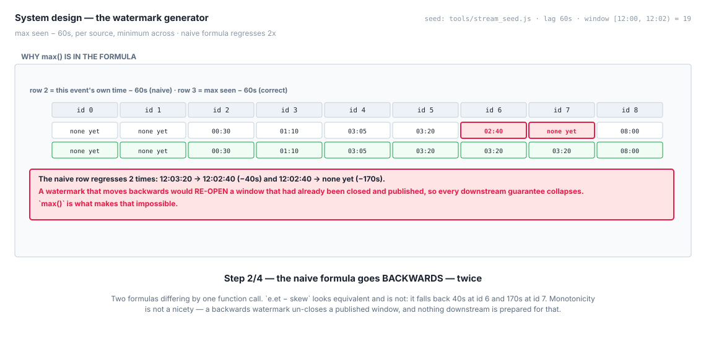

Two formulas differing by one function call. `e.et − skew` looks equivalent and is not: it falls back 40s at id 6 and 170s at id 7. Monotonicity is not a nicety — a backwards watermark un-closes a published window, and nothing downstream is prepared for that.

</details>
<details>
<summary><b>Step 3 of 4</b> — the two settings, and their exact thresholds</summary>

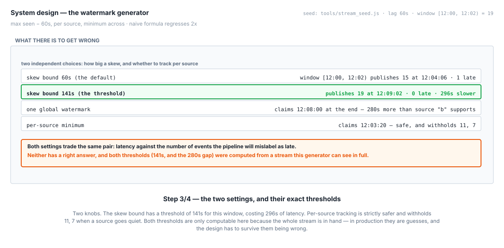

Two knobs. The skew bound has a threshold of 141s for this window, costing 296s of latency. Per-source tracking is strictly safer and withholds 11, 7 when a source goes quiet. Both thresholds are only computable here because the whole stream is in hand — in production they are guesses, and the design has to survive them being wrong.

</details>
<details>
<summary><b>Step 4 of 4</b> — and what the generator does NOT settle</summary>

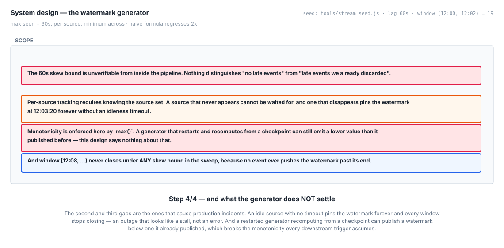

The second and third gaps are the ones that cause production incidents. An idle source with no timeout pins the watermark forever and every window stops closing — an outage that looks like a stall, not an error. And a restarted generator recomputing from a checkpoint can publish a watermark below one it already published, which breaks the monotonicity every downstream trigger assumes.

</details>

<sub>The naive formula's 2 regressions, both thresholds and the withheld window are computed from the seed and asserted. Generated by `node tools/gen_ch03.js`.</sub>

<!-- ch03-system:end -->

<!-- ch03-system-memory:begin — generated by tools/gen_ch03.js; do not hand-edit -->

#### The watermark generator — stack and heap at every step

**What is being answered.** Why the watermark formula contains `max()`, by running both formulas over the same stream and counting what goes wrong.

`naiveWatermark(e)` is `e.et - LAG` — the version that looks equivalent. `correctWatermark(seen, e)` adds one line. `run(useMax)` generates both and counts any value lower than its predecessor.

The counts are 2 and 0. Step 4 then shows why that matters: a regression takes window 0, which had already fired and published, back to "not yet complete". Monotonicity is not tidiness — it is the property every downstream trigger assumes.

The animation steps through the code, holding each line long enough to read the STACK (call frames and their locals) and the HEAP (allocated arrays and objects) as they are AT THAT MOMENT. Expand any step to study it on its own.



<details>
<summary><b>Step 1 of 4</b> — the naive formula reads only the CURRENT event</summary>


Event id 6 has `et` = 220, so the naive watermark is 160. But `prev` is 200 and `seen` is already 260 — the event is out of order, and the formula has no memory of that. Note `seen` is correct and simply unused on this path.

</details>
<details>
<summary><b>Step 2 of 4</b> — so it goes BACKWARDS — 2 times</summary>

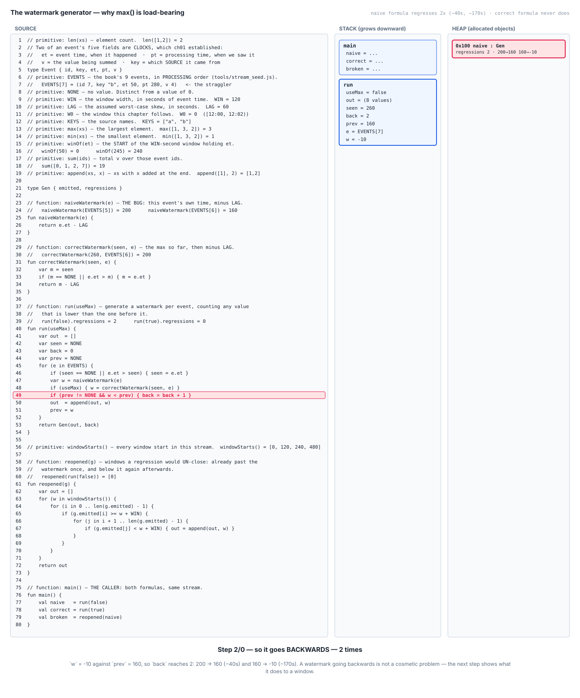

`w` = -10 against `prev` = 160, so `back` reaches 2: 200 → 160 (−40s) and 160 → -10 (−170s). A watermark going backwards is not a cosmetic problem — the next step shows what it does to a window.

</details>
<details>
<summary><b>Step 3 of 4</b> — one line makes it monotonic</summary>

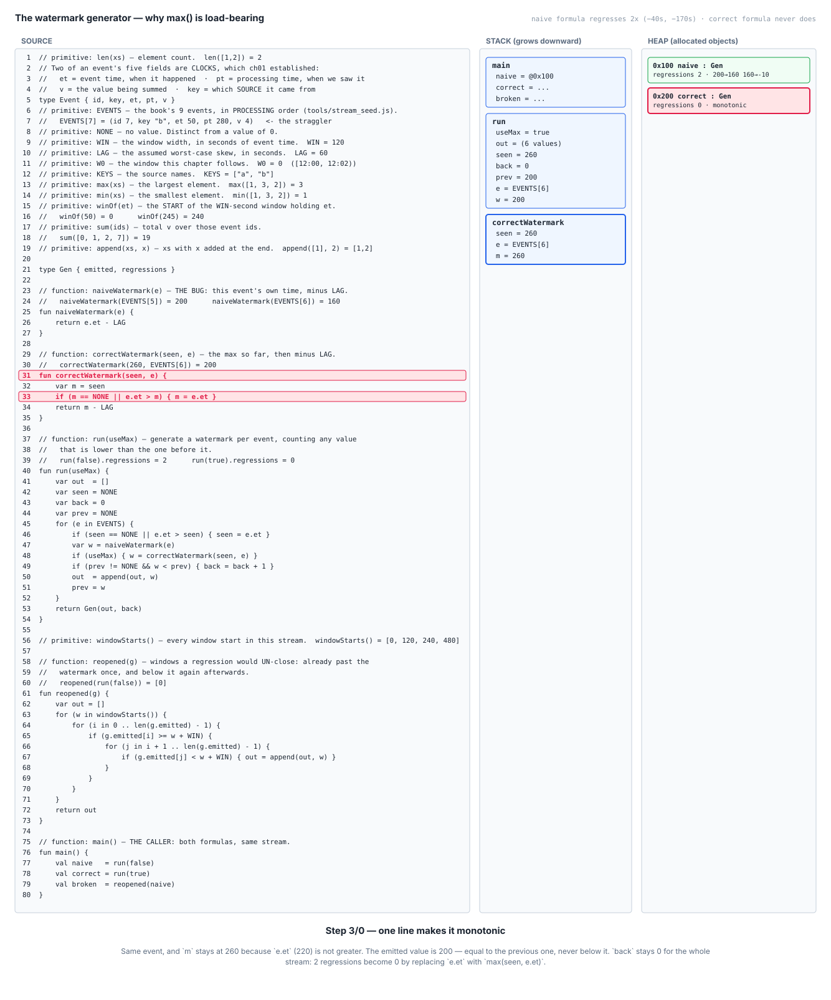

Same event, and `m` stays at 260 because `e.et` (220) is not greater. The emitted value is 200 — equal to the previous one, never below it. `back` stays 0 for the whole stream: 2 regressions become 0 by replacing `e.et` with `max(seen, e.et)`.

</details>
<details>
<summary><b>Step 4 of 4</b> — and a regression would UN-close a published window</summary>

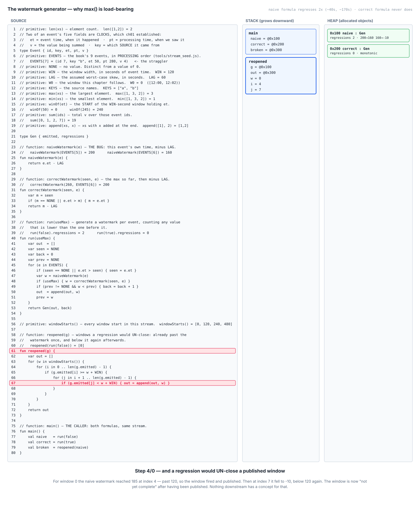

For window 0 the naive watermark reached 185 at index 4 — past 120, so the window fired and published. Then at index 7 it fell to -10, below 120 again. The window is now "not yet complete" after having been published. Nothing downstream has a concept for that.

</details>

<sub>Both formulas' outputs, the 2 regressions and the re-opened window are computed from the seed and asserted. Generated by `node tools/gen_ch03.js` on `tools/memkit.js`.</sub>

<!-- ch03-system-memory:end -->

## Interview Questions

### Q1

A mobile analytics pipeline groups events by event time, but phones that go offline send events up to an hour late — so some 12:04 events arrive after the 12:05 window has already been reported.

**Interviewer's question:** How do you compute event-time completeness when inputs are out of order, and what do you do about data that arrives after you declared the window complete?

**Solution:** Use a heuristic watermark — max seen event time minus a skew (out-of-orderness bound) — and keep windows alive for an allowed-lateness horizon after the watermark so late events can still update the result.

**System-design components:**
- Heuristic watermark — max_seen − skew
- Skew — bound on out-of-orderness
- Allowed lateness — accepts late data for a bounded horizon
- On-time trigger — fires at the watermark

```java
// max_seen = 12:08:30, skew = 2 min
//   watermark = 12:08:30 - 2:00 = 12:06:30
//   window [12:00,12:05) -> closed (12:06:30 > 12:05:00)
//   event @ 12:05:10 arrives -> 80 s older than watermark -> late
//   allowed lateness 1 min -> still accepted -> re-emit
```

_This is exactly the heuristic watermark and skew material in this chapter._

_Covers:_ 3. Heuristic watermarks · 4. Skew (out-of-orderness bound) · 8. Watermarks + allowed lateness

_From the 28 problems:_ 21-ad-click-aggregation · 20-metrics-monitoring

### Q2

A streaming join reads two sources, one fast and one slow; results for 12:05 keep getting emitted with missing data from the slow source.

**Interviewer's question:** Why does the join emit incomplete results, and how do you fix it?

**Solution:** The join stage's watermark is the minimum of its inputs' watermarks, so the slow input stalls completeness; fix it with per-source watermarks and/or buffer the fast side until the slow side's watermark catches up.

**System-design components:**
- Watermark propagation — min across inputs
- Per-source watermarks
- Join buffer — holds the fast side

```java
// stage_watermark = min(12:06:00, 12:04:30) = 12:04:30
//   join keyed at 12:05:00 -> cannot emit -> waits on slow source
//   per-source watermarks let the fast side advance independently
```

_This is exactly the watermark-propagation material in this chapter._

_Covers:_ 5. Per-source watermarks · 6. Watermark propagation

_From the 28 problems:_ 21-ad-click-aggregation

## Key Concepts

### The Problem

**1. Unbounded data has no natural "done".** A watermark is that signal — a monotonically increasing event-time timestamp declaring completeness.


### The Solution

A perfect watermark is possible for ordered inputs — a single log consumed in order, or ingestion-time processing.

```java
// max_seen = 12:08:30, skew = 2 min
//   watermark = 12:08:30 - 2:00 = 12:06:30
//   window [12:00,12:05) -> closed (12:06:30 > 12:05:00)
//   event @ 12:05:10 arrives -> 80 s older than watermark -> late
//   allowed lateness 1 min -> still accepted -> re-emit
```


### Key Facts

| Fact | Detail | In the wild |
|---|---|---|
| 2. Perfect watermarks | A perfect watermark is possible for ordered inputs — a single log consumed in order, or ingestion-time processing. | Ingestion-time pipelines over a single Kafka partition are the classic perfect-watermark case. |
| 3. Heuristic watermarks | A heuristic watermark estimates completeness from observed data — typically max seen event time minus a skew. | Flink's BoundedOutOfOrdernessWatermarkGenerator implements exactly this. |
| 4. Skew (out-of-orderness bound) | Skew is the assumed bound on out-of-orderness subtracted from the max seen event time. | The skew parameter in a Dataflow pipeline is the production form. |
| 5. Per-source watermarks | Track a watermark per source and take the minimum; this lets fast sources advance without being blocked by slow ones. | Per-partition watermarks in Flink are the production form. |
| 6. Watermark propagation | A stage's watermark is the minimum of its inputs' watermarks. | Flink's watermark alignment (min across inputs) is the production form. |
| 7. Latency vs correctness | An eager watermark emits early and risks late data; a cautious watermark waits and delays output. | Tuning the out-of-orderness bound is a routine production decision. |
| 8. Watermarks + allowed lateness | Allowed lateness keeps the window alive for a bounded horizon after the watermark, then drops stragglers. | Dataflow's allowed-lateness setting is the production form. |


### Tradeoffs & When

- An eager watermark emits early and risks late data; a cautious watermark waits and delays output.
- Allowed lateness keeps the window alive for a bounded horizon after the watermark, then drops stragglers.


### Real-World Examples

- **Apache Flink** — BoundedOutOfOrdernessWatermarkGenerator subtracts an out-of-orderness bound from the max observed event time; per-partition watermarks and idle sources
- **Google Cloud Dataflow** — Watermarks with allowed lateness and trigger configuration
- **Apache Beam** — Watermark as a first-class pipeline concept
- **Google MillWheel** — The low watermark that pioneered event-time completeness tracking in production


<details><summary>All concepts (index)</summary>

### Why: 1. Unbounded data has no natural "done"

**Why.** A stream never ends, so a pipeline cannot know when a window has seen all its data without a signal of progress.

**Claim.** A watermark is that signal — a monotonically increasing event-time timestamp declaring completeness.

**Grounding.** The watermark is the book's central mechanism for event-time progress.

**In the wild.** Dataflow, Flink, and Beam all expose watermarks as first-class concepts.

<a href="../diagrams/d2/card/ch03-0.png">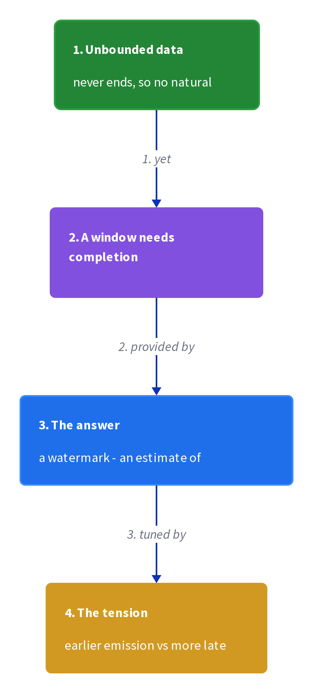</a>
### Perfect: 2. Perfect watermarks

**Why.** If a source is provably ordered, the pipeline can know completeness exactly rather than estimating it.

**Claim.** A perfect watermark is possible for ordered inputs — a single log consumed in order, or ingestion-time processing.

**Grounding.** For an ordered log, every record is at or ahead of the watermark, so the watermark can advance to each record's timestamp.

**In the wild.** Ingestion-time pipelines over a single Kafka partition are the classic perfect-watermark case.

<a href="../diagrams/d2/card/ch03-1.png">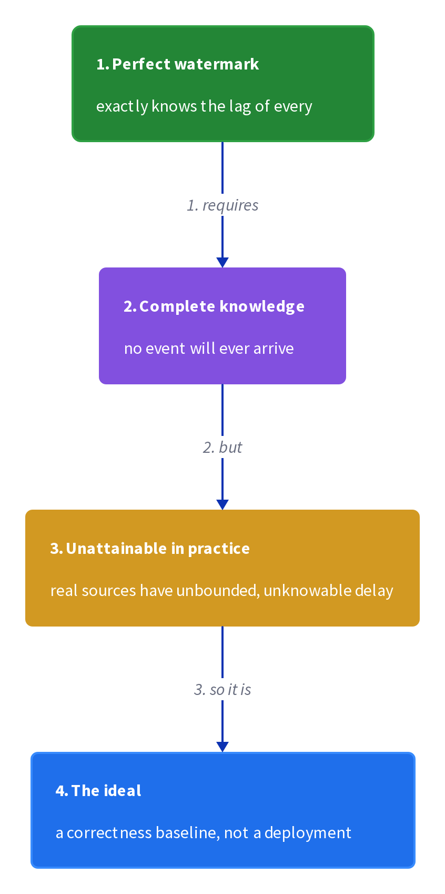</a>
### Heuristic: 3. Heuristic watermarks

**Why.** Out-of-order sources (mobile devices, retries, multi-region collectors) make a perfect watermark impossible.

**Claim.** A heuristic watermark estimates completeness from observed data — typically max seen event time minus a skew.

**Grounding.** watermark = max_seen_event_time − skew is the book's canonical heuristic.

**In the wild.** Flink's BoundedOutOfOrdernessWatermarkGenerator implements exactly this.

<a href="../diagrams/d2/card/ch03-2.png">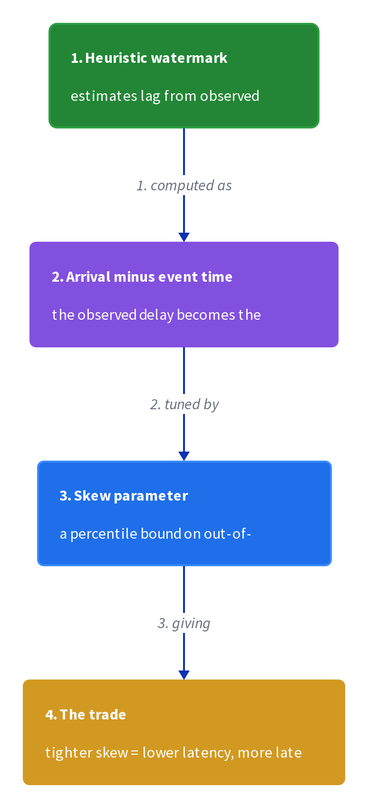</a>
### Parameter: 4. Skew (out-of-orderness bound)

**Why.** A heuristic needs a knob that says how out-of-order the source can be, to trade latency against correctness.

**Claim.** Skew is the assumed bound on out-of-orderness subtracted from the max seen event time.

**Grounding.** Too small a skew mislabels delayed data as late; too large a skew delays on-time output.

**In the wild.** The skew parameter in a Dataflow pipeline is the production form.

<a href="../diagrams/d2/card/ch03-3.png">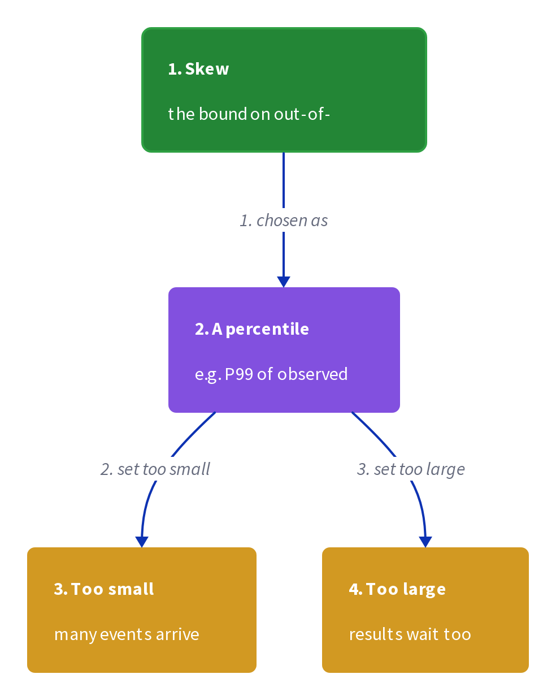</a>
### Bound: 5. Per-source watermarks

**Why.** One global watermark is dragged down by the slowest source — a single idle device stalls completeness for everything.

**Claim.** Track a watermark per source and take the minimum; this lets fast sources advance without being blocked by slow ones.

**Grounding.** The minimum across per-source watermarks is the stage's watermark.

**In the wild.** Per-partition watermarks in Flink are the production form.

<a href="../diagrams/d2/card/ch03-4.png">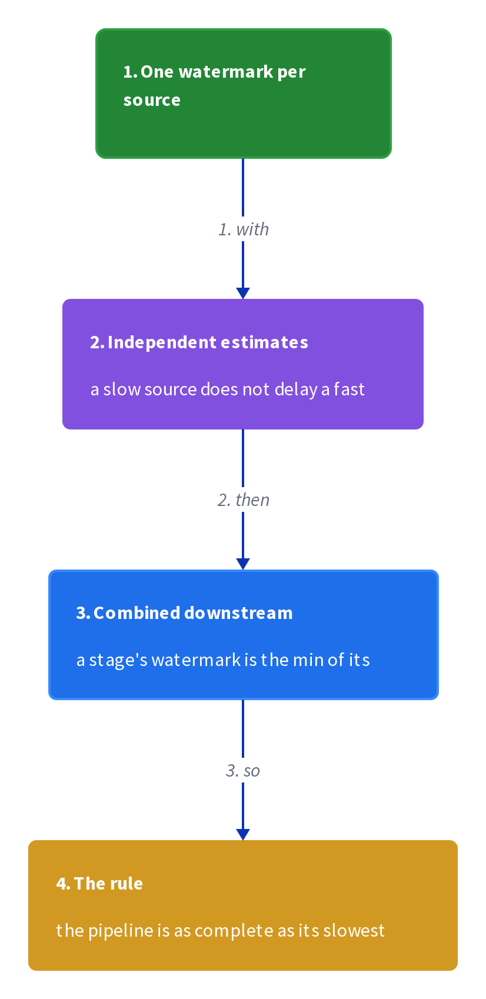</a>
### Propagation: 6. Watermark propagation

**Why.** A stage with multiple inputs cannot claim more completeness than its least-complete input.

**Claim.** A stage's watermark is the minimum of its inputs' watermarks.

**Grounding.** The join stage in the book waits on the slower input before emitting a keyed result.

**In the wild.** Flink's watermark alignment (min across inputs) is the production form.

<a href="../diagrams/d2/card/ch03-5.png">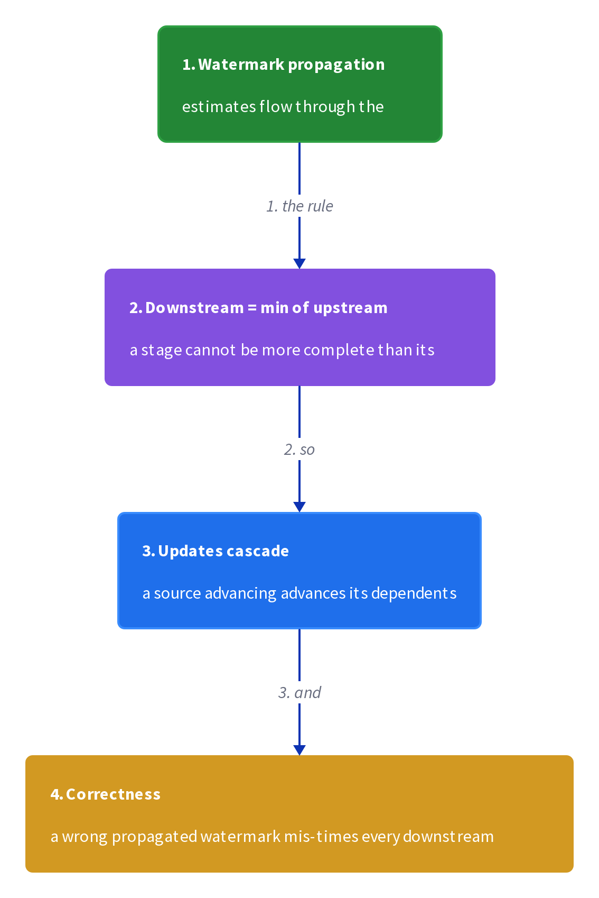</a>
### Tradeoff: 7. Latency vs correctness

**Why.** The watermark's aggressiveness is the single knob that trades result latency against late-data correctness.

**Claim.** An eager watermark emits early and risks late data; a cautious watermark waits and delays output.

**Grounding.** Skew is the parameter that moves the pipeline along this tradeoff.

**In the wild.** Tuning the out-of-orderness bound is a routine production decision.

<a href="../diagrams/d2/card/ch03-6.png">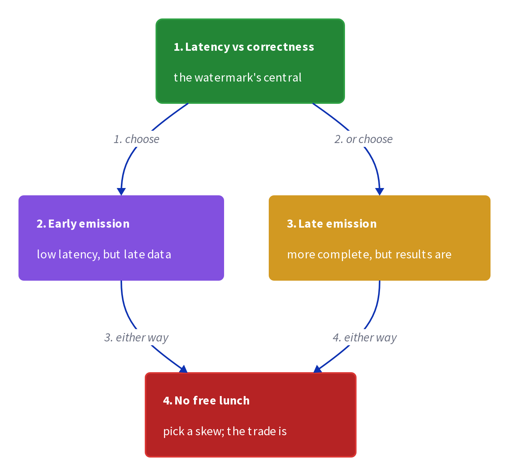</a>
### Safety net: 8. Watermarks + allowed lateness

**Why.** A heuristic watermark can be wrong, so a pipeline needs a bounded way to accept data that arrives after the watermark.

**Claim.** Allowed lateness keeps the window alive for a bounded horizon after the watermark, then drops stragglers.

**Grounding.** It is the garbage collector for window state that outlives the watermark.

**In the wild.** Dataflow's allowed-lateness setting is the production form.

<a href="../diagrams/d2/card/ch03-7.png">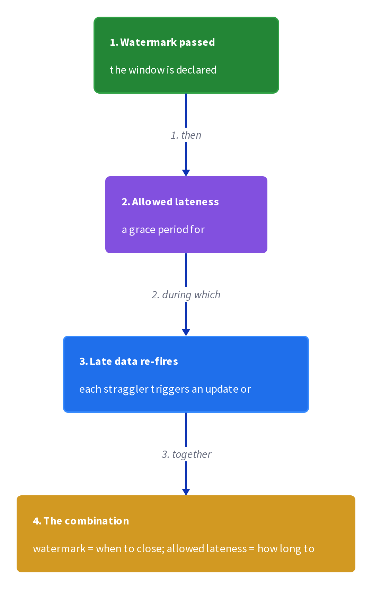</a>

</details>


## Quiz

1. What is a watermark?

   - A. The wall-clock time
   - B. A monotonically increasing timestamp declaring event-time completeness
   - C. The number of events in a window
   - D. A type of window

<details><summary>Reveal answer</summary>

**B.** A watermark is the pipeline's estimate of how complete the event-time axis is.

</details>

2. When is a perfect watermark possible?

   - A. When inputs are out of order
   - B. When the source is provably ordered
   - C. When there are many sources
   - D. When there is no skew

<details><summary>Reveal answer</summary>

**B.** Perfect watermarks require ordered input, such as a single log consumed in order.

</details>

3. What is the canonical heuristic watermark formula?

   - A. watermark = wall clock + skew
   - B. watermark = min event time + skew
   - C. watermark = max seen event time − skew
   - D. watermark = event count / skew

<details><summary>Reveal answer</summary>

**C.** The heuristic subtracts a skew (out-of-orderness bound) from the max seen event time.

</details>

4. A stage's watermark with multiple inputs is the ___ of its inputs' watermarks.

   - A. maximum
   - B. minimum
   - C. sum
   - D. average

<details><summary>Reveal answer</summary>

**B.** Completeness is bounded by the least-complete input, so the stage watermark is the minimum.

</details>

5. What is the downside of an over-eager (too-fast) watermark?

   - A. Higher latency
   - B. Delayed data is mislabeled as late
   - C. Windows never close
   - D. Memory exhaustion

<details><summary>Reveal answer</summary>

**B.** An over-eager watermark gains latency but loses correctness by treating delayed data as late.

</details>

## Sources

- [Slava Chernyak — "Watermarks: Time and Progress in Apache Beam and Beyond" (talk)](https://www.youtube.com/watch?v=TWxSLmkWPm4) — A conference talk on how watermarks track event-time progress in Beam and beyond
- [Akidau et al. — "MillWheel: Fault-Tolerant Stream Processing at Internet Scale" (VLDB 2013)](https://research.google/pubs/pub41378/) — Introduced the low watermark for out-of-order stream processing at Google
- [Akidau et al. — "The Dataflow Model" (VLDB 2015)](https://www.vldb.org/pvldb/vol8/p1792-Akidau.pdf) — Defines watermarks as the mechanism that trades latency against correctness
- [Apache Flink — Generating watermarks](https://nightlies.apache.org/flink/flink-docs-stable/docs/dev/datastream/event-time/generating_watermarks/) — How a production engine computes bounded-out-of-orderness and per-partition watermarks
- [Apache Beam programming guide](https://beam.apache.org/documentation/programming-guide/) — Watermarks and lateness as part of the Beam model

