# Chapter 3: Watermarks

> A watermark is a monotonically increasing timestamp that declares how complete the event-time axis is; it is the mechanism that lets a pipeline trade latency against correctness when closing windows.

_Also known as: SS Ch03 · Watermark · Event-time Progress · Heuristic Watermark · Perfect Watermark · Skew_

## Flow

### What a watermark is

> **Why this matters:** A window cannot close until the pipeline believes no more data for that window will arrive, so watermarks exist to state that belief explicitly and let downstream stages act on it.

1. **A timestamp that moves forward** — A watermark is a **monotonically increasing** event-time value: once it advances past a point, the pipeline declares it will not see event time earlier than that point again.

2. **It is a statement about completeness** — The watermark is the pipeline's best estimate of event-time completeness. **It is not the wall clock and it is not a guarantee — it is a promise the pipeline makes so triggers can fire.**

3. **Two kinds of watermarks** — A **perfect** watermark is possible when you know inputs are in order (e.g. ingestion-time processing of a single log). A **heuristic** watermark is an estimate when inputs can be out of order (e.g. mobile devices that go offline).

4. **Watermarks drive on-time triggers** — The on-time trigger for a window fires when the watermark passes the window's end. **Everything else — early, late, allowed lateness — is defined relative to the watermark.**

<!-- ch03-watermark:begin — generated by tools/gen_ch03.js; do not hand-edit -->

#### Why a watermark is an estimate, and what a correct one would cost

**A watermark is a single event-time value that only moves forward.** Once it advances past a point, the pipeline declares it will not see an event time earlier than that point again.

Monotonicity is not an accident. Event times in this dataset go backwards 2 times — id 6 at 12:03:40 arrives after id 5 at 12:04:20, and id 7 at 12:00:50 arrives last of all. The watermark never decreases, because it is computed from the **maximum** event time seen, which cannot shrink.

**It is a claim about completeness, not a clock reading.** After event id 4 the watermark is 12:03:05 while the wall clock says 12:04:06. Those are not comparable numbers: one asserts which events can still arrive, the other says what time it is. And the assertion is **false** — id 7 (12:00:50) has not arrived.

**A perfect watermark is possible in principle.** Define it as the largest time *t* for which no event with event time below *t* is still to come. Compute it over this stream and it sits at **12:00:50 for 6 of the 9 events**, because id 7 is always still coming. It is correct and useless: nothing can be emitted while it is stalled.

The heuristic reached 12:03:05 over that same span — **135s of apparent progress, all of it an unverified guess.**

**And that is exactly the price of the on-time answer.** Window [12:00, 12:02) holds ids 0, 1, 2, 7, true sum **19**. Under the heuristic it closes after event id 4 and publishes **15** at 12:04:06 — 21% low. Under the perfect watermark it closes after event id 7 and publishes **19** at 12:04:40 — correct, and **34s later**.

#### When a perfect watermark is actually available, and what to do otherwise

**A perfect watermark is available when you know the input is ordered.** Processing a single append-only log by ingestion time is the clean case: the last record's time *is* the completeness bound, with no guess in it. Same for replaying a sorted file.

**It is not available the moment inputs can be out of order** — mobile clients that go offline, multiple partitions merged, retries. Then the only option is a heuristic, which is why this book treats heuristic watermarks as the normal case rather than the fallback.

**The practical consequence: never read "the watermark passed" as "the data is complete."** Read it as "the pipeline decided to stop waiting." The first phrasing makes late data look like a bug; the second makes it a case you design for.

**What this does not settle:** how to pick the skew bound. 60s was assumed here and produced a 21% error on this window. The next concept sweeps that number and finds the exact value at which the error disappears — which turns out not to be the one you would guess.

#### Visual walkthrough — monotonicity, the claim, and the perfect alternative

The animation loops through all 4 steps. Expand any step to study it on its own.


<details>
<summary><b>Step 1 of 4</b> — event times jump around; the watermark only moves forward</summary>


A watermark is a single event-time value that only ever moves forward. Compare the two bottom rows: event times arrive out of order 2 times, and the watermark still never decreases. That is not luck — `max(seen)` cannot shrink, and monotonicity is what lets a window be closed once rather than re-opened.

</details>
<details>
<summary><b>Step 2 of 4</b> — it is a claim about completeness, not a clock reading</summary>


Two numbers exist at that instant: the watermark (12:03:05, in event time) and the wall clock (12:04:06, in processing time). They are not comparable — one is a claim about which events can still arrive, the other is what time it is. The claim here is wrong, which is why "estimate" rather than "guarantee" is the word that matters.

</details>
<details>
<summary><b>Step 3 of 4</b> — a PERFECT watermark exists — and it stalls</summary>


This is the clearest statement of what a heuristic watermark is FOR. The perfect watermark is correct and useless — it sits at 12:00:50 for 6 of the 9 events, so nothing can be emitted. The heuristic reaches 12:03:05 in the same span, and every bit of that 135s of progress is an unverified guess.

</details>
<details>
<summary><b>Step 4 of 4</b> — and that is exactly the price of the on-time answer</summary>


Both watermarks drive the same on-time trigger, and the window's answer differs: 15 at 12:04:06 against 19 at 12:04:40. 34s buys 4 of the 19. And the perfect version is not a design option: it required looking at events that had not arrived.

</details>

<sub>The perfect watermark, its 6-event stall and the 34s latency price are computed from the seed and asserted. Generated by `node tools/gen_ch03.js`.</sub>

<!-- ch03-watermark:end -->

<!-- ch03-watermark-memory:begin — generated by tools/gen_ch03.js; do not hand-edit -->

#### The watermark, computed two ways — stack and heap at every step

**What is being answered.** What a watermark is, by computing two of them over the same stream and feeding both to the same trigger.

`heuristic(events)` reads only `events[0..i]`. `perfect(events)` has an inner loop starting at `i + 1` — it reads events that have not arrived, which is precisely why it is unavailable in production and why step 2 is worth staring at.

`closeW0(wm)` takes a watermark array and does not know which generator made it. Same trigger, same window, same events: 15 at index 4 against 19 at index 7. The 34s difference is the price of the correct answer.

The animation steps through the code, holding each line long enough to read the STACK (call frames and their locals) and the HEAP (allocated arrays and objects) as they are AT THAT MOMENT. Expand any step to study it on its own.


<details>
<summary><b>Step 1 of 4</b> — the max is what makes the watermark monotonic</summary>


Event id 6 has `et` = 220, which is BELOW `seen` = 260, so the `if` does not fire and `seen` is unchanged. The appended watermark is 200 — the same as the previous one. An out-of-order event cannot move the watermark backwards; it simply does not move it.

</details>
<details>
<summary><b>Step 2 of 4</b> — the perfect watermark reads the FUTURE, which is the catch</summary>


The inner loop starts at `i + 1` — it inspects events that have not arrived. For `i` = 1 it finds id 7's `et` = 50 and so `smallest` is 50. That is the correct answer and the reason it is unavailable: a live pipeline has no `events[j]` for `j > i`.

</details>
<details>
<summary><b>Step 3 of 4</b> — so the perfect watermark is stuck at 50 for 6 events</summary>


For every `i` from 1 to 5 this line finds the same event — id 7, `et` = 50 — so `smallest` is 50 every time. 6 consecutive values, no progress. The heuristic reached 185 over that span, which is 135s of progress it could not justify.

</details>
<details>
<summary><b>Step 4 of 4</b> — and the window's answer differs by 4</summary>


`closeW0` is given a watermark array and nothing else — it does not know which generator produced it. With the heuristic it returns at `i` = 4 with 15; with the perfect one at `i` = 7 with 19. `priceSeconds` = 34: that is what the correct answer costs, and it required reading the future.

</details>

<sub>The 6-event stall, both published values and the 34s price are computed from the seed and asserted. Generated by `node tools/gen_ch03.js` on `tools/memkit.js`.</sub>

<!-- ch03-watermark-memory:end -->

### Heuristic watermarks and skew

> **Why this matters:** Real sources are out of order — a phone with no network can send an hour-old event — so pipelines estimate watermarks from what they have seen, and the estimate can be wrong in both directions.

1. **Estimate from observed event time minus lag** — A common heuristic: track the **maximum event time seen so far** and subtract a fixed skew (a bound on out-of-orderness). **watermark = max_seen_event_time - skew.**

2. **Too fast = late data looks late** — If the heuristic advances faster than the true arrival pattern, events that are merely delayed get classified as late. **An over-eager watermark loses data correctness to gain latency.**

3. **Too slow = correct but high latency** — If the skew is too conservative, the watermark lags and windows stay open longer. **An over-cautious watermark keeps results correct but delays on-time output.**

4. **Per-source tracking is more accurate** — When each source has its own idleness pattern, tracking a watermark **per source and taking the minimum** is safer than one global watermark — a single idle source stops dragging the whole pipeline's watermark forward.

<!-- ch03-skew:begin — generated by tools/gen_ch03.js; do not hand-edit -->

#### Why the skew bound is the only judgement in the formula — and what each value buys

The common heuristic is one line: **watermark = max event time seen so far − skew**. The max is free and exact. The skew is a bound on out-of-orderness that a human chose, and it is the only judgement in the whole mechanism.

**Sweep it and watch what changes.** For window [12:00, 12:02), true sum 19:

- **skew 0s** → closes at 12:02:12, publishes **15**, 2 event(s) classified late (id 6, 7)
- **skew 60s** → closes at 12:04:06, publishes **15**, 1 event(s) classified late (id 7)
- **skew 120s** → closes at 12:04:06, publishes **15**, 1 event(s) classified late (id 7)
- **skew 180s** → closes at 12:09:02, publishes **19**, 0 event(s) classified late
- **skew 141s** → closes at 12:09:02, publishes **19**, 0 event(s) classified late

**Too fast means real events look late.** At skew 0s the pipeline calls 2 events late; at 141s it calls 0 late. Nothing about the data changed between those rows. **"Late" is a verdict the watermark passes, not a property of an event** — an over-eager watermark does not detect lateness, it creates it.

**Too slow means correct and slow.** The threshold is exactly **141s**: at 140s the window still publishes 15, at 141s it publishes 19. The cost is **296s** of added latency on every window.

And note the threshold is **not** id 7's 230s of skew, which is the number most readers would reach for. It is `12:04:20 − 12:02 + 1` — the highest event time seen before the straggler, minus the **window's end**. The watermark only has to stay below the window boundary until the straggler lands; it never has to reach back to 12:00:50. Tuning skew to your worst observed delay over-pays by 89s per window.

#### When to tune skew up, when to track per source, and what neither fixes

**Tune skew up when a late answer is cheaper than a wrong one** — billing, compliance, anything reconciled against another system. You are buying correctness with latency at a measurable rate: here 296s for 4 of 19.

**Tune skew down when a stale answer is worse than an incomplete one** — an ops dashboard, an autoscaler. Accept that some events will be classified late and make sure something downstream can absorb a correction.

**Track per source when sources have different idleness patterns.** Source "a" reaches 12:08:00 by the end of this stream while "b" stops at 12:03:20. A single global watermark would claim 12:08:00 — **280s more completeness than source "b" can back.** Taking the minimum is correct and costs 2 window's output (11, 7).

**What none of this fixes:** the skew bound is unverifiable from inside the pipeline. A run with zero late events is indistinguishable from a run whose late events were silently discarded, so you cannot tell a well-tuned skew from an over-eager one by looking at the output. And per-source tracking introduces its own failure: a source that goes permanently quiet pins the watermark at 12:03:20 forever unless an idleness timeout declares it finished — which is a decision, not a measurement.

#### Visual walkthrough — the formula, the sweep, and the threshold

The animation loops through all 4 steps. Expand any step to study it on its own.


<details>
<summary><b>Step 1 of 4</b> — the heuristic is one line: max seen, minus a guess</summary>


The whole heuristic is `max(seen) − skew`. The max is free and exact; the skew is a number a human chose. So every watermark in this book is one measured quantity minus one guess, and the next two steps are about what happens when the guess is too small or too large.

</details>
<details>
<summary><b>Step 2 of 4</b> — too FAST: the guess is small, so real events look late</summary>


Read the last column down the table: 2, 1, 1, 0, then 0. The same 9 events, the same arrival times, and the number of "late" events falls from 2 to 0 purely because a configured bound grew. An over-eager watermark does not detect lateness — it creates it.

</details>
<details>
<summary><b>Step 3 of 4</b> — too SLOW: correct, and the answer arrives much later</summary>


The number a reader expects here is 230s — the straggler's skew. The actual threshold is 141s, and the derivation is in the note: the watermark only needs to stay below the window's END, not below the late event's event time. Worth knowing, because tuning skew to your worst observed delay over-pays by 89s on every window.

</details>
<details>
<summary><b>Step 4 of 4</b> — and per-source tracking beats one global guess</summary>


Tracking per source means one idle source holds the whole stage back — source "b" stops at 12:03:20 while "a" reaches 12:08:00, and the stage must claim the lower. That is correct and it costs 2 window's output (11, 7). Real systems add idleness detection precisely to escape this, and that is a decision to declare a source finished.

</details>

<sub>The sweep, the 141s threshold and the per-source minimum are computed from the seed and asserted; 140s is checked to be still wrong. Generated by `node tools/gen_ch03.js`.</sub>

<!-- ch03-skew:end -->

<!-- ch03-skew-memory:begin — generated by tools/gen_ch03.js; do not hand-edit -->

#### Sweeping the skew bound — stack and heap at every step

**What is being answered.** Where "late" comes from — as one function, `evaluate(lag)`, run at four different skew bounds over the same 9 events.

The line to read twice is in `isLate`: `return c < i`. It compares the **window's closing index** with the **event's arrival index**, and never looks at the event's own skew. That is the mechanical form of "late is a verdict, not a property".

`LAG_MIN` = 141 is derived rather than chosen: the highest event time seen before the straggler (260) minus the window's end (120), plus one. It is far below the straggler's 230s of skew, because the watermark only has to stay under the window boundary.

The animation steps through the code, holding each line long enough to read the STACK (call frames and their locals) and the HEAP (allocated arrays and objects) as they are AT THAT MOMENT. Expand any step to study it on its own.


<details>
<summary><b>Step 1 of 4</b> — the whole heuristic is one subtraction</summary>


`maxEtThrough(3)` is 130 and `lag` is 0, so the watermark is 130 — already past 120, so W0 fires at index 3. With `lag` = 60 it would be 70 and the window would hold. One subtraction, and it decides when every window in the pipeline speaks.

</details>
<details>
<summary><b>Step 2 of 4</b> — "late" is a verdict about the WINDOW, not about the event</summary>


`isLate` never looks at `e.pt` or `e.et - e.pt`. It compares the window's CLOSING index (4) with the event's arrival index (7): 4 < 7, so late. Change `lag` and `c` changes, and the same event stops being late. Lateness is produced by the configuration, not carried by the event.

</details>
<details>
<summary><b>Step 3 of 4</b> — one second below the threshold is still wrong</summary>


`evaluate(140)` publishes 15, the same as the default. The watermark reaches 120 before the straggler arrives, which is still ≥ 120, so W0 has closed. The threshold is not approximate — it is a single comparison flipping.

</details>
<details>
<summary><b>Step 4 of 4</b> — and at the threshold, nothing is late at all</summary>


`right` publishes 19 with an empty `lateIds`. Read the three heap rows together: late counts 2, 1, 0 — from identical data. And note 141 is well below id 7's 230s of skew: the watermark only had to stay under 120, never reach back to 50.

</details>

<sub>The sweep, the 141s threshold and the 140s counter-check are computed from the seed and asserted. Generated by `node tools/gen_ch03.js` on `tools/memkit.js`.</sub>

<!-- ch03-skew-memory:end -->

### Propagation and correctness

> **Why this matters:** A watermark only matters if every downstream stage sees a coherent value, and a coherent value only helps if the pipeline knows what to do when the estimate is wrong, so this section covers propagation and the failure mode.

1. **The watermark is the minimum across inputs** — When a stage has multiple upstream sources, **its watermark is the minimum of its inputs' watermarks** — a stage cannot claim more completeness than its least-complete input.

2. **A watermark is an estimate, not a guarantee** — Because heuristics can be wrong, **a watermark that passed does not mean late data will never arrive** — it means the pipeline has chosen to treat the window as closed.

3. **Allowed lateness is the safety net** — When the heuristic is wrong and data arrives after the watermark, **allowed lateness lets the window still accept it** for a bounded horizon, then discard it.

4. **Watermarks are what make event-time pipelines tractable** — Without watermarks, a pipeline can never emit a result that a user can trust as "done for now". **Watermarks convert an unbounded stream into a stream with a notion of progress.**

<!-- ch03-propagation:begin — generated by tools/gen_ch03.js; do not hand-edit -->

#### Why a stage takes the minimum, and why "closed" is not "complete"

**When a stage has several upstream inputs, its watermark is the minimum of theirs.** The reason is a one-liner: a stage cannot claim more completeness than its least-complete input.

Trace it on this stream, treating the two keys as two sources. Until source "b" has produced anything, the stage has **no claim at all** — not a generous one — because silence is indistinguishable from "an old event is still coming". At the end, source "a" has reached 12:08:00 and "b" is at 12:03:20, so the stage must claim **12:03:20**.

**And a passed watermark is a decision, not a fact.** Four readings of the same event, only the last accurate:

- the watermark passed 12:02 after event id 4 — a fact about the pipeline's arithmetic
- "no event earlier than 12:02 will arrive" — the claim it implies, and it is false
- id 7 (12:00:50) arrives 3 events later — the counter-example nothing predicted
- so the window was not **complete**; it was **closed** — the pipeline chose to stop waiting

Substituting "complete" for "closed" is what makes late data feel like a bug. It is the pipeline having decided, with an error attached: 21% of this window's answer.

**So allowed lateness is the safety net under the estimate**, and the three mechanisms layer in order: the watermark estimates completeness and is wrong; the on-time trigger acts on the estimate and publishes 15; allowed lateness keeps the state so id 7 can correct it to 19. Each exists because the previous one is imperfect — and the horizon is bounded on purpose, because unbounded recovery means unbounded state.

#### When the minimum rule bites, and what watermarks actually buy

**The minimum rule bites whenever one input is slower or quieter than the others.** 2 window here — [12:02, 12:04), [12:04, 12:06), holding 11, 7 — closes under a single global watermark and stays open under the minimum. The data for it has all arrived. It is withheld because one source cannot vouch for the time range.

**That is correct behaviour and it looks like a bug in production.** The symptom is output stopping while the pipeline reports healthy, and the cause is an input nobody is watching. It is the reason real systems add idleness detection — which is a decision to declare a source finished, not a measurement of anything.

**And the thing watermarks actually buy:** without one, window [12:00, 12:02) can **never** be emitted. On an unbounded stream there is no moment at which "everything has arrived" becomes true. The alternatives are a processing-time trigger, which answers a different question, or waiting forever, which answers none.

So watermarks do not make event-time processing *correct* — they make it *possible*. This window is emitted 21% wrong and correctable, and that trade is the foundation the rest of the book builds on.

**What this does not settle:** 2 window stays open because a source went quiet, and no amount of skew tuning fixes it — that is a structural property of taking the minimum. The fix is an idleness timeout, which trades the correctness the minimum was protecting.

#### Visual walkthrough — the minimum, the decision, and the safety net

The animation loops through all 4 steps. Expand any step to study it on its own.


<details>
<summary><b>Step 1 of 4</b> — a stage cannot claim more than its least-complete input</summary>


Propagation is a one-line rule with a sharp consequence: a stage's watermark is the minimum over its inputs. Read the first two columns — the stage cannot claim anything while source "b" is silent, because silence is indistinguishable from "an old event is still coming". Taking the maximum, or ignoring a quiet input, is how a pipeline claims completeness it has no basis for.

</details>
<details>
<summary><b>Step 2 of 4</b> — the watermark passing is a DECISION, not a fact</summary>


Substituting "complete" for "closed" is the mistake that makes late data feel like a bug. The watermark passing 12:02 was the pipeline deciding to stop waiting, which is a choice with an error attached — here 21% of the answer. Allowed lateness exists precisely because the decision can be wrong.

</details>
<details>
<summary><b>Step 3 of 4</b> — so allowed lateness is the safety net under the estimate</summary>


Three mechanisms in sequence, each covering the previous one's failure: the watermark guesses, the trigger acts on the guess, and allowed lateness bounds how long that guess stays correctable. The bound is not timidity — holding window state is memory, so the horizon is where correctness is traded for bytes rather than for latency.

</details>
<details>
<summary><b>Step 4 of 4</b> — and this is what makes an event-time pipeline usable at all</summary>


The honest summary of the chapter: watermarks do not make event-time processing correct, they make it *possible*. Without one there is no moment to emit [12:00, 12:02) at all. With one, it is emitted 21% wrong and correctable — and that trade is the foundation everything later in the book is built on.

</details>

<sub>The per-source watermarks, their minimum and the withheld window are computed from the seed and asserted. Generated by `node tools/gen_ch03.js`.</sub>

<!-- ch03-propagation:end -->

<!-- ch03-propagation-memory:begin — generated by tools/gen_ch03.js; do not hand-edit -->

#### Propagation — stack and heap at every step

**What is being answered.** Why a stage takes the minimum over its inputs, and what that costs — as three watermark functions over the same stream, treating the two keys as two sources.

`stageWatermark(i)` has the line that matters: `if (w == NONE) { return NONE }`. A source that has produced nothing blocks the claim completely, because silence cannot be distinguished from a pending old event.

`globalWatermark(i)` is the shortcut — max over everything, ignoring sources — and it claims 480 where the safe answer is 200. Step 4 shows the price of being right: window [12:02, 12:04) holds 11, has received every one of its events, and is withheld anyway.

The animation steps through the code, holding each line long enough to read the STACK (call frames and their locals) and the HEAP (allocated arrays and objects) as they are AT THAT MOMENT. Expand any step to study it on its own.


<details>
<summary><b>Step 1 of 4</b> — a source that has said nothing blocks the claim entirely</summary>


At `i` = 0 only source "a" has produced anything, so `sourceWatermark("b", 0)` is NONE and this line returns immediately. The stage makes NO claim — not a generous one. Silence is indistinguishable from "an old event is still coming", so it cannot be treated as completeness.

</details>
<details>
<summary><b>Step 2 of 4</b> — the claim is the lowest of the inputs, never the highest</summary>


Source "a" has reached 480 and "b" is at 200 — its last event was id 7. `lowest` ends at 200. The stage cannot claim more completeness than its least-complete input, so the quietest source sets the pace.

</details>
<details>
<summary><b>Step 3 of 4</b> — a single global watermark would over-claim</summary>


`globalWatermark(8)` is 540 − 60 = 480, because it takes the max over ALL events and never asks which source they came from. That is 280s more completeness than source "b" can back — and it is the convenient, wrong answer.

</details>
<details>
<summary><b>Step 4 of 4</b> — and the correct claim withholds a window that is actually complete</summary>


Window 120 ([12:02, 12:04)) satisfies both halves: the global watermark would close it and the stage's claim will not. Every event in it has arrived — it holds 11 — and it is withheld because one source went quiet. That is correct, and in production it looks like output silently stopping.

</details>

<sub>The per-source watermarks, the minimum, and the withheld window list are computed from the seed and asserted. Generated by `node tools/gen_ch03.js` on `tools/memkit.js`.</sub>

<!-- ch03-propagation-memory:end -->

### Google Interview Question

> **Why this matters:** A standalone interview problem, with three other surfaces the same program wears. Nothing here depends on this chapter's vocabulary: the problem, the one reframe that solves it, and the traced solution are self-contained, and the section stops where the program stops. Generated by `tools/gen_ch03_interview.js` on `tools/interviewkit.js`.

<!-- ch03-interview-memory:begin — generated by tools/gen_ch03_interview.js; do not hand-edit -->

#### The problem

> **A risk screen shows the highest value among the last `W` ticks, and must update on every tick.**
> 
> Millions of ticks a day and `W` up to 10⁵. **You may not re-read the window on each tick.**
> 
> Then: the screen must also warn when the last `W` ticks **span more than `L`** — highest minus lowest.

> `0:5  1:3  2:7  3:2  4:6  5:1  6:9  7:4  8:8` with W = 3 → maxima [7, 7, 7, 6, 9, 9, 9]; 2 of the 7 windows span more than 6.

> Values rise and fall. Memory may be proportional to `W`, not to the number of ticks.

#### How to model it

Re-reading the window is O(W) per tick — 10⁵ reads a tick, 10¹² in a day. The next thought is a max-heap of the window, and it fails on the operation nobody looks at first: **each tick, the value leaving the window must be removed**, and a heap can only remove its top. The departing value is almost never the top. Most attempts stall here.

The reframe is to stop storing the window and store only the values that **could still become the maximum**. Keep a list of **indexes** — indexes, not values, because only an index says whether an entry has expired — and keep it **decreasing**, so its front is the maximum and the answer is one read.

Maintaining it needs one argument, and it is the whole problem: when a value arrives, **anything at the back that is no larger can be discarded**, because the newcomer is both bigger *and* newer. For as long as either is in the window the newcomer is too, and it is always the larger — so the smaller one can never be the maximum again. Not unlikely to matter: provably dead.

Two consequences follow. The list holds exactly the window's **suffix maxima**, so nothing has to be recomputed when the front expires — the next entry is already the right answer. And **at most one entry can expire per tick**, because the window moves by one, so that step is an `if` rather than a loop.

The cost argument is worth stating precisely, because "O(1)" is not quite true. A single tick can evict many entries. But **each index is pushed exactly once and removed at most once**, so the total over `n` ticks is bounded by 2`n` regardless of the values — amortised constant per tick, and **independent of W entirely**.

The second half is the same machine with every comparison reversed: a second list kept *increasing* gives the minimum, the two are advanced together, and the spread is the difference of the two fronts. The limit is worth naming too: this works for max and min and **nothing else**. A sliding median has no equivalent, because no value can be ruled out by a single comparison with a newer one — which is precisely the property the eviction argument rests on.

#### The same problem, asked 3 other ways

Each of these is the program below with different nouns. The reason to read them is not the
answer — it is the *recognition*. 4 surfaces (trading, load testing, weather, manufacturing), one shape, and in every
case the appealing first answer is to materialise a sequence you cannot afford.

<details>
<summary><b>Variation 2</b> — the shortest spike <i>(looks like load testing)</i></summary>

> Given a stream of request counts, **find the shortest run whose total reaches at least `K`**. Counts may be zero.

**Why it is not obvious.** The window is no longer a fixed size, so nothing above applies directly — and the useful move is to change what is stored. Replace the counts by their running totals and the question becomes: for each position, the **nearest earlier total** that is at least `K` below it. That is answerable with a list kept *increasing*, where a later total that is no larger than the back makes the back useless — because the later one is both smaller and closer, so it would always give a shorter run. Identical eviction argument, different ordering, different quantity. The giveaway that it generalises is "both better AND newer".

**Where it lands.** `evictSmaller` with the comparison reversed and applied to running totals rather than values, and no fixed `W` — so `expire` disappears entirely.


<details>
<summary><b>The whole program</b> for this variation — runnable, no animation</summary>

This is **the shortest spike** solved on its own: a complete file, every helper included, asserting its own results. It is run on every build.

```python
#!/usr/bin/env python3
"""Variation 2 — the shortest spike (looks like load testing). Standalone and runnable.

  A load test records how many requests arrived in each second.  Find the SHORTEST run of
  consecutive seconds whose total reaches at least K -- the tightest burst in the run.
  Idle seconds are recorded as zero, so a run may contain seconds that contribute nothing.

The window is no longer a fixed size, so the sliding machinery does not apply directly and
`expire` disappears entirely: there is no W to expire against.  The move that unlocks it is
to change WHAT IS STORED.  Replace the counts by their running totals and the question
becomes, for each position, the nearest earlier total that is at least K below it -- which
is answerable from a list kept INCREASING, because a later total no larger than the back
makes the back useless: the later one is both smaller and closer, so it would always give a
shorter run.  Same eviction argument as the sliding maximum, opposite ordering, different
quantity.  "Both better AND newer" is the giveaway that it generalises.

Run it:  python3 programs/ch03_v2.py
"""

import random

# The chapter's nine values, now read as requests arriving in each of nine seconds.  All
# distinct, so a wrong run cannot be mistaken for a right one, and they rise and fall.
COUNTS = [5, 3, 7, 2, 6, 1, 9, 4, 8]

# The same nine seconds with three IDLE seconds spliced in, which is the case the statement
# bothers to mention.  A zero second repeats the running total, so the increasing list has
# to decide between two equal totals -- and the answer must prefer the later one.
IDLE = [5, 3, 7, 0, 0, 0, 2, 6, 1, 9, 4, 8]

# K values chosen from the data rather than invented: 15 is reached by [5,3,7] exactly, 21
# by [9,4,8] exactly, and 22 by nothing of length 3, so it is the boundary where the answer
# has to grow.  999 is unreachable and must be reported as such.
KS = (15, 21, 22, 999)

N = len(COUNTS)


def prefix(counts):
    """Running totals with a leading zero, so that the total of counts[i:j] is pre[j]-pre[i]
    for every pair including i = 0.  The leading zero is not decoration: without it the run
    that starts at second 0 has no earlier total to subtract and is silently unreachable."""
    pre = [0]
    for c in counts:
        pre.append(pre[-1] + c)
    return pre


def shortest_naive(counts, k):
    """The reference: every run, summed.  Returns (length, ops) -- ops counted so the
    quadratic cost is a measurement and not an adjective."""
    best, ops = None, 0
    pre = prefix(counts)
    for i in range(len(counts)):
        for j in range(i + 1, len(counts) + 1):
            ops += 1
            if pre[j] - pre[i] >= k and (best is None or j - i < best):
                best = j - i
    return best, ops


def shortest_two_pointer(counts, k):
    """The appealing answer, and it is CORRECT ONLY FOR NON-NEGATIVE COUNTS.

    Grow the right edge, then pull the left edge in while the total still reaches K.  It
    works here because every count is at least zero, which makes the running total
    non-decreasing, so shrinking the window can only lower it.  Feed it signed data -- net
    connections opened minus closed, a queue depth delta -- and it is wrong, because
    dropping a negative value RAISES the total and the left edge stops too early.  The
    assumption is in the data, not in the code, which is why it survives review."""
    best, total, left = None, 0, 0
    for right, c in enumerate(counts):
        total += c
        while left <= right and total - counts[left] >= k:
            total -= counts[left]
            left += 1
        if total >= k and (best is None or right - left + 1 < best):
            best = right - left + 1
    return best


def shortest_deque(counts, k, strict=False):
    """The answer: prefix totals plus a list kept increasing.

    Two loops at each position j, and they do different jobs.  The FRONT loop answers: while
    the front total is at least K below pre[j], that front is a usable start -- and it is
    discarded afterwards, because any later j is further away from it, so it can never give
    a shorter run again.  The BACK loop maintains the invariant: a total no larger than the
    back makes the back dead, since the newcomer is both smaller and closer.

    `strict` swaps the back loop's `>=` for `>`, which keeps equal totals instead of
    replacing them.  That changes the LIST LENGTH and not the answer, because the front loop
    pops every usable start and keeps the minimum -- the same way `<=` versus `<` in the
    sliding maximum buys space rather than correctness.  Returns (length, max_list_len).
    """
    pre = prefix(counts)
    dq, best, widest = [], None, 0
    for j, pj in enumerate(pre):
        while dq and pj - pre[dq[0]] >= k:
            i = dq.pop(0)
            if best is None or j - i < best:
                best = j - i
        if strict:
            while dq and pre[dq[-1]] > pj:
                dq.pop()
        else:
            while dq and pre[dq[-1]] >= pj:
                dq.pop()
        dq.append(j)
        widest = max(widest, len(dq))
    return best, widest


def main():
    pre = prefix(COUNTS)
    print("COUNTS =", "  ".join(f"{i}:{v}" for i, v in enumerate(COUNTS)))
    print(f"prefix  = {pre}\n")

    for k in KS:
        want, ops = shortest_naive(COUNTS, k)
        got, widest = shortest_deque(COUNTS, k)
        tp = shortest_two_pointer(COUNTS, k)
        assert got == want == tp, (k, got, want, tp)
        if want is None:
            print(f"  K = {k:>3} -> no run reaches it ({ops} pairs examined to be sure)")
        else:
            start = next(i for i in range(N - want + 1) if sum(COUNTS[i:i + want]) >= k)
            run = COUNTS[start:start + want]
            print(f"  K = {k:>3} -> {want} seconds, {run} totalling {sum(run)}   "
                  f"(list never longer than {widest}, naive examined {ops} pairs)")

    assert shortest_deque(COUNTS, 15)[0] == 3 and shortest_deque(COUNTS, 21)[0] == 3
    assert shortest_deque(COUNTS, 22)[0] == 4, shortest_deque(COUNTS, 22)
    assert shortest_deque(COUNTS, 999)[0] is None, "an unreachable K must report nothing"
    # the boundary between 21 and 22 is the whole point of choosing those two: 21 is
    # reachable in three seconds and 22 is not, and nothing between them changes
    assert max(sum(COUNTS[i:i + 3]) for i in range(N - 2)) == 21
    assert shortest_deque(COUNTS, 21)[0] < shortest_deque(COUNTS, 22)[0]
    print(f"\n  21 is reached by three seconds exactly and 22 by none, so the answer steps")
    print(f"  from 3 to 4 between them -- the step is in the data, not in the algorithm.")

    # ---- idle seconds
    print(f"\n  IDLE = {IDLE}  (three zero seconds spliced into the same stream)")
    ipre = prefix(IDLE)
    repeats = [i for i in range(1, len(ipre)) if ipre[i] == ipre[i - 1]]
    print(f"  prefix = {ipre}")
    print(f"  the running total repeats at positions {repeats}, which is what a zero second is")
    assert len(repeats) == 3, repeats
    for k in (15, 21, 22):
        want, _ = shortest_naive(IDLE, k)
        loose, w_loose = shortest_deque(IDLE, k)
        strict, w_strict = shortest_deque(IDLE, k, strict=True)
        assert loose == want == strict, (k, loose, want, strict)
        assert w_strict >= w_loose, (k, w_loose, w_strict)
        print(f"    K = {k:>3} -> {want} seconds;  list length {w_loose} with `>=`, "
              f"{w_strict} with `>`")
    # MEASURED, and it is the same finding the sliding maximum gives: the comparison buys
    # SPACE, not answers.  The first expectation was that `>` would over-report the length
    # by keeping the older of two equal totals; it does not, because the front loop pops
    # every usable start and keeps the minimum, so a stale duplicate is harmless.
    assert shortest_deque(IDLE, 15, strict=True)[1] > shortest_deque(IDLE, 15)[1], (
        "the strict comparison must at least cost space, or there is nothing to say")
    assert shortest_deque(IDLE, 15, strict=True)[0] == shortest_deque(IDLE, 15)[0]

    # ---- where the two-pointer actually breaks
    rng = random.Random(20260303)
    counter = None
    for _ in range(3000):
        n = rng.randint(2, 8)
        xs = [rng.randint(-6, 6) for _ in range(n)]
        k = rng.randint(1, 12)
        if shortest_two_pointer(xs, k) != shortest_naive(xs, k)[0]:
            counter = (xs, k, shortest_two_pointer(xs, k), shortest_naive(xs, k)[0])
            break
    assert counter is not None, "no signed counterexample found; the claim is unproven"
    xs, k, tp, want = counter
    assert shortest_deque(xs, k)[0] == want, (xs, k)
    print(f"\n  the two-pointer, on signed data (net connections opened minus closed):")
    print(f"    {xs} with K = {k}: two-pointer says {tp}, the truth is {want}")
    print(f"    the deque says {shortest_deque(xs, k)[0]} -- it never assumed the totals increase.")
    # and it must be RIGHT on every non-negative stream, or the distinction is not real
    for _ in range(800):
        n = rng.randint(1, 12)
        xs = [rng.randint(0, 9) for _ in range(n)]
        k = rng.randint(1, 30)
        assert shortest_two_pointer(xs, k) == shortest_naive(xs, k)[0], (xs, k)
    print(f"    on 800 non-negative streams it agrees with the truth every time, which is")
    print(f"    exactly what makes shipping it a decision about the data rather than the code.")

    # ---- boundaries
    # the list holds ONE entry on an empty stream, not zero: the leading zero of the
    # prefix array is pushed before any count is read, and it is the entry that makes
    # runs starting at second 0 reachable at all.
    assert shortest_deque([], 1) == (None, 1), shortest_deque([], 1)
    assert shortest_deque([0, 0, 0], 1)[0] is None, "an idle stream cannot reach 1"
    assert shortest_deque([0, 0, 0], 0)[0] == 1, "K = 0 is reached by one idle second"
    assert shortest_deque([7], 7)[0] == 1 and shortest_deque([7], 8)[0] is None
    assert shortest_deque(COUNTS, 0)[0] == 1, (
        "K = 0 must give 1, not 0: the empty run is excluded because the list is empty at j=0")
    assert shortest_deque(COUNTS, sum(COUNTS))[0] == N, "K = the whole total needs every second"
    print(f"\n  boundaries: empty stream -> None; all-idle -> None for K=1 and 1 for K=0;")
    print(f"  K = {sum(COUNTS)} (the entire test) -> {N} seconds, the whole stream.")

    # ---- the scale, and the cost of the naive answer at it
    BIG = 20_000
    big = [(i * 7919) % 50 for i in range(BIG)]        # deterministic, no seed needed
    bk = 50 * 40
    got, widest = shortest_deque(big, bk)
    assert got is not None and got >= 1
    assert shortest_two_pointer(big, bk) == got, (got, shortest_two_pointer(big, bk))
    small = big[:700]
    _, naive_ops = shortest_naive(small, bk)
    print(f"\n  at {BIG:,} seconds: shortest run reaching {bk} is {got} seconds, and the")
    print(f"  increasing list never held more than {widest:,} entries.")
    print(f"  the naive pair scan on just the first {len(small):,} of them examined "
          f"{naive_ops:,} pairs;")
    print(f"  at {BIG:,} that is about {BIG * (BIG + 1) // 2:,} -- which is why the store changes.")
    assert naive_ops == len(small) * (len(small) + 1) // 2, naive_ops
    assert widest <= BIG

    # ---- many inputs, against the pair scan
    for _ in range(400):
        n = rng.randint(1, 20)
        xs = [rng.randint(0, 9) for _ in range(n)]
        k = rng.randint(0, 40)
        want, _ = shortest_naive(xs, k)
        assert shortest_deque(xs, k)[0] == want, (xs, k)
        assert shortest_deque(xs, k, strict=True)[0] == want, (xs, k)
        signed = [rng.randint(-9, 9) for _ in range(n)]
        want_s, _ = shortest_naive(signed, k)
        assert shortest_deque(signed, k)[0] == want_s, (signed, k)
    print(f"\n  400 random streams, non-negative and signed, both comparisons: the increasing")
    print(f"  list equals the pair scan every time.")

    print("\nall assertions passed")


if __name__ == "__main__":
    main()
```

Running it prints:

```
COUNTS = 0:5  1:3  2:7  3:2  4:6  5:1  6:9  7:4  8:8
prefix  = [0, 5, 8, 15, 17, 23, 24, 33, 37, 45]

  K =  15 -> 3 seconds, [5, 3, 7] totalling 15   (list never longer than 4, naive examined 45 pairs)
  K =  21 -> 3 seconds, [9, 4, 8] totalling 21   (list never longer than 6, naive examined 45 pairs)
  K =  22 -> 4 seconds, [1, 9, 4, 8] totalling 22   (list never longer than 6, naive examined 45 pairs)
  K = 999 -> no run reaches it (45 pairs examined to be sure)

  21 is reached by three seconds exactly and 22 by none, so the answer steps
  from 3 to 4 between them -- the step is in the data, not in the algorithm.

  IDLE = [5, 3, 7, 0, 0, 0, 2, 6, 1, 9, 4, 8]  (three zero seconds spliced into the same stream)
  prefix = [0, 5, 8, 15, 15, 15, 15, 17, 23, 24, 33, 37, 45]
  the running total repeats at positions [4, 5, 6], which is what a zero second is
    K =  15 -> 3 seconds;  list length 4 with `>=`, 7 with `>`
    K =  21 -> 3 seconds;  list length 6 with `>=`, 9 with `>`
    K =  22 -> 4 seconds;  list length 6 with `>=`, 9 with `>`

  the two-pointer, on signed data (net connections opened minus closed):
    [-4, -6, -5, 4, 5, -2, -1, 0] with K = 5: two-pointer says None, the truth is 1
    the deque says 1 -- it never assumed the totals increase.
    on 800 non-negative streams it agrees with the truth every time, which is
    exactly what makes shipping it a decision about the data rather than the code.

  boundaries: empty stream -> None; all-idle -> None for K=1 and 1 for K=0;
  K = 45 (the entire test) -> 9 seconds, the whole stream.

  at 20,000 seconds: shortest run reaching 2000 is 80 seconds, and the
  increasing list never held more than 82 entries.
  the naive pair scan on just the first 700 of them examined 245,350 pairs;
  at 20,000 that is about 200,010,000 -- which is why the store changes.

  400 random streams, non-negative and signed, both comparisons: the increasing
  list equals the pair scan every time.

all assertions passed
```

</details>

</details>
<details>
<summary><b>Variation 3</b> — the next warmer day <i>(looks like weather)</i></summary>

> Given daily temperatures, for each day report **how many days until the next warmer one**, or zero if none.

**Why it is not obvious.** There is no window at all here, which is what makes it worth putting beside the others: `expire` is gone and only the eviction remains. Keep the days whose answer is still unknown; when a warmer day arrives, it is the answer for every unresolved day cooler than it, so they are all resolved and removed at once. Each day enters once and leaves once, so it is linear even though one day can resolve many. The trap is reaching for the sliding-window machinery and looking for a window size that is not there — the shared idea is the eviction, not the window.

**Where it lands.** `evictSmaller` almost verbatim, with the evicted entries producing answers rather than being discarded, and `expire` deleted.


<details>
<summary><b>The whole program</b> for this variation — runnable, no animation</summary>

This is **the next warmer day** solved on its own: a complete file, every helper included, asserting its own results. It is run on every build.

```python
#!/usr/bin/env python3
"""Variation 3 — the next warmer day (looks like weather). Standalone and runnable.

  A station records one temperature a day.  For each day, report HOW MANY DAYS UNTIL THE
  NEXT WARMER ONE, or zero if no warmer day ever comes.

There is no window at all here, which is exactly what makes it worth putting beside the
sliding maximum: `expire` is gone and only the eviction remains.  Keep the days whose answer
is still unknown; when a warmer day arrives it is the answer for EVERY unresolved day cooler
than it, so they are all resolved and removed at once.  Each day is pushed once and removed
once, so the whole thing is linear even though a single day can resolve many.  The trap is
reaching for the sliding-window machinery and hunting for a window size that is not in the
question -- the shared idea is the eviction, not the window.

The unresolved days are also the watermark's backlog in miniature: they are precisely the
events the running maximum has not yet passed.

Run it:  python3 programs/ch03_v3.py
"""

import random

# The chapter's nine values, read now as nine daily highs in Celsius.  All distinct, so a
# resolution can be attributed to the day that caused it, and they rise AND fall -- a
# monotone series would leave the stack either empty or untouched and hide the mechanism.
TEMPS = [5, 3, 7, 2, 6, 1, 9, 4, 8]

# A run with repeats, kept separate because the nine above have none: "warmer" is strict,
# so an equal day must NOT resolve anything, and that is only visible with ties.
TIED = [5, 5, 5, 6]

N = len(TEMPS)


def naive(temps):
    """The reference: for each day, scan forward until something warmer turns up.

    Returns (answers, ops).  Quadratic in the worst case, and the worst case is a cooling
    trend -- every day scans to the end and finds nothing, which is also the case where the
    linear answer does the least work, so the two disagree most exactly where it matters."""
    out, ops = [], 0
    for i, t in enumerate(temps):
        out.append(0)
        for j in range(i + 1, len(temps)):
            ops += 1
            if temps[j] > t:
                out[i] = j - i
                break
    return out, ops


def next_warmer(temps):
    """The answer: a stack of the days whose answer is still UNKNOWN, kept cooling downward.

    The arriving day is warmer than every day it evicts, and it is the FIRST such day for all
    of them, because any earlier warmer day would have evicted them already.  So one
    comparison resolves a whole group, and the evicted entries produce answers instead of
    being discarded -- which is the one line that differs from the sliding maximum.

    `<` and not `<=`: an equal day is not warmer, so it must leave the cooler day waiting.
    Returns (answers, pushes, pops, biggest_group, unresolved)."""
    out = [0] * len(temps)
    stack, pushes, pops, biggest = [], 0, 0, 0
    for i, t in enumerate(temps):
        group = 0
        while stack and temps[stack[-1]] < t:
            j = stack.pop()
            out[j] = i - j
            pops += 1
            group += 1
        if group > biggest:
            biggest = group
        stack.append(i)
        pushes += 1
    return out, pushes, pops, biggest, list(stack)


def next_warmer_within(temps, lookahead):
    """The sliding-window reflex: pick a window and only look that far ahead.

    This is the wrong answer the question invites, and it is wrong in a specific way -- it
    reports 0 ("no warmer day ever") for a day whose warmer day exists but is further off
    than the chosen lookahead, which is indistinguishable in the output from the true 0.
    The lookahead that would be safe is the largest gap in the ANSWER, which is not known
    until the answer is known."""
    out = []
    for i, t in enumerate(temps):
        out.append(0)
        for j in range(i + 1, min(len(temps), i + lookahead + 1)):
            if temps[j] > t:
                out[i] = j - i
                break
    return out


def main():
    print("TEMPS =", "  ".join(f"{i}:{v}" for i, v in enumerate(TEMPS)))
    want, naive_ops = naive(TEMPS)
    got, pushes, pops, biggest, unresolved = next_warmer(TEMPS)
    print(f"  naive  : {want}   ({naive_ops} forward comparisons)")
    print(f"  stack  : {got}   ({pushes} pushes + {pops} pops = {pushes + pops} steps"
          f" -- the stack LOSES at this size)")
    assert got == want, (got, want)
    assert got == [2, 1, 4, 1, 2, 1, 0, 1, 0], got
    assert pushes == N, "every day must be pushed exactly once for the linear claim"
    assert pops == N - len(unresolved) == 7, (pops, unresolved)
    # CORRECTED.  The expectation was that the stack is cheaper here.  It is NOT: 16 steps
    # against 14 comparisons on nine days, because the forward scan stops at the first
    # warmer day and these temperatures turn over quickly, while the stack pays a push for
    # every day whether or not it does any work.  The stack's win is asymptotic, and the
    # crossover is measured at the end of this program rather than assumed here.
    assert pushes + pops > naive_ops, (pushes + pops, naive_ops)
    print(f"  the {len(unresolved)} days never resolved are {unresolved} "
          f"(temps {[TEMPS[i] for i in unresolved]}), which is")
    print(f"  the stack at the end -- and it is cooling downward, as it was all along.")
    assert [TEMPS[i] for i in unresolved] == [9, 8], unresolved
    assert all(TEMPS[a] > TEMPS[b] for a, b in zip(unresolved, unresolved[1:])), (
        "the stack must be decreasing, or the group eviction is not justified")
    assert all(got[i] == 0 for i in unresolved)

    # one day resolving many is the thing that makes the linear claim surprising
    print(f"\n  the biggest single eviction was {biggest} days at once: day 6 ({TEMPS[6]}C) is the")
    print(f"  answer for days {[i for i in range(N) if i + got[i] == 6 and got[i]]} simultaneously.")
    assert biggest == 3, biggest
    assert [i for i in range(N) if got[i] and i + got[i] == 6] == [2, 4, 5]
    assert sum(1 for i in range(N) if got[i] and i + got[i] == 6) == biggest
    # ...and no day is resolved twice, which is the other half of "pushed once, popped once"
    resolved = [i for i in range(N) if got[i]]
    assert len(resolved) == len(set(resolved)) == pops

    # ---- the strict comparison
    tied_want, _ = naive(TIED)
    tied_got, *_ = next_warmer(TIED)
    print(f"\n  TIED = {TIED}: {tied_got}")
    assert tied_got == tied_want == [3, 2, 1, 0], (tied_got, tied_want)
    print(f"  the three equal days all wait for day 3 ({TIED[3]}C) -- an equal day is not warmer,")
    print(f"  so `<` is what keeps them waiting.  With `<=` each would resolve to its neighbour:")
    loose = [0] * len(TIED)
    stack = []
    for i, t in enumerate(TIED):                 # the same loop with the weaker comparison
        while stack and TIED[stack[-1]] <= t:
            j = stack.pop()
            loose[j] = i - j
        stack.append(i)
    print(f"    `<=` gives {loose}, which claims tomorrow is warmer when tomorrow is identical")
    assert loose == [1, 1, 1, 0], loose
    assert loose != tied_got, "the two comparisons must differ on ties or there is nothing to say"
    # and on the nine distinct temperatures they must AGREE, so the difference is about ties
    loose9 = [0] * N
    stack = []
    for i, t in enumerate(TEMPS):
        while stack and TEMPS[stack[-1]] <= t:
            j = stack.pop()
            loose9[j] = i - j
        stack.append(i)
    assert loose9 == got, "with no ties the comparison cannot matter, and it must not"

    # ---- the window that is not there
    needed = max(got)
    print(f"\n  the sliding-window reflex: with a lookahead of L days,")
    for L in (1, 2, 3, 4, 8):
        w = next_warmer_within(TEMPS, L)
        bad = [i for i in range(N) if w[i] != got[i]]
        print(f"    L = {L}: {w}   wrong on days {bad}")
        assert (bad == []) == (L >= needed), (L, bad, needed)
        for i in bad:
            assert w[i] == 0 and got[i] != 0, (i, w[i], got[i])
    assert needed == 4, needed
    print(f"  the smallest safe lookahead here is {needed}, and every too-small one fails the")
    print(f"  same way: it reports 0, which is indistinguishable from a true 'never warmer'.")
    # and the safe lookahead is data-dependent, up to n-1: a single cold snap at the end
    staircase = list(range(10, 0, -1)) + [99]
    sgot, *_ = next_warmer(staircase)
    assert max(sgot) == len(staircase) - 1, sgot
    assert next_warmer_within(staircase, len(staircase) - 2)[0] == 0 and sgot[0] != 0
    print(f"  on {staircase} the answer for day 0 is {sgot[0]} days, so no fixed lookahead")
    print(f"  short of the whole series is safe -- the window size is a property of the data.")

    # ---- boundaries
    assert next_warmer([])[0] == []
    assert next_warmer([7])[0] == [0], "one day can have no warmer day"
    cooling = [9, 7, 5, 3, 1]
    warming = [1, 3, 5, 7, 9]
    c, cp, cpop, cbig, cun = next_warmer(cooling)
    w2, wp, wpop, wbig, wun = next_warmer(warming)
    assert c == [0] * 5 and len(cun) == 5 and cpop == 0, (c, cun)
    assert w2 == [1, 1, 1, 1, 0] and len(wun) == 1 and wpop == 4, (w2, wun)
    assert cbig == 0 and wbig == 1, (cbig, wbig)
    print(f"\n  a cooling run {cooling} -> {c}: nothing is ever resolved and the stack holds all 5,")
    print(f"  which is where the stack costs O(n) space (a flat run does the same).  A warming run -> {w2}:")
    print(f"  every day is resolved by the next, one at a time, and the stack never exceeds 1.")
    flat = [4, 4, 4, 4]
    assert next_warmer(flat)[0] == [0] * 4 and len(next_warmer(flat)[4]) == 4
    print(f"  a flat run {flat} -> all zeros, and all four stay unresolved: strictness again.")

    # ---- the scale
    BIG = 100_000
    rng = random.Random(20260303)
    # choices() rather than a randint per day: the point of this block is the step count,
    # not the random number generator, and 100,000 randint calls dominate the runtime.
    big = rng.choices(range(1000), k=BIG)
    bgot, bpush, bpop, bbig, bun = next_warmer(big)
    assert bpush == BIG and bpop == BIG - len(bun)
    assert bpop + bpush <= 2 * BIG, (bpop, bpush)
    small = big[:2000]
    _, small_ops = naive(small)
    print(f"\n  at {BIG:,} days: {bpush:,} pushes + {bpop:,} pops = {bpush + bpop:,} steps, biggest")
    print(f"  single eviction {bbig:,} days, {len(bun)} days never resolved.")
    print(f"  the forward scan on the first {len(small):,} days alone made {small_ops:,} comparisons.")
    # where the stack starts winning, measured rather than assumed
    cross = None
    for n in range(2, 400):
        p2 = big[:n]
        _, ops2 = naive(p2)
        _, pu, po, _, _ = next_warmer(p2)
        if pu + po < ops2:
            cross = (n, pu + po, ops2)
            break
    assert cross is not None, "the stack never became cheaper, which would need explaining"
    print(f"  the crossover on this series is at {cross[0]} days ({cross[1]} steps against "
          f"{cross[2]} comparisons);")
    print(f"  below that the forward scan is genuinely the better program.")
    assert cross[0] > N, (
        "the crossover must be beyond the nine-day sample, or the LOSES claim above is wrong")
    assert bbig > 1, "no group eviction at scale, so the interesting path was not exercised"
    assert len(bun) == len([i for i in range(BIG) if bgot[i] == 0])
    # the descending tail is exactly the unresolved set, and it must be the record highs
    # CORRECTED: `>` is the wrong test here.  With 200,000 days drawn from 1,000 values ties
    # are certain, and a day equal to the warmest day after it is still unresolved, because
    # "warmer" is strict.  So the unresolved set is the days that MATCH OR BEAT every later
    # day, which is a weaker condition than being a strict suffix record.
    run_max, best = [], None
    for i in range(BIG - 1, -1, -1):
        if best is None or big[i] >= best:
            run_max.append(i)
        if best is None or big[i] > best:
            best = big[i]
    assert sorted(run_max) == sorted(bun), (len(run_max), len(bun))
    print(f"  and the unresolved days are exactly those matching or beating every later day")
    print(f"  -- {len(bun)} of {BIG:,}, which with ties is more than the strict record highs.")

    # ---- many inputs, against the forward scan
    for _ in range(600):
        n = rng.randint(0, 25)
        xs = [rng.randint(-10, 10) for _ in range(n)]      # ties on purpose
        want_x, _ = naive(xs)
        got_x, px, pp, _, un = next_warmer(xs)
        assert got_x == want_x, xs
        assert px == n and pp == n - len(un), (xs, px, pp, un)
    print(f"\n  600 random series (with ties, since the range repeats): the stack equals the")
    print(f"  forward scan every time, and pushes + unresolved always accounts for every day.")

    print("\nall assertions passed")


if __name__ == "__main__":
    main()
```

Running it prints:

```
TEMPS = 0:5  1:3  2:7  3:2  4:6  5:1  6:9  7:4  8:8
  naive  : [2, 1, 4, 1, 2, 1, 0, 1, 0]   (14 forward comparisons)
  stack  : [2, 1, 4, 1, 2, 1, 0, 1, 0]   (9 pushes + 7 pops = 16 steps -- the stack LOSES at this size)
  the 2 days never resolved are [6, 8] (temps [9, 8]), which is
  the stack at the end -- and it is cooling downward, as it was all along.

  the biggest single eviction was 3 days at once: day 6 (9C) is the
  answer for days [2, 4, 5] simultaneously.

  TIED = [5, 5, 5, 6]: [3, 2, 1, 0]
  the three equal days all wait for day 3 (6C) -- an equal day is not warmer,
  so `<` is what keeps them waiting.  With `<=` each would resolve to its neighbour:
    `<=` gives [1, 1, 1, 0], which claims tomorrow is warmer when tomorrow is identical

  the sliding-window reflex: with a lookahead of L days,
    L = 1: [0, 1, 0, 1, 0, 1, 0, 1, 0]   wrong on days [0, 2, 4]
    L = 2: [2, 1, 0, 1, 2, 1, 0, 1, 0]   wrong on days [2]
    L = 3: [2, 1, 0, 1, 2, 1, 0, 1, 0]   wrong on days [2]
    L = 4: [2, 1, 4, 1, 2, 1, 0, 1, 0]   wrong on days []
    L = 8: [2, 1, 4, 1, 2, 1, 0, 1, 0]   wrong on days []
  the smallest safe lookahead here is 4, and every too-small one fails the
  same way: it reports 0, which is indistinguishable from a true 'never warmer'.
  on [10, 9, 8, 7, 6, 5, 4, 3, 2, 1, 99] the answer for day 0 is 10 days, so no fixed lookahead
  short of the whole series is safe -- the window size is a property of the data.

  a cooling run [9, 7, 5, 3, 1] -> [0, 0, 0, 0, 0]: nothing is ever resolved and the stack holds all 5,
  which is where the stack costs O(n) space (a flat run does the same).  A warming run -> [1, 1, 1, 1, 0]:
  every day is resolved by the next, one at a time, and the stack never exceeds 1.
  a flat run [4, 4, 4, 4] -> all zeros, and all four stay unresolved: strictness again.

  at 100,000 days: 100,000 pushes + 99,877 pops = 199,877 steps, biggest
  single eviction 15 days, 123 days never resolved.
  the forward scan on the first 2,000 days alone made 14,446 comparisons.
  the crossover on this series is at 16 days (28 steps against 30 comparisons);
  below that the forward scan is genuinely the better program.
  and the unresolved days are exactly those matching or beating every later day
  -- 123 of 100,000, which with ties is more than the strict record highs.

  600 random series (with ties, since the range repeats): the stack equals the
  forward scan every time, and pushes + unresolved always accounts for every day.

all assertions passed
```

</details>

</details>
<details>
<summary><b>Variation 4</b> — the longest steady stretch <i>(looks like manufacturing)</i></summary>

> A sensor logs a measurement a second. **Find the longest run in which the highest and lowest differ by at most `L`.**

**Why it is not obvious.** This is the two-list version with the window size turned into the answer rather than an input, and that inversion is the exercise: instead of a fixed `W`, grow the right edge while the spread fits and advance the left edge when it does not. Both lists must then expire from the front by **position**, not by a fixed offset — and the subtle part is that advancing the left edge may expire from one list, both, or neither, so the expiry condition has to be checked against the actual left edge rather than against `i − W`. Getting that wrong gives a stale front and a spread that is too small, which reads as a longer steady stretch than really occurred.

**Where it lands.** `slideSpread` with `expire` taking the left edge as an argument instead of `i − W`, and the emit replaced by a running best length.


<details>
<summary><b>The whole program</b> for this variation — runnable, no animation</summary>

This is **the longest steady stretch** solved on its own: a complete file, every helper included, asserting its own results. It is run on every build.

```python
#!/usr/bin/env python3
"""Variation 4 — the longest steady stretch (looks like manufacturing). Standalone and
runnable.

  A sensor on a line logs one measurement a second.  Find the LONGEST run of consecutive
  seconds in which the highest and lowest measurement differ by at most L -- the longest
  stretch the process held steady.

This is the two-deque version of the sliding spread with the window size turned into the
ANSWER rather than an input, and that inversion is the exercise.  There is no W to slide:
grow the right edge while the spread fits, and advance the left edge when it does not.  Both
deques must then expire from the front by POSITION against the actual left edge, not against
`i - W`, and the subtle part is that advancing the left edge may expire from one deque, both
or neither.  Get that wrong and a front goes stale, the spread reads too small, and the
answer is a longer steady stretch than really occurred -- which on a factory floor is a
quality claim nobody made.

Run it:  python3 programs/ch03_v4.py
"""

import random

# The chapter's nine values, read as nine seconds of sensor readings.  All distinct and they
# rise and fall, so the left edge genuinely has to advance and both deques genuinely expire.
READINGS = [5, 3, 7, 2, 6, 1, 9, 4, 8]

# L = 6, the chapter's own spread threshold.  It is the interesting value for these nine:
# the first six readings span exactly 7 - 1 = 6, so they are one steady stretch and the
# answer is 6, which is more than a first glance at the series suggests.
L = 6

N = len(READINGS)


def spread(xs):
    """The highest minus the lowest.  Written out because it is the quantity the whole
    program is about, and because the brute force needs it on arbitrary slices."""
    return max(xs) - min(xs)


def longest_naive(xs, limit):
    """The reference: every run, measured.  Returns (length, start, ops).

    Quadratic in the count of runs AND linear inside each one, so it is really cubic as
    written -- which is honest, because that is what "check every stretch" costs before any
    insight is applied."""
    best, bstart, ops = 0, 0, 0
    for i in range(len(xs)):
        for j in range(i, len(xs)):
            ops += 1
            if spread(xs[i:j + 1]) <= limit:
                if j - i + 1 > best:
                    best, bstart = j - i + 1, i
            else:
                break                       # widening further can only widen the spread
    return best, bstart, ops


def longest_steady(xs, limit):
    """The answer: two deques and a left edge that is pushed forward only as far as needed.

    `hi` is kept decreasing and `lo` increasing, so the spread of the current run is one
    subtraction of the two fronts.  The left edge advances in a `while`, not an `if`, because
    one arriving reading can invalidate several seconds at once; and each front is dropped
    only when its index has actually fallen behind the left edge, which is why the two `if`s
    are separate and tested against `left` rather than against any fixed offset.

    Returns (length, start, pushes, back_pops, front_pops, left_steps)."""
    hi, lo, left, best, bstart = [], [], 0, 0, 0
    pushes = back = front = steps = 0
    for i, v in enumerate(xs):
        while hi and xs[hi[-1]] <= v:
            hi.pop()
            back += 1
        hi.append(i)
        while lo and xs[lo[-1]] >= v:
            lo.pop()
            back += 1
        lo.append(i)
        pushes += 2
        while xs[hi[0]] - xs[lo[0]] > limit:
            left += 1
            steps += 1
            if hi[0] < left:                # the maximum may or may not be the one leaving
                hi.pop(0)
                front += 1
            if lo[0] < left:                # and the minimum independently may or may not
                lo.pop(0)
                front += 1
        if i - left + 1 > best:
            best, bstart = i - left + 1, left
    return best, bstart, pushes, back, front, steps


def longest_popping_both(xs, limit):
    """The bug the statement warns about: advance the left edge and drop BOTH fronts, on the
    assumption that the window moving means one entry left each deque.

    It drops extremes that are still inside the run, so a front goes stale, the spread reads
    too small, and the run is believed to be steady for longer than it was.  Returns the
    length only -- the point is that it is a plausible number."""
    hi, lo, left, best = [], [], 0, 0
    for i, v in enumerate(xs):
        while hi and xs[hi[-1]] <= v:
            hi.pop()
        hi.append(i)
        while lo and xs[lo[-1]] >= v:
            lo.pop()
        lo.append(i)
        while hi and lo and xs[hi[0]] - xs[lo[0]] > limit:
            left += 1
            hi.pop(0)
            lo.pop(0)
        best = max(best, i - left + 1)
    return best


def longest_fixed_offset(xs, limit):
    """The other wrong answer: look for the window size that is not in the question.

    It keeps a current W, expires against `i - W` exactly as the fixed-window program does,
    and grows W whenever the spread fits.  W can therefore never shrink, so once it is too
    large the expiry is wrong forever after -- the answer is a ratchet, not a measurement."""
    hi, lo, best = [], [], 1
    for i, v in enumerate(xs):
        while hi and xs[hi[-1]] <= v:
            hi.pop()
        hi.append(i)
        while lo and xs[lo[-1]] >= v:
            lo.pop()
        lo.append(i)
        if hi[0] <= i - best:
            hi.pop(0)
        if lo[0] <= i - best:
            lo.pop(0)
        if xs[hi[0]] - xs[lo[0]] <= limit:
            best += 1
    return best


def main():
    print("READINGS =", "  ".join(f"{i}:{v}" for i, v in enumerate(READINGS)), f"   L = {L}")
    want, wstart, ops = longest_naive(READINGS, L)
    got, start, pushes, back, front, steps = longest_steady(READINGS, L)
    run = READINGS[start:start + got]
    print(f"  naive  : {want} seconds from second {wstart}   ({ops} runs measured)")
    print(f"  deques : {got} seconds from second {start} -> {run}, spread "
          f"{spread(run)} <= {L}")
    print(f"           ({pushes} pushes, {back} back-pops, {front} front-pops, "
          f"{steps} left-edge steps)")
    assert (got, start) == (want, wstart), (got, start, want, wstart)
    assert got == 6 and start == 0, (got, start)
    assert run == [5, 3, 7, 2, 6, 1] and spread(run) == 6 == L, run
    # the answer is 6 and not 4, because the first six readings span exactly L.  One more
    # reading would break it, and that is the boundary the whole measurement sits on.
    assert spread(READINGS[0:7]) == 8 > L, spread(READINGS[0:7])
    print(f"  adding second 6 ({READINGS[6]}) takes the spread to {spread(READINGS[0:7])}, so the stretch")
    print(f"  ends exactly where it does -- the answer sits on the = in 'at most {L}'.")

    # ---- the left edge advances by more than one, and the two deques expire separately
    assert steps >= 1, "the left edge never moved, so the hard part was never exercised"
    assert front >= 1, "nothing ever expired from a front"
    assert front < 2 * steps, (
        "every left-edge step dropped from BOTH deques, so the separate `if`s are untested")
    print(f"\n  {steps} left-edge steps produced only {front} front-pops: most steps drop from one")
    print(f"  deque and not the other, which is precisely what a single shared `if` gets wrong.")

    # ---- the two wrong answers, run
    bad_both = longest_popping_both(READINGS, L)
    bad_fix = longest_fixed_offset(READINGS, L)
    print(f"\n  popping both fronts   : {bad_both} seconds (truth {want}) -- over by {bad_both - want}")
    print(f"  expiring at i - best  : {bad_fix} seconds (truth {want}) -- over by {bad_fix - want}")
    assert bad_both == 8 and bad_fix == 7, (bad_both, bad_fix)
    assert bad_both > want and bad_fix > want
    # and the direction is not an accident of this input: measured over many, both bugs
    # ONLY ever over-report, which is the dangerous direction for a quality claim.
    rng = random.Random(20260303)
    over_both = over_fix = under = 0
    for _ in range(3000):
        n = rng.randint(1, 12)
        xs = [rng.randint(0, 12) for _ in range(n)]
        lim = rng.randint(0, 6)
        t, _, _ = longest_naive(xs, lim)
        assert longest_steady(xs, lim)[0] == t, (xs, lim)
        b1, b2 = longest_popping_both(xs, lim), longest_fixed_offset(xs, lim)
        over_both += b1 > t
        over_fix += b2 > t
        under += (b1 < t) + (b2 < t)
    print(f"  over 3000 random series: popping-both over-reports {over_both} times, the fixed")
    print(f"  offset {over_fix} times, and NEITHER ever under-reports ({under} cases) -- the error")
    print(f"  always claims more stability than the line actually had.")
    assert under == 0, f"{under} under-reports, so the direction claim is wrong"
    assert over_both > 1000 and over_fix > 2000, (over_both, over_fix)

    # ---- the boundaries, where L decides everything
    print()
    for lim in (0, 1, 2, 4, 6, 8, 99):
        t, st, _ = longest_naive(READINGS, lim)
        g, gs, *_ = longest_steady(READINGS, lim)
        assert (g, gs) == (t, st), (lim, g, t)
        print(f"  L = {lim:>2} -> {g} seconds from second {gs}: {READINGS[gs:gs + g]}")
    assert longest_steady(READINGS, 0)[0] == 1, "with no tolerance and no repeats, every run is 1"
    assert longest_steady(READINGS, 99)[0] == N, "a tolerance above the whole spread takes everything"
    assert longest_steady(READINGS, spread(READINGS) - 1)[0] < N, (
        "one below the full spread must NOT take the whole series")
    assert longest_steady([], 5)[0] == 0 and longest_naive([], 5)[0] == 0
    assert longest_steady([4], 0)[0] == 1
    flat = [4, 4, 4, 4, 4]
    assert longest_steady(flat, 0)[0] == 5, "with repeats, L = 0 finds the flat run"
    print(f"  L = 0 on a flat run {flat} -> {longest_steady(flat, 0)[0]} seconds, so L = 0 is not")
    print(f"  trivially 1: it asks for the longest CONSTANT stretch, which is a real question.")

    # ---- the scale
    BIG = 100_000
    rng2 = random.Random(7)
    big = rng2.choices(range(100), k=BIG)
    bgot, bstart, bpush, bback, bfront, bsteps = longest_steady(big, 20)
    assert bpush == 2 * BIG, bpush
    assert bback + bfront <= bpush, (bback, bfront, bpush)
    assert bsteps <= BIG, bsteps
    assert spread(big[bstart:bstart + bgot]) <= 20
    assert bstart + bgot <= BIG
    # and it really is the longest: no run one longer anywhere fits
    assert all(spread(big[i:i + bgot + 1]) > 20 for i in range(0, BIG - bgot, 997)), (
        "a longer steady run was found by sampling, so the answer is not maximal")
    small = big[:1500]
    st, _, sops = longest_naive(small, 20)
    assert longest_steady(small, 20)[0] == st
    print(f"\n  at {BIG:,} seconds with L = 20: longest steady stretch {bgot} seconds from "
          f"second {bstart:,},")
    print(f"  found with {bpush:,} pushes, {bback + bfront:,} pops and {bsteps:,} left-edge steps --")
    print(f"  every index enters each deque once and leaves at most once, and the left edge")
    print(f"  only ever moves forward, so all three are bounded by the stream length.")
    print(f"  the naive scan over the first {len(small):,} seconds alone measured {sops:,} runs.")

    print("\nall assertions passed")


if __name__ == "__main__":
    main()
```

Running it prints:

```
READINGS = 0:5  1:3  2:7  3:2  4:6  5:1  6:9  7:4  8:8    L = 6
  naive  : 6 seconds from second 0   (33 runs measured)
  deques : 6 seconds from second 0 -> [5, 3, 7, 2, 6, 1], spread 6 <= 6
           (18 pushes, 13 back-pops, 1 front-pops, 6 left-edge steps)
  adding second 6 (9) takes the spread to 8, so the stretch
  ends exactly where it does -- the answer sits on the = in 'at most 6'.

  6 left-edge steps produced only 1 front-pops: most steps drop from one
  deque and not the other, which is precisely what a single shared `if` gets wrong.

  popping both fronts   : 8 seconds (truth 6) -- over by 2
  expiring at i - best  : 7 seconds (truth 6) -- over by 1
  over 3000 random series: popping-both over-reports 2040 times, the fixed
  offset 3000 times, and NEITHER ever under-reports (0 cases) -- the error
  always claims more stability than the line actually had.

  L =  0 -> 1 seconds from second 0: [5]
  L =  1 -> 1 seconds from second 0: [5]
  L =  2 -> 2 seconds from second 0: [5, 3]
  L =  4 -> 3 seconds from second 0: [5, 3, 7]
  L =  6 -> 6 seconds from second 0: [5, 3, 7, 2, 6, 1]
  L =  8 -> 9 seconds from second 0: [5, 3, 7, 2, 6, 1, 9, 4, 8]
  L = 99 -> 9 seconds from second 0: [5, 3, 7, 2, 6, 1, 9, 4, 8]
  L = 0 on a flat run [4, 4, 4, 4, 4] -> 5 seconds, so L = 0 is not
  trivially 1: it asks for the longest CONSTANT stretch, which is a real question.

  at 100,000 seconds with L = 20: longest steady stretch 10 seconds from second 63,915,
  found with 200,000 pushes, 199,997 pops and 99,998 left-edge steps --
  every index enters each deque once and leaves at most once, and the left edge
  only ever moves forward, so all three are bounded by the stream length.
  the naive scan over the first 1,500 seconds alone measured 3,823 runs.

all assertions passed
```

</details>

</details>

#### The whole program

Everything above as one file you can run: no animation, no stack, no heap — the complete solution, every helper included, and the measurements at the bottom. It is **run by `tools/run_programs.sh` on every build** and asserts its own results, so if it stopped working this section could not be generated.

```python
#!/usr/bin/env python3
"""The largest value in a window that slides -- and the watermark that needs it.

A risk screen shows the highest value among the last W ticks and must update on
every tick.  Millions of ticks a day, W up to 10^5, and you may not re-read the
window.  Then: also warn when the last W ticks SPAN more than L, highest minus
lowest.

Why this sits in the watermark chapter: the usual heuristic watermark is
`max event time seen so far - lag`, an UNBOUNDED running maximum.  One corrupt
future timestamp raises it permanently and every later event is declared late,
forever, with no recovery.  Bounding the maximum to the last W events fixes that
-- and a bounded sliding maximum is exactly the problem above.  Both watermarks
are implemented here and the corrupt event is fed to both.

Run it:  python3 programs/ch03.py
"""

import random

# Data, all from tools/gen_ch03_interview.js over tools/stream_seed.js.
# TICKS: the seed events' values in arrival order.  The seed's event TIMES were the
# obvious choice and are nearly increasing, which would make the deque hold one entry
# almost always and nothing ever expire from the front -- hiding half the program.
# These rise AND fall, which the assertions require, and are all distinct, so an
# eviction can be attributed to the newer value.
TICKS = [5, 3, 7, 2, 6, 1, 9, 4, 8]
W = 3        # window size: small enough to trace, big enough to expire a front
L = 6        # the spread to warn about: chosen so SOME windows exceed it and some do not

# The watermark half.  ETS is the seed's event times in PROCESSING order (the
# seed's pt order), which is deliberately not sorted by event time.  LAG = 60 is
# the seed's own lag.  CORRUPT is one impossible future timestamp; TAIL continues
# the stream afterwards so that "the unbounded watermark never recovers" is
# demonstrated rather than asserted about a single event.
ETS = [1, 3, 90, 130, 245, 260, 220, 50, 540]
LAG = 60
CORRUPT = 999_999
CORRUPT_AT = 4
TAIL = [600, 660, 720, 780, 840, 900]

N = len(TICKS)
NWIN = N - W + 1

# The sliding maximum.

def brute_max(xs, i, w=W):
    """The answer everyone gives first: read all w values of window i."""
    best = xs[i]
    for k in range(1, w):
        if xs[i + k] > best:
            best = xs[i + k]
    return best

def evict_smaller(dq, xs, i):
    """Drop from the BACK anything no larger than the arriving value, returning how
    many went.  The whole trick in one sentence: the newcomer is both bigger AND
    newer, so while either is in the window the newcomer is too and is the larger
    -- the smaller one is not unlikely to matter, it is provably dead."""
    popped = 0
    while dq and xs[dq[-1]] <= xs[i]:
        dq.pop()
        popped += 1
    return popped

def evict_larger(dq, xs, i):
    """The mirror of evict_smaller, for the MINIMUM: drop anything no smaller.  One
    comparison left un-reversed here is the easiest possible bug and it produces
    plausible numbers, which is why the minima are asserted against a scan too."""
    while dq and xs[dq[-1]] >= xs[i]:
        dq.pop()

def expire(dq, i, w=W):
    """Drop the FRONT if its index has left the window.  At most one can expire per
    tick, because the window moves by one -- so this is an `if` and not a loop,
    which is the whole argument for the per-tick cost being constant."""
    if dq and dq[0] <= i - w:
        dq.pop(0)
        return 1
    return 0

def slide_max(xs, w=W):
    """One pass.  The deque holds INDEXES, kept decreasing, so its front is the
    answer in one read -- indexes rather than values, because only an index says
    whether an entry has left the window.  Each index is pushed exactly once and
    removed at most once, which is why the cost is amortised O(1) and independent
    of w.  Returns (answers, pushes, pops, fronts, biggest_evict, cheap_ticks)."""
    dq, out = [], []
    pushes = pops = fronts = 0
    biggest = cheap = 0
    for i in range(len(xs)):
        ev = evict_smaller(dq, xs, i)
        pops += ev
        biggest = max(biggest, ev)
        if ev == 0 and i > 0:
            cheap += 1
        dq.append(i)
        pushes += 1
        fronts += expire(dq, i, w)
        if i >= w - 1:
            out.append(xs[dq[0]])
    return out, pushes, pops, fronts, biggest, cheap

def slide_spread(xs, w=W):
    """The same machine twice: `hi` kept decreasing, `lo` kept increasing, both
    advanced together.  The spread is just front(hi) - front(lo)."""
    hi, lo, out = [], [], []
    for i in range(len(xs)):
        evict_smaller(hi, xs, i)
        hi.append(i)
        evict_larger(lo, xs, i)
        lo.append(i)
        expire(hi, i, w)
        expire(lo, i, w)
        if i >= w - 1:
            out.append((xs[hi[0]], xs[lo[0]], xs[hi[0]] - xs[lo[0]]))
    return out

# The watermark: the same maximum, unbounded and bounded.

def watermark_unbounded(ets, lag=LAG):
    """`max event time so far - lag`: a running max over the WHOLE stream.  Monotonic
    by construction, which is the property everyone wants -- and exactly why one
    corrupt timestamp is permanent, since nothing may lower it again.  Returns
    (watermark_seen_before_each_event, late_flags)."""
    wms, late, run = [], [], None
    for et in ets:
        wm = None if run is None else run - lag
        wms.append(wm)
        late.append(wm is not None and et < wm)
        run = et if run is None else max(run, et)
    return wms, late

def watermark_bounded(ets, w=W, lag=LAG):
    """`max of the last w event times - lag`, kept by the monotonic deque above.  The
    corrupt value is evicted by POSITION after w events, so the watermark recovers
    on its own.  The price, which is real: this watermark can go BACKWARDS."""
    dq, wms, late = [], [], []
    for i, et in enumerate(ets):
        wm = None if not dq else ets[dq[0]] - lag
        wms.append(wm)
        late.append(wm is not None and et < wm)
        while dq and ets[dq[-1]] <= et:
            dq.pop()
        dq.append(i)
        if dq[0] <= i - w:
            dq.pop(0)
    return wms, late

# The three variations.

def the_shortest_spike(counts, k):
    """Variation 1, surface: load testing.  Shortest run whose total reaches K.

    Non-obvious point: the window is no longer a fixed size, so `expire` disappears
    entirely and `evict_smaller` is reversed and applied to running TOTALS -- a later
    total no larger than the back makes the back useless, because it is both smaller
    AND closer, so it always gives a shorter run.  Same argument, different quantity."""
    pre = [0]
    for c in counts:
        pre.append(pre[-1] + c)
    dq, best = [], None
    for j, pj in enumerate(pre):
        while dq and pj - pre[dq[0]] >= k:
            i = dq.pop(0)
            if best is None or j - i < best:
                best = j - i
        while dq and pre[dq[-1]] >= pj:      # smaller AND closer: evict
            dq.pop()
        dq.append(j)
    return best

def the_next_warmer_day(temps):
    """Variation 2, surface: weather.  Days until the next warmer day, else 0.

    Non-obvious point: there is no window at all, so `expire` is gone and only the
    eviction remains -- and the evicted entries PRODUCE answers rather than being
    discarded.  The trap is hunting for a window size that is not there."""
    out = [0] * len(temps)
    stack = []
    for i, t in enumerate(temps):
        while stack and temps[stack[-1]] < t:
            j = stack.pop()
            out[j] = i - j
        stack.append(i)
    return out

def the_longest_steady_stretch(xs, limit):
    """Variation 3, surface: manufacturing.  Longest run whose max-min <= limit.

    Non-obvious point: the window size becomes the ANSWER rather than an input, so both
    deques must expire by the actual left edge instead of by `i - W`.  Get that wrong
    and the front is stale, the spread reads too small, and the answer is a longer
    steady stretch than really happened."""
    hi, lo, left, best = [], [], 0, 0
    for i, v in enumerate(xs):
        while hi and xs[hi[-1]] <= v:
            hi.pop()
        hi.append(i)
        while lo and xs[lo[-1]] >= v:
            lo.pop()
        lo.append(i)
        while xs[hi[0]] - xs[lo[0]] > limit:
            left += 1
            if hi[0] < left:
                hi.pop(0)
            if lo[0] < left:
                lo.pop(0)
        best = max(best, i - left + 1)
    return best

def main():
    print("TICKS =", "  ".join(f"{i}:{v}" for i, v in enumerate(TICKS)), f"  W = {W}  L = {L}")
    scan = [brute_max(TICKS, i) for i in range(NWIN)]
    fast, pushes, pops, fronts, biggest, cheap = slide_max(TICKS)
    brute_ops = NWIN * W
    ops = pushes + pops + fronts
    print(f"  scan     : {scan}   ({NWIN} windows x {W} = {brute_ops} reads)")
    print(f"  deque    : {fast}   ({pushes}p + {pops}e + {fronts}f = {ops} steps)")

    assert fast == scan, "the deque disagrees with the brute-force scan"
    assert fast == [7, 7, 7, 6, 9, 9, 9], f"measured maxima {fast}"
    assert (pushes, pops, fronts) == (9, 6, 1), f"measured {(pushes, pops, fronts)}"
    assert ops == 16 and brute_ops == 21 and ops < brute_ops
    assert pushes == N, "a value was pushed twice; the amortised argument needs exactly one each"
    assert biggest == 2, f"the biggest single eviction was {biggest}, expected 2"
    assert cheap >= 1, "no tick evicts nothing, so the cheap path is never shown"
    assert any(TICKS[i] < TICKS[i - 1] for i in range(1, N)), "monotone input hides eviction"
    assert fronts >= 1, "nothing ever expired from the front"

    spreads = slide_spread(TICKS)
    over = [s for *_, s in spreads if s > L]
    under = [s for *_, s in spreads if s <= L]
    print(f"  spreads  : {[s for *_, s in spreads]}   ({len(over)} over {L}, {len(under)} under)")
    assert [s for *_, s in spreads] == [4, 5, 5, 5, 8, 8, 5], f"measured {[s for *_, s in spreads]}"
    assert [m for m, _, _ in spreads] == scan
    assert [m for _, m, _ in spreads] == [min(TICKS[i:i + W]) for i in range(NWIN)]
    assert over and under, "the spread test must discriminate, not fire always or never"

    # ---- the watermark, with one corrupt future timestamp
    clean = ETS + TAIL
    corrupt = ETS[:CORRUPT_AT] + [CORRUPT] + ETS[CORRUPT_AT:] + TAIL
    _, clean_u = watermark_unbounded(clean)
    _, clean_b = watermark_bounded(clean)
    truly_late = {clean[i] for i, f in enumerate(clean_u) if f}
    print(f"\n  clean stream, unbounded: {sum(clean_u)} late {sorted(truly_late)}")
    print(f"  clean stream, bounded  : {sum(clean_b)} late "
          f"{sorted(clean[i] for i, f in enumerate(clean_b) if f)}")
    assert truly_late == {50}, f"the genuinely late event should be et=50, got {truly_late}"
    assert [clean[i] for i, f in enumerate(clean_b) if f] == [50], "the bounded watermark must still catch it"

    wm_u, late_u = watermark_unbounded(corrupt)
    wm_b, late_b = watermark_bounded(corrupt)
    false_u = [corrupt[i] for i, f in enumerate(late_u) if f and corrupt[i] not in truly_late]
    false_b = [corrupt[i] for i, f in enumerate(late_b) if f and corrupt[i] not in truly_late]
    print(f"  corrupt event {CORRUPT} at position {CORRUPT_AT}:")
    print(f"    unbounded wm after it = {wm_u[CORRUPT_AT + 1]}, at the end = {wm_u[-1]}")
    print(f"    bounded   wm after it = {wm_b[CORRUPT_AT + 1]}, at the end = {wm_b[-1]}")
    print(f"    falsely late: unbounded {false_u}  ({len(false_u)})")
    print(f"                  bounded   {false_b}  ({len(false_b)})")

    assert len(false_u) == 10, f"measured {len(false_u)} false-lates unbounded"
    assert len(false_b) == 3, f"measured {len(false_b)} false-lates bounded"
    assert len(false_b) < len(false_u), "bounding must reduce the damage"
    # the unbounded watermark never comes back down: every event after the corrupt
    # one is declared late, including the tail
    assert all(f for f in late_u[CORRUPT_AT + 1:]), "unbounded must poison EVERY later event"
    assert wm_u[-1] == CORRUPT - LAG, "the unbounded watermark must still hold the corrupt value"
    # the bounded one recovers after exactly W events, permanently
    # ...and after W events the bounded watermark raises no FALSE lateness again.
    # It does still flag corrupt[8] = 50, which is the genuinely late event -- the
    # fix must not work by switching lateness detection off.
    tail_flags = [(corrupt[i], f) for i, f in enumerate(late_b) if i > CORRUPT_AT + W]
    assert [v for v, f in tail_flags if f] == [50], f"bounded tail flags {tail_flags}"
    assert wm_b[-1] == max(corrupt[-W - 1:-1]) - LAG
    # and the cost of bounding, asserted so it cannot be forgotten: it is NOT monotone
    assert all(a <= b for a, b in zip(wm_u[1:], wm_u[2:])), "unbounded must be monotone"
    assert any(a > b for a, b in zip(wm_b[1:], wm_b[2:])), (
        "the bounded watermark must go backwards somewhere -- that is what it costs")

    # ---- variations
    assert the_shortest_spike([2, 0, 1, 4, 3], 5) == 2
    assert the_shortest_spike([1, 1, 1], 99) is None, "unreachable K must report nothing"
    assert the_next_warmer_day(TICKS) == [2, 1, 4, 1, 2, 1, 0, 1, 0], the_next_warmer_day(TICKS)
    assert the_next_warmer_day([5, 4, 3]) == [0, 0, 0]
    # MEASURED 6, not the 4 first expected: 5,3,7,2,6,1 spans 7-1 = 6, which is
    # exactly L, so six of the nine ticks are one steady stretch.
    assert the_longest_steady_stretch(TICKS, L) == 6, the_longest_steady_stretch(TICKS, L)
    assert the_longest_steady_stretch(TICKS, 0) == 1, "with no tolerance every run is one long"
    print(f"\n  shortest spike reaching 5 in [2,0,1,4,3] : {the_shortest_spike([2, 0, 1, 4, 3], 5)}")
    print(f"  days to a warmer day                    : {the_next_warmer_day(TICKS)}")
    print(f"  longest stretch spanning <= {L}            : {the_longest_steady_stretch(TICKS, L)}")

    # ---- brute force over many inputs, not just the one example
    rng = random.Random(20260303)
    for _ in range(600):
        w = rng.randint(1, 6)
        n = rng.randint(w, 22)
        xs = [rng.randint(-20, 20) for _ in range(n)]
        want = [(max(xs[i:i + w]), min(xs[i:i + w])) for i in range(n - w + 1)]
        assert slide_max(xs, w)[0] == [m for m, _ in want], (xs, w)
        assert [(h, lo) for h, lo, _ in slide_spread(xs, w)] == want, (xs, w)
        assert the_next_warmer_day(xs) == [
            next((j - i for j in range(i + 1, n) if xs[j] > xs[i]), 0) for i in range(n)], xs
        lim = rng.randint(0, 10)
        assert the_longest_steady_stretch(xs, lim) == max(
            (j - i + 1 for i in range(n) for j in range(i, n)
             if max(xs[i:j + 1]) - min(xs[i:j + 1]) <= lim), default=0), (xs, lim)
        pos, k = [abs(v) for v in xs], rng.randint(1, 30)
        assert the_shortest_spike(pos, k) == min(
            (j - i for i in range(n + 1) for j in range(i + 1, n + 1) if sum(pos[i:j]) >= k),
            default=None), (pos, k)
    print("\n  600 random inputs: deque == scan for max and min; all three variations")
    print("  == their naive references.")

    print("\nall assertions passed")

if __name__ == "__main__":
    main()
```

Running it prints:

```
TICKS = 0:5  1:3  2:7  3:2  4:6  5:1  6:9  7:4  8:8   W = 3  L = 6
  scan     : [7, 7, 7, 6, 9, 9, 9]   (7 windows x 3 = 21 reads)
  deque    : [7, 7, 7, 6, 9, 9, 9]   (9p + 6e + 1f = 16 steps)
  spreads  : [4, 5, 5, 5, 8, 8, 5]   (2 over 6, 5 under)

  clean stream, unbounded: 1 late [50]
  clean stream, bounded  : 1 late [50]
  corrupt event 999999 at position 4:
    unbounded wm after it = 999939, at the end = 999939
    bounded   wm after it = 999939, at the end = 780
    falsely late: unbounded [245, 260, 220, 540, 600, 660, 720, 780, 840, 900]  (10)
                  bounded   [245, 260, 220]  (3)

  shortest spike reaching 5 in [2,0,1,4,3] : 2
  days to a warmer day                    : [2, 1, 4, 1, 2, 1, 0, 1, 0]
  longest stretch spanning <= 6            : 6

  600 random inputs: deque == scan for max and min; all three variations
  == their naive references.

all assertions passed
```

#### The solution as a running program — stack and heap at every step

The reframe above is six paragraphs; this is both answers running, with the two things a whiteboard cannot show — **what is allocated, and when**.

Measured on 0:5  1:3  2:7  3:2  4:6  5:1  6:9  7:4  8:8 with W = 3: the scan costs **21 reads** (7 windows × 3); the deque costs **16 steps** — 9 pushes, 6 back-evictions, 1 front-expiries — and returns the same maxima, asserted window by window. One tick evicts **2** entries at once and another evicts none, which is the amortised argument happening rather than being claimed. The two-list version gives spreads [4, 5, 5, 5, 8, 8, 5], of which 2 exceed 6.

The animation steps through the code, holding each line long enough to read the STACK (call frames and their locals) and the HEAP (allocated arrays and objects) as they are AT THAT MOMENT. Expand any step to study it on its own.



<details>
<summary><b>Step 1 of 13</b> — 9 ticks, a window of 3, an answer per tick</summary>


0x100 holds 0:5  1:3  2:7  3:2  4:6  5:1  6:9  7:4  8:8 — note they rise and fall, which is the only reason this problem is interesting. 7 windows, each needing a maximum, and the screen updates on every tick.

</details>
<details>
<summary><b>Step 2 of 13</b> — the first answer: read all 3</summary>

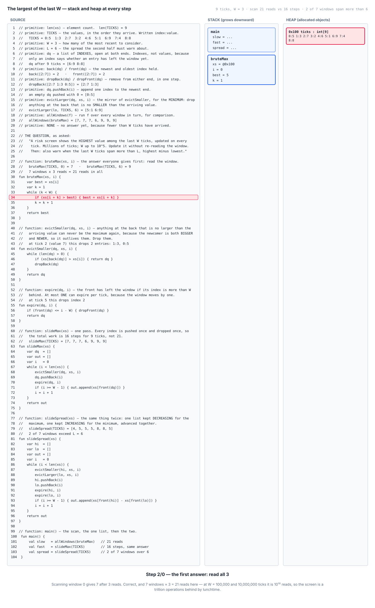

Scanning window 0 gives 7 after 3 reads. Correct, and 7 windows × 3 = 21 reads here — at W = 100,000 and 10,000,000 ticks it is 10¹² reads, so the screen is a trillion operations behind by lunchtime.

</details>
<details>
<summary><b>Step 3 of 13</b> — why a heap does not work either</summary>

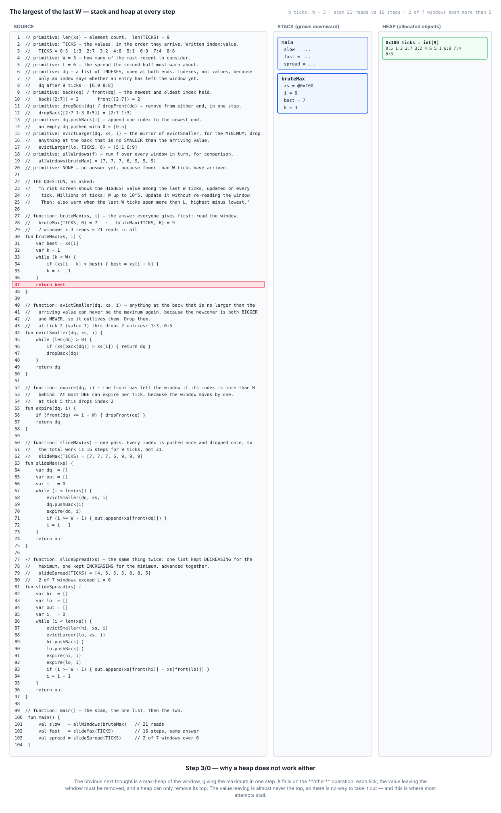

The obvious next thought is a max-heap of the window, giving the maximum in one step. It fails on the **other** operation: each tick, the value leaving the window must be removed, and a heap can only remove its top. The value leaving is almost never the top, so there is no way to take it out — and this is where most attempts stall.

</details>
<details>
<summary><b>Step 4 of 13</b> — the reframe: keep INDEXES, in decreasing order</summary>

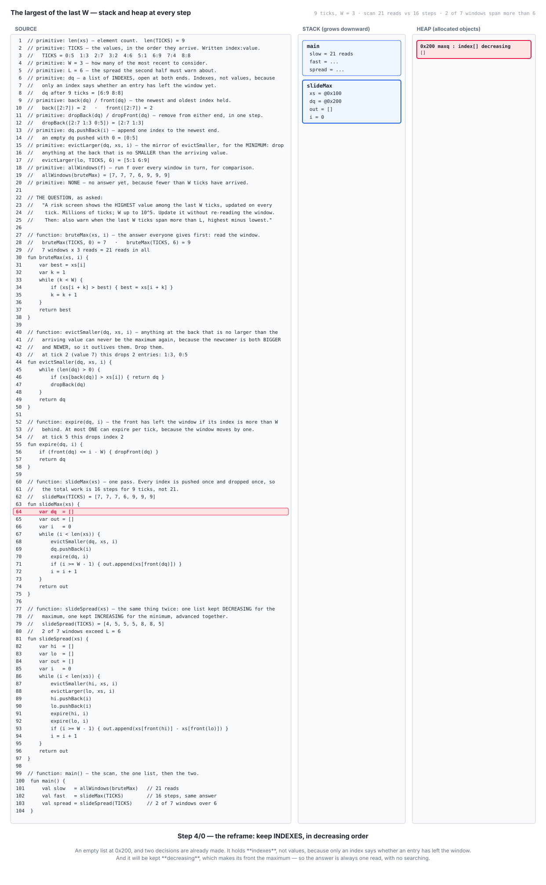

An empty list at 0x200, and two decisions are already made. It holds **indexes**, not values, because only an index says whether an entry has left the window. And it will be kept **decreasing**, which makes its front the maximum — so the answer is always one read, with no searching.

</details>
<details>
<summary><b>Step 5 of 13</b> — value 7 arrives and evicts 2 entries</summary>

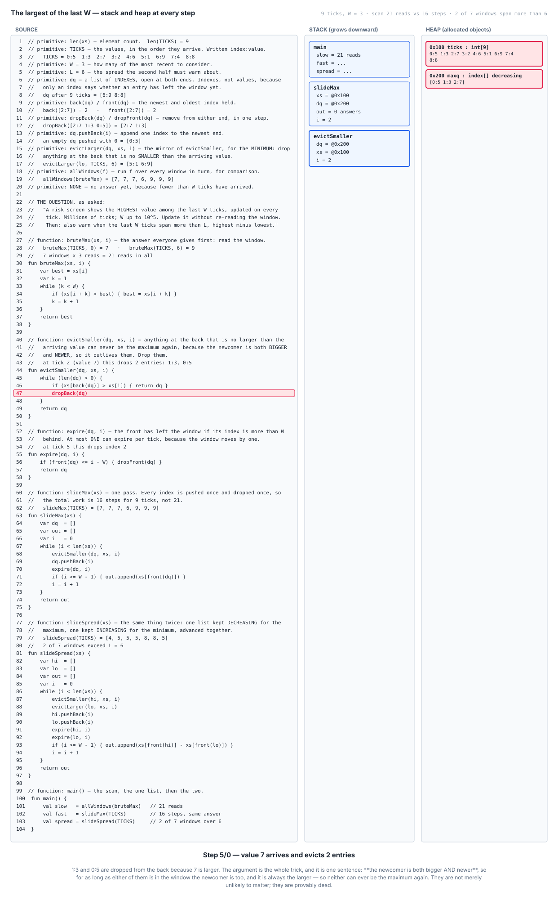

1:3 and 0:5 are dropped from the back because 7 is larger. The argument is the whole trick, and it is one sentence: **the newcomer is both bigger AND newer**, so for as long as either of them is in the window the newcomer is too, and it is always the larger — so neither can ever be the maximum again. They are not merely unlikely to matter; they are provably dead.

</details>
<details>
<summary><b>Step 6 of 13</b> — so the list is the window's suffix maxima</summary>

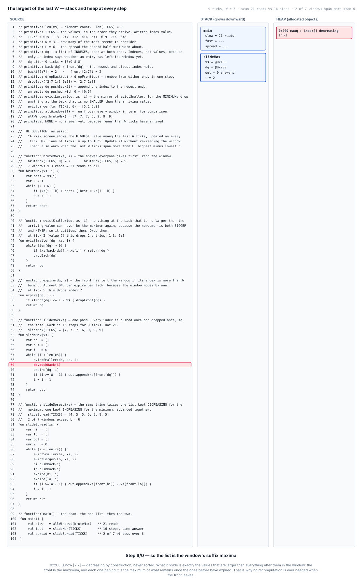

0x200 is now [2:7] — decreasing by construction, never sorted. What it holds is exactly the values that are larger than everything after them in the window: the front is the maximum, and each one behind it is the maximum of what remains once the ones before have expired. That is why no recomputation is ever needed when the front leaves.

</details>
<details>
<summary><b>Step 7 of 13</b> — a cheap tick: nothing to evict</summary>

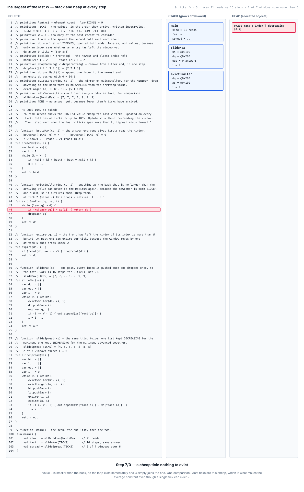

Value 3 is smaller than the back, so the loop exits immediately and 3 simply joins the end. One comparison. Most ticks are this cheap, which is what makes the average constant even though a single tick can evict 2.

</details>
<details>
<summary><b>Step 8 of 13</b> — index 2 has left the window — dropped from the front</summary>

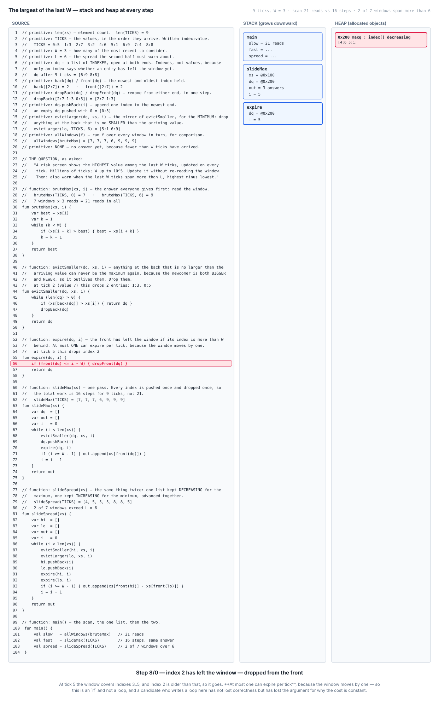

At tick 5 the window covers indexes 3..5, and index 2 is older than that, so it goes. **At most one can expire per tick**, because the window moves by one — so this is an `if` and not a loop, and a candidate who writes a loop here has not lost correctness but has lost the argument for why the cost is constant.

</details>
<details>
<summary><b>Step 9 of 13</b> — the answer is the front: one read</summary>

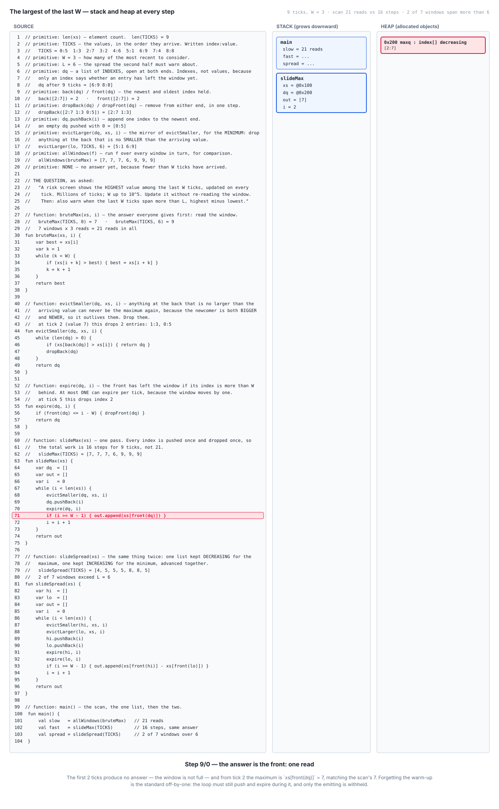

The first 2 ticks produce no answer — the window is not full — and from tick 2 the maximum is `xs[front(dq)]` = 7, matching the scan's 7. Forgetting the warm-up is the standard off-by-one: the loop must still push and expire during it, and only the emitting is withheld.

</details>
<details>
<summary><b>Step 10 of 13</b> — 16 steps against 21 reads</summary>

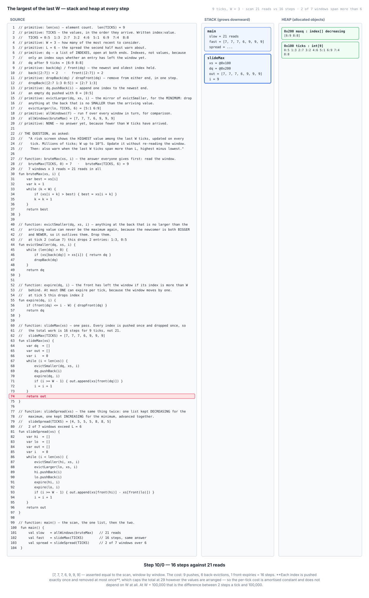

[7, 7, 7, 6, 9, 9, 9] — asserted equal to the scan, window by window. The cost: 9 pushes, 6 back-evictions, 1 front-expiries = 16 steps. **Each index is pushed exactly once and removed at most once**, which caps the total at 29 however the values are arranged — so the per-tick cost is amortised constant and does not depend on W at all. At W = 100,000 that is the difference between 2 steps a tick and 100,000.

</details>
<details>
<summary><b>Step 11 of 13</b> — the second half: a second list, kept INCREASING</summary>

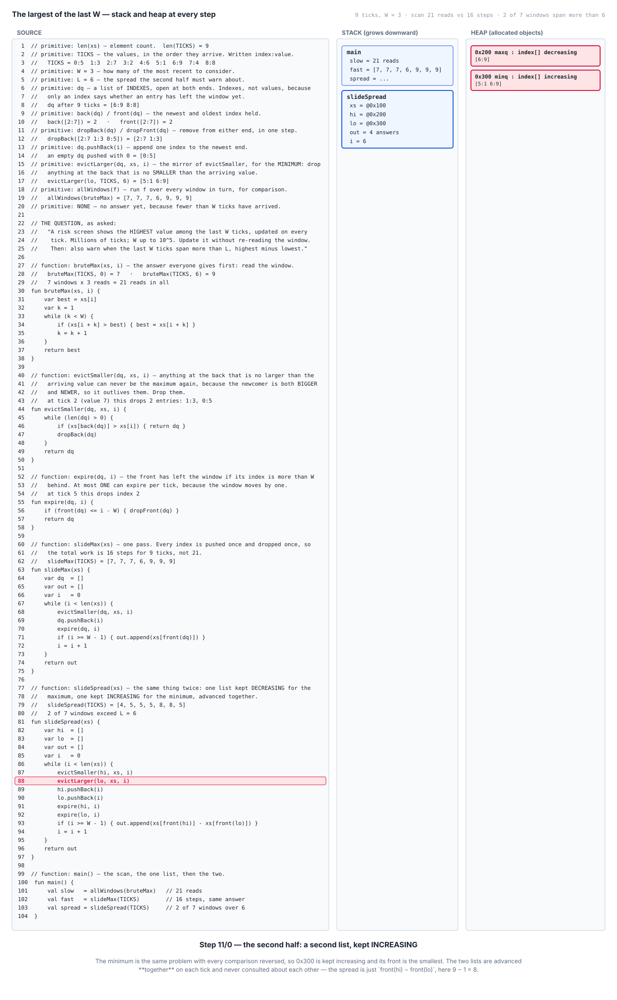

The minimum is the same problem with every comparison reversed, so 0x300 is kept increasing and its front is the smallest. The two lists are advanced **together** on each tick and never consulted about each other — the spread is just `front(hi) − front(lo)`, here 9 − 1 = 8.

</details>
<details>
<summary><b>Step 12 of 13</b> — 2 of 7 windows exceed 6</summary>

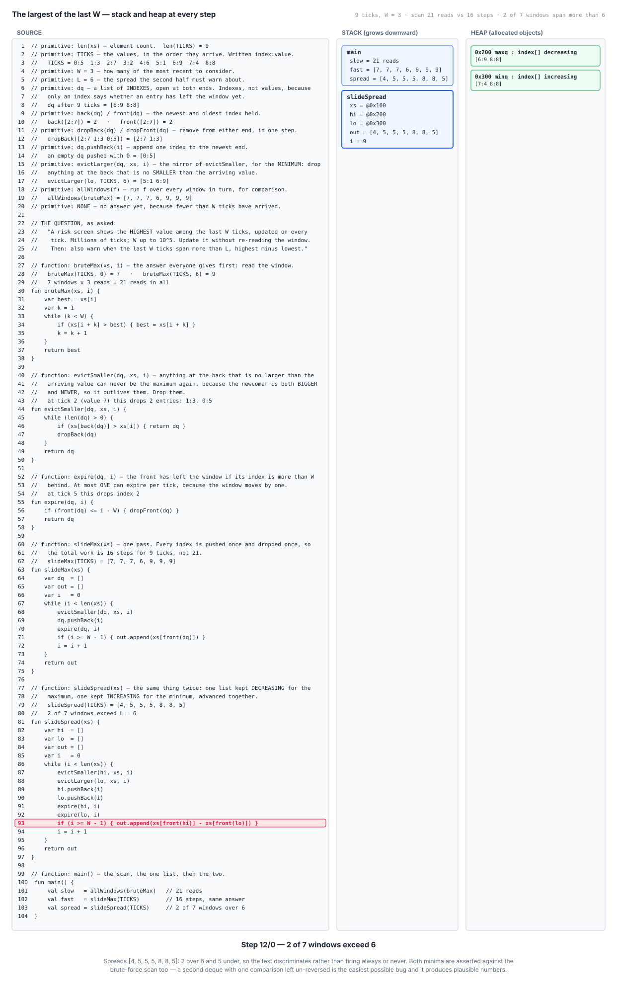

Spreads [4, 5, 5, 5, 8, 8, 5]: 2 over 6 and 5 under, so the test discriminates rather than firing always or never. Both minima are asserted against the brute-force scan too — a second deque with one comparison left un-reversed is the easiest possible bug and it produces plausible numbers.

</details>
<details>
<summary><b>Step 13 of 13</b> — and what the two lists cost</summary>

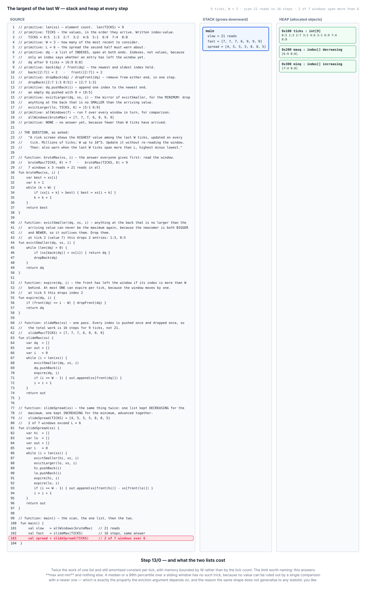

Twice the work of one list and still amortised constant per tick, with memory bounded by W rather than by the tick count. The limit worth naming: this answers **max and min** and nothing else. A median or a 99th percentile over a sliding window has no such trick, because no value can be ruled out by a single comparison with a newer one — which is exactly the property the eviction argument depends on, and the reason the same shape does not generalise to any statistic you like.

</details>

<sub>Locals live in the frame and vanish when it is popped; 0x200 and 0x300 hold **indexes** rather than values, which is what lets an entry be recognised as expired, and neither ever exceeds 3 entries. Every figure is derived from `tools/stream_seed.js` and asserted — including that the values are NOT monotonic (or nothing is ever evicted and the whole idea is invisible), that the deque agrees with the brute-force scan for both the maxima and the minima, that at least one tick evicts two or more, that at least one tick evicts none, that something really does expire from the front, and that some windows exceed L while others do not. **Scope note:** this is the one section whose problem reaches past its chapter's existing program, at the user's explicit direction — the chapter's watermark is an unbounded running maximum, which one corrupt future timestamp raises permanently, and bounding it to the last W events is both the fix and this problem. Generated by `node tools/gen_ch03_interview.js` on `tools/interviewkit.js`.</sub>

<!-- ch03-interview-memory:end -->


## Links & The Bigger Picture

Concepts this chapter mentions but does not fully unpack are linked below — each pointer names the chapter where the concept is covered in depth and gives a concrete example that ties the two chapters together.

- **[Chapter 1: Streaming 101 → Event time vs processing time](ch01-streaming-101.md#event-time-vs-processing-time)** — why a watermark is needed at all — the two clocks diverge, so the pipeline must state its belief about event-time completeness rather than trust the wall clock.
  - _Example:_ ch03's watermark 12:06:30 marks a 12:05:10 record late; ch01 explains the root cause: a click at 12:00:59 processed at 12:04:11 is late by 192 s of queueing delay.
- **[Chapter 2: The What, Where, When, and How of Data Processing → When — triggers and watermarks](ch02-the-what-where-when-and-how-of-data-processing.md#when--triggers-and-watermarks)** — where the watermark sits in the four-question model — it is the mechanism behind the "when" axis, driving early/on-time/late triggers.
  - _Example:_ ch03's on-time trigger fires when the watermark passes 12:05:00; ch02 shows the same window emitting early (12:02), on-time (12:05), and late (12:06) panes as the watermark moves.
- **[Chapter 4: Advanced Windowing → Session semantics and pitfalls](ch04-advanced-windowing.md#session-semantics-and-pitfalls)** — the watermark is what lets a pipeline garbage-collect window state — sessions and other windows die when the watermark passes their end plus allowed lateness.
  - _Example:_ ch03's allowed-lateness horizon (60 s) is the garbage collector; ch04 shows a late event at 12:20:00 reviving two already-emitted sessions and forcing a retraction because the watermark had not yet passed their end + lateness.
- **[Chapter 8: Streaming SQL → Windows in SQL](ch08-streaming-sql.md#windows-in-sql)** — streaming SQL hides the watermark mechanics but not its semantics — the same completeness signal is what makes a TUMBLE/HOP/SESSION result emit.
  - _Example:_ ch03's watermark 12:06:30 closing window [12:00,12:05) is exactly what ch08's TUMBLE(event_time, 5 min) query waits for before emitting its COUNT row.
- **[Chapter 9: Streaming Joins → Why joins are hard on streams](ch09-streaming-joins.md#why-joins-are-hard-on-streams)** — a multi-input watermark propagates as the minimum of its inputs — and that single rule is what bounds a windowed join.
  - _Example:_ ch03's join stage takes min(12:06:00, 12:04:30) = 12:04:30 and waits; ch09 shows that same minimum gating when a click 12:03 matches an impression 12:02 but holds until both sides pass 12:05:00.

## System Design Interview

> **The question:** Design the watermark generator for an event-time pipeline. Premise: the watermark advances as max_seen event time minus a skew bound, so windows close on time and a straggler after the watermark is flagged late.

**The pipeline:** sources (events with event time) -> watermark generator (max_seen − skew) -> window assigner -> per-window state -> trigger/emitter -> dashboard

<a href="../diagrams/d2/decomp/ch03-0.png"></a>

### sources (events with event time)

_Role: sources — emit events that may be out of order_

- a phone emits {event_time: "12:08:30"} after a network delay
- event time is stamped at the source, not at ingestion
- a straggler {event_time: "12:05:10"} may arrive after newer events

### watermark generator (max_seen − skew)

_Role: watermark generator — estimates event-time completeness_

- max_seen : 12:07:00 -> 12:08:30 as the newest event arrives
- watermark = max_seen - skew = 12:08:30 - 2:00 = 12:06:30
- per-source watermarks are min-ed together at the stage

### window assigner

_Role: window assigner — assigns events to event-time windows_

- event {event_time: "12:08:30"} lands in window [12:05, 12:10)
- the watermark at 12:06:30 means windows up to 12:06:30 are complete
- window [12:00, 12:05) is closed because 12:06:30 > 12:05:00

### trigger/emitter

_Role: trigger/emitter — fires on the watermark and handles late data_

- the on-time trigger fires when the watermark passes the window end
- a late event {event_time: "12:05:10"} is accepted if inside allowed lateness
- a late pane re-emits the updated window result to the dashboard


<!-- ch03-system:begin — generated by tools/gen_ch03.js; do not hand-edit -->

#### Why this component is small, and why its failures look like wrong totals

**The question.** Design the watermark generator for an event-time pipeline: it advances as max-seen event time minus a skew bound, so windows close on time and a straggler afterwards is flagged late.

**The pipeline:** sources → **watermark generator** → window assigner → per-window state → trigger/emitter → dashboard.

**First, the blast radius.** The generator emits one number, and exactly one component consumes it: the trigger. The window assigner is pure `winOf(e.et)` and never sees the watermark. So a watermark bug **cannot** put an event in the wrong window — it can only make a window speak too early or too late. That is why its failures present as under-counted totals rather than scattered data, and why "our numbers are low" maps back to this component.

**Second, why `max()` is in the formula.** The naive version — this event's own time minus the skew — looks equivalent. Compute both and the naive one goes **backwards 2 times**: 12:03:20 → 12:02:40 (−40s), and 12:02:40 → none yet (−170s).

A watermark that moves backwards **re-opens a window that was already closed and published.** Every downstream guarantee is built on monotonicity, and `max()` is the single function call that provides it.

**Third, the two settings.** The skew bound: 60s publishes 15 at 12:04:06 with 1 event late; 141s publishes 19 at 12:09:02 with 0 late, 296s slower. And the scope: one global watermark claims 12:08:00 at the end, which is 280s more than source "b" supports; the per-source minimum claims 12:03:20 and withholds 11, 7.

#### When each setting is right, and the four things this does not settle

**Use a global watermark when all sources are symmetric and busy** — one Kafka topic read by one consumer group with even traffic. It is simpler and it is not wrong when no input can go quiet relative to the others.

**Use per-source tracking the moment idleness is possible** — per-partition, per-device, per-region. The minimum is the safe claim, and the price is visible: 2 window withheld here.

**Pair per-source tracking with an idleness timeout,** always. Without one, a source that disappears pins the watermark at 12:03:20 forever and every window stops closing. That is the single most common way this component takes a pipeline down, and it presents as a stall rather than an error.

**What this design does NOT settle — four gaps:**

1. **The 60s skew bound is unverifiable from inside.** Nothing distinguishes "no late events arrived" from "late events were already discarded", so the output cannot tell you whether the bound is well tuned.
2. **Per-source tracking needs to know the source set.** A source that never appears cannot be waited for, and one that disappears needs a timeout — which is a decision to declare it finished, trading away the correctness the minimum was protecting.
3. **Monotonicity holds only within one run.** `max()` guarantees it here, but a generator that restarts and recomputes from a checkpoint can emit a value below one it already published — and nothing downstream is prepared for that.
4. **Window [12:08, …) never closes under ANY skew bound in the sweep**, because no event ever pushes the watermark past its end. The generator is working correctly and that window's 8 is simply never published.

#### Visual walkthrough — placement, the max(), and the two knobs

The animation loops through all 4 steps. Expand any step to study it on its own.


<details>
<summary><b>Step 1 of 4</b> — the generator sits between the sources and the windows</summary>


Worth being precise about the blast radius: the watermark feeds exactly one consumer, the trigger. Windowing is `winOf(e.et)` and never sees it. That is why a mis-tuned skew produces an under-counted window rather than scattered data — and why "my numbers are low" is the symptom to map back to this component.

</details>
<details>
<summary><b>Step 2 of 4</b> — the naive formula goes BACKWARDS — twice</summary>


Two formulas differing by one function call. `e.et − skew` looks equivalent and is not: it falls back 40s at id 6 and 170s at id 7. Monotonicity is not a nicety — a backwards watermark un-closes a published window, and nothing downstream is prepared for that.

</details>
<details>
<summary><b>Step 3 of 4</b> — the two settings, and their exact thresholds</summary>


Two knobs. The skew bound has a threshold of 141s for this window, costing 296s of latency. Per-source tracking is strictly safer and withholds 11, 7 when a source goes quiet. Both thresholds are only computable here because the whole stream is in hand — in production they are guesses, and the design has to survive them being wrong.

</details>
<details>
<summary><b>Step 4 of 4</b> — and what the generator does NOT settle</summary>


The second and third gaps are the ones that cause production incidents. An idle source with no timeout pins the watermark forever and every window stops closing — an outage that looks like a stall, not an error. And a restarted generator recomputing from a checkpoint can publish a watermark below one it already published, which breaks the monotonicity every downstream trigger assumes.

</details>

<sub>The naive formula's 2 regressions, both thresholds and the withheld window are computed from the seed and asserted. Generated by `node tools/gen_ch03.js`.</sub>

<!-- ch03-system:end -->

<!-- ch03-system-memory:begin — generated by tools/gen_ch03.js; do not hand-edit -->

#### The watermark generator — stack and heap at every step

**What is being answered.** Why the watermark formula contains `max()`, by running both formulas over the same stream and counting what goes wrong.

`naiveWatermark(e)` is `e.et - LAG` — the version that looks equivalent. `correctWatermark(seen, e)` adds one line. `run(useMax)` generates both and counts any value lower than its predecessor.

The counts are 2 and 0. Step 4 then shows why that matters: a regression takes window 0, which had already fired and published, back to "not yet complete". Monotonicity is not tidiness — it is the property every downstream trigger assumes.

The animation steps through the code, holding each line long enough to read the STACK (call frames and their locals) and the HEAP (allocated arrays and objects) as they are AT THAT MOMENT. Expand any step to study it on its own.


<details>
<summary><b>Step 1 of 4</b> — the naive formula reads only the CURRENT event</summary>


Event id 6 has `et` = 220, so the naive watermark is 160. But `prev` is 200 and `seen` is already 260 — the event is out of order, and the formula has no memory of that. Note `seen` is correct and simply unused on this path.

</details>
<details>
<summary><b>Step 2 of 4</b> — so it goes BACKWARDS — 2 times</summary>


`w` = -10 against `prev` = 160, so `back` reaches 2: 200 → 160 (−40s) and 160 → -10 (−170s). A watermark going backwards is not a cosmetic problem — the next step shows what it does to a window.

</details>
<details>
<summary><b>Step 3 of 4</b> — one line makes it monotonic</summary>


Same event, and `m` stays at 260 because `e.et` (220) is not greater. The emitted value is 200 — equal to the previous one, never below it. `back` stays 0 for the whole stream: 2 regressions become 0 by replacing `e.et` with `max(seen, e.et)`.

</details>
<details>
<summary><b>Step 4 of 4</b> — and a regression would UN-close a published window</summary>


For window 0 the naive watermark reached 185 at index 4 — past 120, so the window fired and published. Then at index 7 it fell to -10, below 120 again. The window is now "not yet complete" after having been published. Nothing downstream has a concept for that.

</details>

<sub>Both formulas' outputs, the 2 regressions and the re-opened window are computed from the seed and asserted. Generated by `node tools/gen_ch03.js` on `tools/memkit.js`.</sub>

<!-- ch03-system-memory:end -->

## Interview Questions

### Q1

A mobile analytics pipeline groups events by event time, but phones that go offline send events up to an hour late — so some 12:04 events arrive after the 12:05 window has already been reported.

**Interviewer's question:** How do you compute event-time completeness when inputs are out of order, and what do you do about data that arrives after you declared the window complete?

**Solution:** Use a heuristic watermark — max seen event time minus a skew (out-of-orderness bound) — and keep windows alive for an allowed-lateness horizon after the watermark so late events can still update the result.

**System-design components:**
- Heuristic watermark — max_seen − skew
- Skew — bound on out-of-orderness
- Allowed lateness — accepts late data for a bounded horizon
- On-time trigger — fires at the watermark

```java
// max_seen = 12:08:30, skew = 2 min
//   watermark = 12:08:30 - 2:00 = 12:06:30
//   window [12:00,12:05) -> closed (12:06:30 > 12:05:00)
//   event @ 12:05:10 arrives -> 80 s older than watermark -> late
//   allowed lateness 1 min -> still accepted -> re-emit
```

_This is exactly the heuristic watermark and skew material in this chapter._

_Covers:_ 3. Heuristic watermarks · 4. Skew (out-of-orderness bound) · 8. Watermarks + allowed lateness

_From the 28 problems:_ 21-ad-click-aggregation · 20-metrics-monitoring

### Q2

A streaming join reads two sources, one fast and one slow; results for 12:05 keep getting emitted with missing data from the slow source.

**Interviewer's question:** Why does the join emit incomplete results, and how do you fix it?

**Solution:** The join stage's watermark is the minimum of its inputs' watermarks, so the slow input stalls completeness; fix it with per-source watermarks and/or buffer the fast side until the slow side's watermark catches up.

**System-design components:**
- Watermark propagation — min across inputs
- Per-source watermarks
- Join buffer — holds the fast side

```java
// stage_watermark = min(12:06:00, 12:04:30) = 12:04:30
//   join keyed at 12:05:00 -> cannot emit -> waits on slow source
//   per-source watermarks let the fast side advance independently
```

_This is exactly the watermark-propagation material in this chapter._

_Covers:_ 5. Per-source watermarks · 6. Watermark propagation

_From the 28 problems:_ 21-ad-click-aggregation

## Key Concepts

### The Problem

**1. Unbounded data has no natural "done".** A watermark is that signal — a monotonically increasing event-time timestamp declaring completeness.


### The Solution

A perfect watermark is possible for ordered inputs — a single log consumed in order, or ingestion-time processing.

```java
// max_seen = 12:08:30, skew = 2 min
//   watermark = 12:08:30 - 2:00 = 12:06:30
//   window [12:00,12:05) -> closed (12:06:30 > 12:05:00)
//   event @ 12:05:10 arrives -> 80 s older than watermark -> late
//   allowed lateness 1 min -> still accepted -> re-emit
```


### Key Facts

| Fact | Detail | In the wild |
|---|---|---|
| 2. Perfect watermarks | A perfect watermark is possible for ordered inputs — a single log consumed in order, or ingestion-time processing. | Ingestion-time pipelines over a single Kafka partition are the classic perfect-watermark case. |
| 3. Heuristic watermarks | A heuristic watermark estimates completeness from observed data — typically max seen event time minus a skew. | Flink's BoundedOutOfOrdernessWatermarkGenerator implements exactly this. |
| 4. Skew (out-of-orderness bound) | Skew is the assumed bound on out-of-orderness subtracted from the max seen event time. | The skew parameter in a Dataflow pipeline is the production form. |
| 5. Per-source watermarks | Track a watermark per source and take the minimum; this lets fast sources advance without being blocked by slow ones. | Per-partition watermarks in Flink are the production form. |
| 6. Watermark propagation | A stage's watermark is the minimum of its inputs' watermarks. | Flink's watermark alignment (min across inputs) is the production form. |
| 7. Latency vs correctness | An eager watermark emits early and risks late data; a cautious watermark waits and delays output. | Tuning the out-of-orderness bound is a routine production decision. |
| 8. Watermarks + allowed lateness | Allowed lateness keeps the window alive for a bounded horizon after the watermark, then drops stragglers. | Dataflow's allowed-lateness setting is the production form. |


### Tradeoffs & When

- An eager watermark emits early and risks late data; a cautious watermark waits and delays output.
- Allowed lateness keeps the window alive for a bounded horizon after the watermark, then drops stragglers.


### Real-World Examples

- **Apache Flink** — BoundedOutOfOrdernessWatermarkGenerator subtracts an out-of-orderness bound from the max observed event time; per-partition watermarks and idle sources
- **Google Cloud Dataflow** — Watermarks with allowed lateness and trigger configuration
- **Apache Beam** — Watermark as a first-class pipeline concept
- **Google MillWheel** — The low watermark that pioneered event-time completeness tracking in production


<details><summary>All concepts (index)</summary>

### Why: 1. Unbounded data has no natural "done"

**Why.** A stream never ends, so a pipeline cannot know when a window has seen all its data without a signal of progress.

**Claim.** A watermark is that signal — a monotonically increasing event-time timestamp declaring completeness.

**Grounding.** The watermark is the book's central mechanism for event-time progress.

**In the wild.** Dataflow, Flink, and Beam all expose watermarks as first-class concepts.

<a href="../diagrams/d2/card/ch03-0.png"></a>
### Perfect: 2. Perfect watermarks

**Why.** If a source is provably ordered, the pipeline can know completeness exactly rather than estimating it.

**Claim.** A perfect watermark is possible for ordered inputs — a single log consumed in order, or ingestion-time processing.

**Grounding.** For an ordered log, every record is at or ahead of the watermark, so the watermark can advance to each record's timestamp.

**In the wild.** Ingestion-time pipelines over a single Kafka partition are the classic perfect-watermark case.

<a href="../diagrams/d2/card/ch03-1.png"></a>
### Heuristic: 3. Heuristic watermarks

**Why.** Out-of-order sources (mobile devices, retries, multi-region collectors) make a perfect watermark impossible.

**Claim.** A heuristic watermark estimates completeness from observed data — typically max seen event time minus a skew.

**Grounding.** watermark = max_seen_event_time − skew is the book's canonical heuristic.

**In the wild.** Flink's BoundedOutOfOrdernessWatermarkGenerator implements exactly this.

<a href="../diagrams/d2/card/ch03-2.png"></a>
### Parameter: 4. Skew (out-of-orderness bound)

**Why.** A heuristic needs a knob that says how out-of-order the source can be, to trade latency against correctness.

**Claim.** Skew is the assumed bound on out-of-orderness subtracted from the max seen event time.

**Grounding.** Too small a skew mislabels delayed data as late; too large a skew delays on-time output.

**In the wild.** The skew parameter in a Dataflow pipeline is the production form.

<a href="../diagrams/d2/card/ch03-3.png"></a>
### Bound: 5. Per-source watermarks

**Why.** One global watermark is dragged down by the slowest source — a single idle device stalls completeness for everything.

**Claim.** Track a watermark per source and take the minimum; this lets fast sources advance without being blocked by slow ones.

**Grounding.** The minimum across per-source watermarks is the stage's watermark.

**In the wild.** Per-partition watermarks in Flink are the production form.

<a href="../diagrams/d2/card/ch03-4.png"></a>
### Propagation: 6. Watermark propagation

**Why.** A stage with multiple inputs cannot claim more completeness than its least-complete input.

**Claim.** A stage's watermark is the minimum of its inputs' watermarks.

**Grounding.** The join stage in the book waits on the slower input before emitting a keyed result.

**In the wild.** Flink's watermark alignment (min across inputs) is the production form.

<a href="../diagrams/d2/card/ch03-5.png"></a>
### Tradeoff: 7. Latency vs correctness

**Why.** The watermark's aggressiveness is the single knob that trades result latency against late-data correctness.

**Claim.** An eager watermark emits early and risks late data; a cautious watermark waits and delays output.

**Grounding.** Skew is the parameter that moves the pipeline along this tradeoff.

**In the wild.** Tuning the out-of-orderness bound is a routine production decision.

<a href="../diagrams/d2/card/ch03-6.png"></a>
### Safety net: 8. Watermarks + allowed lateness

**Why.** A heuristic watermark can be wrong, so a pipeline needs a bounded way to accept data that arrives after the watermark.

**Claim.** Allowed lateness keeps the window alive for a bounded horizon after the watermark, then drops stragglers.

**Grounding.** It is the garbage collector for window state that outlives the watermark.

**In the wild.** Dataflow's allowed-lateness setting is the production form.

<a href="../diagrams/d2/card/ch03-7.png"></a>

</details>


## Quiz

1. What is a watermark?

   - A. The wall-clock time
   - B. A monotonically increasing timestamp declaring event-time completeness
   - C. The number of events in a window
   - D. A type of window

<details><summary>Reveal answer</summary>

**B.** A watermark is the pipeline's estimate of how complete the event-time axis is.

</details>

2. When is a perfect watermark possible?

   - A. When inputs are out of order
   - B. When the source is provably ordered
   - C. When there are many sources
   - D. When there is no skew

<details><summary>Reveal answer</summary>

**B.** Perfect watermarks require ordered input, such as a single log consumed in order.

</details>

3. What is the canonical heuristic watermark formula?

   - A. watermark = wall clock + skew
   - B. watermark = min event time + skew
   - C. watermark = max seen event time − skew
   - D. watermark = event count / skew

<details><summary>Reveal answer</summary>

**C.** The heuristic subtracts a skew (out-of-orderness bound) from the max seen event time.

</details>

4. A stage's watermark with multiple inputs is the ___ of its inputs' watermarks.

   - A. maximum
   - B. minimum
   - C. sum
   - D. average

<details><summary>Reveal answer</summary>

**B.** Completeness is bounded by the least-complete input, so the stage watermark is the minimum.

</details>

5. What is the downside of an over-eager (too-fast) watermark?

   - A. Higher latency
   - B. Delayed data is mislabeled as late
   - C. Windows never close
   - D. Memory exhaustion

<details><summary>Reveal answer</summary>

**B.** An over-eager watermark gains latency but loses correctness by treating delayed data as late.

</details>

## Sources

- [Slava Chernyak — "Watermarks: Time and Progress in Apache Beam and Beyond" (talk)](https://www.youtube.com/watch?v=TWxSLmkWPm4) — A conference talk on how watermarks track event-time progress in Beam and beyond
- [Akidau et al. — "MillWheel: Fault-Tolerant Stream Processing at Internet Scale" (VLDB 2013)](https://research.google/pubs/pub41378/) — Introduced the low watermark for out-of-order stream processing at Google
- [Akidau et al. — "The Dataflow Model" (VLDB 2015)](https://www.vldb.org/pvldb/vol8/p1792-Akidau.pdf) — Defines watermarks as the mechanism that trades latency against correctness
- [Apache Flink — Generating watermarks](https://nightlies.apache.org/flink/flink-docs-stable/docs/dev/datastream/event-time/generating_watermarks/) — How a production engine computes bounded-out-of-orderness and per-partition watermarks
- [Apache Beam programming guide](https://beam.apache.org/documentation/programming-guide/) — Watermarks and lateness as part of the Beam model

