# Chapter 4: Advanced Windowing

> Windowing generalizes into a lifecycle — assign, merge, group, trigger, accumulate, and garbage-collect — and session windows are the canonical case where a window is born, merges with its neighbors, and dies dynamically as data arrives.

_Also known as: SS Ch04 · Session Windows · Fixed Window · Sliding Window · Window Merging · Window Lifecycle_

## Flow

### Window shapes — fixed, sliding, session

> **Why this matters:** Different questions need different event-time boundaries, so this section distinguishes the three canonical window shapes and when each is the right tool.

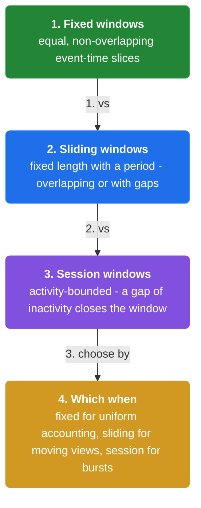

1. **Fixed (tumbling) windows** — Fixed windows partition time into **equal, non-overlapping, contiguous** spans — every event belongs to exactly one window. They answer "how many per hour".

2. **Sliding (hopping) windows** — Sliding windows are **fixed-length, overlapping** spans defined by a window size and a slide. They answer "what is the rolling 5-minute average, updated every minute".

3. **Session windows** — Session windows are **dynamic and data-driven**: a session is a burst of activity separated by a gap of inactivity. They answer "how long did a user stay engaged".

4. **Sessions capture behavior, not just counting** — Because session boundaries follow the data, they model real user journeys — a visit with a 30-minute gap is two sessions, not one. **The window is defined by the data, not the clock.**

```java
// STREAM SIDE — one click stream cut three ways gives three different groupings
// DEF: fixed window — a 5-min non-overlapping span = [12:00, 12:05)
// DEF: sliding window — a 10-min span that advances every 2 min = [12:00, 12:10) at slide 12:00
// DEF: session window — a burst that closes after a 30-min gap of inactivity
// -> input : click {event_time: "12:04:00"}
//    step 1 · fixed assignment -> the click belongs to [12:00, 12:05) only -> fixed_count : 0 -> 1
//    step 2 · sliding assignment -> the click belongs to [12:00, 12:10), [12:02, 12:12), [12:04, 12:14) -> slide_count : 0 -> 3
//    step 3 · session assignment -> the click opens session s1 -> sessions : [] -> [s1]
// <- outcome : the dashboard reads the same click as 1 fixed, 3 sliding, 1 session   BECAUSE the shapes define different boundaries
//    derivation : sliding windows per event = window size / slide = 10 min / 2 min = 5, but only 3 overlap this event time
```

### The window lifecycle

> **Why this matters:** Windowing is more than "which bucket" — a window is assigned, merged, grouped, triggered, accumulated, and finally garbage-collected, so this section walks the full lifecycle in order.

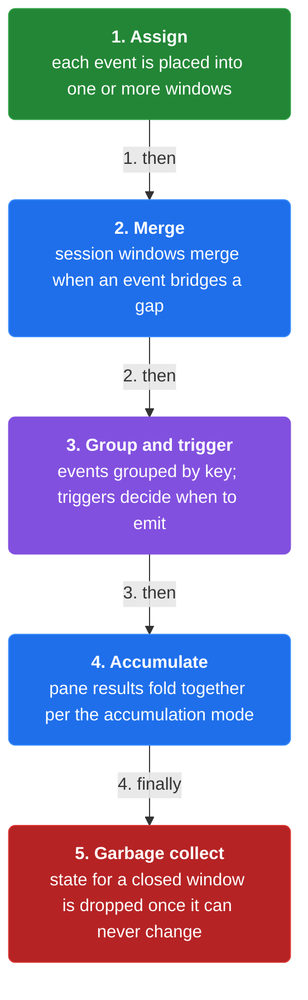

1. **Assign** — Each element is assigned to a set of windows by its event time and the windowing function. **A sliding window assigns one event to several windows at once.**

2. **Merge** — Session windows **merge**: when a new event lands inside the gap of two existing sessions, the two sessions and the event collapse into one window. Merging is what makes sessions dynamic.

3. **Group and trigger** — Elements are **grouped by (key, window)** into the state that will be aggregated, then **triggers** decide when that state emits.

4. **Accumulate and garbage-collect** — Each emitted pane is **accumulated** per the accumulation mode, and the window state is **garbage-collected** once the watermark passes the window end plus allowed lateness.

```java
// SESSION SIDE — two sessions merge when a bridging event lands inside the gap
// DEF: session gap — the inactivity threshold that splits sessions = 30 min
// DEF: session — a window [start, end) that closes after a 30-min gap = s1 [12:00, 12:10)
// DEF: sessions — the current set = { s1: [12:00, 12:10), s2: [12:40, 12:50) }
// -> input : event {event_time: "12:20:00"}
//    step 1 · the event is 20 min from s1 and 20 min from s2 -> both within the 30-min gap -> they merge
//    step 2 · the merged session spans s1 and s2 -> sessions : { s1, s2 } -> { sMerged: [12:00, 12:50) }
//    step 3 · the event folds into the merged session -> sMerged_count : 0 -> 3   BECAUSE s1 + s2 + the bridging event = 3 events
// <- outcome : one session [12:00, 12:50) replaces two   BECAUSE the 12:20 event was inside the gap of both
//    derivation : gap check = 12:20:00 - 12:10:00 = 10 min <= 30 min, and 12:40:00 - 12:20:00 = 20 min <= 30 min -> merge
```

### Session semantics and pitfalls

> **Why this matters:** Sessions are powerful but subtle — their boundaries change as data arrives, so this section covers what the lifecycle implies and where implementations get it wrong.

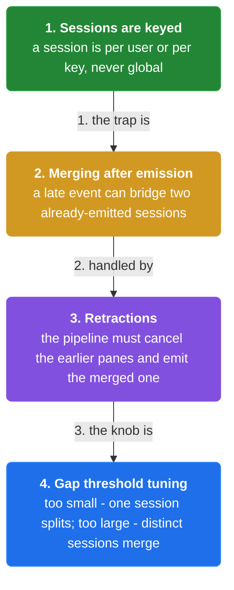

1. **A session can merge late** — A late event can bridge two sessions that were already emitted separately. **The pipeline must retract the two earlier panes and emit the merged one** — this is why accumulation mode matters.

2. **Sessions are garbage-collected by watermark** — A session is not done when it looks idle; it is done when the **watermark passes the session end plus allowed lateness**. Until then, a late event can revive it.

3. **Session windows are keyed** — Sessions are per key — **user A's session and user B's session never merge** because they are in different key groups. The gap is measured within a key.

4. **Choose the window to match the question** — Fixed windows for periodic aggregates, sliding windows for moving averages, sessions for user behavior. **The window shape is part of the answer, not an implementation detail.**

```java
// RETRACTION SIDE — a late event merges two already-emitted sessions, forcing a retraction
// DEF: session gap — 30 min; the two sessions s1 [12:00,12:10) and s2 [12:40,12:50) are already emitted
// DEF: retraction — a downstream signal that cancels a previously emitted pane = { s1, s2 }
// -> input : late event {event_time: "12:20:00", arrival: "13:01:00"}
//    step 1 · the late event bridges the gap -> sessions : { s1, s2 } -> { sMerged: [12:00, 12:50) }
//    step 2 · the pipeline emits a retraction for s1 and s2 -> downstream : {s1:3, s2:2} -> cancelled
//    step 3 · the pipeline emits the merged session -> downstream : {} -> {sMerged: 6}   BECAUSE 3 + 2 + 1 = 6
// <- outcome : downstream ends with one session of 6, not three sessions totaling 11   BECAUSE the retractions undid s1 and s2
//    derivation : merged count = s1_count + s2_count + bridging = 3 + 2 + 1 = 6
```


## System Design Interview

> **The question:** Design session-window analytics for user activity. Premise: a late event can bridge two already-emitted sessions, so the pipeline must retract the two stale panes and emit the merged session instead of double-counting.

**The pipeline:** event source -> window assigner -> session merger -> keyed session state -> trigger/retraction emitter -> analytics store

### event source

_Role: event source — emits events with event time and a key_

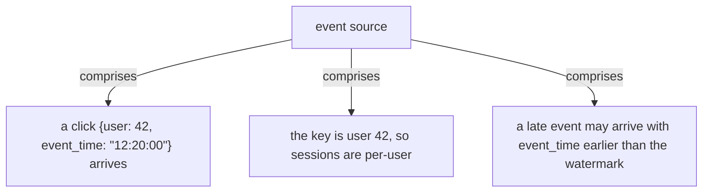

### window assigner

_Role: window assigner — assigns events to session windows_

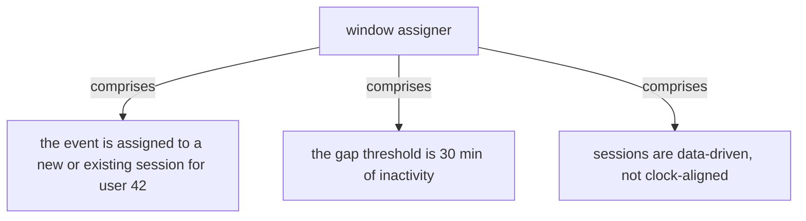

### session merger

_Role: session merger — merges sessions that a bridging event connects_

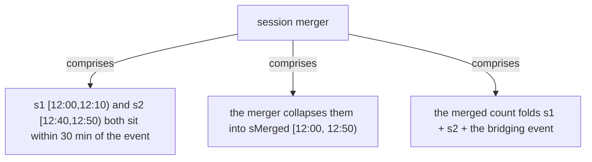

### trigger/retraction emitter

_Role: trigger/retraction emitter — emits and corrects panes_

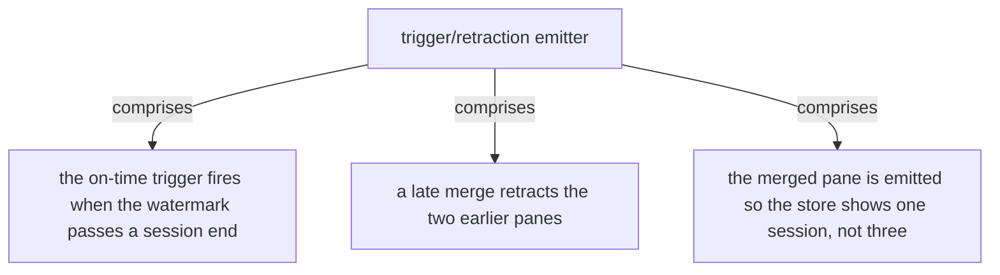

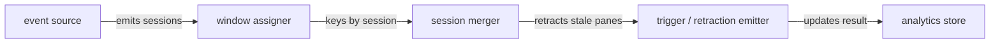

```java
// SYSTEM DESIGN — a late event merges two sessions and the pipeline retracts the stale panes
// DEF: session gap — the inactivity threshold = 30 min
// DEF: retraction — a downstream signal that cancels a previously emitted pane = { s1, s2 }
// DEF: sessions — the current set for user 42 = { s1: [12:00, 12:10), s2: [12:40, 12:50) }
// STATE (before):
//    session_state : { s1: 3, s2: 2 }
// -> input : a late event {user: 42, event_time: "12:20:00"} arrives
//    step 1 · the event bridges s1 and s2 -> sessions : { s1, s2 } -> { sMerged: [12:00, 12:50) }   BECAUSE both gaps are within 30 min
//    step 2 · the pipeline retracts the stale panes -> session_state : { s1: 3, s2: 2 } -> cancelled
//    step 3 · the merged pane is emitted -> session_state : {} -> { sMerged: 6 }   BECAUSE 3 + 2 + 1 = 6
// <- outcome : the store shows one session of 6, not three sessions totaling 11   BECAUSE the retractions undid s1 and s2
//    derivation : merged count = s1_count + s2_count + bridging = 3 + 2 + 1 = 6
```

## Interview Questions

### Q1

An analytics pipeline reports 'sessions per user', but a user who pauses for 20 minutes and returns is counted as two sessions while a 10-minute pause is one — and late events can merge sessions that were already reported.

**Interviewer's question:** How do you model user sessions as windows, and what happens when a late event merges two already-reported sessions?

**Solution:** Use session windows with a gap threshold; when a late event bridges two already-emitted sessions, retract the two earlier panes and emit the merged one.

**System-design components:**
- Session window — gap-based dynamic window
- Gap threshold — inactivity bound
- Merge — collapse two sessions + the bridging event
- Retraction — cancel the earlier panes

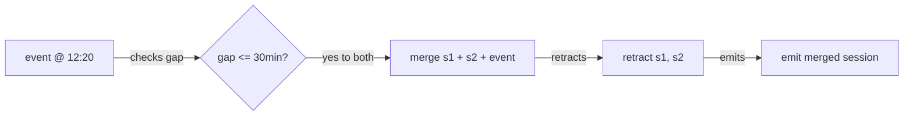

```java
// s1 [12:00,12:10), s2 [12:40,12:50)
//   late event @ 12:20 -> bridges gap -> merge
//   retract s1 (3), retract s2 (2)
//   emit sMerged [12:00,12:50) count = 3+2+1 = 6
```

_This is exactly the session merging and retraction material in this chapter._

_Covers:_ 4. Session windows · 6. Session merging · 7. Late merges need retractions

_From the 28 problems:_ 21-ad-click-aggregation

### Q2

A dashboard needs both an hourly total and a rolling 10-minute average, but the team used one window type for both and the numbers look wrong.

**Interviewer's question:** Which window shapes should each metric use, and why?

**Solution:** The hourly total is a fixed window (equal, non-overlapping buckets); the rolling average is a sliding window (10-minute window advancing every minute).

**System-design components:**
- Fixed window — hourly total
- Sliding window — rolling 10-min average
- Window size + slide — defines the overlap

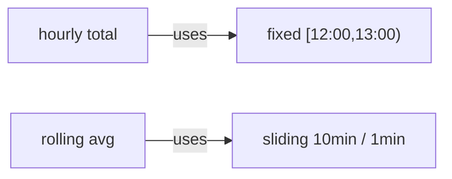

```java
// fixed   : event @ 12:04 belongs to [12:00,12:05) only
// sliding : event @ 12:04 belongs to [11:55,12:05), [11:56,12:06), ... [12:04,12:14)
//   -> count once vs count many
```

_This is exactly the fixed vs sliding window material in this chapter._

_Covers:_ 2. Fixed windows · 3. Sliding windows

_From the 28 problems:_ 20-metrics-monitoring

## Key Concepts

### The Problem

**1. One window shape does not fit all questions.** Fixed, sliding, and session windows are three shapes that answer three different kinds of questions.


### The Solution

Fixed windows partition time into equal, non-overlapping, contiguous spans; each event belongs to exactly one window.


### Key Facts

| Fact | Detail | In the wild |
|---|---|---|
| 2. Fixed windows | Fixed windows partition time into equal, non-overlapping, contiguous spans; each event belongs to exactly one window. | A 5-minute tumbling window in Flink is a fixed window. |
| 3. Sliding windows | Sliding windows are fixed-length, overlapping spans defined by a window size and a slide. | A 10-minute window sliding every 2 minutes is the canonical rolling average. |
| 4. Session windows | A session is a burst of activity separated by a gap of inactivity; session boundaries are data-driven. | Web-analytics sessionization is the canonical session-window use case. |
| 5. The window lifecycle | Each element is assigned, session windows merge, elements group by (key, window), triggers emit, panes accumulate, and state is garbage-collected. | Beam's WindowFn, trigger, and accumulation mode map onto these stages. |
| 6. Session merging | When an event lands inside the gap of two sessions, the two sessions and the event merge into one window. | Beam's mergeWindows is the production form. |
| 7. Late merges need retractions | The pipeline must retract the two earlier panes and emit the merged one, or downstream double-counts. | Accumulating-and-retracting mode in Beam handles this. |
| 8. Sessions are keyed | Sessions are per key — user A's session never merges with user B's, because the gap is measured within a key group. | Grouping by user id before sessionizing is the production pattern. |


### Tradeoffs & When

- The pipeline must retract the two earlier panes and emit the merged one, or downstream double-counts.
- Sessions are per key — user A's session never merges with user B's, because the gap is measured within a key group.


### Real-World Examples

- **Google Analytics** — Sessionization of user visits with a 30-minute inactivity gap
- **Apache Beam** — Sessions with mergeWindows and accumulating-and-retracting
- **Apache Flink** — Event-time session windows with a gap


<details><summary>All concepts (index)</summary>

### Why: 1. One window shape does not fit all questions

**Why.** "How many per hour", "what is the rolling average", and "how long did a user stay" need different event-time boundaries.

**Claim.** Fixed, sliding, and session windows are three shapes that answer three different kinds of questions.

**Grounding.** The book builds the whole windowing model on these three shapes.

**In the wild.** Beam, Flink, and Dataflow all expose these three window types.

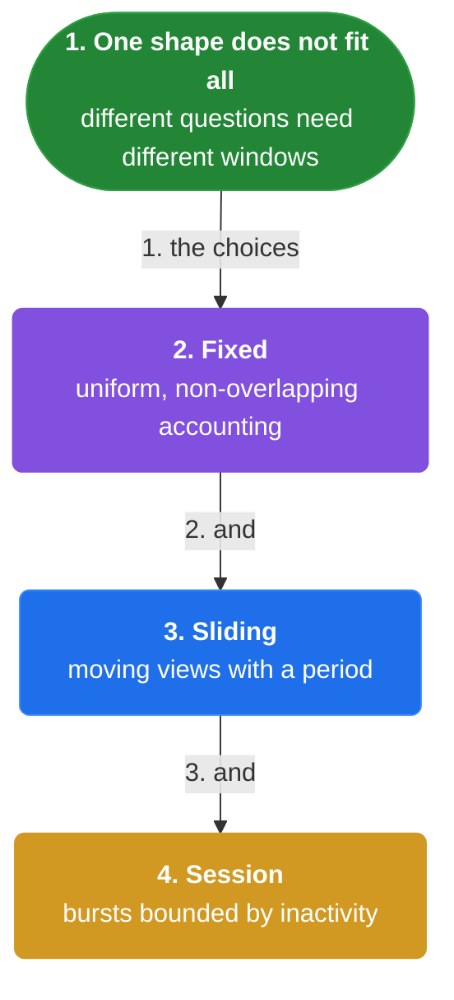
### Shape: 2. Fixed windows

**Why.** Periodic, comparable aggregates need equal, non-overlapping time buckets.

**Claim.** Fixed windows partition time into equal, non-overlapping, contiguous spans; each event belongs to exactly one window.

**Grounding.** They answer "how many per hour".

**In the wild.** A 5-minute tumbling window in Flink is a fixed window.

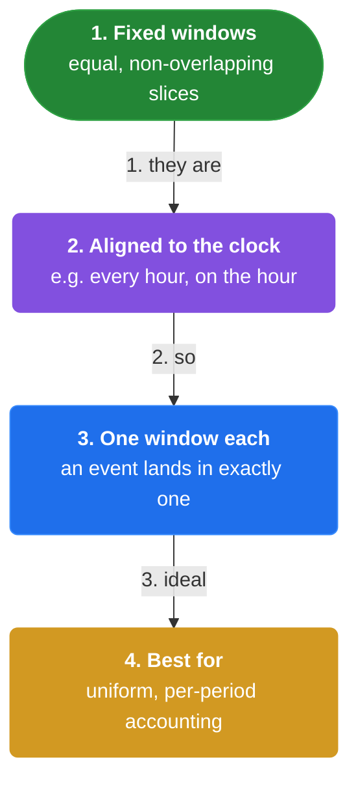
### Shape: 3. Sliding windows

**Why.** Moving averages need overlapping spans so a point in time contributes to several recent windows.

**Claim.** Sliding windows are fixed-length, overlapping spans defined by a window size and a slide.

**Grounding.** One event can belong to several sliding windows at once.

**In the wild.** A 10-minute window sliding every 2 minutes is the canonical rolling average.

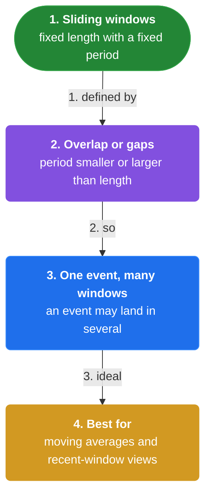
### Shape: 4. Session windows

**Why.** User behavior is bursty and its boundaries follow the data, not the clock.

**Claim.** A session is a burst of activity separated by a gap of inactivity; session boundaries are data-driven.

**Grounding.** A 30-minute gap splits one visit into two sessions.

**In the wild.** Web-analytics sessionization is the canonical session-window use case.

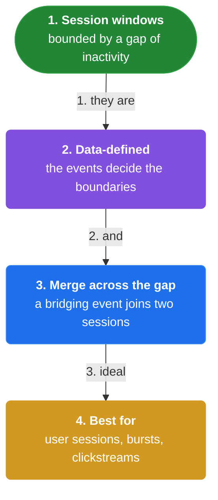
### Lifecycle: 5. The window lifecycle

**Why.** Windowing is a pipeline of steps — assign, merge, group, trigger, accumulate, garbage-collect — not a single bucket lookup.

**Claim.** Each element is assigned, session windows merge, elements group by (key, window), triggers emit, panes accumulate, and state is garbage-collected.

**Grounding.** The lifecycle is the book's complete description of windowing.

**In the wild.** Beam's WindowFn, trigger, and accumulation mode map onto these stages.

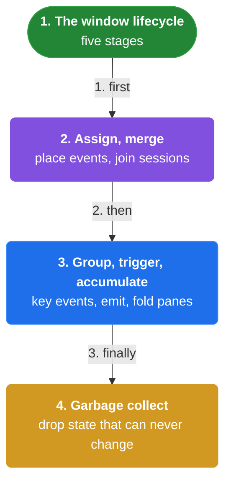
### Merge: 6. Session merging

**Why.** Sessions that were separate can turn out to be one session when a bridging event arrives.

**Claim.** When an event lands inside the gap of two sessions, the two sessions and the event merge into one window.

**Grounding.** The merge changes the window set, not just a count.

**In the wild.** Beam's mergeWindows is the production form.

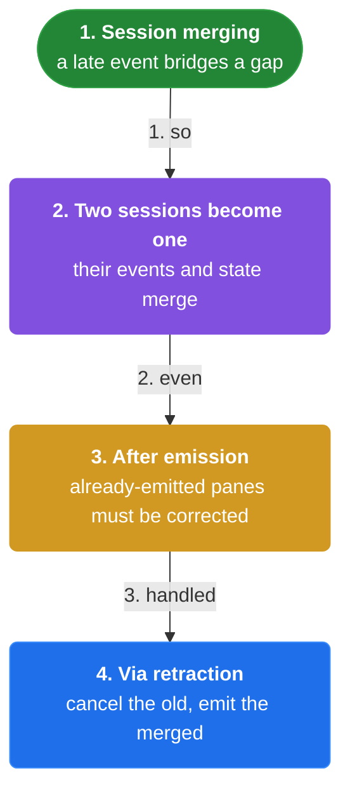
### Pitfall: 7. Late merges need retractions

**Why.** A late event can bridge two sessions already emitted separately, so the earlier panes are now wrong.

**Claim.** The pipeline must retract the two earlier panes and emit the merged one, or downstream double-counts.

**Grounding.** Retraction is the only way to correct an already-emitted result.

**In the wild.** Accumulating-and-retracting mode in Beam handles this.

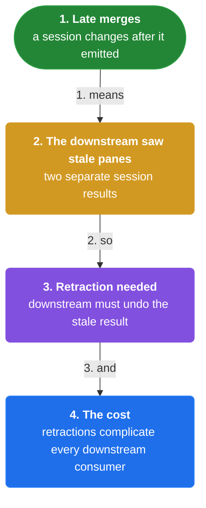
### Scope: 8. Sessions are keyed

**Why.** A gap must be measured within one entity, not across unrelated entities.

**Claim.** Sessions are per key — user A's session never merges with user B's, because the gap is measured within a key group.

**Grounding.** Keying is what makes session windows per-user rather than global.

**In the wild.** Grouping by user id before sessionizing is the production pattern.

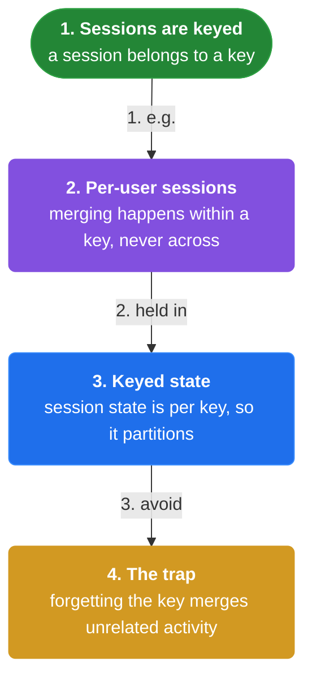

</details>


## Quiz

1. Which window shape is defined by the data rather than the clock?

   - A. Fixed
   - B. Sliding
   - C. Session
   - D. Global

<details><summary>Reveal answer</summary>

**C.** Session windows are dynamic — their boundaries follow bursts of activity and gaps.

</details>

2. What defines a sliding window?

   - A. A gap of inactivity
   - B. A window size and a slide
   - C. A single fixed span
   - D. A key

<details><summary>Reveal answer</summary>

**B.** Sliding windows are fixed-length, overlapping spans defined by size and slide.

</details>

3. When does a session window merge with another?

   - A. When the watermark passes
   - B. When an event lands inside the gap of both
   - C. When they share a key
   - D. When allowed lateness expires

<details><summary>Reveal answer</summary>

**B.** A bridging event inside the gap of two sessions merges them into one.

</details>

4. Why do late session merges need retractions?

   - A. To save memory
   - B. To cancel already-emitted panes and avoid double-counting
   - C. To speed up the pipeline
   - D. To reduce latency

<details><summary>Reveal answer</summary>

**B.** Earlier panes are now wrong, so they must be retracted before the merged pane is emitted.

</details>

5. Session windows are measured within a ___ .

   - A. partition
   - B. key group
   - C. global stream
   - D. time zone

<details><summary>Reveal answer</summary>

**B.** Sessions are per key — one user's session never merges with another's.

</details>

