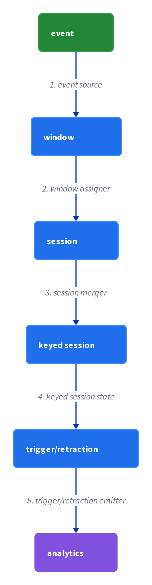
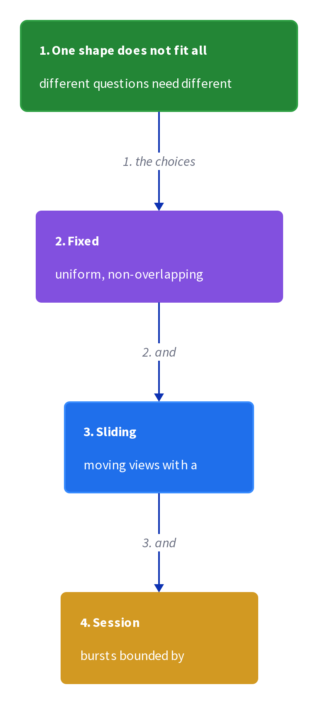
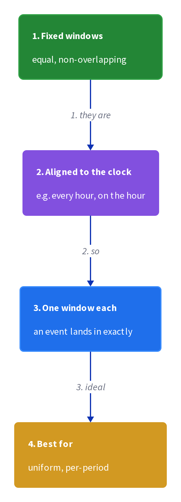
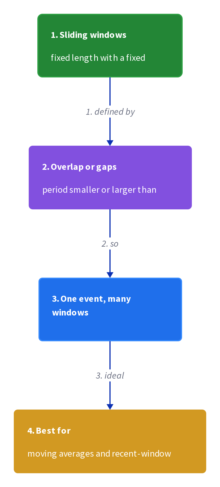
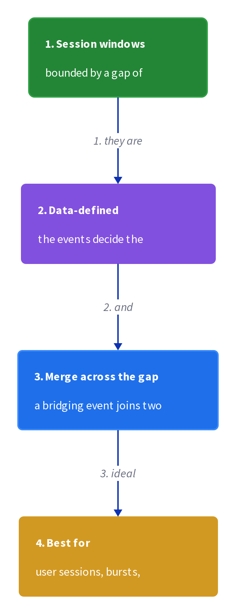
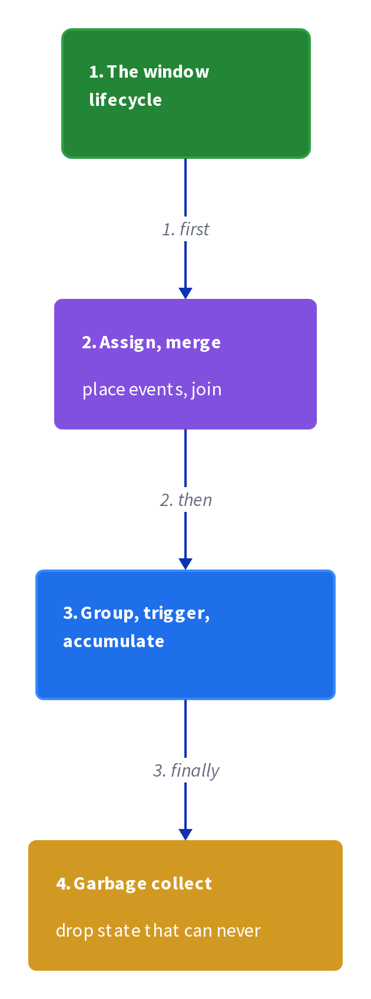
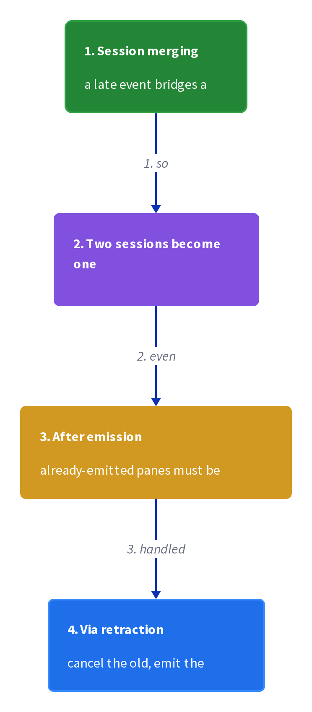
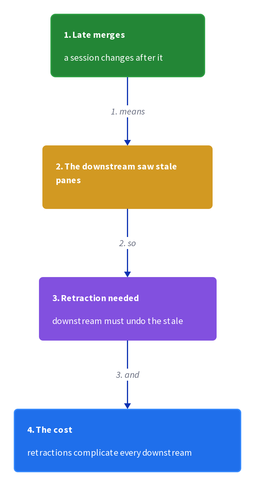
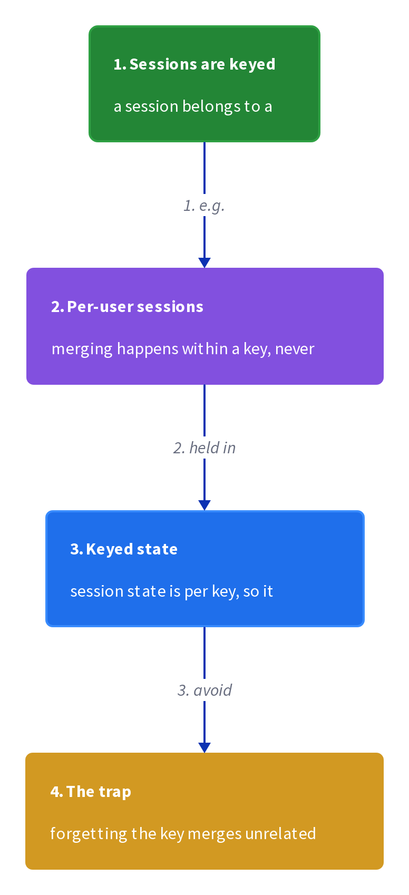

# Chapter 4: Advanced Windowing

> Windowing generalizes into a lifecycle — assign, merge, group, trigger, accumulate, and garbage-collect — and session windows are the canonical case where a window is born, merges with its neighbors, and dies dynamically as data arrives.

_Also known as: SS Ch04 · Session Windows · Fixed Window · Sliding Window · Window Merging · Window Lifecycle_

## Flow

### Window shapes — fixed, sliding, session

> **Why this matters:** Different questions need different event-time boundaries, so this section distinguishes the three canonical window shapes and when each is the right tool.

1. **Fixed (tumbling) windows** — Fixed windows partition time into **equal, non-overlapping, contiguous** spans — every event belongs to exactly one window. They answer "how many per hour".

2. **Sliding (hopping) windows** — Sliding windows are **fixed-length, overlapping** spans defined by a window size and a slide. They answer "what is the rolling 5-minute average, updated every minute".

3. **Session windows** — Session windows are **dynamic and data-driven**: a session is a burst of activity separated by a gap of inactivity. They answer "how long did a user stay engaged".

4. **Sessions capture behavior, not just counting** — Because session boundaries follow the data, they model real user journeys — a visit with a 30-minute gap is two sessions, not one. **The window is defined by the data, not the clock.**

```java
// STREAM SIDE — one click stream cut three ways gives three different groupings
// DEF: fixed window — a 5-min non-overlapping span = [12:00, 12:05)
// DEF: sliding window — a 10-min span that advances every 2 min = [12:00, 12:10)
// DEF: session window — a burst that closes after a 30-min gap of inactivity = { s1 }
// STATE (before):
//    fixed_count : 0
// ======================================================================
// offset 0: {event_time: "12:04:00"}
// offset 1: {event_time: "12:04:00", shape: "same click"}
// ======================================================================
// BUILD PHASE · run once at pipeline start
// step 0 · initialize the per-shape registers -> fixed_count : none -> 0, slide_count : none -> 0, sessions : none -> []
//    -> input  : window definitions = fixed 5-min, sliding 10-min every 2 min, session 30-min gap
//    <- output : fixed_count = 0, slide_count = 0, sessions = []   BECAUSE no click has been assigned yet
// QUERY PHASE · per arriving click
// step 1 · fixed assignment -> fixed_count : 0 -> 1
//    -> input  : click.event_time = "12:04:00", fixed span = [12:00, 12:05)
//    <- output : fixed_count = 1   BECAUSE 12:04:00 falls only in [12:00, 12:05)
// step 2 · sliding assignment -> slide_count : 0 -> 3
//    -> input  : click.event_time = "12:04:00", windows = [12:00,12:10), [12:02,12:12), [12:04,12:14)
//    <- output : slide_count = 3   BECAUSE 12:04:00 overlaps [12:00,12:10), [12:02,12:12), and [12:04,12:14)
// step 3 · session assignment -> sessions : [] -> ["s1"]
//    -> input  : click.event_time = "12:04:00", session gap = 30 min
//    <- output : sessions = ["s1"]   BECAUSE the click opens a new burst
// ======================================================================
// TRACE (click 12:04:00):
//    shape    | spans                                          | count
//    fixed    | [12:00, 12:05)                                 | 1
//    sliding  | [12:00,12:10),[12:02,12:12),[12:04,12:14)      | 3
//    session  | [s1]                                           | 1
// CORRECTNESS (assignment-invariant lemma): a click is assigned to every window whose span contains its event time —
//    12:04:00 lies in exactly one fixed span, three overlapping sliding spans, and one freshly opened session, so each
//    shape counts the click exactly once and the three counts never disagree on the same underlying event.
// VARIANTS (when to pick which):
//    fixed window   -> one window-assignment check, non-overlapping spans (use for periodic totals)   <- THIS ONE
//    sliding window -> one assignment per overlapping span, overlapping spans (use for moving averages)
//    session window -> one session assignment, data-driven span (use for bursts of activity)
//    global window  -> one add per event into the single bucket, one bucket for the whole stream (use for an all-time total)
// ======================================================================
// downstream : dashboard reads click 12:04:00 -> fixed 1 -> sliding 3 -> session 1   BECAUSE the shapes define different boundaries for the same event
//    derivation : sliding overlap = 3 windows = 5 - 2   BECAUSE 5 possible 10-min windows minus the 2 that end before 12:04
```

### The window lifecycle

> **Why this matters:** Windowing is more than "which bucket" — a window is assigned, merged, grouped, triggered, accumulated, and finally garbage-collected, so this section walks the full lifecycle in order.

1. **Assign** — Each element is assigned to a set of windows by its event time and the windowing function. **A sliding window assigns one event to several windows at once.**

2. **Merge** — Session windows **merge**: when a new event lands inside the gap of two existing sessions, the two sessions and the event collapse into one window. Merging is what makes sessions dynamic.

3. **Group and trigger** — Elements are **grouped by (key, window)** into the state that will be aggregated, then **triggers** decide when that state emits.

4. **Accumulate and garbage-collect** — Each emitted pane is **accumulated** per the accumulation mode, and the window state is **garbage-collected** once the watermark passes the window end plus allowed lateness.

```java
// SESSION SIDE — two sessions merge when a bridging event lands inside the gap
// DEF: session gap — the inactivity threshold that splits sessions = 30 min
// DEF: s1 — a session window = [12:00, 12:10)
// DEF: s2 — a session window = [12:40, 12:50)
// STATE (before):
//    sessions : { "s1": [12:00, 12:10), "s2": [12:40, 12:50) }
// ======================================================================
// offset 0: {event_time: "12:20:00"}
// offset 1: {event_time: "12:20:00", role: "bridge"}
// ======================================================================
// BUILD PHASE · run once when the two sessions are opened
// step 0 · initialize the session set and gap threshold -> sessions : none -> { "s1": [12:00, 12:10), "s2": [12:40, 12:50) }, gap : none -> 30 min
//    -> input  : session gap = 30 min, s1 = [12:00, 12:10), s2 = [12:40, 12:50)
//    <- output : sessions = { "s1", "s2" }, gap = 30 min   BECAUSE the two sessions are already open
// QUERY PHASE · per arriving event
// step 1 · the event is 10 min from s1's end and 20 min from s2's start -> gap_check : "apart" -> "bridging"
//    -> input  : event.event_time = "12:20:00", s1 = [12:00, 12:10), s2 = [12:40, 12:50), gap = 30 min
//    decode 1a · measure the gap from the event to s1's end -> gap_to_s1 : none -> 10 min
//    decode 1b · measure the gap from the event to s2's start -> gap_to_s2 : none -> 20 min
//    decode 1c · compare both gaps against the 30-min threshold -> gap_check : "apart" -> "bridging"
//    <- output : gap_check = "bridging"   BECAUSE both distances are within the 30-min gap
// step 2 · the merged session spans s1 and s2 -> sessions : { "s1", "s2" } -> { "sMerged": [12:00, 12:50) }
//    -> input  : s1 = [12:00, 12:10), s2 = [12:40, 12:50), gap_check = "bridging"
//    <- output : sessions = { "sMerged": [12:00, 12:50) }   BECAUSE the bridge joins the two ends
// step 3 · the event folds into the merged session -> sMerged_count : 0 -> 3
//    -> input  : s1_count = 1, s2_count = 1, bridge = 1 event
//    <- output : sMerged_count = 3   BECAUSE s1 + s2 + the bridging event = 3 events
// ======================================================================
// TRACE (bridge event 12:20:00, gap = 30 min):
//    distance to s1 end | distance to s2 start | threshold | action
//    10 min             | 20 min               | 30 min    | merge
// CORRECTNESS (merge-invariant lemma): a session merges exactly when the bridging event sits within the gap of both
//    neighbors — 12:20:00 is 10 min from s1's end and 20 min from s2's start, both <= 30 min, so the three collapse
//    into one span [12:00, 12:50) and the merged count is s1 + s2 + the bridge = 3 events.
// VARIANTS (when to pick which):
//    gap measured to nearest end/start -> one check per neighbor (use for few sessions)   <- THIS ONE
//    interval tree of sessions          -> one tree lookup per event (use when thousands of sessions are open)
//    fixed window (no merge)            -> one assignment per event, no dynamic span (use when boundaries must stay clock-aligned)
// ======================================================================
// downstream : s1 [12:00,12:10) -> s2 [12:40,12:50) -> bridge 12:20:00 -> sMerged [12:00,12:50) count 3   BECAUSE the 12:20 event was inside the gap of both
//    derivation : gap to s1 = 20 - 10 = 10 min <= 30, gap to s2 = 40 - 20 = 20 min <= 30 -> merge
```

### Session semantics and pitfalls

> **Why this matters:** Sessions are powerful but subtle — their boundaries change as data arrives, so this section covers what the lifecycle implies and where implementations get it wrong.

1. **A session can merge late** — A late event can bridge two sessions that were already emitted separately. **The pipeline must retract the two earlier panes and emit the merged one** — this is why accumulation mode matters.

2. **Sessions are garbage-collected by watermark** — A session is not done when it looks idle; it is done when the **watermark passes the session end plus allowed lateness**. Until then, a late event can revive it.

3. **Session windows are keyed** — Sessions are per key — **user A's session and user B's session never merge** because they are in different key groups. The gap is measured within a key.

4. **Choose the window to match the question** — Fixed windows for periodic aggregates, sliding windows for moving averages, sessions for user behavior. **The window shape is part of the answer, not an implementation detail.**

```java
// RETRACTION SIDE — a late event merges two already-emitted sessions, forcing a retraction
// DEF: session gap — the inactivity threshold = 30 min
// DEF: retraction — a downstream signal that cancels a previously emitted pane = { "s1", "s2" }
// DEF: s1, s2 — already-emitted sessions = { "s1": 3, "s2": 2 }
// STATE (before):
//    downstream : { "s1": 3, "s2": 2 }
// ======================================================================
// offset 0: {event_time: "12:20:00", arrival: "13:01:00"}
// offset 1: {event_time: "12:20:00", role: "late bridge"}
// ======================================================================
// BUILD PHASE · run once when s1 and s2 are emitted
// step 0 · initialize the downstream state and retraction set -> downstream : none -> { "s1": 3, "s2": 2 }, retraction : none -> { "s1", "s2" }
//    -> input  : already-emitted sessions = { "s1": 3, "s2": 2 }
//    <- output : downstream = { "s1": 3, "s2": 2 }, retraction = { "s1", "s2" }   BECAUSE both panes are now stale
// QUERY PHASE · per late event
// step 1 · the late event bridges the gap -> sessions : { "s1", "s2" } -> { "sMerged": [12:00, 12:50) }
//    -> input  : event.event_time = "12:20:00", s1 = [12:00, 12:10), s2 = [12:40, 12:50)
//    <- output : sessions = { "sMerged": [12:00, 12:50) }   BECAUSE both gaps are within 30 min
// step 2 · the pipeline emits a retraction for s1 and s2 -> downstream : { "s1": 3, "s2": 2 } -> {}
//    -> input  : downstream = { "s1": 3, "s2": 2 }, retraction = { "s1", "s2" }
//    <- output : downstream = {}   BECAUSE the earlier panes are now stale
// step 3 · the pipeline emits the merged session -> downstream : {} -> { "sMerged": 6 }
//    -> input  : downstream = {}, merged count = 3 + 2 + 1
//    <- output : downstream = { "sMerged": 6 }   BECAUSE 3 + 2 + 1 = 6
// ======================================================================
// TRACE (late bridge 12:20:00):
//    step          | downstream       | total
//    retract s1    | { "s2": 2 }      | 2
//    retract s2    | {}               | 0
//    emit merged   | { "sMerged": 6 } | 6
// CORRECTNESS (retraction-invariant lemma): a corrected merge emits retractions for exactly the panes it replaces before
//    the merged pane lands — s1 (3) and s2 (2) are retracted, then sMerged = 3 + 2 + 1 = 6 is emitted, so the sink
//    totals 6, never the 11 a naive double-count would produce.
// VARIANTS (when to pick which):
//    retract then emit -> one retraction + one emit, sink must undo (use for an idempotent store)   <- THIS ONE
//    emit delta only   -> one delta write, sink applies the difference (use when the sink can add deltas)
//    drop late data    -> one discard of the late event, no correction (use when late merges are rare and cost > value)
// ======================================================================
// downstream : s1 3 -> s2 2 -> retraction -> sMerged 6   BECAUSE the retractions undid s1 and s2, so the total is 6 not 11
//    derivation : merged count = 3 + 2 + 1 = 6   BECAUSE s1_count + s2_count + the bridging event
```


## Links & The Bigger Picture

Concepts this chapter mentions but does not fully unpack are linked below — each pointer names the chapter where the concept is covered in depth and gives a concrete example that ties the two chapters together.

- **[Chapter 2: The What, Where, When, and How of Data Processing → What and Where — transformations and windowing](ch02-the-what-where-when-and-how-of-data-processing.md#what-and-where--transformations-and-windowing)** — the window is the "where" axis of the four-question model; ch02 fixes that axis against the other three (what/when/how).
  - _Example:_ ch04's fixed vs sliding vs session shapes are the "where" choice; ch02 shows the same click 12:04:00 answering 1 fixed, 3 sliding, or 1 session result, with the trigger deciding when each emits.
- **[Chapter 3: Watermarks → Propagation and correctness](ch03-watermarks.md#propagation-and-correctness)** — a window's lifecycle ends with garbage collection, and the watermark is what decides when a window is done — ch03 defines the signal that drives it.
  - _Example:_ ch04's "session done when watermark passes end + lateness" is ch03's watermark 12:06:30 closing [12:00,12:05); the skew formula (max_seen 12:08:30 − 120 s) is what produced that watermark.
- **[Chapter 8: Streaming SQL → Windows in SQL](ch08-streaming-sql.md#windows-in-sql)** — TUMBLE/HOP/SESSION are the SQL spellings of this chapter's fixed/sliding/session shapes, with the watermark driving emission.
  - _Example:_ ch04's session [12:00,12:50) after a 12:20:00 bridge event is what Flink SQL's SESSION(gap) computes; ch04's sliding 10-min/2-min is ch08's HOP(10 min, 2 min).
- **[Chapter 7: The Practicalities of Persistent State → Checkpoints and state stores](ch07-the-practicalities-of-persistent-state.md#checkpoints-and-state-stores)** — window state is exactly the state that a stateful processor must persist; ch07 covers how that per-window state is snapshotted and recovered.
  - _Example:_ ch04's per-window counts and session sets live in keyed state; ch07 shows that same state as { 42: 13 } being checkpointed with its offset so a restart resumes without recomputing the windows.

## System Design Interview

> **The question:** Design session-window analytics for user activity. Premise: a late event can bridge two already-emitted sessions, so the pipeline must retract the two stale panes and emit the merged session instead of double-counting.

**The pipeline:** event source -> window assigner -> session merger -> keyed session state -> trigger/retraction emitter -> analytics store

<a href="../diagrams/d2/decomp/ch04-0.png"></a>

### event source

_Role: event source — emits events with event time and a key_

- a click {user: 42, event_time: "12:20:00"} arrives
- the key is user 42, so sessions are per-user
- a late event may arrive with event_time earlier than the watermark

### window assigner

_Role: window assigner — assigns events to session windows_

- the event is assigned to a new or existing session for user 42
- the gap threshold is 30 min of inactivity
- sessions are data-driven, not clock-aligned

### session merger

_Role: session merger — merges sessions that a bridging event connects_

- s1 [12:00,12:10) and s2 [12:40,12:50) both sit within 30 min of the event
- the merger collapses them into sMerged [12:00, 12:50)
- the merged count folds s1 + s2 + the bridging event

### trigger/retraction emitter

_Role: trigger/retraction emitter — emits and corrects panes_

- the on-time trigger fires when the watermark passes a session end
- a late merge retracts the two earlier panes
- the merged pane is emitted so the store shows one session, not three

```java
// SYSTEM DESIGN — a late event merges two sessions and the pipeline retracts the stale panes
// DEF: session gap — the inactivity threshold = 30 min
// DEF: retraction — a downstream signal that cancels a previously emitted pane = { "s1", "s2" }
// DEF: sessions — the current set for user 42 = { "s1": [12:00, 12:10), "s2": [12:40, 12:50) }
// STATE (before):
//    session_state : { "s1": 3, "s2": 2 }
// ======================================================================
// offset 0: {user: 42, event_time: "12:20:00"}
// offset 1: {user: 42, event_time: "12:20:00", arrival: "13:01:00"}
// ======================================================================
// step 1 · the event bridges s1 and s2 -> sessions : { "s1", "s2" } -> { "sMerged": [12:00, 12:50) }
//    -> input  : event.event_time = "12:20:00", s1 = [12:00, 12:10), s2 = [12:40, 12:50)
//    <- output : sessions = { "sMerged": [12:00, 12:50) }   BECAUSE both gaps are within 30 min
// step 2 · the pipeline retracts the stale panes -> session_state : { "s1": 3, "s2": 2 } -> {}
//    -> input  : session_state = { "s1": 3, "s2": 2 }, retraction = { "s1", "s2" }
//    <- output : session_state = {}   BECAUSE the earlier panes are now wrong
// step 3 · the merged pane is emitted -> session_state : {} -> { "sMerged": 6 }
//    -> input  : session_state = {}, merged count = 3 + 2 + 1
//    <- output : session_state = { "sMerged": 6 }   BECAUSE 3 + 2 + 1 = 6
// ======================================================================
// downstream : s1 3 -> s2 2 -> retraction -> sMerged 6   BECAUSE the store must show one session, not three totaling 11
//    derivation : merged count = 3 + 2 + 1 = 6   BECAUSE s1_count + s2_count + the bridging event
```

## Interview Questions

### Q1

An analytics pipeline reports 'sessions per user', but a user who pauses for 20 minutes and returns is counted as two sessions while a 10-minute pause is one — and late events can merge sessions that were already reported.

**Interviewer's question:** How do you model user sessions as windows, and what happens when a late event merges two already-reported sessions?

**Solution:** Use session windows with a gap threshold; when a late event bridges two already-emitted sessions, retract the two earlier panes and emit the merged one.

**System-design components:**
- Session window — gap-based dynamic window
- Gap threshold — inactivity bound
- Merge — collapse two sessions + the bridging event
- Retraction — cancel the earlier panes

```java
// s1 [12:00,12:10), s2 [12:40,12:50)
//   late event @ 12:20 -> bridges gap -> merge
//   retract s1 (3), retract s2 (2)
//   emit sMerged [12:00,12:50) count = 3+2+1 = 6
```

_This is exactly the session merging and retraction material in this chapter._

_Covers:_ 4. Session windows · 6. Session merging · 7. Late merges need retractions

_From the 28 problems:_ 21-ad-click-aggregation

### Q2

A dashboard needs both an hourly total and a rolling 10-minute average, but the team used one window type for both and the numbers look wrong.

**Interviewer's question:** Which window shapes should each metric use, and why?

**Solution:** The hourly total is a fixed window (equal, non-overlapping buckets); the rolling average is a sliding window (10-minute window advancing every minute).

**System-design components:**
- Fixed window — hourly total
- Sliding window — rolling 10-min average
- Window size + slide — defines the overlap

```java
// fixed   : event @ 12:04 belongs to [12:00,12:05) only
// sliding : event @ 12:04 belongs to [11:55,12:05), [11:56,12:06), ... [12:04,12:14)
//   -> count once vs count many
```

_This is exactly the fixed vs sliding window material in this chapter._

_Covers:_ 2. Fixed windows · 3. Sliding windows

_From the 28 problems:_ 20-metrics-monitoring

## Key Concepts

### The Problem

**1. One window shape does not fit all questions.** Fixed, sliding, and session windows are three shapes that answer three different kinds of questions.


### The Solution

Fixed windows partition time into equal, non-overlapping, contiguous spans; each event belongs to exactly one window.

```java
// s1 [12:00,12:10), s2 [12:40,12:50)
//   late event @ 12:20 -> bridges gap -> merge
//   retract s1 (3), retract s2 (2)
//   emit sMerged [12:00,12:50) count = 3+2+1 = 6
```


### Key Facts

| Fact | Detail | In the wild |
|---|---|---|
| 2. Fixed windows | Fixed windows partition time into equal, non-overlapping, contiguous spans; each event belongs to exactly one window. | A 5-minute tumbling window in Flink is a fixed window. |
| 3. Sliding windows | Sliding windows are fixed-length, overlapping spans defined by a window size and a slide. | A 10-minute window sliding every 2 minutes is the canonical rolling average. |
| 4. Session windows | A session is a burst of activity separated by a gap of inactivity; session boundaries are data-driven. | Web-analytics sessionization is the canonical session-window use case. |
| 5. The window lifecycle | Each element is assigned, session windows merge, elements group by (key, window), triggers emit, panes accumulate, and state is garbage-collected. | Beam's WindowFn, trigger, and accumulation mode map onto these stages. |
| 6. Session merging | When an event lands inside the gap of two sessions, the two sessions and the event merge into one window. | Beam's mergeWindows is the production form. |
| 7. Late merges need retractions | The pipeline must retract the two earlier panes and emit the merged one, or downstream double-counts. | Accumulating-and-retracting mode in Beam handles this. |
| 8. Sessions are keyed | Sessions are per key — user A's session never merges with user B's, because the gap is measured within a key group. | Grouping by user id before sessionizing is the production pattern. |


### Tradeoffs & When

- The pipeline must retract the two earlier panes and emit the merged one, or downstream double-counts.
- Sessions are per key — user A's session never merges with user B's, because the gap is measured within a key group.


### Real-World Examples

- **Google Analytics** — Sessionization of user visits with a 30-minute inactivity gap
- **Apache Beam** — Session windows with mergeWindows and accumulating-and-retracting for late merges
- **Apache Flink** — Event-time session windows with a gap and dynamic session merging
- **Flink SQL** — TUMBLE/HOP/SESSION constructs as the SQL spellings of the three window shapes


<details><summary>All concepts (index)</summary>

### Why: 1. One window shape does not fit all questions

**Why.** "How many per hour", "what is the rolling average", and "how long did a user stay" need different event-time boundaries.

**Claim.** Fixed, sliding, and session windows are three shapes that answer three different kinds of questions.

**Grounding.** The book builds the whole windowing model on these three shapes.

**In the wild.** Beam, Flink, and Dataflow all expose these three window types.

<a href="../diagrams/d2/card/ch04-0.png"></a>
### Shape: 2. Fixed windows

**Why.** Periodic, comparable aggregates need equal, non-overlapping time buckets.

**Claim.** Fixed windows partition time into equal, non-overlapping, contiguous spans; each event belongs to exactly one window.

**Grounding.** They answer "how many per hour".

**In the wild.** A 5-minute tumbling window in Flink is a fixed window.

<a href="../diagrams/d2/card/ch04-1.png"></a>
### Shape: 3. Sliding windows

**Why.** Moving averages need overlapping spans so a point in time contributes to several recent windows.

**Claim.** Sliding windows are fixed-length, overlapping spans defined by a window size and a slide.

**Grounding.** One event can belong to several sliding windows at once.

**In the wild.** A 10-minute window sliding every 2 minutes is the canonical rolling average.

<a href="../diagrams/d2/card/ch04-2.png"></a>
### Shape: 4. Session windows

**Why.** User behavior is bursty and its boundaries follow the data, not the clock.

**Claim.** A session is a burst of activity separated by a gap of inactivity; session boundaries are data-driven.

**Grounding.** A 30-minute gap splits one visit into two sessions.

**In the wild.** Web-analytics sessionization is the canonical session-window use case.

<a href="../diagrams/d2/card/ch04-3.png"></a>
### Lifecycle: 5. The window lifecycle

**Why.** Windowing is a pipeline of steps — assign, merge, group, trigger, accumulate, garbage-collect — not a single bucket lookup.

**Claim.** Each element is assigned, session windows merge, elements group by (key, window), triggers emit, panes accumulate, and state is garbage-collected.

**Grounding.** The lifecycle is the book's complete description of windowing.

**In the wild.** Beam's WindowFn, trigger, and accumulation mode map onto these stages.

<a href="../diagrams/d2/card/ch04-4.png"></a>
### Merge: 6. Session merging

**Why.** Sessions that were separate can turn out to be one session when a bridging event arrives.

**Claim.** When an event lands inside the gap of two sessions, the two sessions and the event merge into one window.

**Grounding.** The merge changes the window set, not just a count.

**In the wild.** Beam's mergeWindows is the production form.

<a href="../diagrams/d2/card/ch04-5.png"></a>
### Pitfall: 7. Late merges need retractions

**Why.** A late event can bridge two sessions already emitted separately, so the earlier panes are now wrong.

**Claim.** The pipeline must retract the two earlier panes and emit the merged one, or downstream double-counts.

**Grounding.** Retraction is the only way to correct an already-emitted result.

**In the wild.** Accumulating-and-retracting mode in Beam handles this.

<a href="../diagrams/d2/card/ch04-6.png"></a>
### Scope: 8. Sessions are keyed

**Why.** A gap must be measured within one entity, not across unrelated entities.

**Claim.** Sessions are per key — user A's session never merges with user B's, because the gap is measured within a key group.

**Grounding.** Keying is what makes session windows per-user rather than global.

**In the wild.** Grouping by user id before sessionizing is the production pattern.

<a href="../diagrams/d2/card/ch04-7.png"></a>

</details>


## Quiz

1. Which window shape is defined by the data rather than the clock?

   - A. Fixed
   - B. Sliding
   - C. Session
   - D. Global

<details><summary>Reveal answer</summary>

**C.** Session windows are dynamic — their boundaries follow bursts of activity and gaps.

</details>

2. What defines a sliding window?

   - A. A gap of inactivity
   - B. A window size and a slide
   - C. A single fixed span
   - D. A key

<details><summary>Reveal answer</summary>

**B.** Sliding windows are fixed-length, overlapping spans defined by size and slide.

</details>

3. When does a session window merge with another?

   - A. When the watermark passes
   - B. When an event lands inside the gap of both
   - C. When they share a key
   - D. When allowed lateness expires

<details><summary>Reveal answer</summary>

**B.** A bridging event inside the gap of two sessions merges them into one.

</details>

4. Why do late session merges need retractions?

   - A. To save memory
   - B. To cancel already-emitted panes and avoid double-counting
   - C. To speed up the pipeline
   - D. To reduce latency

<details><summary>Reveal answer</summary>

**B.** Earlier panes are now wrong, so they must be retracted before the merged pane is emitted.

</details>

5. Session windows are measured within a ___ .

   - A. partition
   - B. key group
   - C. global stream
   - D. time zone

<details><summary>Reveal answer</summary>

**B.** Sessions are per key — one user's session never merges with another's.

</details>

## Sources

- [Akidau et al. — "The Dataflow Model" (VLDB 2015)](https://www.vldb.org/pvldb/vol8/p1792-Akidau.pdf) — Session windows, merging, and the window lifecycle this chapter is built on
- [Apache Beam programming guide](https://beam.apache.org/documentation/programming-guide/) — The window assign/merge/group/trigger/accumulate lifecycle as an API
- [Apache Flink — Windows](https://nightlies.apache.org/flink/flink-docs-stable/docs/dev/datastream/operators/windows/) — Fixed, sliding, and session windows in a production engine
- [Apache Flink — Table API and SQL overview](https://nightlies.apache.org/flink/flink-docs-stable/docs/dev/table/overview/) — TUMBLE/HOP/SESSION as SQL window constructs

