# Chapter 4: Advanced Windowing

> Windowing generalizes into a lifecycle — assign, merge, group, trigger, accumulate, and garbage-collect — and session windows are the canonical case where a window is born, merges with its neighbors, and dies dynamically as data arrives.

_Also known as: SS Ch04 · Session Windows · Fixed Window · Sliding Window · Window Merging · Window Lifecycle_

## Flow

### Window shapes — fixed, sliding, session

> **Why this matters:** Different questions need different event-time boundaries, so this section distinguishes the three canonical window shapes and when each is the right tool.

1. **Fixed (tumbling) windows** — Fixed windows partition time into **equal, non-overlapping, contiguous** spans — every event belongs to exactly one window. They answer "how many per hour".

2. **Sliding (hopping) windows** — Sliding windows are **fixed-length, overlapping** spans defined by a window size and a slide. They answer "what is the rolling 5-minute average, updated every minute".

3. **Session windows** — Session windows are **dynamic and data-driven**: a session is a burst of activity separated by a gap of inactivity. They answer "how long did a user stay engaged".

4. **Sessions capture behavior, not just counting** — Because session boundaries follow the data, they model real user journeys — a visit with a 30-minute gap is two sessions, not one. **The window is defined by the data, not the clock.**

<!-- ch04-shapes:begin — generated by tools/gen_ch04.js; do not hand-edit -->

#### Why there are three shapes, and why one of them has no answer without a setting

**Fixed (tumbling) windows** partition event time into equal, contiguous, non-overlapping spans. Every event belongs to exactly one, so the 4 window sums here (19, 11, 7, 8) add up to 45 — the whole dataset. They answer "how many per 120s", and they are the shape that reconciles against a batch job.

**Sliding (hopping) windows** are fixed-length but overlapping, defined by a size and a slide — here 120s wide starting every 60s. 6 of the 9 events land in 2 windows at once, so the results total **78** against a dataset of 45. Output volume scales as size / slide = 2×. They answer "what is the rolling 120s figure, refreshed every 60s".

**Session windows** are data-driven: a session is a burst of activity separated from the next by a gap of inactivity — here 120s. At that gap key `a` gets 3 sessions and key `b` gets 2, over the same span of event time, because they were active at different moments. No session has the same length as another and none starts on a round boundary; both facts follow from the boundaries being set by the data.

**And here is the part that is easy to miss.** Sweep the gap over the same stream and key `a`'s session count goes **4 → 3 → 2 → 1** at gaps of 40s, 120s, 130s, 300s. The events never change. Only the definition of "a visit" does.

So "how many sessions did this user have?" has **no answer in the data** until someone states the gap. It is a product definition that happens to live in a config file — which is why the window shape is part of the answer rather than an implementation detail.

#### When to reach for each shape, and what each one costs

**Fixed windows whenever the question names a period.** "Per minute", "per hour", "daily" — the shape is decided and nothing else needs considering. Totals reconcile, state is bounded by (keys × open windows), and a batch job over the same data gives the same answer.

**Sliding windows for a moving measure,** and budget for 2× the output and 2× the state. The trap is comparing their total to the input total: 78 against 45 here, and the overlap is the intent, not a bug.

**Session windows when the boundary is a property of the user's behaviour,** not of the clock — engagement, a visit, a trip, a conversation. Accept that the number of state entries is data-dependent (5 for 9 events here) and cannot be sized in advance.

**Do not reach for sessions to approximate "recent activity".** A sliding window answers that with bounded state and no merging.

**What this does not settle:** session bounds are provisional. A later event can extend a session, which means it can change a value that has already been reported — and at some gap settings that is forced rather than possible. The next concept walks the full lifecycle, and the one after that finds the exact gap at which this stream requires a retraction.

#### Visual walkthrough — three shapes, and the gap sweep

The animation loops through all 4 steps. Expand any step to study it on its own.



<details>
<summary><b>Step 1 of 4</b> — fixed windows partition time: one event, one window</summary>


Fixed windows are the easy case and the one to reach for by default. Equal length, contiguous, non-overlapping — so each of the 9 events appears exactly once and the 4 sums add to 45. If a question names a period ("per minute", "per hour"), this is the shape, and nothing else needs considering.

</details>
<details>
<summary><b>Step 2 of 4</b> — sliding windows overlap: one event, several windows</summary>

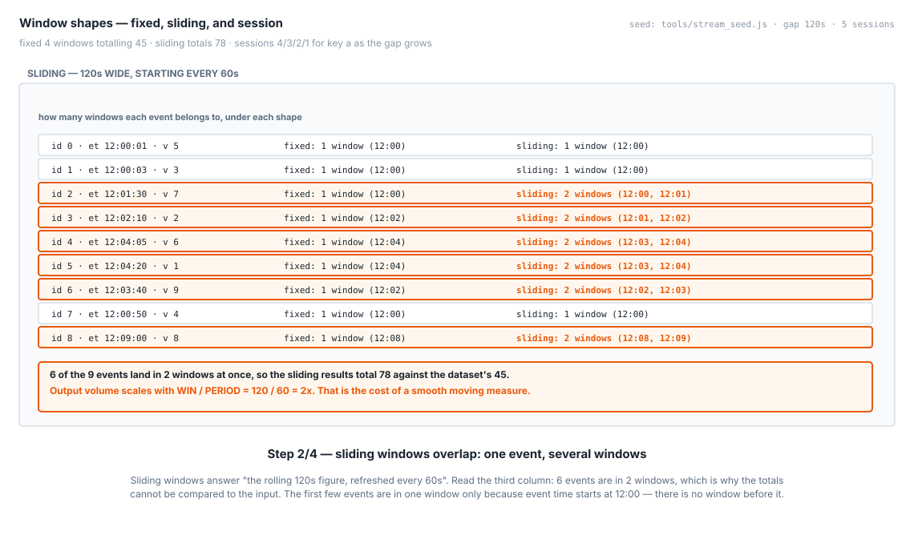

Sliding windows answer "the rolling 120s figure, refreshed every 60s". Read the third column: 6 events are in 2 windows, which is why the totals cannot be compared to the input. The first few events are in one window only because event time starts at 12:00 — there is no window before it.

</details>
<details>
<summary><b>Step 3 of 4</b> — session windows are defined by the DATA, not the clock</summary>

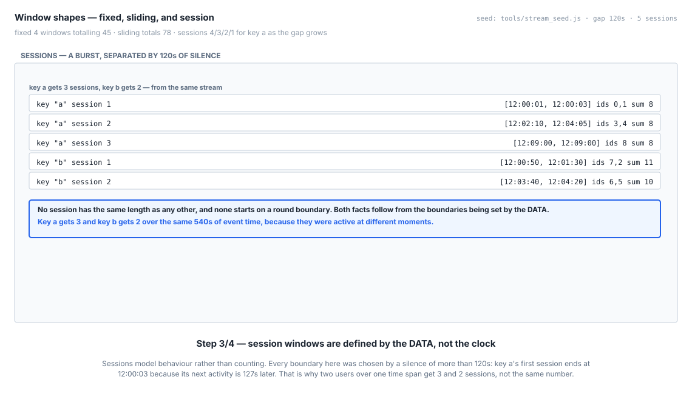

Sessions model behaviour rather than counting. Every boundary here was chosen by a silence of more than 120s: key a's first session ends at 12:00:03 because its next activity is 127s later. That is why two users over one time span get 3 and 2 sessions, not the same number.

</details>
<details>
<summary><b>Step 4 of 4</b> — and the gap is part of the ANSWER, not a tuning knob</summary>

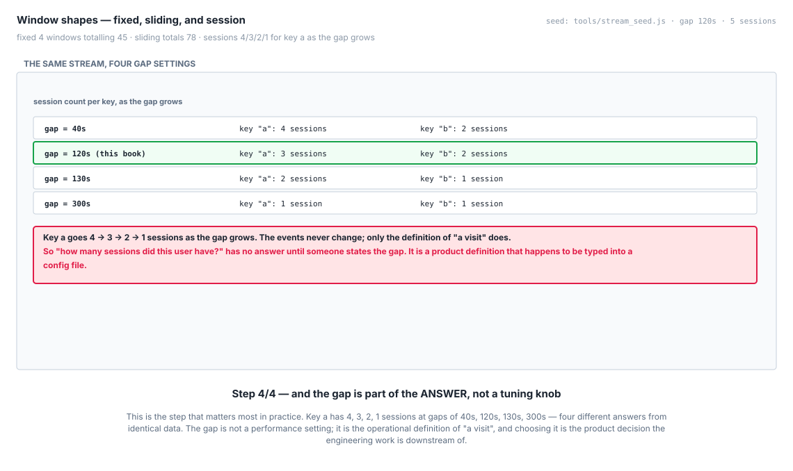

This is the step that matters most in practice. Key a has 4, 3, 2, 1 sessions at gaps of 40s, 120s, 130s, 300s — four different answers from identical data. The gap is not a performance setting; it is the operational definition of "a visit", and choosing it is the product decision the engineering work is downstream of.

</details>

<sub>Every window membership, the sliding total and the four-gap session sweep are computed from the seed and asserted. Generated by `node tools/gen_ch04.js`.</sub>

<!-- ch04-shapes:end -->

<!-- ch04-shapes-memory:begin — generated by tools/gen_ch04.js; do not hand-edit -->

#### Three window shapes through one assigner

**What is being answered.** Why there are three window shapes — as one `assign` function that can answer for two of them and must return NONE for the third.

`assign(e, shape)` returns a **list**: one element for fixed, up to 2 for sliding, and NONE for a session. `totalAcross` then multiplies `e.v` by that list's length, which is the whole mechanism behind the sliding total exceeding the dataset.

Step 2 is the structural point: a session cannot be assigned from a single event, because its bounds depend on events that have not arrived. Step 4 shows the consequence — `gap` is the only difference between 3 sessions and 4.

The animation steps through the code, holding each line long enough to read the STACK (call frames and their locals) and the HEAP (allocated arrays and objects) as they are AT THAT MOMENT. Expand any step to study it on its own.



<details>
<summary><b>Step 1 of 4</b> — fixed and sliding differ only in the LENGTH of the answer</summary>


For id 4, `assign` returns [240] under "fixed" and [180, 240] under "sliding" — a list of 2. `totalAcross` multiplies `e.v` by `len(...)`, which is why the sliding total reaches 78 against 45. The overlap is in the list length, nowhere else.

</details>
<details>
<summary><b>Step 2 of 4</b> — a session cannot be assigned from one event at all</summary>

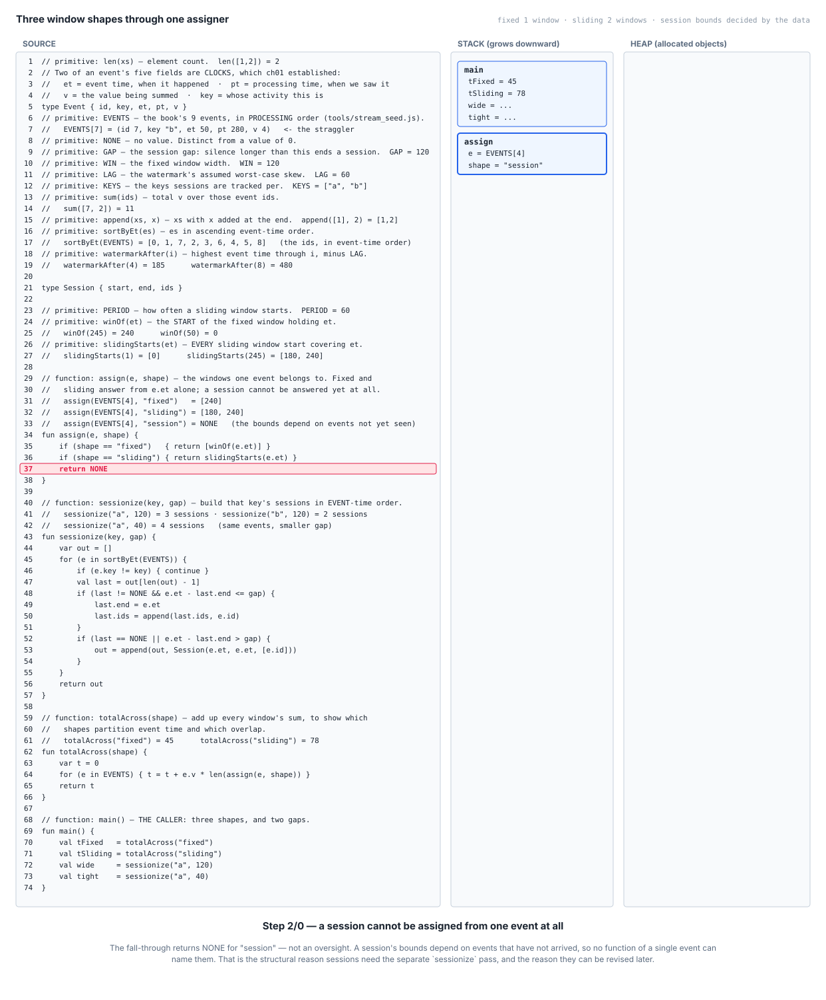

The fall-through returns NONE for "session" — not an oversight. A session's bounds depend on events that have not arrived, so no function of a single event can name them. That is the structural reason sessions need the separate `sessionize` pass, and the reason they can be revised later.

</details>
<details>
<summary><b>Step 3 of 4</b> — so sessions are built by comparing CONSECUTIVE event times</summary>

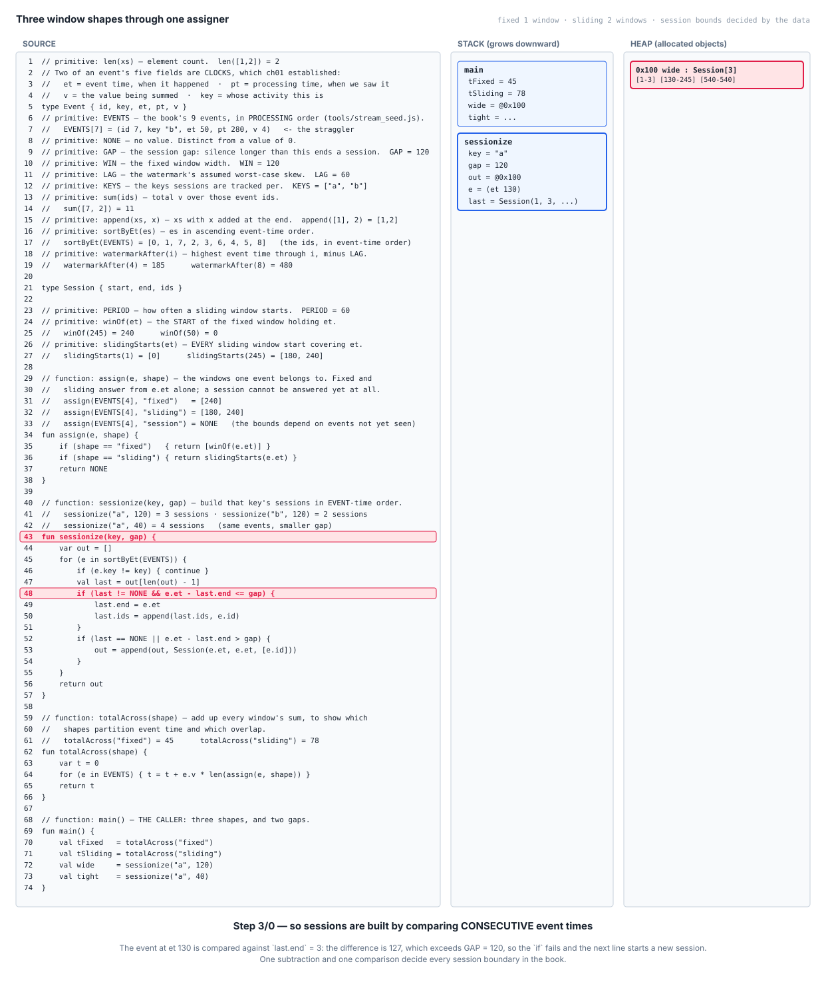

The event at et 130 is compared against `last.end` = 3: the difference is 127, which exceeds GAP = 120, so the `if` fails and the next line starts a new session. One subtraction and one comparison decide every session boundary in the book.

</details>
<details>
<summary><b>Step 4 of 4</b> — and the same events give a different number of sessions</summary>

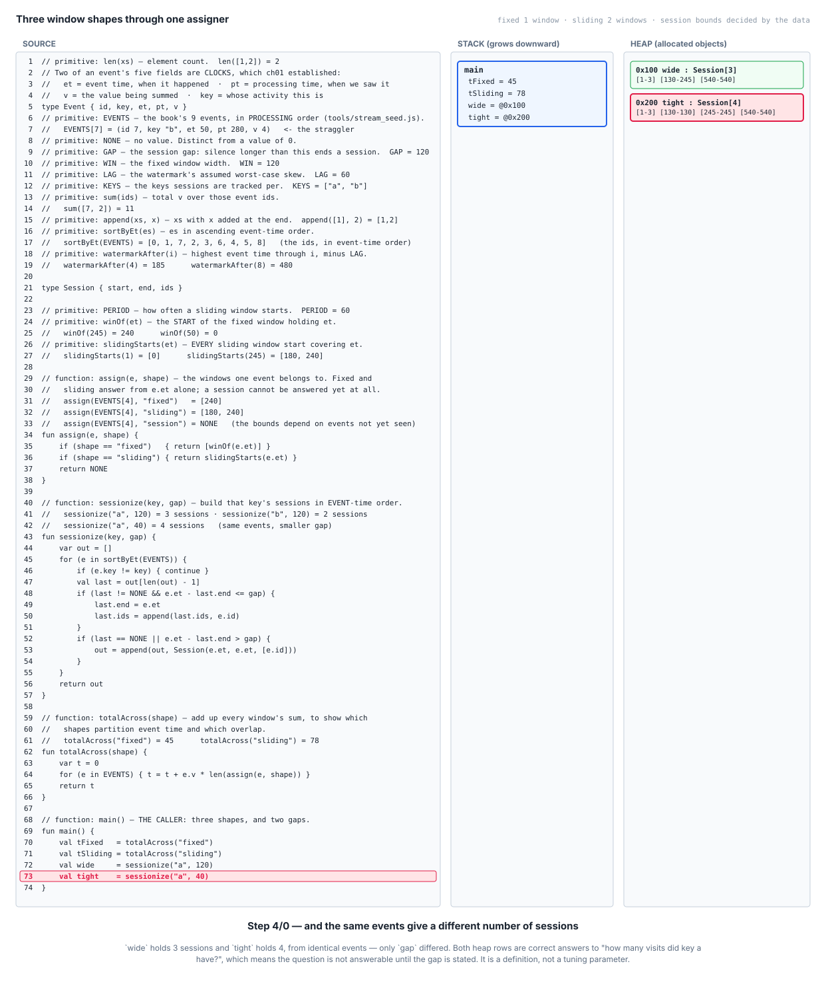

`wide` holds 3 sessions and `tight` holds 4, from identical events — only `gap` differed. Both heap rows are correct answers to "how many visits did key a have?", which means the question is not answerable until the gap is stated. It is a definition, not a tuning parameter.

</details>

<sub>Every session boundary and both totals are computed from the seed and asserted. Generated by `node tools/gen_ch04.js` on `tools/memkit.js`.</sub>

<!-- ch04-shapes-memory:end -->

### The window lifecycle

> **Why this matters:** Windowing is more than "which bucket" — a window is assigned, merged, grouped, triggered, accumulated, and finally garbage-collected, so this section walks the full lifecycle in order.

1. **Assign** — Each element is assigned to a set of windows by its event time and the windowing function. **A sliding window assigns one event to several windows at once.**

2. **Merge** — Session windows **merge**: when a new event lands inside the gap of two existing sessions, the two sessions and the event collapse into one window. Merging is what makes sessions dynamic.

3. **Group and trigger** — Elements are **grouped by (key, window)** into the state that will be aggregated, then **triggers** decide when that state emits.

4. **Accumulate and garbage-collect** — Each emitted pane is **accumulated** per the accumulation mode, and the window state is **garbage-collected** once the watermark passes the window end plus allowed lateness.

<!-- ch04-lifecycle:begin — generated by tools/gen_ch04.js; do not hand-edit -->

#### Why a session assignment is a hypothesis, and where the memory is released

Every windowing goes through the same four steps, and sessions are the only shape where step 2 does anything.

**1. Assign.** Each element is assigned to a set of windows by its event time and the windowing function. For id 4 (et 12:04:05): fixed gives 1 window, sliding gives 2, and session gives one window **whose bounds are not known yet**. Assign reads `e.et` and the rule, never the arrival time.

That last row is why step 2 exists. A fixed or sliding assignment is final; a session assignment is a hypothesis that a later event can revise.

**2. Merge.** When an event lands within the gap of an existing session, the two collapse. Watch key "b" in processing order: 2 of its 4 arrivals merge — id 6 and id 7, both arriving **out of order** and extending a session *backwards*. A session's start moved after the session existed; no other windowing has a boundary that can do that.

**3. Group and trigger.** Elements are grouped by (key, window) into the state that will be aggregated, then triggers decide when it emits. There are **5 state entries** here, one per (key, session) — and that count is data-dependent, which fixed windows never are. You cannot size session state in advance.

**4. Accumulate and garbage-collect.** Each pane is accumulated per the accumulation mode, and the state is released when the watermark passes the window end plus allowed lateness. For sessions the relevant bound is end + gap: a session that has been quiet for 120s of **wall clock** may still grow, and only the watermark rules that out.

For key "b"'s session holding id 7, collection happens at event 8 — and id 7 arrived at event 7, **1 event earlier**. So at gap 120s nothing needs retracting. Shrink the gap to 40s and the order flips.

#### When merging matters, and what collection is actually buying

**Merging matters the moment your input can be out of order,** which is always for sessions on real data. Both of this stream's merges were caused by out-of-order arrival, and both moved a session's start backwards — so a pipeline that assumes a session only grows forward is wrong on this dataset.

**Group-and-trigger is where to look when state grows unexpectedly.** The unit is (key, window), so session state scales with keys × bursts, and a stream of short bursts produces far more entries than the same volume arriving steadily.

**Collection is buying memory back, and it is the only thing that does.** 1 session here is never collected — the watermark never reaches its end plus gap — so its state is held for the life of the job. On an unbounded stream with low-traffic keys that is the leak that eventually matters.

**What this does not settle:** whether a retraction is required. At gap 120s the margin is 1 event, and at gap 40s the same stream forces one. "Does my pipeline need retractions?" is therefore not answerable from the data — it depends on a setting, and here it turns on a single event's position in the stream.

#### Visual walkthrough — the four steps, with the merges traced

The animation loops through all 4 steps. Expand any step to study it on its own.



<details>
<summary><b>Step 1 of 4</b> — ASSIGN — by event time, and possibly to several windows</summary>


Assign reads `e.et` and the windowing rule, and nothing else. For fixed and sliding that settles the question permanently. For a session it does not: id 4 joins a session whose bounds depend on events that have not arrived — so a session assignment is a hypothesis, and the merge step is what revises it.

</details>
<details>
<summary><b>Step 2 of 4</b> — MERGE — a later arrival can absorb an existing session</summary>

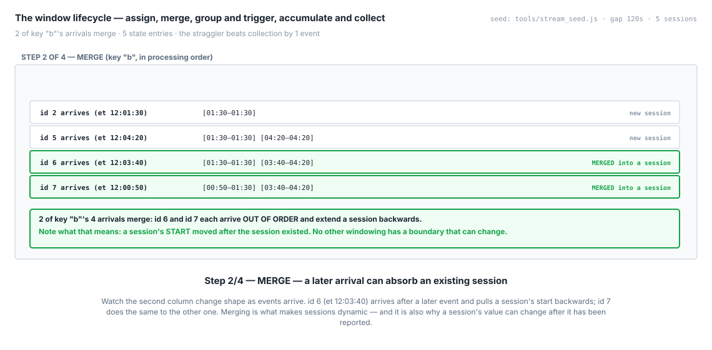

Watch the second column change shape as events arrive. id 6 (et 12:03:40) arrives after a later event and pulls a session's start backwards; id 7 does the same to the other one. Merging is what makes sessions dynamic — and it is also why a session's value can change after it has been reported.

</details>
<details>
<summary><b>Step 3 of 4</b> — GROUP and TRIGGER — state per (key, window)</summary>

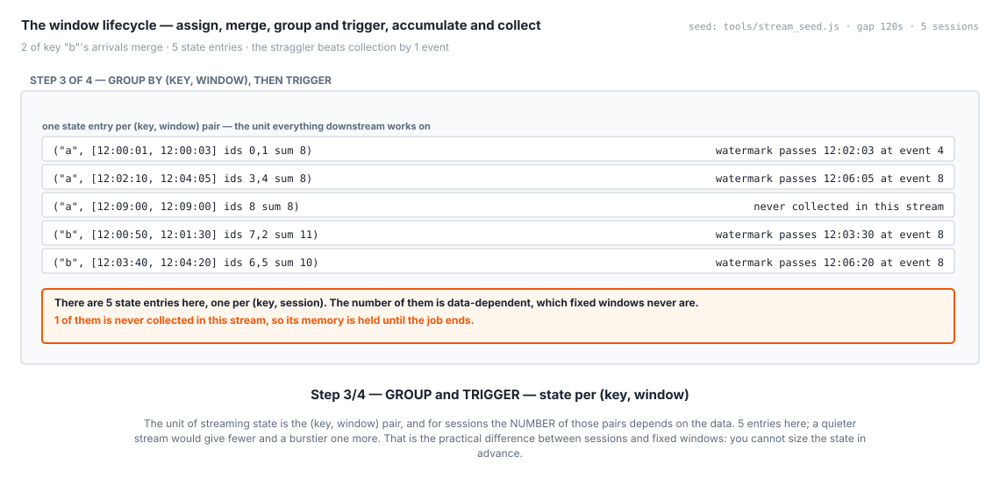

The unit of streaming state is the (key, window) pair, and for sessions the NUMBER of those pairs depends on the data. 5 entries here; a quieter stream would give fewer and a burstier one more. That is the practical difference between sessions and fixed windows: you cannot size the state in advance.

</details>
<details>
<summary><b>Step 4 of 4</b> — ACCUMULATE and GARBAGE-COLLECT — on the watermark</summary>

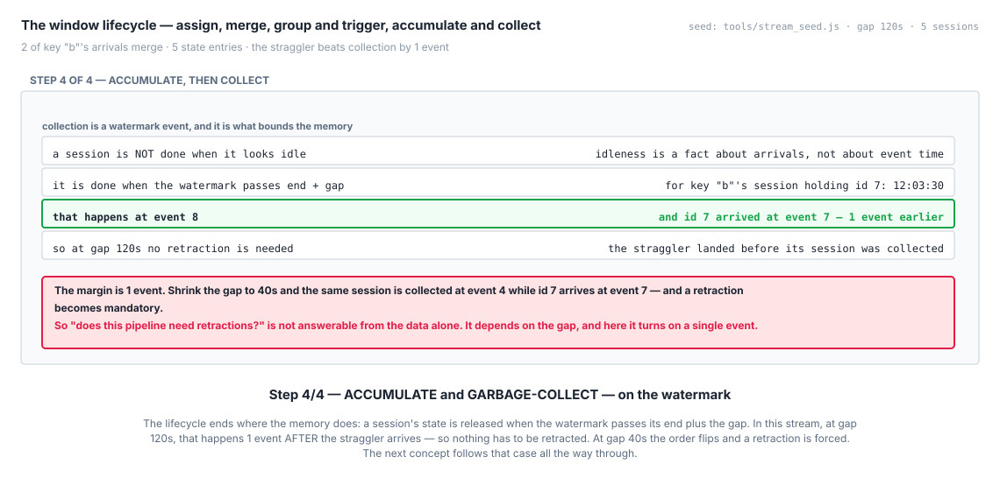

The lifecycle ends where the memory does: a session's state is released when the watermark passes its end plus the gap. In this stream, at gap 120s, that happens 1 event AFTER the straggler arrives — so nothing has to be retracted. At gap 40s the order flips and a retraction is forced. The next concept follows that case all the way through.

</details>

<sub>The merges, the state-entry count and the 1-event collection margin are computed from the seed and asserted. Generated by `node tools/gen_ch04.js`.</sub>

<!-- ch04-lifecycle:end -->

<!-- ch04-lifecycle-memory:begin — generated by tools/gen_ch04.js; do not hand-edit -->

#### The lifecycle — stack and heap at every step

**What is being answered.** The four lifecycle steps, as four functions over the same key's arrivals.

The line to look at first is inside `sessionsUpto`: `if (last != NONE && e.et - last.end <= gap)`. It performs **assign and merge at once** — the event joins the session and the session's bound moves in the same statement. That is why sessions have a merge step and the other shapes do not.

`needsRetraction(key, gap)` then reduces the whole retraction question to one comparison: was the session collected at an index below the arrival index of one of its own members? At gap 120 that is 8 < 7 — false. At gap 40 it is 4 < 7 — true.

The animation steps through the code, holding each line long enough to read the STACK (call frames and their locals) and the HEAP (allocated arrays and objects) as they are AT THAT MOMENT. Expand any step to study it on its own.



<details>
<summary><b>Step 1 of 4</b> — ASSIGN and MERGE are the same line, read twice</summary>


This one line does both jobs: if the arriving event is within `gap` of `last.end`, it is ASSIGNED to that session and the session is simultaneously MERGED — `last.end` moves. For id 6 (et 220) the session's bound changes, which is a window boundary moving after the window existed.

</details>
<details>
<summary><b>Step 2 of 4</b> — so 2 out-of-order arrivals each absorb a session</summary>

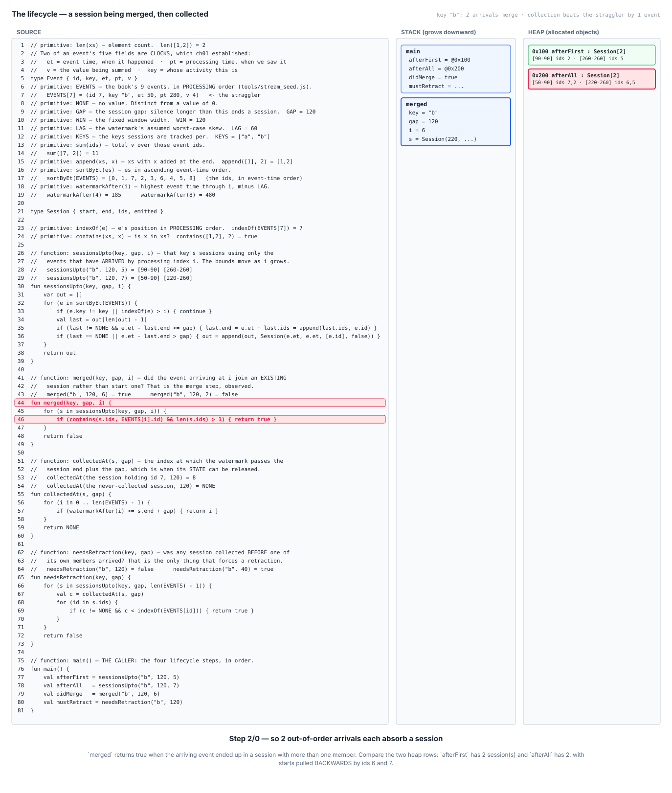

`merged` returns true when the arriving event ended up in a session with more than one member. Compare the two heap rows: `afterFirst` has 2 session(s) and `afterAll` has 2, with starts pulled BACKWARDS by ids 6 and 7.

</details>
<details>
<summary><b>Step 3 of 4</b> — collection is a watermark comparison, not an idle timer</summary>

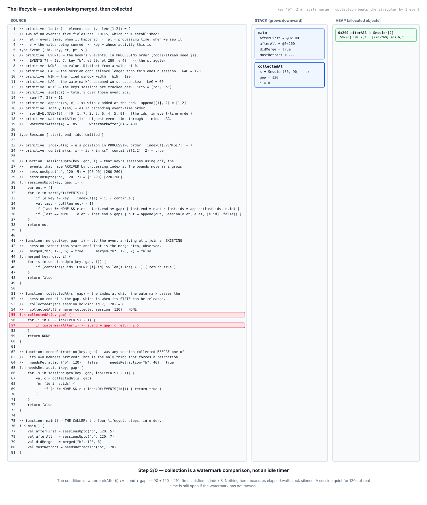

The condition is `watermarkAfter(i) >= s.end + gap` — 90 + 120 = 210, first satisfied at index 8. Nothing here measures elapsed wall-clock silence. A session quiet for 120s of real time is still open if the watermark has not moved.

</details>
<details>
<summary><b>Step 4 of 4</b> — and whether a retraction is needed turns on ONE comparison</summary>

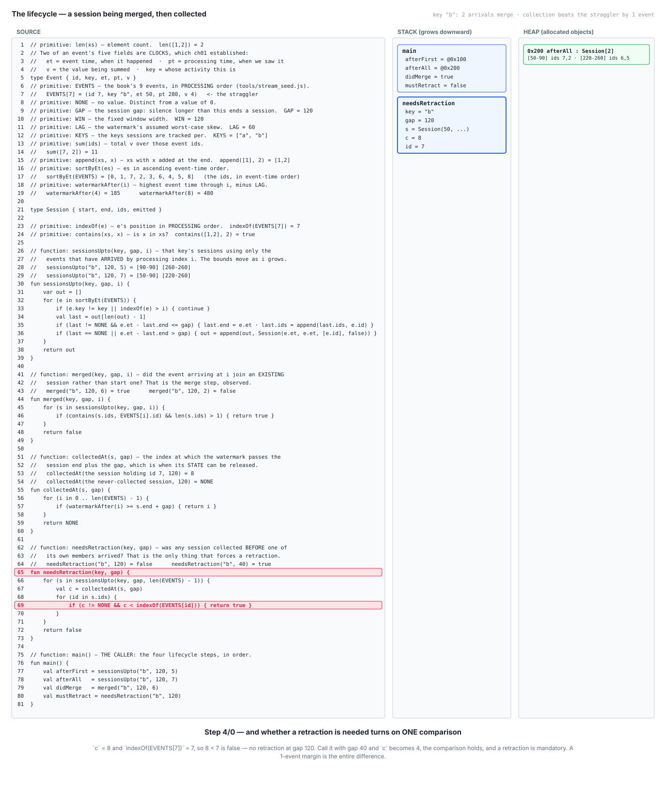

`c` = 8 and `indexOf(EVENTS[7])` = 7, so 8 < 7 is false — no retraction at gap 120. Call it with gap 40 and `c` becomes 4, the comparison holds, and a retraction is mandatory. A 1-event margin is the entire difference.

</details>

<sub>The merge trace, the collection index and both retraction verdicts are computed from the seed and asserted. Generated by `node tools/gen_ch04.js` on `tools/memkit.js`.</sub>

<!-- ch04-lifecycle-memory:end -->

### Session semantics and pitfalls

> **Why this matters:** Sessions are powerful but subtle — their boundaries change as data arrives, so this section covers what the lifecycle implies and where implementations get it wrong.

1. **A session can merge late** — A late event can bridge two sessions that were already emitted separately. **The pipeline must retract the two earlier panes and emit the merged one** — this is why accumulation mode matters.

2. **Sessions are garbage-collected by watermark** — A session is not done when it looks idle; it is done when the **watermark passes the session end plus allowed lateness**. Until then, a late event can revive it.

3. **Session windows are keyed** — Sessions are per key — **user A's session and user B's session never merge** because they are in different key groups. The gap is measured within a key.

4. **Choose the window to match the question** — Fixed windows for periodic aggregates, sliding windows for moving averages, sessions for user behavior. **The window shape is part of the answer, not an implementation detail.**

<!-- ch04-semantics:begin — generated by tools/gen_ch04.js; do not hand-edit -->

#### Why a session is the one window whose published result can stop existing

**At gap 40s, this stream forces a retraction.** Follow key "b": the session [12:01:30, 12:01:30] ids 2 sum 7 is emitted at event 4, because the watermark has passed its end plus the gap. Then id 7 (et 12:00:50) arrives at event 7 and it belongs to that session. The session is now [12:00:50, 12:01:30] ids 7,2 sum 11.

So the pipeline must **retract 7 and emit 11**. Without the retraction a consumer that adds panes reads 18 for a session worth 11.

This is ch02's accumulation question arriving with no choice attached. For a fixed window the old pane was *stale*; for a session the old pane described a **window that no longer exists** — different bounds, different identity.

**Sessions are collected by the watermark, not by looking idle.** A session silent for 120s of wall clock may still grow; only the watermark passing end + gap rules it out. And 1 session here is **never collected**, because the watermark never reaches 12:11:00.

**Sessions are per key, and this stream has a near miss that proves it.** Key "b"'s first session ends at 12:01:30 and its second starts at 12:03:40 — a silence of 130s, more than the gap. id 3 has event time 12:02:10, only **40s after key "b" went quiet** and well inside the 120s gap. It does not join, because it belongs to key "a" and the gap is measured within a key.

Drop the keying and the 5 keyed sessions collapse to **2**: users' activity fills in each other's silences and produces one fictional visit.

#### When retraction is unavoidable, and how to choose the shape

**Retraction is unavoidable the moment a session can be collected before its last member arrives,** and that is a function of the gap, not of your data. A smaller gap means earlier collection, so tightening the gap to get cleaner "visits" silently turns on a requirement that the downstream store accept deletions.

**So check the store first.** A session retraction **deletes one row and inserts another**, because the bounds are the identity — a store keyed by (key, session start) cannot express it as an update. An append-only analytics store is incompatible with session windows, and that is cheaper to learn here than in production.

**Match the shape to the question:** fixed for periodic aggregates (4 answers totalling 45), sliding for moving averages (2× output), sessions for behaviour. And note the question "how many visits did this user have?" has 4 different correct answers here (4, 3, 2, 1) — it is not answerable until the gap is fixed.

**What this does not settle:** this stream's late event **extends** a session. A late event that **bridges** two already-emitted sessions would retract two panes and emit one — the same mechanism with twice the bookkeeping — and no event here does it, so nothing in this chapter demonstrates that case.

#### Visual walkthrough — the retraction, the collection, and the near miss

The animation loops through all 4 steps. Expand any step to study it on its own.



<details>
<summary><b>Step 1 of 4</b> — at gap 40s, a late event forces a RETRACTION</summary>


A session is the one windowing where the published thing can stop existing. At gap 40s the session [12:01:30, 12:01:30] ids 2 sum 7 is emitted at event 4; then id 7 arrives and it becomes [12:00:50, 12:01:30] ids 7,2 sum 11 — a different window, with different bounds. The old pane is not stale, it is about something that is no longer there.

</details>
<details>
<summary><b>Step 2 of 4</b> — sessions are collected by the WATERMARK, not by looking idle</summary>

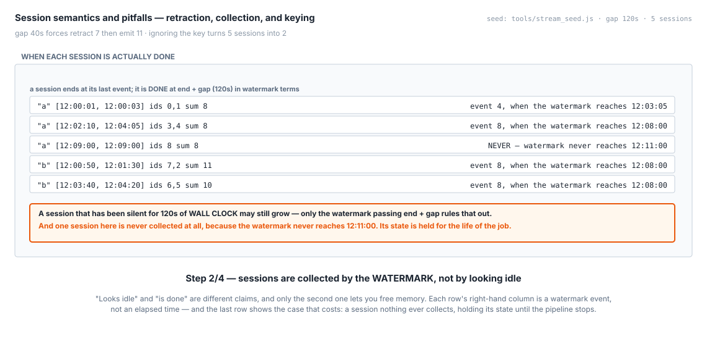

"Looks idle" and "is done" are different claims, and only the second one lets you free memory. Each row's right-hand column is a watermark event, not an elapsed time — and the last row shows the case that costs: a session nothing ever collects, holding its state until the pipeline stops.

</details>
<details>
<summary><b>Step 3 of 4</b> — sessions are per KEY — and the near miss proves it</summary>

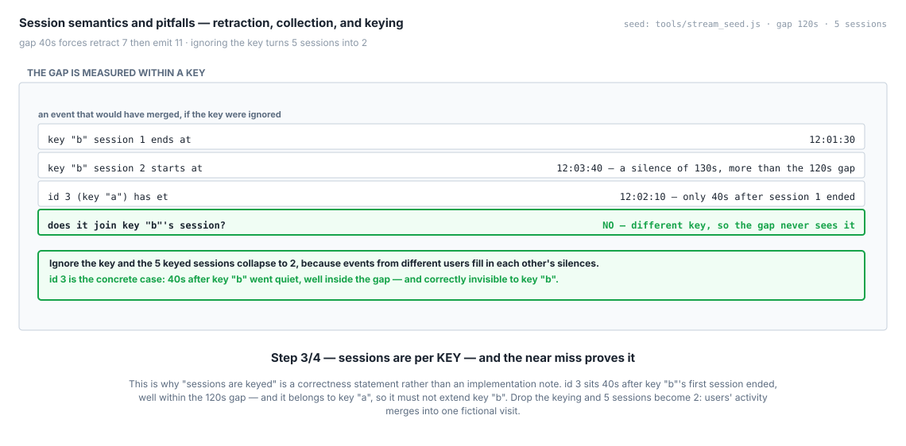

This is why "sessions are keyed" is a correctness statement rather than an implementation note. id 3 sits 40s after key "b"'s first session ended, well within the 120s gap — and it belongs to key "a", so it must not extend key "b". Drop the keying and 5 sessions become 2: users' activity merges into one fictional visit.

</details>
<details>
<summary><b>Step 4 of 4</b> — so the window shape IS part of the answer</summary>

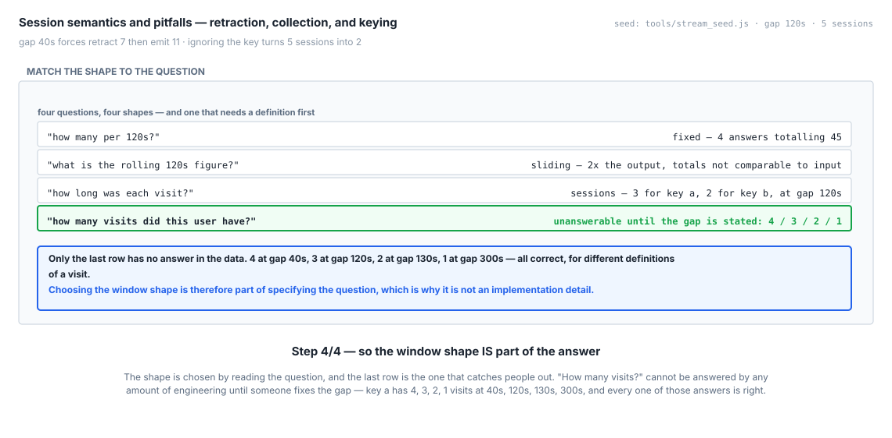

The shape is chosen by reading the question, and the last row is the one that catches people out. "How many visits?" cannot be answered by any amount of engineering until someone fixes the gap — key a has 4, 3, 2, 1 visits at 40s, 120s, 130s, 300s, and every one of those answers is right.

</details>

<sub>The retraction at gap 40s, the never-collected session and the keyed-vs-unkeyed counts are computed from the seed and asserted. Generated by `node tools/gen_ch04.js`.</sub>

<!-- ch04-semantics:end -->

<!-- ch04-semantics-memory:begin — generated by tools/gen_ch04.js; do not hand-edit -->

#### Session semantics — stack and heap at every step

**What is being answered.** Why a session retraction is harder than a fixed window's, and why keying is a correctness property — as panes a consumer actually receives.

In `emitPanes`, look at the two `Pane` constructors in step 2. The retraction carries `s` (the **old** bounds) and the late pane carries `finalS` (**different** bounds). A fixed window's correction names one window twice; a session's names two different windows, so a store keyed by session bounds must delete a row and insert another.

`storeTotal(panes, acceptsRetraction)` then prices the mistake: 11 against 18, and the error is exactly the retracted value. And `sessionsIgnoringKey` is the same loop with the key guard removed — 5 sessions become 2.

The animation steps through the code, holding each line long enough to read the STACK (call frames and their locals) and the HEAP (allocated arrays and objects) as they are AT THAT MOMENT. Expand any step to study it on its own.



<details>
<summary><b>Step 1 of 4</b> — the session is emitted, and it is not final</summary>


At index 4 the watermark has passed 90 + 40, so the session [12:01:30, 12:01:30] ids 2 is published with value 7. Everything here is correct. The problem is that id 7 has not arrived yet and belongs to this session.

</details>
<details>
<summary><b>Step 2 of 4</b> — so the pane must be UN-SAID, by its old bounds</summary>

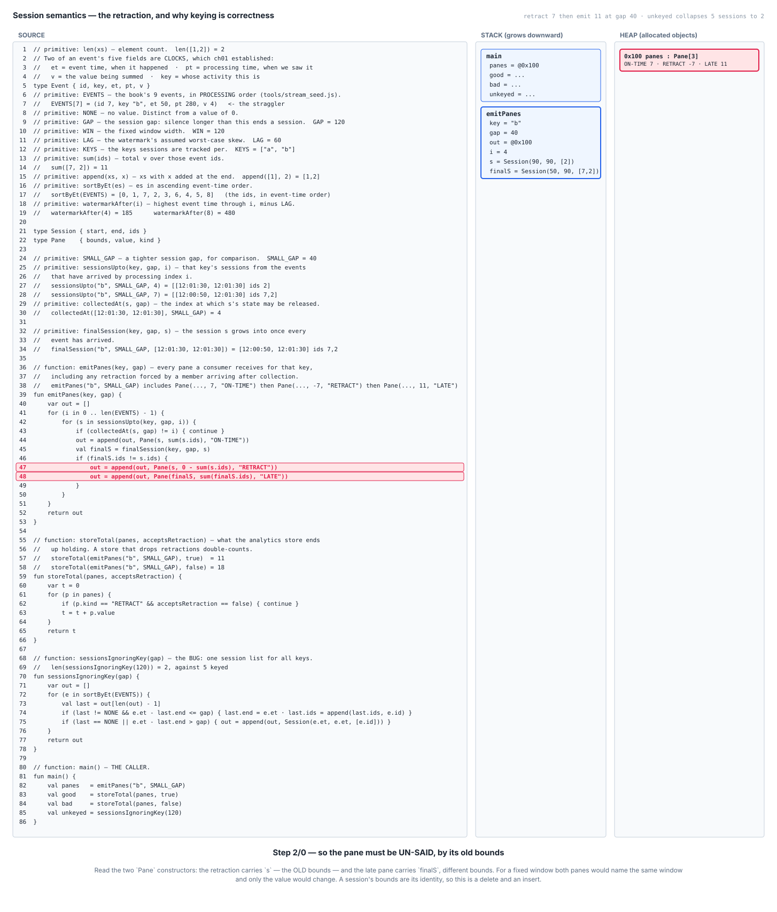

Read the two `Pane` constructors: the retraction carries `s` — the OLD bounds — and the late pane carries `finalS`, different bounds. For a fixed window both panes would name the same window and only the value would change. A session's bounds are its identity, so this is a delete and an insert.

</details>
<details>
<summary><b>Step 3 of 4</b> — a store that drops retractions is wrong by the old value</summary>

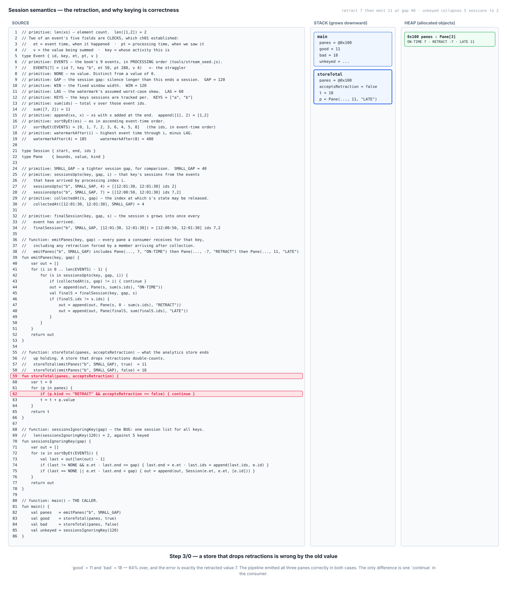

`good` = 11 and `bad` = 18 — 64% over, and the error is exactly the retracted value 7. The pipeline emitted all three panes correctly in both cases. The only difference is one `continue` in the consumer.

</details>
<details>
<summary><b>Step 4 of 4</b> — and ignoring the key collapses 5 sessions into 2</summary>

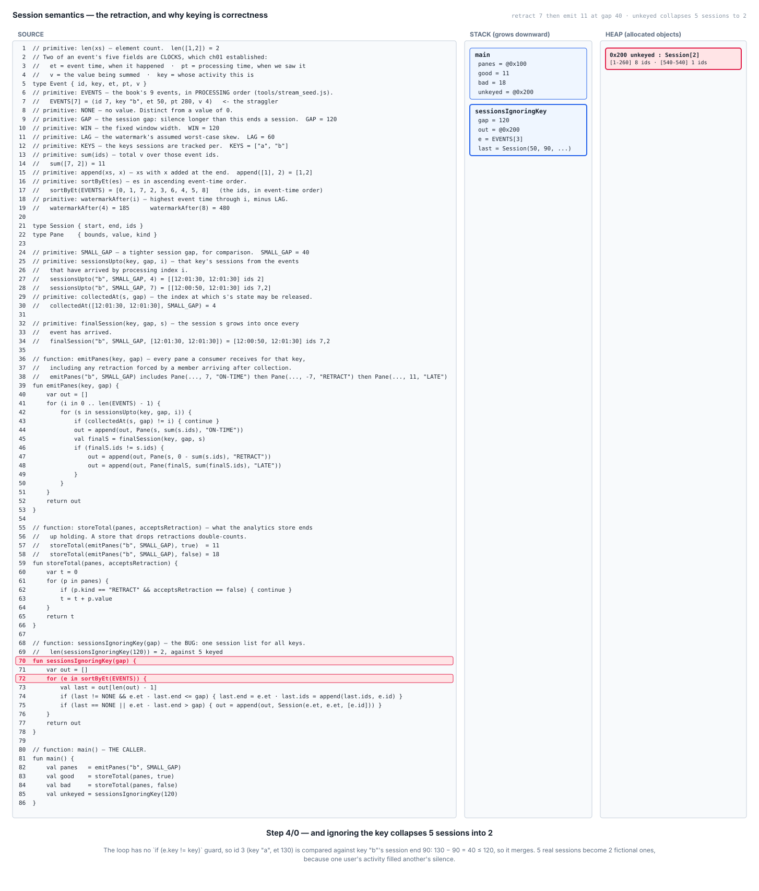

The loop has no `if (e.key != key)` guard, so id 3 (key "a", et 130) is compared against key "b"'s session end 90: 130 − 90 = 40 ≤ 120, so it merges. 5 real sessions become 2 fictional ones, because one user's activity filled another's silence.

</details>

<sub>The pane sequence, both store totals and the unkeyed collapse are computed from the seed and asserted. Generated by `node tools/gen_ch04.js` on `tools/memkit.js`.</sub>

<!-- ch04-semantics-memory:end -->

### Google Interview Question

> **Why this matters:** A standalone interview problem, with three other surfaces the same program wears. Nothing here depends on this chapter's vocabulary: the problem, the one reframe that solves it, and the traced solution are self-contained, and the section stops where the program stops. Generated by `tools/gen_ch04_interview.js` on `tools/interviewkit.js`.

<!-- ch04-interview-memory:begin — generated by tools/gen_ch04_interview.js; do not hand-edit -->

#### The problem

> **A door log gives one person's entry times.** A **visit** is a run of entries with no gap longer than `G`.
> 
> The times **arrive out of order**, and they **keep arriving**. **Report the visits after each arrival.**
> 
> 10⁶ entries.

> `[1, 3, 90, 130, 245, 260, 220, 50, 540]` with G = 47 → 1..130  220..260  540..540. Arrival 50 turns 1..3 and 90..130 into a single visit.

> Times are integers. A visit already reported may turn out to be wrong.

#### How to model it

Sorted, this is easy: walk the times and each one either extends the current run or starts a new one. The question removes that — the times arrive **out of order** and **keep arriving**, so there is no moment at which sorting is possible.

So keep the **runs**, not the times, and the question becomes what one new time does to them. It joins any run whose start is within `G` after it or whose end is within `G` before it — two comparisons per run, against the ends rather than the members.

And here is the case the out-of-order clause exists for: a time can touch **more than one** run, because it lands in the gap that was keeping them apart. So they all become one: take the smallest start and the largest end over every touched run plus the new time, and the same two lines handle one, two or ten. An implementation that stops at the first match widens one run and leaves the other, producing two runs that claim overlapping time — plausible output, wrong totals.

Two consequences that the algorithm cannot fix, and they are what the question is really for.

**Runs you already reported stop existing.** The merge above does not extend a run, it **replaces two**. Nothing can un-send a report, so the output cannot be a stream of appends — a consumer must be able to revise. And the obvious revision key does not work either: a run can acquire an **earlier start** when a time arrives before it, so "the run beginning at 245" is not a name that survives. Identity has to be minted when a run is created and carried through every merge.

**State grows and nothing above shrinks it.** Every open run stays in memory waiting for a time that may never come. A real answer needs a point at which a run is declared finished and dropped, which is a decision about how late a time may be — not an algorithm, and the thing that decides whether this runs for a year.

#### The same problem, asked 3 other ways

Each of these is the program below with different nouns. The reason to read them is not the
answer — it is the *recognition*. 4 surfaces (access logs, scheduling, puzzles, operations), one shape, and in every
case the appealing first answer is to materialise a sequence you cannot afford.

<details>
<summary><b>Variation 2</b> — the calendar that will not double-book <i>(looks like scheduling)</i></summary>

> Meetings are booked and cancelled continuously. **Reject any booking that overlaps an existing one**, and report the free gaps.

**Why it is not obvious.** Insertion is the same shape with the gap set to zero, and the new operation is the hard one: **cancellation splits a run**, which nothing above can do. Merging is easy because the merged run is determined by its ends; splitting is not, because once two bookings have been merged into one span the information needed to separate them is gone. So the state cannot be the merged runs at all — it has to be the individual bookings, with the merge computed on read. Recognising that the chapter's state shape is only valid for an append-only stream is the whole answer.

**Where it lands.** `touching` with G = 0 for the overlap test, and `absorb` kept — but the stored state changes from runs to members, which is a different program with the same lookup.

</details>
<details>
<summary><b>Variation 3</b> — the island count <i>(looks like puzzles)</i></summary>

> Positions on a line are turned on one at a time, in any order. **After each one, report how many contiguous stretches are on.**

**Why it is not obvious.** It is this problem with G = 1 and only a count wanted, and dropping the detail makes a much better answer available: a new position can join at most **two** stretches, so the count changes by exactly +1, 0 or −1 and nothing has to be searched. The non-obvious part is that this is reachable with no interval structure at all — a map from each stretch's endpoints to its length, consulted at the two neighbours, which is O(1) per position against the chapter's O(log runs). Noticing that the question asked only for a count is where the saving comes from.

**Where it lands.** `touching` reduced to checking the two adjacent positions, and `absorb` to arithmetic on a count. The 2-run merge in the trace is the −1 case.

</details>
<details>
<summary><b>Variation 4</b> — the deduplicated alert <i>(looks like operations)</i></summary>

> A monitor fires repeatedly while a system is unhealthy. **Group the firings into incidents** — no gap longer than `G` — and page once per incident.

**Why it is not obvious.** The grouping is identical and the paging is what breaks: you must page while the incident is open, which means acting on a run **before** you know it is finished, and then a later firing within `G` must not page again. So the retraction problem from the trace becomes a paging problem — if two incidents merge, somebody was paged twice for what turned out to be one. The useful answer is that `G` is now two decisions, not one: how long to wait before paging, and how long before declaring the incident over, and they need not be the same number.

**Where it lands.** `absorb` unchanged, with the withdrawal in the traced frames reinterpreted as a page that should not have been sent — which is why the stable-identity point matters here most.

</details>

#### The solution as a running program — stack and heap at every step

The reframe above is six paragraphs; this is the batch answer and then the same thing built one arrival at a time, with the two things a whiteboard cannot show — **what is allocated, and when**.

Measured on [1, 3, 90, 130, 245, 260, 220, 50, 540] with G = 47: the sorted sweep gives 1..130  220..260  540..540, and 9 arrivals processed in order give 1..130  220..260  540..540 — asserted equal. Along the way one arrival **starts** a run, one **extends** one, and arrival 50 **joins 2** of them into 1..130. 6 runs that were already reported stop existing, and one run later acquires an earlier start — which is what rules out keying the output on it.

The animation steps through the code, holding each line long enough to read the STACK (call frames and their locals) and the HEAP (allocated arrays and objects) as they are AT THAT MOMENT. Expand any step to study it on its own.



<details>
<summary><b>Step 1 of 12</b> — 9 times, out of order, and still arriving</summary>


0x100 holds [1, 3, 90, 130, 245, 260, 220, 50, 540] in the order they arrive; sorted they are [1, 3, 50, 90, 130, 220, 245, 260, 540]. Two facts from the question do all the work: the times are **out of order**, and they **keep arriving** — so any answer that needs all of them first is answering a different question.

</details>
<details>
<summary><b>Step 2 of 12</b> — the batch answer: sort, then walk</summary>

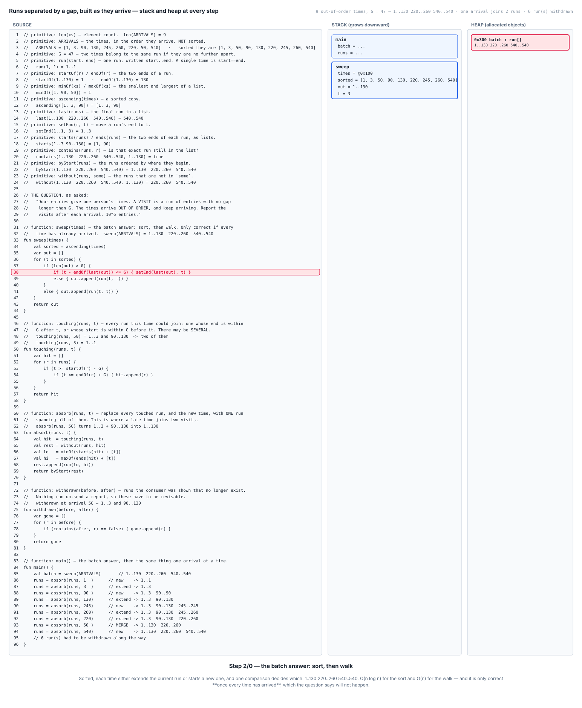

Sorted, each time either extends the current run or starts a new one, and one comparison decides which: 1..130  220..260  540..540. O(n log n) for the sort and O(n) for the walk — and it is only correct **once every time has arrived**, which the question says will not happen.

</details>
<details>
<summary><b>Step 3 of 12</b> — so: which runs does one new time touch?</summary>

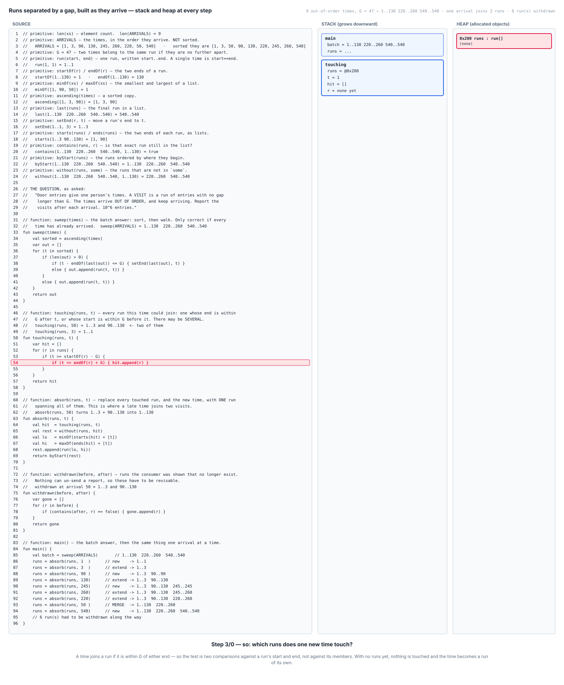

A time joins a run if it is within G of either end — so the test is two comparisons against a run's start and end, not against its members. With no runs yet, nothing is touched and the time becomes a run of its own.

</details>
<details>
<summary><b>Step 4 of 12</b> — arrival 90: new — a second run</summary>

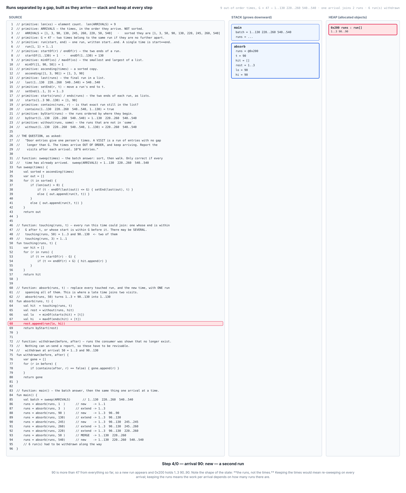

90 is more than 47 from everything so far, so a new run appears and 0x200 holds 1..3  90..90. Note the shape of the state: **the runs, not the times.** Keeping the times would mean re-sweeping on every arrival; keeping the runs means the work per arrival depends on how many runs there are.

</details>
<details>
<summary><b>Step 5 of 12</b> — arrival 3: extends one run</summary>

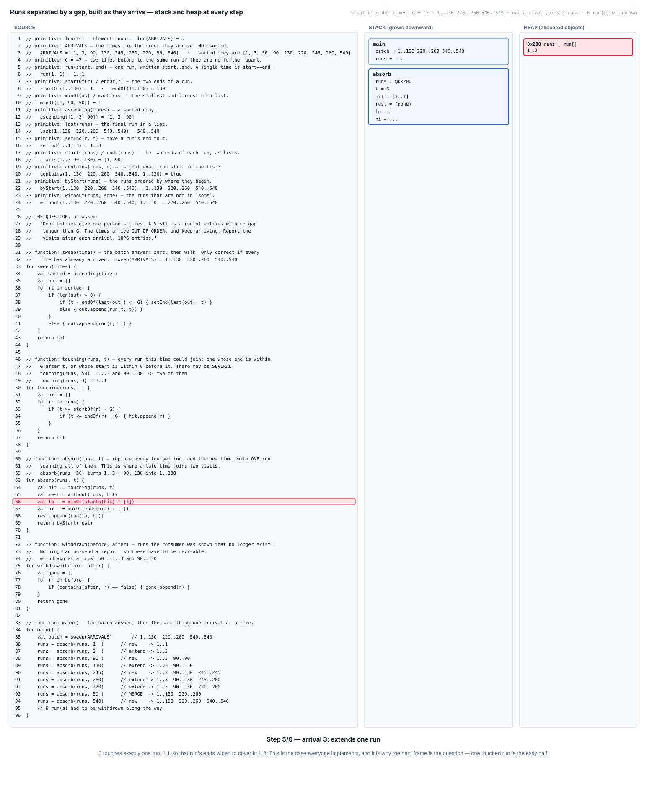

3 touches exactly one run, 1..1, so that run's ends widen to cover it: 1..3. This is the case everyone implements, and it is why the next frame is the question — one touched run is the easy half.

</details>
<details>
<summary><b>Step 6 of 12</b> — arrival 50 touches 2 runs</summary>

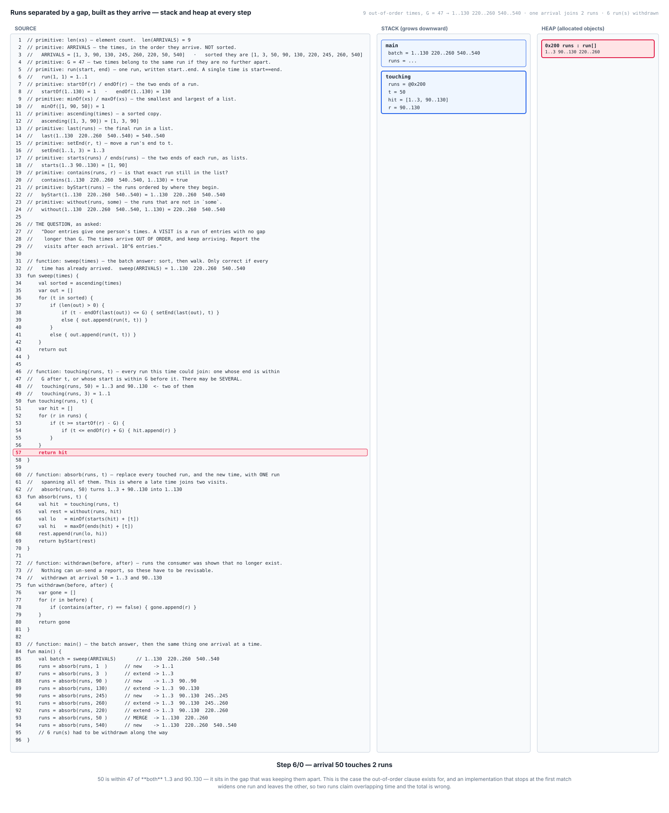

50 is within 47 of **both** 1..3 and 90..130 — it sits in the gap that was keeping them apart. This is the case the out-of-order clause exists for, and an implementation that stops at the first match widens one run and leaves the other, so two runs claim overlapping time and the total is wrong.

</details>
<details>
<summary><b>Step 7 of 12</b> — so all 2 become ONE</summary>

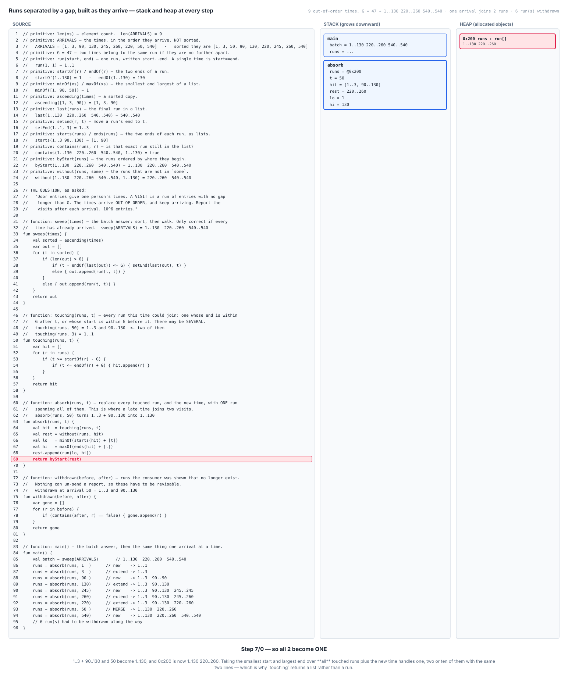

1..3 + 90..130 and 50 become 1..130, and 0x200 is now 1..130  220..260. Taking the smallest start and largest end over **all** touched runs plus the new time handles one, two or ten of them with the same two lines — which is why `touching` returns a list rather than a run.

</details>
<details>
<summary><b>Step 8 of 12</b> — but 2 runs the consumer was shown no longer exist</summary>

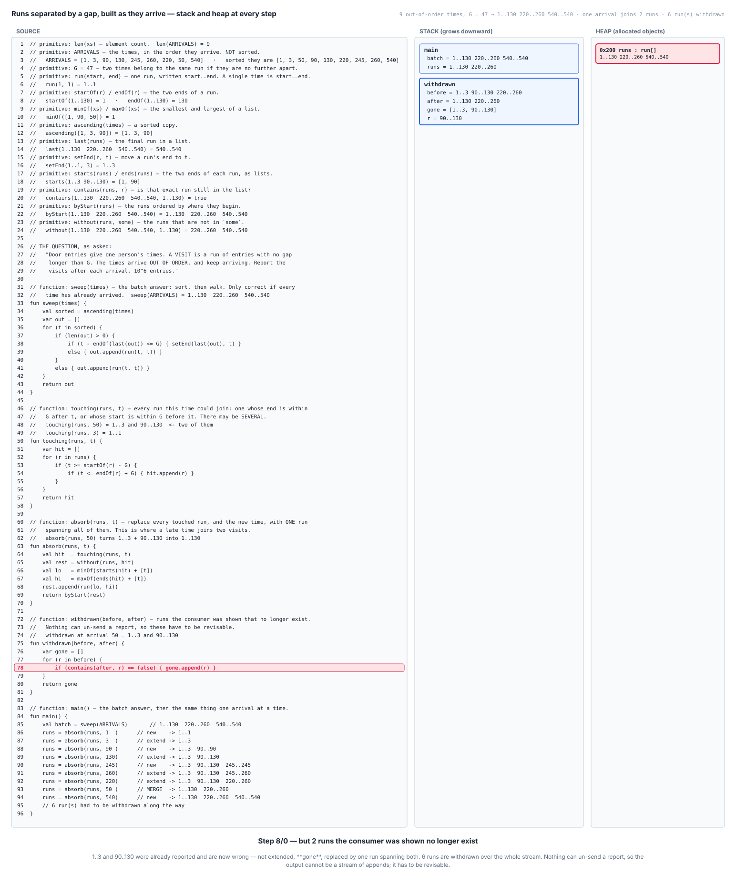

1..3 and 90..130 were already reported and are now wrong — not extended, **gone**, replaced by one run spanning both. 6 runs are withdrawn over the whole stream. Nothing can un-send a report, so the output cannot be a stream of appends; it has to be revisable.

</details>
<details>
<summary><b>Step 9 of 12</b> — and the start is not a stable key</summary>

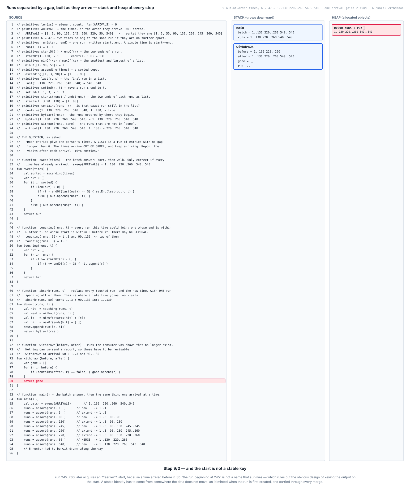

Run 245..260 later acquires an **earlier** start, because a time arrived before it. So "the run beginning at 245" is not a name that survives — which rules out the obvious design of keying the output on the start. A stable identity has to come from somewhere the data does not move: an id minted when the run is first created, and carried through every merge.

</details>
<details>
<summary><b>Step 10 of 12</b> — the incremental answer matches the batch one</summary>

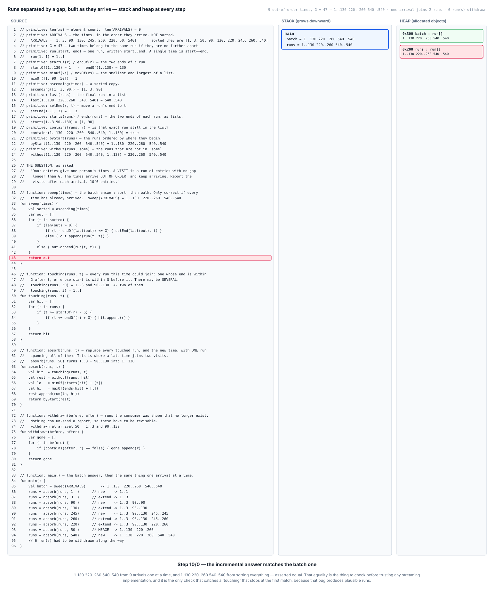

1..130  220..260  540..540 from 9 arrivals one at a time, and 1..130  220..260  540..540 from sorting everything — asserted equal. That equality is the thing to check before trusting any streaming implementation, and it is the only check that catches a `touching` that stops at the first match, because that bug produces plausible runs.

</details>
<details>
<summary><b>Step 11 of 12</b> — what each arrival costs</summary>

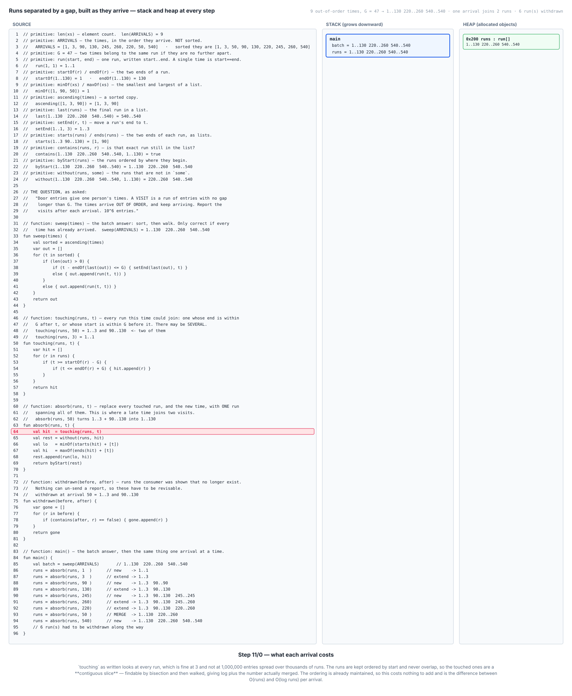

`touching` as written looks at every run, which is fine at 3 and not at 1,000,000 entries spread over thousands of runs. The runs are kept ordered by start and never overlap, so the touched ones are a **contiguous slice** — findable by bisection and then walked, giving log plus the number actually merged. The ordering is already maintained, so this costs nothing to add and is the difference between O(runs) and O(log runs) per arrival.

</details>
<details>
<summary><b>Step 12 of 12</b> — and the question nobody asked</summary>

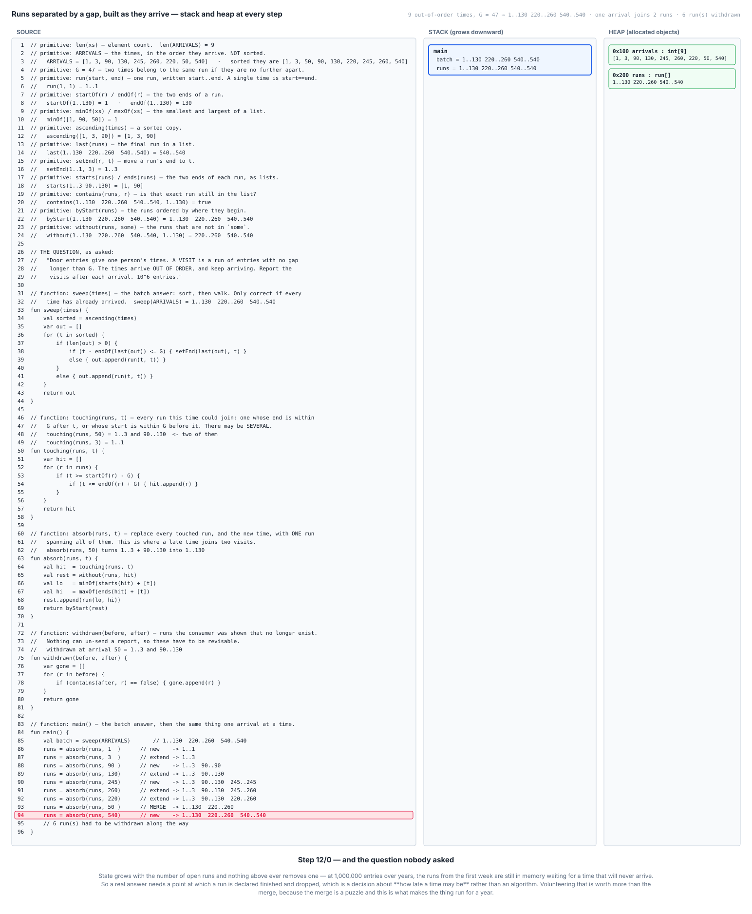

State grows with the number of open runs and nothing above ever removes one — at 1,000,000 entries over years, the runs from the first week are still in memory waiting for a time that will never arrive. So a real answer needs a point at which a run is declared finished and dropped, which is a decision about **how late a time may be** rather than an algorithm. Volunteering that is worth more than the merge, because the merge is a puzzle and this is what makes the thing run for a year.

</details>

<sub>Locals live in the frame and vanish when it is popped; 0x200 holds the **runs** rather than the times, which is what makes the work per arrival depend on the number of runs instead of the number of entries. G is a declared parameter of this problem rather than the chapter's, and the source says why: at the chapter's gap nothing in this dataset joins two runs, and that case is the whole section. Every figure is derived from `tools/stream_seed.js` and asserted — including that the arrivals are genuinely out of order, that one arrival joins two or more runs, that another merely extends one, that at least two start new ones, that the incremental answer equals the sorted sweep, that something really is withdrawn, and that some run really does acquire an earlier start. Generated by `node tools/gen_ch04_interview.js` on `tools/interviewkit.js`.</sub>

<!-- ch04-interview-memory:end -->


## Links & The Bigger Picture

Concepts this chapter mentions but does not fully unpack are linked below — each pointer names the chapter where the concept is covered in depth and gives a concrete example that ties the two chapters together.

- **[Chapter 2: The What, Where, When, and How of Data Processing → What and Where — transformations and windowing](ch02-the-what-where-when-and-how-of-data-processing.md#what-and-where--transformations-and-windowing)** — the window is the "where" axis of the four-question model; ch02 fixes that axis against the other three (what/when/how).
  - _Example:_ ch04's fixed vs sliding vs session shapes are the "where" choice; ch02 shows the same click 12:04:00 answering 1 fixed, 3 sliding, or 1 session result, with the trigger deciding when each emits.
- **[Chapter 3: Watermarks → Propagation and correctness](ch03-watermarks.md#propagation-and-correctness)** — a window's lifecycle ends with garbage collection, and the watermark is what decides when a window is done — ch03 defines the signal that drives it.
  - _Example:_ ch04's "session done when watermark passes end + lateness" is ch03's watermark 12:06:30 closing [12:00,12:05); the skew formula (max_seen 12:08:30 − 120 s) is what produced that watermark.
- **[Chapter 8: Streaming SQL → Windows in SQL](ch08-streaming-sql.md#windows-in-sql)** — TUMBLE/HOP/SESSION are the SQL spellings of this chapter's fixed/sliding/session shapes, with the watermark driving emission.
  - _Example:_ ch04's session [12:00,12:50) after a 12:20:00 bridge event is what Flink SQL's SESSION(gap) computes; ch04's sliding 10-min/2-min is ch08's HOP(10 min, 2 min).
- **[Chapter 7: The Practicalities of Persistent State → Checkpoints and state stores](ch07-the-practicalities-of-persistent-state.md#checkpoints-and-state-stores)** — window state is exactly the state that a stateful processor must persist; ch07 covers how that per-window state is snapshotted and recovered.
  - _Example:_ ch04's per-window counts and session sets live in keyed state; ch07 shows that same state as { 42: 13 } being checkpointed with its offset so a restart resumes without recomputing the windows.

## System Design Interview

> **The question:** Design session-window analytics for user activity. Premise: a late event can bridge two already-emitted sessions, so the pipeline must retract the two stale panes and emit the merged session instead of double-counting.

**The pipeline:** event source -> window assigner -> session merger -> keyed session state -> trigger/retraction emitter -> analytics store

<a href="../diagrams/d2/decomp/ch04-0.png"></a>

### event source

_Role: event source — emits events with event time and a key_

- a click {user: 42, event_time: "12:20:00"} arrives
- the key is user 42, so sessions are per-user
- a late event may arrive with event_time earlier than the watermark

### window assigner

_Role: window assigner — assigns events to session windows_

- the event is assigned to a new or existing session for user 42
- the gap threshold is 30 min of inactivity
- sessions are data-driven, not clock-aligned

### session merger

_Role: session merger — merges sessions that a bridging event connects_

- s1 [12:00,12:10) and s2 [12:40,12:50) both sit within 30 min of the event
- the merger collapses them into sMerged [12:00, 12:50)
- the merged count folds s1 + s2 + the bridging event

### trigger/retraction emitter

_Role: trigger/retraction emitter — emits and corrects panes_

- the on-time trigger fires when the watermark passes a session end
- a late merge retracts the two earlier panes
- the merged pane is emitted so the store shows one session, not three


<!-- ch04-system:begin — generated by tools/gen_ch04.js; do not hand-edit -->

#### Why choosing session windows adds two components and a storage requirement

**The question.** Design session-window analytics for user activity. A late event can change a session that was already emitted, so the pipeline must retract the stale pane rather than double-count.

**The pipeline:** event source → window assigner → **session merger** → keyed session state → **trigger / retraction emitter** → analytics store.

Two of those six stages exist **only** because a session's bounds can change after the fact: the merger and the retraction emitter. So "we'll use session windows" is not a configuration change — it adds two components and places a hard requirement on the store.

**The requirement, stated precisely.** At gap 40s this stream produces: session [12:01:30, 12:01:30] ids 2 sum 7 emitted at event 4, so the store holds 7. Then id 7 arrives at event 7 and the session becomes [12:00:50, 12:01:30] ids 7,2 sum 11. The emitter must retract 7 **for the old bounds** and emit 11 for the new ones. A store that ignores the retraction reads 18 for a session worth 11.

Note what makes this harder than a fixed window's correction: the retraction names the **old bounds**. A fixed window's correction updates a row; a session's correction **deletes one row and inserts another**, because the bounds are the key.

**And the two settings are coupled.** Gap 120s gives key a 3 sessions and needs 0 retractions; gap 40s gives 4 sessions and needs 1. A smaller gap means more sessions **and** earlier collection, and earlier collection is what creates the retraction.

#### When this design is viable, and the four things it does not settle

**It is viable when the analytics store can delete a row.** That is the first thing to check, before any of the rest: a key-value store or a warehouse with upsert-and-delete is fine; an append-only event log or a billing ledger is not, and no amount of pipeline work fixes it.

**Choose the gap as a product definition, then accept its consequences.** It decides how many sessions exist AND whether retractions are required. Those are not independent knobs, and the second one reaches into the storage contract.

**Set allowed lateness against the memory, not against the skew.** It is how long a collected session can still be revived, so it is the price of being able to correct — paid in bytes per open (key, session) pair.

**What this design does NOT settle — four gaps:**

1. **Session state is data-dependent.** 5 entries for 9 events here, and nothing bounds it for a burstier stream or a larger key space. Fixed windows can be sized in advance; this cannot.
2. **One session is never collected**, because the watermark never reaches 12:11:00. Its state is held for the life of the job regardless of allowed lateness — a low-traffic key is a permanent allocation.
3. **The bridge case is not demonstrated.** This stream's late event extends a session; one that merged two already-published sessions would retract two panes and emit one. Same mechanism, twice the bookkeeping, and no number here proves it works.
4. **The gap is unverifiable.** Every session count in this chapter is correct for 120s and for no other definition, and nothing in the data can tell you whether 120s is the right definition of a visit.

#### Visual walkthrough — six stages, one retraction, two coupled settings

The animation loops through all 4 steps. Expand any step to study it on its own.



<details>
<summary><b>Step 1 of 4</b> — the pipeline, and the stage that only sessions need</summary>


Name what sessions cost before designing with them. The merger and the retraction emitter have no equivalent in a fixed-window pipeline, and the analytics store acquires a hard requirement: it must accept a retraction. A store that can only append is not compatible with session windows at all, and that is discovered late if it is not named here.

</details>
<details>
<summary><b>Step 2 of 4</b> — the retraction, with real values</summary>

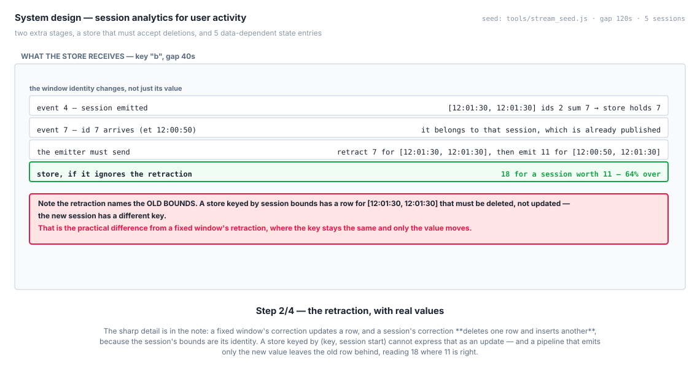

The sharp detail is in the note: a fixed window's correction updates a row, and a session's correction **deletes one row and inserts another**, because the session's bounds are its identity. A store keyed by (key, session start) cannot express that as an update — and a pipeline that emits only the new value leaves the old row behind, reading 18 where 11 is right.

</details>
<details>
<summary><b>Step 3 of 4</b> — the two settings that decide the whole design</summary>

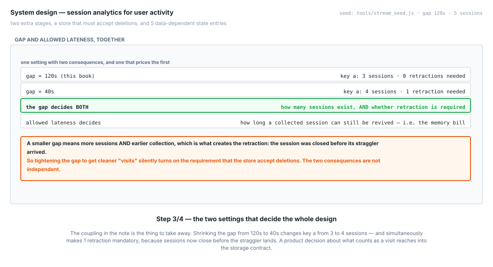

The coupling in the note is the thing to take away. Shrinking the gap from 120s to 40s changes key a from 3 to 4 sessions — and simultaneously makes 1 retraction mandatory, because sessions now close before the straggler lands. A product decision about what counts as a visit reaches into the storage contract.

</details>
<details>
<summary><b>Step 4 of 4</b> — and what this design does NOT settle</summary>

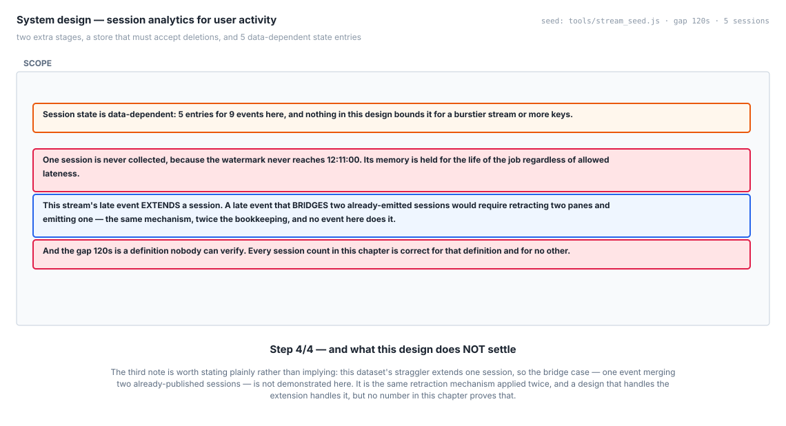

The third note is worth stating plainly rather than implying: this dataset's straggler extends one session, so the bridge case — one event merging two already-published sessions — is not demonstrated here. It is the same retraction mechanism applied twice, and a design that handles the extension handles it, but no number in this chapter proves that.

</details>

<sub>The retraction sequence, the 5 state entries and the never-collected session are computed from the seed and asserted. Generated by `node tools/gen_ch04.js`.</sub>

<!-- ch04-system:end -->

<!-- ch04-system-memory:begin — generated by tools/gen_ch04.js; do not hand-edit -->

#### Session analytics — stack and heap at every step

**What is being answered.** What choosing session windows actually requires of the analytics store, as a store you can watch fill.

`keyOf(s)` is the detail everything turns on: the row key is **("key", session start)**, so when a merge moves the start, the session needs a *different row*. A fixed window's correction is an update; this is an erase plus a write.

`run(key, gap, canErase)` is the pipeline, and the `canErase` flag is the store's capability. With it, one row holding 11; without it, two rows totalling 18 for a session worth 11 — and no error anywhere.

The animation steps through the code, holding each line long enough to read the STACK (call frames and their locals) and the HEAP (allocated arrays and objects) as they are AT THAT MOMENT. Expand any step to study it on its own.



<details>
<summary><b>Step 1 of 4</b> — the row key is the session's BOUNDS, which is the whole problem</summary>


`keyOf(s)` is ("b", 90) — the key includes the session's START. So when the start later moves to 50, the same session needs a DIFFERENT row. That is the structural difference from a fixed window, whose bounds never move.

</details>
<details>
<summary><b>Step 2 of 4</b> — so a correction is an ERASE plus a write</summary>

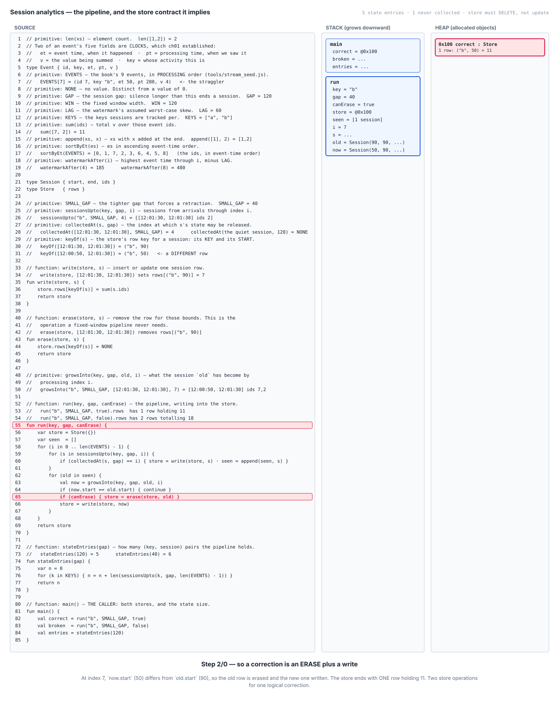

At index 7, `now.start` (50) differs from `old.start` (90), so the old row is erased and the new one written. The store ends with ONE row holding 11. Two store operations for one logical correction.

</details>
<details>
<summary><b>Step 3 of 4</b> — without the erase, the old row survives</summary>

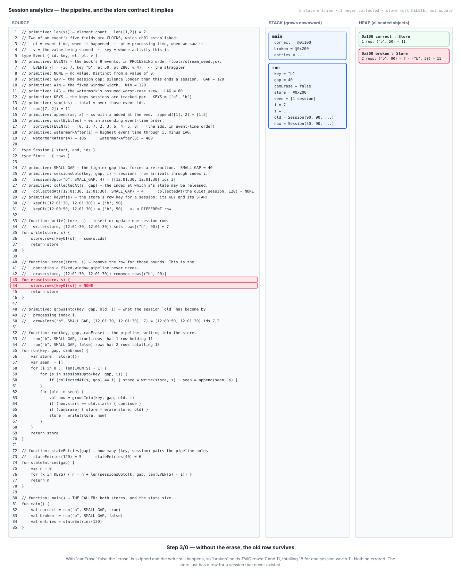

With `canErase` false the `erase` is skipped and the write still happens, so `broken` holds TWO rows: 7 and 11, totalling 18 for one session worth 11. Nothing errored. The store just has a row for a session that never existed.

</details>
<details>
<summary><b>Step 4 of 4</b> — and the state size is decided by the data, not the schema</summary>

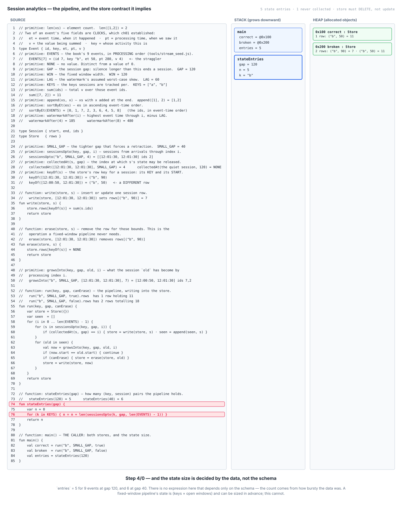

`entries` = 5 for 9 events at gap 120, and 6 at gap 40. There is no expression here that depends only on the schema — the count comes from how bursty the data was. A fixed-window pipeline's state is (keys × open windows) and can be sized in advance; this cannot.

</details>

<sub>Both store contents and the state-entry counts are computed from the seed and asserted. Generated by `node tools/gen_ch04.js` on `tools/memkit.js`.</sub>

<!-- ch04-system-memory:end -->

## Interview Questions

### Q1

An analytics pipeline reports 'sessions per user', but a user who pauses for 20 minutes and returns is counted as two sessions while a 10-minute pause is one — and late events can merge sessions that were already reported.

**Interviewer's question:** How do you model user sessions as windows, and what happens when a late event merges two already-reported sessions?

**Solution:** Use session windows with a gap threshold; when a late event bridges two already-emitted sessions, retract the two earlier panes and emit the merged one.

**System-design components:**
- Session window — gap-based dynamic window
- Gap threshold — inactivity bound
- Merge — collapse two sessions + the bridging event
- Retraction — cancel the earlier panes

```java
// s1 [12:00,12:10), s2 [12:40,12:50)
//   late event @ 12:20 -> bridges gap -> merge
//   retract s1 (3), retract s2 (2)
//   emit sMerged [12:00,12:50) count = 3+2+1 = 6
```

_This is exactly the session merging and retraction material in this chapter._

_Covers:_ 4. Session windows · 6. Session merging · 7. Late merges need retractions

_From the 28 problems:_ 21-ad-click-aggregation

### Q2

A dashboard needs both an hourly total and a rolling 10-minute average, but the team used one window type for both and the numbers look wrong.

**Interviewer's question:** Which window shapes should each metric use, and why?

**Solution:** The hourly total is a fixed window (equal, non-overlapping buckets); the rolling average is a sliding window (10-minute window advancing every minute).

**System-design components:**
- Fixed window — hourly total
- Sliding window — rolling 10-min average
- Window size + slide — defines the overlap

```java
// fixed   : event @ 12:04 belongs to [12:00,12:05) only
// sliding : event @ 12:04 belongs to [11:55,12:05), [11:56,12:06), ... [12:04,12:14)
//   -> count once vs count many
```

_This is exactly the fixed vs sliding window material in this chapter._

_Covers:_ 2. Fixed windows · 3. Sliding windows

_From the 28 problems:_ 20-metrics-monitoring

## Key Concepts

### The Problem

**1. One window shape does not fit all questions.** Fixed, sliding, and session windows are three shapes that answer three different kinds of questions.


### The Solution

Fixed windows partition time into equal, non-overlapping, contiguous spans; each event belongs to exactly one window.

```java
// s1 [12:00,12:10), s2 [12:40,12:50)
//   late event @ 12:20 -> bridges gap -> merge
//   retract s1 (3), retract s2 (2)
//   emit sMerged [12:00,12:50) count = 3+2+1 = 6
```


### Key Facts

| Fact | Detail | In the wild |
|---|---|---|
| 2. Fixed windows | Fixed windows partition time into equal, non-overlapping, contiguous spans; each event belongs to exactly one window. | A 5-minute tumbling window in Flink is a fixed window. |
| 3. Sliding windows | Sliding windows are fixed-length, overlapping spans defined by a window size and a slide. | A 10-minute window sliding every 2 minutes is the canonical rolling average. |
| 4. Session windows | A session is a burst of activity separated by a gap of inactivity; session boundaries are data-driven. | Web-analytics sessionization is the canonical session-window use case. |
| 5. The window lifecycle | Each element is assigned, session windows merge, elements group by (key, window), triggers emit, panes accumulate, and state is garbage-collected. | Beam's WindowFn, trigger, and accumulation mode map onto these stages. |
| 6. Session merging | When an event lands inside the gap of two sessions, the two sessions and the event merge into one window. | Beam's mergeWindows is the production form. |
| 7. Late merges need retractions | The pipeline must retract the two earlier panes and emit the merged one, or downstream double-counts. | Accumulating-and-retracting mode in Beam handles this. |
| 8. Sessions are keyed | Sessions are per key — user A's session never merges with user B's, because the gap is measured within a key group. | Grouping by user id before sessionizing is the production pattern. |


### Tradeoffs & When

- The pipeline must retract the two earlier panes and emit the merged one, or downstream double-counts.
- Sessions are per key — user A's session never merges with user B's, because the gap is measured within a key group.


### Real-World Examples

- **Google Analytics** — Sessionization of user visits with a 30-minute inactivity gap
- **Apache Beam** — Session windows with mergeWindows and accumulating-and-retracting for late merges
- **Apache Flink** — Event-time session windows with a gap and dynamic session merging
- **Flink SQL** — TUMBLE/HOP/SESSION constructs as the SQL spellings of the three window shapes


<details><summary>All concepts (index)</summary>

### Why: 1. One window shape does not fit all questions

**Why.** "How many per hour", "what is the rolling average", and "how long did a user stay" need different event-time boundaries.

**Claim.** Fixed, sliding, and session windows are three shapes that answer three different kinds of questions.

**Grounding.** The book builds the whole windowing model on these three shapes.

**In the wild.** Beam, Flink, and Dataflow all expose these three window types.

<a href="../diagrams/d2/card/ch04-0.png"></a>
### Shape: 2. Fixed windows

**Why.** Periodic, comparable aggregates need equal, non-overlapping time buckets.

**Claim.** Fixed windows partition time into equal, non-overlapping, contiguous spans; each event belongs to exactly one window.

**Grounding.** They answer "how many per hour".

**In the wild.** A 5-minute tumbling window in Flink is a fixed window.

<a href="../diagrams/d2/card/ch04-1.png"></a>
### Shape: 3. Sliding windows

**Why.** Moving averages need overlapping spans so a point in time contributes to several recent windows.

**Claim.** Sliding windows are fixed-length, overlapping spans defined by a window size and a slide.

**Grounding.** One event can belong to several sliding windows at once.

**In the wild.** A 10-minute window sliding every 2 minutes is the canonical rolling average.

<a href="../diagrams/d2/card/ch04-2.png"></a>
### Shape: 4. Session windows

**Why.** User behavior is bursty and its boundaries follow the data, not the clock.

**Claim.** A session is a burst of activity separated by a gap of inactivity; session boundaries are data-driven.

**Grounding.** A 30-minute gap splits one visit into two sessions.

**In the wild.** Web-analytics sessionization is the canonical session-window use case.

<a href="../diagrams/d2/card/ch04-3.png"></a>
### Lifecycle: 5. The window lifecycle

**Why.** Windowing is a pipeline of steps — assign, merge, group, trigger, accumulate, garbage-collect — not a single bucket lookup.

**Claim.** Each element is assigned, session windows merge, elements group by (key, window), triggers emit, panes accumulate, and state is garbage-collected.

**Grounding.** The lifecycle is the book's complete description of windowing.

**In the wild.** Beam's WindowFn, trigger, and accumulation mode map onto these stages.

<a href="../diagrams/d2/card/ch04-4.png"></a>
### Merge: 6. Session merging

**Why.** Sessions that were separate can turn out to be one session when a bridging event arrives.

**Claim.** When an event lands inside the gap of two sessions, the two sessions and the event merge into one window.

**Grounding.** The merge changes the window set, not just a count.

**In the wild.** Beam's mergeWindows is the production form.

<a href="../diagrams/d2/card/ch04-5.png"></a>
### Pitfall: 7. Late merges need retractions

**Why.** A late event can bridge two sessions already emitted separately, so the earlier panes are now wrong.

**Claim.** The pipeline must retract the two earlier panes and emit the merged one, or downstream double-counts.

**Grounding.** Retraction is the only way to correct an already-emitted result.

**In the wild.** Accumulating-and-retracting mode in Beam handles this.

<a href="../diagrams/d2/card/ch04-6.png"></a>
### Scope: 8. Sessions are keyed

**Why.** A gap must be measured within one entity, not across unrelated entities.

**Claim.** Sessions are per key — user A's session never merges with user B's, because the gap is measured within a key group.

**Grounding.** Keying is what makes session windows per-user rather than global.

**In the wild.** Grouping by user id before sessionizing is the production pattern.

<a href="../diagrams/d2/card/ch04-7.png"></a>

</details>


## Quiz

1. Which window shape is defined by the data rather than the clock?

   - A. Fixed
   - B. Sliding
   - C. Session
   - D. Global

<details><summary>Reveal answer</summary>

**C.** Session windows are dynamic — their boundaries follow bursts of activity and gaps.

</details>

2. What defines a sliding window?

   - A. A gap of inactivity
   - B. A window size and a slide
   - C. A single fixed span
   - D. A key

<details><summary>Reveal answer</summary>

**B.** Sliding windows are fixed-length, overlapping spans defined by size and slide.

</details>

3. When does a session window merge with another?

   - A. When the watermark passes
   - B. When an event lands inside the gap of both
   - C. When they share a key
   - D. When allowed lateness expires

<details><summary>Reveal answer</summary>

**B.** A bridging event inside the gap of two sessions merges them into one.

</details>

4. Why do late session merges need retractions?

   - A. To save memory
   - B. To cancel already-emitted panes and avoid double-counting
   - C. To speed up the pipeline
   - D. To reduce latency

<details><summary>Reveal answer</summary>

**B.** Earlier panes are now wrong, so they must be retracted before the merged pane is emitted.

</details>

5. Session windows are measured within a ___ .

   - A. partition
   - B. key group
   - C. global stream
   - D. time zone

<details><summary>Reveal answer</summary>

**B.** Sessions are per key — one user's session never merges with another's.

</details>

## Sources

- [Akidau et al. — "The Dataflow Model" (VLDB 2015)](https://www.vldb.org/pvldb/vol8/p1792-Akidau.pdf) — Session windows, merging, and the window lifecycle this chapter is built on
- [Apache Beam programming guide](https://beam.apache.org/documentation/programming-guide/) — The window assign/merge/group/trigger/accumulate lifecycle as an API
- [Apache Flink — Windows](https://nightlies.apache.org/flink/flink-docs-stable/docs/dev/datastream/operators/windows/) — Fixed, sliding, and session windows in a production engine
- [Apache Flink — Table API and SQL overview](https://nightlies.apache.org/flink/flink-docs-stable/docs/dev/table/overview/) — TUMBLE/HOP/SESSION as SQL window constructs

