# Chapter 5: Exactly-Once and Side Effects

> Exactly-once means every record affects the output exactly once, and it decomposes into two problems — replaying sources and shuffles without double-counting (solved with deduplication and idempotency) and external side effects (the genuinely hard part).

_Also known as: SS Ch05 · Exactly-Once · Idempotency · Deduplication · Side Effects · End-to-End Exactly-Once_

## Flow

### What exactly-once means

> **Why this matters:** "Exactly-once" is used loosely, so this section fixes the definition — it is about each record affecting the output exactly once, not about a magic guarantee that nothing is ever retried.

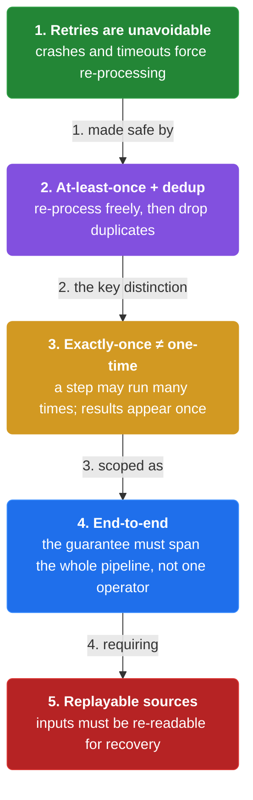

1. **Accuracy and completeness** — A correct pipeline is **accurate** (each result is right) and **complete** (every input contributes). Exactly-once means each record's contribution appears exactly once.

2. **Retries are the enemy of once** — In a distributed system, records are retried after crashes and timeouts. **Exactly-once is the property that a retried record does not count twice.**

3. **Two sub-problems** — Exactly-once splits into **deduplicating records as they move between stages** (sources and shuffles) and **making the final effect idempotent** (sinks and side effects).

4. **Exactly-once state vs exactly-once effects** — Making per-key state exactly-once is easy (recompute a deterministic value); making an **external side effect** exactly-once (send one email, charge one card) is the hard part.

```java
// SHUFFLE SIDE — a retried record is deduplicated so it does not double-count
// DEF: record — a keyed element {id: "r7", key: 42, value: 10}
// DEF: dedup — a store of record ids already delivered, holding seen = { r1, r2, r3 }
// DEF: seen — the set of delivered ids = { r1, r2, r3 }
// -> input : the shuffle delivers record {id: "r7", key: 42, value: 10}
//    step 1 · check the id -> seen has no r7 -> delivered : false -> true
//    step 2 · record the id -> seen : { r1, r2, r3 } -> { r1, r2, r3, r7 }
//    step 3 · the retry delivers the same record again -> seen has r7 -> dropped   BECAUSE the id was already recorded
// <- outcome : the downstream stage reads r7 exactly once   BECAUSE the second delivery was a duplicate
//    derivation : dedup makes 2 deliveries -> 1 effect, so the record contributes value 10 once, not 20
```

### Idempotency and deduplication

> **Why this matters:** Exactly-once is not a single mechanism — it is deduplication at the boundaries plus idempotency at the effects, so this section separates the two and shows where each applies.

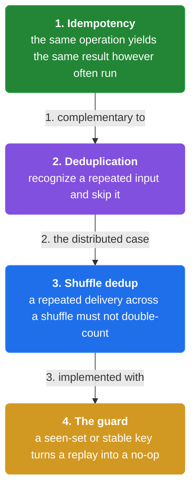

1. **Idempotent operations** — An operation is **idempotent** if performing it many times has the same effect as once. **Setting a value to 10 is idempotent; incrementing by 10 is not.**

2. **Deduplicate at the shuffle** — When a stage sends records to the next, the receiver can keep a set of **already-seen record ids** and drop duplicates. This is exactly-once delivery through the shuffle.

3. **Sources need replayable, deduplicable records** — A source that can be **replayed from a checkpoint** (a Kafka offset, a file offset) and whose records carry stable ids can be re-read without double-counting.

4. **End-to-end exactly-once = source + shuffle + sink** — End-to-end exactly-once composes: a replayable source, a deduplicating shuffle, and an **idempotent sink**. Drop any one and the guarantee breaks.

```java
// SINK SIDE — an idempotent write absorbs a retry, a non-idempotent one double-counts
// DEF: idempotent write — writing the same (key, value) twice leaves one value = SET 42 -> 10
// DEF: non-idempotent write — a counter that increments = ADD 10
// DEF: balance — the downstream account state = 30
// STATE (before):
//    balance : { 42: 30 }
// -> input : the sink receives record {key: 42, value: 10} and then a retry of the same record
//    step 1 · first delivery, idempotent path -> balance : 30 -> 10   BECAUSE SET replaces the old value
//    step 2 · retry, idempotent path -> the key is already seen -> skip -> balance : 10 -> 10   BECAUSE SET 10 again is the same effect
//    step 3 · counter path comparison -> balance : 30 -> 40 -> 50   BECAUSE ADD 10 runs twice
// <- outcome : the idempotent sink ends at 10, the counter ends at 50 for the same two deliveries   BECAUSE only the idempotent write tolerates the retry
//    derivation : 2 deliveries x ADD 10 = +20, but exactly-once requires +10 -> the sink must be idempotent
```

### Side effects — the hard part

> **Why this matters:** The truly hard case is when the pipeline must do something in the outside world — send an email, call a payment API — because that effect cannot be undone by recomputation, so this section covers the patterns that make side effects tractable.

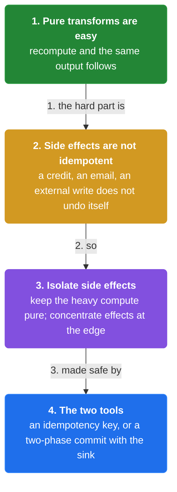

1. **Why side effects resist exactly-once** — A side effect touches the outside world, and the outside world cannot be "recomputed" the way per-key state can. **Sending an email twice is visible; a database increment applied twice is money.**

2. **Make the effect idempotent** — If the external system supports idempotency (a unique id, an upsert, an idempotency key), **the pipeline can retry the effect safely** — the external system deduplicates.

3. **Isolate side effects at the boundary** — Keep the main computation pure and **push side effects to the very end** of the pipeline, where retries are most controllable and the effect is a single idempotent write.

4. **Two-phase is expensive and fragile** — True end-to-end exactly-once across an external side effect often needs a **two-phase commit**, which is expensive and fragile. **Prefer idempotent effects over distributed transactions.**

```java
// PAYMENT SIDE — an idempotency key makes a charge retry-safe, a plain charge double-bills
// DEF: idempotency key — a unique id the external system uses to deduplicate = "order-99"
// DEF: charge — a side effect on the card = charge $10 for order-99
// DEF: card_ledger — the external ledger = 0
// DEF: card — the customer payment instrument charged = card ending 4242
// DEF: ledger — the external balance record the charge writes = 0
// STATE (before):
//    card_ledger : { "order-99": 0 }
// -> input : the pipeline attempts the charge for order-99, then retries after a timeout
//    step 1 · first attempt with the key -> card_ledger : 0 -> 10   BECAUSE the charge succeeds and records the key
//    step 2 · retry with the same key -> card_ledger : 10 -> 10   BECAUSE the external system sees order-99 already charged
//    step 3 · plain charge comparison -> card_ledger : 0 -> 10 -> 20   BECAUSE the retry has no key to deduplicate on
// <- outcome : the idempotent charge bills $10, the plain charge bills $20 for the same two attempts   BECAUSE only the key deduplicates the side effect
//    derivation : exactly-once side effect = one charge of $10, not two, thanks to idempotency key order-99
```


## System Design Interview

> **The question:** Design a payment pipeline that charges a card exactly once. Premise: the pipeline can crash and retry after a timeout, so the sink must be idempotent on an idempotency key and the shuffle must dedup, otherwise a retry double-charges order-99.

**The pipeline:** replayable source (offset) -> dedup shuffle -> idempotent sink (idempotency key) -> external system

### replayable source (offset)

_Role: replayable source — emits records with stable ids and a checkpoint_

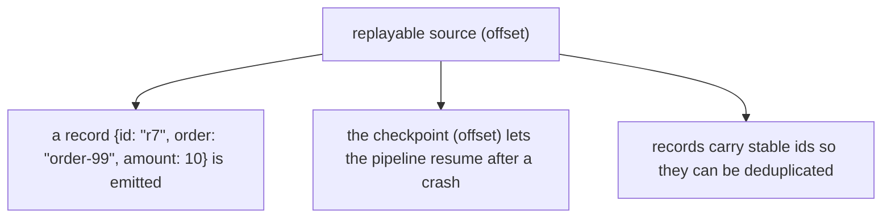

### dedup shuffle

_Role: dedup shuffle — drops duplicate record deliveries_

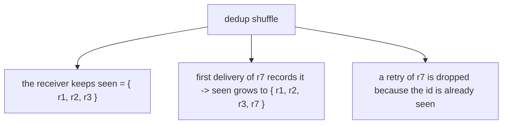

### idempotent sink (idempotency key)

_Role: idempotent sink — applies effects exactly once_

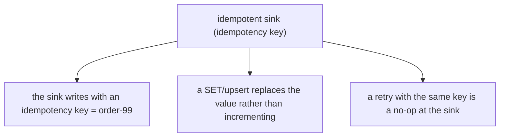

### external system

_Role: external system — the outside-world effect_

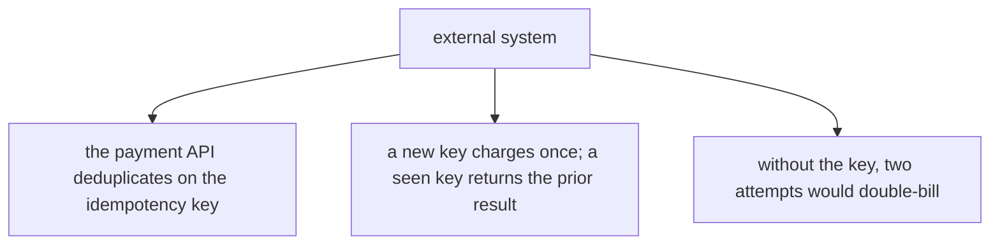

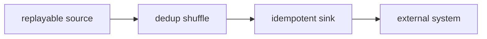

```java
// SYSTEM DESIGN — a crash and retry still charge the card exactly once via the idempotency key
// DEF: idempotency key — a unique id the external system deduplicates on = "order-99"
// DEF: dedup — a set of record ids already delivered = { r1, r2, r3 }
// DEF: charge — the side effect = charge $10 for order-99
// STATE (before):
//    card_ledger : 0
// -> input : the pipeline attempts the charge for order-99, then retries after a timeout
//    step 1 · first delivery of r7 -> dedup : { r1, r2, r3 } -> { r1, r2, r3, r7 }   BECAUSE r7 is new
//    step 2 · the charge succeeds -> card_ledger : 0 -> 10   BECAUSE the API sees the key order-99 as new
//    step 3 · the retry delivers r7 again -> dropped by dedup -> card_ledger : 10 -> 10   BECAUSE the key is now seen
// <- outcome : the card is charged exactly $10   BECAUSE dedup blocked the retry and the key made the effect idempotent
//    derivation : 2 deliveries of r7 -> 1 charge of $10, so exactly-once holds end to end
```

## Interview Questions

### Q1

A payment pipeline charges cards from a stream; after a crash, some charges were retried and customers were billed twice.

**Interviewer's question:** How do you guarantee a charge happens exactly once when the pipeline can crash and retry?

**Solution:** Give each charge an idempotency key (e.g. order id) and have the payment API deduplicate on it; make the sink idempotent so a retry is a no-op rather than a second charge.

**System-design components:**
- Idempotency key — stable per-order id
- Idempotent sink — SET/upsert, not increment
- Replayable source — Kafka offset
- Dedup — drop duplicate deliveries

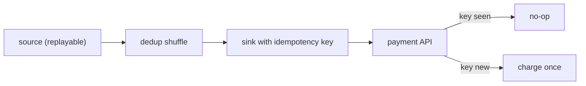

```java
// order-99 charge $10
//   attempt 1 -> API sees key new -> charge, ledger 0->10
//   retry      -> API sees key seen -> no-op, ledger stays 10
//   without key: 2 attempts -> ledger 0->10->20 (double bill)
```

_This is exactly the idempotency-key side-effect material in this chapter._

_Covers:_ 2. Idempotency · 6. Side effects · 7. Idempotency key vs two-phase commit

_From the 28 problems:_ 26-payment-system

### Q2

A metrics pipeline recomputes per-key counts from a replayable source after a crash, but downstream sees doubled counts.

**Interviewer's question:** Why do the counts double, and how do you make them exactly-once?

**Solution:** The retried records double-count because the sink is non-idempotent; make the sink an idempotent upsert (set the count) and deduplicate records at the shuffle.

**System-design components:**
- Replayable source — offset
- Dedup — record ids
- Idempotent sink — upsert count

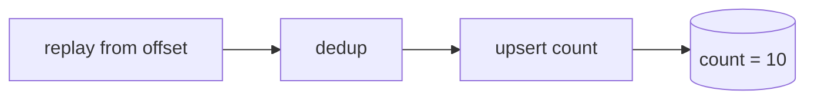

```java
// count before crash = 10
//   replay delivers same records -> dedup drops duplicates
//   sink upserts count = 10 (SET), not += 10
//   -> count stays 10, not 20
```

_This is exactly the end-to-end exactly-once material in this chapter._

_Covers:_ 3. Shuffle deduplication · 4. Replayable sources · 5. End-to-end exactly-once

_From the 28 problems:_ 20-metrics-monitoring · 21-ad-click-aggregation

## Key Concepts

### The Problem

**1. Retries are unavoidable.** Exactly-once is the property that a retried record does not affect the output twice.


### The Solution

An idempotent operation has the same effect whether run once or many times — SET 42 -> 10 is idempotent, ADD 10 is not.


### Key Facts

| Fact | Detail | In the wild |
|---|---|---|
| 2. Idempotency | An idempotent operation has the same effect whether run once or many times — SET 42 -> 10 is idempotent, ADD 10 is not. | HTTP PUT and upserts are idempotent; a naive POST increment is not. |
| 3. Shuffle deduplication | The receiver keeps a set of already-seen record ids and drops duplicates — exactly-once delivery through the shuffle. | Beam's exactly-once shuffle and Flink's checkpoint barrier do this. |
| 4. Replayable sources | A replayable source exposes a checkpoint (offset) and its records carry stable ids, so re-reading is deduplicable. | Kafka consumer offsets and file offsets are the canonical checkpoints. |
| 5. End-to-end exactly-once | End-to-end exactly-once composes a replayable source, a deduplicating shuffle, and an idempotent sink. | Kafka -> Flink -> idempotent sink is the reference architecture. |
| 6. Side effects | Side effects are the hard part of exactly-once; they need idempotency keys or a two-phase commit. | Stripe's Idempotency-Key header is the production form. |
| 7. Idempotency key vs two-phase commit | An idempotency key is cheap and robust; a two-phase commit is expensive and fragile. | Payment APIs accept idempotency keys; XA two-phase commit is avoided in stream processing. |
| 8. Isolate side effects | Keep the main computation pure and push side effects to the very end of the pipeline. | Enrich -> compute -> idempotent upsert is the standard Dataflow shape. |


### Tradeoffs & When

- An idempotency key is cheap and robust; a two-phase commit is expensive and fragile.
- Keep the main computation pure and push side effects to the very end of the pipeline.


### Real-World Examples

- **Stripe** — Idempotency-Key header makes charge retries safe
- **Apache Kafka** — Exactly-once semantics via idempotent producer + transactions
- **Apache Flink** — Two-phase commit sinks for end-to-end exactly-once


<details><summary>All concepts (index)</summary>

### Why: 1. Retries are unavoidable

**Why.** Crashes and timeouts force retries, and a naive retry double-counts.

**Claim.** Exactly-once is the property that a retried record does not affect the output twice.

**Grounding.** The book defines exactly-once as each record affecting the output exactly once.

**In the wild.** Kafka's exactly-once semantics and Flink's two-phase commit both target this.

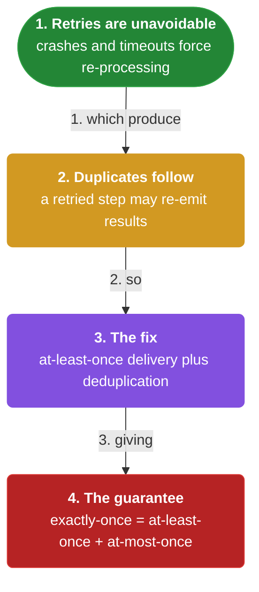
### Property: 2. Idempotency

**Why.** If an operation can be replayed without changing the result, retries are harmless.

**Claim.** An idempotent operation has the same effect whether run once or many times — SET 42 -> 10 is idempotent, ADD 10 is not.

**Grounding.** Idempotency is the property that makes sinks tolerate retries.

**In the wild.** HTTP PUT and upserts are idempotent; a naive POST increment is not.

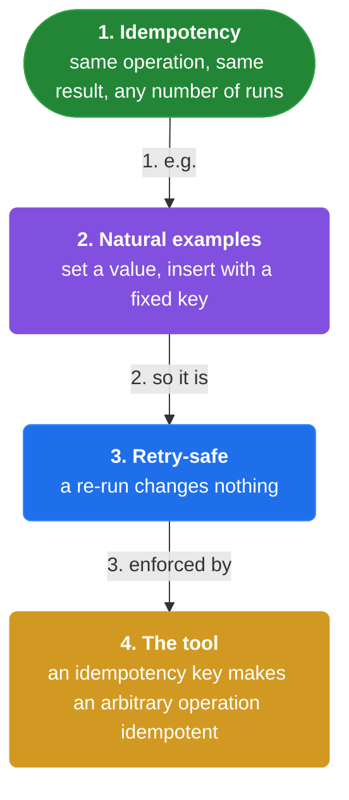
### Mechanism: 3. Shuffle deduplication

**Why.** Records moving between stages can be delivered more than once after a crash.

**Claim.** The receiver keeps a set of already-seen record ids and drops duplicates — exactly-once delivery through the shuffle.

**Grounding.** Dedup turns two deliveries into one effect.

**In the wild.** Beam's exactly-once shuffle and Flink's checkpoint barrier do this.

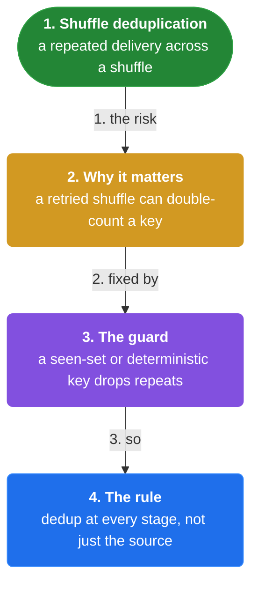
### Source: 4. Replayable sources

**Why.** A source must be able to recover from a crash without losing or duplicating records.

**Claim.** A replayable source exposes a checkpoint (offset) and its records carry stable ids, so re-reading is deduplicable.

**Grounding.** Replay + stable ids = the source side of end-to-end exactly-once.

**In the wild.** Kafka consumer offsets and file offsets are the canonical checkpoints.

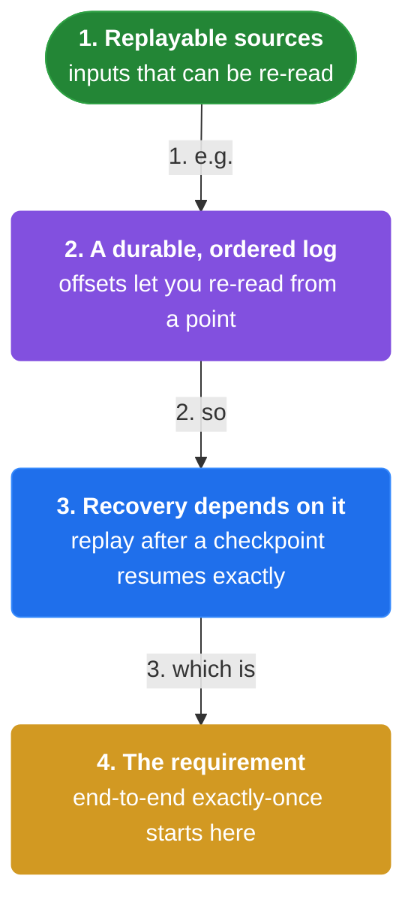
### Composition: 5. End-to-end exactly-once

**Why.** Each stage has its own failure mode, so a single dedup is not enough.

**Claim.** End-to-end exactly-once composes a replayable source, a deduplicating shuffle, and an idempotent sink.

**Grounding.** Drop any one of the three and the guarantee breaks.

**In the wild.** Kafka -> Flink -> idempotent sink is the reference architecture.

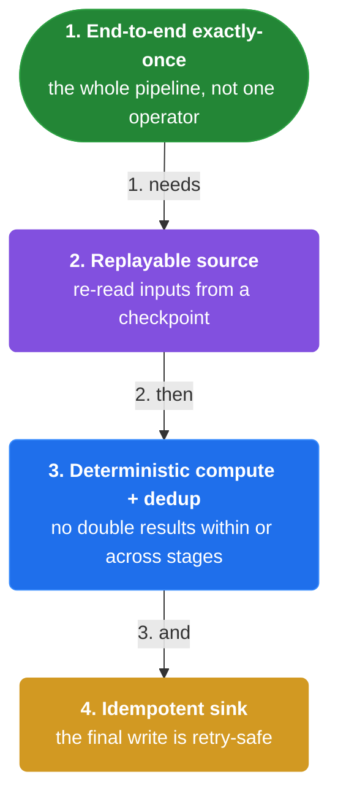
### Hard part: 6. Side effects

**Why.** An external effect — an email, a charge, an API call — cannot be undone by recomputing state.

**Claim.** Side effects are the hard part of exactly-once; they need idempotency keys or a two-phase commit.

**Grounding.** Sending an email twice is visible; a double increment is money.

**In the wild.** Stripe's Idempotency-Key header is the production form.

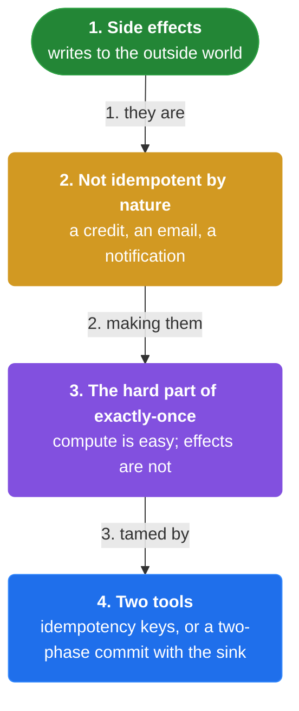
### Pattern: 7. Idempotency key vs two-phase commit

**Why.** Making an external side effect exactly-once has two options, and they differ sharply in cost.

**Claim.** An idempotency key is cheap and robust; a two-phase commit is expensive and fragile.

**Grounding.** Prefer idempotent effects over distributed transactions whenever the external system supports them.

**In the wild.** Payment APIs accept idempotency keys; XA two-phase commit is avoided in stream processing.

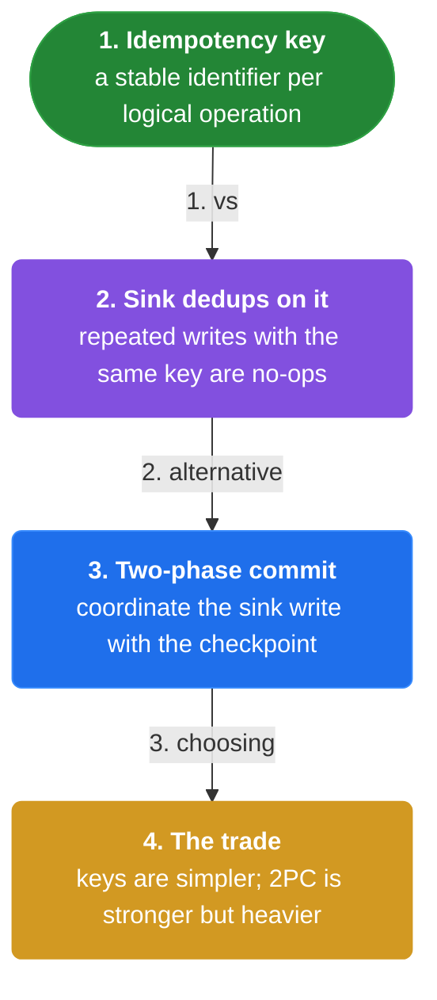
### Boundary: 8. Isolate side effects

**Why.** Retries are most controllable when the effect is one idempotent write at the edge.

**Claim.** Keep the main computation pure and push side effects to the very end of the pipeline.

**Grounding.** A pure core plus a thin idempotent boundary is the cleanest exactly-once design.

**In the wild.** Enrich -> compute -> idempotent upsert is the standard Dataflow shape.

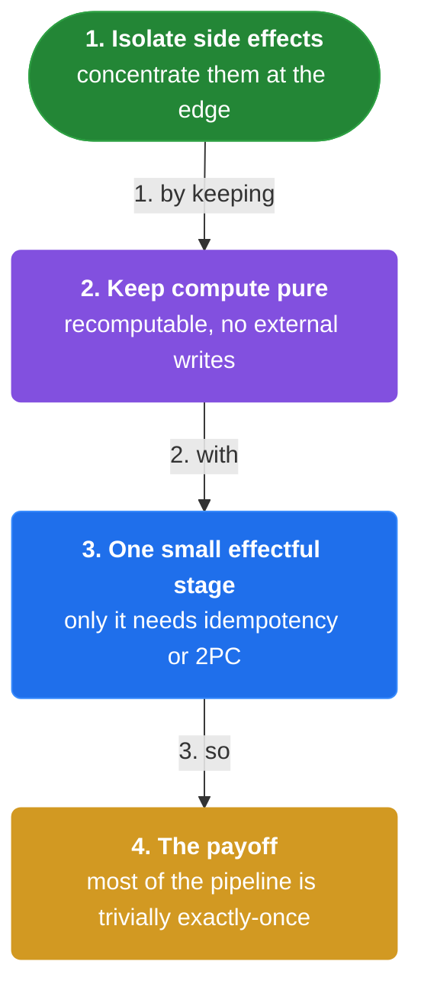

</details>


## Quiz

1. What does exactly-once mean in this book?

   - A. No operation is ever retried
   - B. Each record affects the output exactly once
   - C. The pipeline never crashes
   - D. Every window emits exactly one pane

<details><summary>Reveal answer</summary>

**B.** Exactly-once is the property that a retried record does not affect the output twice.

</details>

2. Which operation is idempotent?

   - A. ADD 10
   - B. SET 42 -> 10
   - C. INCREMENT
   - D. APPEND

<details><summary>Reveal answer</summary>

**B.** SET replaces the value, so running it twice has the same effect as once.

</details>

3. What are the three parts of end-to-end exactly-once?

   - A. Source, cache, queue
   - B. Replayable source, deduplicating shuffle, idempotent sink
   - C. Producer, broker, consumer
   - D. Trigger, watermark, window

<details><summary>Reveal answer</summary>

**B.** End-to-end exactly-once composes a replayable source, a deduplicating shuffle, and an idempotent sink.

</details>

4. Why are side effects the hard part of exactly-once?

   - A. They are slow
   - B. They touch the outside world and cannot be recomputed
   - C. They use too much memory
   - D. They require watermarks

<details><summary>Reveal answer</summary>

**B.** An email or charge cannot be undone by recomputation, so it needs idempotency or a two-phase commit.

</details>

5. Which is preferred for making a charge exactly-once?

   - A. Two-phase commit
   - B. Idempotency key
   - C. Retry without a key
   - D. Ignoring failures

<details><summary>Reveal answer</summary>

**B.** An idempotency key is cheap and robust; two-phase commit is expensive and fragile.

</details>

