# Chapter 5: Exactly-Once and Side Effects

> Exactly-once means every record affects the output exactly once, and it decomposes into two problems — replaying sources and shuffles without double-counting (solved with deduplication and idempotency) and external side effects (the genuinely hard part).

_Also known as: SS Ch05 · Exactly-Once · Idempotency · Deduplication · Side Effects · End-to-End Exactly-Once_

## Flow

### What exactly-once means

> **Why this matters:** "Exactly-once" is used loosely, so this section fixes the definition — it is about each record affecting the output exactly once, not about a magic guarantee that nothing is ever retried.

1. **Accuracy and completeness** — A correct pipeline is **accurate** (each result is right) and **complete** (every input contributes). Exactly-once means each record's contribution appears exactly once.

2. **Retries are the enemy of once** — In a distributed system, records are retried after crashes and timeouts. **Exactly-once is the property that a retried record does not count twice.**

3. **Two sub-problems** — Exactly-once splits into **deduplicating records as they move between stages** (sources and shuffles) and **making the final effect idempotent** (sinks and side effects).

4. **Exactly-once state vs exactly-once effects** — Making per-key state exactly-once is easy (recompute a deterministic value); making an **external side effect** exactly-once (send one email, charge one card) is the hard part.

<!-- ch05-meaning:begin — generated by tools/gen_ch05.js; do not hand-edit -->

#### Why exactly-once is two guarantees, and which half is hard

A correct pipeline is **accurate** (each result is right) and **complete** (every input contributes). Exactly-once means each record's contribution appears exactly once — no more and no less.

Those are separate failures with separate causes. Lose the 4 records after a crash and the total is **23**, 49% low. Apply the same 4 twice and it is **67**, 49% high. Same size, opposite sign — which is exactly why one can mask the other in an aggregate.

**One duplicate record costs `v` divided by its window's total**, so the damage is not a fixed percentage. Delivering id 8 twice takes its window from 8 to 16 (**+100%**); the least damaging duplicate in this dataset is +14%. Duplicate damage concentrates in **thin** windows, which are the ones nobody watches.

**And retries are not optional.** A worker crashes mid-batch and the batch is re-sent. A send times out but actually succeeded, and the sender cannot tell. A checkpoint commits state but not the offset. Each produces a duplicate — and the alternative, never retrying, turns every one of them into **lost** data instead. So a distributed pipeline is at-least-once by default, and exactly-once is built on top of retries rather than instead of them.

**The problem then splits in two, and the halves are not equally hard.** Per-key state is a deterministic function of the records: recompute window [12:08, 12:10) and you get 8 every time, so it is idempotent by construction. An external effect — charge order 4 for 6 — cannot be recomputed. The money has moved, nothing in the pipeline records that, and the only system that knows is the one you called.

#### When you need exactly-once, and when at-least-once is the right answer

**At-least-once is fine when the sink is idempotent anyway** — a cache you overwrite, a gauge you set, a search index keyed by document id. Re-delivering a record costs a little work and changes nothing, so the extra machinery buys nothing.

**At-most-once is fine when a loss is cheaper than a duplicate** and the data is statistical — a sampled metric, a debug trace. Rare, but it exists, and it is far cheaper to build.

**You need exactly-once when a duplicate is visible or expensive**: money, an email, a count someone reconciles. The test is not "is the data important" but "would a second copy be noticed" — and in a thin window, a single duplicate is a 100% error.

**What this does not settle:** which mechanism to use where. Completeness and accuracy have different fixes at different stages, and the state half and the effect half of exactly-once need entirely different machinery. The next two concepts take them in turn — and the second one is where the usual "source + shuffle + sink" rule turns out to be imprecise.

#### Visual walkthrough — two failures, one duplicate, and the split

The animation loops through all 4 steps. Expand any step to study it on its own.



<details>
<summary><b>Step 1 of 4</b> — accuracy and completeness are two different failures</summary>


Exactly-once is two guarantees, not one. Losing 4 records takes the total to 23; applying the same 4 twice takes it to 67. Both are 49% wrong and neither is detectable from the number alone — and they are fixed by different mechanisms, at different stages.

</details>
<details>
<summary><b>Step 2 of 4</b> — one duplicate record, and what it does to a window</summary>

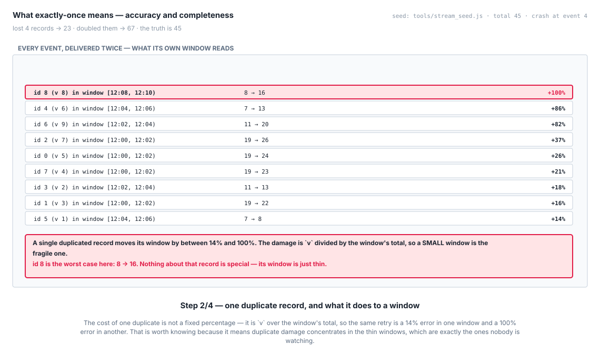

The cost of one duplicate is not a fixed percentage — it is `v` over the window's total, so the same retry is a 14% error in one window and a 100% error in another. That is worth knowing because it means duplicate damage concentrates in the thin windows, which are exactly the ones nobody is watching.

</details>
<details>
<summary><b>Step 3 of 4</b> — retries are the enemy, and they are not optional</summary>

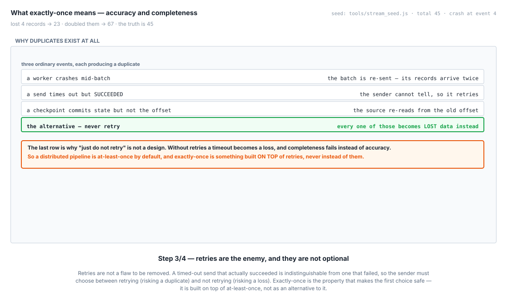

Retries are not a flaw to be removed. A timed-out send that actually succeeded is indistinguishable from one that failed, so the sender must choose between retrying (risking a duplicate) and not retrying (risking a loss). Exactly-once is the property that makes the first choice safe — it is built on top of at-least-once, not as an alternative to it.

</details>
<details>
<summary><b>Step 4 of 4</b> — and exactly-once STATE is easy; exactly-once EFFECTS are not</summary>

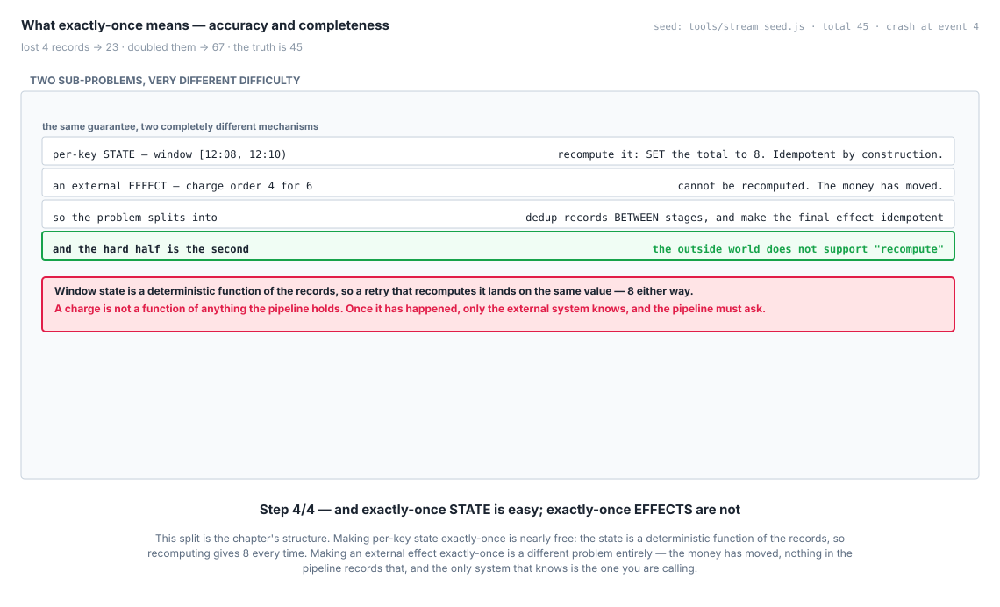

This split is the chapter's structure. Making per-key state exactly-once is nearly free: the state is a deterministic function of the records, so recomputing gives 8 every time. Making an external effect exactly-once is a different problem entirely — the money has moved, nothing in the pipeline records that, and the only system that knows is the one you are calling.

</details>

<sub>The loss and duplication totals, and every per-window duplicate cost, are computed from the seed and asserted. Generated by `node tools/gen_ch05.js`.</sub>

<!-- ch05-meaning:end -->

<!-- ch05-meaning-memory:begin — generated by tools/gen_ch05.js; do not hand-edit -->

#### Accuracy and completeness — stack and heap at every step

**What is being answered.** Why exactly-once is two guarantees — as three delivery lists built by one function and summed by another.

`deliver(mode)` produces the list of record ids a stage actually receives: 9 ids for exactly-once, 5 for at-most-once (the replay never happens), and 13 for at-least-once (the replay is not deduplicated).

`aggregate(ids)` then sums them, and step 3 is the point: it is **identical and correct** for all three lists and produces 23, 45 and 67. The duplicates are visible in the list and invisible in the number.

The animation steps through the code, holding each line long enough to read the STACK (call frames and their locals) and the HEAP (allocated arrays and objects) as they are AT THAT MOMENT. Expand any step to study it on its own.



<details>
<summary><b>Step 1 of 4</b> — at-most-once DROPS everything after the checkpoint</summary>


`indexOf(EVENTS[5])` is 5, which is > CHK = 4, so the record is skipped. All 4 records after the checkpoint are dropped and the list holds 5 ids. That is a COMPLETENESS failure: the sum will be 23, and nothing downstream can recover it.

</details>
<details>
<summary><b>Step 2 of 4</b> — at-least-once APPENDS them a second time</summary>

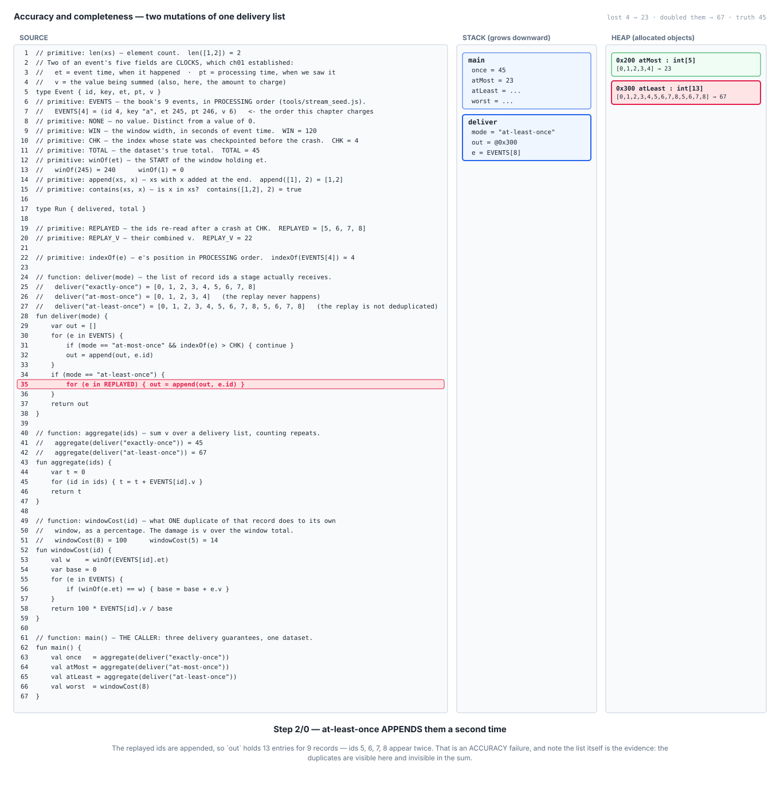

The replayed ids are appended, so `out` holds 13 entries for 9 records — ids 5, 6, 7, 8 appear twice. That is an ACCURACY failure, and note the list itself is the evidence: the duplicates are visible here and invisible in the sum.

</details>
<details>
<summary><b>Step 3 of 4</b> — and the aggregate cannot tell the two apart</summary>

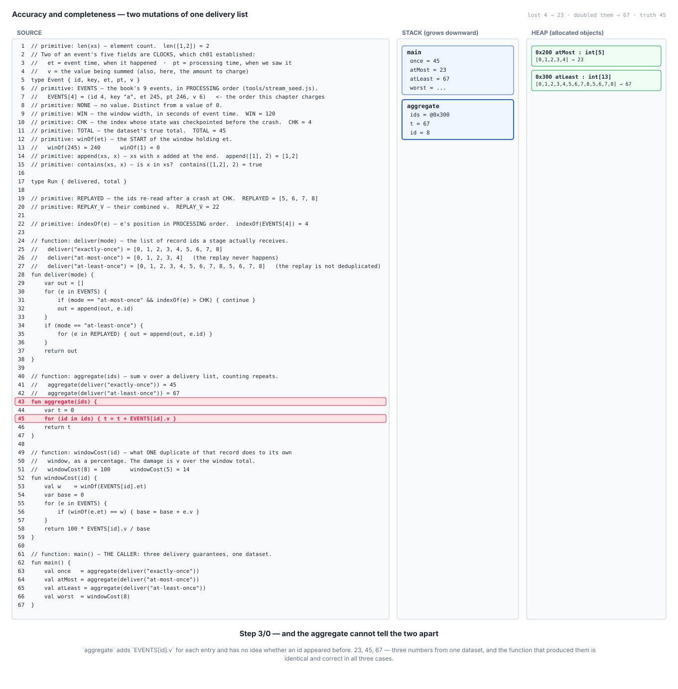

`aggregate` adds `EVENTS[id].v` for each entry and has no idea whether an id appeared before. 23, 45, 67 — three numbers from one dataset, and the function that produced them is identical and correct in all three cases.

</details>
<details>
<summary><b>Step 4 of 4</b> — one duplicate costs v / window total, so thin windows hurt</summary>

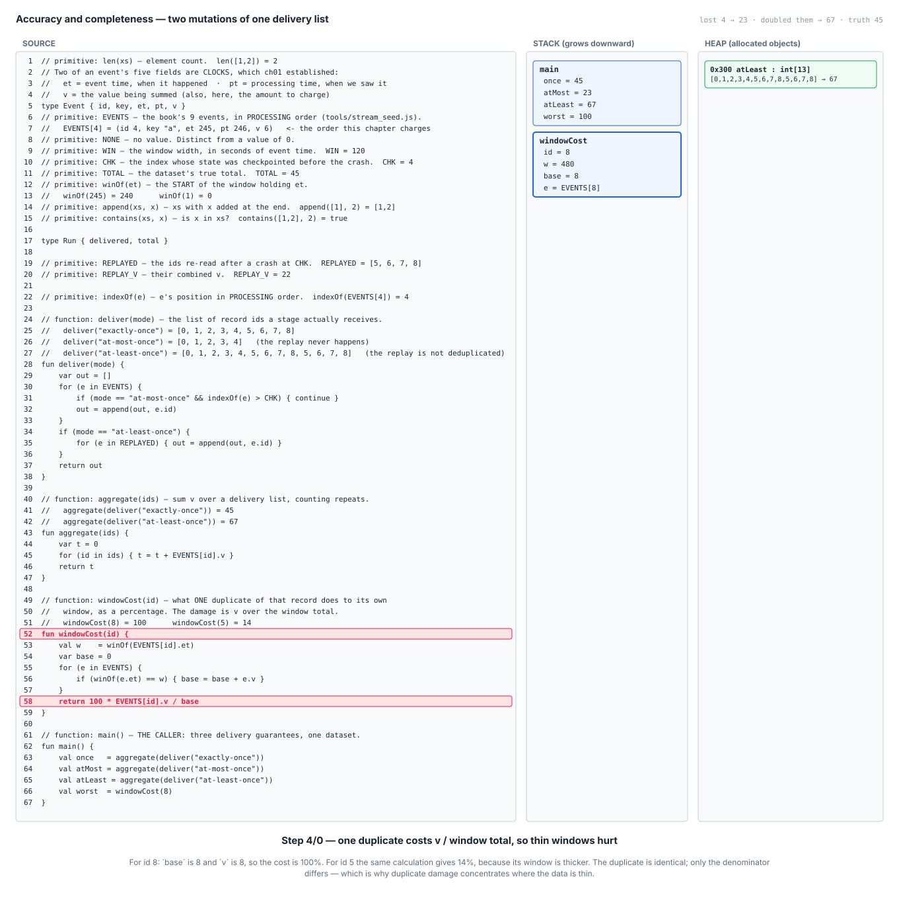

For id 8: `base` is 8 and `v` is 8, so the cost is 100%. For id 5 the same calculation gives 14%, because its window is thicker. The duplicate is identical; only the denominator differs — which is why duplicate damage concentrates where the data is thin.

</details>

<sub>All three totals and every per-window duplicate cost are computed from the seed and asserted. Generated by `node tools/gen_ch05.js` on `tools/memkit.js`.</sub>

<!-- ch05-meaning-memory:end -->

### Idempotency and deduplication

> **Why this matters:** Exactly-once is not a single mechanism — it is deduplication at the boundaries plus idempotency at the effects, so this section separates the two and shows where each applies.

1. **Idempotent operations** — An operation is **idempotent** if performing it many times has the same effect as once. **Setting a value to 10 is idempotent; incrementing by 10 is not.**

2. **Deduplicate at the shuffle** — When a stage sends records to the next, the receiver can keep a set of **already-seen record ids** and drop duplicates. This is exactly-once delivery through the shuffle.

3. **Sources need replayable, deduplicable records** — A source that can be **replayed from a checkpoint** (a Kafka offset, a file offset) and whose records carry stable ids can be re-read without double-counting.

4. **End-to-end exactly-once = source + shuffle + sink** — End-to-end exactly-once composes: a replayable source, a deduplicating shuffle, and an **idempotent sink**. Drop any one and the guarantee breaks.

<!-- ch05-dedup:begin — generated by tools/gen_ch05.js; do not hand-edit -->

#### Why a replayable source has no substitute and the other two are redundant

**Idempotent means twice is the same as once**, and the test is what the operation *names*. `SET window [12:08, 12:10) = 8` names a result: apply it any number of times and the value is 8. `ADD 8` names a change: twice gives 16.

This connects straight back to ch02. An **accumulating** pane carries the window's whole total, so it is a SET and is safe to re-deliver. A **discarding** pane carries only the delta, so it is an ADD and is not. **The accumulation mode decides whether an idempotent sink is possible at all.**

**Dedup at the shuffle** is a set of ids already accepted plus one membership test. Replay ids 5, 6, 7, 8 into it and all 4 are recognised and dropped: total 45, correct. Two things make it non-free — the ids must be **stable** across the retry (an id generated at send time gets a new value and defeats it), and the seen-set is unbounded state that needs a horizon, so dedup has a memory beyond which it stops working.

**Now put all three guards in a table.** After a crash at event 4 with the state committed and the offset not, the 8 combinations of (replayable source × deduplicating shuffle × idempotent sink) produce exactly **three** totals: 23, 45 and 67.

3 of the 8 rows reach 45, and reading them refines the usual claim. "End-to-end exactly-once = source + shuffle + sink, drop any one and it breaks" is **not quite right for an aggregation**: the replayable source is load-bearing, and then dedup **or** an idempotent sink is enough. The two accuracy guards are redundant.

**The source is different because the mechanisms are asymmetric.** Dedup and idempotency are *subtractive* — they stop a contribution counting twice, and can do nothing else. Neither can add back a record that was never re-read. So completeness has exactly one mechanism and accuracy has two.

#### When to use which guard, and where the redundancy disappears

**Always start with the source.** If it cannot replay from a committed offset, nothing downstream gets you past 23, and no amount of care elsewhere helps. This is the requirement to check before designing anything else.

**Prefer an idempotent sink to a deduplicating shuffle when you have the choice.** It needs no extra state, no id stability and no horizon — whereas the seen-set is unbounded state that must be bounded, and bounding it puts an expiry on the guarantee.

**Use the deduplicating shuffle when the sink genuinely cannot be idempotent** — when it only accepts deltas, or when the operation is an append. Then budget for the seen-set and decide its horizon deliberately.

**Use both when you want the cheap belt-and-braces**, knowing from the table that for an aggregation this is redundancy rather than defence in depth.

**What this does not settle — and it is the important one:** the redundancy above holds because a window total can be recomputed. It **disappears** the moment the sink's effect is outside the pipeline. The next concept shows the dedup shuffle covering 1 of 3 crash windows where an idempotency key covers 3 — at which point the two guards are not interchangeable at all.

#### Visual walkthrough — SET vs ADD, the seen-set, and all 8 combinations

The animation loops through all 4 steps. Expand any step to study it on its own.



<details>
<summary><b>Step 1 of 4</b> — idempotent means "twice is the same as once"</summary>


The test for idempotency is whether the operation names a result or a change. `SET = 8` is a result and survives any number of retries; `ADD 8` is a change and does not. The note connects this back to ch02: accumulating panes are SETs and discarding panes are ADDs, so that choice decides whether an idempotent sink is even possible.

</details>
<details>
<summary><b>Step 2 of 4</b> — dedup at the shuffle: a set of ids already seen</summary>

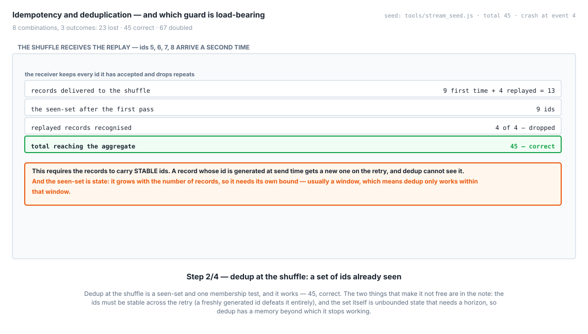

Dedup at the shuffle is a seen-set and one membership test, and it works — 45, correct. The two things that make it not free are in the note: the ids must be stable across the retry (a freshly generated id defeats it entirely), and the set itself is unbounded state that needs a horizon, so dedup has a memory beyond which it stops working.

</details>
<details>
<summary><b>Step 3 of 4</b> — the 8 combinations, and what each one actually produces</summary>

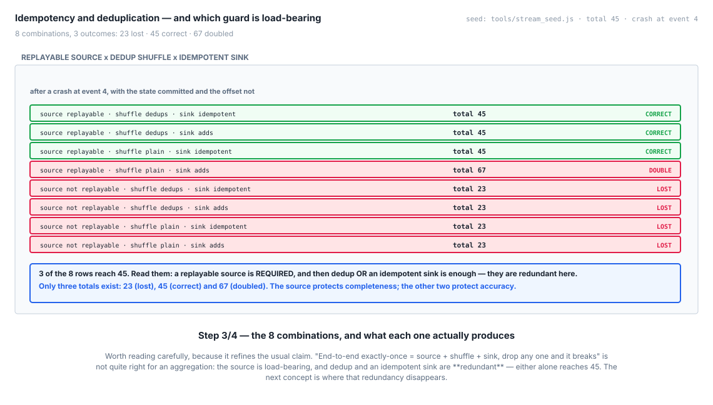

Worth reading carefully, because it refines the usual claim. "End-to-end exactly-once = source + shuffle + sink, drop any one and it breaks" is not quite right for an aggregation: the source is load-bearing, and dedup and an idempotent sink are **redundant** — either alone reaches 45. The next concept is where that redundancy disappears.

</details>
<details>
<summary><b>Step 4 of 4</b> — a replayable source is the one piece with no substitute</summary>

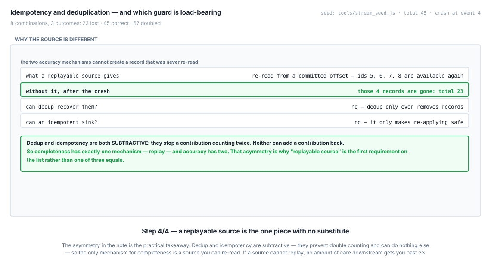

The asymmetry in the note is the practical takeaway. Dedup and idempotency are subtractive — they prevent double counting and can do nothing else — so the only mechanism for completeness is a source you can re-read. If a source cannot replay, no amount of care downstream gets you past 23.

</details>

<sub>The 8-row table and its 3 distinct totals are computed from the seed, and the redundancy finding is asserted. Generated by `node tools/gen_ch05.js`.</sub>

<!-- ch05-dedup:end -->

<!-- ch05-dedup-memory:begin — generated by tools/gen_ch05.js; do not hand-edit -->

#### Three guards, eight combinations — stack and heap at every step

**What is being answered.** Which of the three exactly-once guards is actually load-bearing — as one `runPipeline(replayable, dedup, idempotent)` called with different flags.

Steps 1 and 2 are the finding: `dedupOnly` and `idemOnly` both reach 45, by completely different routes. Dedup stops the record before the sink; the idempotent sink lets it through and writes a value that does not depend on what is already there. **For an aggregation they are redundant.**

Step 4 is why the source is different. `firstN` truncates the feed *before* the loop, so both guards — set to true — never see the missing records. They are subtractive, and no subtractive mechanism can add a contribution back.

The animation steps through the code, holding each line long enough to read the STACK (call frames and their locals) and the HEAP (allocated arrays and objects) as they are AT THAT MOMENT. Expand any step to study it on its own.



<details>
<summary><b>Step 1 of 4</b> — dedup drops the replayed record on a membership test</summary>


`seen` already holds id 5 from the first pass, so `contains` is true and the replayed copy is skipped before it can reach the sink. `dedupOnly` reaches 45 — correct, with a sink that merely ADDS. The guard is upstream of the sink's weakness.

</details>
<details>
<summary><b>Step 2 of 4</b> — OR the sink names the result, which makes the repeat harmless</summary>

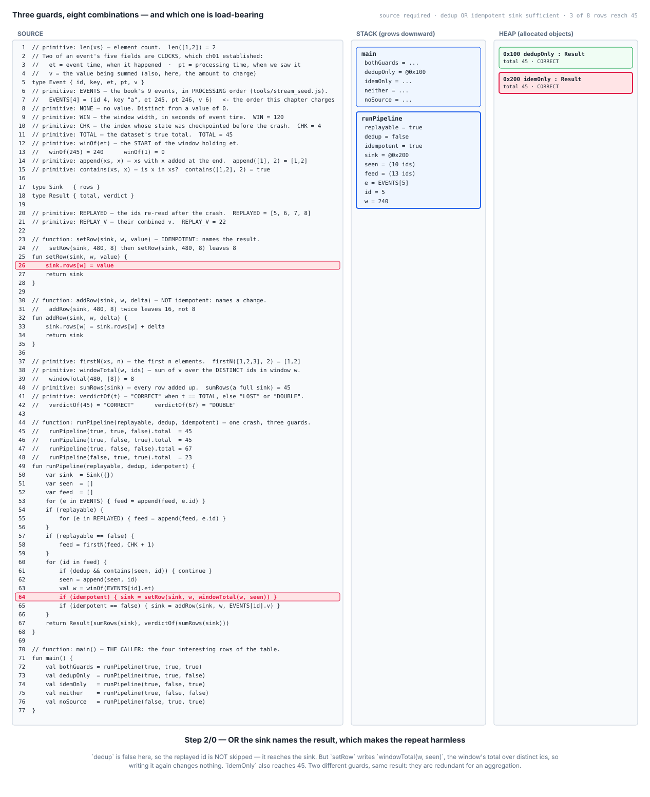

`dedup` is false here, so the replayed id is NOT skipped — it reaches the sink. But `setRow` writes `windowTotal(w, seen)`, the window's total over distinct ids, so writing it again changes nothing. `idemOnly` also reaches 45. Two different guards, same result: they are redundant for an aggregation.

</details>
<details>
<summary><b>Step 3 of 4</b> — with neither, the add runs twice</summary>

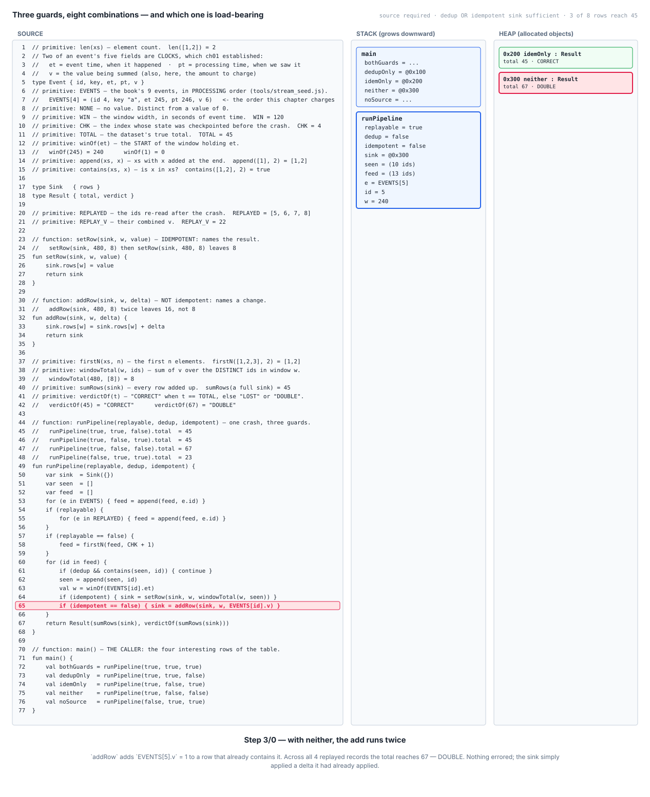

`addRow` adds `EVENTS[5].v` = 1 to a row that already contains it. Across all 4 replayed records the total reaches 67 — DOUBLE. Nothing errored; the sink simply applied a delta it had already applied.

</details>
<details>
<summary><b>Step 4 of 4</b> — and no guard can recover a record that was never re-read</summary>

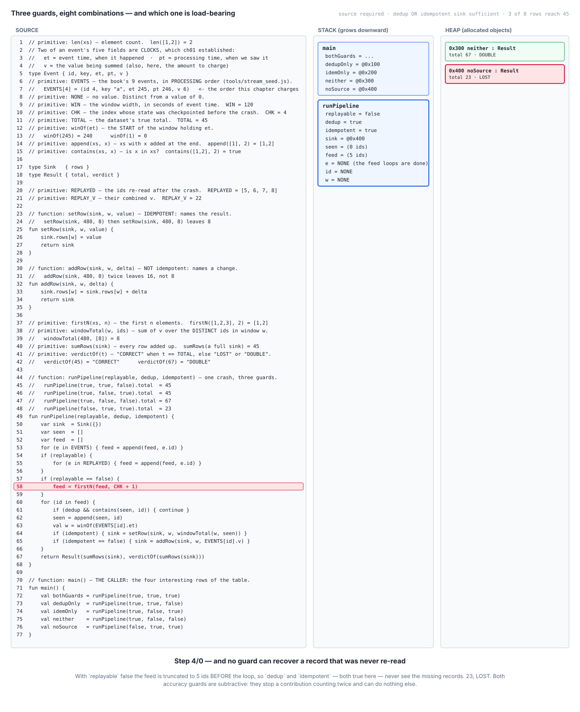

With `replayable` false the feed is truncated to 5 ids BEFORE the loop, so `dedup` and `idempotent` — both true here — never see the missing records. 23, LOST. Both accuracy guards are subtractive: they stop a contribution counting twice and can do nothing else.

</details>

<sub>All 8 combinations are computed from the seed; the three distinct totals and the redundancy finding are asserted. Generated by `node tools/gen_ch05.js` on `tools/memkit.js`.</sub>

<!-- ch05-dedup-memory:end -->

### Side effects — the hard part

> **Why this matters:** The truly hard case is when the pipeline must do something in the outside world — send an email, call a payment API — because that effect cannot be undone by recomputation, so this section covers the patterns that make side effects tractable.

1. **Why side effects resist exactly-once** — A side effect touches the outside world, and the outside world cannot be "recomputed" the way per-key state can. **Sending an email twice is visible; a database increment applied twice is money.**

2. **Make the effect idempotent** — If the external system supports idempotency (a unique id, an upsert, an idempotency key), **the pipeline can retry the effect safely** — the external system deduplicates.

3. **Isolate side effects at the boundary** — Keep the main computation pure and **push side effects to the very end** of the pipeline, where retries are most controllable and the effect is a single idempotent write.

4. **Two-phase is expensive and fragile** — True end-to-end exactly-once across an external side effect often needs a **two-phase commit**, which is expensive and fragile. **Prefer idempotent effects over distributed transactions.**

<!-- ch05-effects:begin — generated by tools/gen_ch05.js; do not hand-edit -->

#### Why the outside world cannot be recomputed, and what follows from that

**A side effect touches the outside world, and the outside world has no "recompute".** Retry the aggregation and window [12:08, 12:10) is 8 again, because the state is a function of the records. Retry `charge(order 4, 6)` and the card is charged **12**, because the money moved and nothing in the pipeline records that it did.

Worse, the pipeline **cannot tell**: a charge that timed out after succeeding looks exactly like one that failed. So it has only two options, and they are the same option — make the effect safe to repeat, or ask the external system whether it already happened.

**An idempotency key is how you ask.** First attempt: `charge("order-4", 6)`, the processor records the key and charges 6. The pipeline crashes before committing. The retry sends the same call, the processor **recognises the key**, and the total charged is 6.

Note what the key does *not* do: it does not make the effect idempotent. It moves the deduplication to the only place that can see both attempts. Two requirements follow — the key must be derived from the **data** (a key generated at send time is a second charge with extra steps), and the external system has to offer the feature at all.

**And here is where the previous concept's redundancy disappears.** There are three windows in which the pipeline can crash while charging order 4:

- **crash before the shuffle** — the record is re-sent and the shuffle recognises its id. Dedup: covers. Key: covers.
- **crash after the shuffle, before the charge** — the id is already past the dedup set; the replay sends a NEW copy that dedup has not seen. Dedup: **misses**. Key: covers.
- **crash after the charge, before the offset commit** — the charge happened; only the external system can know that. Dedup: **misses**. Key: covers.

A deduplicating shuffle covers **1 of 3**; an idempotency key covers **3 of 3**. For a pure aggregation the two guards were interchangeable. For a side effect only the external one reaches the crash windows that matter.

**Placement helps too, and it is free.** In a 4-stage pipeline (source → shuffle → aggregate → sink), an effect at stage 2 can be re-run by a crash in 3 stages; at the last stage, only 1. That is a 3× reduction in exposure from placement alone, and it keeps everything upstream pure and freely retryable.

#### When each mechanism applies, and the one you cannot provide yourself

**Use an idempotency key whenever the external system offers one** — Stripe, most payment processors, any API with an `Idempotency-Key` header, any database with upsert. It is one round trip, the retry is free, and the decision is made by the only component that can make it.

**Push the effect to the last stage, always.** It costs nothing, reduces exposure 3× here, and leaves the computation above it pure — so the expensive part of the pipeline can be retried without anyone thinking about it.

**Reach for two-phase commit only when there is no key.** It genuinely achieves exactly-once across an external effect, and it has a state — prepared, coordinator gone — in which neither committing nor aborting is safe. That state is resolved by a human, which is why it is the fallback rather than the default.

**What this does not settle, and it is a dependency rather than a gap:** the whole mechanism rests on a feature of someone else's system. If the processor has no idempotency key, this design does not degrade — it is unavailable. And if the key is generated at send time rather than derived from the order, the pipeline looks correct and double-charges, with nothing inside it able to detect the difference.

#### Visual walkthrough — no recompute, the key, the three crash windows

The animation loops through all 4 steps. Expand any step to study it on its own.



<details>
<summary><b>Step 1 of 4</b> — a side effect cannot be recomputed</summary>


The asymmetry is total. Recomputing window state gives 8 however many times you do it, because the state is a function of the records. Re-running a charge gives 12, because the money moved and nothing in the pipeline knows. And the pipeline cannot distinguish a timed-out charge that succeeded from one that failed — so it must either make repetition safe, or ask.

</details>
<details>
<summary><b>Step 2 of 4</b> — an idempotency key moves the dedup OUTSIDE</summary>

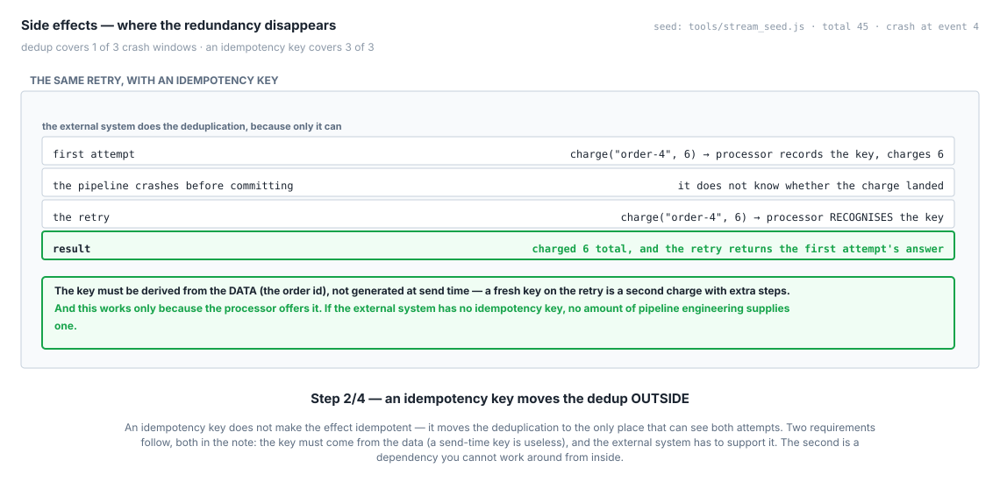

An idempotency key does not make the effect idempotent — it moves the deduplication to the only place that can see both attempts. Two requirements follow, both in the note: the key must come from the data (a send-time key is useless), and the external system has to support it. The second is a dependency you cannot work around from inside.

</details>
<details>
<summary><b>Step 3 of 4</b> — so dedup covers 1 of 3 crash windows, the key covers 3</summary>

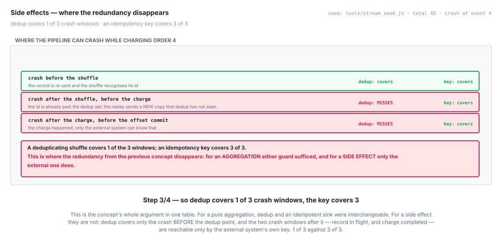

This is the concept's whole argument in one table. For a pure aggregation, dedup and an idempotent sink were interchangeable. For a side effect they are not: dedup covers only the crash BEFORE the dedup point, and the two crash windows after it — record in flight, and charge completed — are reachable only by the external system's own key. 1 of 3 against 3 of 3.

</details>
<details>
<summary><b>Step 4 of 4</b> — and isolating the effect at the boundary shrinks its exposure</summary>

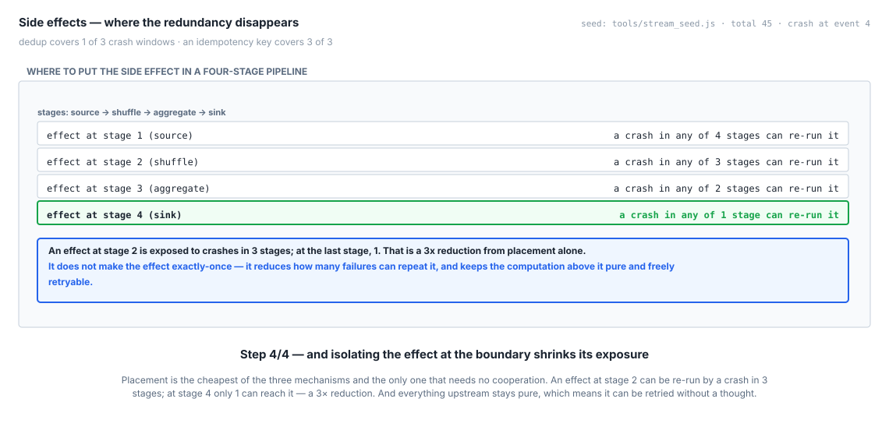

Placement is the cheapest of the three mechanisms and the only one that needs no cooperation. An effect at stage 2 can be re-run by a crash in 3 stages; at stage 4 only 1 can reach it — a 3× reduction. And everything upstream stays pure, which means it can be retried without a thought.

</details>

<sub>The crash-window coverage counts and the placement exposure figures are computed and asserted. Generated by `node tools/gen_ch05.js`.</sub>

<!-- ch05-effects:end -->

<!-- ch05-effects-memory:begin — generated by tools/gen_ch05.js; do not hand-edit -->

#### Side effects — stack and heap at every step

**What is being answered.** Why a deduplicating shuffle and an idempotency key are interchangeable for an aggregation and not for a charge — by scoring each against every crash point.

`charge(proc, key, amount)` makes the decision **inside the processor**, which matters because that is the only state that survives the pipeline's crash. Step 1 shows the early return leaving `totalCharged` at 6.

Step 2 is the failure mode worth remembering: `keyFor(e, false)` returns a fresh `"send-N"` per attempt, so the processor sees a new key and charges 12. Everything else about the pipeline is correct. And `coverage` scores the two guards at 1 and 3 of 3.

The animation steps through the code, holding each line long enough to read the STACK (call frames and their locals) and the HEAP (allocated arrays and objects) as they are AT THAT MOMENT. Expand any step to study it on its own.



<details>
<summary><b>Step 1 of 4</b> — the processor is the only component that can recognise a repeat</summary>


On the second pass `proc.chargedKeys` already contains "order-4", so the function returns before touching `totalCharged`. It stays 6. Note where that decision is made: inside the processor's state, which is the only state that survived the pipeline's crash.

</details>
<details>
<summary><b>Step 2 of 4</b> — a key generated at SEND TIME defeats the whole mechanism</summary>

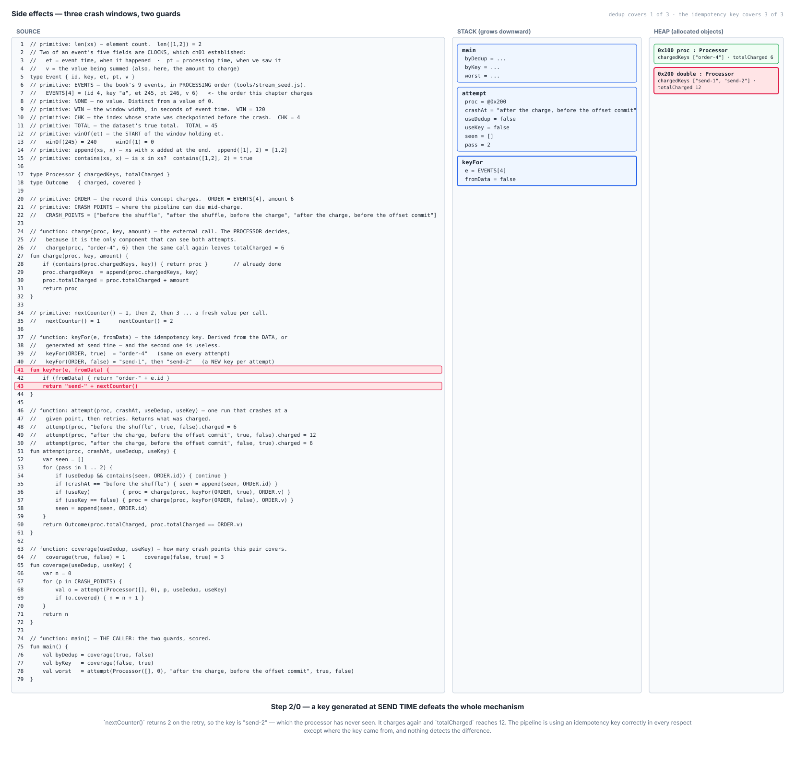

`nextCounter()` returns 2 on the retry, so the key is "send-2" — which the processor has never seen. It charges again and `totalCharged` reaches 12. The pipeline is using an idempotency key correctly in every respect except where the key came from, and nothing detects the difference.

</details>
<details>
<summary><b>Step 3 of 4</b> — dedup covers 1 crash point, and misses the other 2</summary>

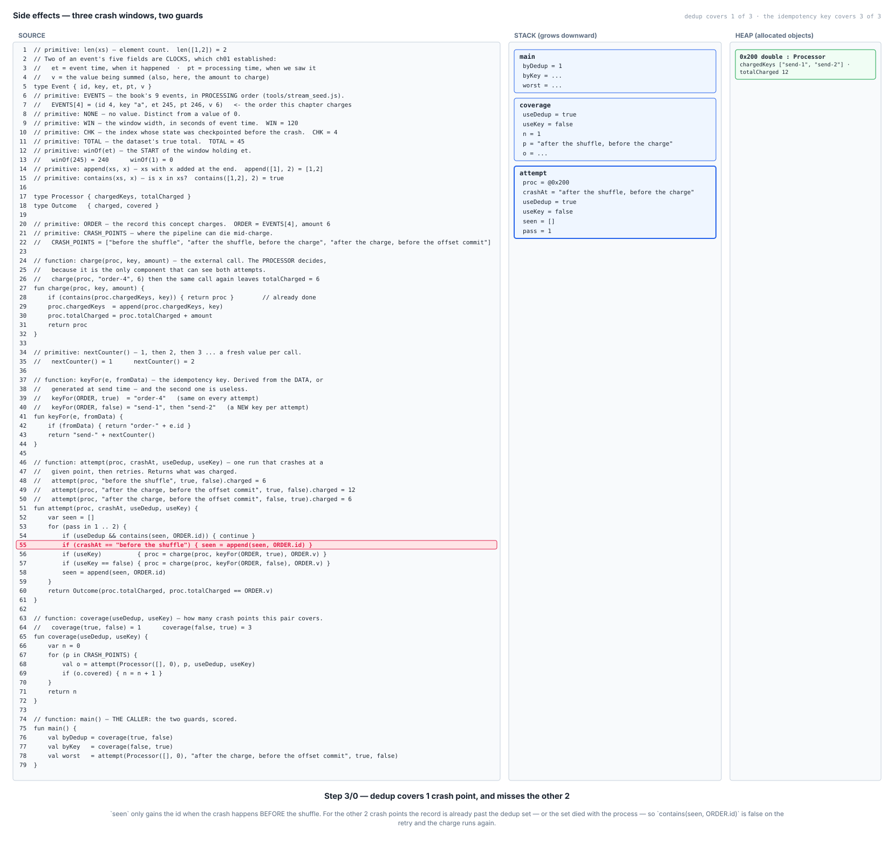

`seen` only gains the id when the crash happens BEFORE the shuffle. For the other 2 crash points the record is already past the dedup set — or the set died with the process — so `contains(seen, ORDER.id)` is false on the retry and the charge runs again.

</details>
<details>
<summary><b>Step 4 of 4</b> — so the two guards are NOT interchangeable here</summary>

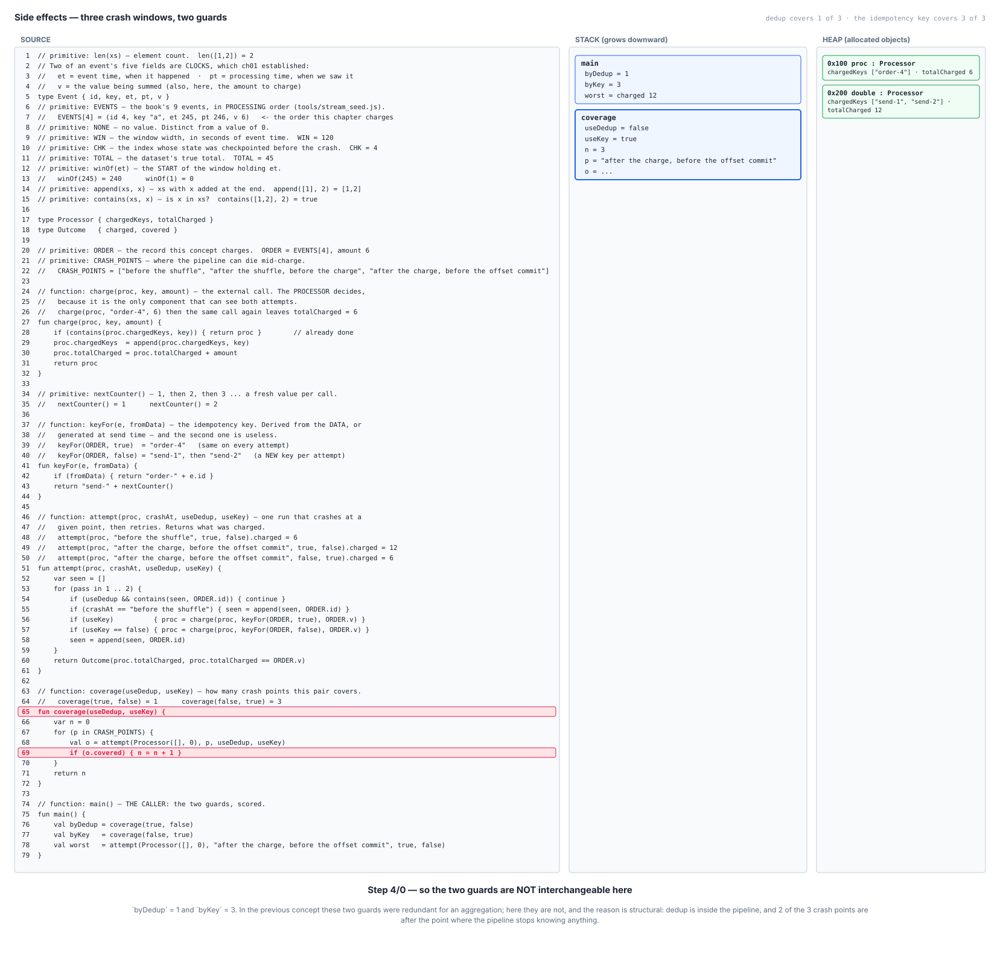

`byDedup` = 1 and `byKey` = 3. In the previous concept these two guards were redundant for an aggregation; here they are not, and the reason is structural: dedup is inside the pipeline, and 2 of the 3 crash points are after the point where the pipeline stops knowing anything.

</details>

<sub>Both coverage counts and the double-charge total are computed and asserted. Generated by `node tools/gen_ch05.js` on `tools/memkit.js`.</sub>

<!-- ch05-effects-memory:end -->


## Links & The Bigger Picture

Concepts this chapter mentions but does not fully unpack are linked below — each pointer names the chapter where the concept is covered in depth and gives a concrete example that ties the two chapters together.

- **[Chapter 7: The Practicalities of Persistent State → Consistency and recovery](ch07-the-practicalities-of-persistent-state.md#consistency-and-recovery)** — exactly-once state recovery needs a checkpoint that pairs state with the source offset — ch07 covers that machinery (barriers, state stores, aligned snapshots).
  - _Example:_ ch05's "replayable source + dedup shuffle + idempotent sink" is ch07's checkpoint { count: {42:13}, offset: 500 } resumed at 501: the state and offset align so no record is lost or double-counted.
- **[Chapter 6: Streams and Tables → The duality](ch06-streams-and-tables.md#the-duality)** — retractions — the correction mechanism ch05 uses for idempotent effects — are the changelog view of a table update.
  - _Example:_ ch05's "SET 42 -> 10 instead of ADD 10" is ch06's (old, new) changelog pair: retract the old value, set the new one, so two deliveries still leave one effect.
- **[Chapter 4: Advanced Windowing → Session semantics and pitfalls](ch04-advanced-windowing.md#session-semantics-and-pitfalls)** — accumulating-and-retracting is the windowing-side twin of exactly-once — a late event that changes an emitted result must retract the old pane before emitting the new one.
  - _Example:_ ch05's dedup makes 2 deliveries → 1 effect; ch04's late session merge retracts s1 (3) and s2 (2) before emitting sMerged (6) so the sink shows 6, not 11.
- **[Chapter 2: The What, Where, When, and How of Data Processing → How — accumulation](ch02-the-what-where-when-and-how-of-data-processing.md#how--accumulation)** — the "how" axis (accumulation modes) is where retraction semantics are defined for panes, which ch05 then applies to side effects.
  - _Example:_ ch05's idempotent sink is ch02's accumulating-and-retracting mode (3 − 3 + 4 = 4): the retraction undoes the old value exactly once before the new one lands.

## System Design Interview

> **The question:** Design a payment pipeline that charges a card exactly once. Premise: the pipeline can crash and retry after a timeout, so the sink must be idempotent on an idempotency key and the shuffle must dedup, otherwise a retry double-charges order-99.

**The pipeline:** replayable source (offset) -> dedup shuffle -> idempotent sink (idempotency key) -> external system

<a href="../diagrams/d2/decomp/ch05-0.png">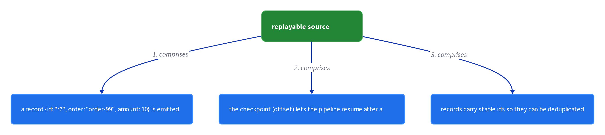</a>

### replayable source (offset)

_Role: replayable source — emits records with stable ids and a checkpoint_

- a record {id: "r7", order: "order-99", amount: 10} is emitted
- the checkpoint (offset) lets the pipeline resume after a crash
- records carry stable ids so they can be deduplicated

### dedup shuffle

_Role: dedup shuffle — drops duplicate record deliveries_

- the receiver keeps seen = { r1, r2, r3 }
- first delivery of r7 records it -> seen grows to { r1, r2, r3, r7 }
- a retry of r7 is dropped because the id is already seen

### idempotent sink (idempotency key)

_Role: idempotent sink — applies effects exactly once_

- the sink writes with an idempotency key = order-99
- a SET/upsert replaces the value rather than incrementing
- a retry with the same key is a no-op at the sink

### external system

_Role: external system — the outside-world effect_

- the payment API deduplicates on the idempotency key
- a new key charges once; a seen key returns the prior result
- without the key, two attempts would double-bill


<!-- ch05-system:begin — generated by tools/gen_ch05.js; do not hand-edit -->

#### Why the decisive fact lives outside the pipeline

**The question.** A payment pipeline that charges a card exactly once. It can crash and retry after a timeout, so the sink must be idempotent on an idempotency key and the shuffle must dedup — otherwise a retry double-charges.

**The pipeline:** replayable source (offset) → dedup shuffle → idempotent sink (idempotency key) → external system.

The design's whole difficulty is that **the decisive fact lives in the fourth stage**. Whether order 4 has already been charged is known only by the processor; every mechanism in the first three stages is an attempt not to have to know it, and only the idempotency key actually asks.

**Trace the crash and retry:**

1. Record id 4 passes the dedup shuffle; the seen-set gains id 4.
2. The sink calls `charge("order-4", 6)`; the processor charges 6 and records the key.
3. The pipeline crashes **before committing the offset**. The charge happened; the pipeline does not know.
4. Replay re-reads from the old offset. Record id 4 arrives again — **and the seen-set died with the process**, so it looks new.
5. The sink calls `charge("order-4", 6)` again; the processor recognises the key and does not charge.

Total charged: **6**, not 12.

**Step 4 is where the earlier redundancy breaks down concretely.** The dedup seen-set was in memory and is gone, so the replayed record is indistinguishable from a new one. The only state that survived the crash lives in the payment processor, which is why the key is the mechanism and the shuffle is an optimisation.

**Two-phase commit is the alternative.** It reaches exactly-once without a key, and it costs a blocking coordinator plus an in-doubt state: coordinator dead after "prepare", where committing may double-charge and aborting may lose a legitimate payment. There is no safe default, so a human resolves it.

#### When this design works, and the four things it does not settle

**It works when the processor supports an idempotency key and the key can be derived from the order.** Both halves are required, and both are checked before anything else in the design.

**Keep the dedup shuffle anyway.** It is cheap, it covers the crash window before the dedup point, and it reduces load on the processor. Treat it as an optimisation rather than as a guarantee.

**Prefer this to 2PC whenever the choice exists**, for the reason above: 2PC's in-doubt state has no safe resolution.

**What this design does NOT settle — four gaps:**

1. **The key requires the processor to support it.** If it does not, this design does not degrade gracefully — it is simply unavailable, and 2PC is the fallback with all of its cost.
2. **The key must be derived from the data.** `"order-4"` works; a key generated at send time produces a second charge with extra steps, and **nothing in the pipeline can detect that**. It is a correct-looking pipeline that double-charges.
3. **The dedup seen-set is unbounded state.** Bounding it by a window means dedup stops working past that horizon, so its 1-of-3 coverage is time-limited as well as partial.
4. **Replay protects completeness only as far back as the source's retention.** Beyond that the 23 outcome is reachable again, and no downstream guard helps — because dedup and idempotency are subtractive and cannot add a record back.

#### Visual walkthrough — four stages, five steps, one charge

The animation loops through all 4 steps. Expand any step to study it on its own.



<details>
<summary><b>Step 1 of 4</b> — the pipeline, and the one stage that touches the world</summary>


Four stages, and the design's whole difficulty is that the decisive fact lives in the fourth. The source protects completeness and has no substitute; the dedup shuffle covers 1 of 3 crash windows; the idempotency key covers 3. Note that the third mechanism depends on the external system offering it — the design has a dependency it cannot satisfy itself.

</details>
<details>
<summary><b>Step 2 of 4</b> — the retry, traced — order 4 charged once</summary>

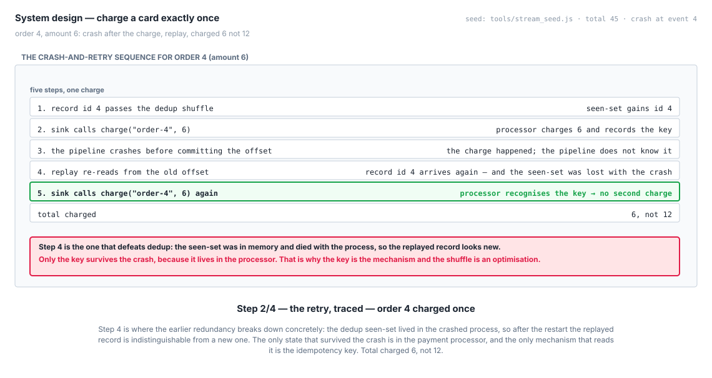

Step 4 is where the earlier redundancy breaks down concretely: the dedup seen-set lived in the crashed process, so after the restart the replayed record is indistinguishable from a new one. The only state that survived the crash is in the payment processor, and the only mechanism that reads it is the idempotency key. Total charged 6, not 12.

</details>
<details>
<summary><b>Step 3 of 4</b> — two-phase commit is the alternative, and it is worse</summary>

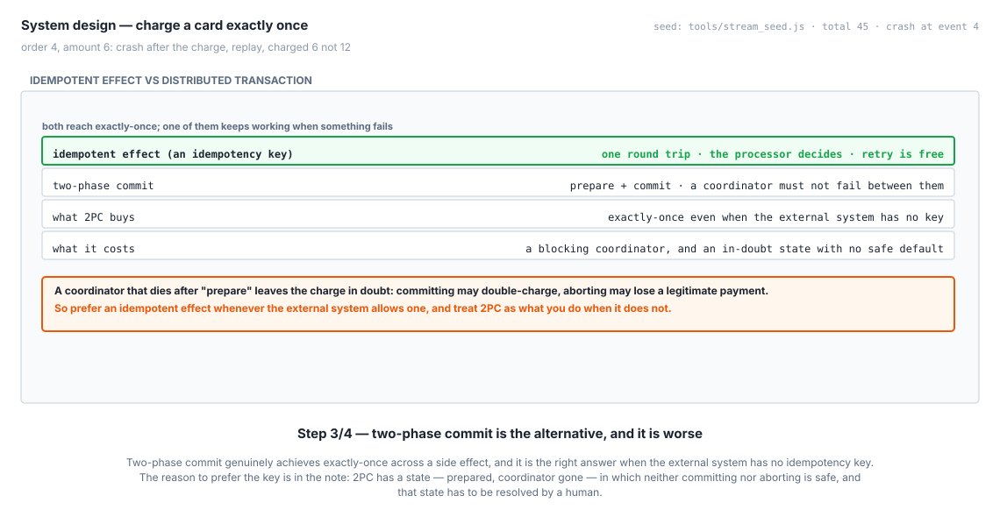

Two-phase commit genuinely achieves exactly-once across a side effect, and it is the right answer when the external system has no idempotency key. The reason to prefer the key is in the note: 2PC has a state — prepared, coordinator gone — in which neither committing nor aborting is safe, and that state has to be resolved by a human.

</details>
<details>
<summary><b>Step 4 of 4</b> — and what this design does NOT settle</summary>

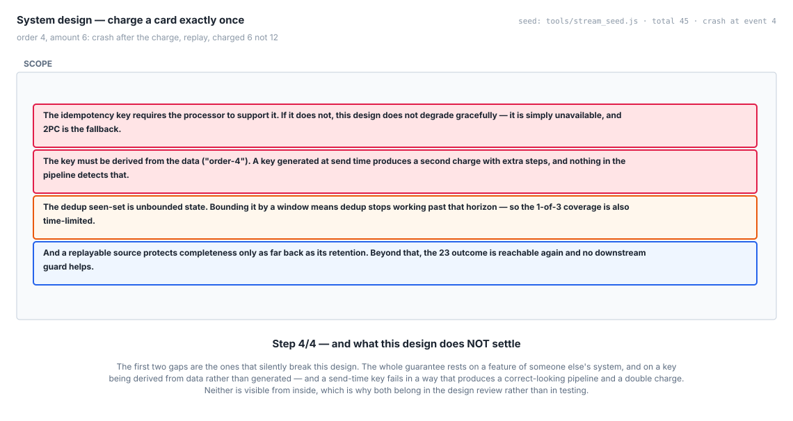

The first two gaps are the ones that silently break this design. The whole guarantee rests on a feature of someone else's system, and on a key being derived from data rather than generated — and a send-time key fails in a way that produces a correct-looking pipeline and a double charge. Neither is visible from inside, which is why both belong in the design review rather than in testing.

</details>

<sub>The charge sequence and both coverage counts are computed from the seed and asserted. Generated by `node tools/gen_ch05.js`.</sub>

<!-- ch05-system:end -->

<!-- ch05-system-memory:begin — generated by tools/gen_ch05.js; do not hand-edit -->

#### The payment pipeline — stack and heap at every step

**What is being answered.** Why the dedup shuffle does not save this pipeline — as a crash that is traced through the one line that matters.

`crash(pipe)` is the step to read twice: it returns `Pipeline(pipe.offset, [])`. The **offset survives** because it was committed; the **seen-set does not** because it was in memory. So the replay re-reads record 4 *and* the shuffle thinks it is new.

Everything then rests on `charge`'s early return, which reads `proc.chargedKeys` — the only state that lived outside the crashed process. With it: 6. Without it: 12.

The animation steps through the code, holding each line long enough to read the STACK (call frames and their locals) and the HEAP (allocated arrays and objects) as they are AT THAT MOMENT. Expand any step to study it on its own.



<details>
<summary><b>Step 1 of 4</b> — pass 1 — the dedup set admits it, and the charge lands</summary>


`pipe.seen` is empty, so the record is admitted, and the key is built from `e.id` — `"order-4"`, derived from the data. `totalCharged` goes 0 → 6. Everything about this pass is correct, which is the point: the problem is entirely in what happens next.

</details>
<details>
<summary><b>Step 2 of 4</b> — the crash takes the seen-set and leaves the offset</summary>

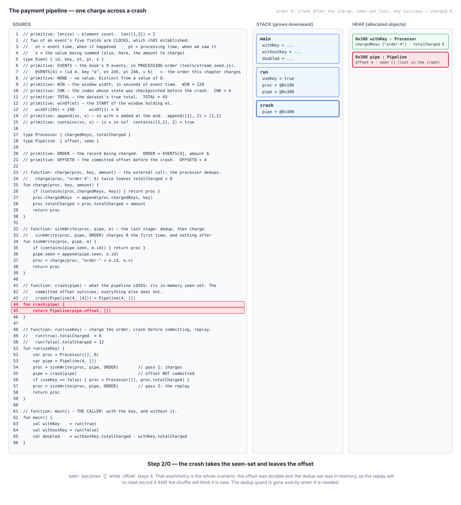

`seen` becomes `[]` while `offset` stays 4. That asymmetry is the whole scenario: the offset was durable and the dedup set was in memory, so the replay will re-read record 4 AND the shuffle will think it is new. The dedup guard is gone exactly when it is needed.

</details>
<details>
<summary><b>Step 3 of 4</b> — pass 2 — dedup lets it through, and the KEY stops it</summary>

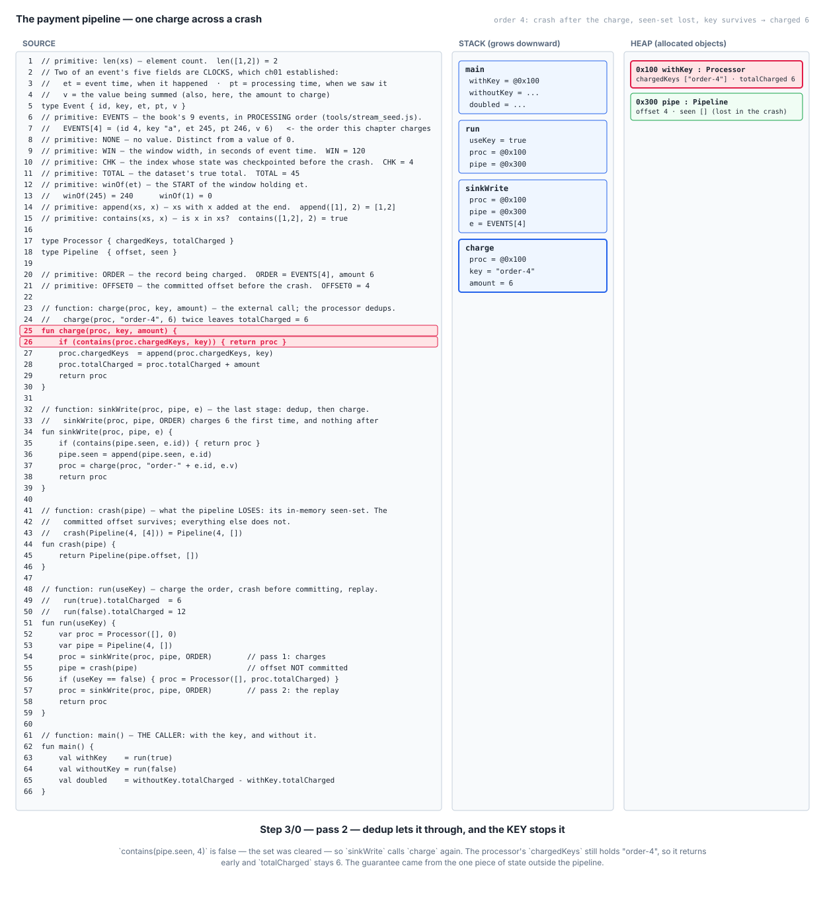

`contains(pipe.seen, 4)` is false — the set was cleared — so `sinkWrite` calls `charge` again. The processor's `chargedKeys` still holds "order-4", so it returns early and `totalCharged` stays 6. The guarantee came from the one piece of state outside the pipeline.

</details>
<details>
<summary><b>Step 4 of 4</b> — and without the key the same run charges 12</summary>

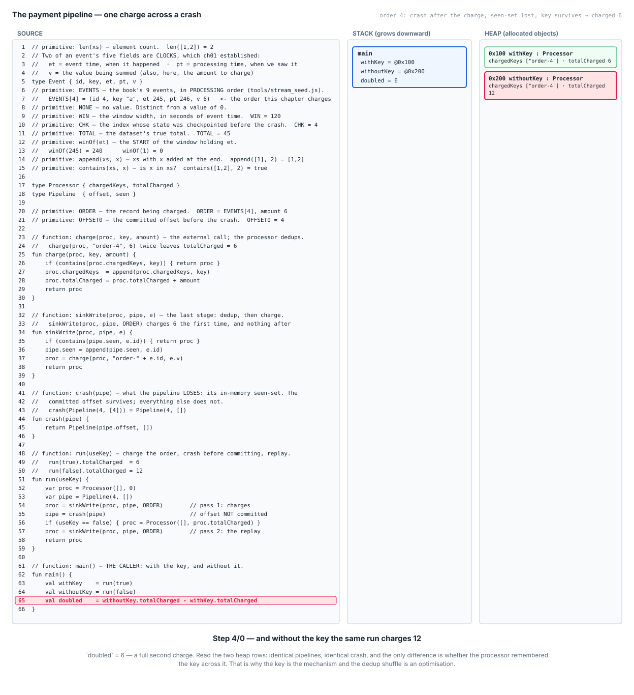

`doubled` = 6 — a full second charge. Read the two heap rows: identical pipelines, identical crash, and the only difference is whether the processor remembered the key across it. That is why the key is the mechanism and the dedup shuffle is an optimisation.

</details>

<sub>Both charge totals are computed from the seed and asserted. Generated by `node tools/gen_ch05.js` on `tools/memkit.js`.</sub>

<!-- ch05-system-memory:end -->

## Interview Questions

### Q1

A payment pipeline charges cards from a stream; after a crash, some charges were retried and customers were billed twice.

**Interviewer's question:** How do you guarantee a charge happens exactly once when the pipeline can crash and retry?

**Solution:** Give each charge an idempotency key (e.g. order id) and have the payment API deduplicate on it; make the sink idempotent so a retry is a no-op rather than a second charge.

**System-design components:**
- Idempotency key — stable per-order id
- Idempotent sink — SET/upsert, not increment
- Replayable source — Kafka offset
- Dedup — drop duplicate deliveries

```java
// order-99 charge $10
//   attempt 1 -> API sees key new -> charge, ledger 0->10
//   retry      -> API sees key seen -> no-op, ledger stays 10
//   without key: 2 attempts -> ledger 0->10->20 (double bill)
```

_This is exactly the idempotency-key side-effect material in this chapter._

_Covers:_ 2. Idempotency · 6. Side effects · 7. Idempotency key vs two-phase commit

_From the 28 problems:_ 26-payment-system

### Q2

A metrics pipeline recomputes per-key counts from a replayable source after a crash, but downstream sees doubled counts.

**Interviewer's question:** Why do the counts double, and how do you make them exactly-once?

**Solution:** The retried records double-count because the sink is non-idempotent; make the sink an idempotent upsert (set the count) and deduplicate records at the shuffle.

**System-design components:**
- Replayable source — offset
- Dedup — record ids
- Idempotent sink — upsert count

```java
// count before crash = 10
//   replay delivers same records -> dedup drops duplicates
//   sink upserts count = 10 (SET), not += 10
//   -> count stays 10, not 20
```

_This is exactly the end-to-end exactly-once material in this chapter._

_Covers:_ 3. Shuffle deduplication · 4. Replayable sources · 5. End-to-end exactly-once

_From the 28 problems:_ 20-metrics-monitoring · 21-ad-click-aggregation

## Key Concepts

### The Problem

**1. Retries are unavoidable.** Exactly-once is the property that a retried record does not affect the output twice.


### The Solution

An idempotent operation has the same effect whether run once or many times — SET 42 -> 10 is idempotent, ADD 10 is not.

```java
// order-99 charge $10
//   attempt 1 -> API sees key new -> charge, ledger 0->10
//   retry      -> API sees key seen -> no-op, ledger stays 10
//   without key: 2 attempts -> ledger 0->10->20 (double bill)
```


### Key Facts

| Fact | Detail | In the wild |
|---|---|---|
| 2. Idempotency | An idempotent operation has the same effect whether run once or many times — SET 42 -> 10 is idempotent, ADD 10 is not. | HTTP PUT and upserts are idempotent; a naive POST increment is not. |
| 3. Shuffle deduplication | The receiver keeps a set of already-seen record ids and drops duplicates — exactly-once delivery through the shuffle. | Beam's exactly-once shuffle and Flink's checkpoint barrier do this. |
| 4. Replayable sources | A replayable source exposes a checkpoint (offset) and its records carry stable ids, so re-reading is deduplicable. | Kafka consumer offsets and file offsets are the canonical checkpoints. |
| 5. End-to-end exactly-once | End-to-end exactly-once composes a replayable source, a deduplicating shuffle, and an idempotent sink. | Kafka -> Flink -> idempotent sink is the reference architecture. |
| 6. Side effects | Side effects are the hard part of exactly-once; they need idempotency keys or a two-phase commit. | Stripe's Idempotency-Key header is the production form. |
| 7. Idempotency key vs two-phase commit | An idempotency key is cheap and robust; a two-phase commit is expensive and fragile. | Payment APIs accept idempotency keys; XA two-phase commit is avoided in stream processing. |
| 8. Isolate side effects | Keep the main computation pure and push side effects to the very end of the pipeline. | Enrich -> compute -> idempotent upsert is the standard Dataflow shape. |


### Tradeoffs & When

- An idempotency key is cheap and robust; a two-phase commit is expensive and fragile.
- Keep the main computation pure and push side effects to the very end of the pipeline.


### Real-World Examples

- **Stripe** — Idempotency-Key header makes payment retries safe
- **Apache Kafka** — Idempotent producer plus transactions for exactly-once semantics
- **Apache Flink** — Checkpointing plus two-phase commit sinks for end-to-end exactly-once
- **Google MillWheel** — Exactly-once stream processing at internet scale


<details><summary>All concepts (index)</summary>

### Why: 1. Retries are unavoidable

**Why.** Crashes and timeouts force retries, and a naive retry double-counts.

**Claim.** Exactly-once is the property that a retried record does not affect the output twice.

**Grounding.** The book defines exactly-once as each record affecting the output exactly once.

**In the wild.** Kafka's exactly-once semantics and Flink's two-phase commit both target this.

<a href="../diagrams/d2/card/ch05-0.png">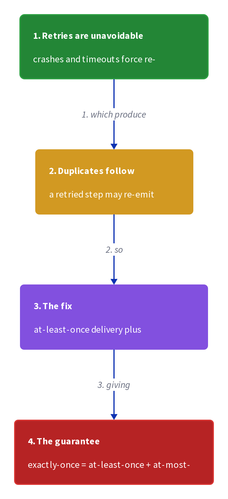</a>
### Property: 2. Idempotency

**Why.** If an operation can be replayed without changing the result, retries are harmless.

**Claim.** An idempotent operation has the same effect whether run once or many times — SET 42 -> 10 is idempotent, ADD 10 is not.

**Grounding.** Idempotency is the property that makes sinks tolerate retries.

**In the wild.** HTTP PUT and upserts are idempotent; a naive POST increment is not.

<a href="../diagrams/d2/card/ch05-1.png">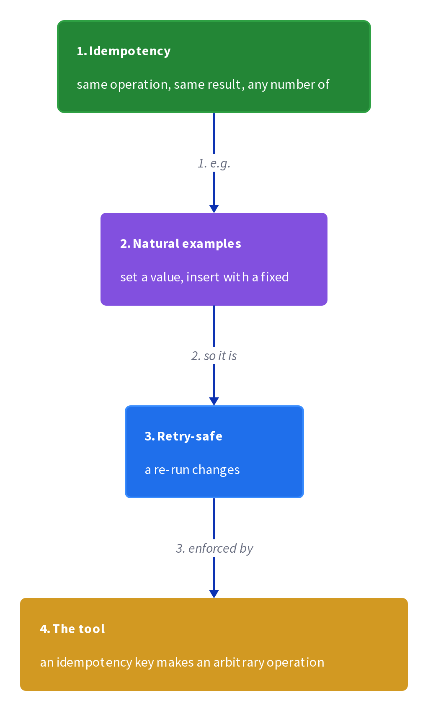</a>
### Mechanism: 3. Shuffle deduplication

**Why.** Records moving between stages can be delivered more than once after a crash.

**Claim.** The receiver keeps a set of already-seen record ids and drops duplicates — exactly-once delivery through the shuffle.

**Grounding.** Dedup turns two deliveries into one effect.

**In the wild.** Beam's exactly-once shuffle and Flink's checkpoint barrier do this.

<a href="../diagrams/d2/card/ch05-2.png">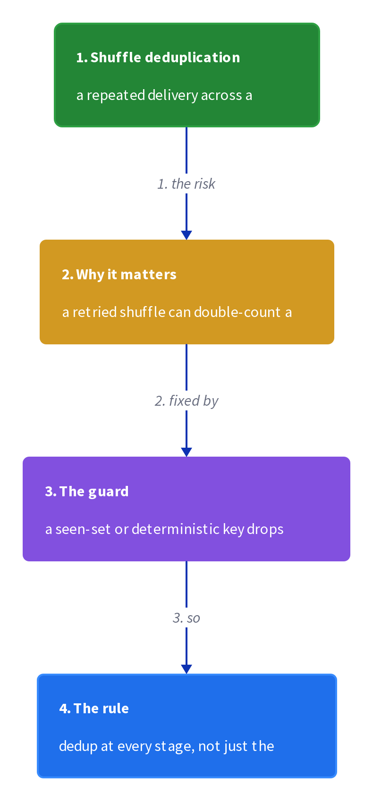</a>
### Source: 4. Replayable sources

**Why.** A source must be able to recover from a crash without losing or duplicating records.

**Claim.** A replayable source exposes a checkpoint (offset) and its records carry stable ids, so re-reading is deduplicable.

**Grounding.** Replay + stable ids = the source side of end-to-end exactly-once.

**In the wild.** Kafka consumer offsets and file offsets are the canonical checkpoints.

<a href="../diagrams/d2/card/ch05-3.png">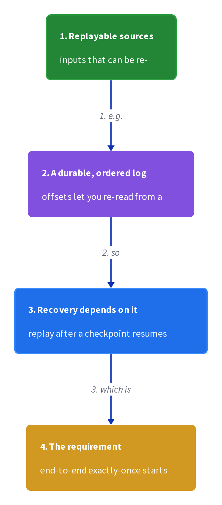</a>
### Composition: 5. End-to-end exactly-once

**Why.** Each stage has its own failure mode, so a single dedup is not enough.

**Claim.** End-to-end exactly-once composes a replayable source, a deduplicating shuffle, and an idempotent sink.

**Grounding.** Drop any one of the three and the guarantee breaks.

**In the wild.** Kafka -> Flink -> idempotent sink is the reference architecture.

<a href="../diagrams/d2/card/ch05-4.png">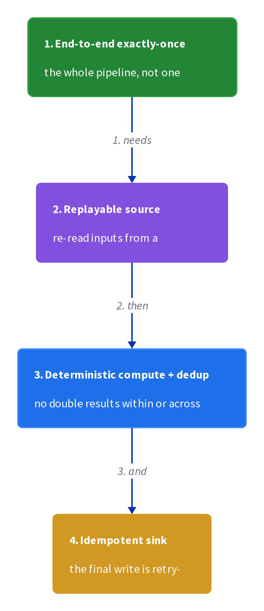</a>
### Hard part: 6. Side effects

**Why.** An external effect — an email, a charge, an API call — cannot be undone by recomputing state.

**Claim.** Side effects are the hard part of exactly-once; they need idempotency keys or a two-phase commit.

**Grounding.** Sending an email twice is visible; a double increment is money.

**In the wild.** Stripe's Idempotency-Key header is the production form.

<a href="../diagrams/d2/card/ch05-5.png">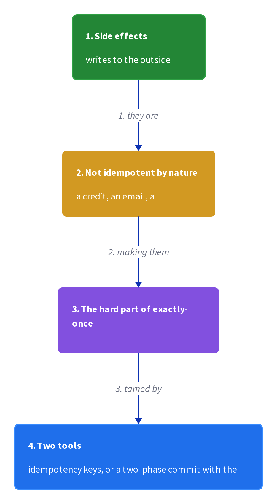</a>
### Pattern: 7. Idempotency key vs two-phase commit

**Why.** Making an external side effect exactly-once has two options, and they differ sharply in cost.

**Claim.** An idempotency key is cheap and robust; a two-phase commit is expensive and fragile.

**Grounding.** Prefer idempotent effects over distributed transactions whenever the external system supports them.

**In the wild.** Payment APIs accept idempotency keys; XA two-phase commit is avoided in stream processing.

<a href="../diagrams/d2/card/ch05-6.png">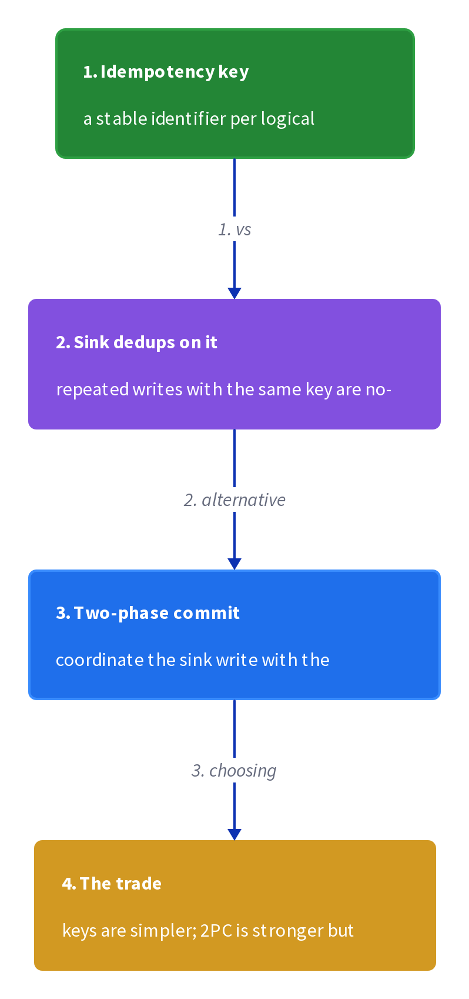</a>
### Boundary: 8. Isolate side effects

**Why.** Retries are most controllable when the effect is one idempotent write at the edge.

**Claim.** Keep the main computation pure and push side effects to the very end of the pipeline.

**Grounding.** A pure core plus a thin idempotent boundary is the cleanest exactly-once design.

**In the wild.** Enrich -> compute -> idempotent upsert is the standard Dataflow shape.

<a href="../diagrams/d2/card/ch05-7.png">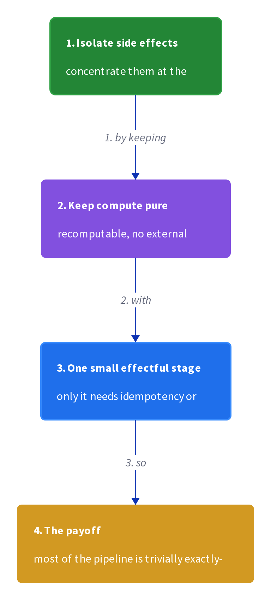</a>

</details>


## Quiz

1. What does exactly-once mean in this book?

   - A. No operation is ever retried
   - B. Each record affects the output exactly once
   - C. The pipeline never crashes
   - D. Every window emits exactly one pane

<details><summary>Reveal answer</summary>

**B.** Exactly-once is the property that a retried record does not affect the output twice.

</details>

2. Which operation is idempotent?

   - A. ADD 10
   - B. SET 42 -> 10
   - C. INCREMENT
   - D. APPEND

<details><summary>Reveal answer</summary>

**B.** SET replaces the value, so running it twice has the same effect as once.

</details>

3. What are the three parts of end-to-end exactly-once?

   - A. Source, cache, queue
   - B. Replayable source, deduplicating shuffle, idempotent sink
   - C. Producer, broker, consumer
   - D. Trigger, watermark, window

<details><summary>Reveal answer</summary>

**B.** End-to-end exactly-once composes a replayable source, a deduplicating shuffle, and an idempotent sink.

</details>

4. Why are side effects the hard part of exactly-once?

   - A. They are slow
   - B. They touch the outside world and cannot be recomputed
   - C. They use too much memory
   - D. They require watermarks

<details><summary>Reveal answer</summary>

**B.** An email or charge cannot be undone by recomputation, so it needs idempotency or a two-phase commit.

</details>

5. Which is preferred for making a charge exactly-once?

   - A. Two-phase commit
   - B. Idempotency key
   - C. Retry without a key
   - D. Ignoring failures

<details><summary>Reveal answer</summary>

**B.** An idempotency key is cheap and robust; two-phase commit is expensive and fragile.

</details>

## Sources

- [Akidau et al. — "MillWheel" (VLDB 2013)](https://research.google/pubs/pub41378/) — Exactly-once stream processing and the side-effect problem in production
- [Confluent — "Exactly-Once Semantics Are Possible: Here's How Apache Kafka Does It"](https://www.confluent.io/blog/exactly-once-semantics-are-possible-heres-how-apache-kafka-does-it/) — How an idempotent producer plus transactions give end-to-end exactly-once
- [Stripe — Idempotency documentation](https://stripe.com/docs/idempotency) — The Idempotency-Key pattern for retry-safe side effects
- [Apache Flink — Stateful stream processing](https://nightlies.apache.org/flink/flink-docs-stable/docs/concepts/stateful-stream-processing/) — Checkpointing and exactly-once state as the engine guarantee

