# Chapter 5: Exactly-Once and Side Effects

> Exactly-once means every record affects the output exactly once, and it decomposes into two problems — replaying sources and shuffles without double-counting (solved with deduplication and idempotency) and external side effects (the genuinely hard part).

_Also known as: SS Ch05 · Exactly-Once · Idempotency · Deduplication · Side Effects · End-to-End Exactly-Once_

## Flow

### What exactly-once means

> **Why this matters:** "Exactly-once" is used loosely, so this section fixes the definition — it is about each record affecting the output exactly once, not about a magic guarantee that nothing is ever retried.

1. **Accuracy and completeness** — A correct pipeline is **accurate** (each result is right) and **complete** (every input contributes). Exactly-once means each record's contribution appears exactly once.

2. **Retries are the enemy of once** — In a distributed system, records are retried after crashes and timeouts. **Exactly-once is the property that a retried record does not count twice.**

3. **Two sub-problems** — Exactly-once splits into **deduplicating records as they move between stages** (sources and shuffles) and **making the final effect idempotent** (sinks and side effects).

4. **Exactly-once state vs exactly-once effects** — Making per-key state exactly-once is easy (recompute a deterministic value); making an **external side effect** exactly-once (send one email, charge one card) is the hard part.

<!-- ch05-meaning:begin — generated by tools/gen_ch05.js; do not hand-edit -->

#### Why exactly-once is two guarantees, and which half is hard

A correct pipeline is **accurate** (each result is right) and **complete** (every input contributes). Exactly-once means each record's contribution appears exactly once — no more and no less.

Those are separate failures with separate causes. Lose the 4 records after a crash and the total is **23**, 49% low. Apply the same 4 twice and it is **67**, 49% high. Same size, opposite sign — which is exactly why one can mask the other in an aggregate.

**One duplicate record costs `v` divided by its window's total**, so the damage is not a fixed percentage. Delivering id 8 twice takes its window from 8 to 16 (**+100%**); the least damaging duplicate in this dataset is +14%. Duplicate damage concentrates in **thin** windows, which are the ones nobody watches.

**And retries are not optional.** A worker crashes mid-batch and the batch is re-sent. A send times out but actually succeeded, and the sender cannot tell. A checkpoint commits state but not the offset. Each produces a duplicate — and the alternative, never retrying, turns every one of them into **lost** data instead. So a distributed pipeline is at-least-once by default, and exactly-once is built on top of retries rather than instead of them.

**The problem then splits in two, and the halves are not equally hard.** Per-key state is a deterministic function of the records: recompute window [12:08, 12:10) and you get 8 every time, so it is idempotent by construction. An external effect — charge order 4 for 6 — cannot be recomputed. The money has moved, nothing in the pipeline records that, and the only system that knows is the one you called.

#### When you need exactly-once, and when at-least-once is the right answer

**At-least-once is fine when the sink is idempotent anyway** — a cache you overwrite, a gauge you set, a search index keyed by document id. Re-delivering a record costs a little work and changes nothing, so the extra machinery buys nothing.

**At-most-once is fine when a loss is cheaper than a duplicate** and the data is statistical — a sampled metric, a debug trace. Rare, but it exists, and it is far cheaper to build.

**You need exactly-once when a duplicate is visible or expensive**: money, an email, a count someone reconciles. The test is not "is the data important" but "would a second copy be noticed" — and in a thin window, a single duplicate is a 100% error.

**What this does not settle:** which mechanism to use where. Completeness and accuracy have different fixes at different stages, and the state half and the effect half of exactly-once need entirely different machinery. The next two concepts take them in turn — and the second one is where the usual "source + shuffle + sink" rule turns out to be imprecise.

#### Visual walkthrough — two failures, one duplicate, and the split

The animation loops through all 4 steps. Expand any step to study it on its own.


<details>
<summary><b>Step 1 of 4</b> — accuracy and completeness are two different failures</summary>


Exactly-once is two guarantees, not one. Losing 4 records takes the total to 23; applying the same 4 twice takes it to 67. Both are 49% wrong and neither is detectable from the number alone — and they are fixed by different mechanisms, at different stages.

</details>
<details>
<summary><b>Step 2 of 4</b> — one duplicate record, and what it does to a window</summary>


The cost of one duplicate is not a fixed percentage — it is `v` over the window's total, so the same retry is a 14% error in one window and a 100% error in another. That is worth knowing because it means duplicate damage concentrates in the thin windows, which are exactly the ones nobody is watching.

</details>
<details>
<summary><b>Step 3 of 4</b> — retries are the enemy, and they are not optional</summary>


Retries are not a flaw to be removed. A timed-out send that actually succeeded is indistinguishable from one that failed, so the sender must choose between retrying (risking a duplicate) and not retrying (risking a loss). Exactly-once is the property that makes the first choice safe — it is built on top of at-least-once, not as an alternative to it.

</details>
<details>
<summary><b>Step 4 of 4</b> — and exactly-once STATE is easy; exactly-once EFFECTS are not</summary>


This split is the chapter's structure. Making per-key state exactly-once is nearly free: the state is a deterministic function of the records, so recomputing gives 8 every time. Making an external effect exactly-once is a different problem entirely — the money has moved, nothing in the pipeline records that, and the only system that knows is the one you are calling.

</details>

<sub>The loss and duplication totals, and every per-window duplicate cost, are computed from the seed and asserted. Generated by `node tools/gen_ch05.js`.</sub>

<!-- ch05-meaning:end -->

<!-- ch05-meaning-memory:begin — generated by tools/gen_ch05.js; do not hand-edit -->

#### Accuracy and completeness — stack and heap at every step

**What is being answered.** Why exactly-once is two guarantees — as three delivery lists built by one function and summed by another.

`deliver(mode)` produces the list of record ids a stage actually receives: 9 ids for exactly-once, 5 for at-most-once (the replay never happens), and 13 for at-least-once (the replay is not deduplicated).

`aggregate(ids)` then sums them, and step 3 is the point: it is **identical and correct** for all three lists and produces 23, 45 and 67. The duplicates are visible in the list and invisible in the number.

The animation steps through the code, holding each line long enough to read the STACK (call frames and their locals) and the HEAP (allocated arrays and objects) as they are AT THAT MOMENT. Expand any step to study it on its own.


<details>
<summary><b>Step 1 of 4</b> — at-most-once DROPS everything after the checkpoint</summary>


`indexOf(EVENTS[5])` is 5, which is > CHK = 4, so the record is skipped. All 4 records after the checkpoint are dropped and the list holds 5 ids. That is a COMPLETENESS failure: the sum will be 23, and nothing downstream can recover it.

</details>
<details>
<summary><b>Step 2 of 4</b> — at-least-once APPENDS them a second time</summary>


The replayed ids are appended, so `out` holds 13 entries for 9 records — ids 5, 6, 7, 8 appear twice. That is an ACCURACY failure, and note the list itself is the evidence: the duplicates are visible here and invisible in the sum.

</details>
<details>
<summary><b>Step 3 of 4</b> — and the aggregate cannot tell the two apart</summary>


`aggregate` adds `EVENTS[id].v` for each entry and has no idea whether an id appeared before. 23, 45, 67 — three numbers from one dataset, and the function that produced them is identical and correct in all three cases.

</details>
<details>
<summary><b>Step 4 of 4</b> — one duplicate costs v / window total, so thin windows hurt</summary>


For id 8: `base` is 8 and `v` is 8, so the cost is 100%. For id 5 the same calculation gives 14%, because its window is thicker. The duplicate is identical; only the denominator differs — which is why duplicate damage concentrates where the data is thin.

</details>

<sub>All three totals and every per-window duplicate cost are computed from the seed and asserted. Generated by `node tools/gen_ch05.js` on `tools/memkit.js`.</sub>

<!-- ch05-meaning-memory:end -->

### Idempotency and deduplication

> **Why this matters:** Exactly-once is not a single mechanism — it is deduplication at the boundaries plus idempotency at the effects, so this section separates the two and shows where each applies.

1. **Idempotent operations** — An operation is **idempotent** if performing it many times has the same effect as once. **Setting a value to 10 is idempotent; incrementing by 10 is not.**

2. **Deduplicate at the shuffle** — When a stage sends records to the next, the receiver can keep a set of **already-seen record ids** and drop duplicates. This is exactly-once delivery through the shuffle.

3. **Sources need replayable, deduplicable records** — A source that can be **replayed from a checkpoint** (a Kafka offset, a file offset) and whose records carry stable ids can be re-read without double-counting.

4. **End-to-end exactly-once = source + shuffle + sink** — End-to-end exactly-once composes: a replayable source, a deduplicating shuffle, and an **idempotent sink**. Drop any one and the guarantee breaks.

<!-- ch05-dedup:begin — generated by tools/gen_ch05.js; do not hand-edit -->

#### Why a replayable source has no substitute and the other two are redundant

**Idempotent means twice is the same as once**, and the test is what the operation *names*. `SET window [12:08, 12:10) = 8` names a result: apply it any number of times and the value is 8. `ADD 8` names a change: twice gives 16.

This connects straight back to ch02. An **accumulating** pane carries the window's whole total, so it is a SET and is safe to re-deliver. A **discarding** pane carries only the delta, so it is an ADD and is not. **The accumulation mode decides whether an idempotent sink is possible at all.**

**Dedup at the shuffle** is a set of ids already accepted plus one membership test. Replay ids 5, 6, 7, 8 into it and all 4 are recognised and dropped: total 45, correct. Two things make it non-free — the ids must be **stable** across the retry (an id generated at send time gets a new value and defeats it), and the seen-set is unbounded state that needs a horizon, so dedup has a memory beyond which it stops working.

**Now put all three guards in a table.** After a crash at event 4 with the state committed and the offset not, the 8 combinations of (replayable source × deduplicating shuffle × idempotent sink) produce exactly **three** totals: 23, 45 and 67.

3 of the 8 rows reach 45, and reading them refines the usual claim. "End-to-end exactly-once = source + shuffle + sink, drop any one and it breaks" is **not quite right for an aggregation**: the replayable source is load-bearing, and then dedup **or** an idempotent sink is enough. The two accuracy guards are redundant.

**The source is different because the mechanisms are asymmetric.** Dedup and idempotency are *subtractive* — they stop a contribution counting twice, and can do nothing else. Neither can add back a record that was never re-read. So completeness has exactly one mechanism and accuracy has two.

#### When to use which guard, and where the redundancy disappears

**Always start with the source.** If it cannot replay from a committed offset, nothing downstream gets you past 23, and no amount of care elsewhere helps. This is the requirement to check before designing anything else.

**Prefer an idempotent sink to a deduplicating shuffle when you have the choice.** It needs no extra state, no id stability and no horizon — whereas the seen-set is unbounded state that must be bounded, and bounding it puts an expiry on the guarantee.

**Use the deduplicating shuffle when the sink genuinely cannot be idempotent** — when it only accepts deltas, or when the operation is an append. Then budget for the seen-set and decide its horizon deliberately.

**Use both when you want the cheap belt-and-braces**, knowing from the table that for an aggregation this is redundancy rather than defence in depth.

**What this does not settle — and it is the important one:** the redundancy above holds because a window total can be recomputed. It **disappears** the moment the sink's effect is outside the pipeline. The next concept shows the dedup shuffle covering 1 of 3 crash windows where an idempotency key covers 3 — at which point the two guards are not interchangeable at all.

#### Visual walkthrough — SET vs ADD, the seen-set, and all 8 combinations

The animation loops through all 4 steps. Expand any step to study it on its own.


<details>
<summary><b>Step 1 of 4</b> — idempotent means "twice is the same as once"</summary>


The test for idempotency is whether the operation names a result or a change. `SET = 8` is a result and survives any number of retries; `ADD 8` is a change and does not. The note connects this back to ch02: accumulating panes are SETs and discarding panes are ADDs, so that choice decides whether an idempotent sink is even possible.

</details>
<details>
<summary><b>Step 2 of 4</b> — dedup at the shuffle: a set of ids already seen</summary>


Dedup at the shuffle is a seen-set and one membership test, and it works — 45, correct. The two things that make it not free are in the note: the ids must be stable across the retry (a freshly generated id defeats it entirely), and the set itself is unbounded state that needs a horizon, so dedup has a memory beyond which it stops working.

</details>
<details>
<summary><b>Step 3 of 4</b> — the 8 combinations, and what each one actually produces</summary>


Worth reading carefully, because it refines the usual claim. "End-to-end exactly-once = source + shuffle + sink, drop any one and it breaks" is not quite right for an aggregation: the source is load-bearing, and dedup and an idempotent sink are **redundant** — either alone reaches 45. The next concept is where that redundancy disappears.

</details>
<details>
<summary><b>Step 4 of 4</b> — a replayable source is the one piece with no substitute</summary>


The asymmetry in the note is the practical takeaway. Dedup and idempotency are subtractive — they prevent double counting and can do nothing else — so the only mechanism for completeness is a source you can re-read. If a source cannot replay, no amount of care downstream gets you past 23.

</details>

<sub>The 8-row table and its 3 distinct totals are computed from the seed, and the redundancy finding is asserted. Generated by `node tools/gen_ch05.js`.</sub>

<!-- ch05-dedup:end -->

<!-- ch05-dedup-memory:begin — generated by tools/gen_ch05.js; do not hand-edit -->

#### Three guards, eight combinations — stack and heap at every step

**What is being answered.** Which of the three exactly-once guards is actually load-bearing — as one `runPipeline(replayable, dedup, idempotent)` called with different flags.

Steps 1 and 2 are the finding: `dedupOnly` and `idemOnly` both reach 45, by completely different routes. Dedup stops the record before the sink; the idempotent sink lets it through and writes a value that does not depend on what is already there. **For an aggregation they are redundant.**

Step 4 is why the source is different. `firstN` truncates the feed *before* the loop, so both guards — set to true — never see the missing records. They are subtractive, and no subtractive mechanism can add a contribution back.

The animation steps through the code, holding each line long enough to read the STACK (call frames and their locals) and the HEAP (allocated arrays and objects) as they are AT THAT MOMENT. Expand any step to study it on its own.


<details>
<summary><b>Step 1 of 4</b> — dedup drops the replayed record on a membership test</summary>


`seen` already holds id 5 from the first pass, so `contains` is true and the replayed copy is skipped before it can reach the sink. `dedupOnly` reaches 45 — correct, with a sink that merely ADDS. The guard is upstream of the sink's weakness.

</details>
<details>
<summary><b>Step 2 of 4</b> — OR the sink names the result, which makes the repeat harmless</summary>


`dedup` is false here, so the replayed id is NOT skipped — it reaches the sink. But `setRow` writes `windowTotal(w, seen)`, the window's total over distinct ids, so writing it again changes nothing. `idemOnly` also reaches 45. Two different guards, same result: they are redundant for an aggregation.

</details>
<details>
<summary><b>Step 3 of 4</b> — with neither, the add runs twice</summary>


`addRow` adds `EVENTS[5].v` = 1 to a row that already contains it. Across all 4 replayed records the total reaches 67 — DOUBLE. Nothing errored; the sink simply applied a delta it had already applied.

</details>
<details>
<summary><b>Step 4 of 4</b> — and no guard can recover a record that was never re-read</summary>


With `replayable` false the feed is truncated to 5 ids BEFORE the loop, so `dedup` and `idempotent` — both true here — never see the missing records. 23, LOST. Both accuracy guards are subtractive: they stop a contribution counting twice and can do nothing else.

</details>

<sub>All 8 combinations are computed from the seed; the three distinct totals and the redundancy finding are asserted. Generated by `node tools/gen_ch05.js` on `tools/memkit.js`.</sub>

<!-- ch05-dedup-memory:end -->

### Side effects — the hard part

> **Why this matters:** The truly hard case is when the pipeline must do something in the outside world — send an email, call a payment API — because that effect cannot be undone by recomputation, so this section covers the patterns that make side effects tractable.

1. **Why side effects resist exactly-once** — A side effect touches the outside world, and the outside world cannot be "recomputed" the way per-key state can. **Sending an email twice is visible; a database increment applied twice is money.**

2. **Make the effect idempotent** — If the external system supports idempotency (a unique id, an upsert, an idempotency key), **the pipeline can retry the effect safely** — the external system deduplicates.

3. **Isolate side effects at the boundary** — Keep the main computation pure and **push side effects to the very end** of the pipeline, where retries are most controllable and the effect is a single idempotent write.

4. **Two-phase is expensive and fragile** — True end-to-end exactly-once across an external side effect often needs a **two-phase commit**, which is expensive and fragile. **Prefer idempotent effects over distributed transactions.**

<!-- ch05-effects:begin — generated by tools/gen_ch05.js; do not hand-edit -->

#### Why the outside world cannot be recomputed, and what follows from that

**A side effect touches the outside world, and the outside world has no "recompute".** Retry the aggregation and window [12:08, 12:10) is 8 again, because the state is a function of the records. Retry `charge(order 4, 6)` and the card is charged **12**, because the money moved and nothing in the pipeline records that it did.

Worse, the pipeline **cannot tell**: a charge that timed out after succeeding looks exactly like one that failed. So it has only two options, and they are the same option — make the effect safe to repeat, or ask the external system whether it already happened.

**An idempotency key is how you ask.** First attempt: `charge("order-4", 6)`, the processor records the key and charges 6. The pipeline crashes before committing. The retry sends the same call, the processor **recognises the key**, and the total charged is 6.

Note what the key does *not* do: it does not make the effect idempotent. It moves the deduplication to the only place that can see both attempts. Two requirements follow — the key must be derived from the **data** (a key generated at send time is a second charge with extra steps), and the external system has to offer the feature at all.

**And here is where the previous concept's redundancy disappears.** There are three windows in which the pipeline can crash while charging order 4:

- **crash before the shuffle** — the record is re-sent and the shuffle recognises its id. Dedup: covers. Key: covers.
- **crash after the shuffle, before the charge** — the id is already past the dedup set; the replay sends a NEW copy that dedup has not seen. Dedup: **misses**. Key: covers.
- **crash after the charge, before the offset commit** — the charge happened; only the external system can know that. Dedup: **misses**. Key: covers.

A deduplicating shuffle covers **1 of 3**; an idempotency key covers **3 of 3**. For a pure aggregation the two guards were interchangeable. For a side effect only the external one reaches the crash windows that matter.

**Placement helps too, and it is free.** In a 4-stage pipeline (source → shuffle → aggregate → sink), an effect at stage 2 can be re-run by a crash in 3 stages; at the last stage, only 1. That is a 3× reduction in exposure from placement alone, and it keeps everything upstream pure and freely retryable.

#### When each mechanism applies, and the one you cannot provide yourself

**Use an idempotency key whenever the external system offers one** — Stripe, most payment processors, any API with an `Idempotency-Key` header, any database with upsert. It is one round trip, the retry is free, and the decision is made by the only component that can make it.

**Push the effect to the last stage, always.** It costs nothing, reduces exposure 3× here, and leaves the computation above it pure — so the expensive part of the pipeline can be retried without anyone thinking about it.

**Reach for two-phase commit only when there is no key.** It genuinely achieves exactly-once across an external effect, and it has a state — prepared, coordinator gone — in which neither committing nor aborting is safe. That state is resolved by a human, which is why it is the fallback rather than the default.

**What this does not settle, and it is a dependency rather than a gap:** the whole mechanism rests on a feature of someone else's system. If the processor has no idempotency key, this design does not degrade — it is unavailable. And if the key is generated at send time rather than derived from the order, the pipeline looks correct and double-charges, with nothing inside it able to detect the difference.

#### Visual walkthrough — no recompute, the key, the three crash windows

The animation loops through all 4 steps. Expand any step to study it on its own.


<details>
<summary><b>Step 1 of 4</b> — a side effect cannot be recomputed</summary>


The asymmetry is total. Recomputing window state gives 8 however many times you do it, because the state is a function of the records. Re-running a charge gives 12, because the money moved and nothing in the pipeline knows. And the pipeline cannot distinguish a timed-out charge that succeeded from one that failed — so it must either make repetition safe, or ask.

</details>
<details>
<summary><b>Step 2 of 4</b> — an idempotency key moves the dedup OUTSIDE</summary>


An idempotency key does not make the effect idempotent — it moves the deduplication to the only place that can see both attempts. Two requirements follow, both in the note: the key must come from the data (a send-time key is useless), and the external system has to support it. The second is a dependency you cannot work around from inside.

</details>
<details>
<summary><b>Step 3 of 4</b> — so dedup covers 1 of 3 crash windows, the key covers 3</summary>


This is the concept's whole argument in one table. For a pure aggregation, dedup and an idempotent sink were interchangeable. For a side effect they are not: dedup covers only the crash BEFORE the dedup point, and the two crash windows after it — record in flight, and charge completed — are reachable only by the external system's own key. 1 of 3 against 3 of 3.

</details>
<details>
<summary><b>Step 4 of 4</b> — and isolating the effect at the boundary shrinks its exposure</summary>


Placement is the cheapest of the three mechanisms and the only one that needs no cooperation. An effect at stage 2 can be re-run by a crash in 3 stages; at stage 4 only 1 can reach it — a 3× reduction. And everything upstream stays pure, which means it can be retried without a thought.

</details>

<sub>The crash-window coverage counts and the placement exposure figures are computed and asserted. Generated by `node tools/gen_ch05.js`.</sub>

<!-- ch05-effects:end -->

<!-- ch05-effects-memory:begin — generated by tools/gen_ch05.js; do not hand-edit -->

#### Side effects — stack and heap at every step

**What is being answered.** Why a deduplicating shuffle and an idempotency key are interchangeable for an aggregation and not for a charge — by scoring each against every crash point.

`charge(proc, key, amount)` makes the decision **inside the processor**, which matters because that is the only state that survives the pipeline's crash. Step 1 shows the early return leaving `totalCharged` at 6.

Step 2 is the failure mode worth remembering: `keyFor(e, false)` returns a fresh `"send-N"` per attempt, so the processor sees a new key and charges 12. Everything else about the pipeline is correct. And `coverage` scores the two guards at 1 and 3 of 3.

The animation steps through the code, holding each line long enough to read the STACK (call frames and their locals) and the HEAP (allocated arrays and objects) as they are AT THAT MOMENT. Expand any step to study it on its own.


<details>
<summary><b>Step 1 of 4</b> — the processor is the only component that can recognise a repeat</summary>


On the second pass `proc.chargedKeys` already contains "order-4", so the function returns before touching `totalCharged`. It stays 6. Note where that decision is made: inside the processor's state, which is the only state that survived the pipeline's crash.

</details>
<details>
<summary><b>Step 2 of 4</b> — a key generated at SEND TIME defeats the whole mechanism</summary>


`nextCounter()` returns 2 on the retry, so the key is "send-2" — which the processor has never seen. It charges again and `totalCharged` reaches 12. The pipeline is using an idempotency key correctly in every respect except where the key came from, and nothing detects the difference.

</details>
<details>
<summary><b>Step 3 of 4</b> — dedup covers 1 crash point, and misses the other 2</summary>


`seen` only gains the id when the crash happens BEFORE the shuffle. For the other 2 crash points the record is already past the dedup set — or the set died with the process — so `contains(seen, ORDER.id)` is false on the retry and the charge runs again.

</details>
<details>
<summary><b>Step 4 of 4</b> — so the two guards are NOT interchangeable here</summary>


`byDedup` = 1 and `byKey` = 3. In the previous concept these two guards were redundant for an aggregation; here they are not, and the reason is structural: dedup is inside the pipeline, and 2 of the 3 crash points are after the point where the pipeline stops knowing anything.

</details>

<sub>Both coverage counts and the double-charge total are computed and asserted. Generated by `node tools/gen_ch05.js` on `tools/memkit.js`.</sub>

<!-- ch05-effects-memory:end -->

### Google Interview Question

> **Why this matters:** A standalone interview problem, with three other surfaces the same program wears. Nothing here depends on this chapter's vocabulary: the problem, the one reframe that solves it, and the traced solution are self-contained, and the section stops where the program stops. Generated by `tools/gen_ch05_interview.js` on `tools/interviewkit.js`.

<!-- ch05-interview-memory:begin — generated by tools/gen_ch05_interview.js; do not hand-edit -->

#### The problem

> **A worker reads numbered items from a queue, transforms each one, and writes the result to a database.** It also records how far it has read, so that a restart resumes instead of starting over.
> 
> **The process can die at any instant.**
> 
> **Make it so that no item is ever processed twice and none is ever skipped.**

> `0:5  1:3  2:7  3:2  4:6  5:1  6:9  7:4  8:8` → total 45. Crash during item 3 and the obvious implementation gives **47**; swap two lines and it gives **43**.

> The effect is not idempotent — it moves a balance. The queue will redeliver anything not recorded as read.

#### How to model it

There are **two writes** — the effect, and the position — and the entire problem is the instant between them.

**Effect first, then position:** a crash in between has done the work and has no record of it, so the restart does it again. Measured here, crashing at any of the 9 items duplicates: 9 of 9.

**Position first, then effect:** a crash in between has recorded the item as handled without doing it, so it is skipped and *nothing will ever notice*. Measured: 9 of 9.

That exhausts the orderings. Two writes give two sequences, and each has an instant that is wrong, in opposite directions — so **this is a proof, not a pair of bugs.** Retrying harder, flushing sooner, adding a third write: all of them still have an instant. The realisation that no ordering can work is what the question is for.

The reframe is to stop having two writes: **commit the effect and the position together, in one transaction.** A crash then leaves both or neither, the restart does the item exactly once, and every crash point gives 45 — with no distributed protocol, no deduplication table and no retry logic.

And the assumption that carries it, which is the part worth volunteering: the position must be written **in the same transaction as the effect**, so it has to live in the output store — not in the queue, which is where every queue wants to keep it. If the effect is an email, a payment call or a third-party API, there is no transaction to join and **exactly-once is not available at all**. What is available is at-least-once with an idempotent effect, or at-most-once with accepted loss. Naming which of the three a system actually has is the answer.

#### The same problem, asked 3 other ways

Each of these is the program below with different nouns. The reason to read them is not the
answer — it is the *recognition*. 4 surfaces (order fulfilment, backups, analytics, notifications), one shape, and in every
case the appealing first answer is to materialise a sequence you cannot afford.

<details>
<summary><b>Variation 2</b> — the file that is half uploaded <i>(looks like backups)</i></summary>

> A nightly job uploads a large file and then records that the backup succeeded. **It is killed partway through the upload.**

**Why it is not obvious.** The same two writes, and the transaction trick is unavailable because the file store and the record are different systems. What makes it tractable is a property the queue problem lacked: the upload's destination name is under your control, so writing to a temporary name and **renaming on completion** makes the appearance of the file itself the atomic commit — the rename is the one durable write, and a partial upload is invisible because nothing is looking at the temporary name. Recognising that you can often manufacture an atomic step rather than needing a transaction is the content.

**Where it lands.** `together` with the rename playing `commit`, and no `pos` at all — the file's existence is the position.


<details>
<summary><b>The whole program</b> for this variation — runnable, no animation</summary>

This is **the file that is half uploaded** solved on its own: a complete file, every helper included, asserting its own results. It is run on every build.

```python
#!/usr/bin/env python3
"""Variation 2 — the file that is half uploaded (looks like backups). Standalone and runnable.

  A nightly job uploads a large file to object storage and then records that the backup
  succeeded.  It is killed partway through the upload.  No restore may ever read a partial
  file, and no record may ever claim a backup that is not there.

The same two writes, and the chapter's transaction is unavailable because the file store and
the record live in different systems.  What makes it tractable is a property the queue problem
lacked: the DESTINATION NAME is under your control.  Write to a temporary name and RENAME on
completion, and the appearance of the file itself becomes the atomic commit -- the rename is
the one durable write, a partial upload is invisible because nothing looks at the temporary
name, and there is no position to keep at all, because the file's existence IS the position.
You can often manufacture an atomic step instead of needing a transaction.  What it costs, and
where it stops working, are both measured below.

Run it:  python3 programs/ch05_v2.py
"""

import random

# Nine chunks whose lengths are the chapter's nine item values, so the finished file is 45
# bytes -- the same 45 the chapter's worker has to add up.  Each chunk is a DISTINCT repeated
# letter, for the chapter's reason: a chunk that looked like its neighbour would let a
# truncated or doubled upload pass a content check.
CHUNKS = ["aaaaa", "bbb", "ccccccc", "dd", "eeeeee", "f", "ggggggggg", "hhhh", "iiiiiiii"]
COMPLETE = "".join(CHUNKS)
SIZE = len(COMPLETE)

# The real and temporary names in the one store.  "backup" is what a restore reads; nothing
# ever reads "backup.tmp", which is the entire reason the trick works.
FINAL, TEMP = "backup", "backup.tmp"

# An older file left in the staging slot by a previous night's crash.  It is the boundary case
# that makes resuming dangerous, and it is a real thing to find in a bucket.
STALE_TEMP = "XXXXXXXXXXXXXXX"

N = len(CHUNKS)


def attempt(chunks, policy, crash_at, store, record, resume=False):
    """One run of the nightly job against a mutable `store` and `record`.

    `crash_at` is a chunk index to die just before writing, or N to die after the last chunk
    but before the commit step, or None to survive.  Returns the bytes transferred, so that
    the price of each policy is a measurement.

    policy:
      "rename"       -- append to TEMP, then rename TEMP to FINAL.  The rename is the commit.
      "direct"       -- append straight to FINAL, then set the record.  A reader can see a
                        half file, and the record can be missing for a complete one.
      "record_first" -- set the record, then upload.  A crash in between leaves a record
                        claiming a backup that does not exist, which is the only one of the
                        three failures nobody notices until a restore is attempted.
    `resume` continues from whatever is already in TEMP instead of starting over.  It saves
    the bytes and it is only safe if that content is known to belong to THIS attempt."""
    moved = 0
    if policy == "record_first":
        record["ok"] = True
        if crash_at == 0:
            return moved
    name = TEMP if policy == "rename" else FINAL
    if resume:
        done = len(store.get(name, ""))
        start = 0
        while start < len(chunks) and done >= len(chunks[start]):
            done -= len(chunks[start])
            start += 1
    else:
        store.pop(name, None)
        start = 0
    if policy == "rename":
        # the staging file is CREATED before any bytes are written, not when the first chunk
        # lands.  Without this a zero-byte backup has nothing to rename, so "the file exists"
        # could not express an empty backup -- the encoding would have a hole in it.
        store.setdefault(name, "")
    for i in range(start, len(chunks)):
        if crash_at == i:
            return moved
        store[name] = store.get(name, "") + chunks[i]
        moved += len(chunks[i])
    if crash_at == len(chunks):
        return moved
    if policy == "rename":
        store[FINAL] = store.pop(TEMP)          # the one durable write: the commit
    else:
        record["ok"] = True
    return moved


def visible(store):
    """What a restore would read: whatever is under the real name, or None if there is
    nothing there.  Deliberately blind to TEMP, because a restore is."""
    return store.get(FINAL)


def one_night(policy, crash_at, resume=False, seed_temp=None):
    """A fresh store, one attempt, and what is left behind.  Returns
    (visible, record_ok, bytes_moved, temp_contents)."""
    store, record = {}, {"ok": False}
    if seed_temp is not None:
        store[TEMP] = seed_temp
    moved = attempt(CHUNKS, policy, crash_at, store, record, resume=resume)
    return visible(store), record["ok"], moved, store.get(TEMP)


def until_done(policy, crash_points, resume=False):
    """Restart the job after each crash until it finally completes, which is what a scheduler
    does.  Returns (visible, attempts, total_bytes_moved) -- the bytes are the point: with no
    resume, every crash throws away everything transferred so far."""
    store, record = {}, {"ok": False}
    total, attempts = 0, 0
    for c in list(crash_points) + [None]:
        attempts += 1
        total += attempt(CHUNKS, policy, c, store, record, resume=resume)
        if visible(store) is not None and (policy == "rename" or record["ok"]):
            break
    return visible(store), attempts, total


def cross_store(chunks, crash_at):
    """The same trick attempted across TWO systems -- staging bucket to archive bucket.

    There is no rename between stores, only copy-then-delete, and the copy is not one durable
    write: a crash inside it leaves a partial object under the real name in the archive, which
    is exactly the failure the rename was adopted to prevent.  Returns the archive's view."""
    staging, archive = {TEMP: "".join(chunks)}, {}
    for i, c in enumerate(chunks):
        if crash_at == i:
            return archive.get(FINAL)
        archive[FINAL] = archive.get(FINAL, "") + c      # copying, chunk by chunk
    del staging[TEMP]
    return archive.get(FINAL)


def main():
    print(f"CHUNKS = {CHUNKS}")
    print(f"the finished file is {SIZE} bytes: {COMPLETE!r}\n")

    # ---- every crash point, every policy
    print(f"  {'crash':>7}  {'rename':>18}  {'direct':>18}  {'record_first':>18}")
    rows = {}
    for c in list(range(N + 1)) + [None]:
        row = {}
        for policy in ("rename", "direct", "record_first"):
            vis, ok, moved, tmp = one_night(policy, c)
            row[policy] = (vis, ok)
        rows[c] = row
        label = "none" if c is None else (f"after all {N}" if c == N else f"chunk {c}")

        def show(pair):
            v, ok = pair
            if v is None:
                return f"absent, rec={ok}"
            if v == COMPLETE:
                return f"COMPLETE, rec={ok}"
            return f"{len(v)}/{SIZE} bytes, rec={ok}"
        print(f"  {label:>7}  {show(row['rename']):>18}  {show(row['direct']):>18}  "
              f"{show(row['record_first']):>18}")

    # the rename: at EVERY crash point the visible file is absent or complete, never partial
    for c, row in rows.items():
        vis, ok = row["rename"]
        assert vis in (None, COMPLETE), (c, vis)
        assert ok is False, "the rename policy keeps no record at all; the file is the record"
    assert rows[None]["rename"][0] == COMPLETE
    assert all(rows[c]["rename"][0] is None for c in range(N + 1))
    print(f"\n  rename: at all {N + 2} crash points the visible file is absent or the full {SIZE} bytes.")
    print(f"  Nothing is ever half visible, and there is no record to disagree with it.")

    # the direct write: partials ARE visible, and the count is every chunk after the first
    partial = [c for c in rows if rows[c]["direct"][0] not in (None, COMPLETE)]
    assert partial == list(range(1, N)), partial
    assert rows[0]["direct"] == (None, False)
    assert rows[N]["direct"] == (COMPLETE, False), rows[N]["direct"]
    print(f"\n  direct: {len(partial)} of the {N + 2} crash points leave a partial file under the real")
    print(f"  name -- a restore from it silently produces a truncated database.  And crashing")
    print(f"  after the last chunk leaves a COMPLETE file with the record still saying failed,")
    print(f"  which is the harmless half of the same split.")

    # record_first: the record can claim a backup that is not there, which is the bad one
    lying = [c for c in rows if rows[c]["record_first"][1] and rows[c]["record_first"][0] != COMPLETE]
    # CORRECTED: N, not N+1.  Crashing AFTER the last chunk but before the commit step leaves
    # record_first with both the record set and the file complete, so it is not lying there --
    # its window of dishonesty is exactly the upload itself, which is still every crash point
    # that matters, because the upload is where all the time goes.
    assert lying == list(range(N)), lying
    assert rows[N]["record_first"] == (COMPLETE, True), rows[N]["record_first"]
    print(f"\n  record_first: {len(lying)} of the {N + 2} crash points leave the record saying SUCCESS with")
    print(f"  no complete file behind it -- every point during the upload, which is where all")
    print(f"  the time goes.  Nobody finds out until a restore is attempted, which is why this")
    print(f"  ordering is the one that loses data rather than merely wasting work.")

    # ---- what the rename costs: no resume, so every crash throws the transfer away
    crashes = [3, 3, 3]
    vis, attempts, moved = until_done("rename", crashes)
    assert vis == COMPLETE
    print(f"\n  killed at chunk 3 three nights running, then succeeding: {attempts} attempts and")
    print(f"  {moved} bytes transferred for a {SIZE}-byte file.")
    assert attempts == 4 and moved == 3 * len("".join(CHUNKS[:3])) + SIZE, (attempts, moved)
    vis_r, attempts_r, moved_r = until_done("rename", crashes, resume=True)
    assert vis_r == COMPLETE and attempts_r == attempts
    print(f"  resuming from the temporary file instead: {moved_r} bytes -- the saving is real,")
    print(f"  and it is exactly the {moved - moved_r} bytes the restarts re-sent.")
    assert moved_r < moved, (moved_r, moved)
    assert moved_r == SIZE, moved_r

    # ---- and what resuming costs: a stale temporary file from a previous night
    vis_s, ok_s, moved_s, tmp_s = one_night("rename", None, resume=True, seed_temp=STALE_TEMP)
    vis_f, ok_f, moved_f, tmp_f = one_night("rename", None, resume=False, seed_temp=STALE_TEMP)
    print(f"\n  a {len(STALE_TEMP)}-byte file left in {TEMP!r} by an earlier crash of a DIFFERENT upload:")
    print(f"    resuming  -> {len(vis_s)} bytes, {'correct' if vis_s == COMPLETE else 'CORRUPT'}: {vis_s!r}")
    print(f"    from scratch -> {len(vis_f)} bytes, {'correct' if vis_f == COMPLETE else 'CORRUPT'}")
    assert vis_f == COMPLETE, vis_f
    assert vis_s != COMPLETE, "the stale resume must be caught producing the wrong file"
    assert len(vis_s) == SIZE, (
        "and it must be the SAME LENGTH as a good file, which is what makes it dangerous")
    assert vis_s.startswith(STALE_TEMP), vis_s[:len(STALE_TEMP)]
    print(f"    the corrupt one is {len(vis_s)} bytes, the same size as a good backup, so a length")
    print(f"    check passes.  Resuming is only safe if the temporary name is unique per")
    print(f"    attempt -- which means the atomic commit needs a NAME nobody else will reuse.")

    # ---- where the trick stops working: two stores
    partial_cross = [c for c in range(N + 1) if cross_store(CHUNKS, c) not in (None, COMPLETE)]
    assert cross_store(CHUNKS, None) == COMPLETE
    assert partial_cross == list(range(1, N)), partial_cross
    print(f"\n  staging bucket to archive bucket, where a rename is really a copy and a delete:")
    print(f"  {len(partial_cross)} crash points again leave a partial object under the real name.  The")
    print(f"  rename is atomic WITHIN one store and nowhere else, so the manufactured commit")
    print(f"  is a property of the store, not of the idea.")

    # ---- boundaries
    empty_store, empty_rec = {}, {"ok": False}
    attempt([], "rename", None, empty_store, empty_rec)
    assert visible(empty_store) == "", "a zero-byte backup must still commit, as an empty file"
    assert visible(empty_store) is not None, (
        "and 'exists but empty' must be distinguishable from 'absent', or the file cannot be "
        "the position")
    one_store, one_rec = {}, {"ok": False}
    attempt(["z"], "rename", 0, one_store, one_rec)
    assert visible(one_store) is None and one_store.get(TEMP) == "", one_store
    print(f"\n  boundaries: an empty backup commits as a zero-byte file -- {visible(empty_store)!r} is not")
    print(f"  None, which is what lets 'the file exists' be the position.  A single-chunk upload")
    print(f"  killed before its only chunk leaves an empty STAGING file and nothing under the")
    print(f"  real name, which is the state a restore must read as 'no backup'.")

    # ---- many files, every crash point
    rng = random.Random(20260303)
    for _ in range(300):
        n = rng.randint(0, 10)
        chunks = ["%s" % chr(97 + i) * rng.randint(1, 6) for i in range(n)]
        whole = "".join(chunks)
        for c in list(range(n + 1)) + [None]:
            store, record = {}, {"ok": False}
            attempt(chunks, "rename", c, store, record)
            got = visible(store)
            assert got in (None, whole), (chunks, c, got)
            assert (got == whole) == (c is None), (chunks, c, got)
            store2, record2 = {}, {"ok": False}
            attempt(chunks, "record_first", c, store2, record2)
            assert record2["ok"] is True, "the record is written first, so it is always set"
            # the file is complete exactly when the job either survived or was killed after
            # the last chunk; and with no chunks at all record_first never creates the file,
            # so there the record is set and nothing exists under the real name at any point.
            assert (visible(store2) == whole) == ((c is None or c == n) and n > 0), (chunks, c)
    print(f"\n  300 random files x every crash point: the rename leaves the real name absent or")
    print(f"  complete, and complete exactly when the job was not killed.  record_first always")
    print(f"  sets the record, and the file matches it only when nothing went wrong.")

    print("\nall assertions passed")


if __name__ == "__main__":
    main()
```

Running it prints:

```
CHUNKS = ['aaaaa', 'bbb', 'ccccccc', 'dd', 'eeeeee', 'f', 'ggggggggg', 'hhhh', 'iiiiiiii']
the finished file is 45 bytes: 'aaaaabbbcccccccddeeeeeefggggggggghhhhiiiiiiii'

    crash              rename              direct        record_first
  chunk 0   absent, rec=False   absent, rec=False    absent, rec=True
  chunk 1   absent, rec=False  5/45 bytes, rec=False  5/45 bytes, rec=True
  chunk 2   absent, rec=False  8/45 bytes, rec=False  8/45 bytes, rec=True
  chunk 3   absent, rec=False  15/45 bytes, rec=False  15/45 bytes, rec=True
  chunk 4   absent, rec=False  17/45 bytes, rec=False  17/45 bytes, rec=True
  chunk 5   absent, rec=False  23/45 bytes, rec=False  23/45 bytes, rec=True
  chunk 6   absent, rec=False  24/45 bytes, rec=False  24/45 bytes, rec=True
  chunk 7   absent, rec=False  33/45 bytes, rec=False  33/45 bytes, rec=True
  chunk 8   absent, rec=False  37/45 bytes, rec=False  37/45 bytes, rec=True
  after all 9   absent, rec=False  COMPLETE, rec=False  COMPLETE, rec=True
     none  COMPLETE, rec=False  COMPLETE, rec=True  COMPLETE, rec=True

  rename: at all 11 crash points the visible file is absent or the full 45 bytes.
  Nothing is ever half visible, and there is no record to disagree with it.

  direct: 8 of the 11 crash points leave a partial file under the real
  name -- a restore from it silently produces a truncated database.  And crashing
  after the last chunk leaves a COMPLETE file with the record still saying failed,
  which is the harmless half of the same split.

  record_first: 9 of the 11 crash points leave the record saying SUCCESS with
  no complete file behind it -- every point during the upload, which is where all
  the time goes.  Nobody finds out until a restore is attempted, which is why this
  ordering is the one that loses data rather than merely wasting work.

  killed at chunk 3 three nights running, then succeeding: 4 attempts and
  90 bytes transferred for a 45-byte file.
  resuming from the temporary file instead: 45 bytes -- the saving is real,
  and it is exactly the 45 bytes the restarts re-sent.

  a 15-byte file left in 'backup.tmp' by an earlier crash of a DIFFERENT upload:
    resuming  -> 45 bytes, CORRUPT: 'XXXXXXXXXXXXXXXddeeeeeefggggggggghhhhiiiiiiii'
    from scratch -> 45 bytes, correct
    the corrupt one is 45 bytes, the same size as a good backup, so a length
    check passes.  Resuming is only safe if the temporary name is unique per
    attempt -- which means the atomic commit needs a NAME nobody else will reuse.

  staging bucket to archive bucket, where a rename is really a copy and a delete:
  8 crash points again leave a partial object under the real name.  The
  rename is atomic WITHIN one store and nowhere else, so the manufactured commit
  is a property of the store, not of the idea.

  boundaries: an empty backup commits as a zero-byte file -- '' is not
  None, which is what lets 'the file exists' be the position.  A single-chunk upload
  killed before its only chunk leaves an empty STAGING file and nothing under the
  real name, which is the state a restore must read as 'no backup'.

  300 random files x every crash point: the rename leaves the real name absent or
  complete, and complete exactly when the job was not killed.  record_first always
  sets the record, and the file matches it only when nothing went wrong.

all assertions passed
```

</details>

</details>
<details>
<summary><b>Variation 3</b> — the counter in two places <i>(looks like analytics)</i></summary>

> Each event increments a counter in a fast store and appends a row to a warehouse. **Both must agree.**

**Why it is not obvious.** Two outputs rather than one output and a position, so there is no single store the bookkeeping can live in and the transaction is genuinely unavailable. The honest answer is that it cannot be made exact, and the useful answer is to pick one store as the source of truth and **derive** the other from it — the fast counter becomes a cache rebuilt from the warehouse rather than a second authority, so disagreement becomes staleness instead of inconsistency. The skill is noticing that "both must agree" is a request to have two sources of truth, and declining it.

**Where it lands.** No change to the program; the point is that `together` has no store to be together IN, which is the condition the model's last paragraph names.


<details>
<summary><b>The whole program</b> for this variation — runnable, no animation</summary>

This is **the counter in two places** solved on its own: a complete file, every helper included, asserting its own results. It is run on every build.

```python
#!/usr/bin/env python3
"""Variation 3 — the counter in two places (looks like analytics). Standalone and runnable.

  Every event increments a counter in a fast store, for the live dashboard, and appends a row
  to a warehouse, for the monthly report.  BOTH MUST AGREE.

Two outputs rather than one output and a position, so there is no store the bookkeeping can
live in and the chapter's transaction is genuinely unavailable -- `together` has nothing to be
together IN.  The honest answer is that it cannot be made exact, and the useful answer is to
pick one store as the source of truth and DERIVE the other from it: the fast counter becomes a
cache rebuilt from the warehouse rather than a second authority, so disagreement becomes
STALENESS instead of INCONSISTENCY.  The difference is made precise below -- a dual-written
pair can land in a state that corresponds to no moment in the event stream at all, while a
derived pair always corresponds to some earlier moment.  The skill is noticing that "both must
agree" is a request to have two sources of truth, and declining it.

Run it:  python3 programs/ch05_v3.py
"""

import random

# The chapter's nine items, unchanged.  All values DISTINCT and none zero, for the chapter's
# reason: an event with no effect would make a disagreement invisible, and two equal values
# would stop a wrong total from identifying which event was lost.  A zero IS injected further
# down, precisely to show what it hides.
ITEMS = [(0, 5), (1, 3), (2, 7), (3, 2), (4, 6), (5, 1), (6, 9), (7, 4), (8, 8)]
CORRECT = sum(v for _, v in ITEMS)          # 45, the chapter's total
N = len(ITEMS)

# How many events between cache rebuilds, for the derived design.  3 is small enough to trace
# and large enough that the cache is visibly behind.
REBUILD_EVERY = 3


def prefixes(items):
    """Every total the stream legitimately passes through, in order.  A pair of stores is
    CONSISTENT only if both hold one of these, and the SAME one; it is stale if they hold two
    different ones, and impossible if either holds something not in this list."""
    out, run = [0], 0
    for _, v in items:
        run += v
        out.append(run)
    return out


def dual_write(items, crash_at, counter_first=True):
    """Two writes per event to two different systems, with no transaction available.

    `crash_at` kills the process between the two writes of that event, which is the only
    instant that matters.  Returns (counter, warehouse_total, rows).  Whichever store is
    written first ends up ahead, so the ORDER chooses which store lies, and nothing chooses
    whether one does."""
    counter, rows = 0, []
    for i, (eid, v) in enumerate(items):
        if counter_first:
            counter += v
            if i == crash_at:
                break
            rows.append((eid, v))
        else:
            rows.append((eid, v))
            if i == crash_at:
                break
            counter += v
    return counter, sum(v for _, v in rows), rows


def rebuild(rows):
    """The cache, computed from the warehouse.  This is the whole of the derived design: one
    function, no state of its own, and nothing it can disagree with."""
    return sum(v for _, v in rows)


def derived(items, crash_at, rebuild_every=REBUILD_EVERY):
    """One durable write per event -- the warehouse row -- and a counter REBUILT from it.

    There is no second authority to fall out of step, so a crash cannot split anything: the
    counter either shows the current total or an earlier one.  Returns (counter, rows, lag),
    where lag is how many events the counter is behind at the end."""
    rows, counter, since = [], 0, 0
    for i, (eid, v) in enumerate(items):
        if i == crash_at:
            break
        rows.append((eid, v))                  # the one durable write
        since += 1
        if since >= rebuild_every:
            counter = rebuild(rows)            # the cache catches up
            since = 0
    return counter, rows, since


def retry_until_written(items, crash_at, attempts=2):
    """The appealing fix: if the second write fails, RETRY it.

    It closes the gap whenever the process survives long enough to retry, and it does nothing
    for a crash, because a crash is not a failed call -- there is nobody left to retry.
    `attempts` replays the increment, which is where the asymmetry shows: incrementing twice
    counts twice, while appending a keyed row twice is the same row."""
    counter, rows = 0, []
    for i, (eid, v) in enumerate(items):
        for _ in range(attempts if i == crash_at else 1):
            counter += v                       # NOT idempotent: each retry moves the balance
        for _ in range(attempts if i == crash_at else 1):
            rows = [r for r in rows if r[0] != eid] + [(eid, v)]   # keyed: idempotent
    return counter, sum(v for _, v in rows), rows


def reconcile(counter, rows, direction):
    """A repair pass over a split pair.  Returns (counter, reported_warehouse_total, rows).

    "from_warehouse" recomputes the counter from the rows: the pair agrees AND the reported
    total still equals the sum of the detail.
    "from_counter" writes the counter's value into the warehouse's reported total and leaves
    the rows alone.  The pair agrees too -- and the warehouse's own total no longer matches its
    own rows, which is a worse condition than being behind, because nothing downstream can
    detect it by comparing stores.  Both are one line, and one of them is the derived design
    with extra steps."""
    if direction == "from_warehouse":
        return rebuild(rows), rebuild(rows), rows
    return counter, counter, rows


def main():
    legal = prefixes(ITEMS)
    print("ITEMS =", "  ".join(f"{e}:{v}" for e, v in ITEMS), f"  total {CORRECT}")
    print(f"the {len(legal)} totals the stream legitimately passes through: {legal}\n")

    # ---- the dual write, at every crash point and in both orders
    print(f"  {'crash':>5}  {'counter-first':>22}  {'warehouse-first':>22}")
    split_c, split_w = [], []
    for c in range(N):
        cc, wc, _ = dual_write(ITEMS, c, counter_first=True)
        cw, ww, _ = dual_write(ITEMS, c, counter_first=False)
        split_c.append((cc, wc))
        split_w.append((cw, ww))
        print(f"  {c:>5}  counter {cc:>3}  wh {wc:>3} ({cc - wc:+d})  "
              f"counter {cw:>3}  wh {ww:>3} ({cw - ww:+d})")
    assert all(a - b == ITEMS[c][1] for c, (a, b) in enumerate(split_c)), split_c
    assert all(b - a == ITEMS[c][1] for c, (a, b) in enumerate(split_w)), split_w
    print(f"\n  the gap is always exactly the straddling event's value, and its SIGN is the write")
    print(f"  order: counter-first leaves the dashboard high, warehouse-first leaves it low.")
    # and no crash point escapes, in either order
    assert not any(a == b for a, b in split_c) and not any(a == b for a, b in split_w)
    assert max(a - b for a, b in split_c) == 9 == max(v for _, v in ITEMS)

    # ---- the precise difference between inconsistency and staleness
    impossible = [(c, p) for c, p in enumerate(split_c) if p[0] != p[1]]
    not_a_moment = [(c, p) for c, p in enumerate(split_c)
                    if not any(p[0] == t and p[1] == t for t in legal)]
    print(f"\n  of the {N} dual-write crash states, {len(not_a_moment)} correspond to NO moment in the")
    print(f"  stream: the pair (counter, warehouse) is not (T, T) for any legal total T.")
    assert len(not_a_moment) == N and len(impossible) == N
    # the derived design: every crash state is a PAST moment, which is the whole claim
    lags = []
    for c in range(N + 1):
        cnt, rows, lag = derived(ITEMS, c if c < N else None)
        wh = rebuild(rows)
        assert cnt in legal and wh in legal, (c, cnt, wh)
        assert cnt <= wh, (c, cnt, wh)
        assert legal.index(cnt) == legal.index(wh) - lag, (c, cnt, wh, lag)
        lags.append(lag)
    print(f"  of the {N + 1} derived crash states, ALL are a legal total paired with an earlier legal")
    print(f"  total -- the counter is behind by {min(lags)} to {max(lags)} events and never wrong.")
    assert max(lags) == REBUILD_EVERY - 1, (lags, REBUILD_EVERY)
    assert min(lags) == 0, lags
    print(f"  the lag is bounded by the rebuild interval ({REBUILD_EVERY}), so it is a number you choose,")
    print(f"  not a number you discover after an incident.")
    # the bound is the parameter, measured across several intervals
    for every in (1, 2, 3, 5, 9, 20):
        worst = max(derived(ITEMS, c, every)[2] for c in range(N + 1))
        assert worst == min(every - 1, N), (every, worst)
    print(f"  rebuild every 1,2,3,5,9,20 events -> worst lag 0,1,2,4,8,{min(20 - 1, N)} events: exactly the")
    print(f"  interval minus one, until the interval exceeds the stream.")

    # ---- the retry, which is the fix everybody reaches for
    r_counter, r_wh, r_rows = retry_until_written(ITEMS, crash_at=4, attempts=2)
    print(f"\n  retrying the writes for event 4 twice: counter {r_counter}, warehouse {r_wh}")
    assert r_wh == CORRECT, r_wh
    assert r_counter == CORRECT + ITEMS[4][1], (r_counter, CORRECT)
    print(f"  the warehouse is still {r_wh} because its row is keyed by event id, so writing it")
    print(f"  twice is writing it once.  The counter is {r_counter}, high by {r_counter - CORRECT} -- an increment")
    print(f"  has no key, so a retry is a second event.  THAT asymmetry is what decides which")
    print(f"  store can be the source of truth: the one whose write can be repeated safely.")
    for c in range(N):
        assert retry_until_written(ITEMS, c, attempts=2)[1] == CORRECT, c
        assert retry_until_written(ITEMS, c, attempts=3)[1] == CORRECT, c
        assert retry_until_written(ITEMS, c, attempts=3)[0] == CORRECT + 2 * ITEMS[c][1], c
    print(f"  at every crash point and for 2 or 3 attempts: the warehouse is always {CORRECT}, and the")
    print(f"  counter is high by one or two copies of the retried event.")

    # ---- reconciliation, and which direction it has to run
    for c in range(N):
        cc, wc, rows = dual_write(ITEMS, c, counter_first=True)
        g_cnt, g_total, g_rows = reconcile(cc, rows, "from_warehouse")
        b_cnt, b_total, b_rows = reconcile(cc, rows, "from_counter")
        assert g_cnt == g_total == rebuild(g_rows) and g_total in legal, (c, g_total)
        assert b_cnt == b_total, "writing the counter into the warehouse does make them agree"
        # CORRECTED.  The expectation was that this lands on a total the stream never had.  It
        # does not: counter-first leaves the counter holding prefix total c+1, which IS a legal
        # total -- what was illegal was the PAIR, not either number.  The real damage is one
        # level down: the warehouse's reported total no longer equals the sum of its own rows,
        # so the corruption is invisible to any check that compares the two stores.
        assert b_total in legal, (c, b_total)
        assert b_total != rebuild(b_rows), (c, b_total, rebuild(b_rows))
        assert b_total - rebuild(b_rows) == ITEMS[c][1], (c, b_total)
    print(f"\n  repairing the {N} split pairs: recomputing the counter FROM the warehouse makes the")
    print(f"  pair agree and leaves the warehouse's total equal to the sum of its own rows.")
    print(f"  Copying the counter INTO the warehouse also makes the pair agree, on a total that")
    print(f"  is even a legal one -- but the warehouse's total is then high by the missing row's")
    print(f"  value at every crash point, so comparing the two stores can no longer detect it.")
    print(f"  and note what the working repair reads: the warehouse.  It was the source of")
    print(f"  truth all along, and the reconcile job is the derived design with extra steps.")

    # ---- the boundary a zero-valued event creates
    with_zero = ITEMS[:4] + [(99, 0)] + ITEMS[4:]
    zc, zw, _ = dual_write(with_zero, 4, counter_first=True)
    print(f"\n  inject one event with value 0 and crash on it: counter {zc}, warehouse {zw} -- they")
    print(f"  AGREE, and the process still died between two writes.")
    assert zc == zw, (zc, zw)
    assert dual_write(with_zero, 4)[0] == dual_write(with_zero, 4)[1]
    # ...and the agreement is not consistency: the row is missing from the warehouse
    _, _, zrows = dual_write(with_zero, 4, counter_first=True)
    assert (99, 0) not in zrows, zrows
    assert len(zrows) == 4, zrows
    print(f"  the row {(99, 0)} is missing from the warehouse all the same, so the row COUNT is")
    print(f"  wrong while the total is right.  Equal totals are evidence of nothing, which is")
    print(f"  why the chapter's items are all non-zero and distinct.")

    # ---- many streams, every crash point, both designs
    rng = random.Random(20260303)
    for _ in range(400):
        n = rng.randint(1, 12)
        items = [(i, rng.randint(1, 40)) for i in range(n)]
        legal_i = prefixes(items)
        for c in range(n):
            cc, wc, _ = dual_write(items, c, counter_first=True)
            cw, ww, _ = dual_write(items, c, counter_first=False)
            assert cc - wc == items[c][1] and ww - cw == items[c][1], (items, c)
            assert not (cc == wc) and not (cw == ww), (items, c)
        for c in range(n + 1):
            every = rng.randint(1, 6)
            cnt, rows, lag = derived(items, c if c < n else None, every)
            wh = rebuild(rows)
            assert cnt in legal_i and wh in legal_i, (items, c, every)
            assert legal_i.index(wh) - legal_i.index(cnt) == lag <= every - 1, (items, c, every)
    print(f"\n  400 random streams x every crash point: the dual write is split by exactly the")
    print(f"  straddling value in the direction the write order chooses, and never agrees; the")
    print(f"  derived pair is always two legal totals a bounded number of events apart.")

    print("\nall assertions passed")


if __name__ == "__main__":
    main()
```

Running it prints:

```
ITEMS = 0:5  1:3  2:7  3:2  4:6  5:1  6:9  7:4  8:8   total 45
the 10 totals the stream legitimately passes through: [0, 5, 8, 15, 17, 23, 24, 33, 37, 45]

  crash           counter-first         warehouse-first
      0  counter   5  wh   0 (+5)  counter   0  wh   5 (-5)
      1  counter   8  wh   5 (+3)  counter   5  wh   8 (-3)
      2  counter  15  wh   8 (+7)  counter   8  wh  15 (-7)
      3  counter  17  wh  15 (+2)  counter  15  wh  17 (-2)
      4  counter  23  wh  17 (+6)  counter  17  wh  23 (-6)
      5  counter  24  wh  23 (+1)  counter  23  wh  24 (-1)
      6  counter  33  wh  24 (+9)  counter  24  wh  33 (-9)
      7  counter  37  wh  33 (+4)  counter  33  wh  37 (-4)
      8  counter  45  wh  37 (+8)  counter  37  wh  45 (-8)

  the gap is always exactly the straddling event's value, and its SIGN is the write
  order: counter-first leaves the dashboard high, warehouse-first leaves it low.

  of the 9 dual-write crash states, 9 correspond to NO moment in the
  stream: the pair (counter, warehouse) is not (T, T) for any legal total T.
  of the 10 derived crash states, ALL are a legal total paired with an earlier legal
  total -- the counter is behind by 0 to 2 events and never wrong.
  the lag is bounded by the rebuild interval (3), so it is a number you choose,
  not a number you discover after an incident.
  rebuild every 1,2,3,5,9,20 events -> worst lag 0,1,2,4,8,9 events: exactly the
  interval minus one, until the interval exceeds the stream.

  retrying the writes for event 4 twice: counter 51, warehouse 45
  the warehouse is still 45 because its row is keyed by event id, so writing it
  twice is writing it once.  The counter is 51, high by 6 -- an increment
  has no key, so a retry is a second event.  THAT asymmetry is what decides which
  store can be the source of truth: the one whose write can be repeated safely.
  at every crash point and for 2 or 3 attempts: the warehouse is always 45, and the
  counter is high by one or two copies of the retried event.

  repairing the 9 split pairs: recomputing the counter FROM the warehouse makes the
  pair agree and leaves the warehouse's total equal to the sum of its own rows.
  Copying the counter INTO the warehouse also makes the pair agree, on a total that
  is even a legal one -- but the warehouse's total is then high by the missing row's
  value at every crash point, so comparing the two stores can no longer detect it.
  and note what the working repair reads: the warehouse.  It was the source of
  truth all along, and the reconcile job is the derived design with extra steps.

  inject one event with value 0 and crash on it: counter 17, warehouse 17 -- they
  AGREE, and the process still died between two writes.
  the row (99, 0) is missing from the warehouse all the same, so the row COUNT is
  wrong while the total is right.  Equal totals are evidence of nothing, which is
  why the chapter's items are all non-zero and distinct.

  400 random streams x every crash point: the dual write is split by exactly the
  straddling value in the direction the write order chooses, and never agrees; the
  derived pair is always two legal totals a bounded number of events apart.

all assertions passed
```

</details>

</details>
<details>
<summary><b>Variation 4</b> — the retry that must not re-send <i>(looks like notifications)</i></summary>

> A worker sends a push notification per item. **A crash must not send it twice**, and the push service has no transaction and no idempotency key.

**Why it is not obvious.** Every tool above is gone: no transaction, no idempotency at the far end, and the effect is visible to a human so a duplicate is not harmless. So the question is which guarantee to give up, and the answer depends on the notification rather than on the code — for a "your parcel has arrived" message a duplicate is mild and a loss is bad, so at-least-once; for "you have been charged" the reverse, so at-most-once with a record written *before* sending. Arriving at "there is no correct answer without knowing what the message is" is the answer, and it is the opposite of what the first reading of the question invites.

**Where it lands.** `effectThenPosition` and `positionThenEffect` as the two available designs, chosen deliberately rather than by accident — which is what the traced measurements let you do.


<details>
<summary><b>The whole program</b> for this variation — runnable, no animation</summary>

This is **the retry that must not re-send** solved on its own: a complete file, every helper included, asserting its own results. It is run on every build.

```python
#!/usr/bin/env python3
"""Variation 4 — the retry that must not re-send (looks like notifications). Standalone and
runnable.

  A worker reads items from a queue and sends one push notification per item.  A crash must
  not send it twice.  The push service has NO transaction and NO idempotency key, and a person
  reads the notification, so a duplicate is not harmless.

Every tool the chapter had is gone: no transaction, no idempotency at the far end, and an
effect that cannot be made invisible.  So the question is not how to avoid the choice but WHICH
GUARANTEE TO GIVE UP, and the answer depends on the message rather than on the code -- for "your
parcel has arrived" a duplicate is mild and a loss is bad, so at-least-once; for "you have been
charged" the reverse, so at-most-once with the record written BEFORE sending.  Arriving at
"there is no correct answer without knowing what the message is" is the answer, and it is the
opposite of what the first reading of the question invites.  The local dedupe set that looks
like a third option is measured below and shown to be the same two orderings renamed.

Run it:  python3 programs/ch05_v4.py
"""

import random
from collections import Counter

# The chapter's nine items, unchanged.  Values DISTINCT and non-zero for the chapter's reason:
# here the value is the notification's content, so two identical messages would make a
# duplicate unattributable.
ITEMS = [(0, 5), (1, 3), (2, 7), (3, 2), (4, 6), (5, 1), (6, 9), (7, 4), (8, 8)]
N = len(ITEMS)
C = 3                                       # the crash point the printed trace follows

# What a duplicate and a loss are WORTH, for two real messages.  These are the only numbers in
# this file that are not derived from the data, and that is the point: they come from the
# product, not from the code, and they are what decides the design.
PROFILES = {
    "your parcel has arrived": {"duplicate": 1, "loss": 20},
    "you have been charged":   {"duplicate": 50, "loss": 2},
}


def run(items, order, crash_at, far_end_key=False):
    """Run the worker, crash it at the listed items, restart it, and return what the PHONE
    received -- a list of item ids in send order, which is what a person sees.

    order:
      "effect_then_position" -- push, then record the position.  A crash in between has sent
          the notification with no record of it, so the restart sends it again: at-least-once.
      "position_then_effect" -- record the position, then push.  A crash in between has
          recorded the item as handled without sending it, and nothing will ever notice:
          at-most-once.
      "dedupe_then_send"     -- remember the id in a durable set first, then push.
      "send_then_dedupe"     -- push, then remember the id.
    The last two are the local-dedupe idea, which looks like a third option.

    `far_end_key` models the feature the question says is absent: the push service itself
    dropping a repeat of a key it has already seen.  It is here to show that what fixes this is
    a property of the far end and not a cleverer worker.
    """
    pos, sent, marks, fired = 0, [], set(), set()
    seen_at_far_end = set()

    def push(eid, value):
        if far_end_key and eid in seen_at_far_end:
            return                            # the far end swallows the repeat
        seen_at_far_end.add(eid)
        sent.append(eid)

    while pos < len(items):
        crashed = False
        for i in range(pos, len(items)):
            eid, v = items[i]
            die = i in crash_at and i not in fired
            if order == "effect_then_position":
                push(eid, v)
                if die:
                    fired.add(i)
                    crashed = True
                    break
                pos = i + 1
            elif order == "position_then_effect":
                pos = i + 1
                if die:
                    fired.add(i)
                    crashed = True
                    break
                push(eid, v)
            elif order == "send_then_dedupe":
                if eid not in marks:
                    push(eid, v)
                if die:
                    fired.add(i)
                    crashed = True
                    break
                marks.add(eid)
                pos = i + 1
            else:                             # dedupe_then_send
                if eid in marks:
                    pos = i + 1
                    continue
                marks.add(eid)
                if die:
                    fired.add(i)
                    crashed = True
                    break
                push(eid, v)
                pos = i + 1
        if not crashed:
            break
    return sent


def tally(items, sent):
    """(duplicates, losses) as lists of item ids.  A duplicate is an id a person saw more than
    once; a loss is one they never saw.  Counted rather than inferred from a total, because a
    total cannot tell a duplicate of 5 from a loss of 5 plus a duplicate of 10."""
    counts = Counter(sent)
    dups = [eid for eid, _ in items if counts[eid] > 1]
    lost = [eid for eid, _ in items if counts[eid] == 0]
    return dups, lost


def expected_cost(items, order, profile):
    """The average cost of one crash, over every crash point, for one ordering and one message.

    Averaging over crash points is the honest model: a crash lands where it lands, and the
    design has to be chosen before knowing where."""
    total = 0.0
    for c in range(len(items)):
        dups, lost = tally(items, run(items, order, {c}))
        total += len(dups) * profile["duplicate"] + len(lost) * profile["loss"]
    return total / len(items)


def main():
    clean = {o: run(ITEMS, o, set()) for o in
             ("effect_then_position", "position_then_effect", "dedupe_then_send", "send_then_dedupe")}
    want = [eid for eid, _ in ITEMS]
    for o, s in clean.items():
        assert s == want, (o, s)
    print(f"ITEMS = {[eid for eid, _ in ITEMS]}, values {[v for _, v in ITEMS]}")
    print(f"  with no crash, all four orderings send exactly {want}\n")

    at_least = run(ITEMS, "effect_then_position", {C})
    at_most = run(ITEMS, "position_then_effect", {C})
    print(f"  crash during item {C}:")
    print(f"    effect then position : {at_least}   -> {tally(ITEMS, at_least)}")
    print(f"    position then effect : {at_most}   -> {tally(ITEMS, at_most)}")
    assert tally(ITEMS, at_least) == ([C], []), tally(ITEMS, at_least)
    assert tally(ITEMS, at_most) == ([], [C]), tally(ITEMS, at_most)
    assert at_least.count(C) == 2 and C not in at_most

    # ---- every crash point, and the two guarantees are exactly complementary
    for c in range(N):
        dl, ll = tally(ITEMS, run(ITEMS, "effect_then_position", {c}))
        dm, lm = tally(ITEMS, run(ITEMS, "position_then_effect", {c}))
        assert (dl, ll) == ([c], []), (c, dl, ll)
        assert (dm, lm) == ([], [c]), (c, dm, lm)
    print(f"\n  at all {N} crash points: effect-first duplicates exactly the straddling item and")
    print(f"  loses nothing; position-first loses exactly it and duplicates nothing.  Neither")
    print(f"  ever gets both right, and no crash point escapes either way.")
    # the opposite outcome is forbidden
    assert not any(tally(ITEMS, run(ITEMS, "effect_then_position", {c})) == ([], []) for c in range(N))
    assert not any(tally(ITEMS, run(ITEMS, "position_then_effect", {c})) == ([], []) for c in range(N))
    # and crashing at EVERY item in one run duplicates or loses every one of them
    all_dup = tally(ITEMS, run(ITEMS, "effect_then_position", set(range(N))))
    all_lost = tally(ITEMS, run(ITEMS, "position_then_effect", set(range(N))))
    assert all_dup == (want, []), all_dup
    assert all_lost == ([], want), all_lost
    print(f"  crashed at every item in one run: {len(all_dup[0])} duplicates and 0 losses one way,")
    print(f"  0 duplicates and {len(all_lost[1])} losses the other -- {N} of {N} either way.")

    # ---- the local dedupe set, which looks like a third option
    same_a = same_b = 0
    for c in range(N):
        a1 = run(ITEMS, "send_then_dedupe", {c})
        a2 = run(ITEMS, "effect_then_position", {c})
        b1 = run(ITEMS, "dedupe_then_send", {c})
        b2 = run(ITEMS, "position_then_effect", {c})
        assert a1 == a2, (c, a1, a2)
        assert b1 == b2, (c, b1, b2)
        same_a += a1 == a2
        same_b += b1 == b2
    print(f"\n  'just remember what you already sent': the dedupe set is itself a write, so the")
    print(f"  same two instants come back one level down.  Measured over all {N} crash points, the")
    print(f"  phone receives an IDENTICAL sequence:")
    print(f"    send-then-remember == effect-then-position on {same_a}/{N} crash points")
    print(f"    remember-then-send == position-then-effect on {same_b}/{N} crash points")
    assert same_a == same_b == N
    print(f"  so it is not a third option: it is the same choice with the record moved, which is")
    print(f"  what 'the problem is the instant between two writes' means in practice.")

    # ---- what WOULD fix it is a property of the far end
    for c in range(N):
        fixed = run(ITEMS, "effect_then_position", {c}, far_end_key=True)
        assert tally(ITEMS, fixed) == ([], []), (c, fixed)
        assert fixed == want, (c, fixed)
    assert run(ITEMS, "effect_then_position", set(range(N)), far_end_key=True) == want
    print(f"\n  give the push service an idempotency key and effect-first becomes exact at all {N}")
    print(f"  crash points, and at every item at once.  The missing feature is the problem; no")
    print(f"  arrangement of the worker's two writes substitutes for it.")
    # and with the key, the ORDER stops mattering at all -- which is the proof it was the fix
    assert run(ITEMS, "effect_then_position", {C}, far_end_key=True) == want
    assert tally(ITEMS, run(ITEMS, "position_then_effect", {C}, far_end_key=True)) == ([], [C])
    print(f"  note it only rescues the at-least-once side: a key cannot un-skip an item that was")
    print(f"  recorded as handled and never sent, so position-first still loses item {C}.")

    # ---- so the choice is the message's, and the answer flips
    print(f"\n  expected cost of one crash, averaged over all {N} crash points:")
    print(f"    {'message':>24}  {'dup':>4} {'loss':>5}  {'at-least-once':>14}  {'at-most-once':>13}  best")
    best = {}
    for msg, profile in PROFILES.items():
        cheap = expected_cost(ITEMS, "effect_then_position", profile)
        safe = expected_cost(ITEMS, "position_then_effect", profile)
        best[msg] = "at-least-once" if cheap < safe else "at-most-once"
        print(f"    {msg:>24}  {profile['duplicate']:>4} {profile['loss']:>5}  {cheap:>14.1f}  "
              f"{safe:>13.1f}  {best[msg]}")
    assert best["your parcel has arrived"] == "at-least-once", best
    assert best["you have been charged"] == "at-most-once", best
    assert len(set(best.values())) == 2, (
        "the two messages must choose DIFFERENTLY, or the whole answer collapses")
    print(f"  the same nine items, the same two programs, and the better design is opposite for")
    print(f"  the two messages.  Nothing in the code decides it, which is why the answer to this")
    print(f"  question is a question.")
    # and the flip happens at the obvious place, measured rather than assumed
    flip = [d for d in range(1, 60)
            if expected_cost(ITEMS, "effect_then_position", {"duplicate": d, "loss": 20})
            > expected_cost(ITEMS, "position_then_effect", {"duplicate": d, "loss": 20})]
    assert flip and min(flip) == 21, min(flip) if flip else None
    print(f"  holding the cost of a loss at 20, at-least-once stops winning the moment a")
    print(f"  duplicate costs {min(flip)} -- the crossover is exactly where the two costs cross,")
    print(f"  because each design fails on exactly one item per crash.")

    # ---- boundaries
    assert run([], "effect_then_position", {0}) == []
    one = [(0, 5)]
    assert run(one, "effect_then_position", {0}) == [0, 0], run(one, "effect_then_position", {0})
    assert run(one, "position_then_effect", {0}) == []
    assert tally(one, run(one, "effect_then_position", {0})) == ([0], [])
    print(f"\n  boundaries: an empty queue sends nothing under either design; a one-item queue")
    print(f"  crashed on its only item sends it twice one way and never the other -- there is no")
    print(f"  stream short enough for the problem to disappear.")

    # ---- many queues, every crash point, all four orderings
    rng = random.Random(20260303)
    for _ in range(300):
        n = rng.randint(1, 10)
        items = [(i, rng.randint(1, 40)) for i in range(n)]
        ids = [eid for eid, _ in items]
        for c in range(n):
            a = run(items, "effect_then_position", {c})
            b = run(items, "position_then_effect", {c})
            assert tally(items, a) == ([c], []), (items, c, a)
            assert tally(items, b) == ([], [c]), (items, c, b)
            assert run(items, "send_then_dedupe", {c}) == a, (items, c)
            assert run(items, "dedupe_then_send", {c}) == b, (items, c)
            assert run(items, "effect_then_position", {c}, far_end_key=True) == ids
        # crashed at every item in one run: every id duplicated one way, every id lost the
        # other.  Written as a tally rather than a sequence, because the send ORDER after
        # repeated restarts is an implementation detail and the guarantee is not.
        assert tally(items, run(items, "effect_then_position", set(range(n)))) == (ids, [])
        assert tally(items, run(items, "position_then_effect", set(range(n)))) == ([], ids)
    print(f"\n  300 random queues x every crash point: effect-first duplicates exactly one item")
    print(f"  and loses none, position-first the mirror image, the two dedupe variants are")
    print(f"  byte-identical to them, and a far-end key makes effect-first exact every time.")

    print("\nall assertions passed")


if __name__ == "__main__":
    main()
```

Running it prints:

```
ITEMS = [0, 1, 2, 3, 4, 5, 6, 7, 8], values [5, 3, 7, 2, 6, 1, 9, 4, 8]
  with no crash, all four orderings send exactly [0, 1, 2, 3, 4, 5, 6, 7, 8]

  crash during item 3:
    effect then position : [0, 1, 2, 3, 3, 4, 5, 6, 7, 8]   -> ([3], [])
    position then effect : [0, 1, 2, 4, 5, 6, 7, 8]   -> ([], [3])

  at all 9 crash points: effect-first duplicates exactly the straddling item and
  loses nothing; position-first loses exactly it and duplicates nothing.  Neither
  ever gets both right, and no crash point escapes either way.
  crashed at every item in one run: 9 duplicates and 0 losses one way,
  0 duplicates and 9 losses the other -- 9 of 9 either way.

  'just remember what you already sent': the dedupe set is itself a write, so the
  same two instants come back one level down.  Measured over all 9 crash points, the
  phone receives an IDENTICAL sequence:
    send-then-remember == effect-then-position on 9/9 crash points
    remember-then-send == position-then-effect on 9/9 crash points
  so it is not a third option: it is the same choice with the record moved, which is
  what 'the problem is the instant between two writes' means in practice.

  give the push service an idempotency key and effect-first becomes exact at all 9
  crash points, and at every item at once.  The missing feature is the problem; no
  arrangement of the worker's two writes substitutes for it.
  note it only rescues the at-least-once side: a key cannot un-skip an item that was
  recorded as handled and never sent, so position-first still loses item 3.

  expected cost of one crash, averaged over all 9 crash points:
                     message   dup  loss   at-least-once   at-most-once  best
     your parcel has arrived     1    20             1.0           20.0  at-least-once
       you have been charged    50     2            50.0            2.0  at-most-once
  the same nine items, the same two programs, and the better design is opposite for
  the two messages.  Nothing in the code decides it, which is why the answer to this
  question is a question.
  holding the cost of a loss at 20, at-least-once stops winning the moment a
  duplicate costs 21 -- the crossover is exactly where the two costs cross,
  because each design fails on exactly one item per crash.

  boundaries: an empty queue sends nothing under either design; a one-item queue
  crashed on its only item sends it twice one way and never the other -- there is no
  stream short enough for the problem to disappear.

  300 random queues x every crash point: effect-first duplicates exactly one item
  and loses none, position-first the mirror image, the two dedupe variants are
  byte-identical to them, and a far-end key makes effect-first exact every time.

all assertions passed
```

</details>

</details>

#### The whole program

Everything above as one file you can run: no animation, no stack, no heap — the complete solution, every helper included, and the measurements at the bottom. It is **run by `tools/run_programs.sh` on every build** and asserts its own results, so if it stopped working this section could not be generated.

```python
#!/usr/bin/env python3
"""Crash at any instant, and process each item exactly once.

A worker reads numbered items from a queue, transforms each, and writes the result
to a database.  It also records how far it has read, so a restart resumes instead
of starting over.  The process can die at ANY instant.  No item may be processed
twice, and none may be skipped.

The effect is not idempotent -- it moves a balance -- and the queue redelivers
anything not recorded as read.  There are two writes, and the entire problem is
the instant between them.  Every duplicate and every loss below is produced by
RUNNING the worker with a crash injected and restarting it, not by reasoning
about what would happen.

Run it:  python3 programs/ch05.py
"""
import random

# Data, from tools/gen_ch05_interview.js over tools/stream_seed.js.
# ITEMS: (number, value) per seed event.  The values are all DISTINCT and none is
# zero -- an item with no effect would make a duplicate invisible, and two equal
# values would stop a wrong total from identifying which item was repeated.
ITEMS = [(0, 5), (1, 3), (2, 7), (3, 2), (4, 6), (5, 1), (6, 9), (7, 4), (8, 8)]
N = len(ITEMS)
CORRECT = sum(v for _, v in ITEMS)          # 45
C = 3                                       # the crash point the printed trace follows

def apply_item(total, item):
    """The effect.  NOT idempotent: running it twice moves the balance twice, which
    is exactly what makes a duplicate visible rather than harmless."""
    return total + item[1]

def worker(items, order, crash_at, commit_first=False):
    """Run the worker, crash it during item `crash_at`, restart it, and return the
    durable state it ends with.

    `order` is one of:
      "effect_then_position" -- write the result, then record the position.  A crash
          in between has done the work with no record of it, so the restart repeats it.
      "position_then_effect" -- record the position, then write the result.  A crash
          in between has recorded the item as handled without doing it, so it is
          skipped and nothing will ever notice.
      "together"             -- both writes in one transaction.  A crash leaves both
          or neither; `commit_first` chooses which instant the crash lands on.

    The durable state is `db`; the crash is simply the moment the loop stops and db
    is all that is left.  The restart resumes from the RECORDED position.
    """
    db = {"sum": 0, "pos": 0}
    fired = set()
    while db["pos"] < len(items):
        crashed = False
        for i in range(db["pos"], len(items)):
            die = i in crash_at and i not in fired
            if order == "effect_then_position":
                db["sum"] = apply_item(db["sum"], items[i])
                if die:                      # <- crash HERE: effect written, position not
                    fired.add(i); crashed = True; break
                db["pos"] = i + 1
            elif order == "position_then_effect":
                db["pos"] = i + 1
                if die:                      # <- crash HERE: position written, effect not
                    fired.add(i); crashed = True; break
                db["sum"] = apply_item(db["sum"], items[i])
            else:                            # one transaction: begin ... commit
                if die and not commit_first:  # crash inside: NEITHER write survives
                    fired.add(i); crashed = True; break
                db["sum"] = apply_item(db["sum"], items[i])
                db["pos"] = i + 1            # commit: both durable together
                if die:                      # crash after commit: BOTH survive
                    fired.add(i); crashed = True; break
        if not crashed:
            break
    return db

# The three variations.

def the_file_that_is_half_uploaded(size, crash_after):
    """Variation 1, surface: backups.  Upload a large file, then record success.

    Non-obvious point: the transaction is unavailable (the file store and the record
    are different systems), but the destination NAME is under your control -- so
    writing to a temporary name and RENAMING on completion makes the appearance of
    the file itself the atomic commit.  A partial upload is invisible because
    nothing looks at the temporary name, and there is no `pos` at all: the file's
    existence is the position.  You can often manufacture an atomic step instead of
    needing a transaction.

    Returns (visible_after_crash_with_rename, visible_after_crash_without_rename).
    """
    store = {}
    store["backup.tmp"] = "x" * min(crash_after, size)
    if crash_after >= size:
        store["backup"] = store.pop("backup.tmp")      # the rename IS the commit
    with_rename = store.get("backup")
    direct = {"backup": "x" * min(crash_after, size)}  # written under the real name
    return with_rename, direct["backup"]

def the_counter_in_two_places(values, crash_at):
    """Variation 2, surface: analytics.  A fast counter and a warehouse row, both
    of which must agree.

    Non-obvious point: two OUTPUTS, not one output and a position, so there is no
    store the bookkeeping can live in and the transaction is genuinely unavailable.
    "Both must agree" is a request for two sources of truth, and the answer is to
    decline it: pick one store as the truth and DERIVE the other, so disagreement
    becomes staleness instead of inconsistency.

    Returns (dual_write_pair, derived_pair) at the same crash point.
    """
    counter = warehouse = 0
    for i, v in enumerate(values):
        counter += v                     # write 1
        if i == crash_at:
            break                        # <- crash: the warehouse row never happens
        warehouse += v                   # write 2
    derived = warehouse                  # the cache is rebuilt FROM the warehouse
    return (counter, warehouse), (derived, warehouse)

def the_retry_that_must_not_re_send(values, crash_at):
    """Variation 3, surface: notifications.  One push per item, no transaction at the
    far end and no idempotency key.

    Non-obvious point: every tool is gone, and the effect is visible to a human so a
    duplicate is not harmless.  The question becomes which guarantee to give up, and
    that depends on the MESSAGE rather than on the code -- "your parcel arrived"
    prefers a duplicate, "you have been charged" prefers a loss.  Arriving at "there
    is no correct answer without knowing what the message is" is the answer.

    Returns (sent_at_least_once, sent_at_most_once) for the same crash point: the
    first repeats one notification, the second drops one, and nothing gives both.
    """
    at_least = worker([(i, v) for i, v in enumerate(values)],
                      "effect_then_position", {crash_at})["sum"]
    at_most = worker([(i, v) for i, v in enumerate(values)],
                     "position_then_effect", {crash_at})["sum"]
    return at_least, at_most

def main():
    print("ITEMS =", "  ".join(f"{n}:{v}" for n, v in ITEMS), f"  total {CORRECT}")
    clean = {o: worker(ITEMS, o, set())["sum"]
             for o in ("effect_then_position", "position_then_effect", "together")}
    print(f"  no crash, every ordering: {sorted(set(clean.values()))}")
    assert set(clean.values()) == {CORRECT}, clean

    effect = [worker(ITEMS, "effect_then_position", {c})["sum"] for c in range(N)]
    posn = [worker(ITEMS, "position_then_effect", {c})["sum"] for c in range(N)]
    atomic = [worker(ITEMS, "together", {c})["sum"] for c in range(N)]
    after = [worker(ITEMS, "together", {c}, commit_first=True)["sum"] for c in range(N)]
    print(f"  crash during item {C} (value {ITEMS[C][1]}):")
    print(f"    effect then position : {effect[C]}  ({effect[C] - CORRECT:+d})")
    print(f"    position then effect : {posn[C]}  ({posn[C] - CORRECT:+d})")
    print(f"    one transaction      : {atomic[C]}  (exact)")
    print(f"  all {N} crash points:")
    print(f"    effect first  {effect}  -> {sum(1 for s in effect if s > CORRECT)}/{N} duplicate")
    print(f"    position first {posn}  -> {sum(1 for s in posn if s < CORRECT)}/{N} lose")
    print(f"    transactional {atomic}  -> {sum(1 for s in atomic if s == CORRECT)}/{N} exact")

    dupes = [s for s in effect if s > CORRECT]
    losses = [s for s in posn if s < CORRECT]
    assert len(dupes) == N, f"only {len(dupes)} of {N} crash points duplicated"
    assert len(losses) == N, f"only {len(losses)} of {N} crash points lost"
    assert effect == [50, 48, 52, 47, 51, 46, 54, 49, 53], effect
    assert posn == [40, 42, 38, 43, 39, 44, 36, 41, 37], posn
    # the error is exactly one item's value, in each direction -- so it is not a
    # vague corruption, it is the item that straddled the crash
    assert all(effect[c] - CORRECT == ITEMS[c][1] for c in range(N))
    assert all(CORRECT - posn[c] == ITEMS[c][1] for c in range(N))
    assert max(effect) - CORRECT == 9 and CORRECT - min(posn) == 9
    # and the opposite outcome is forbidden: no crash point may come out right
    assert CORRECT not in effect and CORRECT not in posn, "some ordering got lucky"
    # one transaction: exact whichever side of the commit the crash lands on
    assert atomic == [CORRECT] * N, atomic
    assert after == [CORRECT] * N, after
    # and exact even when it is crashed at EVERY item in one run
    assert worker(ITEMS, "together", set(range(N)))["sum"] == CORRECT
    assert worker(ITEMS, "effect_then_position", set(range(N)))["sum"] == CORRECT + CORRECT, (
        "crashing at every item must duplicate every item")
    print(f"  crashed at every item at once: transactional {CORRECT}, effect-first "
          f"{worker(ITEMS, 'effect_then_position', set(range(N)))['sum']}")

    # variations
    good, bad = the_file_that_is_half_uploaded(size=10, crash_after=6)
    assert good is None, "a partial upload must not be visible under the real name"
    assert bad == "xxxxxx", bad
    done, _ = the_file_that_is_half_uploaded(size=10, crash_after=10)
    assert done == "x" * 10, done
    print(f"\n  half-uploaded file: with rename {good!r}, written directly {bad!r}")

    dual, derived = the_counter_in_two_places([5, 3, 7, 2], crash_at=2)
    assert dual[0] != dual[1], "the dual write must be caught disagreeing"
    assert derived[0] == derived[1], "the derived cache must always agree"
    assert any(the_counter_in_two_places([5, 3, 7, 2], c)[0][0]
               != the_counter_in_two_places([5, 3, 7, 2], c)[0][1] for c in range(4))
    print(f"  counter in two places: dual write {dual} disagree, derived {derived} agree")

    al, am = the_retry_that_must_not_re_send([5, 3, 7, 2], crash_at=1)
    assert al > 17 and am < 17, (al, am)
    assert al - 17 == 3 and 17 - am == 3, "the gap must be exactly the item's value"
    assert not any(the_retry_that_must_not_re_send([5, 3, 7, 2], c) == (17, 17) for c in range(4)), (
        "no crash point may give both guarantees at once -- that is the whole point")
    print(f"  push notification: at-least-once {al}, at-most-once {am}, true 17 -- pick one")

    # brute force over many inputs, not just the one example
    rng = random.Random(20260303)
    for _ in range(400):
        n = rng.randint(1, 12)
        items = [(i, rng.randint(1, 40)) for i in range(n)]
        total = sum(v for _, v in items)
        for c in range(n):
            assert worker(items, "effect_then_position", {c})["sum"] == total + items[c][1]
            assert worker(items, "position_then_effect", {c})["sum"] == total - items[c][1]
            assert worker(items, "together", {c})["sum"] == total
            assert worker(items, "together", {c}, commit_first=True)["sum"] == total
        assert worker(items, "together", set(range(n)))["sum"] == total
    print("\n  400 random item lists x every crash point: effect-first is always high by")
    print("  exactly that item's value, position-first always low by it, and one")
    print("  transaction always exact -- including a crash at every item in one run.")
    print("\nall assertions passed")

if __name__ == "__main__":
    main()
```

Running it prints:

```
ITEMS = 0:5  1:3  2:7  3:2  4:6  5:1  6:9  7:4  8:8   total 45
  no crash, every ordering: [45]
  crash during item 3 (value 2):
    effect then position : 47  (+2)
    position then effect : 43  (-2)
    one transaction      : 45  (exact)
  all 9 crash points:
    effect first  [50, 48, 52, 47, 51, 46, 54, 49, 53]  -> 9/9 duplicate
    position first [40, 42, 38, 43, 39, 44, 36, 41, 37]  -> 9/9 lose
    transactional [45, 45, 45, 45, 45, 45, 45, 45, 45]  -> 9/9 exact
  crashed at every item at once: transactional 45, effect-first 90

  half-uploaded file: with rename None, written directly 'xxxxxx'
  counter in two places: dual write (15, 8) disagree, derived (8, 8) agree
  push notification: at-least-once 20, at-most-once 14, true 17 -- pick one

  400 random item lists x every crash point: effect-first is always high by
  exactly that item's value, position-first always low by it, and one
  transaction always exact -- including a crash at every item in one run.

all assertions passed
```

#### The solution as a running program — stack and heap at every step

The reframe above is six paragraphs; this is all three orderings running with a crash injected and the process restarted, with the two things a whiteboard cannot show — **what is allocated, and when**.

Every figure is produced by running the worker, crashing it and restarting it. Measured: with no crash, 45. Effect-then-position crashing during item 3 gives **47** — and crashing at **any** of the 9 items duplicates, worst case 9 too much. Position-then-effect gives **43**, and loses at all 9 crash points, worst case 9 missing. One transaction gives **45 at every one of the 9 crash points**, asserted.

The animation steps through the code, holding each line long enough to read the STACK (call frames and their locals) and the HEAP (allocated arrays and objects) as they are AT THAT MOMENT. Expand any step to study it on its own.



<details>
<summary><b>Step 1 of 12</b> — 9 items, one total, one recorded position</summary>


0x100 is the queue and 0x200 is the only durable state: the total written so far and how far the worker has recorded reading. With no crash every ordering gives 45. The question is about the instant between two writes, and the whole difficulty is that **there are two writes and they are not one**.

</details>
<details>
<summary><b>Step 2 of 12</b> — effect first: the total moves</summary>

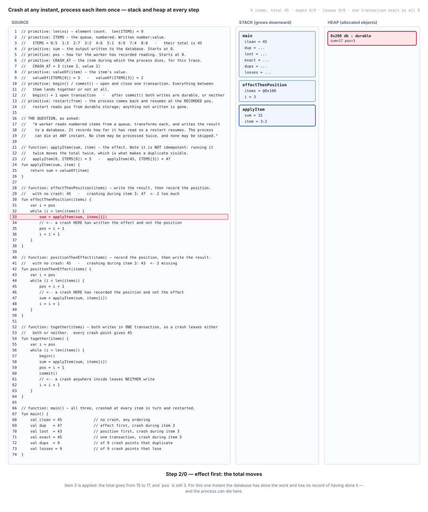

Item 3 is applied: the total goes from 15 to 17, and `pos` is still 3. For this one instant the database has done the work and has no record of having done it — and the process can die here.

</details>
<details>
<summary><b>Step 3 of 12</b> — it dies here, and restarts at pos = 3</summary>

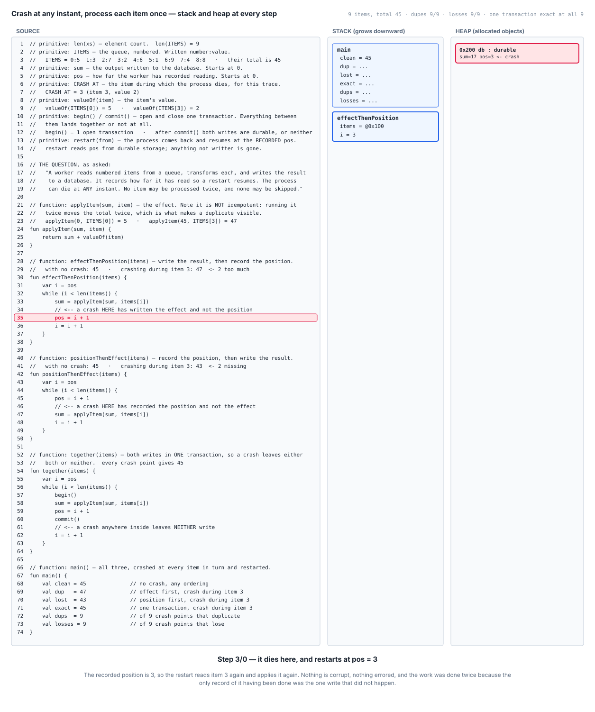

The recorded position is 3, so the restart reads item 3 again and applies it again. Nothing is corrupt, nothing errored, and the work was done twice because the only record of it having been done was the one write that did not happen.

</details>
<details>
<summary><b>Step 4 of 12</b> — so the total is 47, not 45</summary>

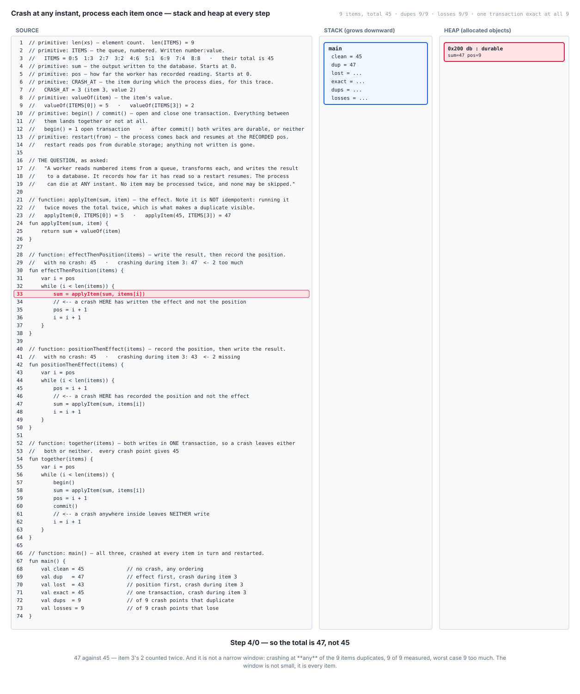

47 against 45 — item 3's 2 counted twice. And it is not a narrow window: crashing at **any** of the 9 items duplicates, 9 of 9 measured, worst case 9 too much. The window is not small, it is every item.

</details>
<details>
<summary><b>Step 5 of 12</b> — so record the position first instead</summary>

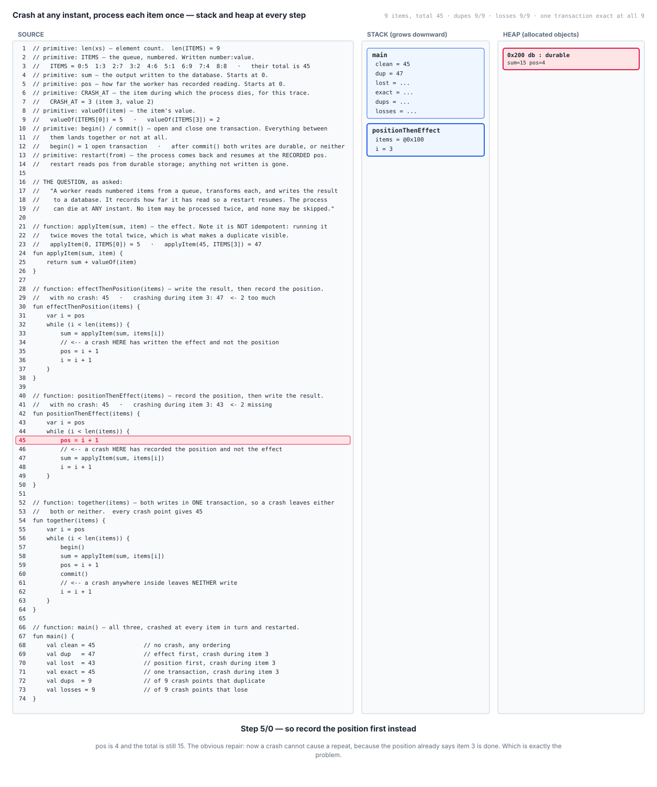

pos is 4 and the total is still 15. The obvious repair: now a crash cannot cause a repeat, because the position already says item 3 is done. Which is exactly the problem.

</details>
<details>
<summary><b>Step 6 of 12</b> — it dies here, and item 3 is skipped forever</summary>

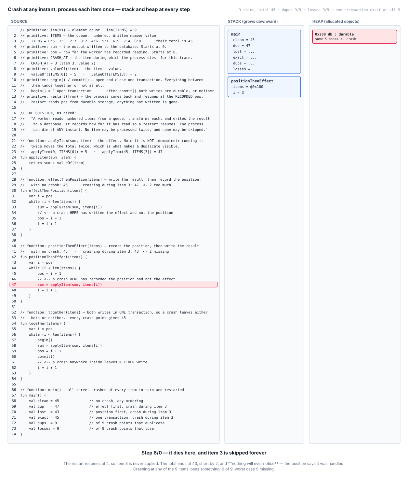

The restart resumes at 4, so item 3 is never applied. The total ends at 43, short by 2, and **nothing will ever notice** — the position says it was handled. Crashing at any of the 9 items loses something: 9 of 9, worst case 9 missing.

</details>
<details>
<summary><b>Step 7 of 12</b> — so neither ordering works, and that is a PROOF</summary>

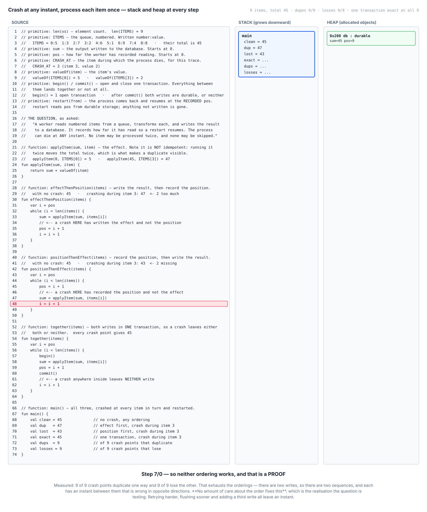

Measured: 9 of 9 crash points duplicate one way and 9 of 9 lose the other. That exhausts the orderings — there are two writes, so there are two sequences, and each has an instant between them that is wrong in opposite directions. **No amount of care about the order fixes this**, which is the realisation the question is testing. Retrying harder, flushing sooner and adding a third write all leave an instant.

</details>
<details>
<summary><b>Step 8 of 12</b> — the reframe: make it ONE write</summary>

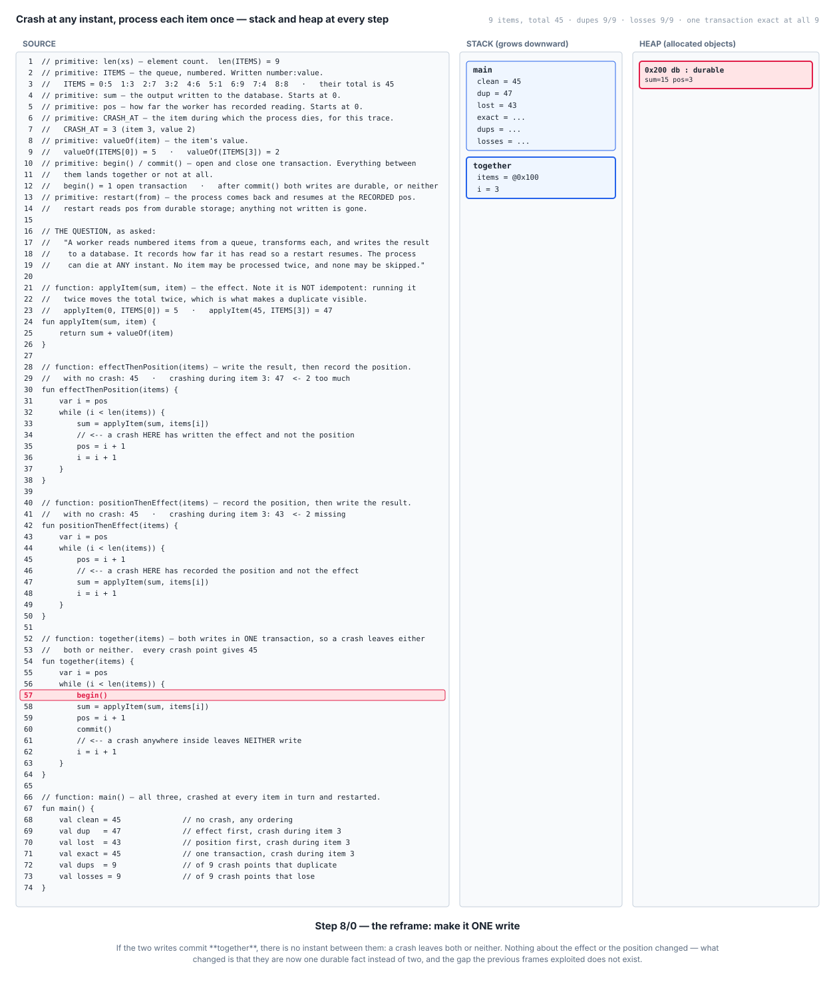

If the two writes commit **together**, there is no instant between them: a crash leaves both or neither. Nothing about the effect or the position changed — what changed is that they are now one durable fact instead of two, and the gap the previous frames exploited does not exist.

</details>
<details>
<summary><b>Step 9 of 12</b> — crash inside the transaction: neither write survives</summary>

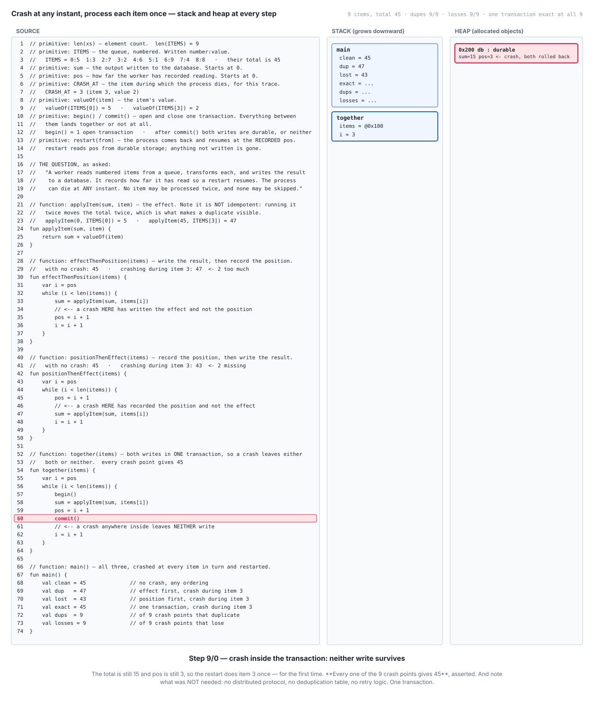

The total is still 15 and pos is still 3, so the restart does item 3 once — for the first time. **Every one of the 9 crash points gives 45**, asserted. And note what was NOT needed: no distributed protocol, no deduplication table, no retry logic. One transaction.

</details>
<details>
<summary><b>Step 10 of 12</b> — so exactly-once needs the output to be transactional</summary>

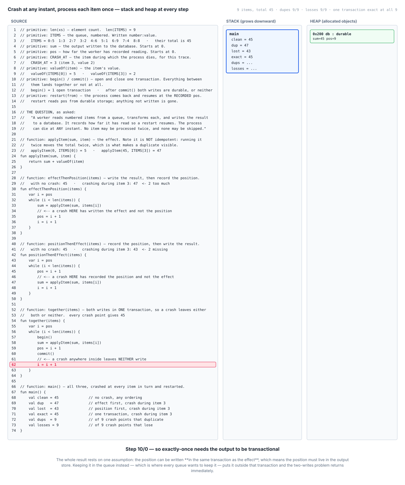

The whole result rests on one assumption: the position can be written **in the same transaction as the effect**, which means the position must live in the output store. Keeping it in the queue instead — which is where every queue wants to keep it — puts it outside that transaction and the two-writes problem returns immediately.

</details>
<details>
<summary><b>Step 11 of 12</b> — and when the output is not transactional</summary>

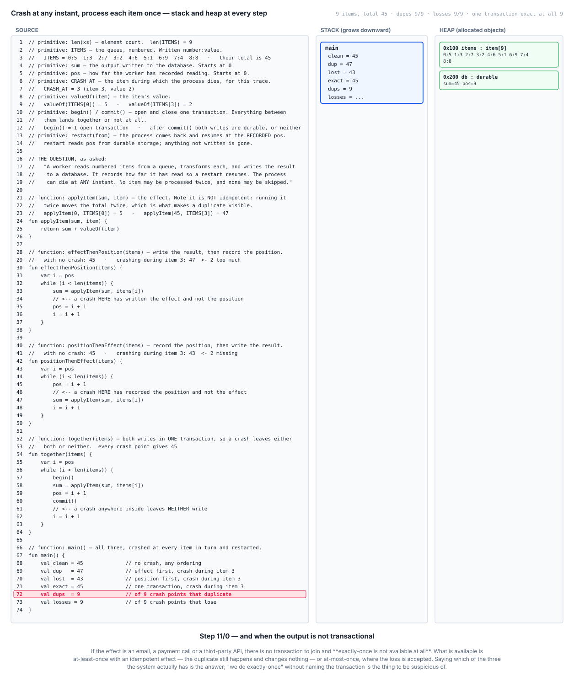

If the effect is an email, a payment call or a third-party API, there is no transaction to join and **exactly-once is not available at all**. What is available is at-least-once with an idempotent effect — the duplicate still happens and changes nothing — or at-most-once, where the loss is accepted. Saying which of the three the system actually has is the answer; "we do exactly-once" without naming the transaction is the thing to be suspicious of.

</details>
<details>
<summary><b>Step 12 of 12</b> — the bill</summary>

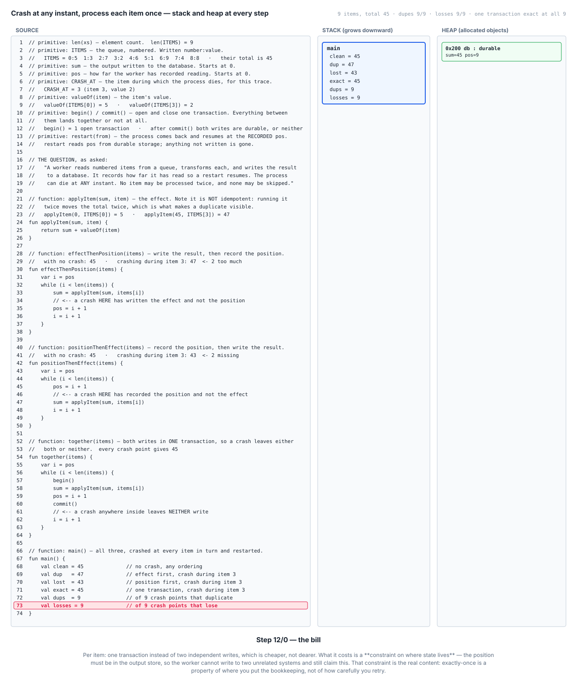

Per item: one transaction instead of two independent writes, which is cheaper, not dearer. What it costs is a **constraint on where state lives** — the position must be in the output store, so the worker cannot write to two unrelated systems and still claim this. That constraint is the real content: exactly-once is a property of where you put the bookkeeping, not of how carefully you retry.

</details>

<sub>Locals live in the frame and vanish when it is popped; 0x200 is the only durable state and is the entire subject — a crash is simply the moment the frames stop and 0x200 is all that is left. Every figure is derived from `tools/stream_seed.js` and asserted — including that the worker is correct with no crash, that effect-first duplicates at **every** crash point and position-first loses at every one (so the claim is "no ordering works" rather than "there is a narrow window"), that the atomic version is exact at all of them, that no two items share a value (or a wrong total could not identify which was repeated), and that no item has a zero effect. Generated by `node tools/gen_ch05_interview.js` on `tools/interviewkit.js`.</sub>

<!-- ch05-interview-memory:end -->


## Links & The Bigger Picture

Concepts this chapter mentions but does not fully unpack are linked below — each pointer names the chapter where the concept is covered in depth and gives a concrete example that ties the two chapters together.

- **[Chapter 7: The Practicalities of Persistent State → Consistency and recovery](ch07-the-practicalities-of-persistent-state.md#consistency-and-recovery)** — exactly-once state recovery needs a checkpoint that pairs state with the source offset — ch07 covers that machinery (barriers, state stores, aligned snapshots).
  - _Example:_ ch05's "replayable source + dedup shuffle + idempotent sink" is ch07's checkpoint { count: {42:13}, offset: 500 } resumed at 501: the state and offset align so no record is lost or double-counted.
- **[Chapter 6: Streams and Tables → The duality](ch06-streams-and-tables.md#the-duality)** — retractions — the correction mechanism ch05 uses for idempotent effects — are the changelog view of a table update.
  - _Example:_ ch05's "SET 42 -> 10 instead of ADD 10" is ch06's (old, new) changelog pair: retract the old value, set the new one, so two deliveries still leave one effect.
- **[Chapter 4: Advanced Windowing → Session semantics and pitfalls](ch04-advanced-windowing.md#session-semantics-and-pitfalls)** — accumulating-and-retracting is the windowing-side twin of exactly-once — a late event that changes an emitted result must retract the old pane before emitting the new one.
  - _Example:_ ch05's dedup makes 2 deliveries → 1 effect; ch04's late session merge retracts s1 (3) and s2 (2) before emitting sMerged (6) so the sink shows 6, not 11.
- **[Chapter 2: The What, Where, When, and How of Data Processing → How — accumulation](ch02-the-what-where-when-and-how-of-data-processing.md#how--accumulation)** — the "how" axis (accumulation modes) is where retraction semantics are defined for panes, which ch05 then applies to side effects.
  - _Example:_ ch05's idempotent sink is ch02's accumulating-and-retracting mode (3 − 3 + 4 = 4): the retraction undoes the old value exactly once before the new one lands.

## System Design Interview

> **The question:** Design a payment pipeline that charges a card exactly once. Premise: the pipeline can crash and retry after a timeout, so the sink must be idempotent on an idempotency key and the shuffle must dedup, otherwise a retry double-charges order-99.

**The pipeline:** replayable source (offset) -> dedup shuffle -> idempotent sink (idempotency key) -> external system

<a href="../diagrams/d2/decomp/ch05-0.png"></a>

### replayable source (offset)

_Role: replayable source — emits records with stable ids and a checkpoint_

- a record {id: "r7", order: "order-99", amount: 10} is emitted
- the checkpoint (offset) lets the pipeline resume after a crash
- records carry stable ids so they can be deduplicated

### dedup shuffle

_Role: dedup shuffle — drops duplicate record deliveries_

- the receiver keeps seen = { r1, r2, r3 }
- first delivery of r7 records it -> seen grows to { r1, r2, r3, r7 }
- a retry of r7 is dropped because the id is already seen

### idempotent sink (idempotency key)

_Role: idempotent sink — applies effects exactly once_

- the sink writes with an idempotency key = order-99
- a SET/upsert replaces the value rather than incrementing
- a retry with the same key is a no-op at the sink

### external system

_Role: external system — the outside-world effect_

- the payment API deduplicates on the idempotency key
- a new key charges once; a seen key returns the prior result
- without the key, two attempts would double-bill


<!-- ch05-system:begin — generated by tools/gen_ch05.js; do not hand-edit -->

#### Why the decisive fact lives outside the pipeline

**The question.** A payment pipeline that charges a card exactly once. It can crash and retry after a timeout, so the sink must be idempotent on an idempotency key and the shuffle must dedup — otherwise a retry double-charges.

**The pipeline:** replayable source (offset) → dedup shuffle → idempotent sink (idempotency key) → external system.

The design's whole difficulty is that **the decisive fact lives in the fourth stage**. Whether order 4 has already been charged is known only by the processor; every mechanism in the first three stages is an attempt not to have to know it, and only the idempotency key actually asks.

**Trace the crash and retry:**

1. Record id 4 passes the dedup shuffle; the seen-set gains id 4.
2. The sink calls `charge("order-4", 6)`; the processor charges 6 and records the key.
3. The pipeline crashes **before committing the offset**. The charge happened; the pipeline does not know.
4. Replay re-reads from the old offset. Record id 4 arrives again — **and the seen-set died with the process**, so it looks new.
5. The sink calls `charge("order-4", 6)` again; the processor recognises the key and does not charge.

Total charged: **6**, not 12.

**Step 4 is where the earlier redundancy breaks down concretely.** The dedup seen-set was in memory and is gone, so the replayed record is indistinguishable from a new one. The only state that survived the crash lives in the payment processor, which is why the key is the mechanism and the shuffle is an optimisation.

**Two-phase commit is the alternative.** It reaches exactly-once without a key, and it costs a blocking coordinator plus an in-doubt state: coordinator dead after "prepare", where committing may double-charge and aborting may lose a legitimate payment. There is no safe default, so a human resolves it.

#### When this design works, and the four things it does not settle

**It works when the processor supports an idempotency key and the key can be derived from the order.** Both halves are required, and both are checked before anything else in the design.

**Keep the dedup shuffle anyway.** It is cheap, it covers the crash window before the dedup point, and it reduces load on the processor. Treat it as an optimisation rather than as a guarantee.

**Prefer this to 2PC whenever the choice exists**, for the reason above: 2PC's in-doubt state has no safe resolution.

**What this design does NOT settle — four gaps:**

1. **The key requires the processor to support it.** If it does not, this design does not degrade gracefully — it is simply unavailable, and 2PC is the fallback with all of its cost.
2. **The key must be derived from the data.** `"order-4"` works; a key generated at send time produces a second charge with extra steps, and **nothing in the pipeline can detect that**. It is a correct-looking pipeline that double-charges.
3. **The dedup seen-set is unbounded state.** Bounding it by a window means dedup stops working past that horizon, so its 1-of-3 coverage is time-limited as well as partial.
4. **Replay protects completeness only as far back as the source's retention.** Beyond that the 23 outcome is reachable again, and no downstream guard helps — because dedup and idempotency are subtractive and cannot add a record back.

#### Visual walkthrough — four stages, five steps, one charge

The animation loops through all 4 steps. Expand any step to study it on its own.


<details>
<summary><b>Step 1 of 4</b> — the pipeline, and the one stage that touches the world</summary>


Four stages, and the design's whole difficulty is that the decisive fact lives in the fourth. The source protects completeness and has no substitute; the dedup shuffle covers 1 of 3 crash windows; the idempotency key covers 3. Note that the third mechanism depends on the external system offering it — the design has a dependency it cannot satisfy itself.

</details>
<details>
<summary><b>Step 2 of 4</b> — the retry, traced — order 4 charged once</summary>


Step 4 is where the earlier redundancy breaks down concretely: the dedup seen-set lived in the crashed process, so after the restart the replayed record is indistinguishable from a new one. The only state that survived the crash is in the payment processor, and the only mechanism that reads it is the idempotency key. Total charged 6, not 12.

</details>
<details>
<summary><b>Step 3 of 4</b> — two-phase commit is the alternative, and it is worse</summary>


Two-phase commit genuinely achieves exactly-once across a side effect, and it is the right answer when the external system has no idempotency key. The reason to prefer the key is in the note: 2PC has a state — prepared, coordinator gone — in which neither committing nor aborting is safe, and that state has to be resolved by a human.

</details>
<details>
<summary><b>Step 4 of 4</b> — and what this design does NOT settle</summary>


The first two gaps are the ones that silently break this design. The whole guarantee rests on a feature of someone else's system, and on a key being derived from data rather than generated — and a send-time key fails in a way that produces a correct-looking pipeline and a double charge. Neither is visible from inside, which is why both belong in the design review rather than in testing.

</details>

<sub>The charge sequence and both coverage counts are computed from the seed and asserted. Generated by `node tools/gen_ch05.js`.</sub>

<!-- ch05-system:end -->

<!-- ch05-system-memory:begin — generated by tools/gen_ch05.js; do not hand-edit -->

#### The payment pipeline — stack and heap at every step

**What is being answered.** Why the dedup shuffle does not save this pipeline — as a crash that is traced through the one line that matters.

`crash(pipe)` is the step to read twice: it returns `Pipeline(pipe.offset, [])`. The **offset survives** because it was committed; the **seen-set does not** because it was in memory. So the replay re-reads record 4 *and* the shuffle thinks it is new.

Everything then rests on `charge`'s early return, which reads `proc.chargedKeys` — the only state that lived outside the crashed process. With it: 6. Without it: 12.

The animation steps through the code, holding each line long enough to read the STACK (call frames and their locals) and the HEAP (allocated arrays and objects) as they are AT THAT MOMENT. Expand any step to study it on its own.


<details>
<summary><b>Step 1 of 4</b> — pass 1 — the dedup set admits it, and the charge lands</summary>


`pipe.seen` is empty, so the record is admitted, and the key is built from `e.id` — `"order-4"`, derived from the data. `totalCharged` goes 0 → 6. Everything about this pass is correct, which is the point: the problem is entirely in what happens next.

</details>
<details>
<summary><b>Step 2 of 4</b> — the crash takes the seen-set and leaves the offset</summary>


`seen` becomes `[]` while `offset` stays 4. That asymmetry is the whole scenario: the offset was durable and the dedup set was in memory, so the replay will re-read record 4 AND the shuffle will think it is new. The dedup guard is gone exactly when it is needed.

</details>
<details>
<summary><b>Step 3 of 4</b> — pass 2 — dedup lets it through, and the KEY stops it</summary>


`contains(pipe.seen, 4)` is false — the set was cleared — so `sinkWrite` calls `charge` again. The processor's `chargedKeys` still holds "order-4", so it returns early and `totalCharged` stays 6. The guarantee came from the one piece of state outside the pipeline.

</details>
<details>
<summary><b>Step 4 of 4</b> — and without the key the same run charges 12</summary>


`doubled` = 6 — a full second charge. Read the two heap rows: identical pipelines, identical crash, and the only difference is whether the processor remembered the key across it. That is why the key is the mechanism and the dedup shuffle is an optimisation.

</details>

<sub>Both charge totals are computed from the seed and asserted. Generated by `node tools/gen_ch05.js` on `tools/memkit.js`.</sub>

<!-- ch05-system-memory:end -->

## Interview Questions

### Q1

A payment pipeline charges cards from a stream; after a crash, some charges were retried and customers were billed twice.

**Interviewer's question:** How do you guarantee a charge happens exactly once when the pipeline can crash and retry?

**Solution:** Give each charge an idempotency key (e.g. order id) and have the payment API deduplicate on it; make the sink idempotent so a retry is a no-op rather than a second charge.

**System-design components:**
- Idempotency key — stable per-order id
- Idempotent sink — SET/upsert, not increment
- Replayable source — Kafka offset
- Dedup — drop duplicate deliveries

```java
// order-99 charge $10
//   attempt 1 -> API sees key new -> charge, ledger 0->10
//   retry      -> API sees key seen -> no-op, ledger stays 10
//   without key: 2 attempts -> ledger 0->10->20 (double bill)
```

_This is exactly the idempotency-key side-effect material in this chapter._

_Covers:_ 2. Idempotency · 6. Side effects · 7. Idempotency key vs two-phase commit

_From the 28 problems:_ 26-payment-system

### Q2

A metrics pipeline recomputes per-key counts from a replayable source after a crash, but downstream sees doubled counts.

**Interviewer's question:** Why do the counts double, and how do you make them exactly-once?

**Solution:** The retried records double-count because the sink is non-idempotent; make the sink an idempotent upsert (set the count) and deduplicate records at the shuffle.

**System-design components:**
- Replayable source — offset
- Dedup — record ids
- Idempotent sink — upsert count

```java
// count before crash = 10
//   replay delivers same records -> dedup drops duplicates
//   sink upserts count = 10 (SET), not += 10
//   -> count stays 10, not 20
```

_This is exactly the end-to-end exactly-once material in this chapter._

_Covers:_ 3. Shuffle deduplication · 4. Replayable sources · 5. End-to-end exactly-once

_From the 28 problems:_ 20-metrics-monitoring · 21-ad-click-aggregation

## Key Concepts

### The Problem

**1. Retries are unavoidable.** Exactly-once is the property that a retried record does not affect the output twice.


### The Solution

An idempotent operation has the same effect whether run once or many times — SET 42 -&gt; 10 is idempotent, ADD 10 is not.

```java
// order-99 charge $10
//   attempt 1 -> API sees key new -> charge, ledger 0->10
//   retry      -> API sees key seen -> no-op, ledger stays 10
//   without key: 2 attempts -> ledger 0->10->20 (double bill)
```


### Key Facts

| Fact | Detail | In the wild |
|---|---|---|
| 2. Idempotency | An idempotent operation has the same effect whether run once or many times — SET 42 -&gt; 10 is idempotent, ADD 10 is not. | HTTP PUT and upserts are idempotent; a naive POST increment is not. |
| 3. Shuffle deduplication | The receiver keeps a set of already-seen record ids and drops duplicates — exactly-once delivery through the shuffle. | Beam's exactly-once shuffle and Flink's checkpoint barrier do this. |
| 4. Replayable sources | A replayable source exposes a checkpoint (offset) and its records carry stable ids, so re-reading is deduplicable. | Kafka consumer offsets and file offsets are the canonical checkpoints. |
| 5. End-to-end exactly-once | End-to-end exactly-once composes a replayable source, a deduplicating shuffle, and an idempotent sink. | Kafka -&gt; Flink -&gt; idempotent sink is the reference architecture. |
| 6. Side effects | Side effects are the hard part of exactly-once; they need idempotency keys or a two-phase commit. | Stripe's Idempotency-Key header is the production form. |
| 7. Idempotency key vs two-phase commit | An idempotency key is cheap and robust; a two-phase commit is expensive and fragile. | Payment APIs accept idempotency keys; XA two-phase commit is avoided in stream processing. |
| 8. Isolate side effects | Keep the main computation pure and push side effects to the very end of the pipeline. | Enrich -&gt; compute -&gt; idempotent upsert is the standard Dataflow shape. |


### Tradeoffs & When

- An idempotency key is cheap and robust; a two-phase commit is expensive and fragile.
- Keep the main computation pure and push side effects to the very end of the pipeline.


### Real-World Examples

- **Stripe** — Idempotency-Key header makes payment retries safe
- **Apache Kafka** — Idempotent producer plus transactions for exactly-once semantics
- **Apache Flink** — Checkpointing plus two-phase commit sinks for end-to-end exactly-once
- **Google MillWheel** — Exactly-once stream processing at internet scale


<details><summary>All concepts (index)</summary>

### Why: 1. Retries are unavoidable

**Why.** Crashes and timeouts force retries, and a naive retry double-counts.

**Claim.** Exactly-once is the property that a retried record does not affect the output twice.

**Grounding.** The book defines exactly-once as each record affecting the output exactly once.

**In the wild.** Kafka's exactly-once semantics and Flink's two-phase commit both target this.

<a href="../diagrams/d2/card/ch05-0.png"></a>
### Property: 2. Idempotency

**Why.** If an operation can be replayed without changing the result, retries are harmless.

**Claim.** An idempotent operation has the same effect whether run once or many times — SET 42 -&gt; 10 is idempotent, ADD 10 is not.

**Grounding.** Idempotency is the property that makes sinks tolerate retries.

**In the wild.** HTTP PUT and upserts are idempotent; a naive POST increment is not.

<a href="../diagrams/d2/card/ch05-1.png"></a>
### Mechanism: 3. Shuffle deduplication

**Why.** Records moving between stages can be delivered more than once after a crash.

**Claim.** The receiver keeps a set of already-seen record ids and drops duplicates — exactly-once delivery through the shuffle.

**Grounding.** Dedup turns two deliveries into one effect.

**In the wild.** Beam's exactly-once shuffle and Flink's checkpoint barrier do this.

<a href="../diagrams/d2/card/ch05-2.png"></a>
### Source: 4. Replayable sources

**Why.** A source must be able to recover from a crash without losing or duplicating records.

**Claim.** A replayable source exposes a checkpoint (offset) and its records carry stable ids, so re-reading is deduplicable.

**Grounding.** Replay + stable ids = the source side of end-to-end exactly-once.

**In the wild.** Kafka consumer offsets and file offsets are the canonical checkpoints.

<a href="../diagrams/d2/card/ch05-3.png"></a>
### Composition: 5. End-to-end exactly-once

**Why.** Each stage has its own failure mode, so a single dedup is not enough.

**Claim.** End-to-end exactly-once composes a replayable source, a deduplicating shuffle, and an idempotent sink.

**Grounding.** Drop any one of the three and the guarantee breaks.

**In the wild.** Kafka -&gt; Flink -&gt; idempotent sink is the reference architecture.

<a href="../diagrams/d2/card/ch05-4.png"></a>
### Hard part: 6. Side effects

**Why.** An external effect — an email, a charge, an API call — cannot be undone by recomputing state.

**Claim.** Side effects are the hard part of exactly-once; they need idempotency keys or a two-phase commit.

**Grounding.** Sending an email twice is visible; a double increment is money.

**In the wild.** Stripe's Idempotency-Key header is the production form.

<a href="../diagrams/d2/card/ch05-5.png"></a>
### Pattern: 7. Idempotency key vs two-phase commit

**Why.** Making an external side effect exactly-once has two options, and they differ sharply in cost.

**Claim.** An idempotency key is cheap and robust; a two-phase commit is expensive and fragile.

**Grounding.** Prefer idempotent effects over distributed transactions whenever the external system supports them.

**In the wild.** Payment APIs accept idempotency keys; XA two-phase commit is avoided in stream processing.

<a href="../diagrams/d2/card/ch05-6.png"></a>
### Boundary: 8. Isolate side effects

**Why.** Retries are most controllable when the effect is one idempotent write at the edge.

**Claim.** Keep the main computation pure and push side effects to the very end of the pipeline.

**Grounding.** A pure core plus a thin idempotent boundary is the cleanest exactly-once design.

**In the wild.** Enrich -&gt; compute -&gt; idempotent upsert is the standard Dataflow shape.

<a href="../diagrams/d2/card/ch05-7.png"></a>

</details>


## Quiz

1. What does exactly-once mean in this book?

   - A. No operation is ever retried
   - B. Each record affects the output exactly once
   - C. The pipeline never crashes
   - D. Every window emits exactly one pane

<details><summary>Reveal answer</summary>

**B.** Exactly-once is the property that a retried record does not affect the output twice.

</details>

2. Which operation is idempotent?

   - A. ADD 10
   - B. SET 42 -> 10
   - C. INCREMENT
   - D. APPEND

<details><summary>Reveal answer</summary>

**B.** SET replaces the value, so running it twice has the same effect as once.

</details>

3. What are the three parts of end-to-end exactly-once?

   - A. Source, cache, queue
   - B. Replayable source, deduplicating shuffle, idempotent sink
   - C. Producer, broker, consumer
   - D. Trigger, watermark, window

<details><summary>Reveal answer</summary>

**B.** End-to-end exactly-once composes a replayable source, a deduplicating shuffle, and an idempotent sink.

</details>

4. Why are side effects the hard part of exactly-once?

   - A. They are slow
   - B. They touch the outside world and cannot be recomputed
   - C. They use too much memory
   - D. They require watermarks

<details><summary>Reveal answer</summary>

**B.** An email or charge cannot be undone by recomputation, so it needs idempotency or a two-phase commit.

</details>

5. Which is preferred for making a charge exactly-once?

   - A. Two-phase commit
   - B. Idempotency key
   - C. Retry without a key
   - D. Ignoring failures

<details><summary>Reveal answer</summary>

**B.** An idempotency key is cheap and robust; two-phase commit is expensive and fragile.

</details>

## Sources

- [Akidau et al. — "MillWheel" (VLDB 2013)](https://research.google/pubs/pub41378/) — Exactly-once stream processing and the side-effect problem in production
- [Confluent — "Exactly-Once Semantics Are Possible: Here's How Apache Kafka Does It"](https://www.confluent.io/blog/exactly-once-semantics-are-possible-heres-how-apache-kafka-does-it/) — How an idempotent producer plus transactions give end-to-end exactly-once
- [Stripe — Idempotency documentation](https://stripe.com/docs/idempotency) — The Idempotency-Key pattern for retry-safe side effects
- [Apache Flink — Stateful stream processing](https://nightlies.apache.org/flink/flink-docs-stable/docs/concepts/stateful-stream-processing/) — Checkpointing and exactly-once state as the engine guarantee

