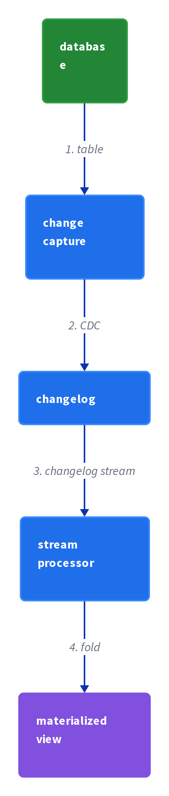
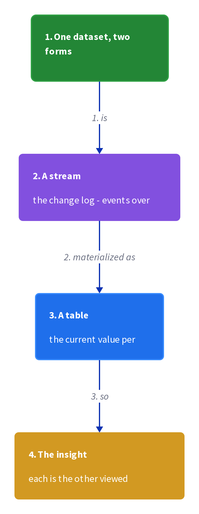
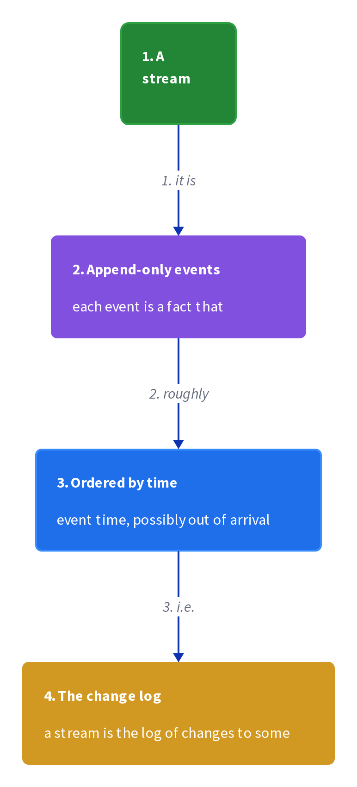
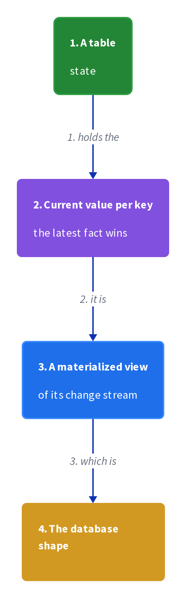
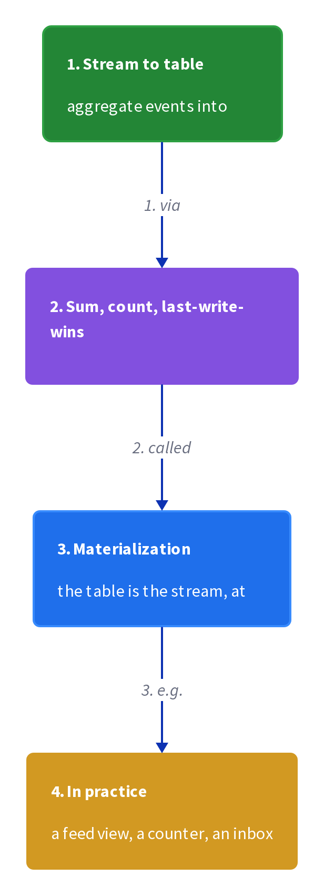
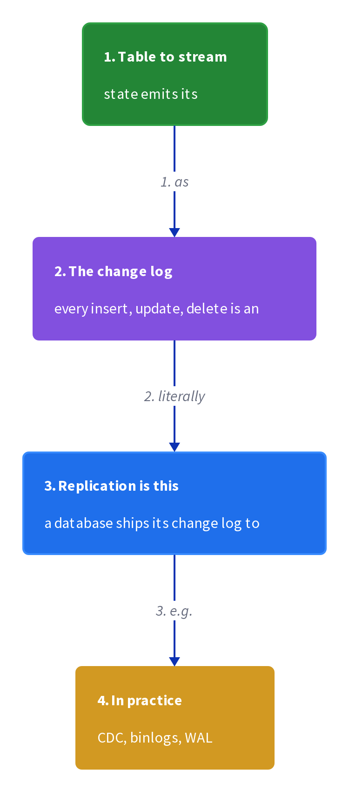
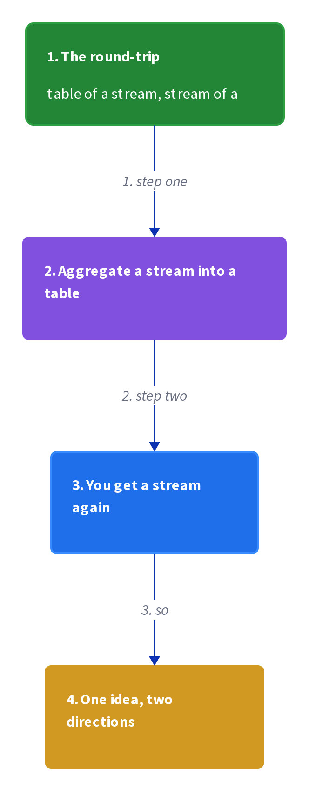
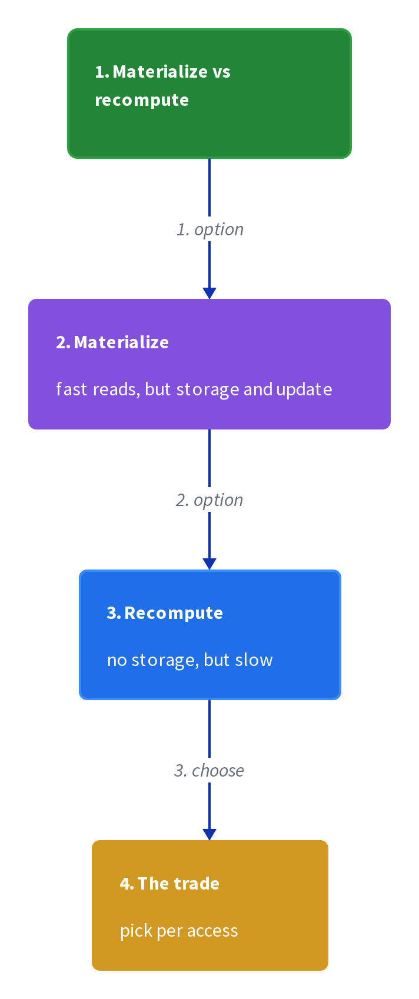
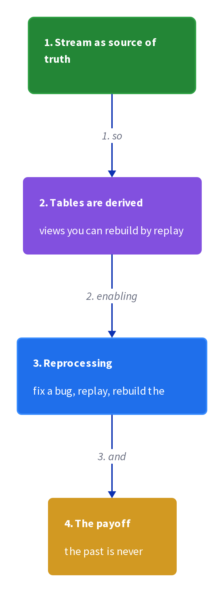

# Chapter 6: Streams and Tables

> Streams and tables are two views of the same data — a stream is the change log of a table, and a table is the materialized aggregate of a stream — and every data-processing system picks a point on this duality.

_Also known as: SS Ch06 · Stream-Table Duality · Change Log · Materialized View · Stream · Table_

## Flow

### The two faces of data

> **Why this matters:** Every dataset has a moving form and a still form, and much confusion in data systems comes from not naming which one is being discussed, so this section fixes the two terms.

1. **A stream is motion** — A stream is a **sequence of events over time** — a change log, an event feed, an append-only sequence. It answers "what happened".

2. **A table is state** — A table is a **snapshot of state at a point in time** — a materialized view, a map, a balance. It answers "what is true now".

3. **They are two views of one thing** — The stream of balance changes and the table of current balances describe **the same underlying data**. The stream is the table's history; the table is the stream's present.

4. **Databases and event systems picked a side** — A relational database is table-centric (it materializes state); an event log like Kafka is stream-centric (it records motion). **Each is a projection of the same duality.**

```java
// ACCOUNT SIDE — the same three balance changes seen as a stream and as a table
// DEF: stream — the append-only sequence of balance changes = [ +10, -3, +5 ]
// DEF: table — the materialized balance = 12
// -> input : the change event {op: +5, account: 42}
//    step 1 · append to the stream -> stream : [ +10, -3 ] -> [ +10, -3, +5 ]
//    step 2 · apply to the table -> table : 7 -> 12   BECAUSE 7 + 5 = 12
//    step 3 · the two views stay consistent -> stream tail +5 and table 12 describe the same account
// <- outcome : the stream gained one event and the table gained 5   BECAUSE the table is the running sum of the stream
//    derivation : table = +10 - 3 + 5 = 12, exactly the last value of the folded stream
```

### The duality

> **Why this matters:** The real power is the ability to move between the two views — aggregate a stream into a table, or capture a table's changes back into a stream — so this section covers both directions.

1. **Stream -> table by aggregation** — Aggregating a stream (sum, count, group-by) produces a table. **The table is the materialized view of the stream** — recompute it from the stream and you get the same state.

2. **Table -> stream by change capture** — Capturing a table's changes (inserts, updates, deletes) produces a stream — the **change log**. This is how change-data-capture (CDC) turns a database into a stream.

3. **The two directions are inverses** — **Aggregating the change log reproduces the table, and capturing the table's changes reproduces the change log.** That round-trip is the duality.

4. **A changelog stream carries old and new values** — For an update to be reversible, the change record must carry **both the old value (retraction) and the new value** — a changelog stream, not just a list of new values.

```java
// CHANGE-CAPTURE SIDE — a table update becomes a changelog record that can rebuild the table
// DEF: changelog — the stream of (old, new) pairs for a key = [ (0,10), (10,7), (7,12) ]
// DEF: table — the materialized balance = 12
// DEF: cdc — change-data-capture, which turns table writes into changelog records
// -> input : the database updates account 42 from 7 to 12
//    step 1 · capture the change -> changelog : [ (0,10), (10,7) ] -> [ (0,10), (10,7), (7,12) ]
//    step 2 · the downstream consumer folds the changelog -> table : 7 -> 12   BECAUSE the last pair (7,12) sets the new value
//    step 3 · a retraction of the old value is implicit in the pair -> the old 7 is replaced by the new 12
// <- outcome : the changelog gained (7,12) and the consumer table matches the source table at 12   BECAUSE change capture + fold = the same state
//    derivation : folding (0,10) then (10,7) then (7,12) = 12, the table value
```

### Why the duality matters in practice

> **Why this matters:** The duality is not philosophy — it decides how systems store, replay, and rebuild state, so this section connects it to the concrete choices a streaming architecture makes.

1. **Materialization is a design choice** — You can materialize a table eagerly (store it) or **recompute it from the stream on demand**. Eager costs storage; lazy costs recompute time.

2. **Kafka is a changelog; a DB index is a table** — A Kafka topic is literally a changelog stream; a database index is a table built from it. **Stream processors sit between the two.**

3. **Time-travel is a table over the stream** — Because the stream is the full history, **any past table is recoverable by folding the stream up to that point** — the stream is the source of truth, the table is a derived view.

4. **Pick the right view for the question** — For "what is the balance now" use the table; for "what happened in order" use the stream. **A good architecture keeps the stream as truth and derives tables as views.**

```java
// REPLAY SIDE — the stream rebuilds a past table, proving it is the source of truth
// DEF: stream — the full changelog = [ +10, -3, +5 ]
// DEF: table — a snapshot of balance, recoverable at any point
// STATE (before):
//    balance : { value: 0 }
// -> input : a request for the balance as of event 2
//    step 1 · fold events up to index 2 -> balance : 0 -> 10 -> 7
//    step 2 · the past table is materialized -> table : 7   BECAUSE +10 - 3 = 7
//    step 3 · fold one more event -> table : 7 -> 12   BECAUSE +5 brings it to the present
// <- outcome : the past table at event 2 is 7 and the present table is 12   BECAUSE both are folds of the same stream
//    derivation : table(t) = fold of stream[0..t], so table(2) = +10 - 3 = 7
```


## System Design Interview

> **The question:** Design one system that keeps a balance table and a balance-change stream as two consistent views. Use case: fraud detection needs the real-time change feed while the database holds current balances. Premise: the table is the materialized fold of the changelog (CDC), so the two views cannot drift.

**The pipeline:** database (table) -> change capture (CDC) -> changelog stream -> stream processor (fold) -> materialized view (table)



### database (table)

_Role: database — holds the source table_

- account 42 balance is 7, then updates to 12
- the database is table-centric state
- the update is the event that CDC will capture

### change capture (CDC)

_Role: change capture — turns table writes into a changelog_

- the update 7 -> 12 emits the changelog record (7,12)
- the record carries the old value for retraction
- the changelog is append-only and ordered

### changelog stream

_Role: changelog stream — the stream view of the data_

- the stream is [ (0,10), (10,7), (7,12) ]
- it is the source of truth — history is retained
- any past table is a fold up to that point

### stream processor (fold)

_Role: stream processor — derives tables from the stream_

- the fold applies each (old, new) pair
- after (7,12) the materialized balance is 12
- the derived table matches the source database

```java
// SYSTEM DESIGN — a balance update flows from table to changelog and back to a matching table
// DEF: changelog — the stream of (old, new) pairs = [ (0,10), (10,7) ]
// DEF: table — the materialized balance = 7
// DEF: cdc — change-data-capture, which turns table writes into changelog records = (7,12)
// DEF: account — the balance record keyed by user = 42
// STATE (before):
//    account_state : { 42: 7 }
// -> input : the database updates account 42 from 7 to 12
//    step 1 · CDC captures the change -> changelog : [ (0,10), (10,7) ] -> [ (0,10), (10,7), (7,12) ]
//    step 2 · the processor folds the new pair -> account_state : { 42: 7 } -> { 42: 12 }   BECAUSE 7 + (12 - 7) = 12
//    step 3 · the derived view matches the source -> table : 7 -> 12   BECAUSE the fold reproduces the database state
// <- outcome : the changelog gained (7,12) and the materialized view matches the database at 12   BECAUSE table and stream are dual
//    derivation : fold (0,10) then (10,7) then (7,12) = 12, the same as the source table
```

## Interview Questions

### Q1

A service stores account balances in a database but also needs a real-time feed of balance changes for fraud detection; the two systems keep drifting out of sync.

**Interviewer's question:** How do you keep a table of balances and a stream of balance changes as two consistent views of the same data?

**Solution:** Treat them as the stream-table duality: capture the database's changes into a changelog stream (CDC), and derive the table as the materialized fold of that stream.

**System-design components:**
- Table — the database state
- Changelog stream — CDC output
- Fold — rebuilds the table from the stream
- Retraction — (old, new) pairs

```java
// table balance 7 -> 12
//   CDC emits (7,12) to the changelog
//   consumer folds -> table 12 (matches source)
//   stream = source of truth, table = derived view
```

_This is exactly the stream-table duality material in this chapter._

_Covers:_ 5. Table -> stream · 6. The round-trip · 8. Stream as source of truth

_From the 28 problems:_ 26-payment-system

### Q2

An ad-click pipeline needs both a per-minute event feed and a per-campaign running total, but the team built two separate systems that disagree.

**Interviewer's question:** How do you model the event feed and the running total so they never disagree?

**Solution:** Keep the event feed as the stream of truth and derive the per-campaign total as a table by aggregating the stream — one system, two views.

**System-design components:**
- Stream — the event feed
- Table — the per-campaign total
- Aggregation — stream -> table

```java
// clicks [ +1, +1, +1 ] campaign C
//   stream: 3 events, table: total 3
//   both from the same source -> cannot disagree
```

_This is exactly the stream -> table material in this chapter._

_Covers:_ 4. Stream -> table · 7. Materialize vs recompute

_From the 28 problems:_ 21-ad-click-aggregation

## Key Concepts

### The Problem

**1. One dataset, two forms.** A stream is the change log; a table is the materialized view — two views of one thing.


### The Solution

A stream is a sequence of events over time — an append-only change log.

```java
// table balance 7 -> 12
//   CDC emits (7,12) to the changelog
//   consumer folds -> table 12 (matches source)
//   stream = source of truth, table = derived view
```


### Key Facts

| Fact | Detail | In the wild |
|---|---|---|
| 2. Streams | A stream is a sequence of events over time — an append-only change log. | A Kafka topic is a stream. |
| 3. Tables | A table is a snapshot of state at a point in time — a materialized view. | A SQL materialized view or a database index is a table. |
| 4. Stream -> table | Aggregating a stream produces a table — the materialized view of the stream. | A Flink keyed aggregation produces a stateful table. |
| 5. Table -> stream | Capturing a table's changes produces a changelog stream — change-data-capture. | Debezium CDC turns MySQL/Postgres into Kafka changelogs. |
| 6. The round-trip | Aggregating the change log reproduces the table; capturing the table's changes reproduces the change log. | This is the theoretical basis for stream-table systems. |
| 7. Materialize vs recompute | Eager materialization costs storage; lazy recompute-from-stream costs time. | A cache (eager) vs a query-time fold (lazy) is the production choice. |
| 8. Stream as source of truth | Keep the stream as the source of truth and derive tables as views — any past table is a fold of the stream up to that point. | Event-sourced systems are the production form. |


### Tradeoffs & When

- Eager materialization costs storage; lazy recompute-from-stream costs time.
- Keep the stream as the source of truth and derive tables as views — any past table is a fold of the stream up to that point.


### Real-World Examples

- **Kafka** — The changelog stream; the log is the source of truth
- **Debezium** — Change-data-capture turning tables into changelog streams
- **Event sourcing** — Keeping the stream as truth and deriving tables as projections


<details><summary>All concepts (index)</summary>

### Why: 1. One dataset, two forms

**Why.** The same data appears as motion (what happened) and as state (what is true now), and mixing the two causes confusion.

**Claim.** A stream is the change log; a table is the materialized view — two views of one thing.

**Grounding.** The book's core Part II idea is the stream-table duality.

**In the wild.** Kafka (stream) vs a database index (table) are the two projections.


### View: 2. Streams

**Why.** Order of events and history matter when the question is "what happened".

**Claim.** A stream is a sequence of events over time — an append-only change log.

**Grounding.** It answers "what happened".

**In the wild.** A Kafka topic is a stream.


### View: 3. Tables

**Why.** A point-in-time answer needs a snapshot, not a history.

**Claim.** A table is a snapshot of state at a point in time — a materialized view.

**Grounding.** It answers "what is true now".

**In the wild.** A SQL materialized view or a database index is a table.


### Direction: 4. Stream -> table

**Why.** To answer "what is the current total" from a feed of events, aggregate them.

**Claim.** Aggregating a stream produces a table — the materialized view of the stream.

**Grounding.** The table is the fold of the stream.

**In the wild.** A Flink keyed aggregation produces a stateful table.


### Direction: 5. Table -> stream

**Why.** To react to database changes in real time, capture them as a feed.

**Claim.** Capturing a table's changes produces a changelog stream — change-data-capture.

**Grounding.** The changelog records (old, new) pairs so updates are reversible.

**In the wild.** Debezium CDC turns MySQL/Postgres into Kafka changelogs.


### Duality: 6. The round-trip

**Why.** The two directions should be inverses — that is the formal statement of the duality.

**Claim.** Aggregating the change log reproduces the table; capturing the table's changes reproduces the change log.

**Grounding.** The round-trip is lossless for a changelog that carries old and new values.

**In the wild.** This is the theoretical basis for stream-table systems.


### Choice: 7. Materialize vs recompute

**Why.** Keeping a table has a cost, and recomputing it also has a cost — the duality makes the trade explicit.

**Claim.** Eager materialization costs storage; lazy recompute-from-stream costs time.

**Grounding.** The stream is the source of truth; the table is a derived view.

**In the wild.** A cache (eager) vs a query-time fold (lazy) is the production choice.


### Truth: 8. Stream as source of truth

**Why.** A table alone loses history; a stream alone is inconvenient for lookups.

**Claim.** Keep the stream as the source of truth and derive tables as views — any past table is a fold of the stream up to that point.

**Grounding.** Time-travel is free if the stream is retained.

**In the wild.** Event-sourced systems are the production form.



</details>


## Quiz

1. What is a stream in the stream-table duality?

   - A. A snapshot of state
   - B. A sequence of events over time
   - C. A database index
   - D. A materialized view

<details><summary>Reveal answer</summary>

**B.** A stream is the moving, append-only change log.

</details>

2. What is a table in the stream-table duality?

   - A. An event feed
   - B. A changelog
   - C. A snapshot of state at a point in time
   - D. A retraction

<details><summary>Reveal answer</summary>

**C.** A table is the still, materialized view of state.

</details>

3. Aggregating a stream produces a ___ .

   - A. stream
   - B. table
   - C. changelog
   - D. watermark

<details><summary>Reveal answer</summary>

**B.** Aggregation folds the stream into a materialized table.

</details>

4. What does change-data-capture (CDC) produce?

   - A. A table
   - B. A changelog stream of a table's changes
   - C. A watermark
   - D. A window

<details><summary>Reveal answer</summary>

**B.** CDC turns table writes into a changelog stream of (old, new) pairs.

</details>

5. Why keep the stream as the source of truth?

   - A. It is faster to query
   - B. Any past table is recoverable by folding the stream
   - C. It uses less storage
   - D. It never needs retractions

<details><summary>Reveal answer</summary>

**B.** The stream is the full history, so any past table is a fold up to that point.

</details>

