# Chapter 6: Streams and Tables

> Streams and tables are two views of the same data — a stream is the change log of a table, and a table is the materialized aggregate of a stream — and every data-processing system picks a point on this duality.

_Also known as: SS Ch06 · Stream-Table Duality · Change Log · Materialized View · Stream · Table_

## Flow

### The two faces of data

> **Why this matters:** Every dataset has a moving form and a still form, and much confusion in data systems comes from not naming which one is being discussed, so this section fixes the two terms.

1. **A stream is motion** — A stream is a **sequence of events over time** — a change log, an event feed, an append-only sequence. It answers "what happened".

2. **A table is state** — A table is a **snapshot of state at a point in time** — a materialized view, a map, a balance. It answers "what is true now".

3. **They are two views of one thing** — The stream of balance changes and the table of current balances describe **the same underlying data**. The stream is the table's history; the table is the stream's present.

4. **Databases and event systems picked a side** — A relational database is table-centric (it materializes state); an event log like Kafka is stream-centric (it records motion). **Each is a projection of the same duality.**

<!-- ch06-faces:begin — generated by tools/gen_ch06.js; do not hand-edit -->

#### Why these are two views rather than two kinds of data

**A stream is motion.** Each of this book's 9 records is a *change*: id 0 adds 5 to key "a", and so on. To answer "what is key `a` now?" you have to read all of them and add up. A stream answers **what happened**.

**A table is state.** Fold those records per key and you get 2 rows: "a" = 24, "b" = 21. One lookup, no arithmetic. A table answers **what is true now**.

**They are the same data.** Both views total **45** — the stream over 9 records, the table over 2 rows. That equality is the duality in its most checkable form: neither view invented or lost anything, they are arranged for different questions.

What each gives up is precise. The table has forgotten the **order** and every **intermediate value** — ask it "was key `a` ever 8?" and it cannot answer, though the stream can. The stream has given up cheap lookups: every current value is a fold.

**And that is why the industry split the way it did.** A relational database is table-centric: it stores the 2 rows and derives history only if someone built an audit table. An event log is stream-centric: it stores the 9 records and derives the rows on read. A stream processor sits between them, consuming the stream and maintaining the table.

So "database or event log?" is usually the wrong question. The real one is **which view is the source and which is derived** — and neither is primary by nature. The stream earns that role only because the derivation is cheap in one direction.

#### When to reach for each view, and what the choice commits you to

**Query the table for "what is true now"**, which is almost all production traffic. It is a lookup against 2 rows rather than a fold over 9 records, and the gap widens as history accumulates.

**Query the stream for anything about order or history** — "what happened", "what was it at time T", "was it ever X". These are unanswerable from the table at any cost, because the information is gone rather than merely slow to reach.

**Choose which view is the source deliberately, and only once.** A derived view can lag, which is visible and bounded. Two independently written stores **drift**, which is unbounded and silent, and "keep them in sync" is not a design — a derivation is.

**What this does not settle:** whether the derivation actually runs both ways. The next concept shows that aggregating a changelog always recovers the table, and recovers the original events only when the aggregate is invertible — so "the two directions are inverses" turns out to be a property of the aggregate rather than of the duality.

#### Visual walkthrough — the stream, the table, and the shared total

The animation loops through all 4 steps. Expand any step to study it on its own.



<details>
<summary><b>Step 1 of 4</b> — the stream: what happened, in order</summary>


A stream answers "what happened". Each of the 9 rows is a change, so the current value of anything is a computation rather than a lookup. In exchange you get something a table throws away: the order, and every value the system ever held.

</details>
<details>
<summary><b>Step 2 of 4</b> — the table: what is true now</summary>

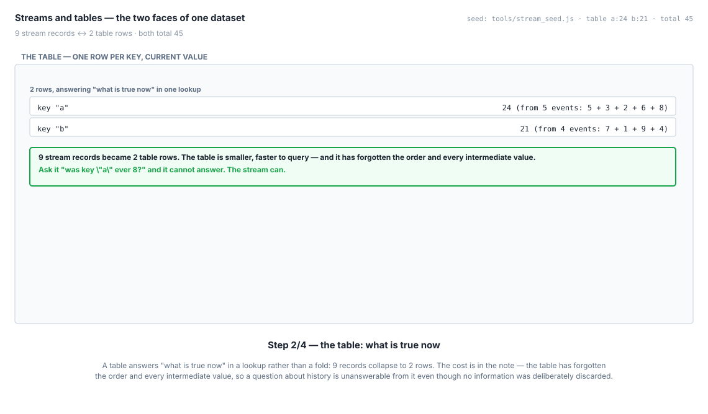

A table answers "what is true now" in a lookup rather than a fold: 9 records collapse to 2 rows. The cost is in the note — the table has forgotten the order and every intermediate value, so a question about history is unanswerable from it even though no information was deliberately discarded.

</details>
<details>
<summary><b>Step 3 of 4</b> — and they are the same data, folded differently</summary>

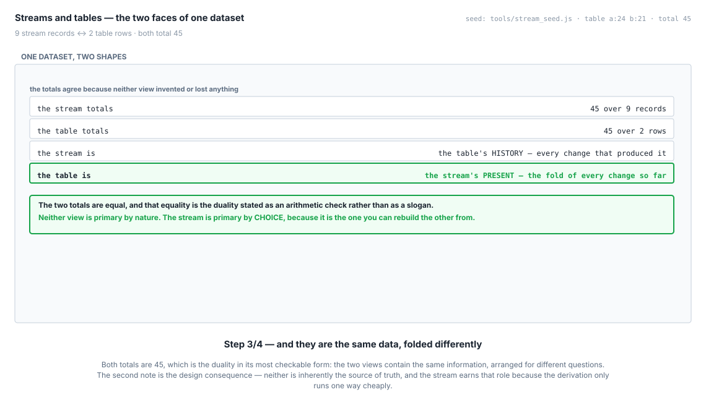

Both totals are 45, which is the duality in its most checkable form: the two views contain the same information, arranged for different questions. The second note is the design consequence — neither is inherently the source of truth, and the stream earns that role because the derivation only runs one way cheaply.

</details>
<details>
<summary><b>Step 4 of 4</b> — so databases and event logs each picked a side</summary>

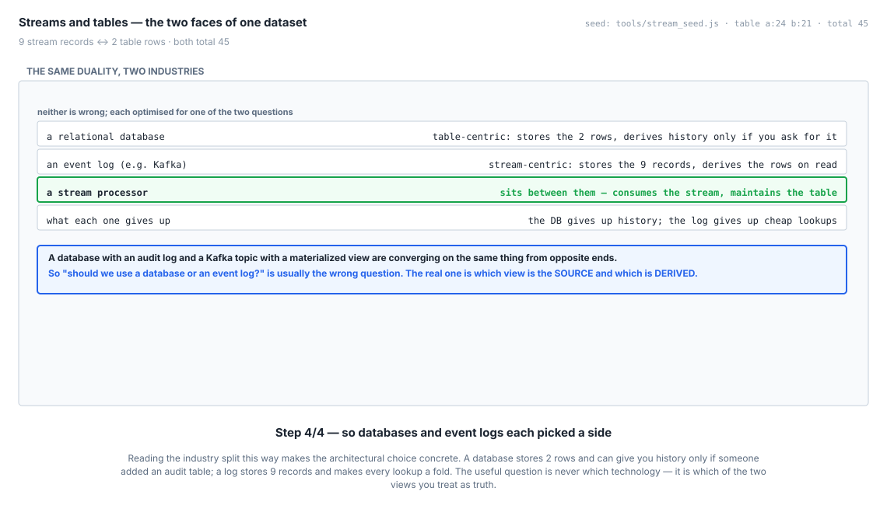

Reading the industry split this way makes the architectural choice concrete. A database stores 2 rows and can give you history only if someone added an audit table; a log stores 9 records and makes every lookup a fold. The useful question is never which technology — it is which of the two views you treat as truth.

</details>

<sub>Both views and their totals are computed from the seed and asserted equal. Generated by `node tools/gen_ch06.js`.</sub>

<!-- ch06-faces:end -->

<!-- ch06-faces-memory:begin — generated by tools/gen_ch06.js; do not hand-edit -->

#### One dataset, two shapes — stack and heap at every step

**What is being answered.** Why a stream and a table are two views of one dataset — as two loops producing the same number.

`toTable(events)` is the entire stream-to-table direction: one line, `tbl.rows[e.key] = tbl.rows[e.key] + e.v`. The table is a **function** of the events, which is the mechanical reason a derived table can lag but cannot drift.

Step 4 is the limit. `everWas` finds key "a" passing through 8 at event id 1 — and the heap shows the table holding only 24. The intermediate value existed; the table does not contain it.

The animation steps through the code, holding each line long enough to read the STACK (call frames and their locals) and the HEAP (allocated arrays and objects) as they are AT THAT MOMENT. Expand any step to study it on its own.



<details>
<summary><b>Step 1 of 4</b> — the stream is read start to finish, one change at a time</summary>


There is no shortcut here: `t` reaches 45 only after all 9 records. A stream has no current value to look up, which is the cost side of what it gives you — and the loop is the reason a lazy query scales with history rather than with the number of keys.

</details>
<details>
<summary><b>Step 2 of 4</b> — the fold collapses it to one row per key</summary>

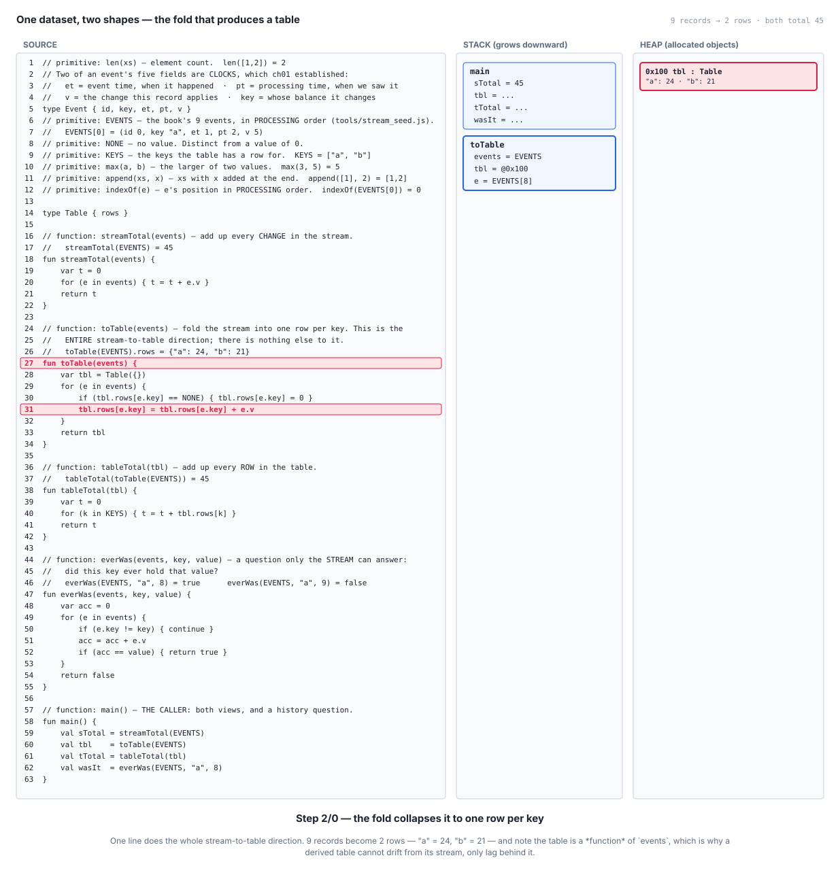

One line does the whole stream-to-table direction. 9 records become 2 rows — "a" = 24, "b" = 21 — and note the table is a *function* of `events`, which is why a derived table cannot drift from its stream, only lag behind it.

</details>
<details>
<summary><b>Step 3 of 4</b> — and the two totals agree, which IS the duality</summary>

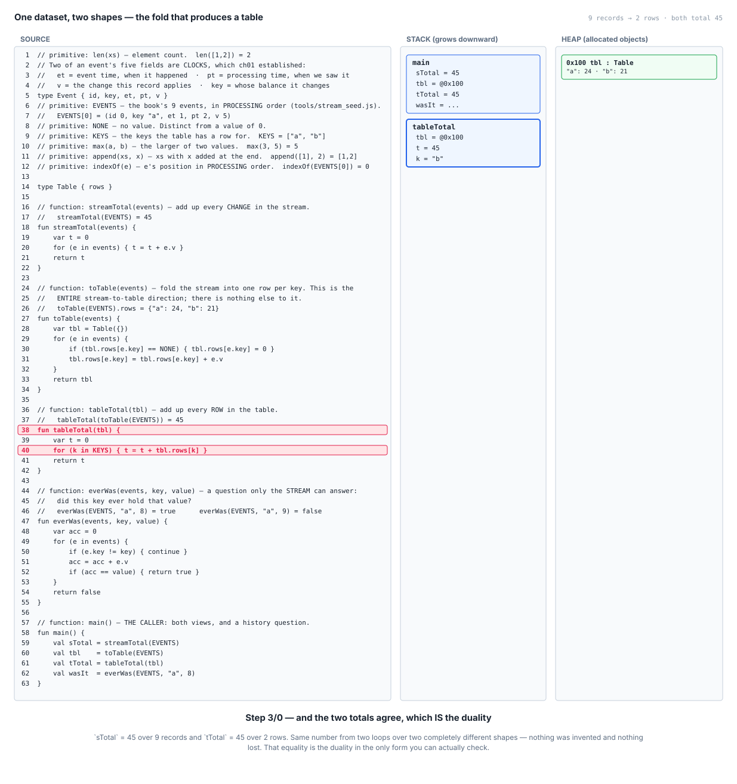

`sTotal` = 45 over 9 records and `tTotal` = 45 over 2 rows. Same number from two loops over two completely different shapes — nothing was invented and nothing lost. That equality is the duality in the only form you can actually check.

</details>
<details>
<summary><b>Step 4 of 4</b> — but only one of them can answer a question about history</summary>

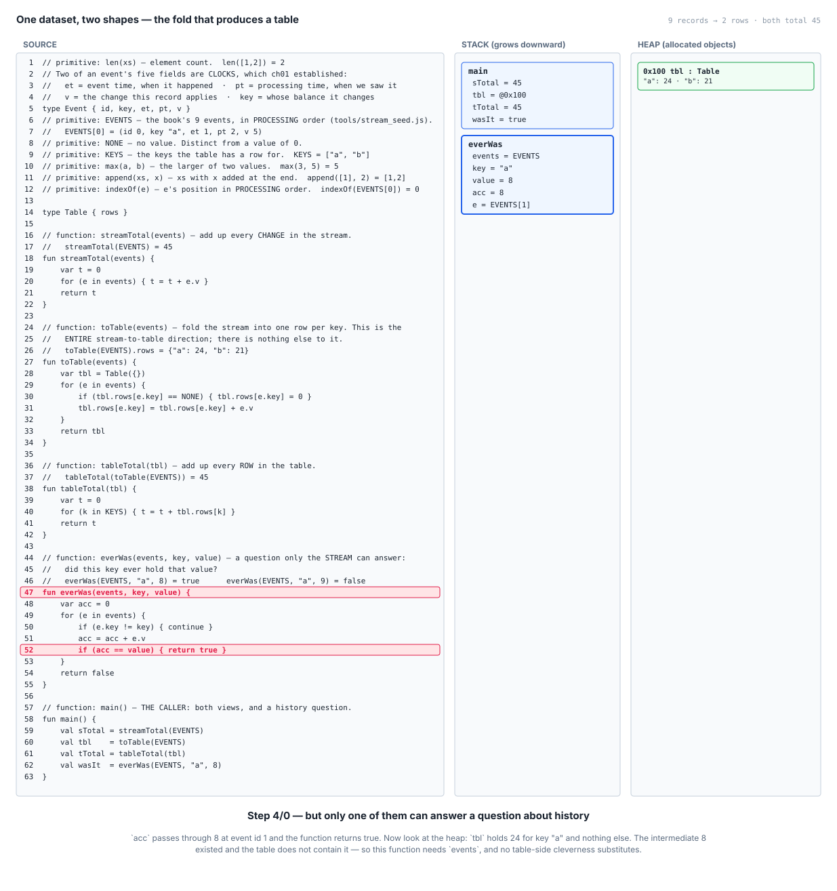

`acc` passes through 8 at event id 1 and the function returns true. Now look at the heap: `tbl` holds 24 for key "a" and nothing else. The intermediate 8 existed and the table does not contain it — so this function needs `events`, and no table-side cleverness substitutes.

</details>

<sub>Both totals and every row are computed from the seed and asserted equal. Generated by `node tools/gen_ch06.js` on `tools/memkit.js`.</sub>

<!-- ch06-faces-memory:end -->

### The duality

> **Why this matters:** The real power is the ability to move between the two views — aggregate a stream into a table, or capture a table's changes back into a stream — so this section covers both directions.

1. **Stream -> table by aggregation** — Aggregating a stream (sum, count, group-by) produces a table. **The table is the materialized view of the stream** — recompute it from the stream and you get the same state.

2. **Table -> stream by change capture** — Capturing a table's changes (inserts, updates, deletes) produces a stream — the **change log**. This is how change-data-capture (CDC) turns a database into a stream.

3. **The two directions are inverses** — **Aggregating the change log reproduces the table, and capturing the table's changes reproduces the change log.** That round-trip is the duality.

4. **A changelog stream carries old and new values** — For an update to be reversible, the change record must carry **both the old value (retraction) and the new value** — a changelog stream, not just a list of new values.

<!-- ch06-duality:begin — generated by tools/gen_ch06.js; do not hand-edit -->

#### Why the round trip recovers the table but not always the events

**Stream → table is a fold.** Key "a"'s balance walks 0 → 5 → 8 → 10 → 16 → 24, and the table's value — **24** — is simply the last line. The architectural consequence: a table that is a *function* of the stream cannot drift from it, it can only lag.

**Table → stream is change capture.** Watch the table and emit a record per write. Each record carries **old → new**, which is what makes the changelog foldable back into a table rather than a log of final states.

**That old value is load-bearing.** Take the last update, 16 → 24. A record carrying only the new value, into a consumer that sums, gives 16 + 24 = **40** — wrong by 16. A record carrying both gives 16 − 16 + 24 = **24**. This is ch02's accumulation question reached from the table side: a changelog record *is* an accumulating pane, and the old value *is* the retraction.

**Now the part the usual statement of the duality leaves out.** "Aggregating the changelog reproduces the table, and capturing the table reproduces the changelog" — true. But does the round trip recover the original **events**?

- Key "a"'s actual event values: **[5, 3, 2, 6, 8]**
- its **SUM** changelog: [5, 8, 10, 16, 24] → successive differences **[5, 3, 2, 6, 8]** — recovered exactly
- its **MAX** changelog: [5, 5, 5, 6, 8] → successive differences **[5, 0, 0, 1, 2]** — not the events at all

The max changelog has 2 zero-deltas, and each one hides any value up to the running max, so **at least 36 different event sequences produce that same changelog**.

So the duality holds for the *table* under any aggregate, and for the *events* only under an invertible one. That is a property of the aggregation, not of streams and tables.

#### When the round trip is safe to rely on, and what to do when it is not

**Rely on changelog → table under any aggregate.** That direction always works; it is just a fold.

**Rely on changelog → events only for invertible aggregates** — sum, count, anything with a subtraction. Differencing recovers [5, 3, 2, 6, 8] exactly here.

**For a non-invertible aggregate, keep the event stream itself**, not the changelog of its aggregate. A max, a min, a distinct count and a top-K all discard information at aggregation time, and no downstream cleverness recovers it — 36 candidate histories here, from 5 events.

**Always emit old and new in a changelog**, even when the consumer you know about overwrites rather than sums. The cost is one field; the alternative is a correctness bug that appears when a second consumer is added.

**What this does not settle:** whether to materialize the table at all, and how either view behaves when the stream is only retained for a window. Both are the next concept — and the retention point quietly bounds every claim made here about re-derivation.

#### Visual walkthrough — fold, capture, retraction, and the lossy round trip

The animation loops through all 4 steps. Expand any step to study it on its own.



<details>
<summary><b>Step 1 of 4</b> — stream → table by aggregation</summary>


Stream to table is a fold, and the whole right-hand column is the proof: 24 is the last line of it. That matters architecturally — a table that is a function of the stream cannot drift from it, whereas two independently-written stores can and will.

</details>
<details>
<summary><b>Step 2 of 4</b> — table → stream by change capture</summary>

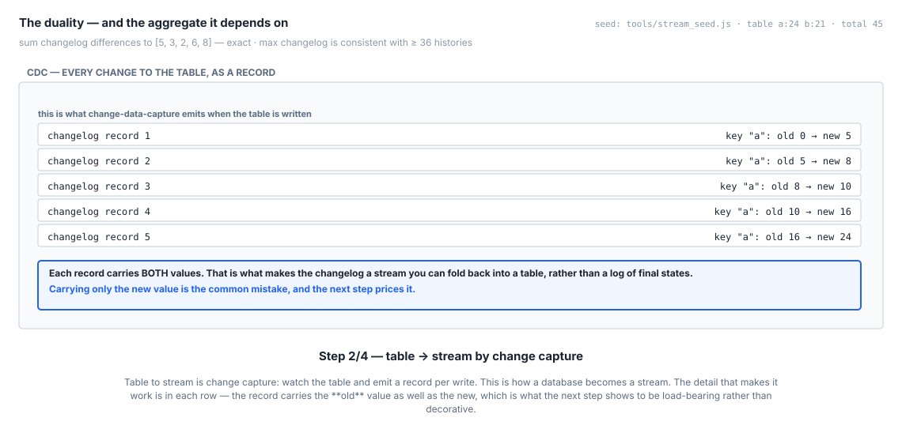

Table to stream is change capture: watch the table and emit a record per write. This is how a database becomes a stream. The detail that makes it work is in each row — the record carries the **old** value as well as the new, which is what the next step shows to be load-bearing rather than decorative.

</details>
<details>
<summary><b>Step 3 of 4</b> — and a new-value-only changelog breaks a summing consumer</summary>

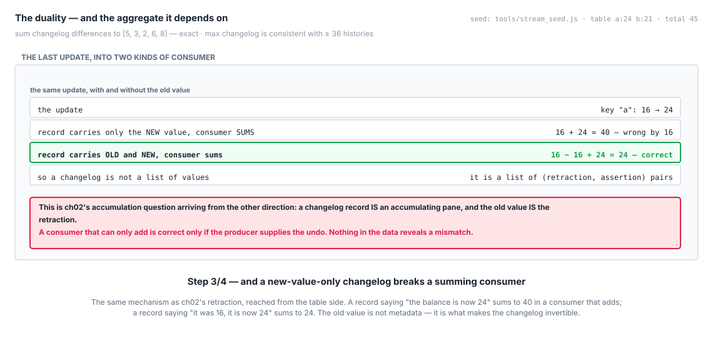

The same mechanism as ch02's retraction, reached from the table side. A record saying "the balance is now 24" sums to 40 in a consumer that adds; a record saying "it was 16, it is now 24" sums to 24. The old value is not metadata — it is what makes the changelog invertible.

</details>
<details>
<summary><b>Step 4 of 4</b> — but "the directions are inverses" depends on the AGGREGATE</summary>

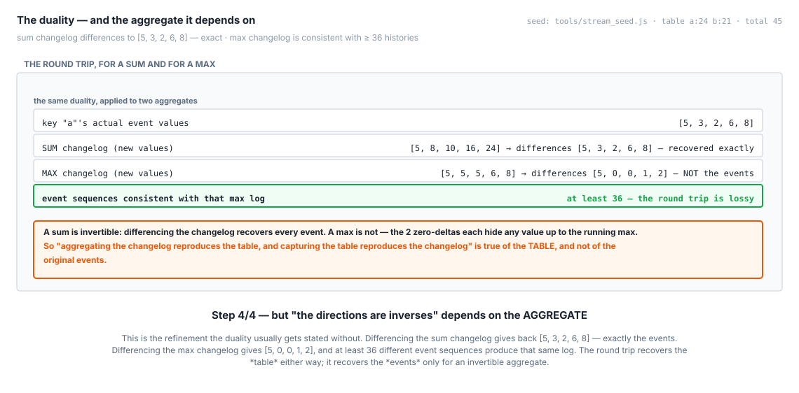

This is the refinement the duality usually gets stated without. Differencing the sum changelog gives back [5, 3, 2, 6, 8] — exactly the events. Differencing the max changelog gives [5, 0, 0, 1, 2], and at least 36 different event sequences produce that same log. The round trip recovers the *table* either way; it recovers the *events* only for an invertible aggregate.

</details>

<sub>Both changelogs, the recovered deltas and the 36-way ambiguity are computed from the seed and asserted. Generated by `node tools/gen_ch06.js`.</sub>

<!-- ch06-duality:end -->

<!-- ch06-duality-memory:begin — generated by tools/gen_ch06.js; do not hand-edit -->

#### The round trip — stack and heap at every step

**What is being answered.** Whether "the two directions are inverses" is a property of the duality or of the aggregate — by running the round trip on a sum and on a max.

`capture(key, agg)` emits each record with `before` taken *before* the update, so every record is (old → new). `foldBack` then recovers the table from either log, because every record names the result.

`recoverEvents` is the conditional direction. On the sum log it returns [5, 3, 2, 6, 8] — exactly the events. On the max log it returns [5, 0, 0, 1, 2], and `ambiguity` counts **36** event sequences consistent with that same log.

The animation steps through the code, holding each line long enough to read the STACK (call frames and their locals) and the HEAP (allocated arrays and objects) as they are AT THAT MOMENT. Expand any step to study it on its own.



<details>
<summary><b>Step 1 of 4</b> — every changelog record carries the OLD value</summary>


`before` is captured BEFORE `acc` is updated, so the record is (5 → 8). That `before` is what makes the log invertible and what lets a summing consumer retract. Drop it and the record says only "8", which is a final state rather than a change.

</details>
<details>
<summary><b>Step 2 of 4</b> — folding back works for ANY aggregate — each record names the result</summary>

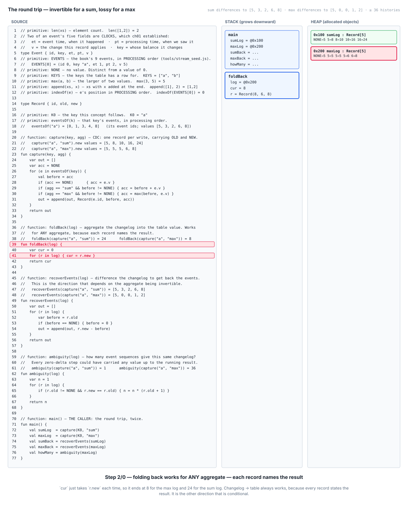

`cur` just takes `r.new` each time, so it ends at 8 for the max log and 24 for the sum log. Changelog → table always works, because every record states the result. It is the other direction that is conditional.

</details>
<details>
<summary><b>Step 3 of 4</b> — differencing recovers the events — for the SUM</summary>

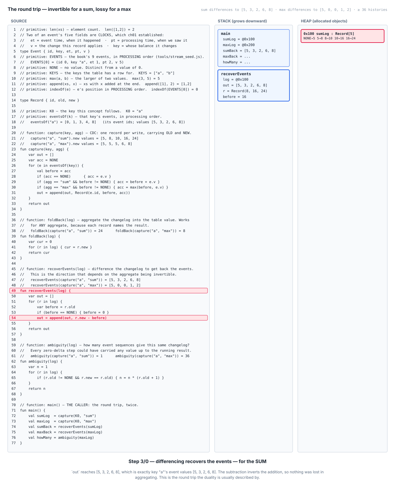

`out` reaches [5, 3, 2, 6, 8], which is exactly key "a"'s event values [5, 3, 2, 6, 8]. The subtraction inverts the addition, so nothing was lost in aggregating. This is the round trip the duality is usually described by.

</details>
<details>
<summary><b>Step 4 of 4</b> — and the SAME function on the max log loses 2 events</summary>

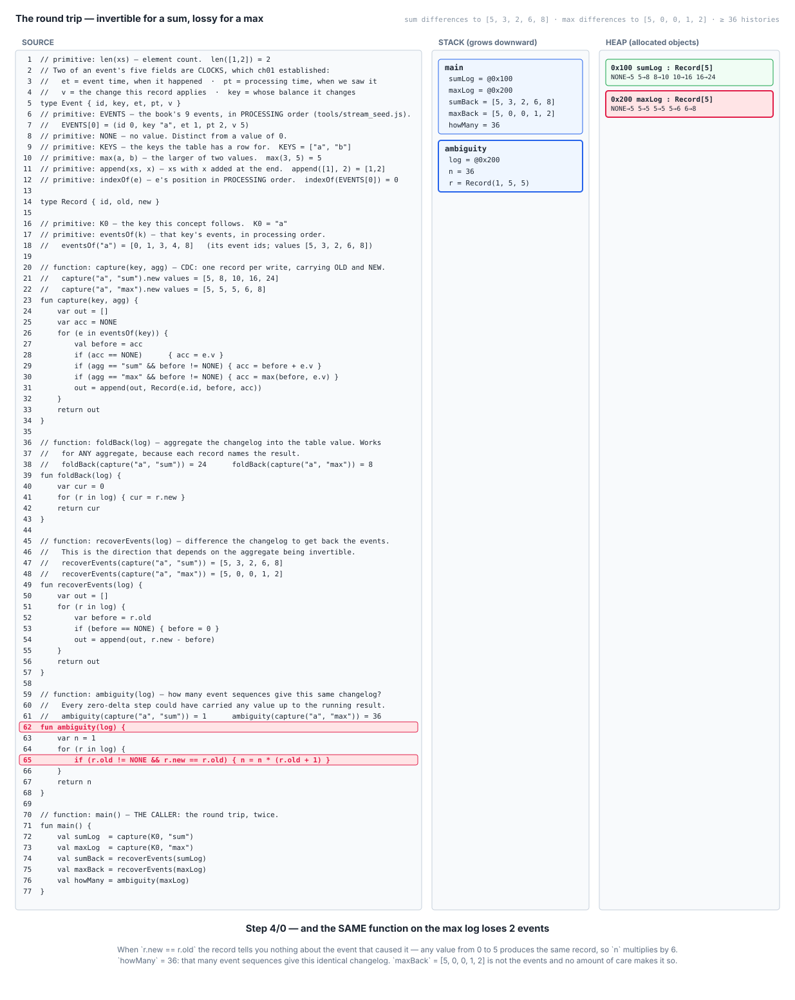

When `r.new == r.old` the record tells you nothing about the event that caused it — any value from 0 to 5 produces the same record, so `n` multiplies by 6. `howMany` = 36: that many event sequences give this identical changelog. `maxBack` = [5, 0, 0, 1, 2] is not the events and no amount of care makes it so.

</details>

<sub>Both changelogs, the recovered deltas and the 36-way ambiguity are computed from the seed and asserted. Generated by `node tools/gen_ch06.js` on `tools/memkit.js`.</sub>

<!-- ch06-duality-memory:end -->

### Why the duality matters in practice

> **Why this matters:** The duality is not philosophy — it decides how systems store, replay, and rebuild state, so this section connects it to the concrete choices a streaming architecture makes.

1. **Materialization is a design choice** — You can materialize a table eagerly (store it) or **recompute it from the stream on demand**. Eager costs storage; lazy costs recompute time.

2. **Kafka is a changelog; a DB index is a table** — A Kafka topic is literally a changelog stream; a database index is a table built from it. **Stream processors sit between the two.**

3. **Time-travel is a table over the stream** — Because the stream is the full history, **any past table is recoverable by folding the stream up to that point** — the stream is the source of truth, the table is a derived view.

4. **Pick the right view for the question** — For "what is the balance now" use the table; for "what happened in order" use the stream. **A good architecture keeps the stream as truth and derives tables as views.**

<!-- ch06-practice:begin — generated by tools/gen_ch06.js; do not hand-edit -->

#### Why materializing is almost always right, and why drift is the real risk

**Materialization is a cost choice with a crossover you can compute.** Eager stores the 2 rows and folds the 9 events **once**; every query is then a lookup. Lazy stores nothing and folds all 9 events **per query**. Over 10 queries that is **9 event reads against 90** — and the crossover is after the *first* query.

Which is why nearly every real system materializes. And the detail that matters more: lazy's cost grows with the **stream length**, not with the number of keys, so it degrades as history accumulates even while the data stays 2 rows.

**Time travel is a fold up to a point**, and it costs nothing extra. Fold events 0..4 and the table reads "a" = 16, "b" = 7 (total 23); fold all of them and it reads "a" = 24, "b" = 21 (total 45). Same function, different end point.

A table-first architecture has to build that deliberately, with an audit table — and then keep the audit table consistent with the real one, which is a second instance of the problem it was solving.

**And here is the risk the duality actually removes.** There are three architectures: stream is truth and the table is derived; table is truth and the stream is derived by CDC; or **both written independently**. The first two are safe because one view is a *function* of the other, so disagreement is impossible. The third has two writers and no function between them, so the views **will** diverge — and nothing detects it, because both stores answer confidently and differently.

The distinction to carry away is **lag versus drift**. A derived view lags: it is behind by some amount and converges. Independently written stores drift: unbounded, and silent.

#### When to materialize, when to recompute, and how the question picks the view

**Materialize by default.** The break-even is one query, and the lazy cost grows with history. Recompute-on-demand is right only for a view queried far less often than it is written — a monthly report over a high-volume stream.

**Keep the stream if any historical question will ever be asked.** Of the four questions this concept poses, three need the stream: "what happened in order", "what was it after event 4" (16), and "was it ever 8". Only "what is it now" (24) is a table question — and it is the one asked constantly, which is why you want both.

**Never write both views independently.** If an existing database is the system of record, derive the stream from it with CDC. If the log is the system of record, derive the table with a stream processor. Pick a direction; do not maintain two writers.

**What this does not settle — and it bounds everything above:** "the stream is the source of truth" holds exactly as long as the stream is **retained**. Set a 7-day retention and every claim here about re-derivation and time travel acquires a 7-day horizon, with nothing in the architecture to announce it.

#### Visual walkthrough — the crossover, the fold, and the three architectures

The animation loops through all 4 steps. Expand any step to study it on its own.



<details>
<summary><b>Step 1 of 4</b> — materialization is a cost choice, and it has a crossover</summary>


Priced rather than argued: eager stores 2 rows and folds 9 events once; lazy stores nothing and folds 9 events every time. Over 10 queries that is 9 reads against 90. The second note is the one that bites in practice — lazy scales with history, so it gets worse while the data stays the same size.

</details>
<details>
<summary><b>Step 2 of 4</b> — time travel is just a fold up to a point</summary>

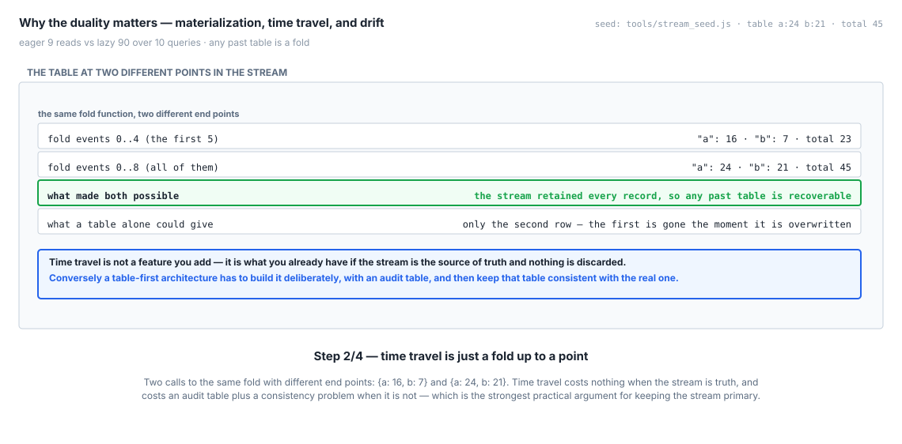

Two calls to the same fold with different end points: {a: 16, b: 7} and {a: 24, b: 21}. Time travel costs nothing when the stream is truth, and costs an audit table plus a consistency problem when it is not — which is the strongest practical argument for keeping the stream primary.

</details>
<details>
<summary><b>Step 3 of 4</b> — so one of the two views has to be the source</summary>

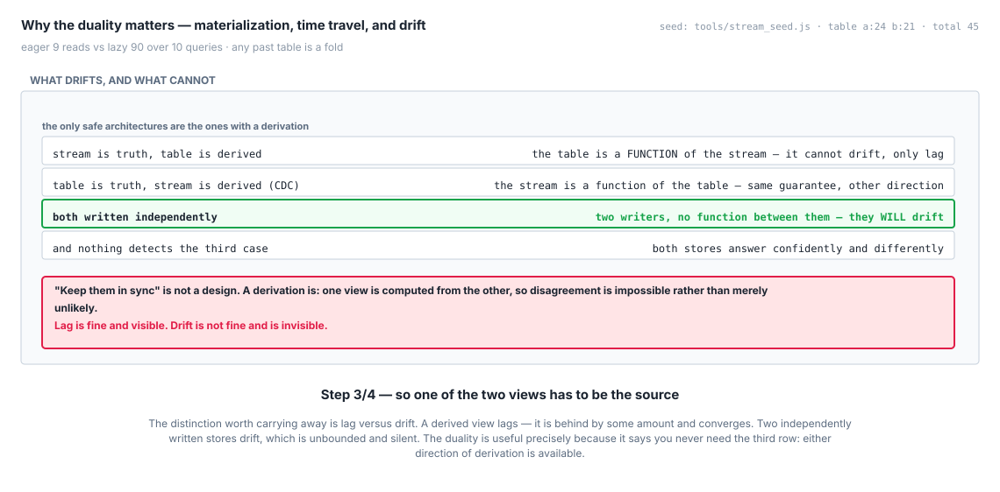

The distinction worth carrying away is lag versus drift. A derived view lags — it is behind by some amount and converges. Two independently written stores drift, which is unbounded and silent. The duality is useful precisely because it says you never need the third row: either direction of derivation is available.

</details>
<details>
<summary><b>Step 4 of 4</b> — and the question picks the view</summary>

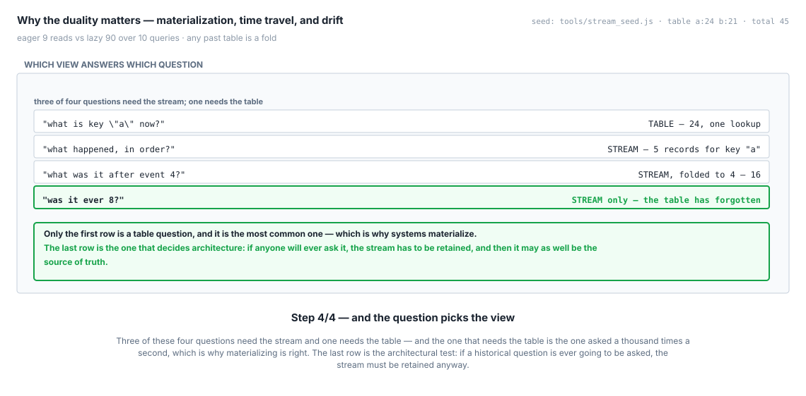

Three of these four questions need the stream and one needs the table — and the one that needs the table is the one asked a thousand times a second, which is why materializing is right. The last row is the architectural test: if a historical question is ever going to be asked, the stream must be retained anyway.

</details>

<sub>The eager/lazy costs and both time-travel tables are computed from the seed and asserted. Generated by `node tools/gen_ch06.js`.</sub>

<!-- ch06-practice:end -->

<!-- ch06-practice-memory:begin — generated by tools/gen_ch06.js; do not hand-edit -->

#### Materialize or recompute — stack and heap at every step

**What is being answered.** Why materializing is almost always right, and why drift — not lag — is the risk worth designing against.

`foldTo(events, upto)` is one function that answers both "what is it now" and "what was it after event 4". The entire mechanism is a single `continue`, which is why time travel is free when the stream is retained.

`drifts(sourceIsStream, bothWritten)` is worth reading for what it **ignores**: `sourceIsStream` never affects the result. Either direction of derivation is safe; only two independent writers produce drift.

The animation steps through the code, holding each line long enough to read the STACK (call frames and their locals) and the HEAP (allocated arrays and objects) as they are AT THAT MOMENT. Expand any step to study it on its own.



<details>
<summary><b>Step 1 of 4</b> — one fold function, bounded by an index, gives any past table</summary>


One `continue` is the whole of time travel: events past index 4 are skipped and `tbl` holds "a" = 16, "b" = 7. No extra storage, no audit table, no second code path — the ability to ask about the past is a consequence of having kept the stream.

</details>
<details>
<summary><b>Step 2 of 4</b> — and the same call with no bound gives the present</summary>

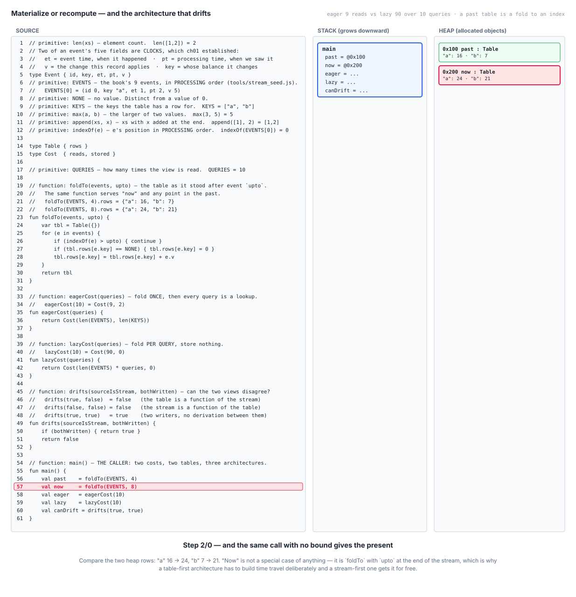

Compare the two heap rows: "a" 16 → 24, "b" 7 → 21. "Now" is not a special case of anything — it is `foldTo` with `upto` at the end of the stream, which is why a table-first architecture has to build time travel deliberately and a stream-first one gets it for free.

</details>
<details>
<summary><b>Step 3 of 4</b> — eager folds once; lazy folds per query</summary>

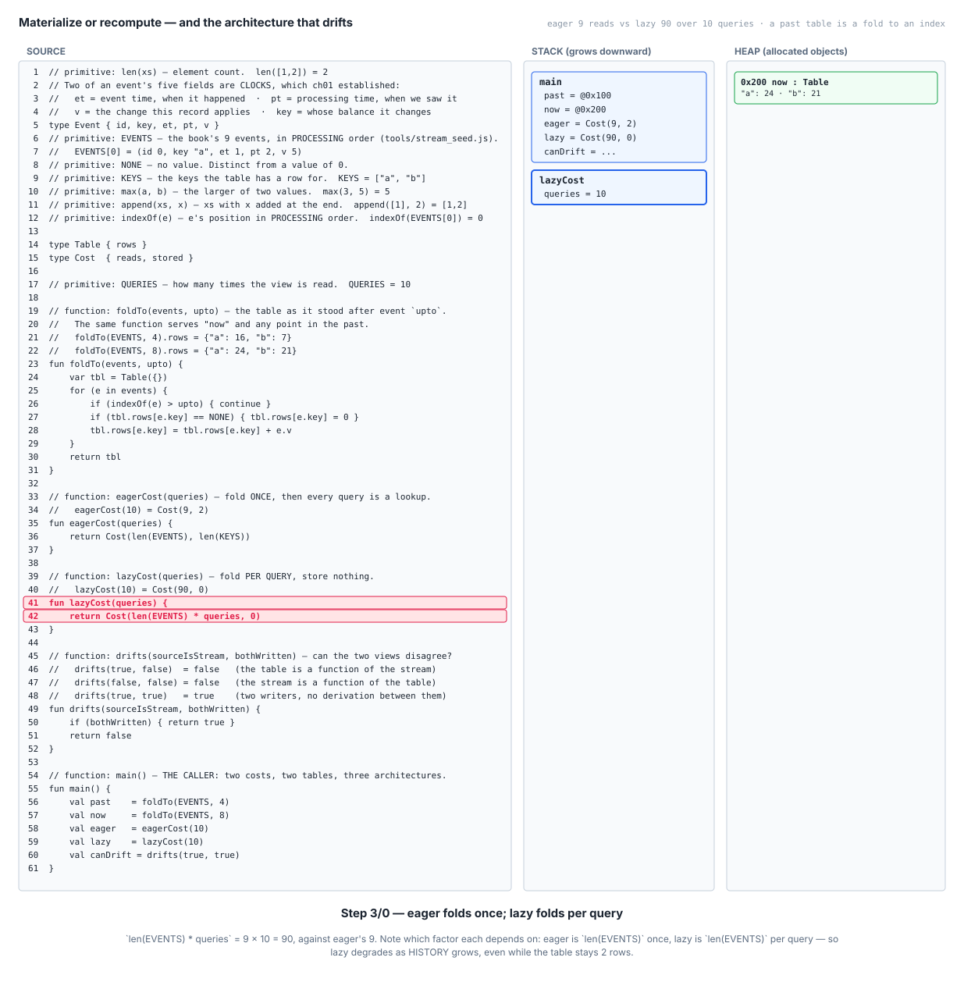

`len(EVENTS) * queries` = 9 × 10 = 90, against eager's 9. Note which factor each depends on: eager is `len(EVENTS)` once, lazy is `len(EVENTS)` per query — so lazy degrades as HISTORY grows, even while the table stays 2 rows.

</details>
<details>
<summary><b>Step 4 of 4</b> — and drift is a property of having two writers</summary>

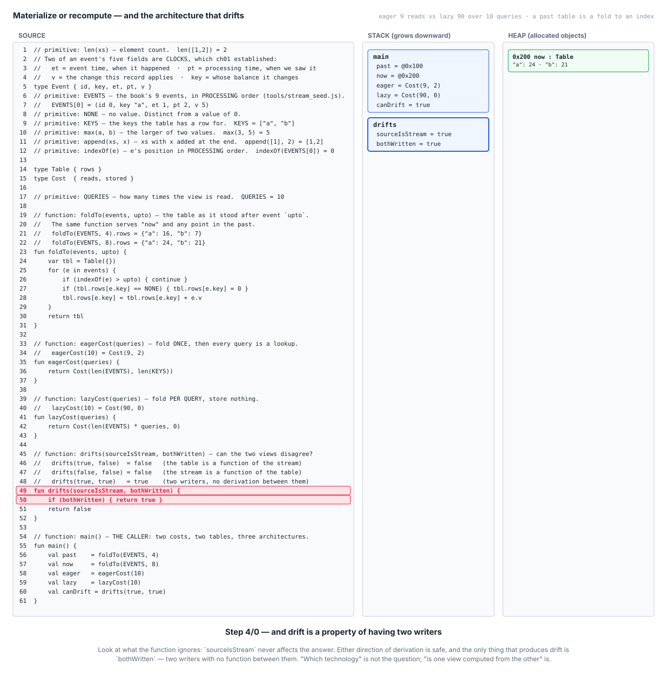

Look at what the function ignores: `sourceIsStream` never affects the answer. Either direction of derivation is safe, and the only thing that produces drift is `bothWritten` — two writers with no function between them. "Which technology" is not the question; "is one view computed from the other" is.

</details>

<sub>Both tables and both cost figures are computed from the seed and asserted. Generated by `node tools/gen_ch06.js` on `tools/memkit.js`.</sub>

<!-- ch06-practice-memory:end -->


## Links & The Bigger Picture

Concepts this chapter mentions but does not fully unpack are linked below — each pointer names the chapter where the concept is covered in depth and gives a concrete example that ties the two chapters together.

- **[Chapter 1: Streaming 101 → Three shapes of data](ch01-streaming-101.md#three-shapes-of-data)** — the bounded/unbounded distinction is the raw material of the duality — a bounded dataset is a table, an unbounded feed is a stream.
  - _Example:_ ch06's "table is the fold of the stream" is ch01's "bounded dataset processed to completion"; ch06's changelog [ +10, -3, +5 ] folds to a table of 12, the same shape ch01 names as streaming.
- **[Chapter 2: The What, Where, When, and How of Data Processing → How — accumulation](ch02-the-what-where-when-and-how-of-data-processing.md#how--accumulation)** — accumulation mode is the "how" that relates successive stream panes — i.e. how a stream becomes a table over time.
  - _Example:_ ch06's changelog fold 10 − 3 + 5 = 12 is ch02's accumulating mode; ch06's (old, new) retraction pair is ch02's accumulating-and-retracting (3 − 3 + 4 = 4).
- **[Chapter 5: Exactly-Once and Side Effects → Side effects — the hard part](ch05-exactly-once-and-side-effects.md#side-effects--the-hard-part)** — a changelog that carries retractions is what lets a downstream sink apply an effect exactly once — ch05 connects the duality to the exactly-once guarantee.
  - _Example:_ ch06's changelog record (7,12) retracts 7 before setting 12; ch05's idempotent sink SET 42 -> 10 uses that same retract-then-set so a retry leaves one value.
- **[Chapter 8: Streaming SQL → SQL as a stream language](ch08-streaming-sql.md#sql-as-a-stream-language)** — append-only vs updating results is the SQL vocabulary for the duality — an updating query emits retractions, an append-only one emits new facts.
  - _Example:_ ch06's table update (7,12) is ch08's "updating result" that retracts (C1, 3) before adding (C1, 4); ch06's append-only changelog is ch08's append-only query mode.
- **[Chapter 10: The Evolution of Large-Scale Data Processing → Lambda and Kappa](ch10-the-evolution-of-large-scale-data-processing.md#lambda-and-kappa)** — the stream as source of truth is the premise of the Kappa architecture — keep the log, derive tables, replay to reprocess.
  - _Example:_ ch06's "any past table is a fold of the stream" is ch10's Kappa replay: rewind the log to offset 0 and fold r1, r2, r3 through the new pipeline to rebuild the corrected table.

## System Design Interview

> **The question:** Design one system that keeps a balance table and a balance-change stream as two consistent views. Use case: fraud detection needs the real-time change feed while the database holds current balances. Premise: the table is the materialized fold of the changelog (CDC), so the two views cannot drift.

**The pipeline:** database (table) -> change capture (CDC) -> changelog stream -> stream processor (fold) -> materialized view (table)

<a href="../diagrams/d2/decomp/ch06-0.png"></a>

### database (table)

_Role: database — holds the source table_

- account 42 balance is 7, then updates to 12
- the database is table-centric state
- the update is the event that CDC will capture

### change capture (CDC)

_Role: change capture — turns table writes into a changelog_

- the update 7 -> 12 emits the changelog record (7,12)
- the record carries the old value for retraction
- the changelog is append-only and ordered

### changelog stream

_Role: changelog stream — the stream view of the data_

- the stream is [ (0,10), (10,7), (7,12) ]
- it is the source of truth — history is retained
- any past table is a fold up to that point

### stream processor (fold)

_Role: stream processor — derives tables from the stream_

- the fold applies each (old, new) pair
- after (7,12) the materialized balance is 12
- the derived table matches the source database


<!-- ch06-system:begin — generated by tools/gen_ch06.js; do not hand-edit -->

#### Why a single writer is the whole guarantee

**The question.** Keep a balance table and a balance-change stream as two consistent views: fraud detection needs the real-time change feed while the database holds current balances.

**The pipeline:** database (table) → change capture (CDC) → changelog stream → stream processor (fold) → materialized view (table).

This runs the derivation **table → stream**, which is right when an existing database is already the system of record. And the guarantee is one property: **there is exactly one writer of the stream** — the CDC component. Application code writes the table; CDC writes the stream; nothing writes both. Drift becomes impossible rather than unlikely.

**The final fold is not redundant** — it is the check. Re-fold the changelog and compare: "a" = 24, "b" = 21, total **45** both ways. Run it continuously and a CDC gap shows up as a divergence, rather than as a wrong fraud decision three weeks later.

**And the record format follows from the consumer's question.** Fraud detection asks "how much did this balance move?" — a question about the **change**. For the last update that is `24 − 16 = 8`, and it is unrecoverable from a record carrying only 24. Worse, a record carrying only the new value, into a consumer that sums, gives **40** instead of 24.

A consumer *could* reconstruct deltas by keeping its own copy of the previous value — which is to say by rebuilding the table it was trying not to need. So the changelog carries **old and new**.

#### When to run the derivation each way, and the four things this does not settle

**Derive stream from table (this design) when a database is already the system of record** and you cannot rewrite the application. CDC is the lowest-disruption way to get a stream, and the single-writer property comes for free.

**Derive table from stream when you are building new.** It makes time travel and re-derivation free rather than retrofitted, and the fold is simpler than change capture.

**Run the comparison continuously, not as a test.** It is the only thing in this design that can fail loudly, and the failure it catches — a missed write — is otherwise silent.

**What this design does NOT settle — four gaps:**

1. **The check proves the views AGREE, not that either is right.** A value computed wrongly by the application, written to the table and faithfully captured, passes every check in this design. Catching that needs a reference outside the system.
2. **The fold recovers the TABLE, not necessarily the events.** For an invertible aggregate differencing works; for a max, at least 36 histories are consistent with the same changelog. If a consumer needs the events, ship the events.
3. **Lazy re-derivation costs 9 reads per query and scales with history**, so "we can always recompute it" expires quietly as the stream grows.
4. **Nothing here bounds the changelog.** The stream is the source of truth only while it is retained, and past that horizon re-derivation and time travel both stop working — which is the assumption most worth writing down, because nothing in the running system announces it.

#### Visual walkthrough — one writer per view, and the check that catches a gap

The animation loops through all 4 steps. Expand any step to study it on its own.



<details>
<summary><b>Step 1 of 4</b> — the pipeline, and which direction the derivation runs</summary>


This design runs the derivation table → stream, which is the right direction when an existing database is already the system of record. The single-writer property in the note is the whole guarantee: application code writes the table, CDC writes the stream, and nothing writes both. The final fold exists to make the agreement testable.

</details>
<details>
<summary><b>Step 2 of 4</b> — the consistency check, with real values</summary>

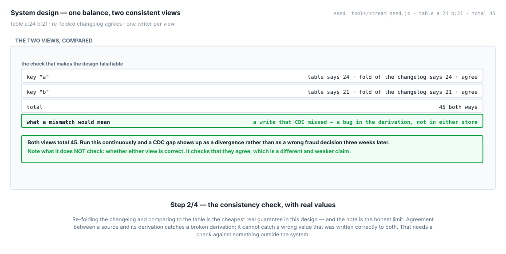

Re-folding the changelog and comparing to the table is the cheapest real guarantee in this design — and the note is the honest limit. Agreement between a source and its derivation catches a broken derivation; it cannot catch a wrong value that was written correctly to both. That needs a check against something outside the system.

</details>
<details>
<summary><b>Step 3 of 4</b> — and the changelog must carry the old value</summary>

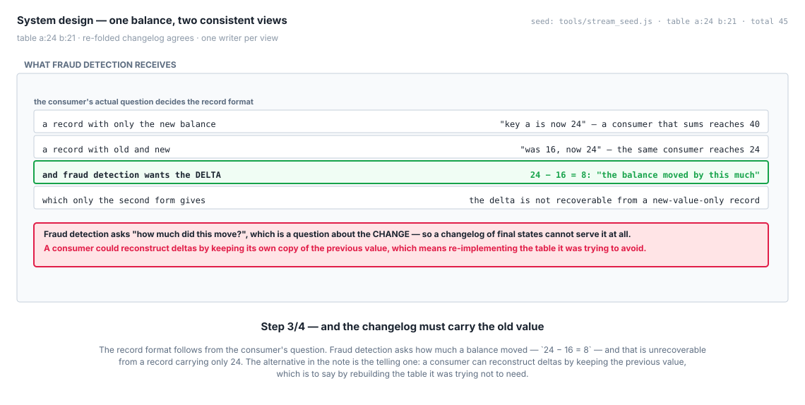

The record format follows from the consumer's question. Fraud detection asks how much a balance moved — `24 − 16 = 8` — and that is unrecoverable from a record carrying only 24. The alternative in the note is the telling one: a consumer can reconstruct deltas by keeping the previous value, which is to say by rebuilding the table it was trying not to need.

</details>
<details>
<summary><b>Step 4 of 4</b> — and what this design does NOT settle</summary>

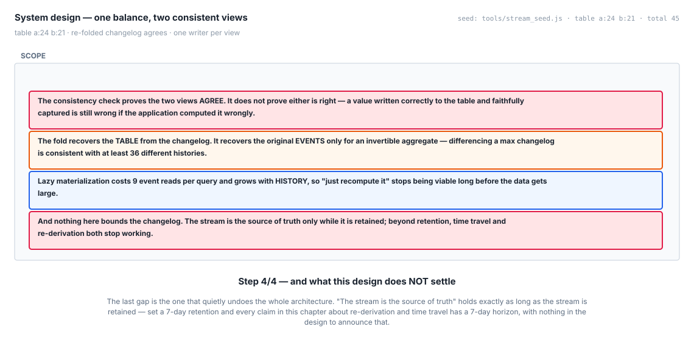

The last gap is the one that quietly undoes the whole architecture. "The stream is the source of truth" holds exactly as long as the stream is retained — set a 7-day retention and every claim in this chapter about re-derivation and time travel has a 7-day horizon, with nothing in the design to announce that.

</details>

<sub>The table, the re-folded changelog and the delta figures are computed from the seed and asserted equal. Generated by `node tools/gen_ch06.js`.</sub>

<!-- ch06-system:end -->

<!-- ch06-system-memory:begin — generated by tools/gen_ch06.js; do not hand-edit -->

#### Two views, one writer each — stack and heap at every step

**What is being answered.** How two views of one balance are kept consistent — and what the consistency check can and cannot catch.

`applyWrite` does both writes in one place: the table row, then a Record carrying `before` and the new value. One writer per view, so agreement is structural rather than maintained.

`audit` re-folds the log and compares totals. Step 4 runs it with one capture deliberately skipped: the table reads 45 and the re-folded log reads 37, so `agree` is false and the gap is exactly the uncaptured 8. Without that check it is a fraud feed silently missing a balance change.

The animation steps through the code, holding each line long enough to read the STACK (call frames and their locals) and the HEAP (allocated arrays and objects) as they are AT THAT MOMENT. Expand any step to study it on its own.



<details>
<summary><b>Step 1 of 4</b> — the application writes the table; CDC writes the log</summary>


Two writes, one per view, and they are in the same function so they cannot get out of step: `tbl.rows` is updated, then a Record carrying `before` and the new value is appended. Nothing else in the design writes either view — which is what makes agreement structural rather than hoped for.

</details>
<details>
<summary><b>Step 2 of 4</b> — re-folding the log reconstructs the table</summary>

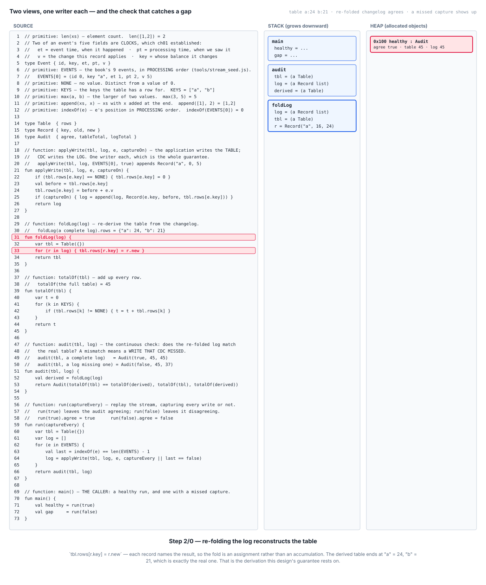

`tbl.rows[r.key] = r.new` — each record names the result, so the fold is an assignment rather than an accumulation. The derived table ends at "a" = 24, "b" = 21, which is exactly the real one. That is the derivation this design's guarantee rests on.

</details>
<details>
<summary><b>Step 3 of 4</b> — the audit compares the two, and agrees</summary>

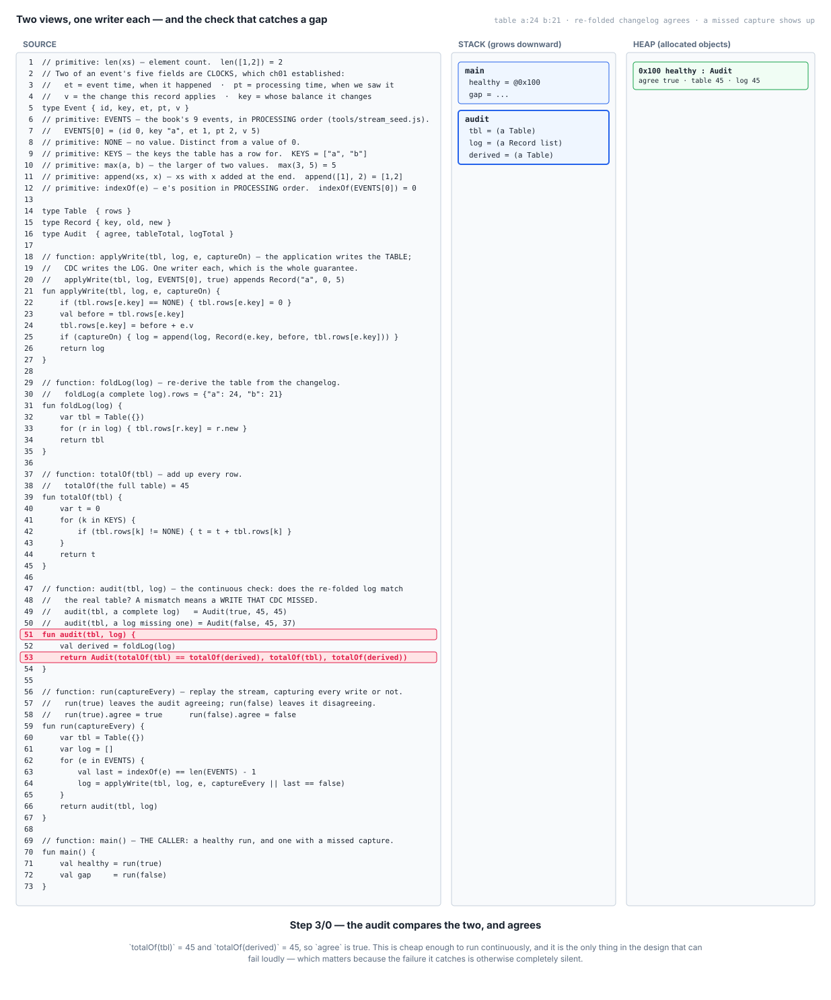

`totalOf(tbl)` = 45 and `totalOf(derived)` = 45, so `agree` is true. This is cheap enough to run continuously, and it is the only thing in the design that can fail loudly — which matters because the failure it catches is otherwise completely silent.

</details>
<details>
<summary><b>Step 4 of 4</b> — and one missed capture makes it disagree</summary>

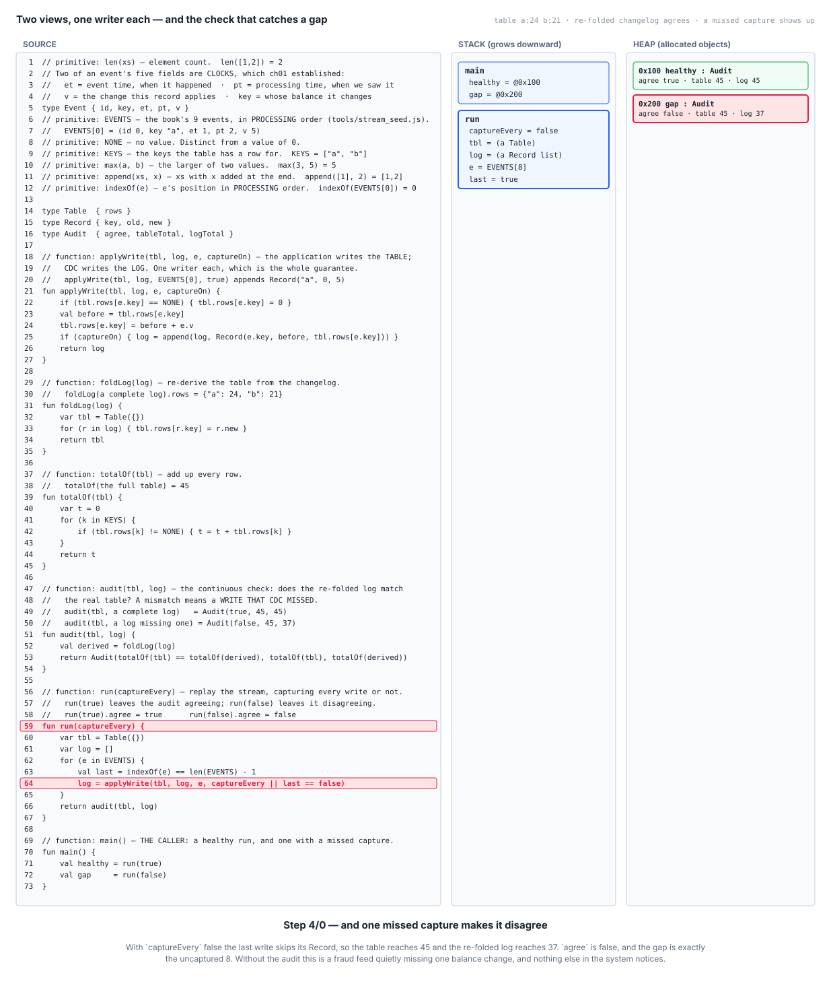

With `captureEvery` false the last write skips its Record, so the table reaches 45 and the re-folded log reaches 37. `agree` is false, and the gap is exactly the uncaptured 8. Without the audit this is a fraud feed quietly missing one balance change, and nothing else in the system notices.

</details>

<sub>Both audit outcomes are computed from the seed and asserted. Generated by `node tools/gen_ch06.js` on `tools/memkit.js`.</sub>

<!-- ch06-system-memory:end -->

## Interview Questions

### Q1

A service stores account balances in a database but also needs a real-time feed of balance changes for fraud detection; the two systems keep drifting out of sync.

**Interviewer's question:** How do you keep a table of balances and a stream of balance changes as two consistent views of the same data?

**Solution:** Treat them as the stream-table duality: capture the database's changes into a changelog stream (CDC), and derive the table as the materialized fold of that stream.

**System-design components:**
- Table — the database state
- Changelog stream — CDC output
- Fold — rebuilds the table from the stream
- Retraction — (old, new) pairs

```java
// table balance 7 -> 12
//   CDC emits (7,12) to the changelog
//   consumer folds -> table 12 (matches source)
//   stream = source of truth, table = derived view
```

_This is exactly the stream-table duality material in this chapter._

_Covers:_ 5. Table -> stream · 6. The round-trip · 8. Stream as source of truth

_From the 28 problems:_ 26-payment-system

### Q2

An ad-click pipeline needs both a per-minute event feed and a per-campaign running total, but the team built two separate systems that disagree.

**Interviewer's question:** How do you model the event feed and the running total so they never disagree?

**Solution:** Keep the event feed as the stream of truth and derive the per-campaign total as a table by aggregating the stream — one system, two views.

**System-design components:**
- Stream — the event feed
- Table — the per-campaign total
- Aggregation — stream -> table

```java
// clicks [ +1, +1, +1 ] campaign C
//   stream: 3 events, table: total 3
//   both from the same source -> cannot disagree
```

_This is exactly the stream -> table material in this chapter._

_Covers:_ 4. Stream -> table · 7. Materialize vs recompute

_From the 28 problems:_ 21-ad-click-aggregation

## Key Concepts

### The Problem

**1. One dataset, two forms.** A stream is the change log; a table is the materialized view — two views of one thing.


### The Solution

A stream is a sequence of events over time — an append-only change log.

```java
// table balance 7 -> 12
//   CDC emits (7,12) to the changelog
//   consumer folds -> table 12 (matches source)
//   stream = source of truth, table = derived view
```


### Key Facts

| Fact | Detail | In the wild |
|---|---|---|
| 2. Streams | A stream is a sequence of events over time — an append-only change log. | A Kafka topic is a stream. |
| 3. Tables | A table is a snapshot of state at a point in time — a materialized view. | A SQL materialized view or a database index is a table. |
| 4. Stream -> table | Aggregating a stream produces a table — the materialized view of the stream. | A Flink keyed aggregation produces a stateful table. |
| 5. Table -> stream | Capturing a table's changes produces a changelog stream — change-data-capture. | Debezium CDC turns MySQL/Postgres into Kafka changelogs. |
| 6. The round-trip | Aggregating the change log reproduces the table; capturing the table's changes reproduces the change log. | This is the theoretical basis for stream-table systems. |
| 7. Materialize vs recompute | Eager materialization costs storage; lazy recompute-from-stream costs time. | A cache (eager) vs a query-time fold (lazy) is the production choice. |
| 8. Stream as source of truth | Keep the stream as the source of truth and derive tables as views — any past table is a fold of the stream up to that point. | Event-sourced systems are the production form. |


### Tradeoffs & When

- Eager materialization costs storage; lazy recompute-from-stream costs time.
- Keep the stream as the source of truth and derive tables as views — any past table is a fold of the stream up to that point.


### Real-World Examples

- **Apache Kafka** — A topic is a changelog stream; the retained log is the source of truth
- **Debezium** — Change-data-capture turning MySQL and Postgres tables into Kafka changelogs
- **Kafka Streams** — KStream (stream) and KTable (table) as the dual API
- **Event sourcing** — The pattern of keeping the event stream as truth and deriving projections


<details><summary>All concepts (index)</summary>

### Why: 1. One dataset, two forms

**Why.** The same data appears as motion (what happened) and as state (what is true now), and mixing the two causes confusion.

**Claim.** A stream is the change log; a table is the materialized view — two views of one thing.

**Grounding.** The book's core Part II idea is the stream-table duality.

**In the wild.** Kafka (stream) vs a database index (table) are the two projections.

<a href="../diagrams/d2/card/ch06-0.png"></a>
### View: 2. Streams

**Why.** Order of events and history matter when the question is "what happened".

**Claim.** A stream is a sequence of events over time — an append-only change log.

**Grounding.** It answers "what happened".

**In the wild.** A Kafka topic is a stream.

<a href="../diagrams/d2/card/ch06-1.png"></a>
### View: 3. Tables

**Why.** A point-in-time answer needs a snapshot, not a history.

**Claim.** A table is a snapshot of state at a point in time — a materialized view.

**Grounding.** It answers "what is true now".

**In the wild.** A SQL materialized view or a database index is a table.

<a href="../diagrams/d2/card/ch06-2.png"></a>
### Direction: 4. Stream -> table

**Why.** To answer "what is the current total" from a feed of events, aggregate them.

**Claim.** Aggregating a stream produces a table — the materialized view of the stream.

**Grounding.** The table is the fold of the stream.

**In the wild.** A Flink keyed aggregation produces a stateful table.

<a href="../diagrams/d2/card/ch06-3.png"></a>
### Direction: 5. Table -> stream

**Why.** To react to database changes in real time, capture them as a feed.

**Claim.** Capturing a table's changes produces a changelog stream — change-data-capture.

**Grounding.** The changelog records (old, new) pairs so updates are reversible.

**In the wild.** Debezium CDC turns MySQL/Postgres into Kafka changelogs.

<a href="../diagrams/d2/card/ch06-4.png"></a>
### Duality: 6. The round-trip

**Why.** The two directions should be inverses — that is the formal statement of the duality.

**Claim.** Aggregating the change log reproduces the table; capturing the table's changes reproduces the change log.

**Grounding.** The round-trip is lossless for a changelog that carries old and new values.

**In the wild.** This is the theoretical basis for stream-table systems.

<a href="../diagrams/d2/card/ch06-5.png"></a>
### Choice: 7. Materialize vs recompute

**Why.** Keeping a table has a cost, and recomputing it also has a cost — the duality makes the trade explicit.

**Claim.** Eager materialization costs storage; lazy recompute-from-stream costs time.

**Grounding.** The stream is the source of truth; the table is a derived view.

**In the wild.** A cache (eager) vs a query-time fold (lazy) is the production choice.

<a href="../diagrams/d2/card/ch06-6.png"></a>
### Truth: 8. Stream as source of truth

**Why.** A table alone loses history; a stream alone is inconvenient for lookups.

**Claim.** Keep the stream as the source of truth and derive tables as views — any past table is a fold of the stream up to that point.

**Grounding.** Time-travel is free if the stream is retained.

**In the wild.** Event-sourced systems are the production form.

<a href="../diagrams/d2/card/ch06-7.png"></a>

</details>


## Quiz

1. What is a stream in the stream-table duality?

   - A. A snapshot of state
   - B. A sequence of events over time
   - C. A database index
   - D. A materialized view

<details><summary>Reveal answer</summary>

**B.** A stream is the moving, append-only change log.

</details>

2. What is a table in the stream-table duality?

   - A. An event feed
   - B. A changelog
   - C. A snapshot of state at a point in time
   - D. A retraction

<details><summary>Reveal answer</summary>

**C.** A table is the still, materialized view of state.

</details>

3. Aggregating a stream produces a ___ .

   - A. stream
   - B. table
   - C. changelog
   - D. watermark

<details><summary>Reveal answer</summary>

**B.** Aggregation folds the stream into a materialized table.

</details>

4. What does change-data-capture (CDC) produce?

   - A. A table
   - B. A changelog stream of a table's changes
   - C. A watermark
   - D. A window

<details><summary>Reveal answer</summary>

**B.** CDC turns table writes into a changelog stream of (old, new) pairs.

</details>

5. Why keep the stream as the source of truth?

   - A. It is faster to query
   - B. Any past table is recoverable by folding the stream
   - C. It uses less storage
   - D. It never needs retractions

<details><summary>Reveal answer</summary>

**B.** The stream is the full history, so any past table is a fold up to that point.

</details>

## Sources

- [Michael Noll — "Of Streams and Tables in Kafka and Stream Processing, Part 1"](https://www.confluent.io/blog/kafka-streams-tables-part-1-event-streaming/) — The stream-table duality as implemented in Kafka Streams
- [Apache Kafka — Kafka Streams documentation](https://kafka.apache.org/documentation/streams/) — KStream and KTable as the two views of the same data
- [Debezium documentation](https://debezium.io/documentation/reference/stable/) — Change-data-capture that turns database tables into changelog streams
- [Akidau et al. — "The Dataflow Model" (VLDB 2015)](https://www.vldb.org/pvldb/vol8/p1792-Akidau.pdf) — The stream and table relationship in the processing model

