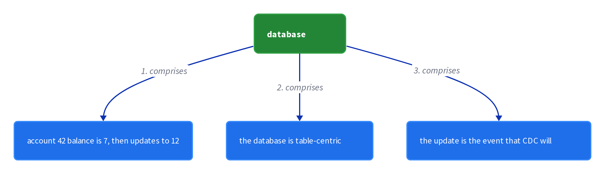
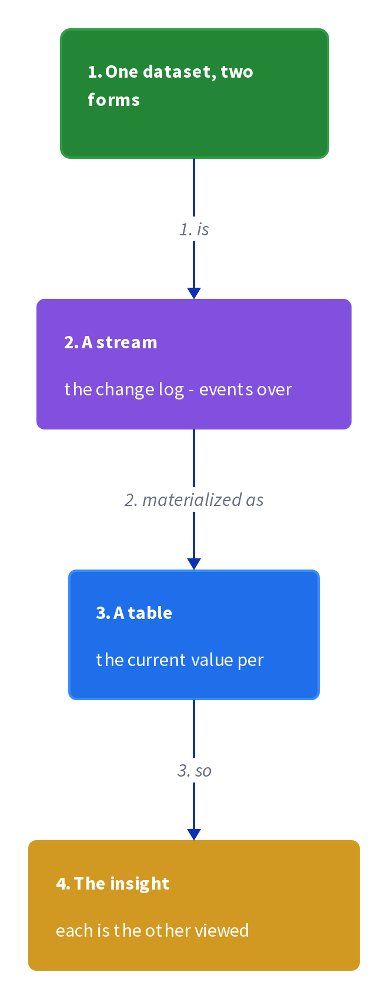
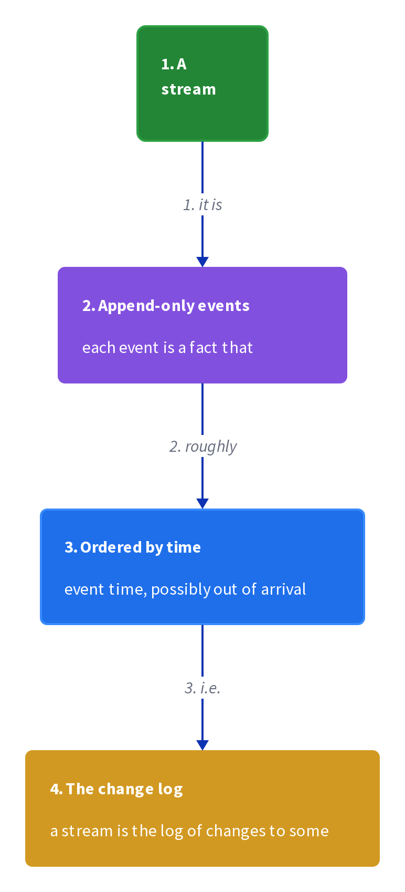
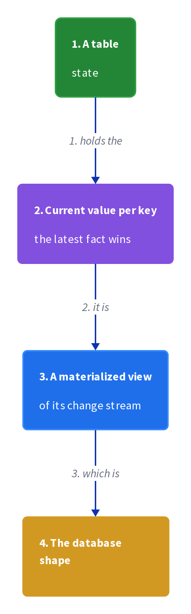
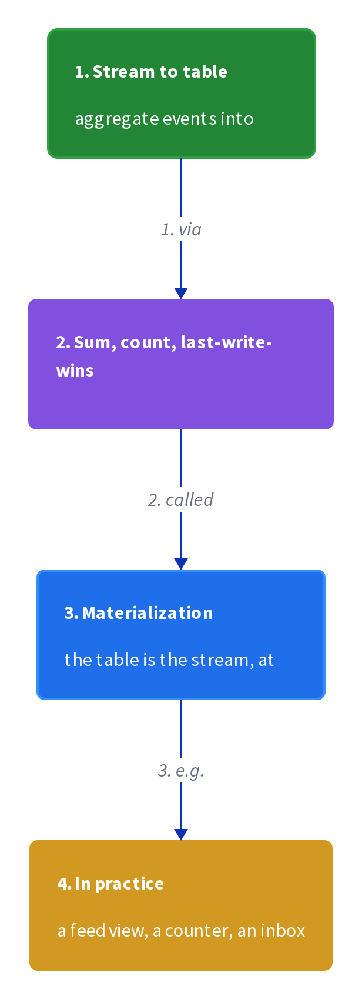
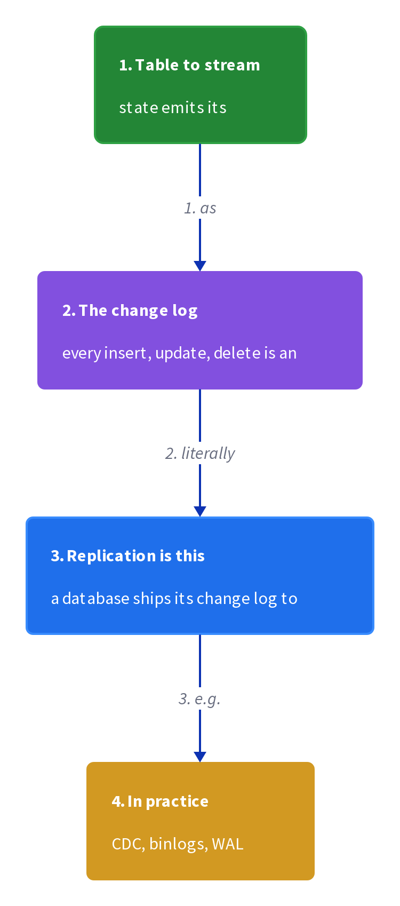
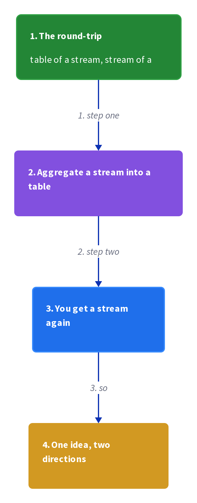
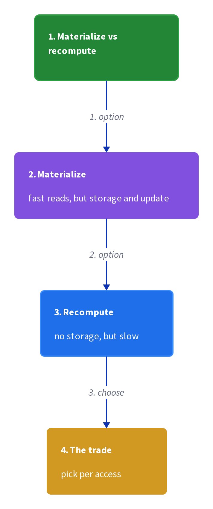
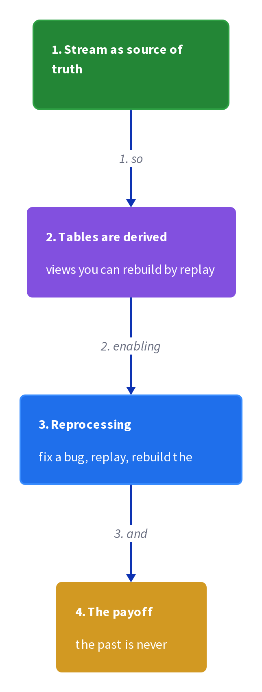

# Chapter 6: Streams and Tables

> Streams and tables are two views of the same data — a stream is the change log of a table, and a table is the materialized aggregate of a stream — and every data-processing system picks a point on this duality.

_Also known as: SS Ch06 · Stream-Table Duality · Change Log · Materialized View · Stream · Table_

## Flow

### The two faces of data

> **Why this matters:** Every dataset has a moving form and a still form, and much confusion in data systems comes from not naming which one is being discussed, so this section fixes the two terms.

1. **A stream is motion** — A stream is a **sequence of events over time** — a change log, an event feed, an append-only sequence. It answers "what happened".

2. **A table is state** — A table is a **snapshot of state at a point in time** — a materialized view, a map, a balance. It answers "what is true now".

3. **They are two views of one thing** — The stream of balance changes and the table of current balances describe **the same underlying data**. The stream is the table's history; the table is the stream's present.

4. **Databases and event systems picked a side** — A relational database is table-centric (it materializes state); an event log like Kafka is stream-centric (it records motion). **Each is a projection of the same duality.**

```java
// ACCOUNT SIDE — the same three balance changes seen as a stream and as a table
// DEF: stream — the append-only sequence of balance changes = [ "+10", "-3", "+5" ]
// DEF: table — the materialized balance = { 42: 12 }
// DEF: account — the key of the balance record = 42
// STATE (before):
//    table : { 42: 7 }
// ======================================================================
// offset 0: {op: "+10", account: 42}
// offset 1: {op: "-3", account: 42}
// offset 2: {op: "+5", account: 42}
// ======================================================================
// step 1 · append the change to the stream -> stream : [ "+10", "-3" ] -> [ "+10", "-3", "+5" ]
//    -> input  : change = "+5", stream = [ "+10", "-3" ]
//    <- output : stream = [ "+10", "-3", "+5" ]   BECAUSE the stream is append-only history
// step 2 · apply to the table -> table[42] : 7 -> 12
//    -> input  : change = "+5", table[42] = 7
//    <- output : table[42] = 12   BECAUSE 7 + 5 = 12
// step 3 · the two views stay consistent -> stream tail "+5" and table 12 describe the same account
//    -> input  : stream tail = "+5", table[42] = 12
//    <- output : views consistent, stream tail "+5" = table 12   BECAUSE the table is the running sum
// ======================================================================
// downstream : change "+5" -> stream [ "+10", "-3", "+5" ] -> table 7 -> 12   BECAUSE the table is the fold of the stream
//    derivation : table = 10 - 3 + 5 = 12, exactly the last value of the folded stream
```

### The duality

> **Why this matters:** The real power is the ability to move between the two views — aggregate a stream into a table, or capture a table's changes back into a stream — so this section covers both directions.

1. **Stream -> table by aggregation** — Aggregating a stream (sum, count, group-by) produces a table. **The table is the materialized view of the stream** — recompute it from the stream and you get the same state.

2. **Table -> stream by change capture** — Capturing a table's changes (inserts, updates, deletes) produces a stream — the **change log**. This is how change-data-capture (CDC) turns a database into a stream.

3. **The two directions are inverses** — **Aggregating the change log reproduces the table, and capturing the table's changes reproduces the change log.** That round-trip is the duality.

4. **A changelog stream carries old and new values** — For an update to be reversible, the change record must carry **both the old value (retraction) and the new value** — a changelog stream, not just a list of new values.

```java
// CHANGE-CAPTURE SIDE — a table update becomes a changelog record that can rebuild the table
// DEF: changelog — the stream of (old, new) pairs for a key = [ "(0,10)", "(10,7)", "(7,12)" ]
// DEF: table — the materialized balance = { 42: 12 }
// DEF: cdc — change-data-capture, which turns table writes into changelog records = "(7,12)"
// STATE (before):
//    table : { 42: 7 }
// ======================================================================
// offset 0: {account: 42, old: 10, new: 7}
// offset 1: {account: 42, old: 7, new: 12}
// ======================================================================
// BUILD PHASE · run once when the table is materialized
// step 0 · initialize the changelog and table registers -> changelog : none -> [ "(0,10)", "(10,7)" ], table : none -> { 42: 7 }
//    -> input  : the materialized table = { 42: 7 }, prior changelog = [ "(0,10)", "(10,7)" ]
//    <- output : changelog = [ "(0,10)", "(10,7)" ], table = { 42: 7 }   BECAUSE capture starts from the current state
// QUERY PHASE · per table update
// step 1 · capture the change -> changelog : [ "(0,10)", "(10,7)" ] -> [ "(0,10)", "(10,7)", "(7,12)" ]
//    -> input  : table update = (old 7, new 12), changelog = [ "(0,10)", "(10,7)" ]
//    <- output : changelog = [ "(0,10)", "(10,7)", "(7,12)" ]   BECAUSE the database update 7 -> 12 is captured
// step 2 · the downstream consumer folds the changelog -> table[42] : 7 -> 12
//    -> input  : changelog pair = "(7,12)", table[42] = 7
//    decode 2a · read the new pair from the changelog -> pair : none -> "(7,12)"
//    decode 2b · retract the old value 7 -> table[42] : 7 -> 0
//    decode 2c · set the new value 12 -> table[42] : 0 -> 12
//    <- output : table[42] = 12   BECAUSE the last pair (7,12) sets the new value
// step 3 · a retraction of the old value is implicit in the pair -> table[42] : 7 -> 12
//    -> input  : pair = "(7,12)", old = 7, new = 12
//    <- output : table[42] = 12   BECAUSE the old 7 is replaced by the new 12
// ======================================================================
// TRACE (update 7 -> 12):
//    step           | changelog                  | table
//    capture (7,12) | [ (0,10),(10,7),(7,12) ]   | 7
//    fold (7,12)    | unchanged                  | 12
// CORRECTNESS (round-trip lemma): each (old, new) pair retracts the old value and sets the new one, so folding the
//    changelog reproduces the table — (0,10) then (10,7) then (7,12) fold to 12, exactly the value the database wrote.
// VARIANTS (when to pick which):
//    full (old,new) changelog -> one capture + one fold per update, reversible (use when downstream must undo updates)   <- THIS ONE
//    new-value-only stream     -> one capture per update, smaller records (use when retraction is not needed)
//    snapshot + delta          -> one periodic copy, periodic full copy (use when the table is rebuilt infrequently)
// ======================================================================
// downstream : database 7 -> changelog (7,12) -> fold -> table 12   BECAUSE change capture + fold = the same state
//    derivation : fold = 10 - 10 + 7 - 7 + 12 = 12, the table value   BECAUSE each (old,new) pair retracts old then sets new
```

### Why the duality matters in practice

> **Why this matters:** The duality is not philosophy — it decides how systems store, replay, and rebuild state, so this section connects it to the concrete choices a streaming architecture makes.

1. **Materialization is a design choice** — You can materialize a table eagerly (store it) or **recompute it from the stream on demand**. Eager costs storage; lazy costs recompute time.

2. **Kafka is a changelog; a DB index is a table** — A Kafka topic is literally a changelog stream; a database index is a table built from it. **Stream processors sit between the two.**

3. **Time-travel is a table over the stream** — Because the stream is the full history, **any past table is recoverable by folding the stream up to that point** — the stream is the source of truth, the table is a derived view.

4. **Pick the right view for the question** — For "what is the balance now" use the table; for "what happened in order" use the stream. **A good architecture keeps the stream as truth and derives tables as views.**

```java
// REPLAY SIDE — the stream rebuilds a past table, proving it is the source of truth
// DEF: stream — the full changelog = [ "+10", "-3", "+5" ]
// DEF: table — a snapshot of balance, recoverable at any point = { 42: 12 }
// DEF: balance — the keyed fold of the stream = { 42: 0 }
// STATE (before):
//    balance : { 42: 0 }
// ======================================================================
// offset 0: {op: "+10", account: 42}
// offset 1: {op: "-3", account: 42}
// offset 2: {op: "+5", account: 42}
// ======================================================================
// BUILD PHASE · run once before the fold begins
// step 0 · initialize the fold register -> balance : none -> { 42: 0 }
//    -> input  : the full changelog = [ "+10", "-3", "+5" ], balance = { 42: 0 }
//    <- output : balance = { 42: 0 }   BECAUSE the fold starts from zero
// QUERY PHASE · per changelog event
// step 1 · fold events up to index 2 -> balance[42] : 0 -> 10 -> 7
//    -> input  : stream = [ "+10", "-3", "+5" ], fold to index 2, balance = { 42: 0 }
//    decode 1a · apply the first event +10 -> balance[42] : 0 -> 10
//    decode 1b · apply the second event -3 -> balance[42] : 10 -> 7
//    <- output : balance[42] = 7   BECAUSE +10 then -3
// step 2 · the past table is materialized -> table : {} -> { 42: 7 }
//    -> input  : balance = { 42: 7 }, fold index = 2
//    <- output : table = { 42: 7 }   BECAUSE +10 - 3 = 7
// step 3 · fold one more event -> table[42] : 7 -> 12
//    -> input  : table = { 42: 7 }, next event = "+5"
//    <- output : table[42] = 12   BECAUSE +5 brings it to the present
// ======================================================================
// TRACE (stream [ +10, -3, +5 ]):
//    fold index | event | balance
//    0          | +10   | 10
//    1          | -3    | 7
//    2          | +5    | 12
// CORRECTNESS (fold-invariant lemma): each fold index k yields the sum of the first k events — after +10 then -3 the
//    balance is 10 - 3 = 7, and after +5 it is 10 - 3 + 5 = 12, so any past table is the fold of the stream up to that
//    point.
// VARIANTS (when to pick which):
//    eager materialize -> one read of the stored table, pays storage (use for hot lookups)
//    lazy fold on read -> one fold over the whole stream, pays recompute (use for rare lookups)   <- THIS ONE
//    checkpointed fold -> one checkpoint load, resume at a snapshot (use when the stream is long)
// ======================================================================
// downstream : stream [ "+10", "-3", "+5" ] -> fold to 7 -> fold to 12   BECAUSE both are folds of the same stream
//    derivation : table(2) = 10 - 3 = 7, and table(3) = 10 - 3 + 5 = 12
```


## Links & The Bigger Picture

Concepts this chapter mentions but does not fully unpack are linked below — each pointer names the chapter where the concept is covered in depth and gives a concrete example that ties the two chapters together.

- **[Chapter 1: Streaming 101 → Three shapes of data](ch01-streaming-101.md#three-shapes-of-data)** — the bounded/unbounded distinction is the raw material of the duality — a bounded dataset is a table, an unbounded feed is a stream.
  - _Example:_ ch06's "table is the fold of the stream" is ch01's "bounded dataset processed to completion"; ch06's changelog [ +10, -3, +5 ] folds to a table of 12, the same shape ch01 names as streaming.
- **[Chapter 2: The What, Where, When, and How of Data Processing → How — accumulation](ch02-the-what-where-when-and-how-of-data-processing.md#how--accumulation)** — accumulation mode is the "how" that relates successive stream panes — i.e. how a stream becomes a table over time.
  - _Example:_ ch06's changelog fold 10 − 3 + 5 = 12 is ch02's accumulating mode; ch06's (old, new) retraction pair is ch02's accumulating-and-retracting (3 − 3 + 4 = 4).
- **[Chapter 5: Exactly-Once and Side Effects → Side effects — the hard part](ch05-exactly-once-and-side-effects.md#side-effects--the-hard-part)** — a changelog that carries retractions is what lets a downstream sink apply an effect exactly once — ch05 connects the duality to the exactly-once guarantee.
  - _Example:_ ch06's changelog record (7,12) retracts 7 before setting 12; ch05's idempotent sink SET 42 -> 10 uses that same retract-then-set so a retry leaves one value.
- **[Chapter 8: Streaming SQL → SQL as a stream language](ch08-streaming-sql.md#sql-as-a-stream-language)** — append-only vs updating results is the SQL vocabulary for the duality — an updating query emits retractions, an append-only one emits new facts.
  - _Example:_ ch06's table update (7,12) is ch08's "updating result" that retracts (C1, 3) before adding (C1, 4); ch06's append-only changelog is ch08's append-only query mode.
- **[Chapter 10: The Evolution of Large-Scale Data Processing → Lambda and Kappa](ch10-the-evolution-of-large-scale-data-processing.md#lambda-and-kappa)** — the stream as source of truth is the premise of the Kappa architecture — keep the log, derive tables, replay to reprocess.
  - _Example:_ ch06's "any past table is a fold of the stream" is ch10's Kappa replay: rewind the log to offset 0 and fold r1, r2, r3 through the new pipeline to rebuild the corrected table.

## System Design Interview

> **The question:** Design one system that keeps a balance table and a balance-change stream as two consistent views. Use case: fraud detection needs the real-time change feed while the database holds current balances. Premise: the table is the materialized fold of the changelog (CDC), so the two views cannot drift.

**The pipeline:** database (table) -> change capture (CDC) -> changelog stream -> stream processor (fold) -> materialized view (table)

<a href="../diagrams/d2/decomp/ch06-0.png"></a>

### database (table)

_Role: database — holds the source table_

- account 42 balance is 7, then updates to 12
- the database is table-centric state
- the update is the event that CDC will capture

### change capture (CDC)

_Role: change capture — turns table writes into a changelog_

- the update 7 -> 12 emits the changelog record (7,12)
- the record carries the old value for retraction
- the changelog is append-only and ordered

### changelog stream

_Role: changelog stream — the stream view of the data_

- the stream is [ (0,10), (10,7), (7,12) ]
- it is the source of truth — history is retained
- any past table is a fold up to that point

### stream processor (fold)

_Role: stream processor — derives tables from the stream_

- the fold applies each (old, new) pair
- after (7,12) the materialized balance is 12
- the derived table matches the source database

```java
// SYSTEM DESIGN — a balance update flows from table to changelog and back to a matching table
// DEF: changelog — the stream of (old, new) pairs = [ "(0,10)", "(10,7)" ]
// DEF: table — the materialized balance = { 42: 7 }
// DEF: cdc — change-data-capture, which turns table writes into changelog records = "(7,12)"
// DEF: account — the balance record keyed by user = 42
// STATE (before):
//    account_state : { 42: 7 }
// ======================================================================
// offset 0: {account: 42, old: 7, new: 12}
// offset 1: {account: 42, old: 7, new: 12, role: "consumer fold"}
// ======================================================================
// step 1 · CDC captures the change -> changelog : [ "(0,10)", "(10,7)" ] -> [ "(0,10)", "(10,7)", "(7,12)" ]
//    -> input  : table update = (old 7, new 12), changelog = [ "(0,10)", "(10,7)" ]
//    <- output : changelog = [ "(0,10)", "(10,7)", "(7,12)" ]   BECAUSE the database update 7 -> 12 is captured
// step 2 · the processor folds the new pair -> account_state : { 42: 7 } -> { 42: 12 }
//    -> input  : changelog pair = "(7,12)", account_state = { 42: 7 }
//    decode 2a · read the new pair from the changelog -> pair : none -> "(7,12)"
//    decode 2b · retract the old value 7 -> account_state[42] : 7 -> 0
//    decode 2c · set the new value 12 -> account_state[42] : 0 -> 12
//    <- output : account_state = { 42: 12 }   BECAUSE 7 + (12 - 7) = 12
// step 3 · the derived view matches the source -> table : { 42: 7 } -> { 42: 12 }
//    -> input  : account_state = { 42: 12 }, source table = { 42: 12 }
//    <- output : table = { 42: 12 }   BECAUSE the fold reproduces the database state
// ======================================================================
// downstream : database 7 -> changelog (7,12) -> fold -> view 12   BECAUSE table and stream are dual, the two views cannot drift
//    derivation : fold = 10 - 10 + 7 - 7 + 12 = 12, the same as the source table
```


## Interview Questions

### Q1

A service stores account balances in a database but also needs a real-time feed of balance changes for fraud detection; the two systems keep drifting out of sync.

**Interviewer's question:** How do you keep a table of balances and a stream of balance changes as two consistent views of the same data?

**Solution:** Treat them as the stream-table duality: capture the database's changes into a changelog stream (CDC), and derive the table as the materialized fold of that stream.

**System-design components:**
- Table — the database state
- Changelog stream — CDC output
- Fold — rebuilds the table from the stream
- Retraction — (old, new) pairs

```java
// table balance 7 -> 12
//   CDC emits (7,12) to the changelog
//   consumer folds -> table 12 (matches source)
//   stream = source of truth, table = derived view
```

_This is exactly the stream-table duality material in this chapter._

_Covers:_ 5. Table -> stream · 6. The round-trip · 8. Stream as source of truth

_From the 28 problems:_ 26-payment-system

### Q2

An ad-click pipeline needs both a per-minute event feed and a per-campaign running total, but the team built two separate systems that disagree.

**Interviewer's question:** How do you model the event feed and the running total so they never disagree?

**Solution:** Keep the event feed as the stream of truth and derive the per-campaign total as a table by aggregating the stream — one system, two views.

**System-design components:**
- Stream — the event feed
- Table — the per-campaign total
- Aggregation — stream -> table

```java
// clicks [ +1, +1, +1 ] campaign C
//   stream: 3 events, table: total 3
//   both from the same source -> cannot disagree
```

_This is exactly the stream -> table material in this chapter._

_Covers:_ 4. Stream -> table · 7. Materialize vs recompute

_From the 28 problems:_ 21-ad-click-aggregation

## Key Concepts

### The Problem

**1. One dataset, two forms.** A stream is the change log; a table is the materialized view — two views of one thing.


### The Solution

A stream is a sequence of events over time — an append-only change log.

```java
// table balance 7 -> 12
//   CDC emits (7,12) to the changelog
//   consumer folds -> table 12 (matches source)
//   stream = source of truth, table = derived view
```


### Key Facts

| Fact | Detail | In the wild |
|---|---|---|
| 2. Streams | A stream is a sequence of events over time — an append-only change log. | A Kafka topic is a stream. |
| 3. Tables | A table is a snapshot of state at a point in time — a materialized view. | A SQL materialized view or a database index is a table. |
| 4. Stream -> table | Aggregating a stream produces a table — the materialized view of the stream. | A Flink keyed aggregation produces a stateful table. |
| 5. Table -> stream | Capturing a table's changes produces a changelog stream — change-data-capture. | Debezium CDC turns MySQL/Postgres into Kafka changelogs. |
| 6. The round-trip | Aggregating the change log reproduces the table; capturing the table's changes reproduces the change log. | This is the theoretical basis for stream-table systems. |
| 7. Materialize vs recompute | Eager materialization costs storage; lazy recompute-from-stream costs time. | A cache (eager) vs a query-time fold (lazy) is the production choice. |
| 8. Stream as source of truth | Keep the stream as the source of truth and derive tables as views — any past table is a fold of the stream up to that point. | Event-sourced systems are the production form. |


### Tradeoffs & When

- Eager materialization costs storage; lazy recompute-from-stream costs time.
- Keep the stream as the source of truth and derive tables as views — any past table is a fold of the stream up to that point.


### Real-World Examples

- **Apache Kafka** — A topic is a changelog stream; the retained log is the source of truth
- **Debezium** — Change-data-capture turning MySQL and Postgres tables into Kafka changelogs
- **Kafka Streams** — KStream (stream) and KTable (table) as the dual API
- **Event sourcing** — The pattern of keeping the event stream as truth and deriving projections


<details><summary>All concepts (index)</summary>

### Why: 1. One dataset, two forms

**Why.** The same data appears as motion (what happened) and as state (what is true now), and mixing the two causes confusion.

**Claim.** A stream is the change log; a table is the materialized view — two views of one thing.

**Grounding.** The book's core Part II idea is the stream-table duality.

**In the wild.** Kafka (stream) vs a database index (table) are the two projections.

<a href="../diagrams/d2/card/ch06-0.png"></a>
### View: 2. Streams

**Why.** Order of events and history matter when the question is "what happened".

**Claim.** A stream is a sequence of events over time — an append-only change log.

**Grounding.** It answers "what happened".

**In the wild.** A Kafka topic is a stream.

<a href="../diagrams/d2/card/ch06-1.png"></a>
### View: 3. Tables

**Why.** A point-in-time answer needs a snapshot, not a history.

**Claim.** A table is a snapshot of state at a point in time — a materialized view.

**Grounding.** It answers "what is true now".

**In the wild.** A SQL materialized view or a database index is a table.

<a href="../diagrams/d2/card/ch06-2.png"></a>
### Direction: 4. Stream -> table

**Why.** To answer "what is the current total" from a feed of events, aggregate them.

**Claim.** Aggregating a stream produces a table — the materialized view of the stream.

**Grounding.** The table is the fold of the stream.

**In the wild.** A Flink keyed aggregation produces a stateful table.

<a href="../diagrams/d2/card/ch06-3.png"></a>
### Direction: 5. Table -> stream

**Why.** To react to database changes in real time, capture them as a feed.

**Claim.** Capturing a table's changes produces a changelog stream — change-data-capture.

**Grounding.** The changelog records (old, new) pairs so updates are reversible.

**In the wild.** Debezium CDC turns MySQL/Postgres into Kafka changelogs.

<a href="../diagrams/d2/card/ch06-4.png"></a>
### Duality: 6. The round-trip

**Why.** The two directions should be inverses — that is the formal statement of the duality.

**Claim.** Aggregating the change log reproduces the table; capturing the table's changes reproduces the change log.

**Grounding.** The round-trip is lossless for a changelog that carries old and new values.

**In the wild.** This is the theoretical basis for stream-table systems.

<a href="../diagrams/d2/card/ch06-5.png"></a>
### Choice: 7. Materialize vs recompute

**Why.** Keeping a table has a cost, and recomputing it also has a cost — the duality makes the trade explicit.

**Claim.** Eager materialization costs storage; lazy recompute-from-stream costs time.

**Grounding.** The stream is the source of truth; the table is a derived view.

**In the wild.** A cache (eager) vs a query-time fold (lazy) is the production choice.

<a href="../diagrams/d2/card/ch06-6.png"></a>
### Truth: 8. Stream as source of truth

**Why.** A table alone loses history; a stream alone is inconvenient for lookups.

**Claim.** Keep the stream as the source of truth and derive tables as views — any past table is a fold of the stream up to that point.

**Grounding.** Time-travel is free if the stream is retained.

**In the wild.** Event-sourced systems are the production form.

<a href="../diagrams/d2/card/ch06-7.png"></a>

</details>


## Quiz

1. What is a stream in the stream-table duality?

   - A. A snapshot of state
   - B. A sequence of events over time
   - C. A database index
   - D. A materialized view

<details><summary>Reveal answer</summary>

**B.** A stream is the moving, append-only change log.

</details>

2. What is a table in the stream-table duality?

   - A. An event feed
   - B. A changelog
   - C. A snapshot of state at a point in time
   - D. A retraction

<details><summary>Reveal answer</summary>

**C.** A table is the still, materialized view of state.

</details>

3. Aggregating a stream produces a ___ .

   - A. stream
   - B. table
   - C. changelog
   - D. watermark

<details><summary>Reveal answer</summary>

**B.** Aggregation folds the stream into a materialized table.

</details>

4. What does change-data-capture (CDC) produce?

   - A. A table
   - B. A changelog stream of a table's changes
   - C. A watermark
   - D. A window

<details><summary>Reveal answer</summary>

**B.** CDC turns table writes into a changelog stream of (old, new) pairs.

</details>

5. Why keep the stream as the source of truth?

   - A. It is faster to query
   - B. Any past table is recoverable by folding the stream
   - C. It uses less storage
   - D. It never needs retractions

<details><summary>Reveal answer</summary>

**B.** The stream is the full history, so any past table is a fold up to that point.

</details>

## Sources

- [Michael Noll — "Of Streams and Tables in Kafka and Stream Processing, Part 1"](https://www.confluent.io/blog/kafka-streams-tables-part-1-event-streaming/) — The stream-table duality as implemented in Kafka Streams
- [Apache Kafka — Kafka Streams documentation](https://kafka.apache.org/documentation/streams/) — KStream and KTable as the two views of the same data
- [Debezium documentation](https://debezium.io/documentation/reference/stable/) — Change-data-capture that turns database tables into changelog streams
- [Akidau et al. — "The Dataflow Model" (VLDB 2015)](https://www.vldb.org/pvldb/vol8/p1792-Akidau.pdf) — The stream and table relationship in the processing model

