# Chapter 7: The Practicalities of Persistent State

> A stream processor that holds state must be able to persist and recover it — checkpoints, state stores, and incremental snapshots turn in-memory aggregation into durable, restartable computation.

_Also known as: SS Ch07 · Persistent State · Checkpoint · State Store · RocksDB · Recovery · Incremental Snapshot_

## Flow

### Why state must persist

> **Why this matters:** A pipeline that keeps a running count in memory loses it on restart, so this section establishes why durable state is a requirement, not an optimization.

1. **State is the aggregation in progress** — A keyed count, a session, a running sum — **state is everything the pipeline remembers between events**. Without it, each event would start from scratch.

2. **Restarts must not lose state** — Machines crash and jobs redeploy. **Persistent state means the aggregation survives a restart** and continues where it left off, rather than re-reading the whole stream.

3. **Recovery is about correctness and cost** — Losing state forces a full reprocessing of the stream — **correct but slow**. Persisting state makes recovery **fast and still correct**.

4. **The stream is the truth, state is a cache of it** — Persistent state is a materialized fold of the stream. **You can always rebuild it from the stream, but persisting it avoids the rebuild cost.**

```java
// COUNT SIDE — a restart loses in-memory state but a checkpoint preserves it
// DEF: state — the running per-key count = { 42: 10 }
// DEF: checkpoint — a durable snapshot of state taken periodically = every 1 min
// DEF: restart — the job restarts and resumes from the checkpoint
// -> input : three more events for key 42 arrive, then the job restarts
//    step 1 · fold the three events -> state : { 42: 10 } -> { 42: 13 }   BECAUSE 10 + 3 = 13
//    step 2 · the checkpoint saves -> durable : {} -> { 42: 13 }   BECAUSE the periodic snapshot fired
//    step 3 · the restart restores -> state : {} -> { 42: 13 }   BECAUSE the checkpoint holds the last count
// <- outcome : after restart the count is still 13, not 0 or a full replay   BECAUSE the checkpoint persisted the fold
//    derivation : without the checkpoint, recovery = re-read 13 events; with it, recovery = load { 42: 13 }
```

### Checkpoints and state stores

> **Why this matters:** Persisting state has real machinery — how often to snapshot, where to put the bytes, and how to keep snapshots small — so this section covers the practical knobs.

1. **A checkpoint is a consistent snapshot** — A checkpoint captures the **state of every stage at a consistent point in the stream** (aligned by a barrier), so restart resumes from a coherent position.

2. **State stores hold the bytes** — Large state does not fit in memory, so processors spill to an embedded **state store** (e.g. RocksDB) that keeps hot data in memory and the rest on disk.

3. **Incremental checkpoints keep cost down** — Rather than snapshotting all state every time, **incremental checkpointing uploads only what changed** since the last snapshot — the difference between uploading 10 KB or 10 GB.

4. **Checkpoint frequency trades cost vs recovery** — Frequent checkpoints mean **short recovery but high I/O**; infrequent ones mean cheap steady-state but **long replay on restart**. Pick the frequency for the failure budget.

```java
// CHECKPOINT SIDE — incremental snapshots upload only the delta, not the whole state
// DEF: state — the full keyed store = 1000 keys
// DEF: incremental checkpoint — uploads only keys changed since the last snapshot = 12 keys
// DEF: delta — the set of changed keys = { key_7, key_88, key_501 }
// -> input : 3 keys change, then the incremental checkpoint fires
//    step 1 · the changed keys are recorded -> delta : {} -> { key_7, key_88, key_501 }
//    step 2 · the checkpoint uploads the delta -> uploaded : 0 -> 3 keys   BECAUSE only changed keys are sent
//    step 3 · a full snapshot comparison -> uploaded : 0 -> 1000 keys   BECAUSE it sends every key
// <- outcome : the incremental checkpoint uploads 3 keys, the full one 1000   BECAUSE incremental uploads only the delta
//    derivation : upload ratio = 3 / 1000, so the incremental checkpoint costs 0.3% of a full snapshot
```

### Consistency and recovery

> **Why this matters:** A snapshot is only useful if it is consistent — taken at one logical point in the stream — and recovery is only safe if the pipeline knows exactly where that point was, so this section covers the correctness side.

1. **Barriers align the snapshot** — A checkpoint barrier flows through the stream; each stage snapshots its state when it sees the barrier. **The result is a snapshot of all stages at the same logical point** (Chandy-Lamport).

2. **The snapshot is tied to a stream position** — A checkpoint records **both the state and the source offset** at the barrier, so restart resumes from a position consistent with the state.

3. **At-least-once vs exactly-once recovery** — With at-least-once checkpointing, some records after the last checkpoint may be replayed (duplicates). **Exactly-once checkpointing aligns state and offsets so no record is lost or double-counted.**

4. **State grows, so bound it** — Windows that never close and keys that never expire grow state forever. **Watermarks + allowed lateness are what let the pipeline garbage-collect state.**

```java
// BARRIER SIDE — a checkpoint barrier snapshots state and offset at one logical point
// DEF: barrier — a marker in the stream that tells each stage to snapshot = at offset 500
// DEF: state — the running count = { 42: 13 }
// DEF: offset — the source position = 500
// -> input : the barrier reaches the counting stage at offset 500
//    step 1 · the stage snapshots its state -> snapshot : {} -> { count: { 42: 13 } }
//    step 2 · the stage records the offset -> snapshot : { count: { 42: 13 } } -> { count: { 42: 13 }, offset: 500 }
//    step 3 · recovery restores both -> state : {} -> { 42: 13 }, source resumes at 501   BECAUSE offset 500 was already folded
// <- outcome : restart continues from offset 501 with count 13   BECAUSE the checkpoint paired state with its source position
//    derivation : no double-count because offset 500 is the last folded position, so resume is 501
```


## System Design Interview

> **The question:** Design checkpointing for a stateful stream processor. Premise: after a crash the processor must resume from the last barrier snapshot (state plus offset) without losing events or double-counting, even though the source replays from the checkpoint.

**The pipeline:** stream -> processor (state store) -> checkpoint (state + offset) -> durable storage -> restart recovery

### stream

_Role: stream — delivers records with a source offset_

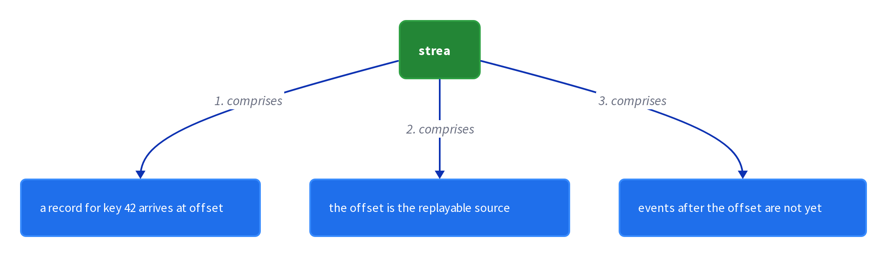

### processor (state store)

_Role: processor — folds records into a state store_

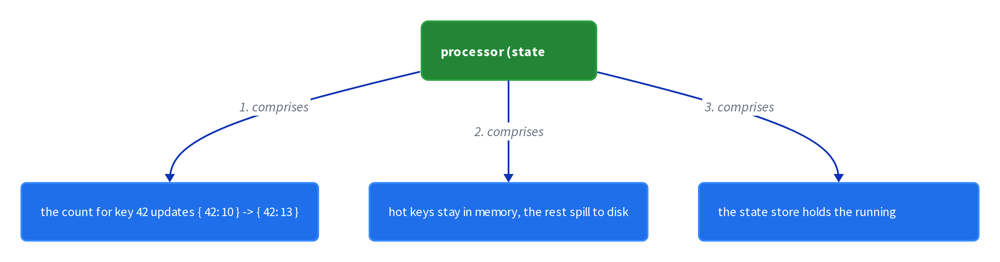

### checkpoint (state + offset)

_Role: checkpoint — snapshots state and offset together_

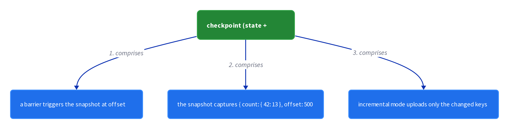

### durable storage

_Role: durable storage — holds the checkpoint bytes_

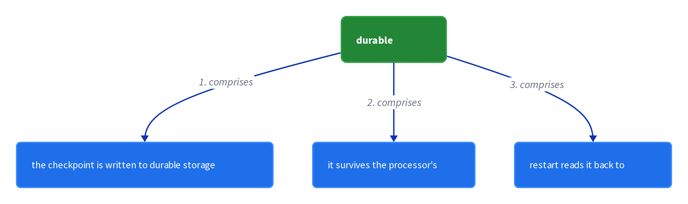

```java
// SYSTEM DESIGN — a barrier snapshots state and offset so a restart resumes without loss or double-count
// DEF: barrier — the marker that triggers a snapshot = at offset 500
// DEF: checkpoint — a durable snapshot of { state, offset } = { count: { 42: 13 }, offset: 500 }
// DEF: state — the running per-key count = { 42: 13 }
// STATE (before):
//    count_state : { 42: 13 }
// -> input : the barrier reaches the processor at offset 500
//    step 1 · the processor snapshots state -> checkpoint : {} -> { count: { 42: 13 } }
//    step 2 · the processor records the offset -> checkpoint : { count: { 42: 13 } } -> { count: { 42: 13 }, offset: 500 }
//    step 3 · a restart restores both -> count_state : {} -> { 42: 13 }, resume at 501   BECAUSE offset 500 was already folded
// <- outcome : the count resumes at 13 from offset 501   BECAUSE the checkpoint paired state with its source position
//    derivation : resume offset = checkpoint offset + 1 = 500 + 1 = 501, so no record is replayed or skipped
```

## Interview Questions

### Q1

A streaming aggregation keeps a running count per user in memory; when the job restarts after a crash, all counts reset to zero and must be rebuilt by replaying the entire stream.

**Interviewer's question:** How do you make the running counts survive a restart without a full replay?

**Solution:** Persist state to a state store (e.g. RocksDB) and take aligned checkpoints that pair state with the source offset; restart resumes from the checkpoint rather than from zero.

**System-design components:**
- State store — RocksDB
- Checkpoint — state + offset snapshot
- Barrier — aligns the snapshot
- Incremental snapshot — only the delta

```java
// count {42:13} at offset 500
//   checkpoint saves {count:{42:13}, offset:500}
//   restart restores count 13, resumes at 501
//   -> no reset, no full replay
```

_This is exactly the persistent-state and checkpoint material in this chapter._

_Covers:_ 2. Checkpoints · 3. State stores · 6. Exactly-once recovery

_From the 28 problems:_ 20-metrics-monitoring · 21-ad-click-aggregation

### Q2

A metrics pipeline has 10 GB of state; snapshotting the whole thing every minute saturates the network, but snapshotting rarely makes crashes expensive.

**Interviewer's question:** How do you keep checkpoint cost low while keeping recovery fast?

**Solution:** Use incremental checkpoints — upload only the keys that changed since the last snapshot — and tune the frequency so the recovery time matches the failure budget.

**System-design components:**
- Incremental checkpoint — delta only
- State store — disk-backed
- Frequency — tuned to failure budget

```java
// 1000 keys, 12 changed
//   incremental: upload 12 keys
//   full:        upload 1000 keys
//   -> 0.3% of the I/O
```

_This is exactly the incremental-checkpoint material in this chapter._

_Covers:_ 4. Incremental checkpoints · 7. Checkpoint frequency

_From the 28 problems:_ 20-metrics-monitoring

## Key Concepts

### The Problem

**1. Memory state dies with the process.** Persistent state makes the aggregation durable and restart fast.


### The Solution

A checkpoint captures every stage's state at one logical point in the stream, aligned by a barrier.

```java
// count {42:13} at offset 500
//   checkpoint saves {count:{42:13}, offset:500}
//   restart restores count 13, resumes at 501
//   -> no reset, no full replay
```


### Key Facts

| Fact | Detail | In the wild |
|---|---|---|
| 2. Checkpoints | A checkpoint captures every stage's state at one logical point in the stream, aligned by a barrier. | Flink's aligned checkpoints implement this. |
| 3. State stores | An embedded state store like RocksDB keeps hot keys cached and spills the rest to disk. | Flink's RocksDB state backend is the production form. |
| 4. Incremental checkpoints | Incremental checkpoints upload only the keys that changed since the last snapshot. | Flink's incremental checkpointing for RocksDB. |
| 5. Checkpoint barriers | A barrier flows through the stream; each stage snapshots on seeing it, producing a coherent multi-stage snapshot (Chandy-Lamport). | Flink checkpoint barriers are the production form. |
| 6. Exactly-once recovery | Exactly-once checkpointing aligns state with source offsets so no record is lost or double-counted. | Flink's exactly-once checkpoint mode. |
| 7. Checkpoint frequency | Frequent checkpoints shorten recovery but raise I/O; infrequent ones are cheap but replay more on restart. | A 1-minute interval is a common starting point. |
| 8. Bound state growth | Watermarks plus allowed lateness let the pipeline garbage-collect finished window state. | Dataflow's allowed-lateness is the garbage-collection horizon. |


### Tradeoffs & When

- Frequent checkpoints shorten recovery but raise I/O; infrequent ones are cheap but replay more on restart.
- Watermarks plus allowed lateness let the pipeline garbage-collect finished window state.


### Real-World Examples

- **RocksDB** — Embedded disk-backed state store for large streaming state
- **Apache Flink** — Aligned, incremental, exactly-once checkpoints
- **Chandy-Lamport** — The snapshot algorithm behind checkpoint barriers


<details><summary>All concepts (index)</summary>

### Why: 1. Memory state dies with the process

**Why.** A crash loses in-memory aggregation, and rebuilding it means re-reading the whole stream.

**Claim.** Persistent state makes the aggregation durable and restart fast.

**Grounding.** State is the materialized fold of the stream, and persisting it avoids the rebuild.

**In the wild.** Flink and Dataflow persist state to survive restarts.

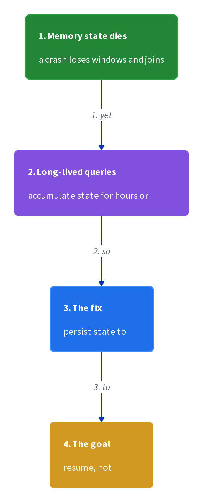
### Snapshot: 2. Checkpoints

**Why.** A consistent point-in-time snapshot is what a restart resumes from.

**Claim.** A checkpoint captures every stage's state at one logical point in the stream, aligned by a barrier.

**Grounding.** It pairs state with the source offset so resume is coherent.

**In the wild.** Flink's aligned checkpoints implement this.

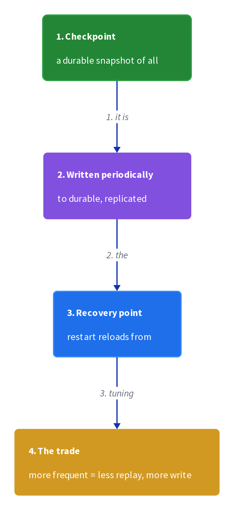
### Store: 3. State stores

**Why.** State can exceed memory, so bytes need a home with hot data in memory and the rest on disk.

**Claim.** An embedded state store like RocksDB keeps hot keys cached and spills the rest to disk.

**Grounding.** It is the difference between fitting 10 GB of state in memory or on a disk-backed store.

**In the wild.** Flink's RocksDB state backend is the production form.

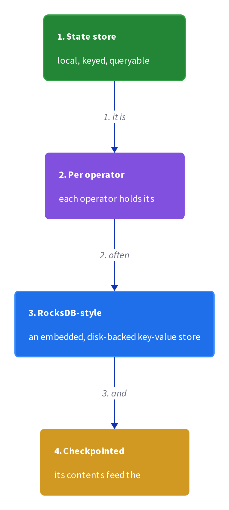
### Cost: 4. Incremental checkpoints

**Why.** Snapshotting all state every time is I/O-expensive when state is large.

**Claim.** Incremental checkpoints upload only the keys that changed since the last snapshot.

**Grounding.** Uploading a delta of 12 keys vs a full 1000 is the practical win.

**In the wild.** Flink's incremental checkpointing for RocksDB.

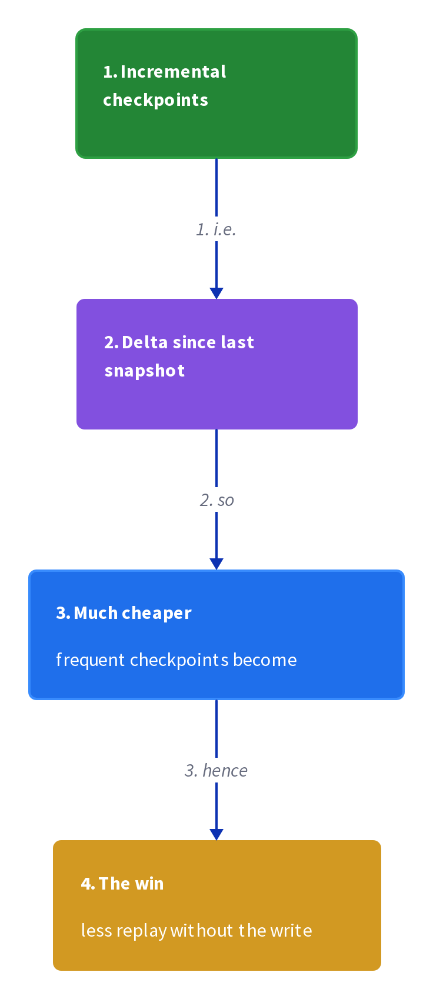
### Alignment: 5. Checkpoint barriers

**Why.** A snapshot must be consistent across stages, or a resume can mix old and new state.

**Claim.** A barrier flows through the stream; each stage snapshots on seeing it, producing a coherent multi-stage snapshot (Chandy-Lamport).

**Grounding.** The barrier is what makes the snapshot a single logical point.

**In the wild.** Flink checkpoint barriers are the production form.

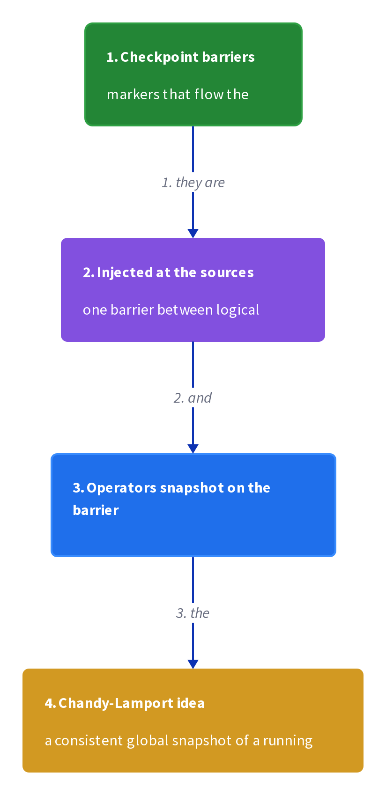
### Guarantee: 6. Exactly-once recovery

**Why.** At-least-once recovery can replay some records, double-counting at sinks.

**Claim.** Exactly-once checkpointing aligns state with source offsets so no record is lost or double-counted.

**Grounding.** Resume at offset 501 after offset 500 was folded = no double-count.

**In the wild.** Flink's exactly-once checkpoint mode.

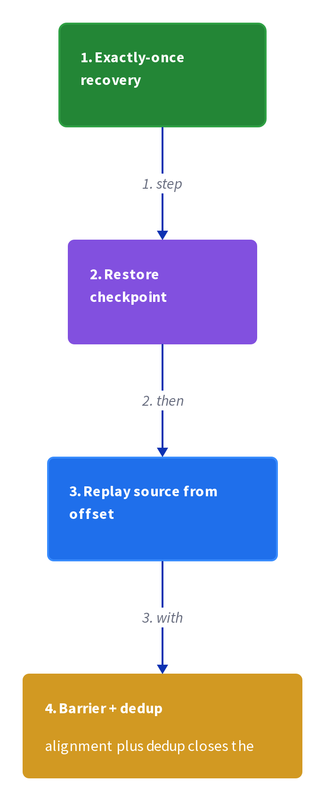
### Frequency: 7. Checkpoint frequency

**Why.** The snapshot interval is the knob between steady-state cost and recovery time.

**Claim.** Frequent checkpoints shorten recovery but raise I/O; infrequent ones are cheap but replay more on restart.

**Grounding.** Pick the frequency for the failure budget and state size.

**In the wild.** A 1-minute interval is a common starting point.

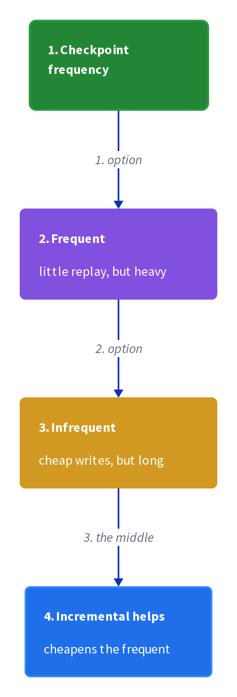
### Growth: 8. Bound state growth

**Why.** Windows that never close and keys that never expire grow state without limit.

**Claim.** Watermarks plus allowed lateness let the pipeline garbage-collect finished window state.

**Grounding.** Unbounded state eventually exhausts the state store.

**In the wild.** Dataflow's allowed-lateness is the garbage-collection horizon.

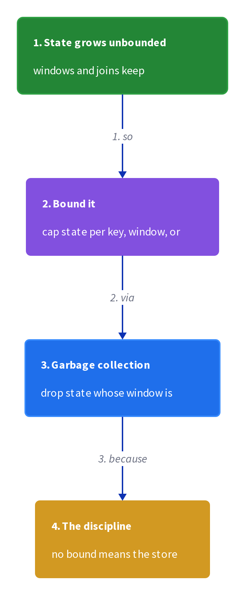

</details>


## Quiz

1. Why must stream-processing state persist?

   - A. To make the stream ordered
   - B. To survive restarts without re-reading the whole stream
   - C. To reduce event size
   - D. To create watermarks

<details><summary>Reveal answer</summary>

**B.** Persistent state makes the aggregation durable and restart fast.

</details>

2. What does a checkpoint capture?

   - A. Only the watermark
   - B. State and the source offset at one logical point
   - C. Only the source offset
   - D. Only the window definitions

<details><summary>Reveal answer</summary>

**B.** A checkpoint pairs state with the offset so resume is coherent.

</details>

3. What is the benefit of incremental checkpoints?

   - A. They capture every key
   - B. They upload only the keys that changed
   - C. They never need a barrier
   - D. They eliminate recovery

<details><summary>Reveal answer</summary>

**B.** Incremental checkpoints upload only the delta, cutting I/O sharply.

</details>

4. What aligns a multi-stage snapshot?

   - A. A watermark
   - B. A checkpoint barrier
   - C. A trigger
   - D. A window

<details><summary>Reveal answer</summary>

**B.** A barrier flows through the stream and each stage snapshots on seeing it.

</details>

5. Exactly-once recovery means ___ .

   - A. no state is ever stored
   - B. state and offsets align so no record is lost or double-counted
   - C. the pipeline never restarts
   - D. watermarks are perfect

<details><summary>Reveal answer</summary>

**B.** Aligning state with offsets means resume is at the right position.

</details>

