# Chapter 7: The Practicalities of Persistent State

> A stream processor that holds state must be able to persist and recover it — checkpoints, state stores, and incremental snapshots turn in-memory aggregation into durable, restartable computation.

_Also known as: SS Ch07 · Persistent State · Checkpoint · State Store · RocksDB · Recovery · Incremental Snapshot_

## Flow

### Why state must persist

> **Why this matters:** A pipeline that keeps a running count in memory loses it on restart, so this section establishes why durable state is a requirement, not an optimization.

1. **State is the aggregation in progress** — A keyed count, a session, a running sum — **state is everything the pipeline remembers between events**. Without it, each event would start from scratch.

2. **Restarts must not lose state** — Machines crash and jobs redeploy. **Persistent state means the aggregation survives a restart** and continues where it left off, rather than re-reading the whole stream.

3. **Recovery is about correctness and cost** — Losing state forces a full reprocessing of the stream — **correct but slow**. Persisting state makes recovery **fast and still correct**.

4. **The stream is the truth, state is a cache of it** — Persistent state is a materialized fold of the stream. **You can always rebuild it from the stream, but persisting it avoids the rebuild cost.**

<!-- ch07-why:begin — generated by tools/gen_ch07.js; do not hand-edit -->

#### Why persistence buys time rather than correctness

**State is the aggregation in progress**, and it is worth making concrete before discussing how to keep it. For this stream it is **7 numbers**, one per (key, window) group that has not finished: `a@0` = 8, `b@0` = 11, `a@120` = 2, and so on. Without it every event would start from zero and nothing spanning more than one record could be computed.

**A restart without persisted state re-reads the whole stream.** Rebuilding from scratch reads all 9 events; resuming from a checkpoint at event 4 reads 4. Both produce the same 7 entries.

That last point is the one to keep: **a full reprocess is correct**, it just takes as long as the history is. So persisted state is an optimisation, not a correctness mechanism — on a nine-event stream the difference is nothing, and on a year of history it is a minute against a week.

**The stream is the truth because the derivation runs one way.** Stream → state is always possible: replay and re-fold. State → stream is not: entry `a@0` holds 8, which came from 2 events, and from 8 alone you cannot say which. This is ch06's duality applied to recovery, and it is why losing state is survivable and losing the stream is not.

**And the only bound on state is the watermark.** 6 of the 7 entries here become collectable when the watermark passes their window end. 1 never does — window [12:08, …) is never passed by any watermark in this stream — so its 8 is held for the life of the job.

#### When to persist, when to rebuild, and what persistence makes worse

**Persist when the rebuild time exceeds your recovery budget**, which on any real stream is immediately. The calculation is history length ÷ replay throughput, and it only grows.

**Rebuild rather than persist when the state is small and the stream is short** — a test harness, a backfill over a bounded input, a job whose window is minutes. Carrying a state store you do not need is operational cost with no benefit.

**Always keep the stream, whatever you do with the state.** State is recoverable from the stream; the stream is not recoverable from state. That asymmetry, not retention policy, is the reason to keep it.

**And know what persistence makes worse:** a window that never closes used to be cleared accidentally by the next deploy. With a durable state store it is checkpointed, uploaded and faithfully restored forever. 1 of 7 entries here is in that category, which turns a transient memory problem into a permanent allocation per key.

**What this does not settle:** how to take a snapshot that is actually resumable. A snapshot without the stream position it corresponds to cannot be resumed from at all — that pairing, and what it costs, is the next concept.

#### Visual walkthrough — the entries, the rebuild cost, and the bound

The animation loops through all 4 steps. Expand any step to study it on its own.



<details>
<summary><b>Step 1 of 4</b> — state is the aggregation in progress</summary>


Worth making concrete before discussing how to persist it: the state here is 7 numbers. Each one is a partial aggregate for a (key, window) group that is still open. Everything in this chapter — checkpoints, state stores, barriers — exists to move those 7 numbers safely across a restart.

</details>
<details>
<summary><b>Step 2 of 4</b> — and a restart without it re-reads the whole stream</summary>

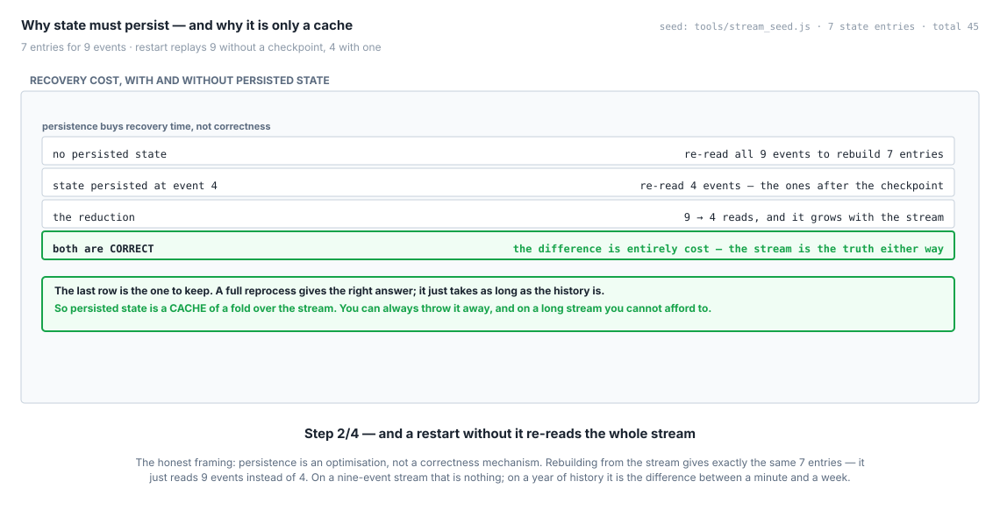

The honest framing: persistence is an optimisation, not a correctness mechanism. Rebuilding from the stream gives exactly the same 7 entries — it just reads 9 events instead of 4. On a nine-event stream that is nothing; on a year of history it is the difference between a minute and a week.

</details>
<details>
<summary><b>Step 3 of 4</b> — so the state store is a cache, and the stream is the truth</summary>

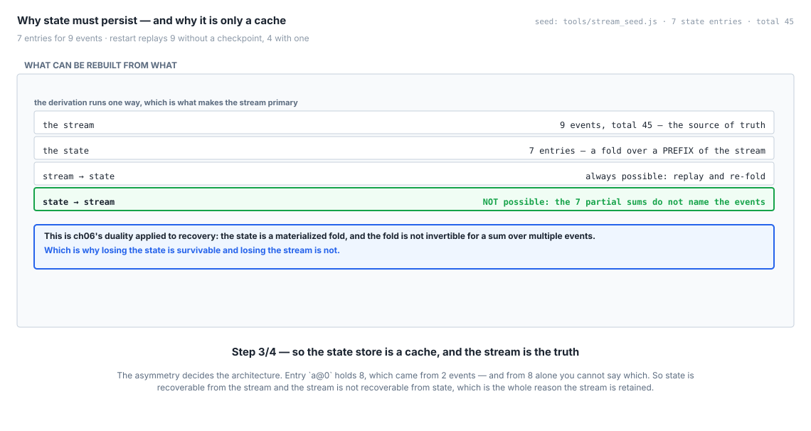

The asymmetry decides the architecture. Entry `a@0` holds 8, which came from 2 events — and from 8 alone you cannot say which. So state is recoverable from the stream and the stream is not recoverable from state, which is the whole reason the stream is retained.

</details>
<details>
<summary><b>Step 4 of 4</b> — and the bound on it is the watermark</summary>

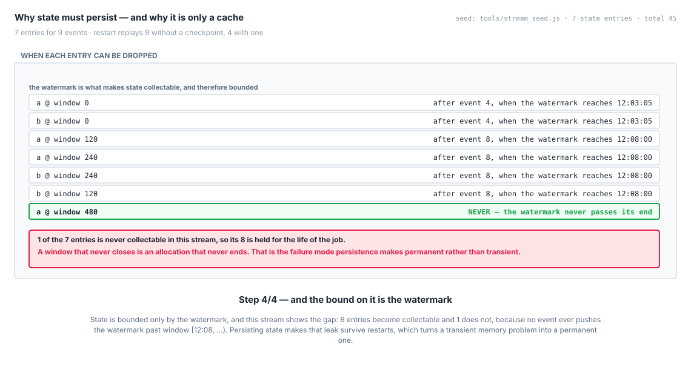

State is bounded only by the watermark, and this stream shows the gap: 6 entries become collectable and 1 does not, because no event ever pushes the watermark past window [12:08, …). Persisting state makes that leak survive restarts, which turns a transient memory problem into a permanent one.

</details>

<sub>The 7 state entries, their collection points and the replay counts are computed from the seed and asserted. Generated by `node tools/gen_ch07.js`.</sub>

<!-- ch07-why:end -->

<!-- ch07-why-memory:begin — generated by tools/gen_ch07.js; do not hand-edit -->

#### State as a fold — stack and heap at every step

**What is being answered.** What "state" actually is, and why persisting it is an optimisation — as one `buildFrom` function called two ways.

`entryOf(e)` is the unit: a **(key, window)** pair. 9 events produce 7 of them, so the state this whole chapter is about is 7 numbers.

Step 2 is the point: `full.readCount` = 9 and `resume.readCount` = 4, and both hold the same 7 entries. Step 4 is the cost — `collectableAt("a@480")` returns NONE, so one entry is never freed, and persistence makes that leak survive restarts.

The animation steps through the code, holding each line long enough to read the STACK (call frames and their locals) and the HEAP (allocated arrays and objects) as they are AT THAT MOMENT. Expand any step to study it on its own.



<details>
<summary><b>Step 1 of 4</b> — state is one number per (key, window) pair</summary>


`id` is `"a@480"` — a key and a window start, nothing else. 9 events produce 7 such ids, so "state" is 7 numbers. Everything in this chapter exists to carry those 7 numbers across a restart.

</details>
<details>
<summary><b>Step 2 of 4</b> — resuming from a checkpoint reads fewer events, same result</summary>

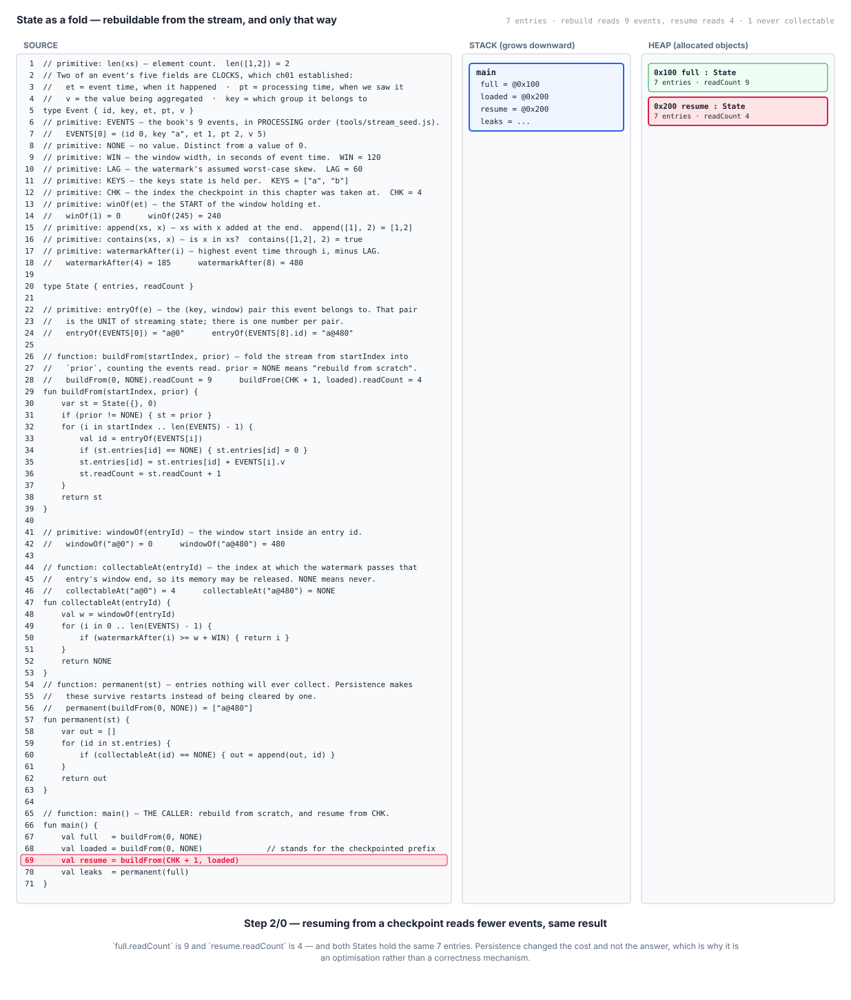

`full.readCount` is 9 and `resume.readCount` is 4 — and both States hold the same 7 entries. Persistence changed the cost and not the answer, which is why it is an optimisation rather than a correctness mechanism.

</details>
<details>
<summary><b>Step 3 of 4</b> — the fold runs one way: the entries do not name their events</summary>

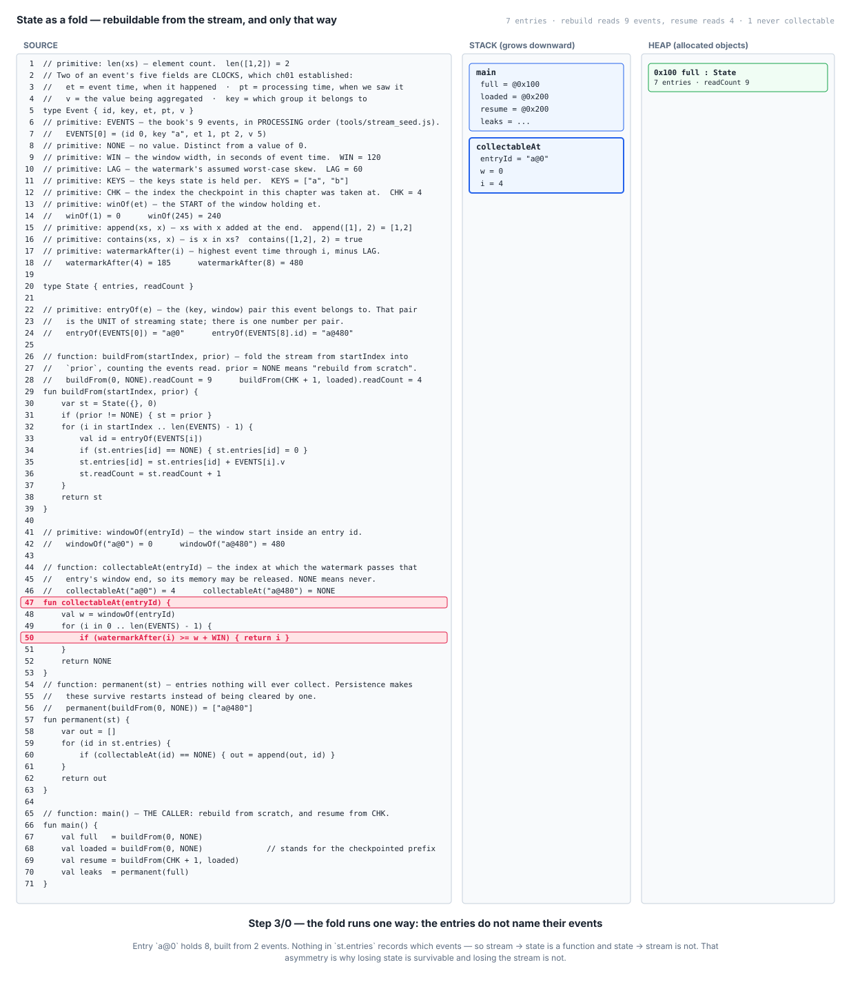

Entry `a@0` holds 8, built from 2 events. Nothing in `st.entries` records which events — so stream → state is a function and state → stream is not. That asymmetry is why losing state is survivable and losing the stream is not.

</details>
<details>
<summary><b>Step 4 of 4</b> — and 1 entry is never collectable at all</summary>

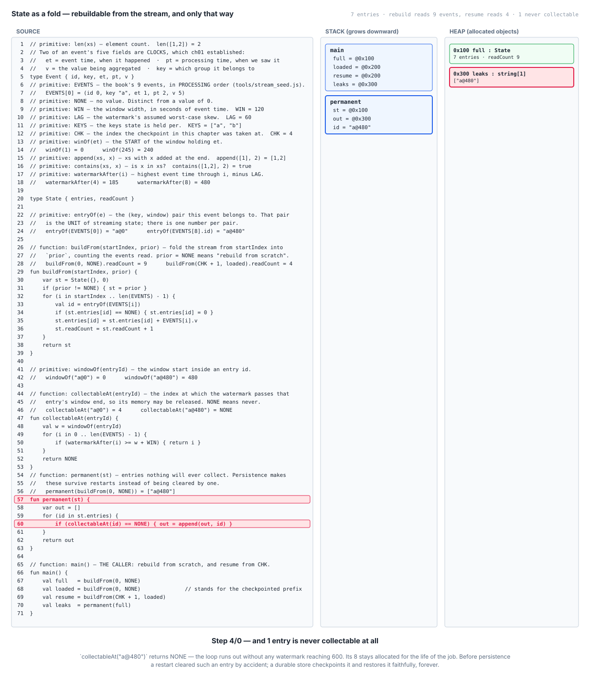

`collectableAt("a@480")` returns NONE — the loop runs out without any watermark reaching 600. Its 8 stays allocated for the life of the job. Before persistence a restart cleared such an entry by accident; a durable store checkpoints it and restores it faithfully, forever.

</details>

<sub>The entries, both read counts and the never-collectable entry are computed from the seed and asserted. Generated by `node tools/gen_ch07.js` on `tools/memkit.js`.</sub>

<!-- ch07-why-memory:end -->

### Checkpoints and state stores

> **Why this matters:** Persisting state has real machinery — how often to snapshot, where to put the bytes, and how to keep snapshots small — so this section covers the practical knobs.

1. **A checkpoint is a consistent snapshot** — A checkpoint captures the **state of every stage at a consistent point in the stream** (aligned by a barrier), so restart resumes from a coherent position.

2. **State stores hold the bytes** — Large state does not fit in memory, so processors spill to an embedded **state store** (e.g. RocksDB) that keeps hot data in memory and the rest on disk.

3. **Incremental checkpoints keep cost down** — Rather than snapshotting all state every time, **incremental checkpointing uploads only what changed** since the last snapshot — the difference between uploading 10 KB or 10 GB.

4. **Checkpoint frequency trades cost vs recovery** — Frequent checkpoints mean **short recovery but high I/O**; infrequent ones mean cheap steady-state but **long replay on restart**. Pick the frequency for the failure budget.

<!-- ch07-checkpoints:begin — generated by tools/gen_ch07.js; do not hand-edit -->

#### Why a checkpoint is two things, and why the frequency is never free

**A checkpoint is a snapshot PLUS a stream position**, and the pairing is the whole mechanism. Taken after event 4, it writes 4 state entries holding 23, and the offset **4** that those entries correspond to.

The offset is not bookkeeping — a snapshot that does not say *where* it was taken cannot be resumed from. And the two must be committed **atomically**: state-then-crash re-applies 4 events worth **22**, and offset-then-crash loses the same amount.

**A state store is where the bytes live, and it changes nothing semantic.** This stream's 7 entries fit in memory trivially; what makes real state not fit is that the entry count scales with keys × *open windows*, both unbounded. An embedded store (RocksDB and similar) keeps hot entries in memory and the rest on local disk. The entries, their values and their collection times are identical either way — what changes is that checkpointing now means reading those bytes back and uploading them.

**Incremental checkpointing uploads the churn rather than the state.** Checkpointing every 3 events, the full uploads are 2, 5, 7 entries and the incremental ones are 2, 3, 3 — **14 against 8**, a 43% saving on 9 events.

And the gap **widens**, because full scales with total state while incremental scales with how fast it changes. On a large, mostly-idle state that is the difference between uploading 10 GB and 10 KB.

**The frequency is a trade with no free point.** Checkpoint every 1 event: 9 uploads, worst-case replay 0. Every 3: 8 uploads, replay 2. Once: 7 upload, replay 8. Both ends are correct.

#### When to checkpoint how often, and what the store choice actually decides

**Pick the frequency from the recovery time you can tolerate, not the I/O you would prefer.** Recovery time is (events since the last checkpoint ÷ replay throughput), so start from the SLA and derive the interval — the I/O then is what it is.

**Use incremental checkpointing unconditionally when the store supports it.** It is the one setting in this chapter with no trade: 8 uploads instead of 14 here, with identical recovery behaviour.

**Reach for an embedded state store when the entry count stops fitting**, which is a function of key cardinality times open windows. It is a storage decision and changes nothing about windowing, triggers or watermarks.

**Do not treat the local store as durable.** It is fast and it dies with the machine; the remote checkpoint is what survives. Collapsing those two roles gives you a processor that recovers from a restart but not from a failure.

**What this does not settle:** whether a snapshot taken across several stages is internally consistent. Taking each stage's snapshot at a different point in the stream produces a checkpoint no single position corresponds to — which is what barriers are for, and they have a cost this concept has not priced.

#### Visual walkthrough — the pair, the store, incremental uploads, the sweep

The animation loops through all 4 steps. Expand any step to study it on its own.



<details>
<summary><b>Step 1 of 4</b> — a checkpoint is a snapshot plus a stream position</summary>


A checkpoint is a pair, and the pairing is the point. The state says what the aggregation holds; the offset says which prefix of the stream it holds. Commit them non-atomically and ch05's scenario follows exactly: state saved but offset stale re-applies 4 events worth 22.

</details>
<details>
<summary><b>Step 2 of 4</b> — state stores hold the bytes when it does not fit in memory</summary>

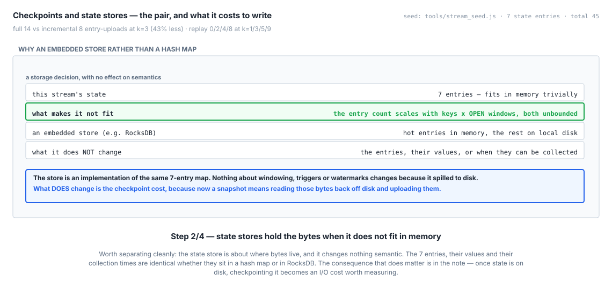

Worth separating cleanly: the state store is about where bytes live, and it changes nothing semantic. The 7 entries, their values and their collection times are identical whether they sit in a hash map or in RocksDB. The consequence that does matter is in the note — once state is on disk, checkpointing it becomes an I/O cost worth measuring.

</details>
<details>
<summary><b>Step 3 of 4</b> — incremental checkpoints upload the churn, not the state</summary>

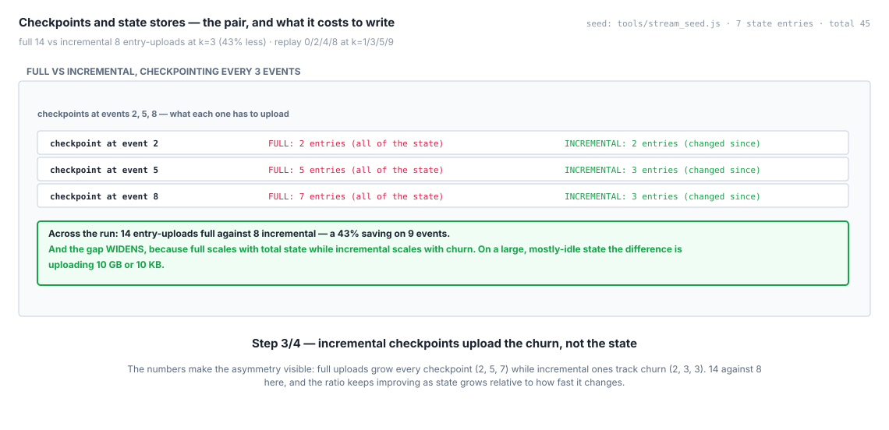

The numbers make the asymmetry visible: full uploads grow every checkpoint (2, 5, 7) while incremental ones track churn (2, 3, 3). 14 against 8 here, and the ratio keeps improving as state grows relative to how fast it changes.

</details>
<details>
<summary><b>Step 4 of 4</b> — and the frequency is a trade with no free point</summary>

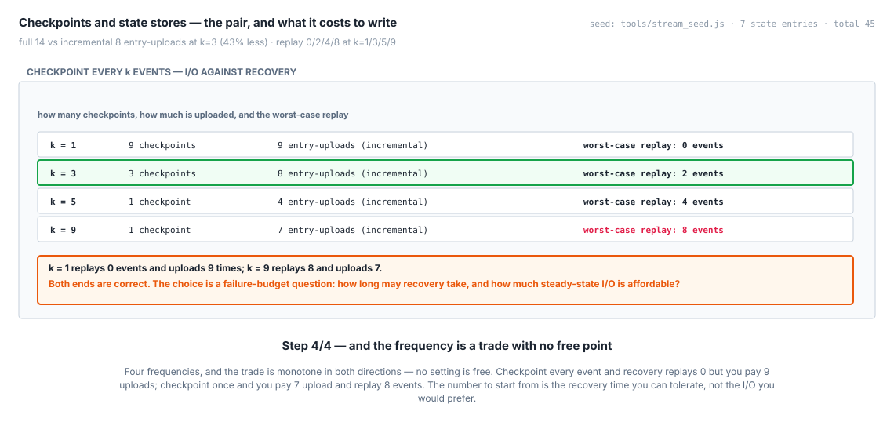

Four frequencies, and the trade is monotone in both directions — no setting is free. Checkpoint every event and recovery replays 0 but you pay 9 uploads; checkpoint once and you pay 7 upload and replay 8 events. The number to start from is the recovery time you can tolerate, not the I/O you would prefer.

</details>

<sub>The upload counts, the sweep and the double-count figure are computed from the seed and asserted. Generated by `node tools/gen_ch07.js`.</sub>

<!-- ch07-checkpoints:end -->

<!-- ch07-checkpoints-memory:begin — generated by tools/gen_ch07.js; do not hand-edit -->

#### The checkpoint pair, and what full versus incremental uploads

**What is being answered.** Why a checkpoint is a pair, and what the two checkpointing modes actually upload.

`take(upto)` returns a `Checkpoint(ent, upto)` — the state and the offset in one value. `restore(cp, useOffset)` then shows why they must match: the replay loop starts at `useOffset + 1`, so that one expression is the whole correctness of the recovery. Called with 4 it gives 45; called with 0 it gives 68.

`uploadVolume` prices the modes by their arguments: `countEntries(0, c)` grows with every checkpoint, `countEntries(prev + 1, c)` depends only on the gap. 14 against 8.

The animation steps through the code, holding each line long enough to read the STACK (call frames and their locals) and the HEAP (allocated arrays and objects) as they are AT THAT MOMENT. Expand any step to study it on its own.



<details>
<summary><b>Step 1 of 4</b> — the checkpoint writes the state AND the offset</summary>


The Checkpoint carries `ent` and `upto` in one value — 4 entries holding 23, at offset 4. The offset is half the checkpoint, not metadata about it: a snapshot that does not say where it was taken cannot be resumed from.

</details>
<details>
<summary><b>Step 2 of 4</b> — restoring with the matching offset gives the no-crash total</summary>

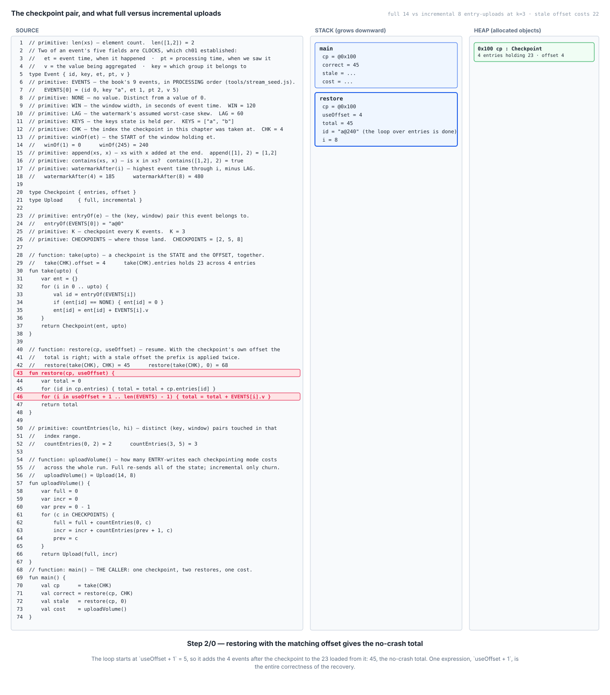

The loop starts at `useOffset + 1` = 5, so it adds the 4 events after the checkpoint to the 23 loaded from it: 45, the no-crash total. One expression, `useOffset + 1`, is the entire correctness of the recovery.

</details>
<details>
<summary><b>Step 3 of 4</b> — and with a stale offset the prefix is counted twice</summary>

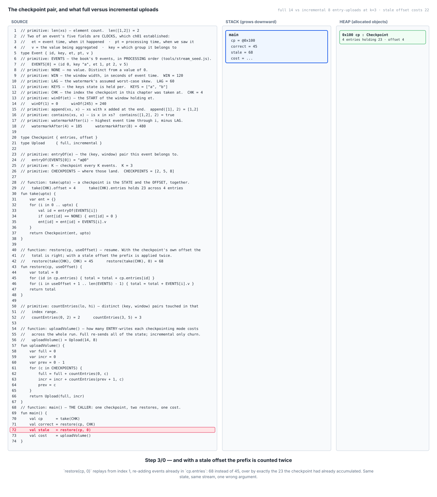

`restore(cp, 0)` replays from index 1, re-adding events already in `cp.entries`: 68 instead of 45, over by exactly the 23 the checkpoint had already accumulated. Same state, same stream, one wrong argument.

</details>
<details>
<summary><b>Step 4 of 4</b> — incremental uploads churn; full uploads everything, every time</summary>

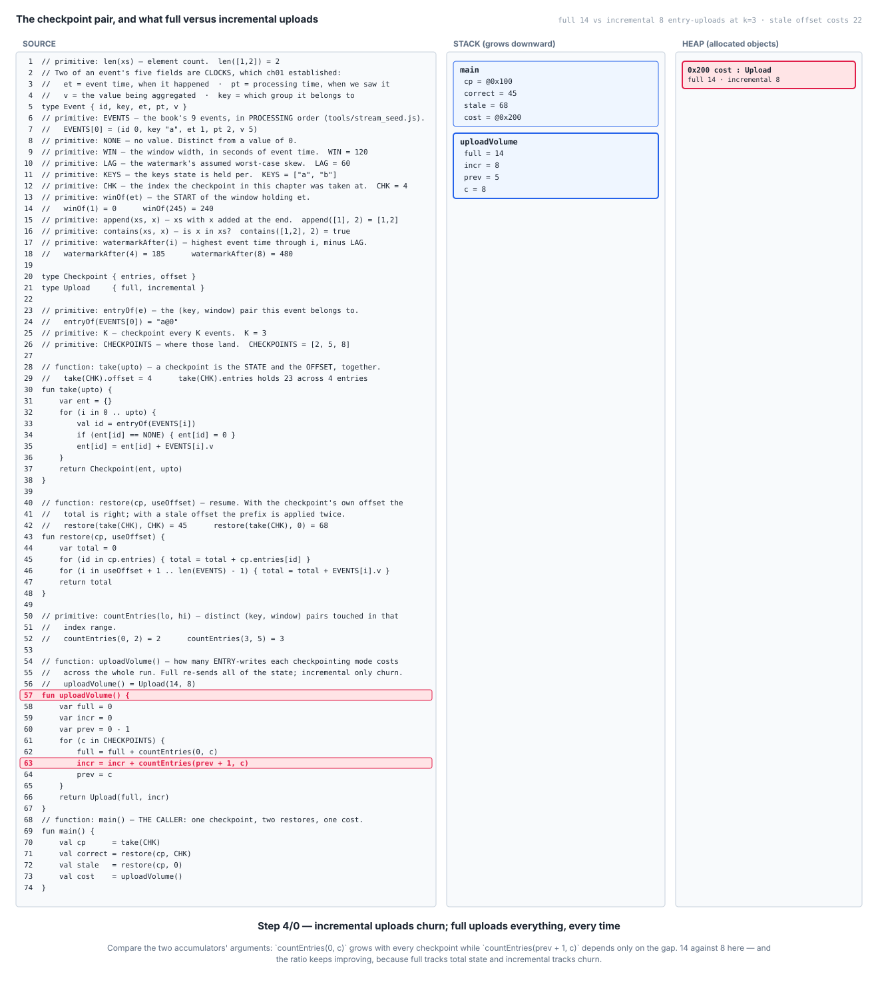

Compare the two accumulators' arguments: `countEntries(0, c)` grows with every checkpoint while `countEntries(prev + 1, c)` depends only on the gap. 14 against 8 here — and the ratio keeps improving, because full tracks total state and incremental tracks churn.

</details>

<sub>Both restore totals and both upload counts are computed from the seed and asserted. Generated by `node tools/gen_ch07.js` on `tools/memkit.js`.</sub>

<!-- ch07-checkpoints-memory:end -->

### Consistency and recovery

> **Why this matters:** A snapshot is only useful if it is consistent — taken at one logical point in the stream — and recovery is only safe if the pipeline knows exactly where that point was, so this section covers the correctness side.

1. **Barriers align the snapshot** — A checkpoint barrier flows through the stream; each stage snapshots its state when it sees the barrier. **The result is a snapshot of all stages at the same logical point** (Chandy-Lamport).

2. **The snapshot is tied to a stream position** — A checkpoint records **both the state and the source offset** at the barrier, so restart resumes from a position consistent with the state.

3. **At-least-once vs exactly-once recovery** — With at-least-once checkpointing, some records after the last checkpoint may be replayed (duplicates). **Exactly-once checkpointing aligns state and offsets so no record is lost or double-counted.**

4. **State grows, so bound it** — Windows that never close and keys that never expire grow state forever. **Watermarks + allowed lateness are what let the pipeline garbage-collect state.**

<!-- ch07-recovery:begin — generated by tools/gen_ch07.js; do not hand-edit -->

#### Why alignment costs something, and why half a checkpoint is wrong rather than stale

**A barrier makes the snapshot consistent across stages** (Chandy–Lamport): it flows through the stream, and each stage snapshots when it has seen the barrier from **every** input.

Trace it with the two keys as two sources, injecting each barrier after that source's second record. Source "a" reaches its barrier at event 1; source "b" not until event 5. The stage is therefore **aligned for 4 events**, and anything arriving in that gap past its own barrier belongs to the *next* checkpoint — so it is **buffered**, not applied. Here that is 2 records: id 3, 4.

That buffer is the alignment cost, and with badly skewed sources it is the latency people notice at checkpoint time.

**The snapshot is tied to a position, or it is useless.** Three recoveries from the same crash:

- state **+ matching offset 4** → replay 4 events, total **45** — correct
- state, **offset reset to 0** → replay all 9, total **68** — double counted
- **offset 4, state lost** → replay 4, total **22** — the prefix is missing

The two failures are wrong in **opposite directions**, which is the clearest argument for atomicity: a half-committed checkpoint is not a slightly-stale checkpoint, it is a wrong one.

**At-least-once and exactly-once recovery differ exactly here.** Under at-least-once the 4 events after the checkpoint may be applied twice — up to **22 double-counted, 49% of the 45 total**. Exactly-once aligns state and offsets so they are applied once, and pays for it with the alignment above plus a two-phase commit at the sink.

Which couples the two settings from the previous concept: **the checkpoint interval you chose for recovery time also sets the worst-case double count.**

#### When to pay for exactly-once recovery, and what bounds the state

**Pay for exactly-once recovery when a duplicate is visible or expensive** — the ch05 test. The cost is alignment buffering plus sink complexity, and the benefit is that your error bound stops being a function of your checkpoint interval.

**Accept at-least-once when the sink is idempotent anyway.** Then a replayed record is harmless and the alignment cost buys nothing. This is the common and correct choice for a pipeline writing into a keyed store.

**If you accept at-least-once, shorten the checkpoint interval deliberately** — not for recovery time but because the interval *is* the error bound. That is the coupling most people miss when they lengthen the interval to save I/O.

**And bound the state, because persistence makes a leak permanent.** 1 of the 7 entries here is never collectable, and watermarks plus allowed lateness are the only garbage collector there is. A restart used to clear such an entry by accident; a durable store restores it faithfully, forever.

**What this does not settle:** the atomic commit of state and offset, which every correct recovery above assumed. Against a local store it is a transaction; against an external sink it is the distributed-commit problem, and the next concept names it as a requirement rather than solving it.

#### Visual walkthrough — alignment, three recoveries, and the error bound

The animation loops through all 4 steps. Expand any step to study it on its own.



<details>
<summary><b>Step 1 of 4</b> — a barrier makes the snapshot consistent across stages</summary>


Alignment is where a barrier costs something, and it is measurable: source "a" is ready at event 1, "b" not until event 5, so 2 records (id 3, 4) must be buffered rather than processed. With skewed sources that buffer is the latency people notice at checkpoint time.

</details>
<details>
<summary><b>Step 2 of 4</b> — the snapshot is tied to a position, or it is useless</summary>

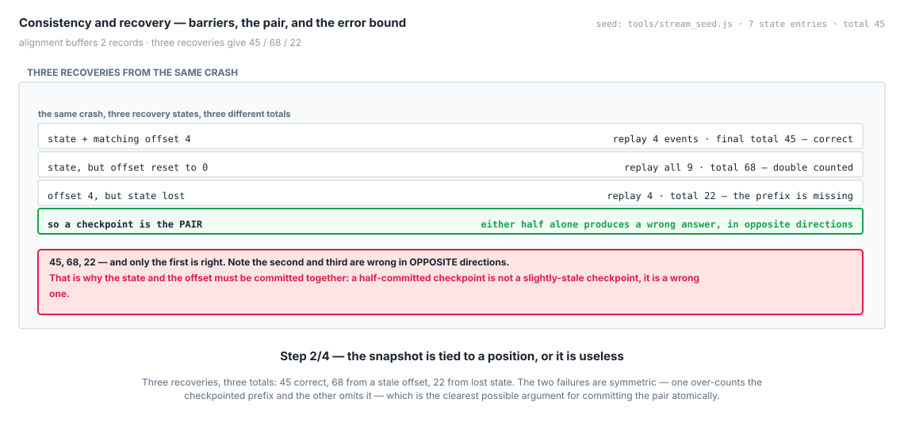

Three recoveries, three totals: 45 correct, 68 from a stale offset, 22 from lost state. The two failures are symmetric — one over-counts the checkpointed prefix and the other omits it — which is the clearest possible argument for committing the pair atomically.

</details>
<details>
<summary><b>Step 3 of 4</b> — at-least-once and exactly-once recovery differ here</summary>

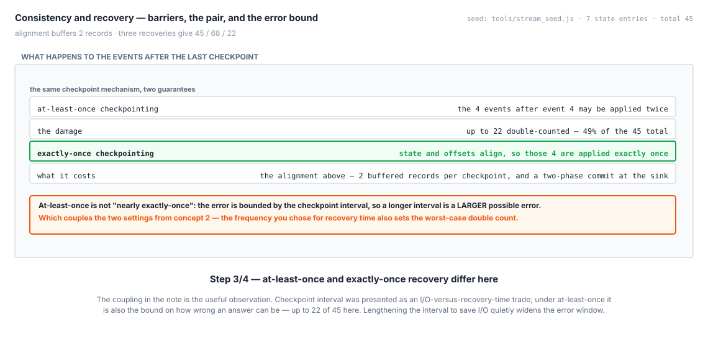

The coupling in the note is the useful observation. Checkpoint interval was presented as an I/O-versus-recovery-time trade; under at-least-once it is also the bound on how wrong an answer can be — up to 22 of 45 here. Lengthening the interval to save I/O quietly widens the error window.

</details>
<details>
<summary><b>Step 4 of 4</b> — and state grows unless something bounds it</summary>

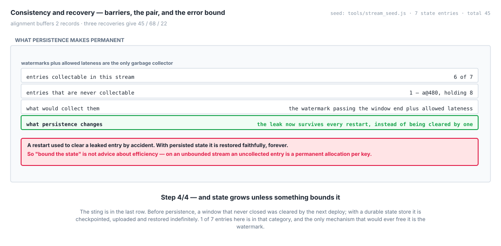

The sting is in the last row. Before persistence, a window that never closed was cleared by the next deploy; with a durable state store it is checkpointed, uploaded and restored indefinitely. 1 of 7 entries here is in that category, and the only mechanism that would ever free it is the watermark.

</details>

<sub>The alignment buffer, all three recovery totals and the never-collectable entry are computed from the seed and asserted. Generated by `node tools/gen_ch07.js`.</sub>

<!-- ch07-recovery:end -->

<!-- ch07-recovery-memory:begin — generated by tools/gen_ch07.js; do not hand-edit -->

#### Barrier alignment, and three recoveries from one crash

**What is being answered.** What barrier alignment costs, and why half a checkpoint is wrong rather than stale.

`align()` measures the cost in records: source "a" is ready at index 1, "b" at 5, and the condition `i > barrierIndex(EVENTS[i].key)` collects the 2 records that overtook their own barrier.

`recover(hasState, offset)` then runs the same crash three ways: 45 correct, 68 double-counted, 22 with the prefix lost. The two failures are symmetric around the truth, which is the argument for atomicity. And `errorBound(k)` takes only `k` — the interval is the error bound.

The animation steps through the code, holding each line long enough to read the STACK (call frames and their locals) and the HEAP (allocated arrays and objects) as they are AT THAT MOMENT. Expand any step to study it on its own.



<details>
<summary><b>Step 1 of 4</b> — the stage waits for the LATEST barrier, and buffers meanwhile</summary>


`latest` is 5 — source "b"'s barrier — while source "a" was ready at 1. The condition `i > barrierIndex(EVENTS[i].key)` catches records that overtook their OWN barrier: ids 3, 4. They belong to the next checkpoint, so they are held, not applied.

</details>
<details>
<summary><b>Step 2 of 4</b> — the matching pair reaches the no-crash total</summary>

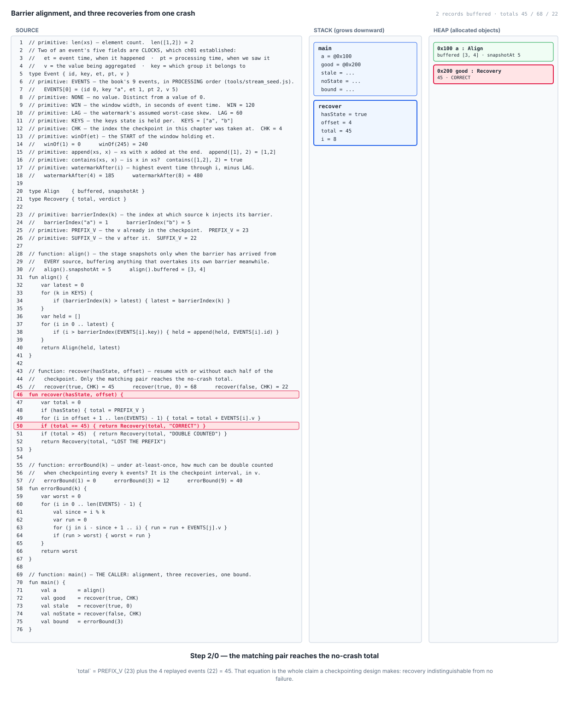

`total` = PREFIX_V (23) plus the 4 replayed events (22) = 45. That equation is the whole claim a checkpointing design makes: recovery indistinguishable from no failure.

</details>
<details>
<summary><b>Step 3 of 4</b> — and the two half-checkpoints fail in OPPOSITE directions</summary>

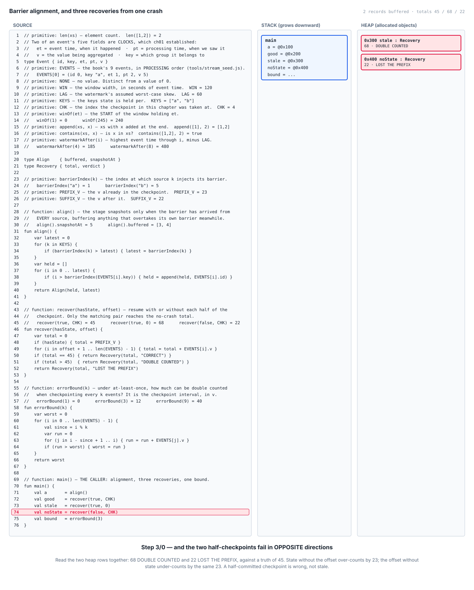

Read the two heap rows together: 68 DOUBLE COUNTED and 22 LOST THE PREFIX, against a truth of 45. State without the offset over-counts by 23; the offset without state under-counts by the same 23. A half-committed checkpoint is wrong, not stale.

</details>
<details>
<summary><b>Step 4 of 4</b> — so the checkpoint interval IS the at-least-once error bound</summary>

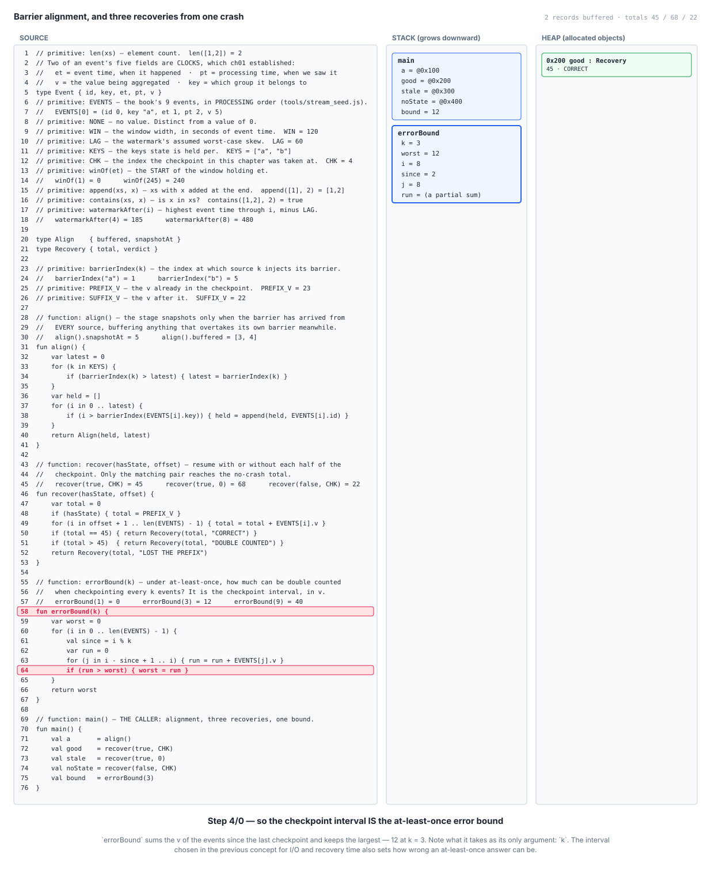

`errorBound` sums the v of the events since the last checkpoint and keeps the largest — 12 at k = 3. Note what it takes as its only argument: `k`. The interval chosen in the previous concept for I/O and recovery time also sets how wrong an at-least-once answer can be.

</details>

<sub>The alignment buffer, all three recovery totals and the error bound are computed from the seed and asserted. Generated by `node tools/gen_ch07.js` on `tools/memkit.js`.</sub>

<!-- ch07-recovery-memory:end -->

### Google Interview Question

> **Why this matters:** A standalone interview problem, with three other surfaces the same program wears. Nothing here depends on this chapter's vocabulary: the problem, the one reframe that solves it, and the traced solution are self-contained, and the section stops where the program stops. Generated by `tools/gen_ch07_interview.js` on `tools/interviewkit.js`.

<!-- ch07-interview-memory:begin — generated by tools/gen_ch07_interview.js; do not hand-edit -->

#### The problem

> **Events carry a key and a value, forever.** Report a **running total per key**.
> 
> Keys never stop arriving, so **the state cannot grow without bound — bound it.**
> 
> **What does the bound cost, and how do you choose it?**

> a@1:5  a@3:3  b@50:4  b@90:7  a@130:2  b@220:9  a@245:6  b@260:1  a@540:8 → true totals a:24  b:21. With an allowance of **294** the answer is a:8  b:21 — 1 of 2 wrong. With **295** it is correct.

> The stream does not end. A key may go silent for an arbitrary time and come back.

#### How to model it

The computation is one addition per event and one number per key, so **nothing about the computation is the problem**. The state is: its size is set by how many **distinct keys** have been seen, which is not a quantity you control and does not stop growing.

The only mechanism available is to **drop keys that have not been touched recently**, which needs a second number per key — when it was last seen — existing solely to make that comparison.

And here is what it costs. A key dropped a moment ago is **indistinguishable from a key never seen**, so when it comes back its total starts again from zero. The information that would tell the two apart is exactly the information that was deleted, and no ordering of the drop and the add can recover it. Measured: at an allowance of 294, 1 of 2 totals come out wrong — **too low**, by exactly what was dropped, with no error raised anywhere.

The rule for the allowance follows: it must be **at least the longest silence a key may take** — 295 here, at which every total is correct, asserted. But that number is a **property of the data** (a:295  b:130) and only knowable after the fact, so in practice it is a guess, and **both ways of guessing wrong are silent**. Too short and totals are low, with the affected keys being the quietest ones — precisely those nobody is watching. Too long and the state holds every key seen within the allowance, so a burst of one-off keys is remembered for all of it.

Two honest ways out. **Close the aggregate explicitly** — if the total is per hour rather than forever, the state is bounded by the keys seen in an hour and expiring after it is *correct* rather than approximate. Or **keep the dropped total somewhere cheaper** and reload it when the key returns, trading a memory bound for a storage read. What does not work is picking an allowance and calling the result exact.

#### The same problem, asked 3 other ways

Each of these is the program below with different nouns. The reason to read them is not the
answer — it is the *recognition*. 4 surfaces (turnstiles, analytics, commerce, risk), one shape, and in every
case the appealing first answer is to materialise a sequence you cannot afford.

<details>
<summary><b>Variation 2</b> — the unique-visitor count <i>(looks like analytics)</i></summary>

> Count **distinct** visitors per day, for 10⁹ events and tens of millions of visitors.

**Why it is not obvious.** The accumulator stops being one number: counting distinct values needs the values themselves, so the state is the size of the visitor set rather than one integer per key, and no expiry helps because every visitor must be remembered for the whole day. The way out is to give up exactness — a sketch answers "how many distinct" in a few kilobytes with a small error, whatever the cardinality. The content is recognising that the chapter's bound works because a sum is **one number** and a distinct count is not, so the two have completely different memory stories.

**Where it lands.** `add` with a set in place of an integer, which is what makes `dropStale` insufficient and a sketch necessary.

</details>
<details>
<summary><b>Variation 3</b> — the abandoned shopping cart <i>(looks like commerce)</i></summary>

> Hold each user's cart while they shop. **Expire the inactive ones.** A user returns after a week and expects their cart.

**Why it is not obvious.** Here the expiry is the *feature* and the chapter's silent restart is the specified behaviour — which inverts everything and leaves one real problem: the user who returns after the allowance expects their cart back, so the state cannot simply be dropped. The answer is the model's second escape, made concrete: write the cart to durable storage on expiry and read it back on return, so memory is bounded by **active** users while correctness is bounded by nothing. Noticing that "expire" and "forget" were conflated is the whole move.

**Where it lands.** `dropStale` writing the accumulator out rather than deleting it, and `add` reading it back when a key reappears.

</details>
<details>
<summary><b>Variation 4</b> — the fraud score over a lifetime <i>(looks like risk)</i></summary>

> Score each account on its **entire** history. Accounts are dormant for years and must keep their score.

**Why it is not obvious.** The requirement forbids every bound, which makes it the one case where the chapter's answer is simply unavailable — and the useful response is to stop treating the score as stream state at all. It belongs in a store keyed by account, read and written per event, so the streaming layer holds nothing between events and the memory question disappears. The insight is that **"state that must outlive the stream is not stream state"**, and trying to bound it is answering the wrong question.

**Where it lands.** `acc` moved out of memory entirely, so `dropStale` has nothing to drop — the one variation where the traced program is the wrong shape rather than a tunable one.

</details>

#### The solution as a running program — stack and heap at every step

The reframe above is five paragraphs; this is the stream run at three allowances, with the two things a whiteboard cannot show — **what is allocated, and when**.

Measured on a@1:5  a@3:3  b@50:4  b@90:7  a@130:2  b@220:9  a@245:6  b@260:1  a@540:8. Unbounded: a:24  b:21, correct, with 2 keys held and never released. At an allowance of **294**: "a" is dropped at 540 holding 16 from 4 events, the next event starts it again from zero, and the result is a:8  b:21 — **1 of 2 wrong**, all too low. At **295**, which is exactly the longest gap any key takes, every total is correct — asserted. The longest gap per key is a:295  b:130, and those are measurements of the stream rather than choices.

The animation steps through the code, holding each line long enough to read the STACK (call frames and their locals) and the HEAP (allocated arrays and objects) as they are AT THAT MOMENT. Expand any step to study it on its own.



<details>
<summary><b>Step 1 of 12</b> — 9 events, 2 keys, forever</summary>


0x100 holds a@1:5  a@3:3  b@50:4  b@90:7  a@130:2  b@220:9  a@245:6  b@260:1  a@540:8 and 0x200 will hold one number per key. "Forever" plus "keys never stop arriving" is the constraint: the computation is trivial and the **state** is the problem, because its size is set by how many distinct keys have been seen rather than by anything you control.

</details>
<details>
<summary><b>Step 2 of 12</b> — one number per key, and that is all</summary>

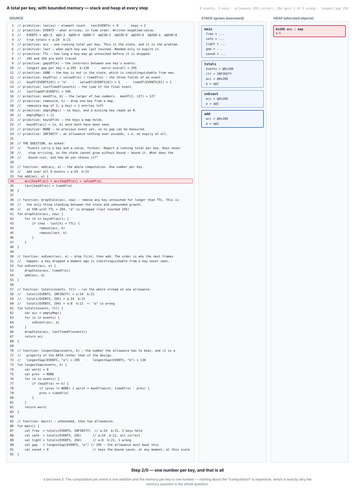

a becomes 5. The computation per event is one addition and the memory per key is one number — nothing about the *computation* is expensive, which is exactly why the memory question is the whole question.

</details>
<details>
<summary><b>Step 3 of 12</b> — unbounded: a:24  b:21, 2 keys held</summary>

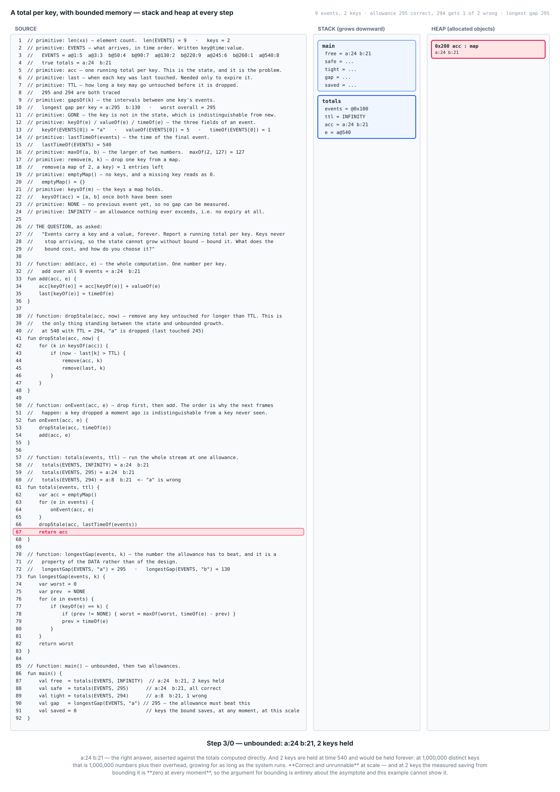

a:24  b:21 — the right answer, asserted against the totals computed directly. And 2 keys are held at time 540 and would be held forever: at 1,000,000 distinct keys that is 1,000,000 numbers plus their overhead, growing for as long as the system runs. **Correct and unrunnable** at scale — and at 2 keys the measured saving from bounding it is **zero at every moment**, so the argument for bounding is entirely about the asymptote and this example cannot show it.

</details>
<details>
<summary><b>Step 4 of 12</b> — so drop anything untouched for TTL</summary>

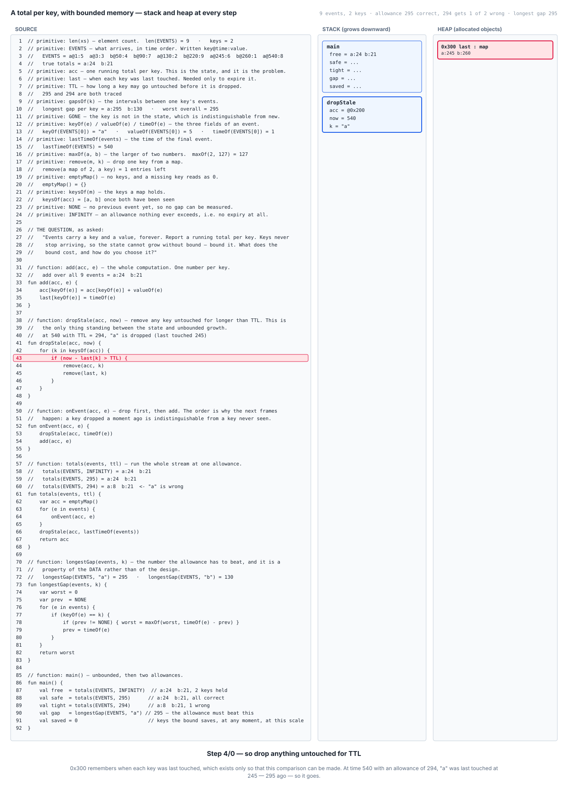

0x300 remembers when each key was last touched, which exists only so that this comparison can be made. At time 540 with an allowance of 294, "a" was last touched at 245 — 295 ago — so it goes.

</details>
<details>
<summary><b>Step 5 of 12</b> — and "a" is dropped holding 16</summary>

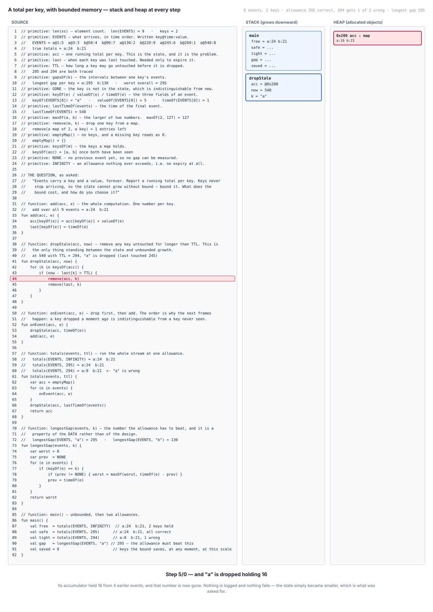

Its accumulator held 16 from 4 earlier events, and that number is now gone. Nothing is logged and nothing fails — the state simply became smaller, which is what was asked for.

</details>
<details>
<summary><b>Step 6 of 12</b> — then the next "a" event arrives</summary>

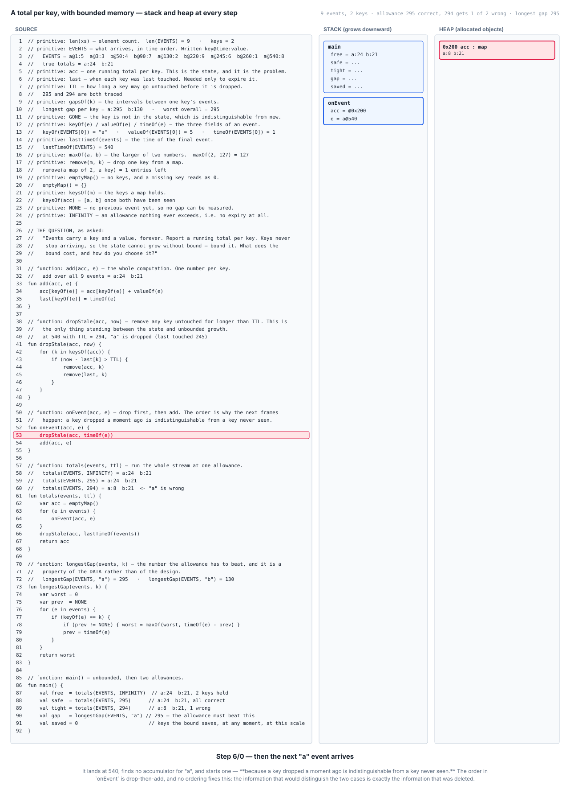

It lands at 540, finds no accumulator for "a", and starts one — **because a key dropped a moment ago is indistinguishable from a key never seen.** The order in `onEvent` is drop-then-add, and no ordering fixes this: the information that would distinguish the two cases is exactly the information that was deleted.

</details>
<details>
<summary><b>Step 7 of 12</b> — so "a" totals 8, not 24</summary>

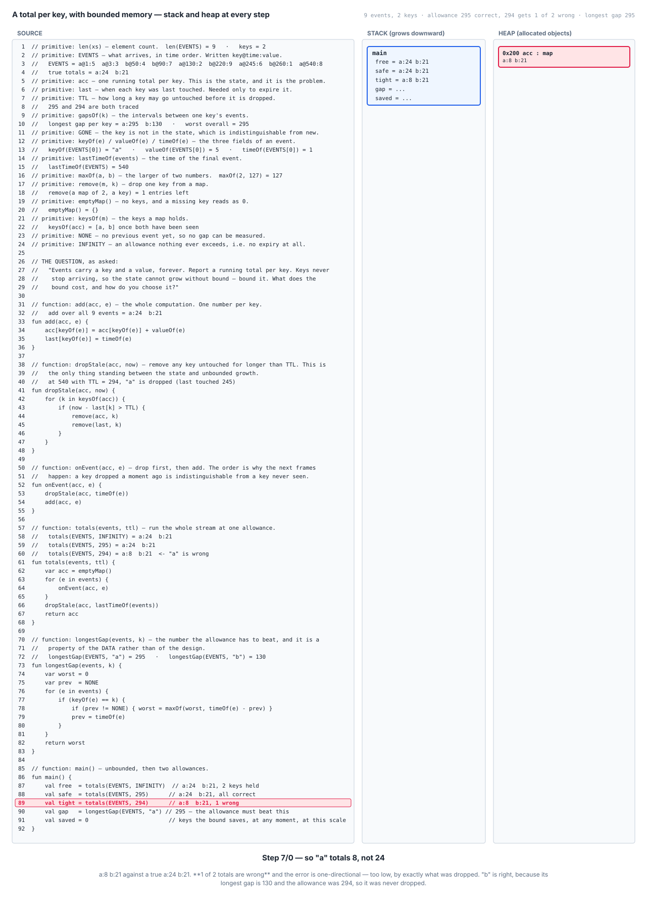

a:8  b:21 against a true a:24  b:21. **1 of 2 totals are wrong** and the error is one-directional — too low, by exactly what was dropped. "b" is right, because its longest gap is 130 and the allowance was 294, so it was never dropped.

</details>
<details>
<summary><b>Step 8 of 12</b> — at 295 every total is right again</summary>

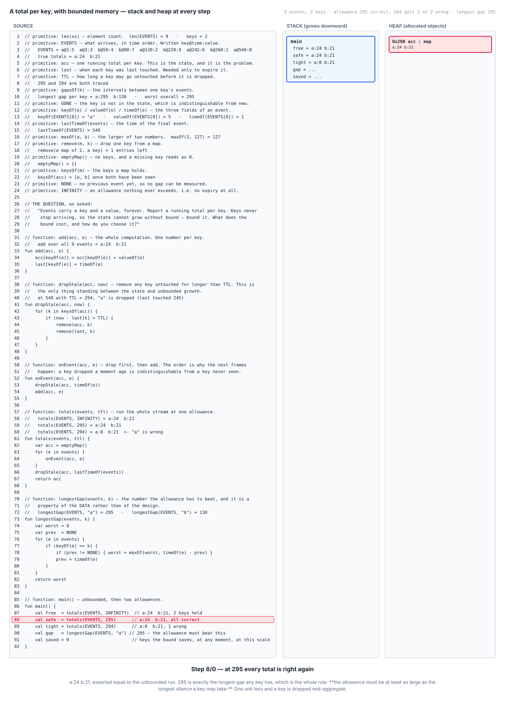

a:24  b:21, asserted equal to the unbounded run. 295 is exactly the longest gap any key has, which is the whole rule: **the allowance must be at least as large as the longest silence a key may take.** One unit less and a key is dropped mid-aggregate.

</details>
<details>
<summary><b>Step 9 of 12</b> — and that number is a property of the DATA</summary>

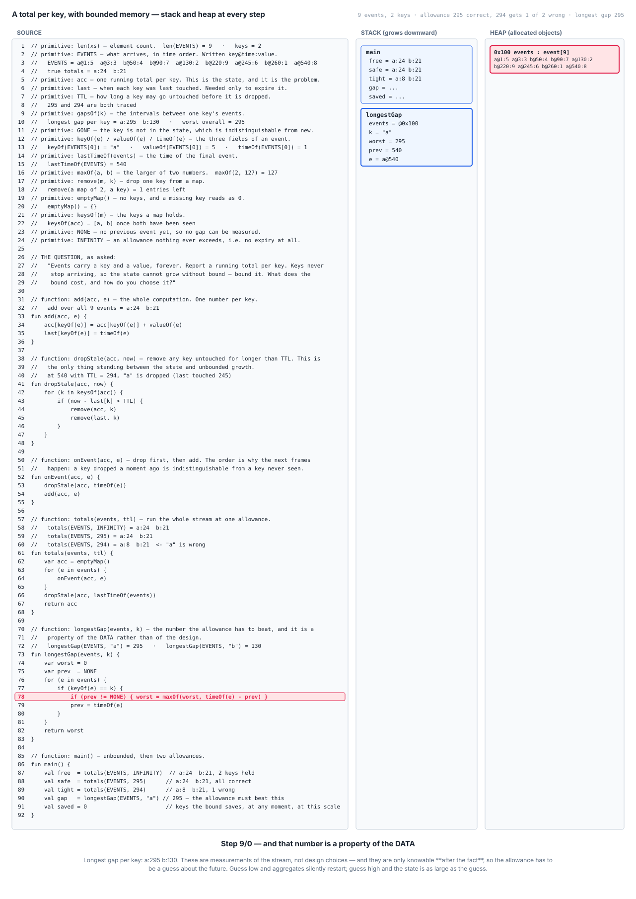

Longest gap per key: a:295  b:130. These are measurements of the stream, not design choices — and they are only knowable **after the fact**, so the allowance has to be a guess about the future. Guess low and aggregates silently restart; guess high and the state is as large as the guess.

</details>
<details>
<summary><b>Step 10 of 12</b> — so the bound is a guess, and both errors are silent</summary>

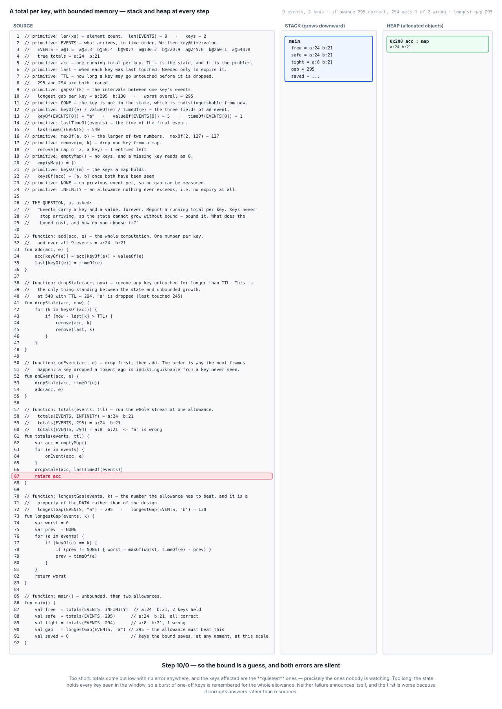

Too short: totals come out low with no error anywhere, and the keys affected are the **quietest** ones — precisely the ones nobody is watching. Too long: the state holds every key seen in the window, so a burst of one-off keys is remembered for the whole allowance. Neither failure announces itself, and the first is worse because it corrupts answers rather than resources.

</details>
<details>
<summary><b>Step 11 of 12</b> — what would make it safe</summary>

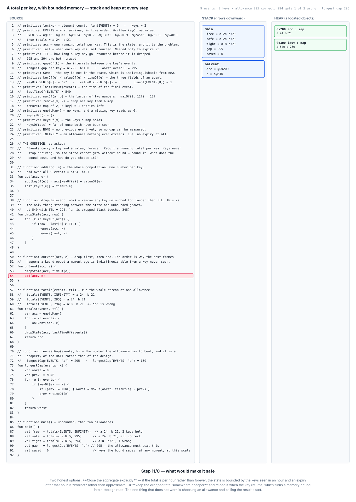

Two honest options. **Close the aggregate explicitly** — if the total is per hour rather than forever, the state is bounded by the keys seen in an hour and an expiry after that hour is *correct* rather than approximate. Or **keep the dropped total somewhere cheaper** and reload it when the key returns, which turns a memory bound into a storage read. The one thing that does not work is choosing an allowance and calling the result exact.

</details>
<details>
<summary><b>Step 12 of 12</b> — the bill</summary>

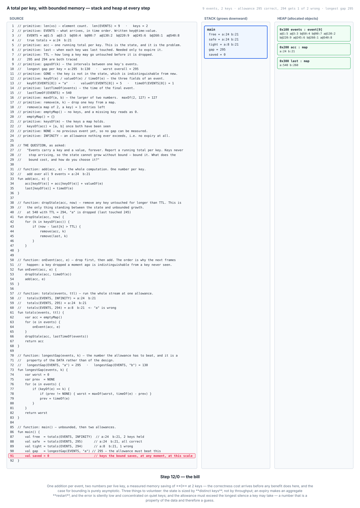

One addition per event, two numbers per live key, a measured memory saving of **0** at 2 keys — the correctness cost arrives before any benefit does here, and the case for bounding is purely asymptotic. Three things to volunteer: the state is sized by **distinct keys**, not by throughput; an expiry makes an aggregate **restart**, and the error is silently low and concentrated on quiet keys; and the allowance must exceed the longest silence a key may take — a number that is a property of the data and therefore a guess.

</details>

<sub>Locals live in the frame and vanish when it is popped; 0x200 holds one number per live key and 0x300 holds a second number per live key that exists **only** so the expiry can be computed — so bounding the state costs twice the memory per key it keeps. Every figure is asserted — including that the unbounded run matches the totals computed directly, that an allowance equal to the worst gap is enough, that one unit less really does drop and re-create a key, that this makes some totals wrong **and leaves others right** (so the effect is visibly per-key), that the memory saving at this scale is **exactly zero** (so the frames' admission cannot quietly become an understatement), and that no two keys share a total (or a wrong one could not be attributed). Generated by `node tools/gen_ch07_interview.js` on `tools/interviewkit.js`.</sub>

<!-- ch07-interview-memory:end -->


## Links & The Bigger Picture

Concepts this chapter mentions but does not fully unpack are linked below — each pointer names the chapter where the concept is covered in depth and gives a concrete example that ties the two chapters together.

- **[Chapter 4: Advanced Windowing → The window lifecycle](ch04-advanced-windowing.md#the-window-lifecycle)** — the state this chapter persists is, in a windowed pipeline, per-window state — ch04 shows where that state is born, merged, and garbage-collected.
  - _Example:_ ch07's persisted count { 42: 13 } is the same keyed state ch04 accumulates per window; ch04's session set { s1, s2 } is exactly what a checkpoint must snapshot for recovery.
- **[Chapter 5: Exactly-Once and Side Effects → What exactly-once means](ch05-exactly-once-and-side-effects.md#what-exactly-once-means)** — exactly-once recovery is the payoff of checkpointing — pairing state with the source offset so no record is lost or double-counted.
  - _Example:_ ch07's checkpoint { count: {42:13}, offset: 500 } resumed at 501 is ch05's "replayable source + dedup": the offset says what was already folded, so a replay does not double-count.
- **[Chapter 6: Streams and Tables → The duality](ch06-streams-and-tables.md#the-duality)** — a state store is the materialized table of the stream — ch06 formalizes why the running count is a table and the incoming events are the changelog.
  - _Example:_ ch07's count state { 42: 13 } is ch06's table; the events folded into it are ch06's changelog [ +10, -3, +5 ], and the checkpoint is the materialization that survives a restart.
- **[Chapter 8: Streaming SQL → SQL as a stream language](ch08-streaming-sql.md#sql-as-a-stream-language)** — streaming SQL state is the same state-store discipline under the hood — a GROUP BY count lives in keyed state that the engine checkpoints.
  - _Example:_ ch07's checkpointed { 42: 13 } is ch08's result table { C1: 4 } persisted between emissions; both rely on the state store to survive a failure.
- **[Chapter 9: Streaming Joins → Correctness and state](ch09-streaming-joins.md#correctness-and-state)** — join state is bounded and garbage-collected by the same watermark + lateness discipline that governs checkpointing — ch09 shows the buffer side.
  - _Example:_ ch07's "bound state growth" is ch09's join buffer: rows are dropped once both watermarks pass the join window + allowed lateness, so the persisted buffer never grows without limit.

## System Design Interview

> **The question:** Design checkpointing for a stateful stream processor. Premise: after a crash the processor must resume from the last barrier snapshot (state plus offset) without losing events or double-counting, even though the source replays from the checkpoint.

**The pipeline:** stream -> processor (state store) -> checkpoint (state + offset) -> durable storage -> restart recovery

<a href="../diagrams/d2/decomp/ch07-0.png">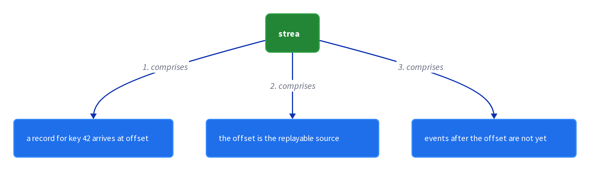</a>

### stream

_Role: stream — delivers records with a source offset_

- a record for key 42 arrives at offset 500
- the offset is the replayable source position
- events after the offset are not yet folded

### processor (state store)

_Role: processor — folds records into a state store_

- the count for key 42 updates { 42: 10 } -> { 42: 13 }
- hot keys stay in memory, the rest spill to disk
- the state store holds the running aggregation

### checkpoint (state + offset)

_Role: checkpoint — snapshots state and offset together_

- a barrier triggers the snapshot at offset 500
- the snapshot captures { count: { 42: 13 }, offset: 500 }
- incremental mode uploads only the changed keys

### durable storage

_Role: durable storage — holds the checkpoint bytes_

- the checkpoint is written to durable storage (S3/HDFS)
- it survives the processor's crash
- restart reads it back to resume


<!-- ch07-system:begin — generated by tools/gen_ch07.js; do not hand-edit -->

#### Why the whole design reduces to one equation and one requirement

**The question.** After a crash the processor must resume from the last barrier snapshot — state plus offset — without losing events or double-counting, even though the source replays from the checkpoint.

**The pipeline:** stream → processor (state store) → checkpoint (state + offset) → durable storage → restart recovery.

**Two stages are easy to collapse and must not be.** The state store is **local** and exists for speed; the checkpoint in durable storage is **remote** and exists to survive the machine. A processor with only the first recovers from a restart but not from a failure.

**The recovery, traced:**

1. Load the state — 4 entries holding 23.
2. Seek the source to offset **4**, the position those entries correspond to.
3. Replay events 5..8 — 4 events worth 22.
4. Final state: 7 entries holding **45**.

That is the design's entire claim, as one equation: **23 loaded + 22 replayed = 45**, the no-crash total. Every failed recovery earlier in this chapter failed that equation, and always because the state and the offset did not match.

**Two settings, and one of them is free.** Incremental rather than full checkpointing is 8 uploads instead of 14 at k = 3, with identical recovery behaviour — no trade at all. The frequency trades in three directions at once: I/O, recovery time, and under at-least-once the error bound (up to 22 of 45 at a checkpoint every 3 events).

#### When this design is enough, and the four things it does not settle

**It is enough when the sink is inside the system** — another stream, a keyed store you control. Then the atomic commit of state and offset is a local transaction and the design is complete as drawn.

**Derive the checkpoint interval from the recovery SLA**, then check the at-least-once error bound it implies. If that bound is unacceptable, you need exactly-once recovery rather than a shorter interval.

**Turn on incremental checkpointing and leave it on.** It is the only free improvement here.

**What this design does NOT settle — four gaps:**

1. **The atomic commit of state and offset is required, not built.** Every correct recovery above assumed it. Against a local store it is a transaction; against an external sink it is ch05's two-phase commit problem, with the in-doubt state and the human resolution.
2. **1 of the 7 state entries is never collectable**, and persistence makes that leak survive restarts rather than being cleared by one. Nothing in this design bounds it — only the watermark can.
3. **Barrier alignment buffers 2 records** on this 9-event stream with 2 sources. With badly skewed sources it becomes the dominant checkpoint cost, and nothing here bounds how long a stage may wait.
4. **Recovery is only as good as the source's retention.** Replaying from offset 4 requires those 4 events to still exist — so the retention window is the real limit on how stale a checkpoint may be.

#### Visual walkthrough — five stages, four recovery steps, two settings

The animation loops through all 4 steps. Expand any step to study it on its own.



<details>
<summary><b>Step 1 of 4</b> — the pipeline, and what each stage contributes</summary>


Two stages are easy to collapse and must not be: the state store is local and exists for speed, the checkpoint is remote and exists for durability. Lose that distinction and you have a fast processor that cannot survive a machine failure. The single correctness requirement is stage 3 — state and offset committed together.

</details>
<details>
<summary><b>Step 2 of 4</b> — the recovery, traced</summary>

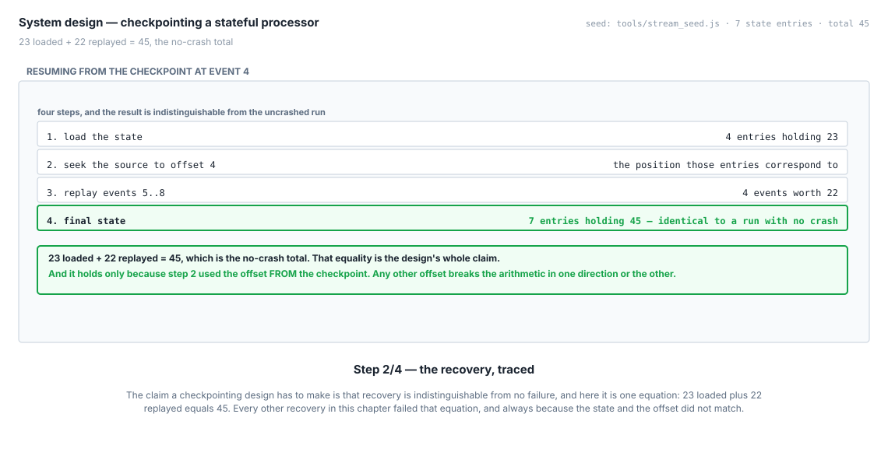

The claim a checkpointing design has to make is that recovery is indistinguishable from no failure, and here it is one equation: 23 loaded plus 22 replayed equals 45. Every other recovery in this chapter failed that equation, and always because the state and the offset did not match.

</details>
<details>
<summary><b>Step 3 of 4</b> — the two settings, and what each one buys</summary>

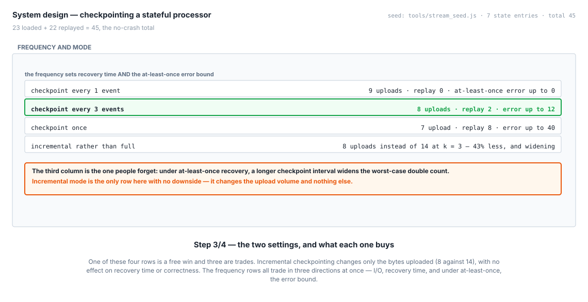

One of these four rows is a free win and three are trades. Incremental checkpointing changes only the bytes uploaded (8 against 14), with no effect on recovery time or correctness. The frequency rows all trade in three directions at once — I/O, recovery time, and under at-least-once, the error bound.

</details>
<details>
<summary><b>Step 4 of 4</b> — and what this design does NOT settle</summary>

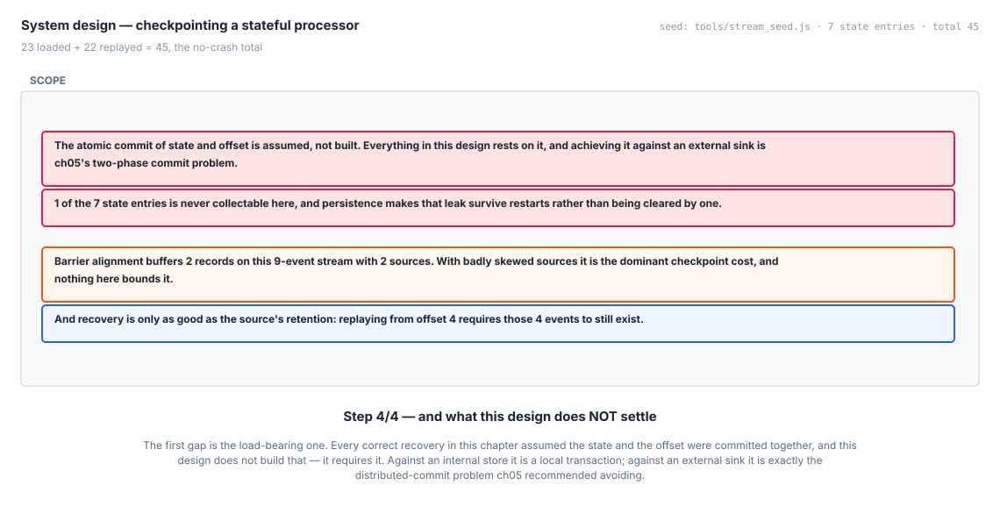

The first gap is the load-bearing one. Every correct recovery in this chapter assumed the state and the offset were committed together, and this design does not build that — it requires it. Against an internal store it is a local transaction; against an external sink it is exactly the distributed-commit problem ch05 recommended avoiding.

</details>

<sub>The recovery arithmetic, both upload counts and the alignment buffer are computed from the seed and asserted. Generated by `node tools/gen_ch07.js`.</sub>

<!-- ch07-system:end -->

<!-- ch07-system-memory:begin — generated by tools/gen_ch07.js; do not hand-edit -->

#### Checkpointing a stateful processor — stack and heap at every step

**What is being answered.** The full checkpoint cycle — steady state, commit, crash, resume — and the one requirement the design does not supply.

Two details are worth watching. `store.durable` is **false**: the local state store is fast and dies with the machine, which is why `commit` exists at all. And `copyOf` makes the checkpoint a snapshot rather than a reference, so the processor can keep working while the upload runs.

Step 4 is the requirement stated as code: `if (atomic == false) { cp.offset = 0 }`. The entries landed and the offset did not, so `torn.total` reaches 68 against 45. This design assumes that commit is atomic; it does not make it so.

The animation steps through the code, holding each line long enough to read the STACK (call frames and their locals) and the HEAP (allocated arrays and objects) as they are AT THAT MOMENT. Expand any step to study it on its own.



<details>
<summary><b>Step 1 of 4</b> — steady state: one entry per (key, window), updated in place</summary>


After 5 events the local store holds 4 entries totalling 23, and `durable` is **false** — it is on local disk, fast and doomed with the machine. That flag is the distinction the next step exists for.

</details>
<details>
<summary><b>Step 2 of 4</b> — the commit writes state and offset to durable storage</summary>

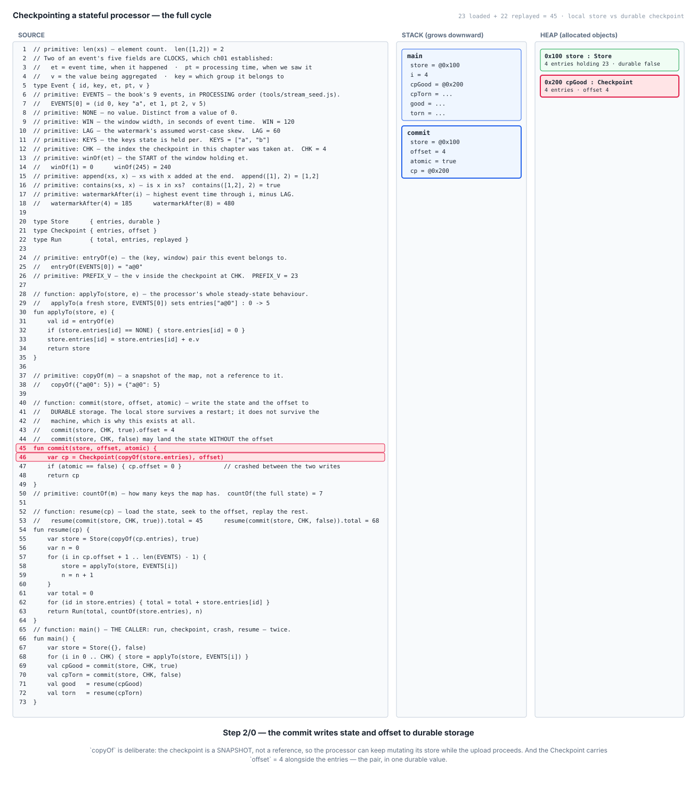

`copyOf` is deliberate: the checkpoint is a SNAPSHOT, not a reference, so the processor can keep mutating its store while the upload proceeds. And the Checkpoint carries `offset` = 4 alongside the entries — the pair, in one durable value.

</details>
<details>
<summary><b>Step 3 of 4</b> — resuming from the intact pair reproduces the no-crash run</summary>

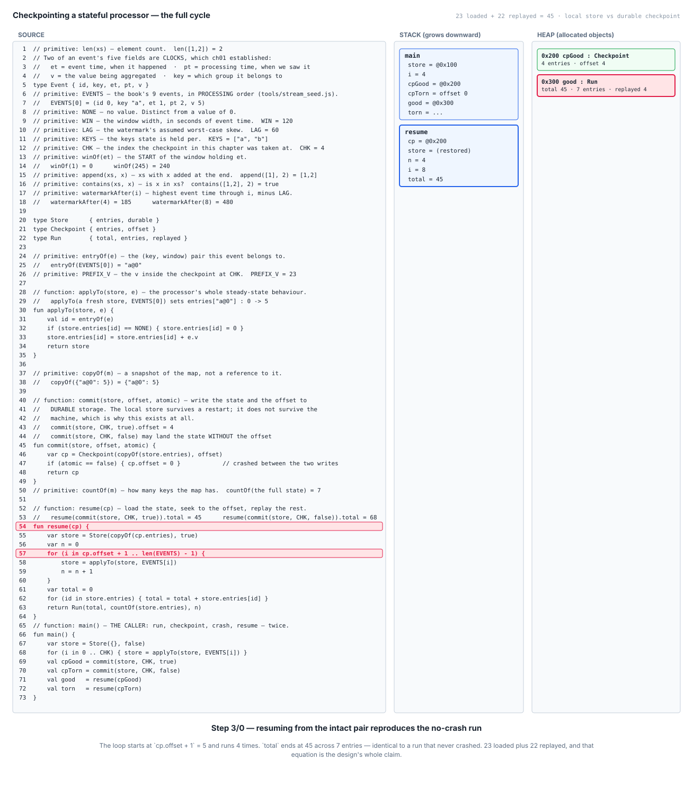

The loop starts at `cp.offset + 1` = 5 and runs 4 times. `total` ends at 45 across 7 entries — identical to a run that never crashed. 23 loaded plus 22 replayed, and that equation is the design's whole claim.

</details>
<details>
<summary><b>Step 4 of 4</b> — a torn commit replays the prefix and over-counts</summary>

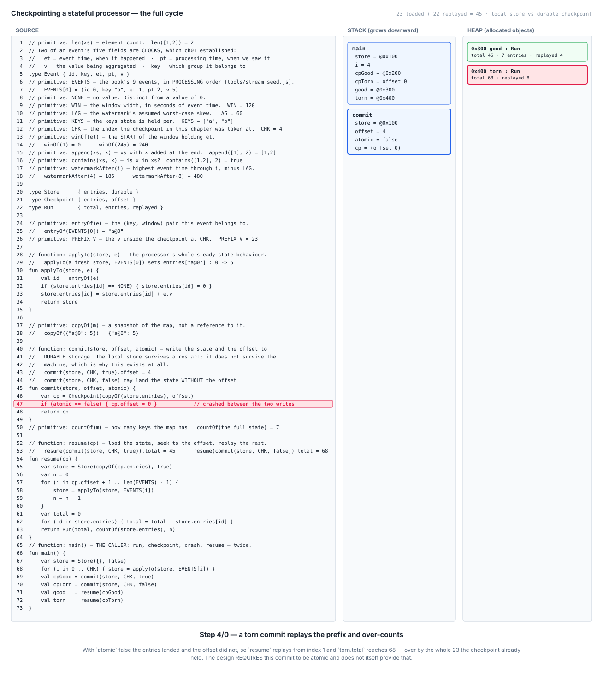

With `atomic` false the entries landed and the offset did not, so `resume` replays from index 1 and `torn.total` reaches 68 — over by the whole 23 the checkpoint already held. The design REQUIRES this commit to be atomic and does not itself provide that.

</details>

<sub>Both run totals and the entry counts are computed from the seed and asserted. Generated by `node tools/gen_ch07.js` on `tools/memkit.js`.</sub>

<!-- ch07-system-memory:end -->

## Interview Questions

### Q1

A streaming aggregation keeps a running count per user in memory; when the job restarts after a crash, all counts reset to zero and must be rebuilt by replaying the entire stream.

**Interviewer's question:** How do you make the running counts survive a restart without a full replay?

**Solution:** Persist state to a state store (e.g. RocksDB) and take aligned checkpoints that pair state with the source offset; restart resumes from the checkpoint rather than from zero.

**System-design components:**
- State store — RocksDB
- Checkpoint — state + offset snapshot
- Barrier — aligns the snapshot
- Incremental snapshot — only the delta

```java
// count {42:13} at offset 500
//   checkpoint saves {count:{42:13}, offset:500}
//   restart restores count 13, resumes at 501
//   -> no reset, no full replay
```

_This is exactly the persistent-state and checkpoint material in this chapter._

_Covers:_ 2. Checkpoints · 3. State stores · 6. Exactly-once recovery

_From the 28 problems:_ 20-metrics-monitoring · 21-ad-click-aggregation

### Q2

A metrics pipeline has 10 GB of state; snapshotting the whole thing every minute saturates the network, but snapshotting rarely makes crashes expensive.

**Interviewer's question:** How do you keep checkpoint cost low while keeping recovery fast?

**Solution:** Use incremental checkpoints — upload only the keys that changed since the last snapshot — and tune the frequency so the recovery time matches the failure budget.

**System-design components:**
- Incremental checkpoint — delta only
- State store — disk-backed
- Frequency — tuned to failure budget

```java
// 1000 keys, 12 changed
//   incremental: upload 12 keys
//   full:        upload 1000 keys
//   -> 0.3% of the I/O
```

_This is exactly the incremental-checkpoint material in this chapter._

_Covers:_ 4. Incremental checkpoints · 7. Checkpoint frequency

_From the 28 problems:_ 20-metrics-monitoring

## Key Concepts

### The Problem

**1. Memory state dies with the process.** Persistent state makes the aggregation durable and restart fast.


### The Solution

A checkpoint captures every stage's state at one logical point in the stream, aligned by a barrier.

```java
// count {42:13} at offset 500
//   checkpoint saves {count:{42:13}, offset:500}
//   restart restores count 13, resumes at 501
//   -> no reset, no full replay
```


### Key Facts

| Fact | Detail | In the wild |
|---|---|---|
| 2. Checkpoints | A checkpoint captures every stage's state at one logical point in the stream, aligned by a barrier. | Flink's aligned checkpoints implement this. |
| 3. State stores | An embedded state store like RocksDB keeps hot keys cached and spills the rest to disk. | Flink's RocksDB state backend is the production form. |
| 4. Incremental checkpoints | Incremental checkpoints upload only the keys that changed since the last snapshot. | Flink's incremental checkpointing for RocksDB. |
| 5. Checkpoint barriers | A barrier flows through the stream; each stage snapshots on seeing it, producing a coherent multi-stage snapshot (Chandy-Lamport). | Flink checkpoint barriers are the production form. |
| 6. Exactly-once recovery | Exactly-once checkpointing aligns state with source offsets so no record is lost or double-counted. | Flink's exactly-once checkpoint mode. |
| 9. Stateless vs stateful operators | Stateless operators (map, filter) transform each record on its own and hold no state; stateful operators (group-by, window, join, dedup) hold per-key state in a state store. | A Flink map is stateless; a keyed COUNT is stateful and uses the state backend. |
| 7. Checkpoint frequency | Frequent checkpoints shorten recovery but raise I/O; infrequent ones are cheap but replay more on restart. | A 1-minute interval is a common starting point. |
| 8. Bound state growth | Watermarks plus allowed lateness let the pipeline garbage-collect finished window state. | Dataflow's allowed-lateness is the garbage-collection horizon. |


### Tradeoffs & When

- Frequent checkpoints shorten recovery but raise I/O; infrequent ones are cheap but replay more on restart.
- Watermarks plus allowed lateness let the pipeline garbage-collect finished window state.


### Real-World Examples

- **RocksDB** — Embedded disk-backed state store for large streaming state
- **Apache Flink** — Aligned, incremental, exactly-once checkpoints with the RocksDB state backend
- **Chandy-Lamport** — The distributed snapshot algorithm behind checkpoint barriers


<details><summary>All concepts (index)</summary>

### Why: 1. Memory state dies with the process

**Why.** A crash loses in-memory aggregation, and rebuilding it means re-reading the whole stream.

**Claim.** Persistent state makes the aggregation durable and restart fast.

**Grounding.** State is the materialized fold of the stream, and persisting it avoids the rebuild.

**In the wild.** Flink and Dataflow persist state to survive restarts.

<a href="../diagrams/d2/card/ch07-0.png">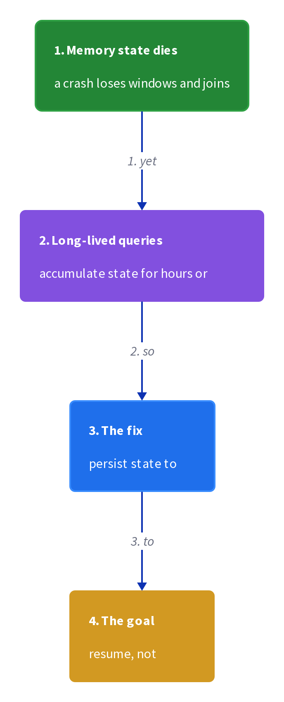</a>
### Snapshot: 2. Checkpoints

**Why.** A consistent point-in-time snapshot is what a restart resumes from.

**Claim.** A checkpoint captures every stage's state at one logical point in the stream, aligned by a barrier.

**Grounding.** It pairs state with the source offset so resume is coherent.

**In the wild.** Flink's aligned checkpoints implement this.

<a href="../diagrams/d2/card/ch07-1.png">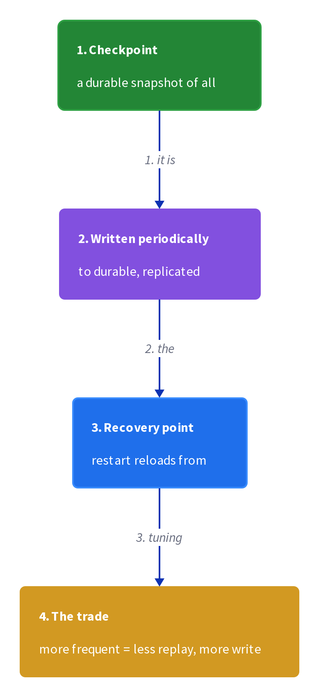</a>
### Store: 3. State stores

**Why.** State can exceed memory, so bytes need a home with hot data in memory and the rest on disk.

**Claim.** An embedded state store like RocksDB keeps hot keys cached and spills the rest to disk.

**Grounding.** It is the difference between fitting 10 GB of state in memory or on a disk-backed store.

**In the wild.** Flink's RocksDB state backend is the production form.

<a href="../diagrams/d2/card/ch07-2.png">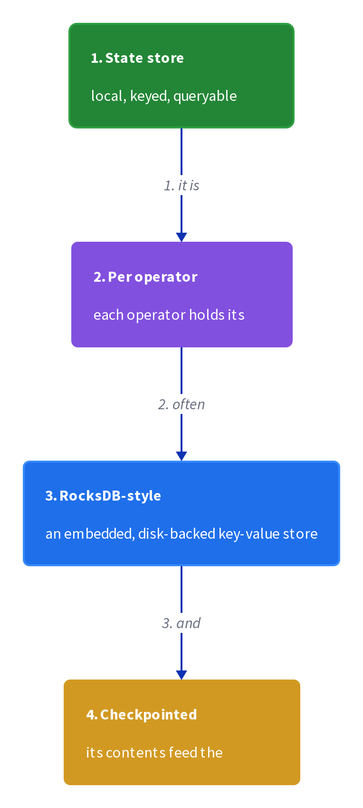</a>
### Cost: 4. Incremental checkpoints

**Why.** Snapshotting all state every time is I/O-expensive when state is large.

**Claim.** Incremental checkpoints upload only the keys that changed since the last snapshot.

**Grounding.** Uploading a delta of 12 keys vs a full 1000 is the practical win.

**In the wild.** Flink's incremental checkpointing for RocksDB.

<a href="../diagrams/d2/card/ch07-3.png">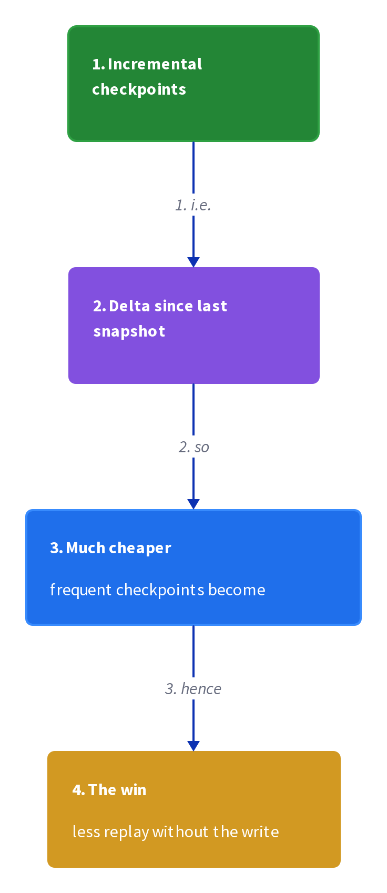</a>
### Alignment: 5. Checkpoint barriers

**Why.** A snapshot must be consistent across stages, or a resume can mix old and new state.

**Claim.** A barrier flows through the stream; each stage snapshots on seeing it, producing a coherent multi-stage snapshot (Chandy-Lamport).

**Grounding.** The barrier is what makes the snapshot a single logical point.

**In the wild.** Flink checkpoint barriers are the production form.

<a href="../diagrams/d2/card/ch07-4.png">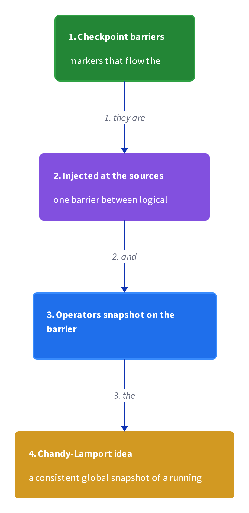</a>
### Guarantee: 6. Exactly-once recovery

**Why.** At-least-once recovery can replay some records, double-counting at sinks.

**Claim.** Exactly-once checkpointing aligns state with source offsets so no record is lost or double-counted.

**Grounding.** Resume at offset 501 after offset 500 was folded = no double-count.

**In the wild.** Flink's exactly-once checkpoint mode.

<a href="../diagrams/d2/card/ch07-5.png">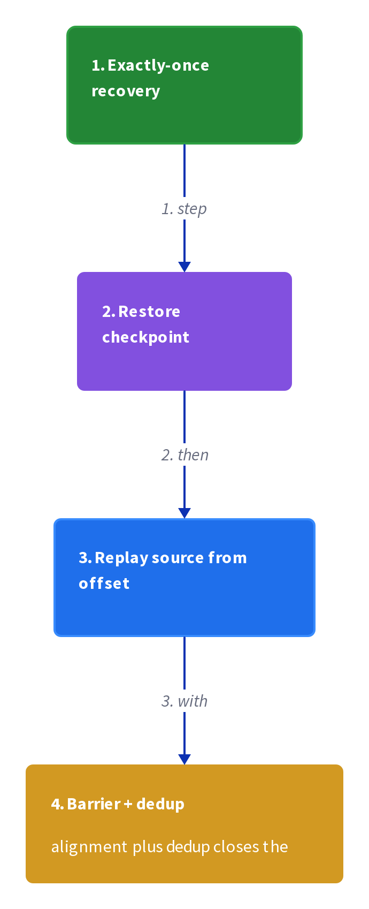</a>
### Frequency: 7. Checkpoint frequency

**Why.** The snapshot interval is the knob between steady-state cost and recovery time.

**Claim.** Frequent checkpoints shorten recovery but raise I/O; infrequent ones are cheap but replay more on restart.

**Grounding.** Pick the frequency for the failure budget and state size.

**In the wild.** A 1-minute interval is a common starting point.

<a href="../diagrams/d2/card/ch07-6.png">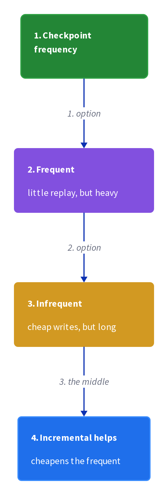</a>
### Growth: 8. Bound state growth

**Why.** Windows that never close and keys that never expire grow state without limit.

**Claim.** Watermarks plus allowed lateness let the pipeline garbage-collect finished window state.

**Grounding.** Unbounded state eventually exhausts the state store.

**In the wild.** Dataflow's allowed-lateness is the garbage-collection horizon.

<a href="../diagrams/d2/card/ch07-7.png">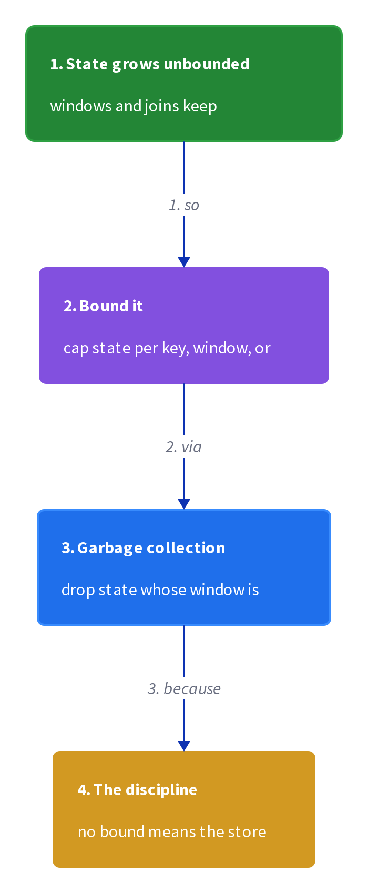</a>
### Scope: 9. Stateless vs stateful operators

**Why.** Not every operator needs to remember anything between events, and confusing the two is how people end up assuming every streaming job stores state.

**Claim.** Stateless operators (map, filter) transform each record on its own and hold no state; stateful operators (group-by, window, join, dedup) hold per-key state in a state store.

**Grounding.** State exists only where the answer depends on what came before the current record.

**In the wild.** A Flink map is stateless; a keyed COUNT is stateful and uses the state backend.

</details>


## Quiz

1. Why must stream-processing state persist?

   - A. To make the stream ordered
   - B. To survive restarts without re-reading the whole stream
   - C. To reduce event size
   - D. To create watermarks

<details><summary>Reveal answer</summary>

**B.** Persistent state makes the aggregation durable and restart fast.

</details>

2. What does a checkpoint capture?

   - A. Only the watermark
   - B. State and the source offset at one logical point
   - C. Only the source offset
   - D. Only the window definitions

<details><summary>Reveal answer</summary>

**B.** A checkpoint pairs state with the offset so resume is coherent.

</details>

3. What is the benefit of incremental checkpoints?

   - A. They capture every key
   - B. They upload only the keys that changed
   - C. They never need a barrier
   - D. They eliminate recovery

<details><summary>Reveal answer</summary>

**B.** Incremental checkpoints upload only the delta, cutting I/O sharply.

</details>

4. What aligns a multi-stage snapshot?

   - A. A watermark
   - B. A checkpoint barrier
   - C. A trigger
   - D. A window

<details><summary>Reveal answer</summary>

**B.** A barrier flows through the stream and each stage snapshots on seeing it.

</details>

5. Exactly-once recovery means ___ .

   - A. no state is ever stored
   - B. state and offsets align so no record is lost or double-counted
   - C. the pipeline never restarts
   - D. watermarks are perfect

<details><summary>Reveal answer</summary>

**B.** Aligning state with offsets means resume is at the right position.

</details>

## Sources

- [Apache Flink — Stateful stream processing](https://nightlies.apache.org/flink/flink-docs-stable/docs/concepts/stateful-stream-processing/) — Checkpoints, state stores, and exactly-once recovery in a production engine
- [RocksDB](https://rocksdb.org/) — The embedded key-value store used for disk-backed streaming state
- [Chandy & Lamport — "Distributed Snapshots"](https://lamport.azurewebsites.net/pubs/chandy.pdf) — The snapshot algorithm that checkpoint barriers implement
- [Akidau et al. — "MillWheel" (VLDB 2013)](https://research.google/pubs/pub41378/) — Persistent state and checkpointing at internet scale

