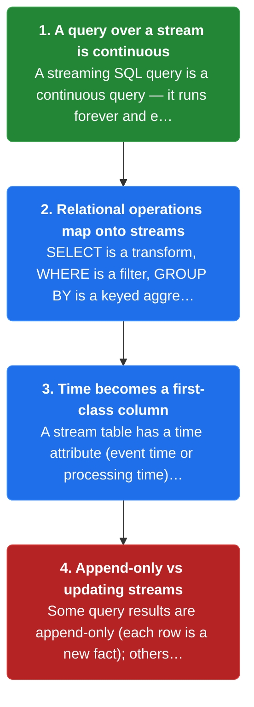
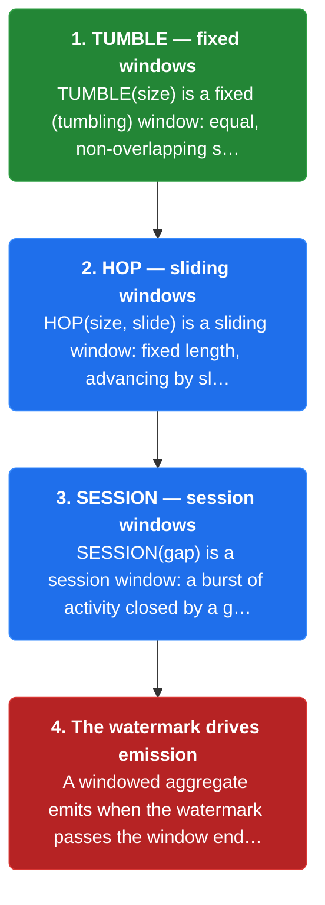
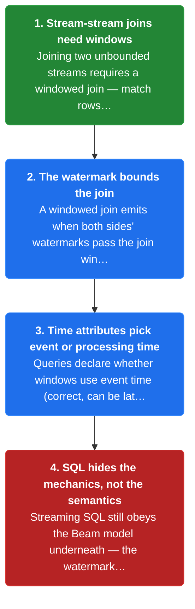
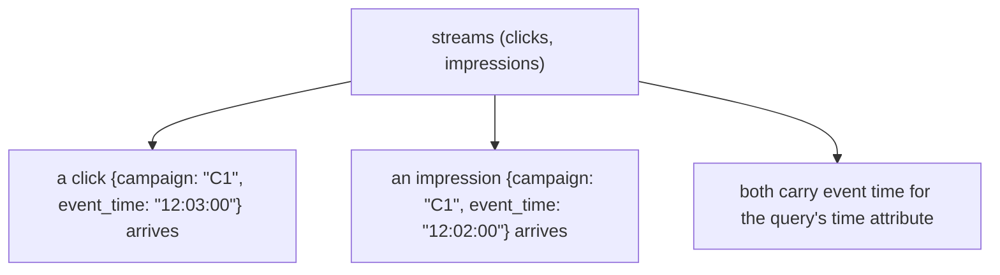
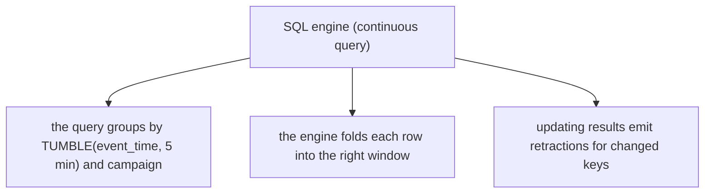
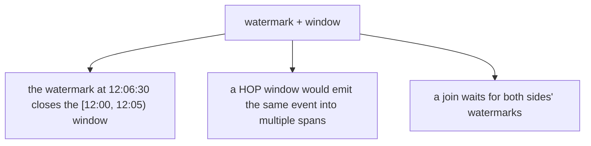
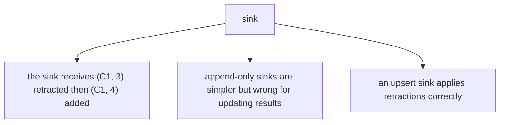
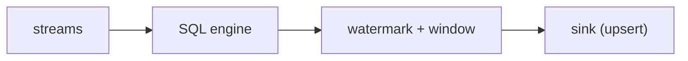
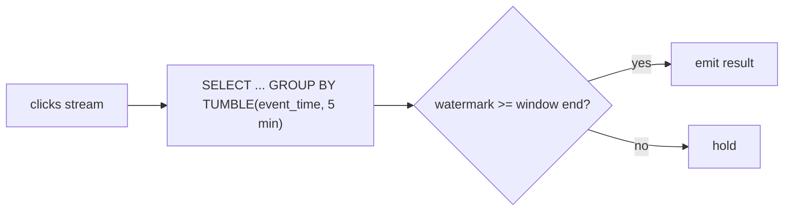
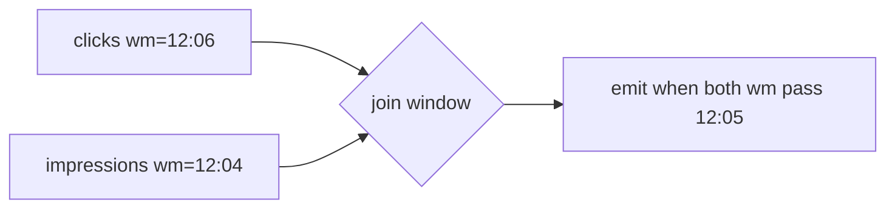

# Chapter 8: Streaming SQL

> SQL gives stream processing a declarative face — relational operations map onto streams, windows become explicit time constructs (TUMBLE/HOP/SESSION), and a watermark tells the query engine when results are ready.

_Also known as: SS Ch08 · Streaming SQL · Continuous Query · TUMBLE · HOP · SESSION · Time Attribute_

## Flow

### SQL as a stream language

> **Why this matters:** Declarative SQL lowers the barrier to stream processing, but the relational model must be adapted to time, so this section shows how familiar SQL maps onto a stream.



1. **A query over a stream is continuous** — A streaming SQL query is a **continuous query** — it runs forever and emits updated results as data arrives, rather than reading a finite table once.

2. **Relational operations map onto streams** — **SELECT is a transform, WHERE is a filter, GROUP BY is a keyed aggregation** — the relational algebra of batch SQL maps onto the streaming transforms of the Beam model.

3. **Time becomes a first-class column** — A stream table has a **time attribute** (event time or processing time) that windows and joins use. **Batch SQL has no notion of event time; streaming SQL does.**

4. **Append-only vs updating streams** — Some query results are **append-only** (each row is a new fact); others are **updating** (a key's value changes, requiring a retraction of the old row). The table's update mode matters for sinks.

```java
// QUERY SIDE — a continuous GROUP BY updates a total as clicks arrive
// DEF: continuous query — a query that runs forever and emits updated results = "SELECT campaign, COUNT(*) FROM clicks GROUP BY campaign"
// DEF: result — the updating output table = { C1: 3 }
// DEF: retraction — the engine signals the old row is replaced by the new row
// -> input : a new click {campaign: "C1"} arrives
//    step 1 · the WHERE keeps the row -> filtered : 1 row passes
//    step 2 · the GROUP BY updates the key -> result : { C1: 3 } -> { C1: 4 }   BECAUSE COUNT folds the new row in
//    step 3 · the engine emits a retraction of the old row -> sink sees (C1, 3) removed then (C1, 4) added
// <- outcome : the sink ends with C1 = 4, not 3 or 7   BECAUSE the retraction replaced the old value
//    derivation : new count = old count + 1 = 3 + 1 = 4
```

### Windows in SQL

> **Why this matters:** The key adaptation of SQL to streams is explicit windowing — batch SQL groups whole tables, while streaming SQL must say over which time slice each aggregate is computed, so this section covers the window constructs.



1. **TUMBLE — fixed windows** — **TUMBLE(size)** is a fixed (tumbling) window: equal, non-overlapping spans. It is the SQL spelling of the fixed window from the Beam model.

2. **HOP — sliding windows** — **HOP(size, slide)** is a sliding window: fixed length, advancing by slide. It is the SQL spelling of the sliding window.

3. **SESSION — session windows** — **SESSION(gap)** is a session window: a burst of activity closed by a gap of inactivity. The query engine merges sessions as data arrives.

4. **The watermark drives emission** — A windowed aggregate emits when the **watermark passes the window end**. The time attribute (event time) plus the watermark is what makes SQL results correct under out-of-order data.

```java
// WINDOWED SQL SIDE — the same clicks bucketed by TUMBLE vs HOP give different row counts
// DEF: TUMBLE — a 5-min fixed window over event time
// DEF: HOP — a 10-min window sliding every 2 min
// DEF: click — {event_time: "12:04:00", campaign: "C1"}
// -> input : the query "SELECT window, COUNT(*) FROM clicks GROUP BY window"
//    step 1 · TUMBLE assigns the click -> one window [12:00, 12:05) -> tumble_rows : 0 -> 1
//    step 2 · HOP assigns the click -> windows [12:00,12:10), [12:02,12:12), [12:04,12:14) -> hop_rows : 0 -> 3
//    step 3 · the watermark at 12:06:30 closes the TUMBLE window -> the [12:00, 12:05) row is emitted
// <- outcome : TUMBLE produced 1 row for the click, HOP produced 3   BECAUSE HOP windows overlap
//    derivation : HOP rows per event = up to size / slide = 10 min / 2 min = 5, but only 3 overlap 12:04:00
```

### Joins and time in SQL

> **Why this matters:** Joins are where streaming SQL gets subtle — two streams never align in time the way two batch tables do — so this section covers windowed joins and the time semantics that make them correct.



1. **Stream-stream joins need windows** — Joining two unbounded streams requires a **windowed join** — match rows whose time attributes are within a window of each other — otherwise the join has no boundary.

2. **The watermark bounds the join** — A windowed join emits when **both sides' watermarks pass the join window**, so a row is not emitted until both streams are complete for that window.

3. **Time attributes pick event or processing time** — Queries declare whether windows use **event time** (correct, can be late) or **processing time** (simple, no late data). Event time is the right default for correctness.

4. **SQL hides the mechanics, not the semantics** — Streaming SQL still obeys the Beam model underneath — **the watermark, triggers, and accumulation are configured by the engine**, but the user still chooses the window and time attribute.

```java
// JOIN SQL SIDE — a windowed join waits for both watermarks before emitting a match
// DEF: windowed join — match clicks and impressions whose event times are within 5 min
// DEF: watermark — clicks = 12:06:00, impressions = 12:04:30
// DEF: match — a (click, impression) pair in the join window [12:00, 12:05)
// -> input : a click {campaign: "C1", event_time: "12:03:00"} and an impression {campaign: "C1", event_time: "12:02:00"}
//    step 1 · both rows fall in the join window -> match : {} -> { (click 12:03, impression 12:02) }
//    step 2 · the join checks completeness -> clicks watermark 12:06:00 passes, impressions watermark 12:04:30 does not
//    step 3 · the match waits -> not emitted until impressions watermark passes 12:05:00   BECAUSE a late impression could still arrive
// <- outcome : the match is held at 0 emitted rows until both watermarks pass 12:05:00   BECAUSE the join is bounded by the slower stream
//    derivation : the join window closes when min(12:06:00, 12:04:30 -> 12:05:00+) > 12:05:00
```


## System Design Interview

**The pipeline:** streams (clicks, impressions) -> SQL engine (continuous query) -> watermark + window -> updating result -> sink

### streams (clicks, impressions)

_Role: streams — feed the SQL engine with event-time data_



### SQL engine (continuous query)

_Role: SQL engine — runs the query forever_



### watermark + window

_Role: watermark + window — decides when results emit_



### sink

_Role: sink — applies the updating result_





```java
// SYSTEM DESIGN — a continuous SQL query updates a campaign count as the watermark closes a TUMBLE window
// DEF: continuous query — "SELECT campaign, COUNT(*) FROM clicks GROUP BY TUMBLE(event_time, 5 min), campaign"
// DEF: watermark — the completeness signal = 12:06:30
// DEF: result — the updating output table = { C1: 3 }
// STATE (before):
//    result_table : { C1: 3 }
// -> input : a new click {campaign: "C1", event_time: "12:04:00"} arrives
//    step 1 · the engine folds the row -> result_table : { C1: 3 } -> { C1: 4 }   BECAUSE COUNT adds the new row
//    step 2 · the engine retracts the old row -> the sink removes (C1, 3)   BECAUSE the value changed
//    step 3 · the watermark passes 12:05:00 -> the [12:00, 12:05) window emits (C1, 4)   BECAUSE the window is complete
// <- outcome : the sink shows C1 = 4 after the retraction and the emit   BECAUSE the updating query replaced the old row
//    derivation : new count = old count + 1 = 3 + 1 = 4
```

## Interview Questions

### Q1

A team wants analysts to write ad-click aggregations in SQL over a live stream, but the results must be correct under out-of-order events.

**Interviewer's question:** How do you expose a streaming pipeline as SQL with correct event-time semantics?

**Solution:** Use a streaming SQL engine with an event-time attribute; declare TUMBLE/HOP/SESSION windows and let the watermark drive when each window's result emits.

**System-design components:**
- Streaming SQL engine — Flink SQL
- Time attribute — event time
- Window — TUMBLE/HOP/SESSION
- Watermark — drives emission



```java
SELECT window_start, campaign, COUNT(*)
FROM clicks
GROUP BY TUMBLE(event_time, INTERVAL '5' MINUTE), campaign
-- emits when the watermark passes each 5-min window end
```

_This is exactly the streaming-SQL window material in this chapter._

_Covers:_ 3. Time attributes · 4. TUMBLE, HOP, SESSION · 7. The watermark drives SQL emission

_From the 28 problems:_ 21-ad-click-aggregation · 20-metrics-monitoring

### Q2

A SQL query joins clicks with impressions, but it emits matches before a late impression could still arrive, producing incomplete rows.

**Interviewer's question:** How do you make a stream-stream SQL join correct under out-of-order data?

**Solution:** Use a windowed (interval) join and let the watermark bound it — the join emits a match only when both sides' watermarks pass the join window.

**System-design components:**
- Windowed join — interval bound
- Watermark — both sides pass
- Hold — buffer until complete



```java
SELECT ...
FROM clicks c JOIN impressions i
  ON c.campaign = i.campaign
  AND i.event_time BETWEEN c.event_time - INTERVAL '5' MINUTE
                      AND c.event_time + INTERVAL '5' MINUTE
-- emits when both watermarks pass the window
```

_This is exactly the windowed-join material in this chapter._

_Covers:_ 6. Windowed joins · 7. The watermark drives SQL emission

_From the 28 problems:_ 21-ad-click-aggregation

## Key Concepts

### The Problem

**1. Stream processing is too low-level.** Streaming SQL gives stream processing a declarative face that maps relational operations onto streams.


### The Solution

A continuous query emits updated results as data arrives, rather than reading a finite table once.


### Key Facts

| Fact | Detail | In the wild |
|---|---|---|
| 2. Continuous queries | A continuous query emits updated results as data arrives, rather than reading a finite table once. | A materialized view over a Kafka topic is a continuous query. |
| 3. Time attributes | A time attribute is an event-time or processing-time column that windows and joins key on. | Flink SQL's event-time attribute drives watermark-based windows. |
| 4. TUMBLE, HOP, SESSION | TUMBLE is fixed, HOP is sliding, SESSION is gap-based — the three window shapes as SQL constructs. | Flink SQL and Beam SQL both support these. |
| 5. Append-only vs updating results | Append-only results add new facts; updating results replace a key's value and need retractions. | Flink SQL emits retract streams for updating queries. |
| 6. Windowed joins | A windowed join matches rows whose time attributes fall within a window of each other. | Flink SQL interval joins are the production form. |
| 7. The watermark drives SQL emission | A windowed aggregate emits when the watermark passes the window end; a join emits when both sides' watermarks pass. | Flink SQL uses the watermark to fire windows. |
| 8. Event time vs processing time | Event time is correct but can be late; processing time is simple but wrong for out-of-order data. | Production SQL pipelines default to event time. |


### Tradeoffs & When

- A windowed aggregate emits when the watermark passes the window end; a join emits when both sides' watermarks pass.
- Event time is correct but can be late; processing time is simple but wrong for out-of-order data.


### Real-World Examples

- **Flink SQL** — TUMBLE/HOP/SESSION, event-time attributes, and interval joins
- **ksqlDB** — Continuous SQL over Kafka streams and tables
- **Beam SQL** — Declarative queries over Beam pipelines


<details><summary>All concepts (index)</summary>

### Why: 1. Stream processing is too low-level

**Why.** Hand-written transforms and windows are verbose and error-prone; SQL expresses the same logic declaratively.

**Claim.** Streaming SQL gives stream processing a declarative face that maps relational operations onto streams.

**Grounding.** The book presents SQL as a first-class stream-processing surface.

**In the wild.** Flink SQL, Beam SQL, and ksqlDB are production streaming-SQL engines.
### Query: 2. Continuous queries

**Why.** A stream never ends, so a query over it must run forever, not once.

**Claim.** A continuous query emits updated results as data arrives, rather than reading a finite table once.

**Grounding.** This is what distinguishes streaming SQL from batch SQL.

**In the wild.** A materialized view over a Kafka topic is a continuous query.
### Time: 3. Time attributes

**Why.** Windows and joins need to know which time to use — when the event happened or when it was processed.

**Claim.** A time attribute is an event-time or processing-time column that windows and joins key on.

**Grounding.** Batch SQL has no event time; streaming SQL does.

**In the wild.** Flink SQL's event-time attribute drives watermark-based windows.
### Window: 4. TUMBLE, HOP, SESSION

**Why.** Aggregates over a stream need an explicit time slice, spelled out in SQL.

**Claim.** TUMBLE is fixed, HOP is sliding, SESSION is gap-based — the three window shapes as SQL constructs.

**Grounding.** They are the SQL spellings of the Beam window shapes.

**In the wild.** Flink SQL and Beam SQL both support these.
### Mode: 5. Append-only vs updating results

**Why.** Some results only add rows; others change existing rows, which sinks must handle differently.

**Claim.** Append-only results add new facts; updating results replace a key's value and need retractions.

**Grounding.** A COUNT GROUP BY is updating — the old count row must be retracted.

**In the wild.** Flink SQL emits retract streams for updating queries.
### Join: 6. Windowed joins

**Why.** Two unbounded streams have no natural join boundary, so time must supply one.

**Claim.** A windowed join matches rows whose time attributes fall within a window of each other.

**Grounding.** The window is what bounds an otherwise infinite join.

**In the wild.** Flink SQL interval joins are the production form.
### Watermark: 7. The watermark drives SQL emission

**Why.** A windowed result must wait until the engine believes the window is complete.

**Claim.** A windowed aggregate emits when the watermark passes the window end; a join emits when both sides' watermarks pass.

**Grounding.** SQL hides the watermark mechanics but not its semantics.

**In the wild.** Flink SQL uses the watermark to fire windows.
### Choice: 8. Event time vs processing time

**Why.** The time attribute is a correctness decision, not a syntax detail.

**Claim.** Event time is correct but can be late; processing time is simple but wrong for out-of-order data.

**Grounding.** Event time is the right default for correctness.

**In the wild.** Production SQL pipelines default to event time.

</details>


## Quiz

1. What is a continuous query?

   - A. A query that runs once
   - B. A query that runs forever and emits updated results
   - C. A batch query
   - D. A query with no windows

<details><summary>Reveal answer</summary>

**B.** A continuous query runs forever over the stream, emitting updated results.

</details>

2. Which SQL window is a fixed (tumbling) window?

   - A. HOP
   - B. SESSION
   - C. TUMBLE
   - D. OVER

<details><summary>Reveal answer</summary>

**C.** TUMBLE is the fixed, non-overlapping window.

</details>

3. What does a time attribute provide?

   - A. A wall-clock reading
   - B. An event-time or processing-time column windows and joins key on
   - C. A window size
   - D. A retraction

<details><summary>Reveal answer</summary>

**B.** A time attribute tells windows and joins which time to use.

</details>

4. An updating query result requires ___ .

   - A. only append rows
   - B. a retraction of the old row
   - C. no sink
   - D. a batch table

<details><summary>Reveal answer</summary>

**B.** When a key's value changes, the old row must be retracted.

</details>

5. When does a windowed SQL join emit a match?

   - A. When the first row arrives
   - B. When both sides' watermarks pass the join window
   - C. Every second
   - D. When the query starts

<details><summary>Reveal answer</summary>

**B.** The join waits until both streams are complete for the window.

</details>

