# Chapter 8: Streaming SQL

> SQL gives stream processing a declarative face — relational operations map onto streams, windows become explicit time constructs (TUMBLE/HOP/SESSION), and a watermark tells the query engine when results are ready.

_Also known as: SS Ch08 · Streaming SQL · Continuous Query · TUMBLE · HOP · SESSION · Time Attribute_

## Flow

### SQL as a stream language

> **Why this matters:** Declarative SQL lowers the barrier to stream processing, but the relational model must be adapted to time, so this section shows how familiar SQL maps onto a stream.

1. **A query over a stream is continuous** — A streaming SQL query is a **continuous query** — it runs forever and emits updated results as data arrives, rather than reading a finite table once.

2. **Relational operations map onto streams** — **SELECT is a transform, WHERE is a filter, GROUP BY is a keyed aggregation** — the relational algebra of batch SQL maps onto the streaming transforms of the Beam model.

3. **Time becomes a first-class column** — A stream table has a **time attribute** (event time or processing time) that windows and joins use. **Batch SQL has no notion of event time; streaming SQL does.**

4. **Append-only vs updating streams** — Some query results are **append-only** (each row is a new fact); others are **updating** (a key's value changes, requiring a retraction of the old row). The table's update mode matters for sinks.

<!-- ch08-sql:begin — generated by tools/gen_ch08.js; do not hand-edit -->

#### Why streaming SQL is relational SQL plus a column that is a clock

**A query over a stream never finishes.** The same text over a finite table reads 9 rows, emits 7 result rows and exits; over an unbounded stream it emits those 7 rows and keeps running. A batch query **returns**; a continuous query **maintains** — and everything else follows from that.

**The relational operations map straight across.** `SELECT` is a transform, `WHERE v > 5` is a filter (4 of 9 rows: ids 2, 4, 6, 8), `GROUP BY key` is a keyed aggregation (2 groups). Nothing new so far.

The one row with no batch equivalent is `GROUP BY key, TUMBLE(et, INTERVAL '120' SECOND)`, which needs a **time column** — and batch SQL has no notion of event time. Adding the window takes the group count from 2 to 7. **Streaming SQL is relational SQL plus a column whose values are a clock.**

**And which clock is a one-token choice with different answers.** `TUMBLE(et, …)` and `TUMBLE(pt, …)` differ by three characters, and over this dataset they disagree on **3 of the 4 windows** — window [12:00, 12:02) reads 19 by event time and 15 by processing time. Both are valid SQL producing valid results, and no engine can flag the wrong one.

**So some results append and others update.** `SELECT * FROM clicks WHERE v > 5` is **append-only**: 4 rows, each a fact that can never be revised, because a row either matched or it did not. The windowed aggregate is **updating**: 2 of its 4 window rows gets revised — window [12:00, 12:02) emits 15 and later becomes 19.

That distinction is readable from the query text, and it tells you what the sink must be capable of before any code exists.

#### When to reach for streaming SQL, and what it does not do for you

**Use it when the computation is expressible relationally** — filters, keyed aggregates, windowed sums, joins. That is most analytics work, and the SQL version is an order of magnitude less code than the equivalent pipeline.

**Read the query for its update mode before choosing a sink.** A `WHERE` can target an append-only log; a windowed `GROUP BY` needs UPSERT or retraction support. Getting this backwards is discovered late and fixed expensively.

**Default the time attribute to event time** for the same reason as everywhere else: it answers questions about the world rather than about your infrastructure. Reach for processing time only when the question really is about the pipeline.

**Do not use SQL to avoid learning the model.** The engine configures triggers and accumulation; the window and the clock are still yours, and they are where the correctness decisions are.

**What this does not settle:** which window shapes exist and what each costs. TUMBLE, HOP and SESSION have very different output volumes and state profiles — one of them cannot even have its row count predicted from the query — which is the next concept.

#### Visual walkthrough — continuous, mapped, clocked, and the two result kinds

The animation loops through all 4 steps. Expand any step to study it on its own.



<details>
<summary><b>Step 1 of 4</b> — a query over a stream never finishes</summary>


The query text is identical and the execution model is not. Over a table it reads 9 rows and returns 7; over a stream it maintains those 7 rows indefinitely. A batch query *returns*, a continuous query *maintains* — and that is why "when is this answer final?" has to be expressed in the query rather than assumed.

</details>
<details>
<summary><b>Step 2 of 4</b> — relational operations map straight onto streaming transforms</summary>

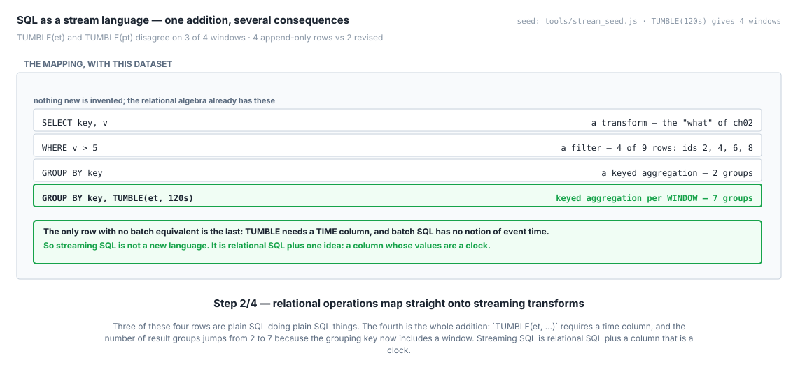

Three of these four rows are plain SQL doing plain SQL things. The fourth is the whole addition: `TUMBLE(et, ...)` requires a time column, and the number of result groups jumps from 2 to 7 because the grouping key now includes a window. Streaming SQL is relational SQL plus a column that is a clock.

</details>
<details>
<summary><b>Step 3 of 4</b> — and the time attribute is a CHOICE with different answers</summary>

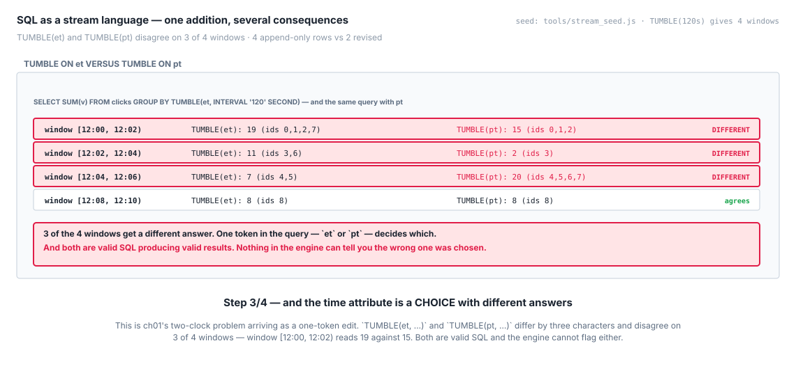

This is ch01's two-clock problem arriving as a one-token edit. `TUMBLE(et, ...)` and `TUMBLE(pt, ...)` differ by three characters and disagree on 3 of 4 windows — window [12:00, 12:02) reads 19 against 15. Both are valid SQL and the engine cannot flag either.

</details>
<details>
<summary><b>Step 4 of 4</b> — so some results append and others UPDATE</summary>

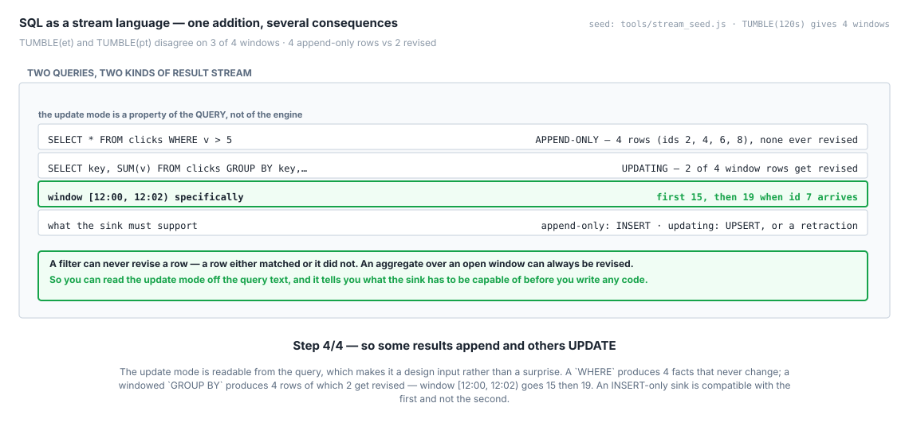

The update mode is readable from the query, which makes it a design input rather than a surprise. A `WHERE` produces 4 facts that never change; a windowed `GROUP BY` produces 4 rows of which 2 get revised — window [12:00, 12:02) goes 15 then 19. An INSERT-only sink is compatible with the first and not the second.

</details>

<sub>The clock comparison, the filter result and the revised-row count are computed from the seed and asserted. Generated by `node tools/gen_ch08.js`.</sub>

<!-- ch08-sql:end -->

<!-- ch08-sql-memory:begin — generated by tools/gen_ch08.js; do not hand-edit -->

#### One query, two clocks — stack and heap at every step

**What is being answered.** Why a streaming query's clock and its update mode are both properties of the query text — as two query functions over the same rows.

`runTumble(clock)` takes the clock as a **parameter**. There is no second code path for processing time: step 2 shows the same line producing bucket 0 or 240 for id 7 depending on one argument. In SQL that argument is three characters.

`sinkNeeds(r)` reads only `r.mode`, which `runFilter` and `runTumble` set from their own shape — so "does my sink need UPSERT?" is answerable from the query before anything runs.

The animation steps through the code, holding each line long enough to read the STACK (call frames and their locals) and the HEAP (allocated arrays and objects) as they are AT THAT MOMENT. Expand any step to study it on its own.



<details>
<summary><b>Step 1 of 4</b> — a filter produces facts, which nothing can revise</summary>


`e.v > FILTER_V` is decided from the row alone — no later row can change whether id 2 matched. That is why the mode is APPEND-ONLY, and it is readable from the query shape rather than measured: a `WHERE` has no state to revise.

</details>
<details>
<summary><b>Step 2 of 4</b> — the clock is a PARAMETER, not a second code path</summary>

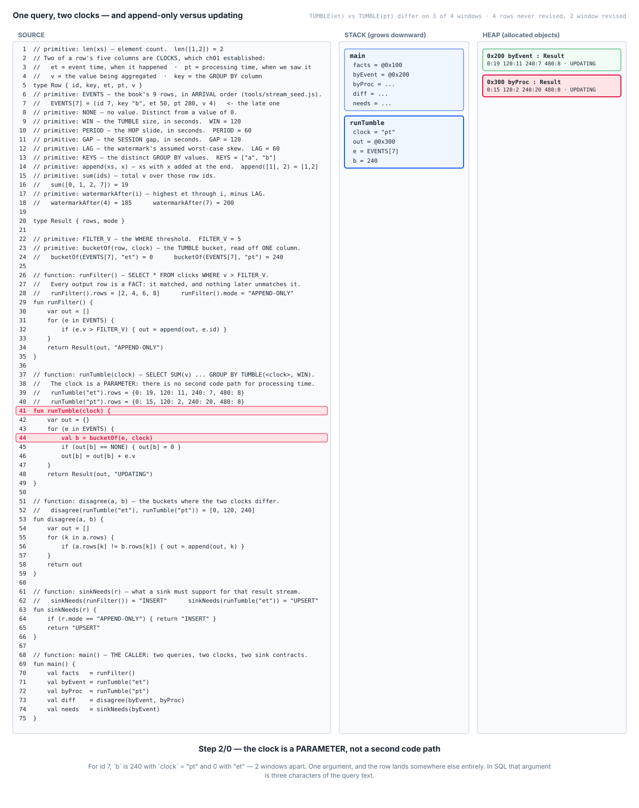

For id 7, `b` is 240 with `clock` = "pt" and 0 with "et" — 2 windows apart. One argument, and the row lands somewhere else entirely. In SQL that argument is three characters of the query text.

</details>
<details>
<summary><b>Step 3 of 4</b> — so 3 of the 4 buckets hold different sums</summary>

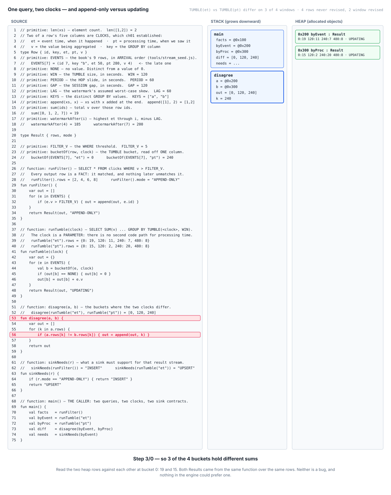

Read the two heap rows against each other at bucket 0: 19 and 15. Both Results came from the same function over the same rows. Neither is a bug, and nothing in the engine could prefer one.

</details>
<details>
<summary><b>Step 4 of 4</b> — and the mode decides what the sink must support</summary>

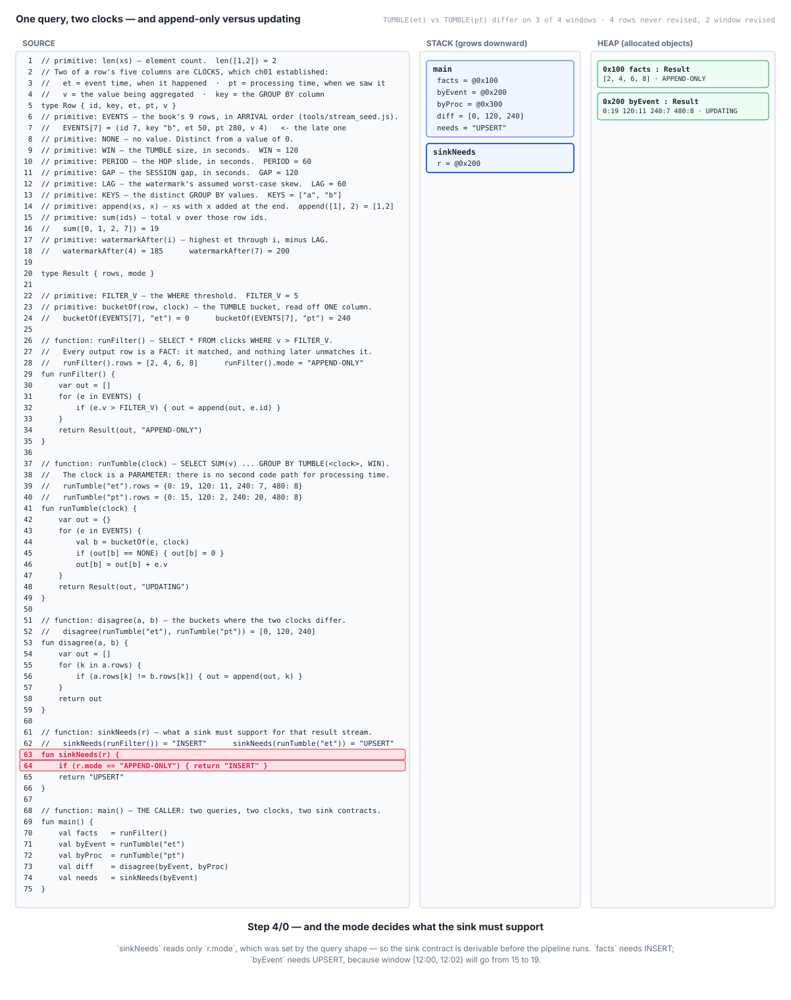

`sinkNeeds` reads only `r.mode`, which was set by the query shape — so the sink contract is derivable before the pipeline runs. `facts` needs INSERT; `byEvent` needs UPSERT, because window [12:00, 12:02) will go from 15 to 19.

</details>

<sub>Both clock results, the disagreement list and the filter output are computed from the seed and asserted. Generated by `node tools/gen_ch08.js` on `tools/memkit.js`.</sub>

<!-- ch08-sql-memory:end -->

### Windows in SQL

> **Why this matters:** The key adaptation of SQL to streams is explicit windowing — batch SQL groups whole tables, while streaming SQL must say over which time slice each aggregate is computed, so this section covers the window constructs.

1. **TUMBLE — fixed windows** — **TUMBLE(size)** is a fixed (tumbling) window: equal, non-overlapping spans. It is the SQL spelling of the fixed window from the Beam model.

2. **HOP — sliding windows** — **HOP(size, slide)** is a sliding window: fixed length, advancing by slide. It is the SQL spelling of the sliding window.

3. **SESSION — session windows** — **SESSION(gap)** is a session window: a burst of activity closed by a gap of inactivity. The query engine merges sessions as data arrives.

4. **The watermark drives emission** — A windowed aggregate emits when the **watermark passes the window end**. The time attribute (event time) plus the watermark is what makes SQL results correct under out-of-order data.

<!-- ch08-windows:begin — generated by tools/gen_ch08.js; do not hand-edit -->

#### Why the three window functions are three different cost profiles

**TUMBLE(size)** is the fixed window: equal, contiguous, non-overlapping. 4 output rows here (19, 11, 7, 8), every input row counted once, and the sums total 45 — the whole dataset. That reconciliation against a batch run is what makes it the easy case.

**HOP(slide, size)** is the sliding window: fixed length, advancing by `slide`. With 120s windows every 60s, 6 of the 9 input rows land in 2 output rows, so there are **7 rows totalling 78** against a dataset of 45. Output volume is size / slide = 2×, and a HOP total must never be compared to an input total.

**SESSION(gap)** is the data-driven window, and it is the one whose **row count cannot be predicted from the query**: key "a" gets 3 rows and key "b" gets 2 over the same time range, because that is how bursty each key's activity was. The engine also **merges** sessions as rows arrive, which means a window boundary can move after the fact — so a SESSION result is always an updating stream.

**And the watermark is what makes any of them correct.** The time attribute picks the bucket; the watermark picks the moment the bucket speaks. Window [12:00, 12:02) emits after event 4 holding 15, against a final 19.

Without a watermark a windowed query over an unbounded stream could never emit anything, because "this window is done" would never become true. And **1 of the 4 windows here is never emitted at all** — the SQL gives no hint of that, and the sink simply never sees the row.

#### When to use each window function, and how to capacity-plan them

**TUMBLE when the question names a period.** Plan for (keys × open windows) state and one output row per window. Totals reconcile, which makes it the only shape you can easily check against a batch job.

**HOP for a moving measure,** and budget 2× the rows and 2× the state up front. The failure here is not performance but interpretation: someone compares 78 to 45 and files a bug.

**SESSION when the boundary belongs to the data** — a visit, a trip, an engagement. Accept that you cannot capacity-plan it from the query, and that the result is necessarily updating because of merging.

**And in all three cases, find out what the engine's watermark settings are.** The window is in your SQL; the moment of emission is not, and 1 window here never emits because of it.

**What this does not settle:** joins. A windowed aggregate has one input, so the watermark story is simple. A join has two by construction, which makes ch03's minimum rule bite much harder — that is the next concept.

#### Visual walkthrough — three window functions, and when each row emits

The animation loops through all 4 steps. Expand any step to study it on its own.



<details>
<summary><b>Step 1 of 4</b> — TUMBLE — equal, non-overlapping, one row each</summary>


TUMBLE is the default to reach for and the easy one to reason about: 4 output rows, each input row counted once, totals summing to 45. If a question names a period, this is the window, and the result reconciles against a batch run.

</details>
<details>
<summary><b>Step 2 of 4</b> — HOP — overlapping, so a row appears several times</summary>

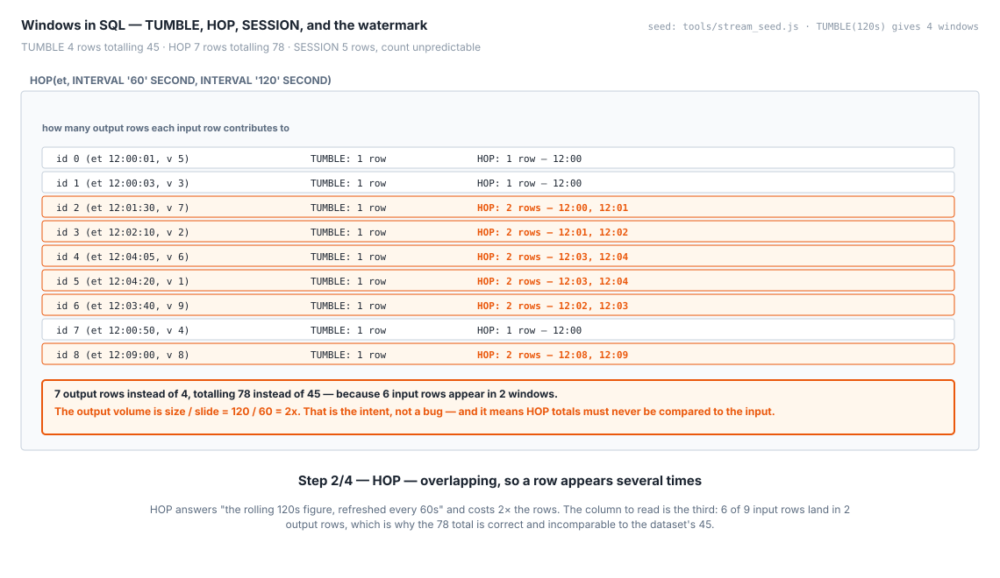

HOP answers "the rolling 120s figure, refreshed every 60s" and costs 2× the rows. The column to read is the third: 6 of 9 input rows land in 2 output rows, which is why the 78 total is correct and incomparable to the dataset's 45.

</details>
<details>
<summary><b>Step 3 of 4</b> — SESSION — the engine merges windows as rows arrive</summary>

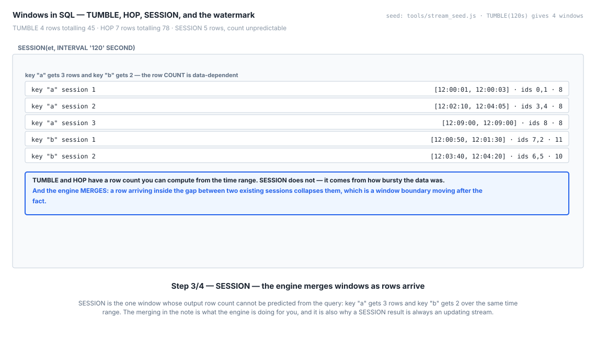

SESSION is the one window whose output row count cannot be predicted from the query: key "a" gets 3 rows and key "b" gets 2 over the same time range. The merging in the note is what the engine is doing for you, and it is also why a SESSION result is always an updating stream.

</details>
<details>
<summary><b>Step 4 of 4</b> — and the watermark is what makes any of them correct</summary>

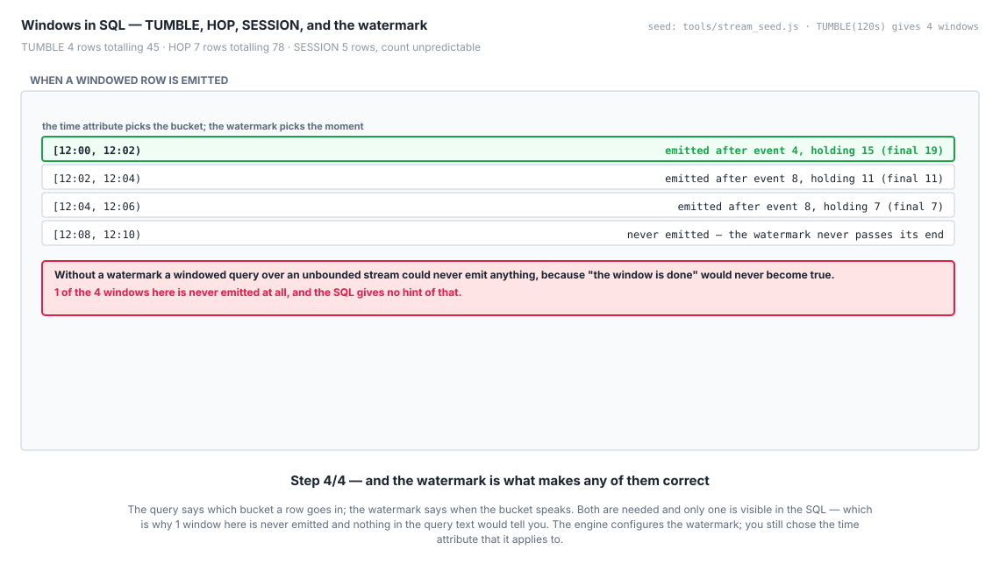

The query says which bucket a row goes in; the watermark says when the bucket speaks. Both are needed and only one is visible in the SQL — which is why 1 window here is never emitted and nothing in the query text would tell you. The engine configures the watermark; you still chose the time attribute that it applies to.

</details>

<sub>Every window membership, the HOP total and the never-emitted window are computed from the seed and asserted. Generated by `node tools/gen_ch08.js`.</sub>

<!-- ch08-windows:end -->

<!-- ch08-windows-memory:begin — generated by tools/gen_ch08.js; do not hand-edit -->

#### TUMBLE, HOP and SESSION — stack and heap at every step

**What is being answered.** Why the three SQL window functions have three different cost profiles — as one `assign` function whose return shape differs.

`assign(shape, row)` returns one bucket for TUMBLE, a **list** for HOP, and **NONE** for SESSION. Those three return shapes are the whole story: the list is why HOP totals 78 against 45, and the NONE is why SESSION needs its own pass and cannot be capacity-planned.

Step 4 is the gap a SQL reader would not see: `emitsAt` returns NONE for bucket 480, which holds 8 and is never delivered to the sink.

The animation steps through the code, holding each line long enough to read the STACK (call frames and their locals) and the HEAP (allocated arrays and objects) as they are AT THAT MOMENT. Expand any step to study it on its own.



<details>
<summary><b>Step 1 of 4</b> — TUMBLE returns one bucket; HOP returns a list</summary>


`hopOf(245)` returns [180, 240] — 2 buckets for one row — so the inner loop of `rowCount` runs twice and adds `e.v` twice. That is the entire reason the HOP total reaches 78 against the dataset's 45.

</details>
<details>
<summary><b>Step 2 of 4</b> — so one shape partitions the data and the other does not</summary>

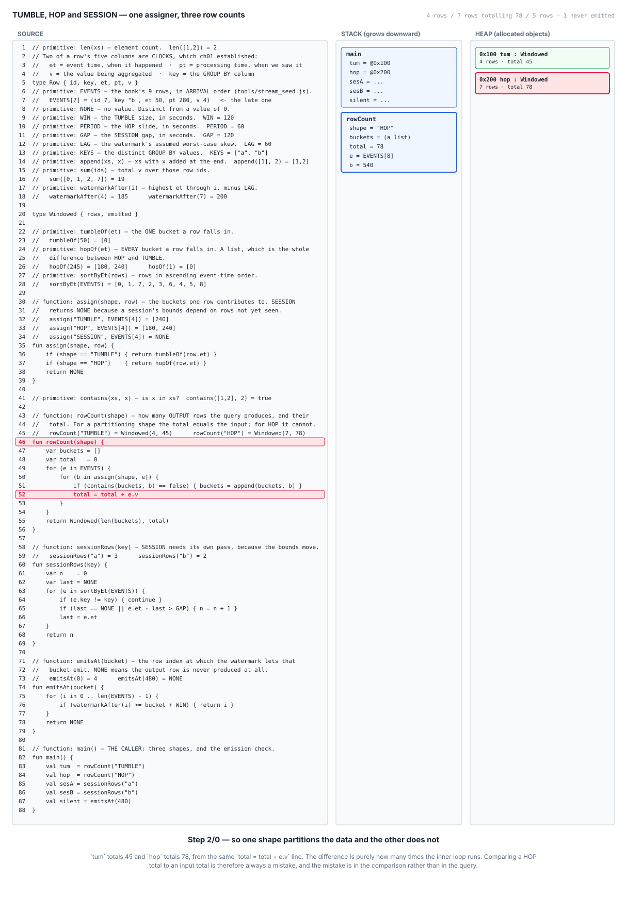

`tum` totals 45 and `hop` totals 78, from the same `total = total + e.v` line. The difference is purely how many times the inner loop runs. Comparing a HOP total to an input total is therefore always a mistake, and the mistake is in the comparison rather than in the query.

</details>
<details>
<summary><b>Step 3 of 4</b> — SESSION needs its own pass, and its row count is data-dependent</summary>

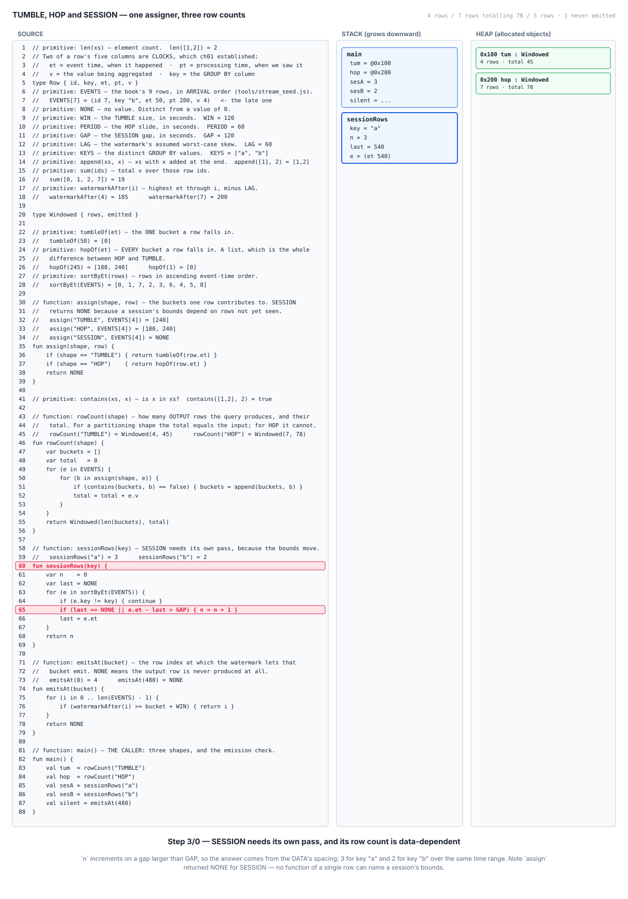

`n` increments on a gap larger than GAP, so the answer comes from the DATA's spacing: 3 for key "a" and 2 for key "b" over the same time range. Note `assign` returned NONE for SESSION — no function of a single row can name a session's bounds.

</details>
<details>
<summary><b>Step 4 of 4</b> — and one output row is never produced at all</summary>

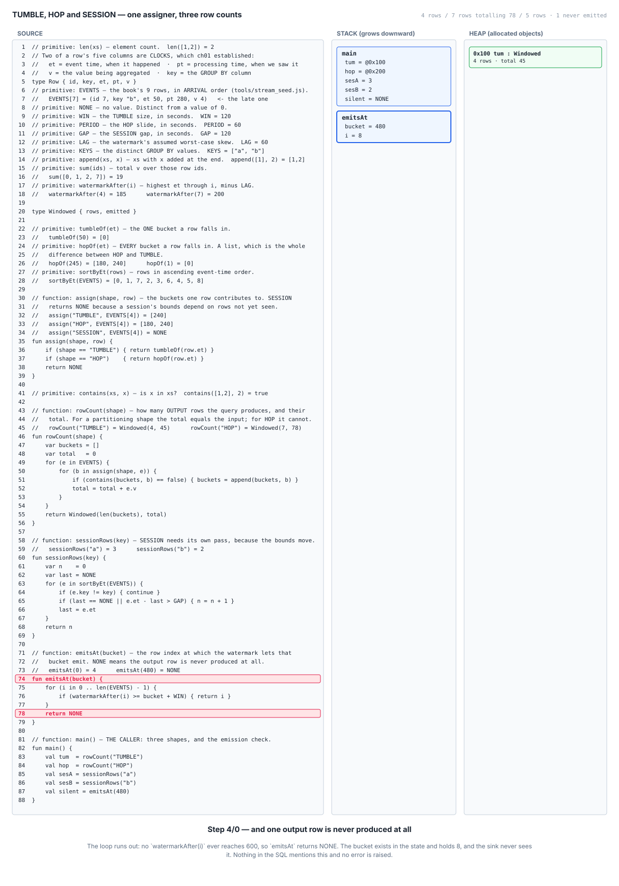

The loop runs out: no `watermarkAfter(i)` ever reaches 600, so `emitsAt` returns NONE. The bucket exists in the state and holds 8, and the sink never sees it. Nothing in the SQL mentions this and no error is raised.

</details>

<sub>All three row counts, the HOP total and the never-emitted bucket are computed from the seed and asserted. Generated by `node tools/gen_ch08.js` on `tools/memkit.js`.</sub>

<!-- ch08-windows-memory:end -->

### Joins and time in SQL

> **Why this matters:** Joins are where streaming SQL gets subtle — two streams never align in time the way two batch tables do — so this section covers windowed joins and the time semantics that make them correct.

1. **Stream-stream joins need windows** — Joining two unbounded streams requires a **windowed join** — match rows whose time attributes are within a window of each other — otherwise the join has no boundary.

2. **The watermark bounds the join** — A windowed join emits when **both sides' watermarks pass the join window**, so a row is not emitted until both streams are complete for that window.

3. **Time attributes pick event or processing time** — Queries declare whether windows use **event time** (correct, can be late) or **processing time** (simple, no late data). Event time is the right default for correctness.

4. **SQL hides the mechanics, not the semantics** — Streaming SQL still obeys the Beam model underneath — **the watermark, triggers, and accumulation are configured by the engine**, but the user still chooses the window and time attribute.

<!-- ch08-joins:begin — generated by tools/gen_ch08.js; do not hand-edit -->

#### Why a join is where the time decisions cost the most

**Joining two unbounded streams needs a time bound, or the query has no meaning.** A batch join completes when both tables are read — here 5 × 4 candidate pairs, then done. A stream-stream join never completes on its own: either side may still produce a match.

So SQL **requires** a window on such a join, and the bound does two jobs at once — it ends the wait, and it bounds the buffered state. Without it the engine would have to keep every row of both sides forever in case a match arrives.

**The watermark decides when a result may be emitted**, and it is ch03's minimum rule applied to two inputs. Side "a" reaches 12:08:00 and side "b" reaches 12:03:20, so the join claims the **minimum**, 12:03:20.

A join is where that rule hurts most, because it has two inputs by construction: one slow or idle side holds back every result, however fast the other is.

**And the clock choice costs more here than in an aggregate.** In a windowed sum the wrong clock puts a value in the wrong bucket — a wrong number in a known place. In a join it **pairs the wrong two rows**, emitting an assertion that two things coincided when they did not. For id 7, which happened at 12:00:50 and arrived at 12:04:40, a processing-time join would pair it with rows from 12:04:40 — 230s away from when it actually happened — and the resulting row looks entirely plausible.

**So SQL hides the mechanics, not the semantics.** The engine configures triggers, accumulation, retraction emission and state layout. You still choose the window and the time attribute, and those two decide whether a window holds 19 or 15, and whether 1 window ever emits.

#### When to join streams, when to join against a table, and what to review first

**Window the join when both inputs are genuinely streams** and a match means "these happened close together". The window width is a domain statement — how close counts as together — not a tuning knob.

**Do not window a join against a slowly-changing table.** That is a lookup, bounded by the table rather than by time, and forcing a window onto it is the common streaming-join bug. ch09 takes this apart properly.

**Default to event time, and expect lateness handling.** A join on event time is the only one whose pairings mean what they say, and the price is that a late row can change a result already emitted.

**In review, read the window and the time attribute before anything else.** They carry more meaning per character than the rest of the statement, and both are easy to get wrong without producing an error.

**What this does not settle:** what the join actually buffers, how much of it, and what happens when a late row changes a match that was already emitted. Those are ch09's subject, and the answers are less comfortable than the SQL suggests.

#### Visual walkthrough — the bound, the minimum, the clock, and the division of labour

The animation loops through all 4 steps. Expand any step to study it on its own.



<details>
<summary><b>Step 1 of 4</b> — joining two streams needs a time bound, or it never ends</summary>


Worth stating plainly because it is the one place streaming SQL refuses something batch SQL allows: a join of two unbounded streams has no meaning without a time bound, because no row is ever the last candidate. The bound ends the wait and bounds the buffer at the same time, which is why it is mandatory rather than advisory.

</details>
<details>
<summary><b>Step 2 of 4</b> — the watermark decides when a join result may be emitted</summary>

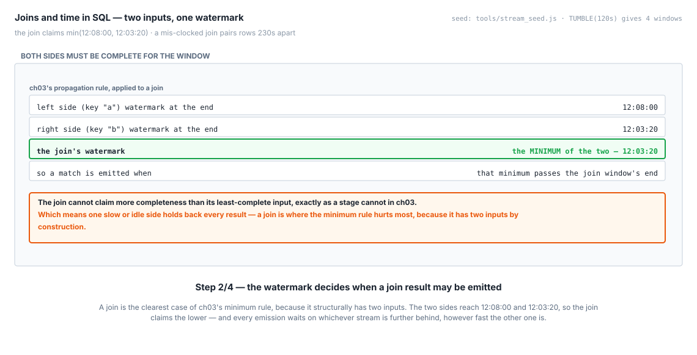

A join is the clearest case of ch03's minimum rule, because it structurally has two inputs. The two sides reach 12:08:00 and 12:03:20, so the join claims the lower — and every emission waits on whichever stream is further behind, however fast the other one is.

</details>
<details>
<summary><b>Step 3 of 4</b> — the time attribute is the same choice, with the same cost</summary>

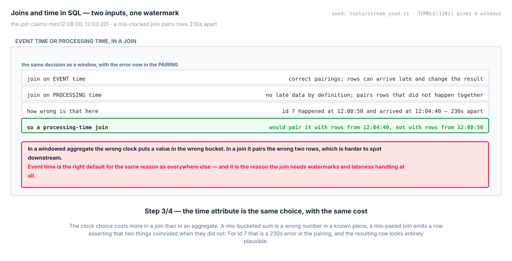

The clock choice costs more in a join than in an aggregate. A mis-bucketed sum is a wrong number in a known place; a mis-paired join emits a row asserting that two things coincided when they did not. For id 7 that is a 230s error in the pairing, and the resulting row looks entirely plausible.

</details>
<details>
<summary><b>Step 4 of 4</b> — so SQL hides the mechanics and not the semantics</summary>

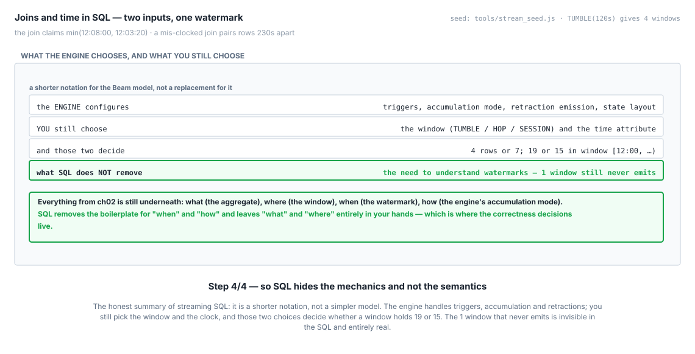

The honest summary of streaming SQL: it is a shorter notation, not a simpler model. The engine handles triggers, accumulation and retractions; you still pick the window and the clock, and those two choices decide whether a window holds 19 or 15. The 1 window that never emits is invisible in the SQL and entirely real.

</details>

<sub>Both side watermarks, their minimum and the skew figure are computed from the seed and asserted. Generated by `node tools/gen_ch08.js`.</sub>

<!-- ch08-joins:end -->

<!-- ch08-joins-memory:begin — generated by tools/gen_ch08.js; do not hand-edit -->

#### A join has two inputs, so it claims the minimum

**What is being answered.** Why a join is where the time decisions cost most — as the minimum rule and the pairing rule, side by side.

`joinWatermark(i)` has the line that matters: `if (w == NONE) { return NONE }`. A side that has produced nothing blocks the claim entirely, and a join has two sides by construction — so either one going quiet stops every result.

`matches(clock)` then shows the sharper cost. A mis-clocked aggregate puts a number in the wrong bucket; a mis-clocked join **pairs the wrong rows**, emitting an assertion that two things coincided. Step 4 compares the two pair sets from identical data.

The animation steps through the code, holding each line long enough to read the STACK (call frames and their locals) and the HEAP (allocated arrays and objects) as they are AT THAT MOMENT. Expand any step to study it on its own.



<details>
<summary><b>Step 1 of 4</b> — a side that has produced nothing blocks the claim</summary>


At row 0 only side "a" has produced anything, so `sideWatermark("b", 0)` is NONE and the join makes NO claim at all. A join is the case where this bites hardest: it has two inputs by construction, so either one being silent stops every result.

</details>
<details>
<summary><b>Step 2 of 4</b> — and the claim is the lower of the two, never the higher</summary>

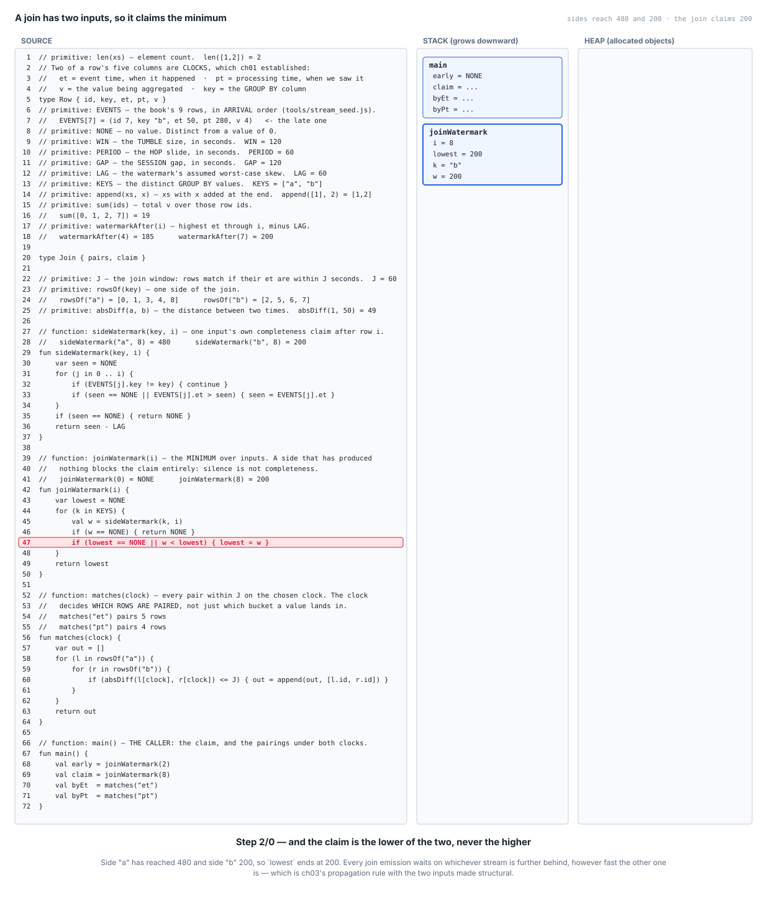

Side "a" has reached 480 and side "b" 200, so `lowest` ends at 200. Every join emission waits on whichever stream is further behind, however fast the other one is — which is ch03's propagation rule with the two inputs made structural.

</details>
<details>
<summary><b>Step 3 of 4</b> — the clock decides WHICH ROWS ARE PAIRED</summary>

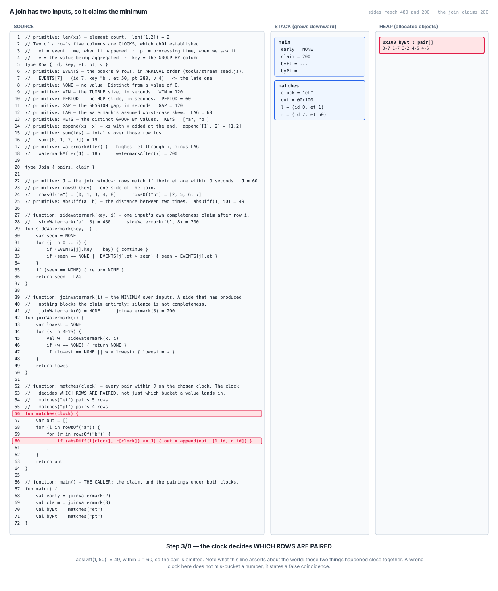

`absDiff(1, 50)` = 49, within J = 60, so the pair is emitted. Note what this line asserts about the world: these two things happened close together. A wrong clock here does not mis-bucket a number, it states a false coincidence.

</details>
<details>
<summary><b>Step 4 of 4</b> — so the same join on pt pairs a different set of rows</summary>

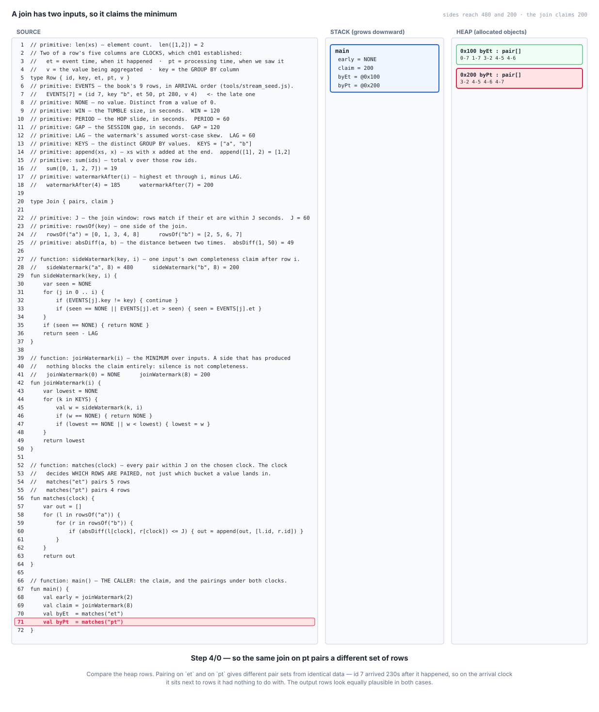

Compare the heap rows. Pairing on `et` and on `pt` gives different pair sets from identical data — id 7 arrived 230s after it happened, so on the arrival clock it sits next to rows it had nothing to do with. The output rows look equally plausible in both cases.

</details>

<sub>Both side watermarks, their minimum and both pair sets are computed from the seed and asserted. Generated by `node tools/gen_ch08.js` on `tools/memkit.js`.</sub>

<!-- ch08-joins-memory:end -->


## Links & The Bigger Picture

Concepts this chapter mentions but does not fully unpack are linked below — each pointer names the chapter where the concept is covered in depth and gives a concrete example that ties the two chapters together.

- **[Chapter 2: The What, Where, When, and How of Data Processing → What and Where — transformations and windowing](ch02-the-what-where-when-and-how-of-data-processing.md#what-and-where--transformations-and-windowing)** — streaming SQL is a declarative spelling of the what/where/when/how model — SELECT/WHERE/GROUP BY (what), TUMBLE/HOP/SESSION (where), watermark + trigger (when), retraction (how).
  - _Example:_ ch08's GROUP BY TUMBLE is ch02's "what + where"; ch08's retraction of (C1, 3) before (C1, 4) is ch02's accumulating-and-retracting mode.
- **[Chapter 3: Watermarks → Propagation and correctness](ch03-watermarks.md#propagation-and-correctness)** — the watermark that drives SQL emission is the same completeness signal ch03 defines — and it propagates as the minimum across a query's inputs.
  - _Example:_ ch08's TUMBLE window emits when the watermark passes 12:05:00; ch03 shows that watermark = max_seen 12:08:30 − skew 120 s = 12:06:30, or min(12:06:00, 12:04:30) = 12:04:30 for a join.
- **[Chapter 4: Advanced Windowing → Window shapes — fixed, sliding, session](ch04-advanced-windowing.md#window-shapes--fixed-sliding-session)** — TUMBLE/HOP/SESSION are the SQL spellings of ch04's fixed/sliding/session windows, including session merging.
  - _Example:_ ch08's HOP(10 min, 2 min) putting one click into 3 rows is ch04's sliding window [12:00,12:10) + [12:02,12:12) + [12:04,12:14); ch08's SESSION is ch04's gap-based merge.
- **[Chapter 6: Streams and Tables → The duality](ch06-streams-and-tables.md#the-duality)** — append-only vs updating results is the stream/table duality in SQL — an updating query emits a changelog, an append-only query emits a stream of facts.
  - _Example:_ ch08's "updating result retracts (C1, 3) then adds (C1, 4)" is ch06's changelog (old, new) pair; ch08's append-only mode is ch06's plain stream.
- **[Chapter 9: Streaming Joins → Windowed and temporal joins](ch09-streaming-joins.md#windowed-and-temporal-joins)** — SQL joins are where windowing, watermarks, and the stream/table duality meet — ch09 covers windowed (interval) and temporal joins in depth.
  - _Example:_ ch08's "match clicks and impressions within 5 min" is ch09's windowed join; ch08's "join emits when both watermarks pass" is ch09's hold-until-both-sides-pass rule.

## System Design Interview

> **The question:** Design a continuous SQL query that keeps a campaign click count current. Premise: the query buckets clicks into a TUMBLE window and updates the result only when the watermark closes the window, so the count stays correct as late clicks arrive.

**The pipeline:** streams (clicks, impressions) -> SQL engine (continuous query) -> watermark + window -> updating result -> sink

<a href="../diagrams/d2/decomp/ch08-0.png"></a>

### streams (clicks, impressions)

_Role: streams — feed the SQL engine with event-time data_

- a click {campaign: "C1", event_time: "12:03:00"} arrives
- an impression {campaign: "C1", event_time: "12:02:00"} arrives
- both carry event time for the query's time attribute

### SQL engine (continuous query)

_Role: SQL engine — runs the query forever_

- the query groups by TUMBLE(event_time, 5 min) and campaign
- the engine folds each row into the right window
- updating results emit retractions for changed keys

### watermark + window

_Role: watermark + window — decides when results emit_

- the watermark at 12:06:30 closes the [12:00, 12:05) window
- a HOP window would emit the same event into multiple spans
- a join waits for both sides' watermarks

### sink

_Role: sink — applies the updating result_

- the sink receives (C1, 3) retracted then (C1, 4) added
- append-only sinks are simpler but wrong for updating results
- an upsert sink applies retractions correctly


<!-- ch08-system:begin — generated by tools/gen_ch08.js; do not hand-edit -->

#### Why the sink requirement is readable from the query, and the timing is not

**The question.** A continuous SQL query that keeps a campaign click count current: it buckets clicks into a TUMBLE window and updates the result when the watermark closes the window, so the count stays correct as late clicks arrive.

**The pipeline:** streams → SQL engine (continuous query) → watermark + window → updating result → sink.

**The query:** `SELECT key, SUM(v) FROM clicks GROUP BY key, TUMBLE(et, INTERVAL '120' SECOND)`

**One thing is decidable from that text alone:** a windowed `GROUP BY` produces an **updating** stream, so the sink must UPSERT or accept retractions. 2 of the 4 window rows is revised here. Had the query been a `WHERE`, an append-only sink would have been fine — and knowing which before building anything is the practical value of the distinction.

**And one thing is not.** Follow window [12:00, 12:02)\: it finally holds 19 from ids 0, 1, 2, 7. The watermark passes 12:02 after event 4, at 12:04:06, and the engine emits **15**. Then id 7 arrives at 12:04:40 and the row is updated to **19**.

None of 15, 19 or 12:04:06 appears anywhere in the SQL. All three come from the watermark the engine maintains. **The query got shorter; the semantics did not get simpler.**

**Two choices remain yours, and they are a few characters each:** `TUMBLE(et, 120s)` gives 4 rows (19, 11, 7, 8); `TUMBLE(pt, 120s)` gives 4 rows differing on 3 of them; `HOP` gives 7 rows totalling 78; `SESSION` gives 5 rows with an unpredictable count.

#### When this design is right, and the four things it does not settle

**It is right when the sink can UPSERT by (key, window).** That is the one hard requirement, and it is known from the query shape rather than discovered in testing.

**Use the SQL form rather than a hand-written pipeline for this kind of query.** Four window shapes, two clocks and the whole trigger/accumulation apparatus are available in a statement you can review in one screen — which is a real advantage, as long as the review reads the window and the clock first.

**Find out the engine's allowed-lateness setting before trusting the "stays correct" claim.** Whether id 7 is admitted at all is configuration the SQL does not mention.

**What this query does NOT settle — four gaps:**

1. **1 of the 4 windows is never emitted**, because the watermark never passes its end. There is no error and no row — the sink simply never hears about it, and nothing in the SQL hints at it.
2. **The engine chooses the accumulation mode.** If it accumulates and the sink sums rather than upserts, the window reads 34 instead of 19. That mismatch is outside the query entirely, which is exactly where it is hardest to notice.
3. **Allowed lateness is an engine setting, not syntax.** The "stays correct as late clicks arrive" premise depends on a number the query does not contain.
4. **SESSION's row count is data-dependent** (5 here), so a query that looks like the others cannot be capacity-planned like them.

#### Visual walkthrough — five stages, one changing row, two token choices

The animation loops through all 4 steps. Expand any step to study it on its own.



<details>
<summary><b>Step 1 of 4</b> — the pipeline, and the one line of SQL it runs</summary>


The useful property of a SQL-first design is that the sink requirement falls out of the query text. A windowed `GROUP BY` is an updating stream — 2 of 4 window rows is revised here — so the sink must UPSERT. Had the query been a `WHERE`, an append-only sink would have been fine, and that is decidable before anything is built.

</details>
<details>
<summary><b>Step 2 of 4</b> — the result row, as it actually changes</summary>

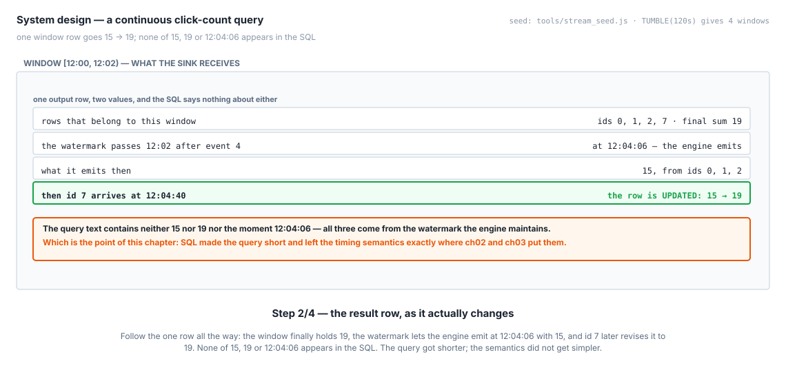

Follow the one row all the way: the window finally holds 19, the watermark lets the engine emit at 12:04:06 with 15, and id 7 later revises it to 19. None of 15, 19 or 12:04:06 appears in the SQL. The query got shorter; the semantics did not get simpler.

</details>
<details>
<summary><b>Step 3 of 4</b> — the two choices that are still yours</summary>

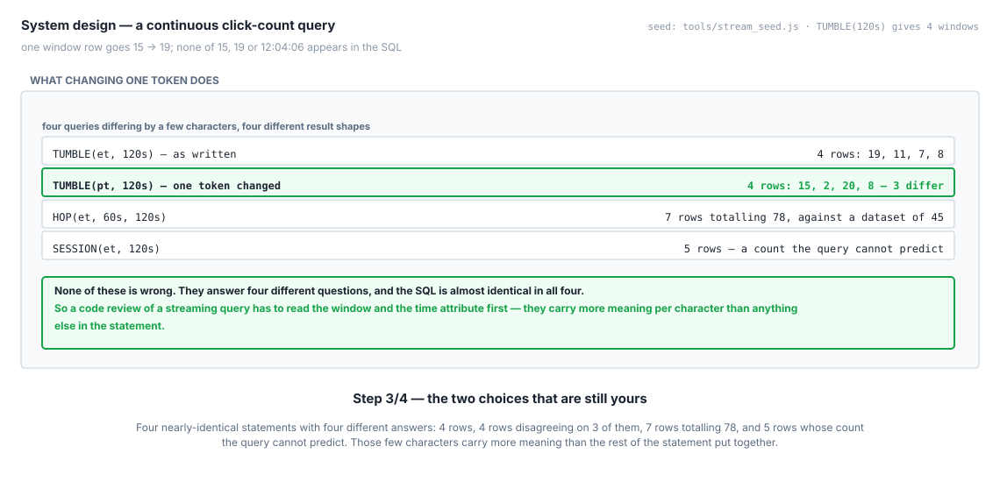

Four nearly-identical statements with four different answers: 4 rows, 4 rows disagreeing on 3 of them, 7 rows totalling 78, and 5 rows whose count the query cannot predict. Those few characters carry more meaning than the rest of the statement put together.

</details>
<details>
<summary><b>Step 4 of 4</b> — and what this query does NOT settle</summary>

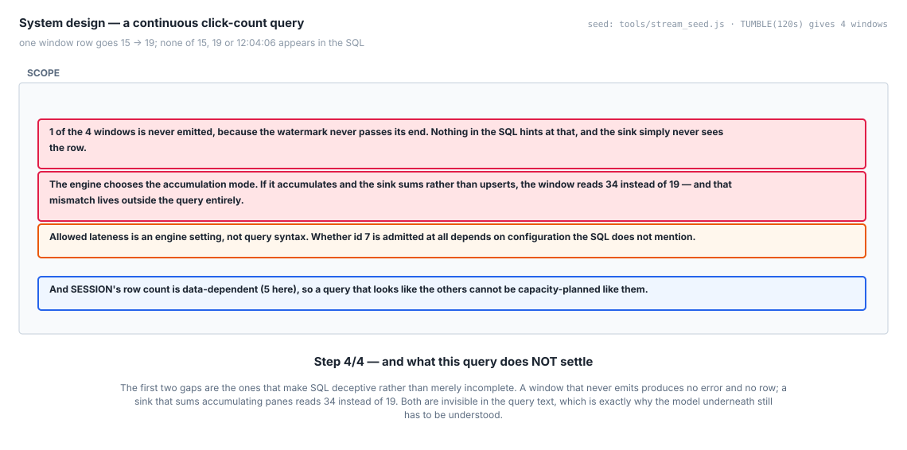

The first two gaps are the ones that make SQL deceptive rather than merely incomplete. A window that never emits produces no error and no row; a sink that sums accumulating panes reads 34 instead of 19. Both are invisible in the query text, which is exactly why the model underneath still has to be understood.

</details>

<sub>The emission moment, both row values and all four window variants are computed from the seed and asserted. Generated by `node tools/gen_ch08.js`.</sub>

<!-- ch08-system:end -->

<!-- ch08-system-memory:begin — generated by tools/gen_ch08.js; do not hand-edit -->

#### The continuous query — stack and heap at every step

**What is being answered.** What a continuous query actually does to its sink, and why the sink contract is readable from the query.

Two lines carry the whole chapter. `if (bucketOf(EVENTS[i]) != W0) { continue }` is all of `TUMBLE(et, 120s)` — it reads `et` and never asks the time. `if (watermarkAfter(i) < W0 + WIN && fired == false) { continue }` is the emission moment, and neither 15 nor 12:04:06 appears in the SQL.

Step 4 prices the sink mismatch: the same two emissions give 19 into an UPSERT sink and 34 into an INSERT-only one. Every component is behaving correctly.

The animation steps through the code, holding each line long enough to read the STACK (call frames and their locals) and the HEAP (allocated arrays and objects) as they are AT THAT MOMENT. Expand any step to study it on its own.



<details>
<summary><b>Step 1 of 4</b> — the bucket is read off the et column, and nothing else</summary>


`bucketOf(EVENTS[3])` is 120, which is not W0 = 0, so row 3 is skipped. That one line is the whole of `TUMBLE(et, 120s)` — it reads `et` and never asks what time it is now.

</details>
<details>
<summary><b>Step 2 of 4</b> — the watermark decides the moment, and the engine emits</summary>

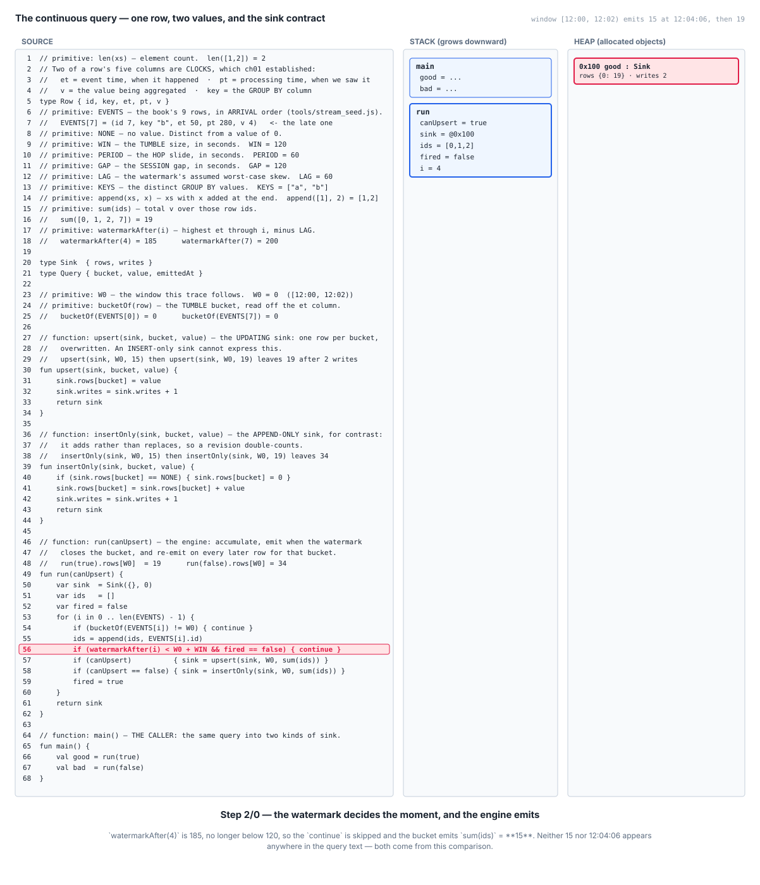

`watermarkAfter(4)` is 185, no longer below 120, so the `continue` is skipped and the bucket emits `sum(ids)` = **15**. Neither 15 nor 12:04:06 appears anywhere in the query text — both come from this comparison.

</details>
<details>
<summary><b>Step 3 of 4</b> — id 7 arrives and the SAME row is written again</summary>

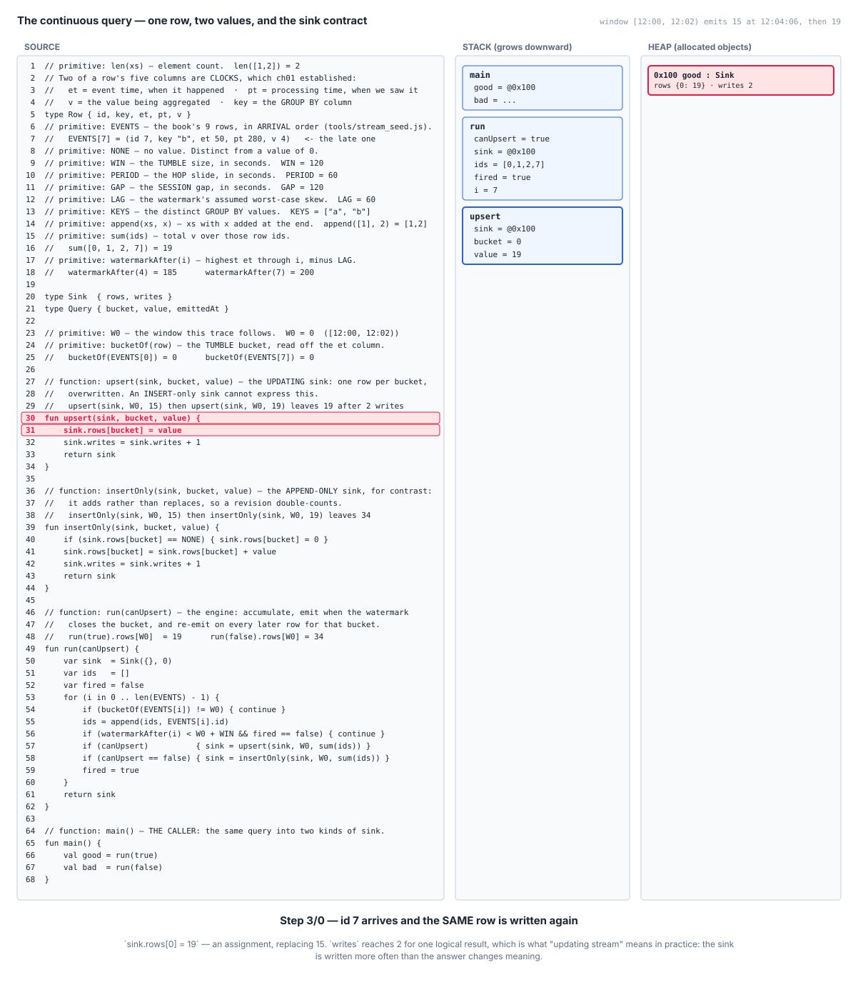

`sink.rows[0] = 19` — an assignment, replacing 15. `writes` reaches 2 for one logical result, which is what "updating stream" means in practice: the sink is written more often than the answer changes meaning.

</details>
<details>
<summary><b>Step 4 of 4</b> — and an INSERT-only sink reads the two writes as two facts</summary>

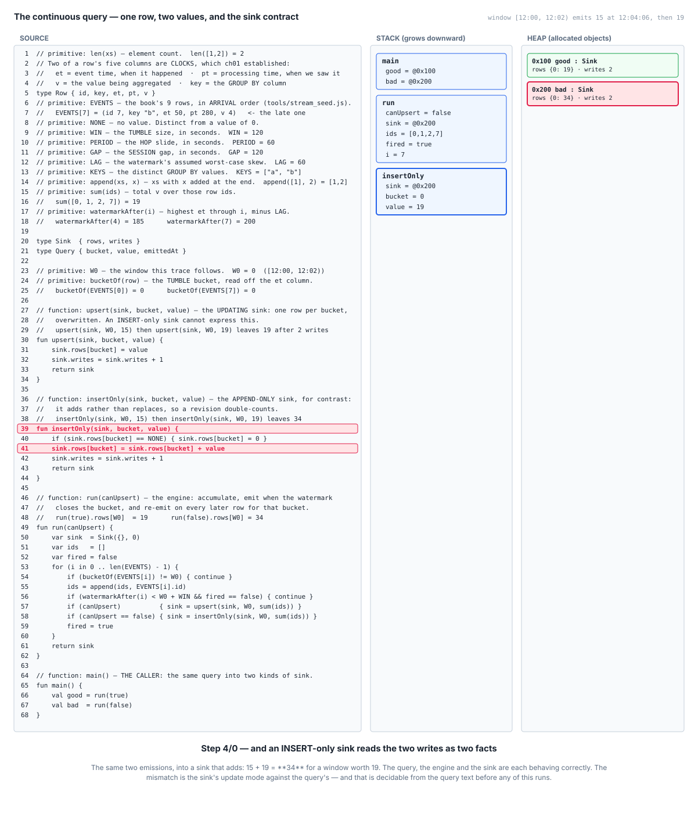

The same two emissions, into a sink that adds: 15 + 19 = **34** for a window worth 19. The query, the engine and the sink are each behaving correctly. The mismatch is the sink's update mode against the query's — and that is decidable from the query text before any of this runs.

</details>

<sub>The emission moment and both sink totals are computed from the seed and asserted. Generated by `node tools/gen_ch08.js` on `tools/memkit.js`.</sub>

<!-- ch08-system-memory:end -->

## Interview Questions

### Q1

A team wants analysts to write ad-click aggregations in SQL over a live stream, but the results must be correct under out-of-order events.

**Interviewer's question:** How do you expose a streaming pipeline as SQL with correct event-time semantics?

**Solution:** Use a streaming SQL engine with an event-time attribute; declare TUMBLE/HOP/SESSION windows and let the watermark drive when each window's result emits.

**System-design components:**
- Streaming SQL engine — Flink SQL
- Time attribute — event time
- Window — TUMBLE/HOP/SESSION
- Watermark — drives emission

```java
SELECT window_start, campaign, COUNT(*)
FROM clicks
GROUP BY TUMBLE(event_time, INTERVAL '5' MINUTE), campaign
-- emits when the watermark passes each 5-min window end
```

_This is exactly the streaming-SQL window material in this chapter._

_Covers:_ 3. Time attributes · 4. TUMBLE, HOP, SESSION · 7. The watermark drives SQL emission

_From the 28 problems:_ 21-ad-click-aggregation · 20-metrics-monitoring

### Q2

A SQL query joins clicks with impressions, but it emits matches before a late impression could still arrive, producing incomplete rows.

**Interviewer's question:** How do you make a stream-stream SQL join correct under out-of-order data?

**Solution:** Use a windowed (interval) join and let the watermark bound it — the join emits a match only when both sides' watermarks pass the join window.

**System-design components:**
- Windowed join — interval bound
- Watermark — both sides pass
- Hold — buffer until complete

```java
SELECT ...
FROM clicks c JOIN impressions i
  ON c.campaign = i.campaign
  AND i.event_time BETWEEN c.event_time - INTERVAL '5' MINUTE
                      AND c.event_time + INTERVAL '5' MINUTE
-- emits when both watermarks pass the window
```

_This is exactly the windowed-join material in this chapter._

_Covers:_ 6. Windowed joins · 7. The watermark drives SQL emission

_From the 28 problems:_ 21-ad-click-aggregation

## Key Concepts

### The Problem

**1. Stream processing is too low-level.** Streaming SQL gives stream processing a declarative face that maps relational operations onto streams.


### The Solution

A continuous query emits updated results as data arrives, rather than reading a finite table once.

```java
SELECT window_start, campaign, COUNT(*)
FROM clicks
GROUP BY TUMBLE(event_time, INTERVAL '5' MINUTE), campaign
-- emits when the watermark passes each 5-min window end
```


### Key Facts

| Fact | Detail | In the wild |
|---|---|---|
| 2. Continuous queries | A continuous query emits updated results as data arrives, rather than reading a finite table once. | A materialized view over a Kafka topic is a continuous query. |
| 3. Time attributes | A time attribute is an event-time or processing-time column that windows and joins key on. | Flink SQL's event-time attribute drives watermark-based windows. |
| 4. TUMBLE, HOP, SESSION | TUMBLE is fixed, HOP is sliding, SESSION is gap-based — the three window shapes as SQL constructs. | Flink SQL and Beam SQL both support these. |
| 5. Append-only vs updating results | Append-only results add new facts; updating results replace a key's value and need retractions. | Flink SQL emits retract streams for updating queries. |
| 6. Windowed joins | A windowed join matches rows whose time attributes fall within a window of each other. | Flink SQL interval joins are the production form. |
| 7. The watermark drives SQL emission | A windowed aggregate emits when the watermark passes the window end; a join emits when both sides' watermarks pass. | Flink SQL uses the watermark to fire windows. |
| 8. Event time vs processing time | Event time is correct but can be late; processing time is simple but wrong for out-of-order data. | Production SQL pipelines default to event time. |


### Tradeoffs & When

- A windowed aggregate emits when the watermark passes the window end; a join emits when both sides' watermarks pass.
- Event time is correct but can be late; processing time is simple but wrong for out-of-order data.


### Real-World Examples

- **Flink SQL** — TUMBLE/HOP/SESSION, event-time attributes, interval joins, and retract streams
- **ksqlDB** — Continuous SQL over Kafka streams and tables
- **Beam SQL** — Declarative queries over Beam pipelines


<details><summary>All concepts (index)</summary>

### Why: 1. Stream processing is too low-level

**Why.** Hand-written transforms and windows are verbose and error-prone; SQL expresses the same logic declaratively.

**Claim.** Streaming SQL gives stream processing a declarative face that maps relational operations onto streams.

**Grounding.** The book presents SQL as a first-class stream-processing surface.

**In the wild.** Flink SQL, Beam SQL, and ksqlDB are production streaming-SQL engines.

<a href="../diagrams/d2/card/ch08-0.png"></a>
### Query: 2. Continuous queries

**Why.** A stream never ends, so a query over it must run forever, not once.

**Claim.** A continuous query emits updated results as data arrives, rather than reading a finite table once.

**Grounding.** This is what distinguishes streaming SQL from batch SQL.

**In the wild.** A materialized view over a Kafka topic is a continuous query.

<a href="../diagrams/d2/card/ch08-1.png"></a>
### Time: 3. Time attributes

**Why.** Windows and joins need to know which time to use — when the event happened or when it was processed.

**Claim.** A time attribute is an event-time or processing-time column that windows and joins key on.

**Grounding.** Batch SQL has no event time; streaming SQL does.

**In the wild.** Flink SQL's event-time attribute drives watermark-based windows.

<a href="../diagrams/d2/card/ch08-2.png"></a>
### Window: 4. TUMBLE, HOP, SESSION

**Why.** Aggregates over a stream need an explicit time slice, spelled out in SQL.

**Claim.** TUMBLE is fixed, HOP is sliding, SESSION is gap-based — the three window shapes as SQL constructs.

**Grounding.** They are the SQL spellings of the Beam window shapes.

**In the wild.** Flink SQL and Beam SQL both support these.

<a href="../diagrams/d2/card/ch08-3.png"></a>
### Mode: 5. Append-only vs updating results

**Why.** Some results only add rows; others change existing rows, which sinks must handle differently.

**Claim.** Append-only results add new facts; updating results replace a key's value and need retractions.

**Grounding.** A COUNT GROUP BY is updating — the old count row must be retracted.

**In the wild.** Flink SQL emits retract streams for updating queries.

<a href="../diagrams/d2/card/ch08-4.png"></a>
### Join: 6. Windowed joins

**Why.** Two unbounded streams have no natural join boundary, so time must supply one.

**Claim.** A windowed join matches rows whose time attributes fall within a window of each other.

**Grounding.** The window is what bounds an otherwise infinite join.

**In the wild.** Flink SQL interval joins are the production form.

<a href="../diagrams/d2/card/ch08-5.png"></a>
### Watermark: 7. The watermark drives SQL emission

**Why.** A windowed result must wait until the engine believes the window is complete.

**Claim.** A windowed aggregate emits when the watermark passes the window end; a join emits when both sides' watermarks pass.

**Grounding.** SQL hides the watermark mechanics but not its semantics.

**In the wild.** Flink SQL uses the watermark to fire windows.

<a href="../diagrams/d2/card/ch08-6.png"></a>
### Choice: 8. Event time vs processing time

**Why.** The time attribute is a correctness decision, not a syntax detail.

**Claim.** Event time is correct but can be late; processing time is simple but wrong for out-of-order data.

**Grounding.** Event time is the right default for correctness.

**In the wild.** Production SQL pipelines default to event time.

<a href="../diagrams/d2/card/ch08-7.png"></a>

</details>


## Quiz

1. What is a continuous query?

   - A. A query that runs once
   - B. A query that runs forever and emits updated results
   - C. A batch query
   - D. A query with no windows

<details><summary>Reveal answer</summary>

**B.** A continuous query runs forever over the stream, emitting updated results.

</details>

2. Which SQL window is a fixed (tumbling) window?

   - A. HOP
   - B. SESSION
   - C. TUMBLE
   - D. OVER

<details><summary>Reveal answer</summary>

**C.** TUMBLE is the fixed, non-overlapping window.

</details>

3. What does a time attribute provide?

   - A. A wall-clock reading
   - B. An event-time or processing-time column windows and joins key on
   - C. A window size
   - D. A retraction

<details><summary>Reveal answer</summary>

**B.** A time attribute tells windows and joins which time to use.

</details>

4. An updating query result requires ___ .

   - A. only append rows
   - B. a retraction of the old row
   - C. no sink
   - D. a batch table

<details><summary>Reveal answer</summary>

**B.** When a key's value changes, the old row must be retracted.

</details>

5. When does a windowed SQL join emit a match?

   - A. When the first row arrives
   - B. When both sides' watermarks pass the join window
   - C. Every second
   - D. When the query starts

<details><summary>Reveal answer</summary>

**B.** The join waits until both streams are complete for the window.

</details>

## Sources

- [Apache Flink — Table API and SQL overview](https://nightlies.apache.org/flink/flink-docs-stable/docs/dev/table/overview/) — Continuous queries, time attributes, and window constructs in streaming SQL
- [ksqlDB documentation](https://docs.ksqldb.io/) — A streaming SQL engine over Kafka streams and tables
- [Apache Beam — Beam SQL](https://beam.apache.org/documentation/dsls/sql/) — Declarative SQL over Beam pipelines
- [Akidau et al. — "The Dataflow Model" (VLDB 2015)](https://www.vldb.org/pvldb/vol8/p1792-Akidau.pdf) — The model that streaming SQL engines implement underneath

