# Chapter 9: Streaming Joins

> Joining streams is about bounding an unbounded match — windowed joins bound time, temporal joins enrich against a table, and the watermark plus state decide when a join result is complete.

_Also known as: SS Ch09 · Streaming Join · Windowed Join · Temporal Join · Stream-Table Join · Join State_

## Flow

### Why joins are hard on streams

> **Why this matters:** A join over two finite tables is a set intersection; a join over two unbounded streams has no boundary, so this section establishes what makes streaming joins different.

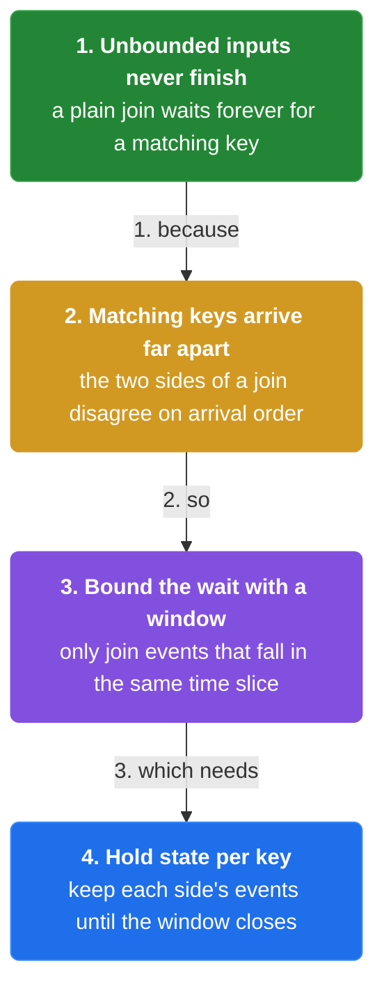

1. **Two unbounded inputs have no join boundary** — A batch join completes when both tables are read. **A stream-stream join never completes on its own** — it needs a time bound to say when a match is done.

2. **The join must buffer** — Rows from one side must wait for their counterpart on the other side. **Join state holds one side until the other catches up**, bounded by the join window.

3. **Watermarks bound the wait** — The watermark tells each side when no more rows for a time range will arrive. **A join emits a match when both sides' watermarks pass the join window.**

4. **Different joins for different inputs** — **Windowed joins** match two streams in a time window; **temporal joins** enrich a stream against a slowly-changing table. The input type picks the join type.

```java
// JOIN SIDE — two streams buffer one side until the other side's watermark catches up
// DEF: join window — the time bound for a match = 5 min around the click
// DEF: buffer — rows held for the other side = [ impression 12:02 ]
// DEF: watermark — clicks = 12:06:00, impressions = 12:04:30
// -> input : a click {campaign: "C1", event_time: "12:03:00"} arrives
//    step 1 · the click probes the impression buffer -> match : {} -> { (click 12:03, impression 12:02) }   BECAUSE 12:02 is within 5 min of 12:03
//    step 2 · the join checks completeness -> impressions watermark 12:04:30 < 12:05:00 -> the match is held
//    step 3 · impressions watermark advances -> watermark : 12:04:30 -> 12:06:00 -> the match emits   BECAUSE both sides passed the window
// <- outcome : the match waited 1 hold cycle until both watermarks passed 12:05:00   BECAUSE a late impression could still arrive
//    derivation : emit when min(click_watermark, impression_watermark) > 12:05:00, i.e. 12:06:00 > 12:05:00
```

### Windowed and temporal joins

> **Why this matters:** The two practical join forms — matching two streams in a window, and enriching a stream against a table — have different correctness rules, so this section contrasts them.

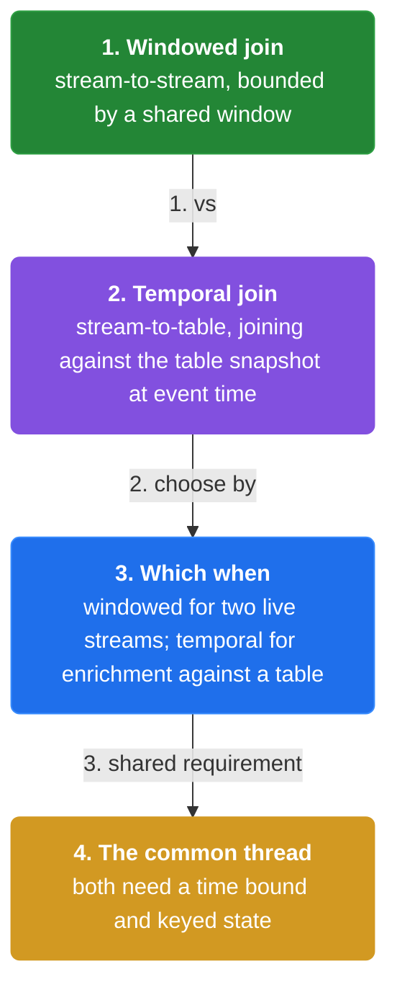

1. **Windowed (interval) join** — A windowed join matches rows from two streams whose time attributes are **within a window of each other**. The window bounds the buffer and the watermark bounds the wait.

2. **Temporal join (stream-table)** — A temporal join enriches a stream with the **version of a table that was current at the event's time**. It looks up state, not a moving window.

3. **Stream-table join is a lookup** — Joining a stream against a table is a **keyed lookup** — the stream row probes the table state at the join key. It is bounded because the table is finite per key.

4. **The choice is about what is joined** — Join two streams -> window; join a stream to a table -> temporal lookup. **Mistaking one for the other is the common streaming-join bug.**

```java
// TEMPORAL JOIN SIDE — a click enriches against the version of a user table current at event time
// DEF: temporal join — enrich each stream row with the table version current at its event time = 12:03:00
// DEF: user_table — the slowly-changing table = { 42: {tier: "gold"} }
// DEF: click — {user: 42, event_time: "12:03:00"}
// -> input : the click {user: 42, event_time: "12:03:00"} arrives
//    step 1 · probe the table at the join key -> user_table[42] = {tier: "gold"}
//    step 2 · enrich the click -> click : {user: 42, event_time: "12:03:00"} -> {user: 42, event_time: "12:03:00", tier: "gold"}
//    step 3 · the enriched row emits immediately -> no watermark wait   BECAUSE the table is finite per key, not an unbounded stream
// <- outcome : the click is enriched with tier "gold" without buffering   BECAUSE a table lookup is bounded
//    derivation : temporal join = probe table at key 42, so no window is needed to bound the match
```

### Correctness and state

> **Why this matters:** A join is only correct if it holds the right state for the right amount of time and cleans it up, so this section covers the state and watermark discipline behind joins.

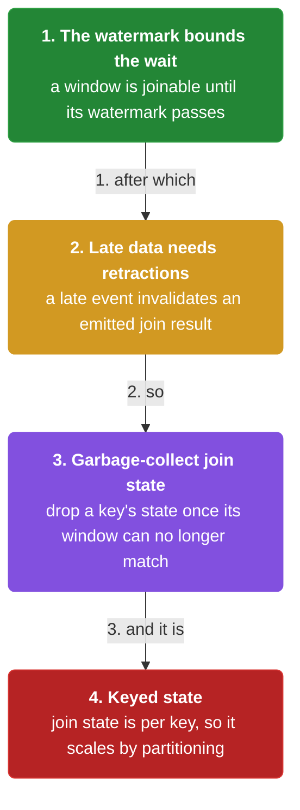

1. **Join state is bounded by the window** — The buffer for a windowed join only needs to hold rows **within the join window** — rows older than the window can be dropped once both watermarks pass.

2. **Late data complicates the join** — A late row can arrive after the join already emitted. **Allowed lateness keeps the join state alive** so a late match can still emit (and retract the earlier result).

3. **Retractions correct emitted joins** — If a late row changes a join result already emitted, the pipeline must **retract the old match and emit the corrected one** — the same accumulation discipline as windows.

4. **Garbage-collect the join state** — Join state must be garbage-collected when the watermark passes the window plus allowed lateness, or **the buffer grows without bound.**

```java
// LATE JOIN SIDE — a late impression changes an emitted match, forcing a retraction
// DEF: join window — 5 min around the click
// DEF: allowed lateness — how long the join keeps state for late rows = 1 min
// DEF: match — the already-emitted pair = (click 12:03, impression 12:01)
// -> input : a late impression {campaign: "C1", event_time: "12:02:00"} arrives after emission
//    step 1 · the late impression is within the join window -> join_state records it -> a better match is found
//    step 2 · the pipeline retracts the old match -> downstream : { (12:03,12:01) } -> cancelled
//    step 3 · the corrected match emits -> downstream : {} -> { (12:03, 12:02) }   BECAUSE 12:02 is closer to 12:03
// <- outcome : the downstream result is corrected from (12:03,12:01) to (12:03,12:02)   BECAUSE the late row changed the match
//    derivation : allowed lateness 1 min > lateness of the impression (arrival 12:06, event 12:02 = 4 min? 4 > 1 -> only if within lateness)
```


## System Design Interview

**The pipeline:** click stream + impression stream -> windowed join (buffer + watermark) -> retraction emitter -> attribution store

### click stream + impression stream

_Role: two streams — feed the join with event-time rows_

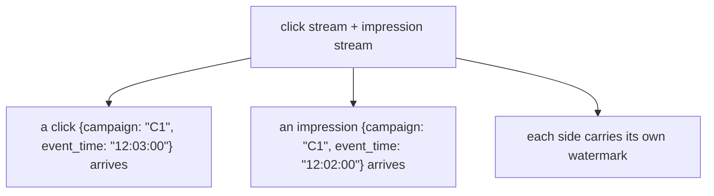

### windowed join (buffer + watermark)

_Role: windowed join — buffers one side and matches within a window_

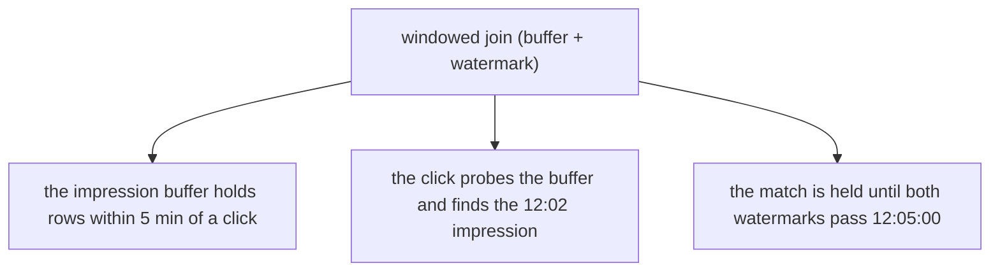

### retraction emitter

_Role: retraction emitter — corrects matches when late data arrives_

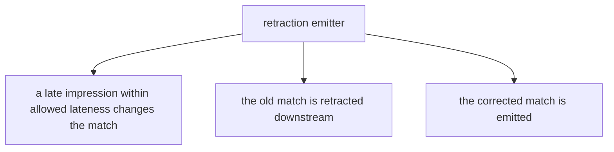

### attribution store

_Role: attribution store — holds the final matches_

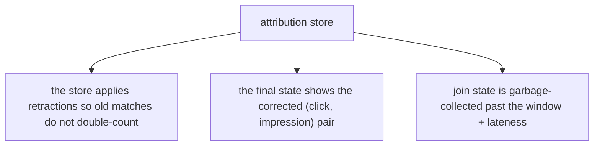

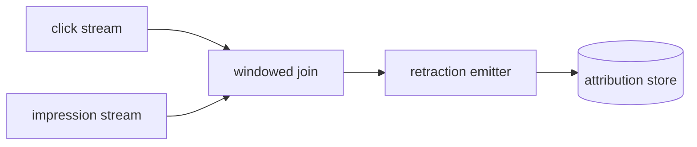

```java
// SYSTEM DESIGN — a windowed join holds a match until both watermarks pass, then a late row corrects it
// DEF: join window — the time bound for a match = 5 min
// DEF: watermark — clicks = 12:06:00, impressions = 12:04:30
// DEF: retraction — a downstream signal that cancels an emitted match
// STATE (before):
//    join_state : { matches: [], impressions: [ 12:02 ] }
// -> input : a click {campaign: "C1", event_time: "12:03:00"} arrives
//    step 1 · the click probes the impression buffer -> join_state.matches : [] -> [ (12:03, 12:02) ]   BECAUSE 12:02 is within 5 min of 12:03
//    step 2 · completeness check -> impressions watermark 12:04:30 < 12:05:00 -> the match is held
//    step 3 · impressions watermark advances -> watermark : 12:04:30 -> 12:06:00 -> the match emits   BECAUSE both sides passed 12:05:00
// <- outcome : the match emits 1 row once both watermarks pass 12:05:00, and a late impression would retract and re-emit   BECAUSE the join is bounded by the slower stream
//    derivation : emit when min(12:06:00, 12:06:00) > 12:05:00 = true
```

## Interview Questions

### Q1

An attribution pipeline joins ad impressions with clicks to attribute conversions, but it emits matches before a late impression could arrive, so some conversions are attributed to the wrong ad.

**Interviewer's question:** How do you join two event streams correctly when events can arrive out of order?

**Solution:** Use a windowed join bounded by a time window, and let the watermark decide when a match is complete — emit only when both sides' watermarks pass the join window, with allowed lateness and retractions for late corrections.

**System-design components:**
- Windowed join — interval bound
- Watermark — both sides pass
- Allowed lateness — late corrections
- Retraction — correct emitted matches

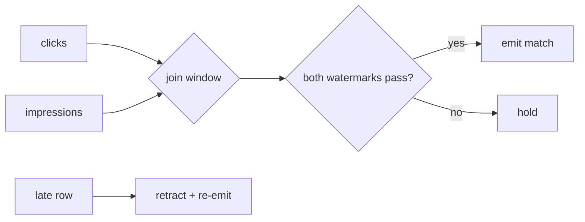

```java
// click 12:03, impression 12:02, window 5 min
//   impressions wm 12:04:30 < 12:05 -> hold
//   impressions wm -> 12:06 -> both pass -> emit
//   late impression 12:01 -> retract old, emit corrected
```

_This is exactly the windowed-join and watermark material in this chapter._

_Covers:_ 2. Windowed joins · 5. Watermarks bound the wait · 6. Late data and retractions

_From the 28 problems:_ 21-ad-click-aggregation

### Q2

A click stream needs each click enriched with the user's current subscription tier before aggregation, and the tier changes over time.

**Interviewer's question:** How do you join a stream to a slowly-changing table correctly?

**Solution:** Use a temporal (stream-table) join — probe the table at the join key for the version current at the event's time, rather than a windowed join.

**System-design components:**
- Temporal join — lookup
- Table — changelog-backed
- Join key — user id

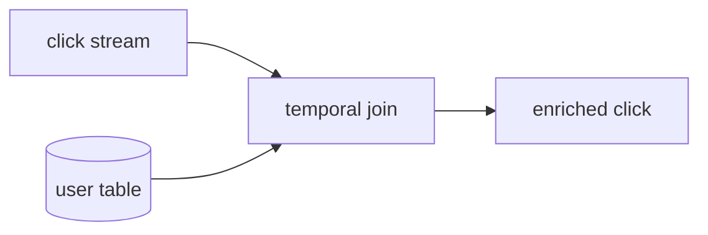

```java
// click {user:42, event_time:12:03}
//   probe user_table[42] = {tier: gold}
//   -> click + tier=gold, no window needed
```

_This is exactly the temporal-join material in this chapter._

_Covers:_ 3. Temporal joins · 8. Stream-stream vs stream-table confusion

_From the 28 problems:_ 21-ad-click-aggregation

## Key Concepts

### The Problem

**1. Unbounded joins never finish.** A streaming join needs a time bound — a window or a table lookup — to decide when a match is complete.


### The Solution

A windowed join matches rows whose time attributes are within a window of each other.


### Key Facts

| Fact | Detail | In the wild |
|---|---|---|
| 2. Windowed joins | A windowed join matches rows whose time attributes are within a window of each other. | Flink SQL interval joins are the production form. |
| 3. Temporal joins | A temporal join enriches each stream row with the table version current at its event time. | Flink SQL temporal joins against a changelog table. |
| 4. Join state | Join state buffers one side until the other catches up, bounded by the join window. | Flink holds the buffered side in managed state. |
| 5. Watermarks bound the wait | A join emits when both sides' watermarks pass the join window. | Flink SQL fires interval joins on the watermark. |
| 6. Late data and retractions | Allowed lateness keeps join state alive, and a corrected match retracts the old one before emitting. | Retract streams in Flink SQL correct emitted joins. |
| 7. Garbage-collect join state | Join state is garbage-collected when the watermark passes the window plus allowed lateness. | Flink cleans up interval-join state past the window + lateness. |
| 8. Stream-stream vs stream-table confusion | Join two streams with a window; join a stream to a table with a temporal lookup. | A common bug is a windowed join where a temporal lookup was intended. |


### Tradeoffs & When

- Join state is garbage-collected when the watermark passes the window plus allowed lateness.
- Join two streams with a window; join a stream to a table with a temporal lookup.


### Real-World Examples

- **Flink SQL** — Interval (windowed) joins and temporal joins
- **Apache Beam** — CoGroupByKey as the join primitive with windowing
- **ksqlDB** — Stream-stream and stream-table joins over Kafka


<details><summary>All concepts (index)</summary>

### Why: 1. Unbounded joins never finish

**Why.** Two unbounded streams have no natural join boundary, so a naive join buffers forever.

**Claim.** A streaming join needs a time bound — a window or a table lookup — to decide when a match is complete.

**Grounding.** The book's central streaming-join point is bounding the unbounded.

**In the wild.** Flink SQL requires an interval for stream-stream joins.

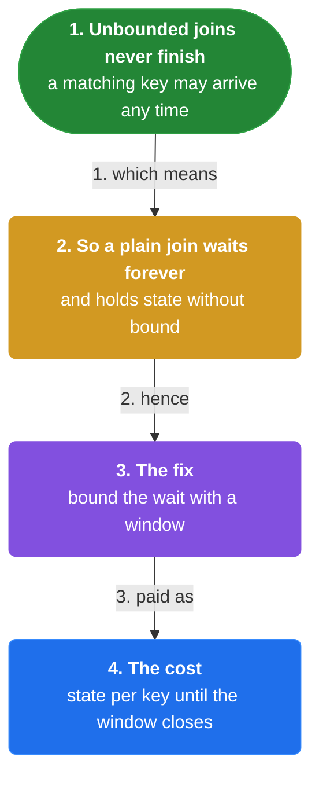
### Stream-stream: 2. Windowed joins

**Why.** Two streams need a time window to bound which rows can match.

**Claim.** A windowed join matches rows whose time attributes are within a window of each other.

**Grounding.** The window bounds the buffer and the watermark bounds the wait.

**In the wild.** Flink SQL interval joins are the production form.

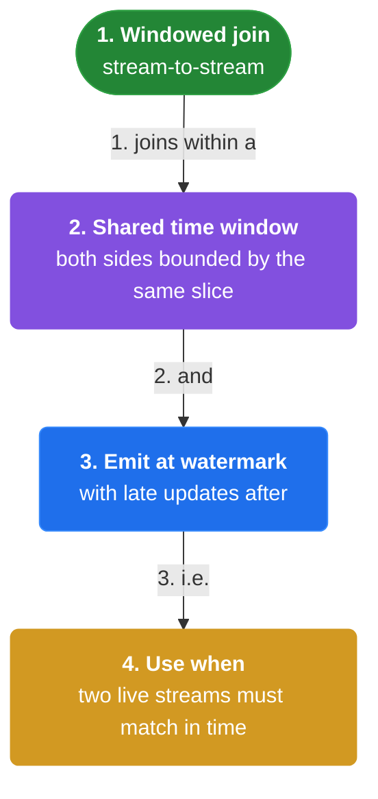
### Stream-table: 3. Temporal joins

**Why.** Enriching a stream against a slowly-changing table is a lookup, not a windowed match.

**Claim.** A temporal join enriches each stream row with the table version current at its event time.

**Grounding.** The table is finite per key, so no window is needed.

**In the wild.** Flink SQL temporal joins against a changelog table.

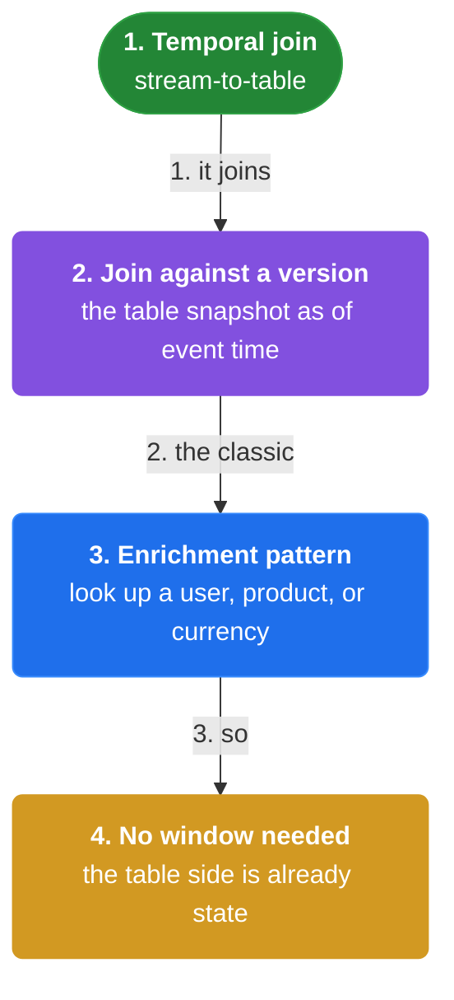
### Buffer: 4. Join state

**Why.** Rows from one side must wait for their counterpart on the other side.

**Claim.** Join state buffers one side until the other catches up, bounded by the join window.

**Grounding.** The buffer is what makes a streaming join possible.

**In the wild.** Flink holds the buffered side in managed state.

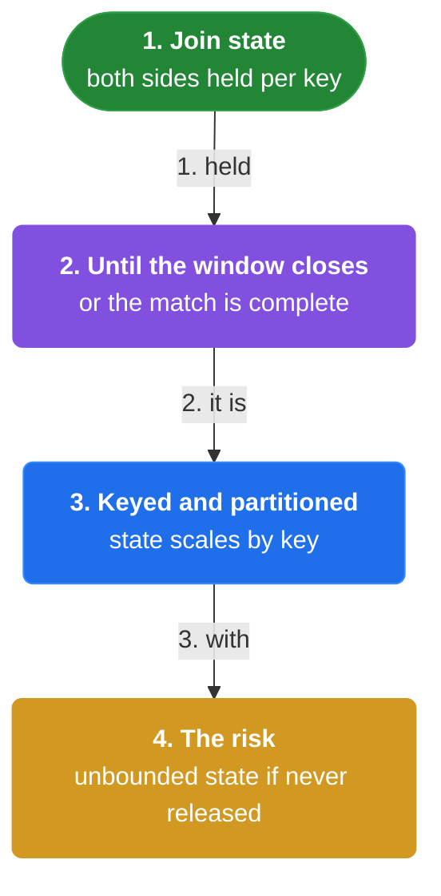
### Signal: 5. Watermarks bound the wait

**Why.** The pipeline needs to know when no more matching rows will arrive for a time range.

**Claim.** A join emits when both sides' watermarks pass the join window.

**Grounding.** Completeness is bounded by the slower stream.

**In the wild.** Flink SQL fires interval joins on the watermark.

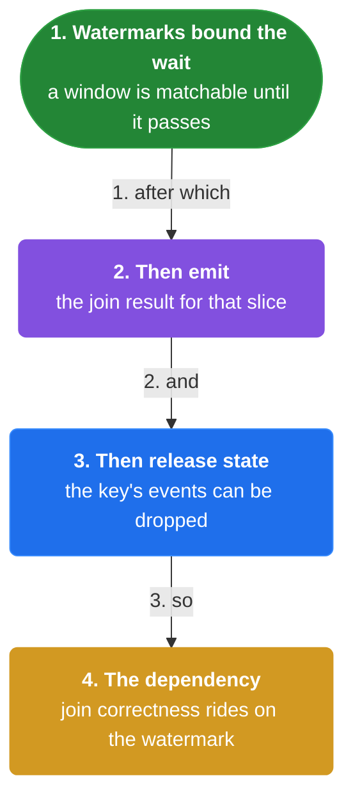
### Correctness: 6. Late data and retractions

**Why.** A late row can arrive after a match was emitted and change it.

**Claim.** Allowed lateness keeps join state alive, and a corrected match retracts the old one before emitting.

**Grounding.** The same accumulation discipline as windows applies to joins.

**In the wild.** Retract streams in Flink SQL correct emitted joins.

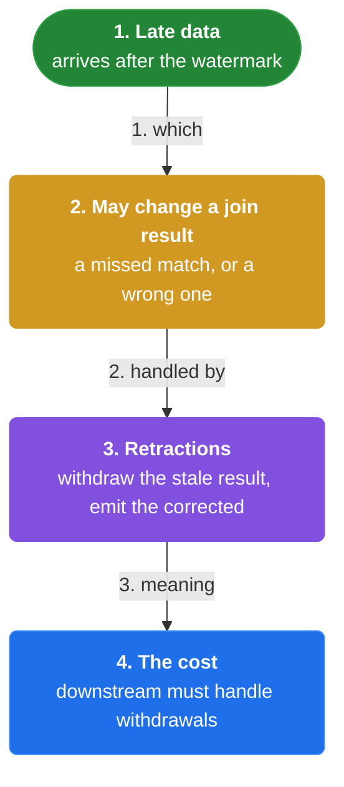
### Growth: 7. Garbage-collect join state

**Why.** A join buffer that never shrinks exhausts memory.

**Claim.** Join state is garbage-collected when the watermark passes the window plus allowed lateness.

**Grounding.** The window and allowed lateness together bound the state.

**In the wild.** Flink cleans up interval-join state past the window + lateness.

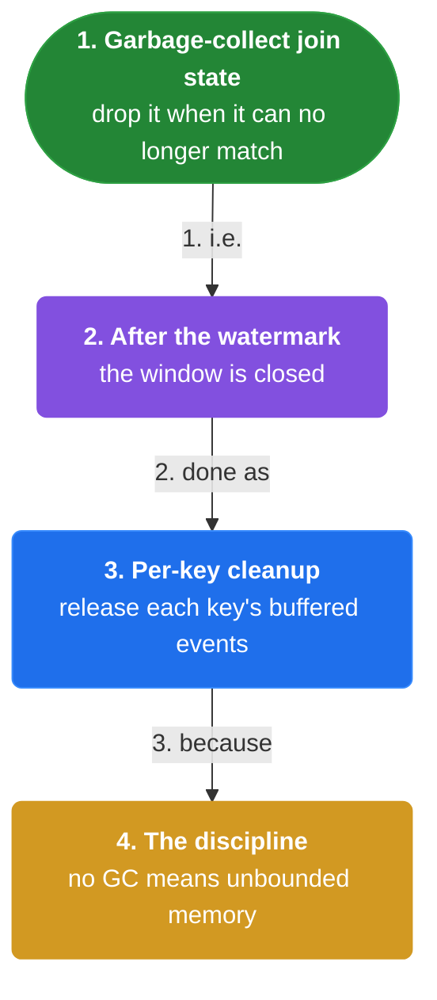
### Mistake: 8. Stream-stream vs stream-table confusion

**Why.** Applying the wrong join type produces unbounded buffers or wrong matches.

**Claim.** Join two streams with a window; join a stream to a table with a temporal lookup.

**Grounding.** The input type — unbounded vs finite-per-key — picks the join type.

**In the wild.** A common bug is a windowed join where a temporal lookup was intended.

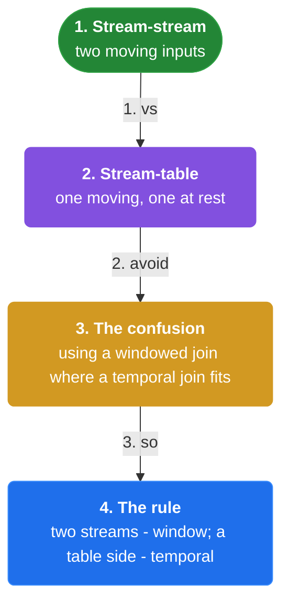

</details>


## Quiz

1. Why do stream-stream joins need a time bound?

   - A. To save CPU
   - B. Two unbounded streams have no natural join boundary
   - C. To create watermarks
   - D. To reduce latency

<details><summary>Reveal answer</summary>

**B.** Without a time bound, a stream-stream join would buffer forever.

</details>

2. What is a windowed join?

   - A. A lookup against a table
   - B. A join matching rows within a time window of each other
   - C. A join with no state
   - D. A batch join

<details><summary>Reveal answer</summary>

**B.** A windowed join matches rows whose time attributes fall within a window.

</details>

3. What is a temporal join?

   - A. A join of two streams in a window
   - B. Enriching a stream against a table version current at event time
   - C. A join with no key
   - D. A join of two tables

<details><summary>Reveal answer</summary>

**B.** A temporal join probes a table at the join key for the current version.

</details>

4. When does a windowed join emit a match?

   - A. When the first row arrives
   - B. When both sides' watermarks pass the join window
   - C. Every second
   - D. When the buffer is empty

<details><summary>Reveal answer</summary>

**B.** The join waits until both streams are complete for the window.

</details>

5. How is join state bounded?

   - A. It is never bounded
   - B. By garbage-collecting past the window plus allowed lateness
   - C. By the CPU
   - D. By the number of keys

<details><summary>Reveal answer</summary>

**B.** State past the window + allowed lateness is garbage-collected.

</details>

