# Chapter 9: Streaming Joins

> Joining streams is about bounding an unbounded match — windowed joins bound time, temporal joins enrich against a table, and the watermark plus state decide when a join result is complete.

_Also known as: SS Ch09 · Streaming Join · Windowed Join · Temporal Join · Stream-Table Join · Join State_

## Flow

### Why joins are hard on streams

> **Why this matters:** A join over two finite tables is a set intersection; a join over two unbounded streams has no boundary, so this section establishes what makes streaming joins different.

1. **Two unbounded inputs have no join boundary** — A batch join completes when both tables are read. **A stream-stream join never completes on its own** — it needs a time bound to say when a match is done.

2. **The join must buffer** — Rows from one side must wait for their counterpart on the other side. **Join state holds one side until the other catches up**, bounded by the join window.

3. **Watermarks bound the wait** — The watermark tells each side when no more rows for a time range will arrive. **A join emits a match when both sides' watermarks pass the join window.**

4. **Different joins for different inputs** — **Windowed joins** match two streams in a time window; **temporal joins** enrich a stream against a slowly-changing table. The input type picks the join type.

<!-- ch09-hard:begin — generated by tools/gen_ch09.js; do not hand-edit -->

#### Why a stream-stream join needs a time bound, and what it still cannot deliver

Reading this book's two keys as two streams — "a" is clicks, "b" is impressions — gives a real join to measure.

**A batch join completes; a stream-stream join does not.** Over these inputs a batch join tests 5 × 4 = 20 candidate pairs and finishes. The streaming version never finishes on its own: either side may still produce a match.

So SQL requires a **time bound**, and with a 60s bound there are exactly **5 true matches** here: 0-7, 1-7, 3-2, 4-5, 4-6. Without the bound the join would retain every row of both sides forever, so the bound makes the state finite *and* the semantics defined.

**The join must buffer.** A row cannot be matched and discarded — it waits for a counterpart that may never come. The buffer peaks at **5 rows** on this 9-row stream, and the sizing formula is (arrival rate × join window) per side.

**The watermark ends the wait, and it is the minimum over both inputs** — ch03's rule, now structural because a join always has two. Trace each click's emission point and **2 of the 5 never emits at all**, because the minimum watermark never passes its bound. Those rows hold **2 of the 5 true matches**: computed, sitting in state, never published.

**And the input type picks the join type.** Stream ⋈ stream is bounded by *time*; stream ⋈ table is bounded by the *table*, one lookup per row. On this data the windowed join publishes 1 of 5 matches on time, while a temporal join enriches all 5 clicks immediately. Mistaking the second for the first is the common streaming-join bug.

#### When a windowed join is the right tool, and how to size it

**Use a windowed join when both sides are genuinely streams** and a match means "these happened close together". The window width is a domain statement — how close counts as together — not a tuning parameter.

**Size it as arrival rate × window, per side**, and treat that as a hard number in the capacity plan. 5 rows here; at 10k rows/sec with a 60s window it is 600k rows per side.

**Expect the accounting, not just the matches.** On out-of-order data a correct windowed join delivers 1 of 5 matches correctly first time, 2 after a retraction, and 2 not at all. If that split is unacceptable, the answer is a different join or a different guarantee — not a wider window.

**Reach for a temporal join the moment the right-hand side is dimension-like.** Ask "could this side still produce a row that changes an old answer?" If not, it is a table, and windowing it adds a wait the data never needed.

**What this does not settle:** what a temporal join requires in exchange for not waiting. It needs the table's *history*, because the lookup is "as of this event time" rather than "now" — which is the next concept.

#### Visual walkthrough — no completion, the buffer, the minimum, the two kinds

The animation loops through all 4 steps. Expand any step to study it on its own.



<details>
<summary><b>Step 1 of 4</b> — two unbounded inputs have no moment at which the join is done</summary>


A batch join over these inputs tests 20 pairs and finishes. The streaming version never finishes on its own, so a time bound is mandatory — and with a 60s bound there are exactly 5 true matches here: 0-7, 1-7, 3-2, 4-5, 4-6. Everything that follows is about which of those 5 actually get emitted.

</details>
<details>
<summary><b>Step 2 of 4</b> — the join must BUFFER one side while waiting for the other</summary>

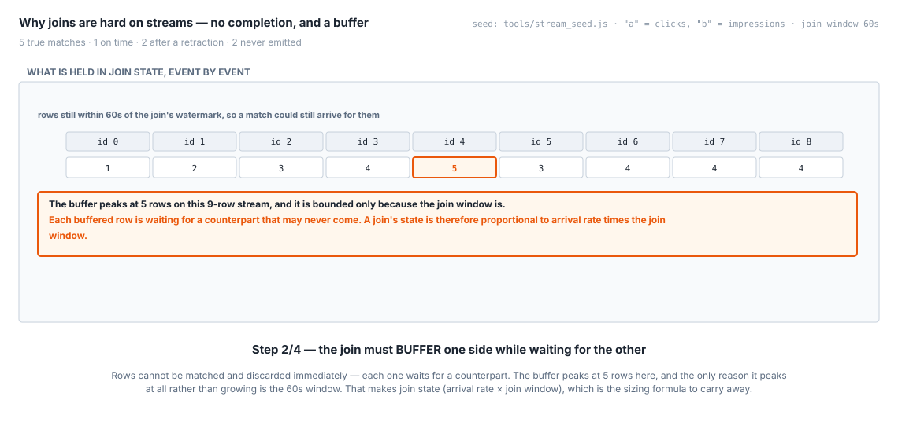

Rows cannot be matched and discarded immediately — each one waits for a counterpart. The buffer peaks at 5 rows here, and the only reason it peaks at all rather than growing is the 60s window. That makes join state (arrival rate × join window), which is the sizing formula to carry away.

</details>
<details>
<summary><b>Step 3 of 4</b> — and the watermark is what ends the wait</summary>

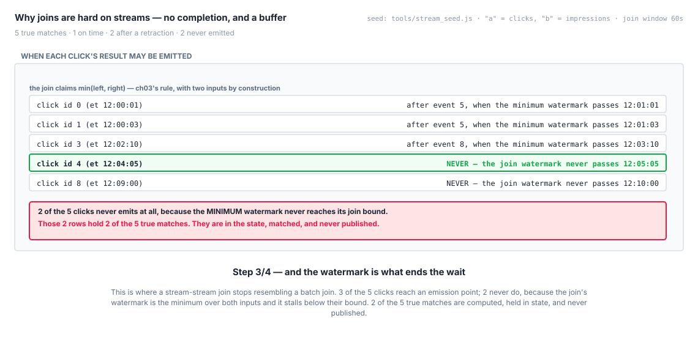

This is where a stream-stream join stops resembling a batch join. 3 of the 5 clicks reach an emission point; 2 never do, because the join's watermark is the minimum over both inputs and it stalls below their bound. 2 of the 5 true matches are computed, held in state, and never published.

</details>
<details>
<summary><b>Step 4 of 4</b> — so the input type picks the join type</summary>

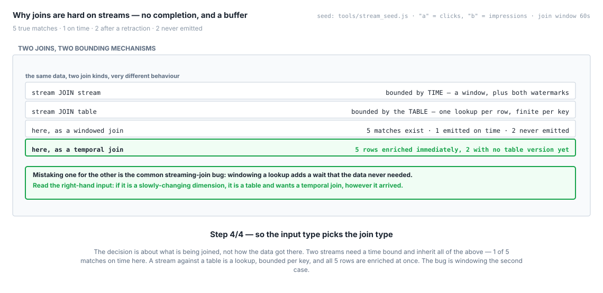

The decision is about what is being joined, not how the data got there. Two streams need a time bound and inherit all of the above — 1 of 5 matches on time here. A stream against a table is a lookup, bounded per key, and all 5 rows are enriched at once. The bug is windowing the second case.

</details>

<sub>Every match, the buffer peak and the full on-time/late/never accounting are computed from the seed and asserted to sum to 5. Generated by `node tools/gen_ch09.js`.</sub>

<!-- ch09-hard:end -->

<!-- ch09-hard-memory:begin — generated by tools/gen_ch09.js; do not hand-edit -->

#### A join with no completion — stack and heap at every step

**What is being answered.** Why a stream-stream join cannot deliver what the data contains — by computing both numbers separately.

`trueMatches()` uses no watermark and no buffer: it is what the data CONTAINS (5 matches), and it is the baseline the pipeline gets measured against.

`planFor(l)` then asks when each click may actually emit. Step 3 shows one succeeding at row 8; step 4 shows click 4 needing the watermark above 305 while `claim` only ever reaches 200 — so `when` stays NONE and `ms` holds 2 real matches that are never published.

The animation steps through the code, holding each line long enough to read the STACK (call frames and their locals) and the HEAP (allocated arrays and objects) as they are AT THAT MOMENT. Expand any step to study it on its own.



<details>
<summary><b>Step 1 of 4</b> — the join predicate is one subtraction</summary>


`absDiff(1, 50)` = 49, within J = 60, so the pair is a match. 5 matches exist in this data. Note this function uses no watermark and no buffer — it is what the data CONTAINS, which is the baseline the pipeline will be measured against.

</details>
<details>
<summary><b>Step 2 of 4</b> — a silent side blocks the join's claim entirely</summary>

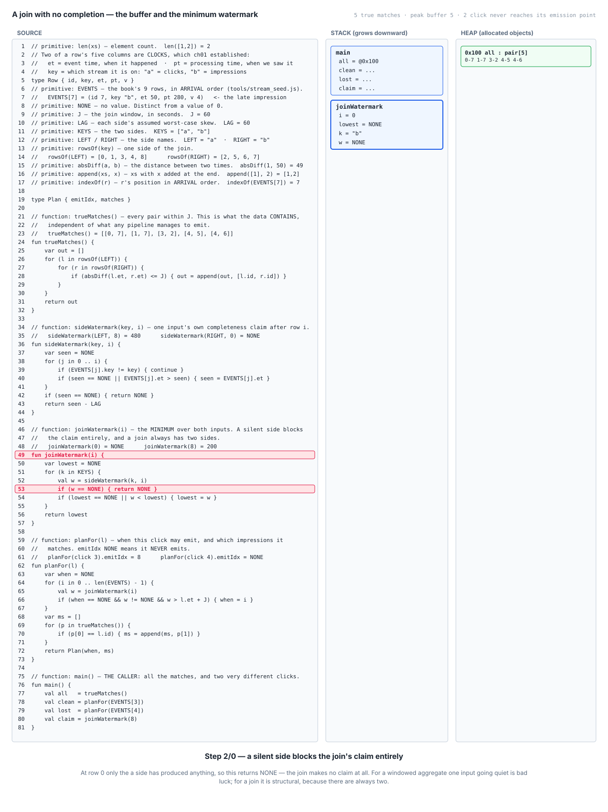

At row 0 only the a side has produced anything, so this returns NONE — the join makes no claim at all. For a windowed aggregate one input going quiet is bad luck; for a join it is structural, because there are always two.

</details>
<details>
<summary><b>Step 3 of 4</b> — one click reaches its emission point</summary>

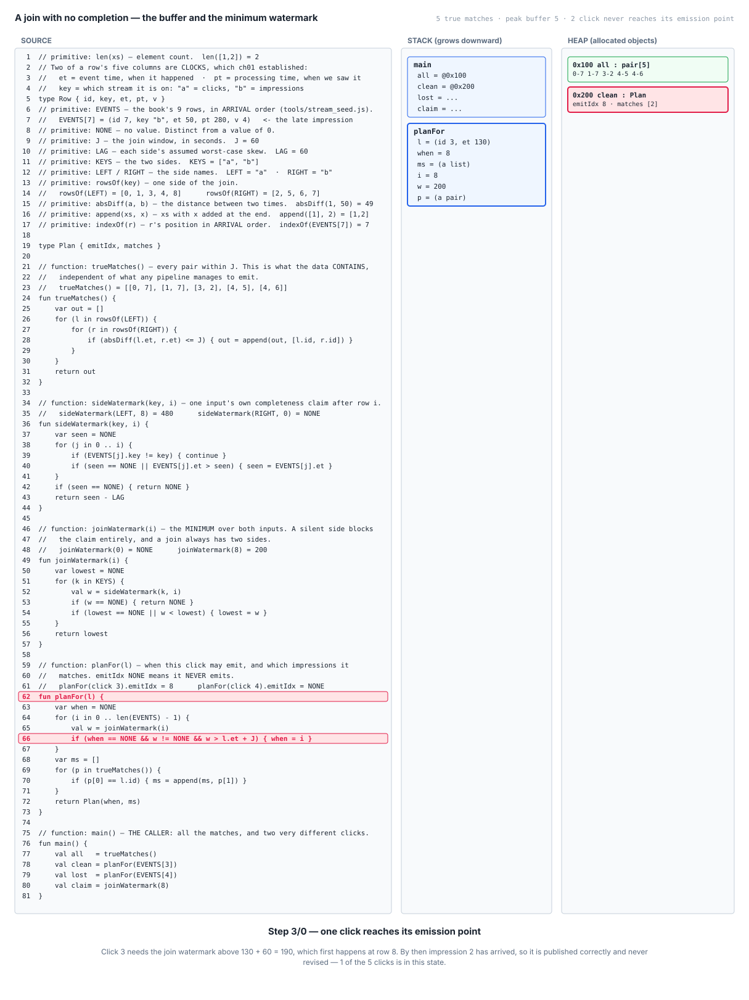

Click 3 needs the join watermark above 130 + 60 = 190, which first happens at row 8. By then impression 2 has arrived, so it is published correctly and never revised — 1 of the 5 clicks is in this state.

</details>
<details>
<summary><b>Step 4 of 4</b> — and 2 click never reaches it, holding 2 matches</summary>

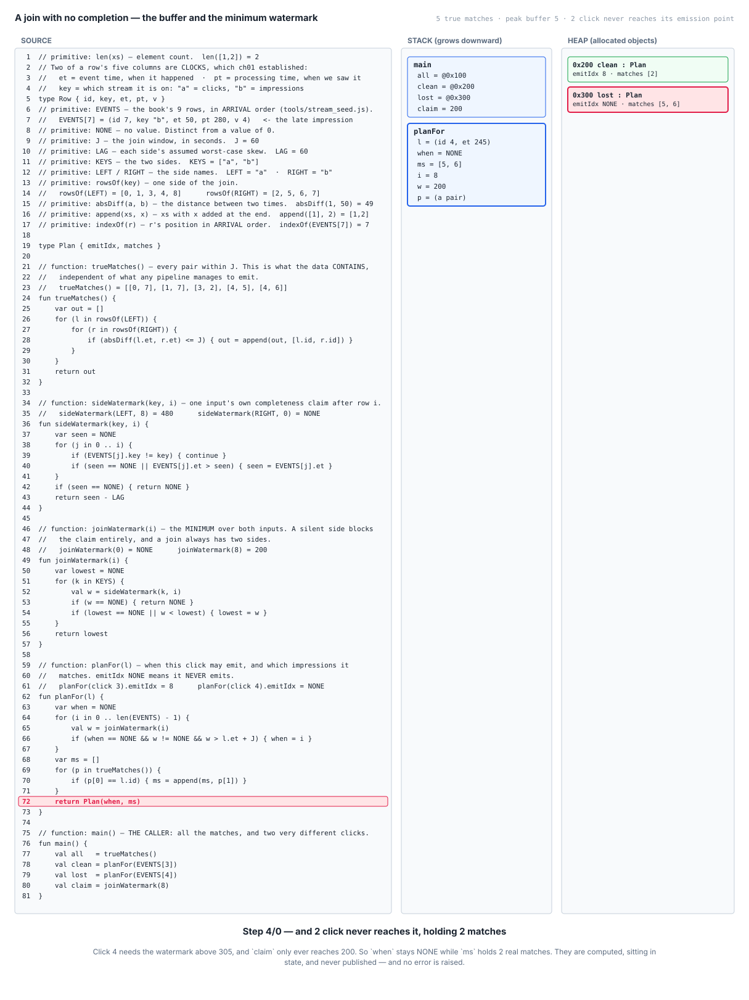

Click 4 needs the watermark above 305, and `claim` only ever reaches 200. So `when` stays NONE while `ms` holds 2 real matches. They are computed, sitting in state, and never published — and no error is raised.

</details>

<sub>Every match, the minimum watermark and both plans are computed from the seed and asserted. Generated by `node tools/gen_ch09.js` on `tools/memkit.js`.</sub>

<!-- ch09-hard-memory:end -->

### Windowed and temporal joins

> **Why this matters:** The two practical join forms — matching two streams in a window, and enriching a stream against a table — have different correctness rules, so this section contrasts them.

1. **Windowed (interval) join** — A windowed join matches rows from two streams whose time attributes are **within a window of each other**. The window bounds the buffer and the watermark bounds the wait.

2. **Temporal join (stream-table)** — A temporal join enriches a stream with the **version of a table that was current at the event's time**. It looks up state, not a moving window.

3. **Stream-table join is a lookup** — Joining a stream against a table is a **keyed lookup** — the stream row probes the table state at the join key. It is bounded because the table is finite per key.

4. **The choice is about what is joined** — Join two streams -&gt; window; join a stream to a table -&gt; temporal lookup. **Mistaking one for the other is the common streaming-join bug.**

<!-- ch09-kinds:begin — generated by tools/gen_ch09.js; do not hand-edit -->

#### Why these are bounded by different things, and why confusing them is costly

**The windowed (interval) join** matches rows whose event times are within a window of each other. One subtraction per candidate pair: 5 of the 20 pairs are within 60s.

Worth noticing early: **one click matches 2 impressions**, so a windowed join is not one-to-one and its output can exceed either input. That is a capacity surprise people usually meet after shipping.

**The temporal (stream-table) join** enriches each row with the version of a table that was current *at that row's event time*. Here each click probes the impression side as of its own `et`: click 3 → 11, click 4 → 20, and 2 clicks get NULL because no impression existed yet at that time.

No window, no buffer, no wait — all 5 rows are enriched immediately. The price is that it needs a **versioned** table: "as of 12:02:10" is not the same question as "now", and a table holding only current values cannot answer it.

**So the two are bounded by entirely different things:**

- what bounds it — windowed: the 60s window · temporal: the table, finite per key
- what it buffers — windowed: up to 5 rows · temporal: nothing
- when it emits — windowed: when both watermarks pass · temporal: immediately
- what it needs — windowed: watermarks on both sides · temporal: a versioned table

The third row is the substantive difference: a windowed join waits because a counterpart may still arrive, and a temporal join does not because the table's state at that event time is already settled. On this data that is 2 click never emitting versus all 5 emitting at once.

**And mistaking one for the other is the common bug.** The symptom is results arriving late or not at all; the cause is a windowed join against what is really a slowly-changing table; the cost here would be 2 of 5 rows never emitting and 2 matches withheld.

#### When to use each, and why the obvious fixes make it worse

**Windowed join when both sides are streams of events.** Accept the buffer, the watermark dependency and the on-time/late/never accounting that come with it.

**Temporal join when the right-hand side is state** — a price list, a user profile, a campaign table. It is cheaper in every dimension except one: you must be able to look the table up *as of* a past event time, which means keeping its versions.

**If you cannot version the table, say so explicitly** rather than falling back to a windowed join. Joining against "now" gives a row that is wrong in a way nothing downstream can detect, because the enrichment looks perfectly plausible.

**And resist the obvious fixes when a join seems slow.** Widening the window or raising allowed lateness both grow the state linearly and neither helps if the real problem is that one side is a table. The diagnostic question is "could this side still produce a row that changes an old answer?"

**What this does not settle:** what happens when a late row contradicts a match that was already emitted — including when the emitted result was a *no match*. That is the next concept, and it is the part that constrains the downstream store.

#### Visual walkthrough — every candidate pair, every lookup, side by side

The animation loops through all 4 steps. Expand any step to study it on its own.



<details>
<summary><b>Step 1 of 4</b> — the windowed join: match within a time interval</summary>


The join predicate is one subtraction, and it produces 5 matches from 20 candidates. Worth noticing in the note: one click matches 2 impressions, so a windowed join can emit more rows than either side has — which is a capacity question people usually discover after shipping.

</details>
<details>
<summary><b>Step 2 of 4</b> — the temporal join: look up the table AS OF the row's time</summary>

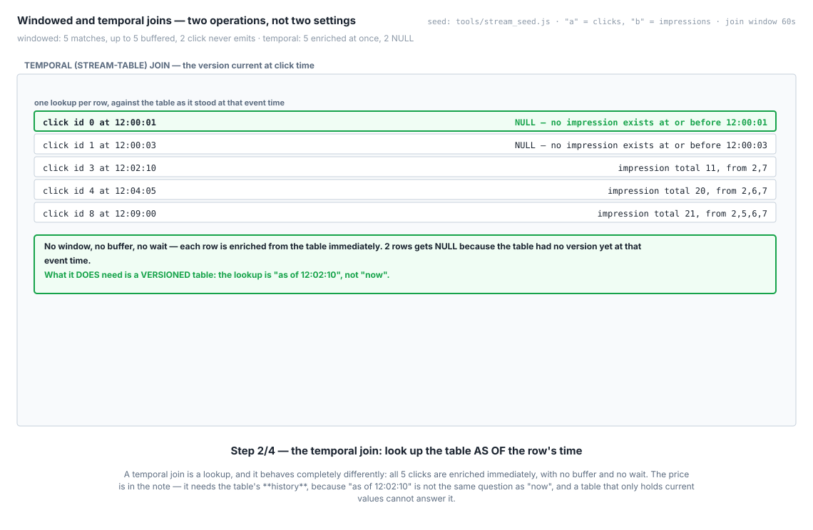

A temporal join is a lookup, and it behaves completely differently: all 5 clicks are enriched immediately, with no buffer and no wait. The price is in the note — it needs the table's **history**, because "as of 12:02:10" is not the same question as "now", and a table that only holds current values cannot answer it.

</details>
<details>
<summary><b>Step 3 of 4</b> — so the two joins are bounded by entirely different things</summary>

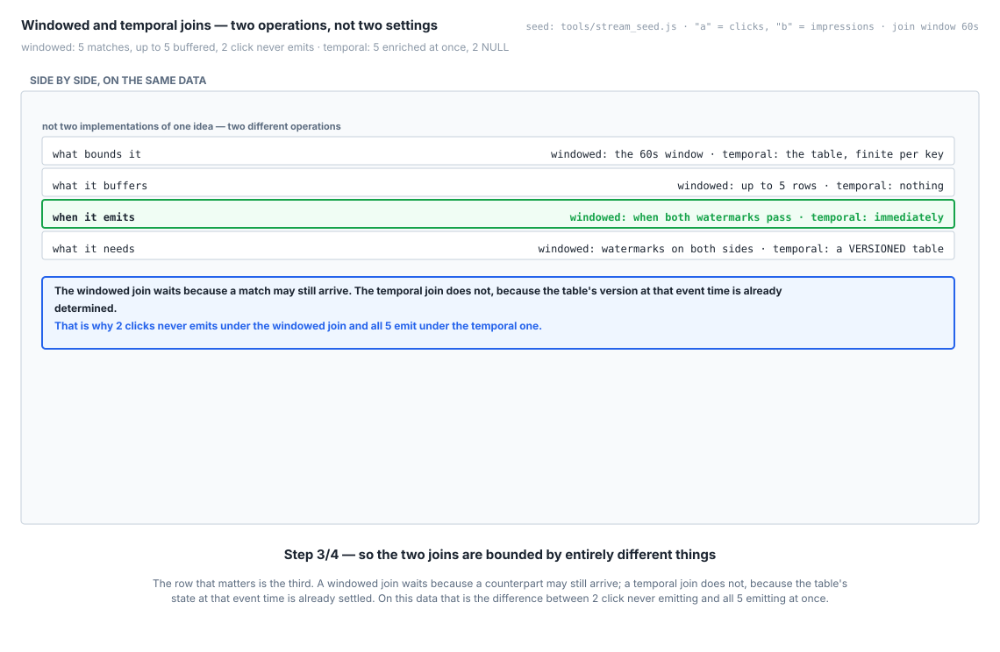

The row that matters is the third. A windowed join waits because a counterpart may still arrive; a temporal join does not, because the table's state at that event time is already settled. On this data that is the difference between 2 click never emitting and all 5 emitting at once.

</details>
<details>
<summary><b>Step 4 of 4</b> — and mistaking one for the other is the common bug</summary>

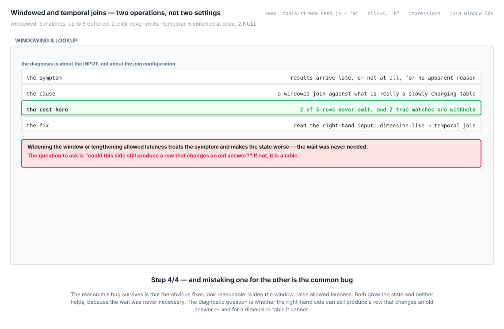

The reason this bug survives is that the obvious fixes look reasonable: widen the window, raise allowed lateness. Both grow the state and neither helps, because the wait was never necessary. The diagnostic question is whether the right-hand side can still produce a row that changes an old answer — and for a dimension table it cannot.

</details>

<sub>Every pair distance, every temporal lookup and the buffer peak are computed from the seed and asserted. Generated by `node tools/gen_ch09.js`.</sub>

<!-- ch09-kinds:end -->

<!-- ch09-kinds-memory:begin — generated by tools/gen_ch09.js; do not hand-edit -->

#### Windowed against temporal — stack and heap at every step

**What is being answered.** Why a windowed join and a temporal join are two different operations rather than two configurations.

`windowedJoin()` compares two **stream** rows, so neither is authoritative and the pair exists only once both have arrived. `tableAsOf(et)` has the line that defines a temporal join: `if (r.et > et) { continue }` — skip versions later than the row's own event time, which is why it needs the table's **history**.

Step 3 is the contrast in one case: click 0 gets NONE immediately from the temporal join, while the windowed join needs a retraction to deliver its match with impression 7.

The animation steps through the code, holding each line long enough to read the STACK (call frames and their locals) and the HEAP (allocated arrays and objects) as they are AT THAT MOMENT. Expand any step to study it on its own.



<details>
<summary><b>Step 1 of 4</b> — the windowed join compares two STREAM rows</summary>


Both operands are stream rows, so neither is authoritative — the pair exists only if BOTH have arrived, which is why the buffer and the wait exist. 5 pairs come out of this loop, and nothing here says when any of them may be published.

</details>
<details>
<summary><b>Step 2 of 4</b> — the temporal join probes a TABLE as of the row's own time</summary>

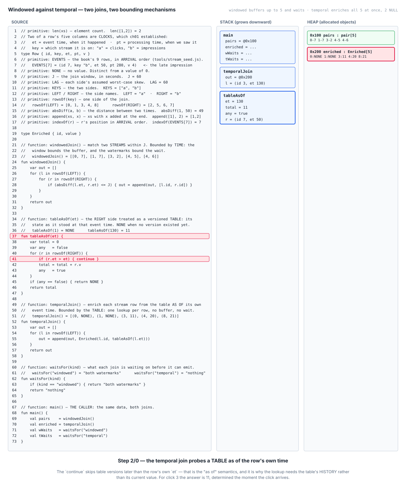

The `continue` skips table versions later than the row's own `et` — that is the "as of" semantics, and it is why the lookup needs the table's HISTORY rather than its current value. For click 3 the answer is 11, determined the moment the click arrives.

</details>
<details>
<summary><b>Step 3 of 4</b> — so a row before the table existed gets NONE, not a wait</summary>

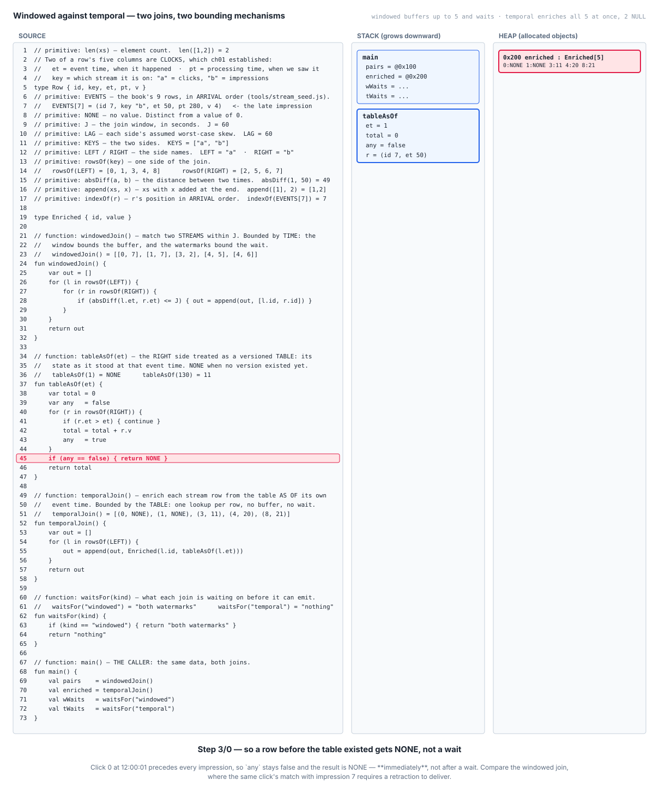

Click 0 at 12:00:01 precedes every impression, so `any` stays false and the result is NONE — **immediately**, not after a wait. Compare the windowed join, where the same click's match with impression 7 requires a retraction to deliver.

</details>
<details>
<summary><b>Step 4 of 4</b> — and that is the whole difference: one waits, one does not</summary>

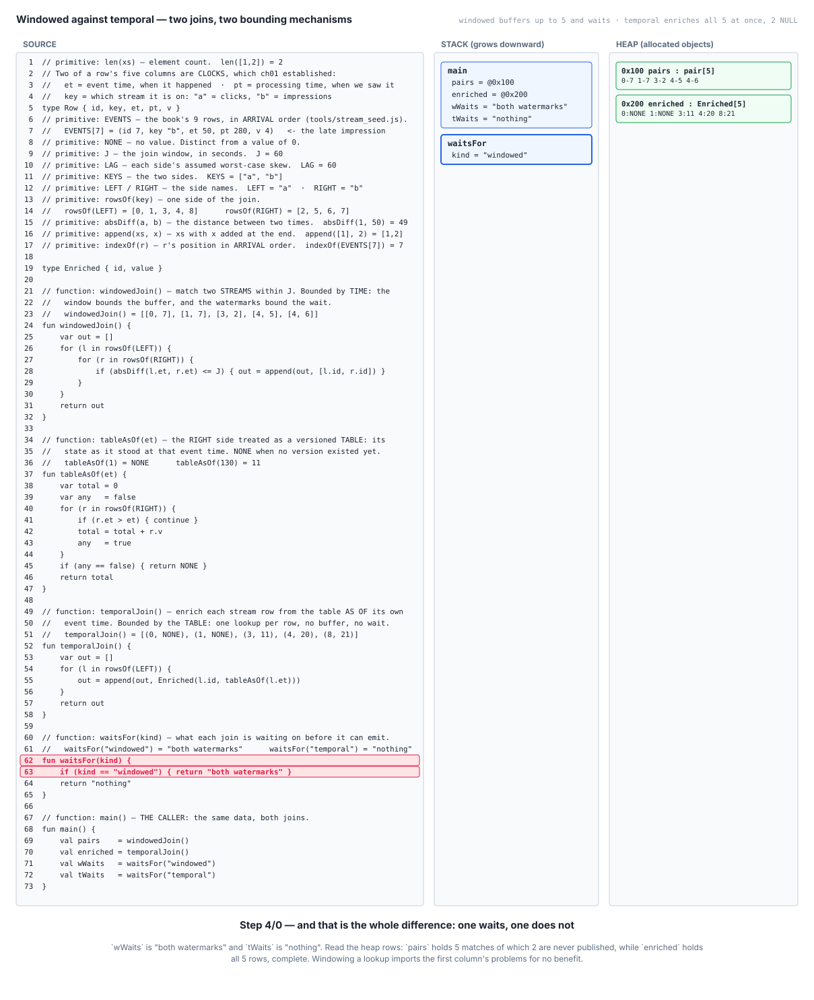

`wWaits` is "both watermarks" and `tWaits` is "nothing". Read the heap rows: `pairs` holds 5 matches of which 2 are never published, while `enriched` holds all 5 rows, complete. Windowing a lookup imports the first column's problems for no benefit.

</details>

<sub>Every pair, every lookup and the NULL case are computed from the seed and asserted. Generated by `node tools/gen_ch09.js` on `tools/memkit.js`.</sub>

<!-- ch09-kinds-memory:end -->

### Correctness and state

> **Why this matters:** A join is only correct if it holds the right state for the right amount of time and cleans it up, so this section covers the state and watermark discipline behind joins.

1. **Join state is bounded by the window** — The buffer for a windowed join only needs to hold rows **within the join window** — rows older than the window can be dropped once both watermarks pass.

2. **Late data complicates the join** — A late row can arrive after the join already emitted. **Allowed lateness keeps the join state alive** so a late match can still emit (and retract the earlier result).

3. **Retractions correct emitted joins** — If a late row changes a join result already emitted, the pipeline must **retract the old match and emit the corrected one** — the same accumulation discipline as windows.

4. **Garbage-collect the join state** — Join state must be garbage-collected when the watermark passes the window plus allowed lateness, or **the buffer grows without bound.**

<!-- ch09-correctness:begin — generated by tools/gen_ch09.js; do not hand-edit -->

#### Why a correct windowed join still fails to deliver most of its matches here

**Join state is bounded by the window, and only by it.** A buffered row may be dropped once both watermarks pass its event time plus 60s. Peak buffer here: **5 of 9 rows**, and the formula is arrival rate × join window per side. Doubling the window doubles the state, which is why "just widen it" is never free.

**A late row can contradict a result already emitted.** Click 0 reaches its emission point after event 5 and publishes **no match** — nothing within 60s had arrived. Then impression 7 arrives at event 7 and it *does* match, 49s apart.

So the join must retract and re-emit. And note which result is being retracted: **a no-match**. Downstream that reads as "this click was never attributed", which is a fact rather than a provisional answer — a negative result is still a result.

**The honest accounting for all 5 true matches:**

- **1** emitted on time and correct
- **2** emitted late, after a retraction
- **2** never emitted at all — the minimum watermark never passed the bound

1 + 2 + 2 = 5. Only 20% of the true matches are published correctly the first time, and 40% are never published. **Nothing is broken** — this is what a correct windowed join does on out-of-order data.

**And the state must be collected, or the join grows without bound.** The same watermark drives both: it decides when a match may be emitted and when its inputs may be dropped. So the 2 clicks that never emits is also 2 buffered rows that is never freed — a stalled input is a liveness problem *and* a memory leak, silently.

#### When to accept this, and what to do about the undelivered matches

**Accept the accounting when late attributions are tolerable** and the consumer can handle a retraction, including of a negative. A dashboard can; a billing run that has already paid out cannot.

**Require a store that can retract a no-match.** This is the unusual requirement in a join design: "click 0 matched nothing" has to be un-publishable. Updating a number is easy; withdrawing an absence usually means the store needs an explicit tombstone.

**Do not try to fix the never-emitted matches with the window or with lateness.** Both grow the buffer linearly and neither touches the cause: the minimum watermark. The only remedy is an idleness timeout on the slower input — i.e. declaring it finished, which trades away the correctness the minimum rule was protecting.

**Alert on the never-emitted case, because the pipeline will not.** An absent attribution is indistinguishable from a click that genuinely matched nothing. The only way to know is to compute what the answer should have been, from the retained streams.

**What this does not settle:** which impression gets the credit when one click matches 2 of them. That is attribution policy — first touch, last touch, split — and no amount of join machinery decides it.

#### Visual walkthrough — the bound, the retraction, the accounting, the leak

The animation loops through all 4 steps. Expand any step to study it on its own.



<details>
<summary><b>Step 1 of 4</b> — join state is bounded by the window, and only by it</summary>


The sizing formula is the whole of it: buffered rows ≈ arrival rate × join window, per side. 5 rows here on a 9-row stream. It matters because the two obvious responses to a join missing matches — widen the window, raise allowed lateness — both scale this number linearly.

</details>
<details>
<summary><b>Step 2 of 4</b> — a late row can contradict a result already emitted</summary>

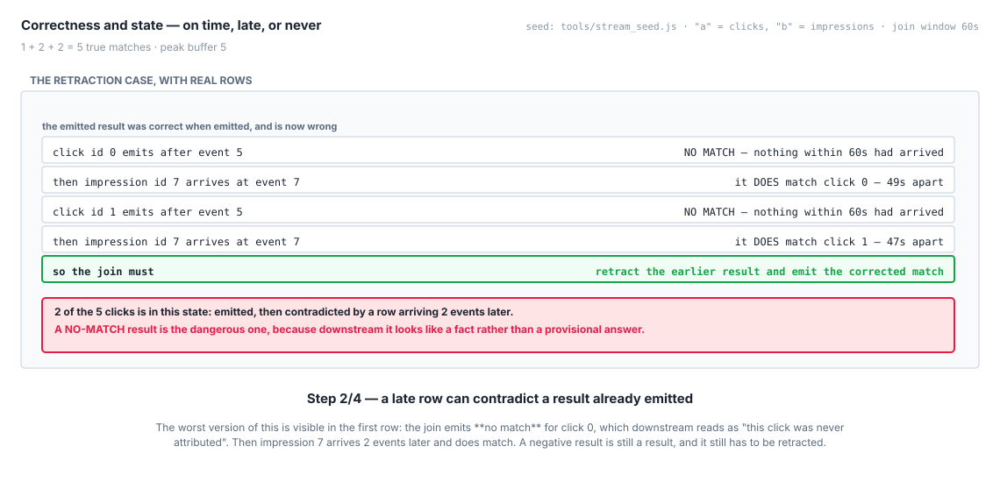

The worst version of this is visible in the first row: the join emits **no match** for click 0, which downstream reads as "this click was never attributed". Then impression 7 arrives 2 events later and does match. A negative result is still a result, and it still has to be retracted.

</details>
<details>
<summary><b>Step 3 of 4</b> — so the accounting is: on time, late, or never</summary>

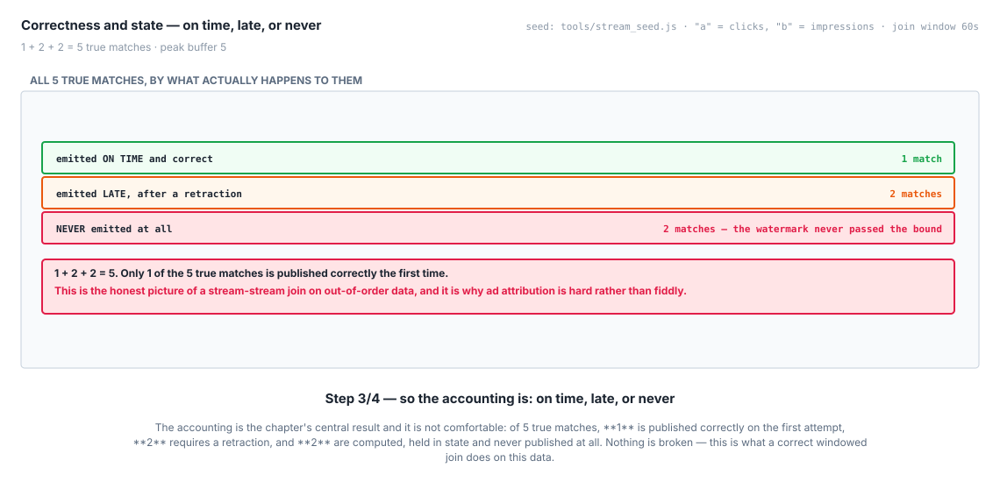

The accounting is the chapter's central result and it is not comfortable: of 5 true matches, **1** is published correctly on the first attempt, **2** requires a retraction, and **2** are computed, held in state and never published at all. Nothing is broken — this is what a correct windowed join does on this data.

</details>
<details>
<summary><b>Step 4 of 4</b> — and the state must be collected, or the join grows forever</summary>

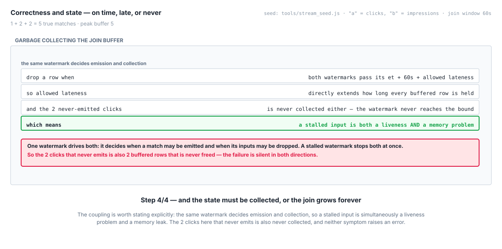

The coupling is worth stating explicitly: the same watermark decides emission and collection, so a stalled input is simultaneously a liveness problem and a memory leak. The 2 clicks here that never emits is also never collected, and neither symptom raises an error.

</details>

<sub>The full accounting is computed from the seed and asserted to sum to 5, with the buffer peak measured per row. Generated by `node tools/gen_ch09.js`.</sub>

<!-- ch09-correctness:end -->

<!-- ch09-correctness-memory:begin — generated by tools/gen_ch09.js; do not hand-edit -->

#### The accounting — stack and heap at every step

**What is being answered.** What a correct windowed join actually delivers, counted — and which published result has to be withdrawn.

`emitFor(l)` returns one of three kinds, and the middle one is the uncomfortable one: `if (len(have) == 0) { return Emission(l.id, "NO-MATCH", []) }`. A click with nothing matched **yet** still publishes, and downstream that reads as a fact.

`tally()` then sums the three outcomes to 1 / 2 / 2 = 5. Step 3 is the silent case: click 4 emits nothing at all, so its 2 matches are absent rather than wrong — and absence is indistinguishable from a genuine non-match.

The animation steps through the code, holding each line long enough to read the STACK (call frames and their locals) and the HEAP (allocated arrays and objects) as they are AT THAT MOMENT. Expand any step to study it on its own.



<details>
<summary><b>Step 1 of 4</b> — a click with no match yet still PUBLISHES — a no-match</summary>


`have` is empty — impression 7 has not arrived by row 5 — so the join publishes NO-MATCH. Downstream that reads as "click 0 was never attributed", a fact rather than a provisional answer. This is the result that will have to be withdrawn.

</details>
<details>
<summary><b>Step 2 of 4</b> — and the impression that contradicts it arrives later</summary>

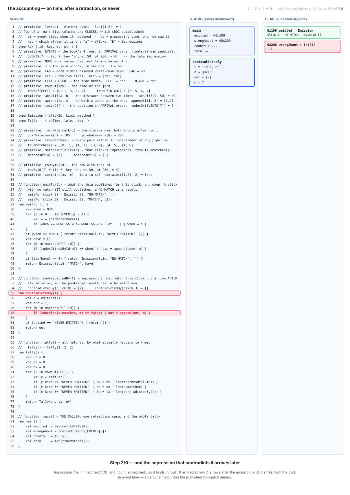

Impression 7 is in `matchesOf(0)` and not in `e.matched`, so it lands in `out`. It arrived at row 7, 2 rows after the emission, and it is 49s from the click in event time — a genuine match that the published no-match denies.

</details>
<details>
<summary><b>Step 3 of 4</b> — a never-emitted click contributes to neither count</summary>

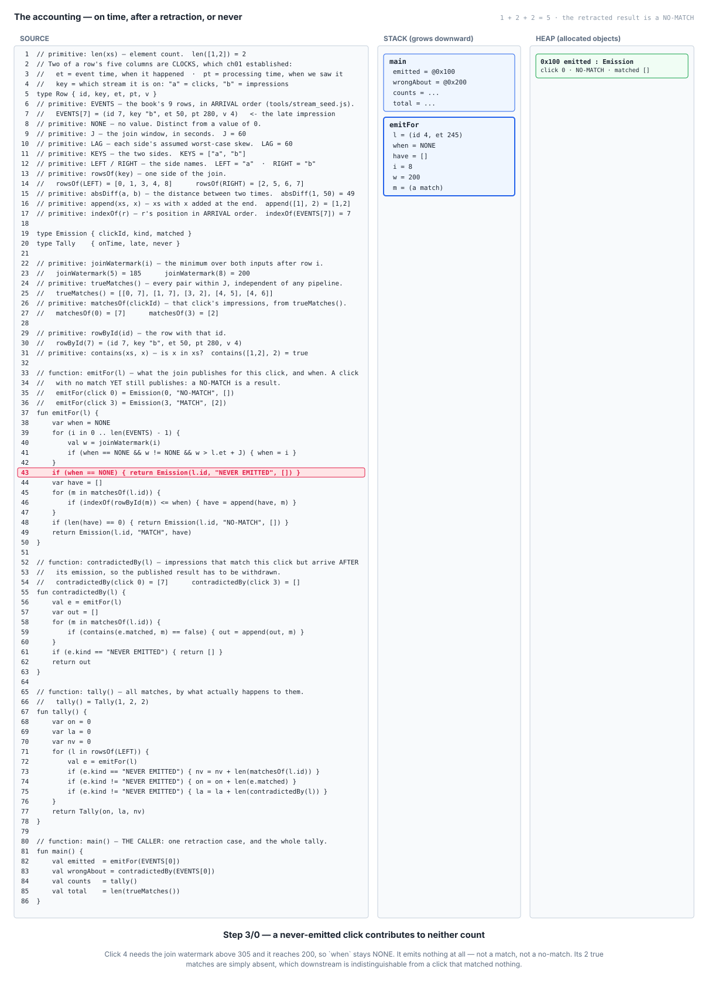

Click 4 needs the join watermark above 305 and it reaches 200, so `when` stays NONE. It emits nothing at all — not a match, not a no-match. Its 2 true matches are simply absent, which downstream is indistinguishable from a click that matched nothing.

</details>
<details>
<summary><b>Step 4 of 4</b> — so the tally is 1 / 2 / 2, summing to 5</summary>

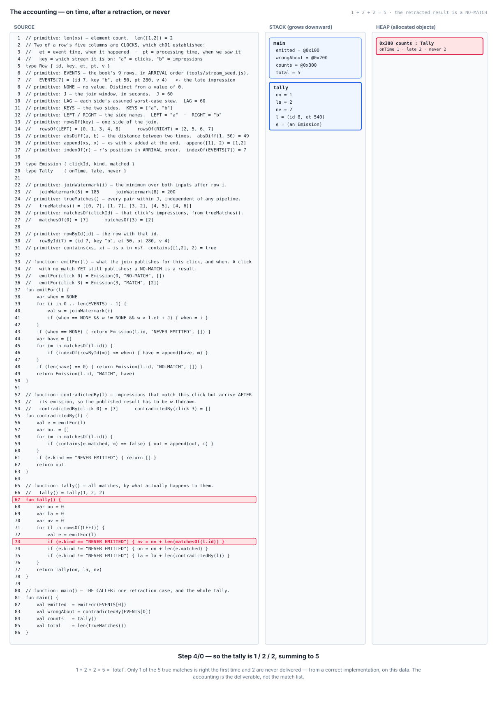

1 + 2 + 2 = 5 = `total`. Only 1 of the 5 true matches is right the first time and 2 are never delivered — from a correct implementation, on this data. The accounting is the deliverable, not the match list.

</details>

<sub>Every emission kind and the full tally are computed from the seed and asserted to sum to 5. Generated by `node tools/gen_ch09.js` on `tools/memkit.js`.</sub>

<!-- ch09-correctness-memory:end -->

### Google Interview Question

> **Why this matters:** A standalone interview problem, with three other surfaces the same program wears. Nothing here depends on this chapter's vocabulary: the problem, the one reframe that solves it, and the traced solution are self-contained, and the section stops where the program stops. Generated by `tools/gen_ch09_interview.js` on `tools/interviewkit.js`.

<!-- ch09-interview-memory:begin — generated by tools/gen_ch09_interview.js; do not hand-edit -->

#### The problem

> **Two sorted lists of time spans.** Within a list, spans never overlap each other.
> 
> **Report every overlap between a span in the first list and a span in the second.**
> 
> 10⁶ spans in each. Then: **both lists are streams that keep arriving — what may you throw away?**

> `1..3  130..245  540..540` against `50..150  220..320` → [130..150, 220..245].

> Spans are closed intervals of integers. The lists arrive already sorted.

#### How to model it

Start with the geometry, because getting it right removes most of the fiddliness: two spans overlap on **the later start to the earlier end**, and if that comes out backwards they do not overlap at all. One expression answers both questions.

Then the cost. Trying all pairs is 6 comparisons here and 10¹² at the stated size — not slow, impossible — and it uses neither of the two facts the question handed you.

The reframe uses both: one cursor into each list, and **advance whichever span ends first.** That span cannot overlap anything further along the other list, because the other list is sorted *and its spans do not overlap each other*, so everything remaining there starts later than the one just compared. Each comparison retires exactly one span, so the total is at most m + n.

Two things to get right. The rule is **symmetric** — advancing by start, or always advancing the left, skips overlaps. And a single span can produce **several** overlaps, so the loop must not assume one each.

The second half is a different question wearing the same clothes. The sweep assumed both lists were finished. As streams they are not: a span the cursor has passed cannot be released, because something overlapping it may not have arrived. So "finished with" becomes a claim about the future, and it needs a **declared bound on how late a stream may be** — below which nothing new can start. With that bound, 1 of these 3 spans are safe to forget; without it, **nothing is**, and state grows for as long as the system runs.

And the bound must be the **minimum over both sides**, because one silent stream means nothing can be released from either. That makes memory a function of the declared lateness rather than of the data, and makes a stalled stream stall the join rather than corrupt it. Naming the bound is the answer; the sweep is the easy half.

#### The same problem, asked 3 other ways

Each of these is the program below with different nouns. The reason to read them is not the
answer — it is the *recognition*. 4 surfaces (shift rosters, facilities, advertising, scheduling), one shape, and in every
case the appealing first answer is to materialise a sequence you cannot afford.

<details>
<summary><b>Variation 2</b> — the double-booked room <i>(looks like facilities)</i></summary>

> One list this time: bookings for a room. **Find every pair that overlaps**, and report the busiest moment.

**Why it is not obvious.** Self-overlap removes the guarantee the sweep depended on — within one list spans may now overlap, so "ends first means finished" is false and the two-pointer rule does not apply. The move is to stop thinking in spans and think in **events**: each span becomes a start and an end, all sorted together, and a running count rises and falls. The busiest moment is the count's maximum, and an overlap exists wherever it exceeds one. Recognising that the span-pair framing was the obstacle, not the solution, is the content — and the event sweep handles the chapter's problem too, less efficiently.

**Where it lands.** Neither `sweep` nor `overlapOf` survives; what carries over is the idea of walking a sorted sequence once. This is the case the chapter's program cannot do.


<details>
<summary><b>The whole program</b> for this variation — runnable, no animation</summary>

This is **the double-booked room** solved on its own: a complete file, every helper included, asserting its own results. It is run on every build.

```python
#!/usr/bin/env python3
"""Variation 2 -- the double-booked room (looks like facilities). Standalone and runnable.

  One list this time: the bookings for a meeting room, sorted by start.  Report every pair
  that overlaps, and the busiest moment -- the time at which the most bookings are live at
  once.  Up to 10**6 bookings.

The chapter had two lists and leaned on a promise about each one: within a list, spans never
overlap.  Here there is one list and it overlaps ITSELF, so "the span that ends first is
finished" is simply false and the two-pointer rule does not apply at all -- the version that
pairs the list with itself is written out below and gets the wrong answer, which is more
convincing than being told.  The move is to stop thinking in spans and think in EVENTS: every
booking becomes a start and an end, all of them sorted together, and a running count rises
and falls.  The busiest moment is that count's maximum and an overlap exists wherever it
exceeds one.  The span-pair framing was the obstacle, not the solution -- and the event sweep
is strictly more general, because it also answers the chapter's two-list question.

Run it:  python3 programs/ch09_v2.py
"""
import random

# The chapter's two lists poured into one, which is exactly what "one list this time" means:
# its LEFT = [(1, 3), (130, 245), (540, 540)] and RIGHT = [(50, 150), (220, 320)], sorted by
# start.  Neither list overlapped itself; the union does, and the chapter's two cross-list
# overlaps (130..150 and 220..245) are now this room's two double-bookings.  Spans are CLOSED:
# a booking from 130 to 245 occupies 245.
BOOKINGS = [(1, 3), (50, 150), (130, 245), (220, 320), (540, 540)]
LEFT = [(1, 3), (130, 245), (540, 540)]      # kept, to check the general sweep against
RIGHT = [(50, 150), (220, 320)]
# One more booking -- a long workshop from 140 to 230 -- so that THREE bookings are live at
# once.  It is here because the chapter's union is not enough to break the two-pointer rule:
# measured below, that rule gets the chapter's data exactly right, and only a third
# simultaneous booking exposes it.
WITH_WORKSHOP = sorted(BOOKINGS + [(140, 230)])
NONE = None                                  # these two bookings do not overlap at all


def overlap_of(x, y):
    """The overlap of two closed spans, or NONE.  It starts at the LATER start and ends at the
    EARLIER end, and if that comes out backwards there is no overlap -- so one expression
    answers both "do they" and "where"."""
    lo, hi = max(x[0], y[0]), min(x[1], y[1])
    return NONE if hi < lo else (lo, hi)


def every_pair(bookings):
    """The answer everyone gives first, and the reference everything else is checked against:
    try all of them.  Correct, and n(n-1)/2 comparisons -- at 10**6 bookings that is 5 x 10**11.
    Returns (pairs, comparisons) with pairs as (i, j, lo, hi)."""
    out, cmp = [], 0
    for i in range(len(bookings)):
        for j in range(i + 1, len(bookings)):
            cmp += 1
            o = overlap_of(bookings[i], bookings[j])
            if o is not NONE:
                out.append((i, j, o[0], o[1]))
    return out, cmp


def two_pointer_against_itself(bookings):
    """The chapter's sweep, pointed at this problem: one cursor into the list and one into the
    same list, advancing whichever span ends first.

    It is here to be run rather than dismissed.  The rule was licensed by a promise -- the
    other list does not overlap itself, so everything remaining in it starts later than the
    span just compared -- and that promise is now false by construction.  What comes out is
    every span matched with itself and the real double-bookings missed.
    """
    out, i, j = [], 0, 0
    while i < len(bookings) and j < len(bookings):
        o = overlap_of(bookings[i], bookings[j])
        if o is not NONE and i != j:
            out.append((min(i, j), max(i, j), o[0], o[1]))
        if bookings[i][1] < bookings[j][1]:
            i += 1
        else:
            j += 1
    return out


def marks_of(bookings):
    """Every booking as two events: +1 where it starts, -1 just after it ends.

    The end mark is at `end + 1` because the spans are CLOSED -- a booking occupying 245 is
    still live at 245 and free at 246.  Sorting puts -1 before +1 at the same instant, which
    is what makes a booking ending at 129 and one starting at 130 not count as a clash, while
    one ending at 130 and one starting at 130 do.
    """
    marks = []
    for s, e in bookings:
        marks.append((s, 1))
        marks.append((e + 1, -1))
    marks.sort()
    return marks


def event_sweep(bookings):
    """One pass over the sorted marks, carrying a running count of live bookings.

    The mechanism: the count after processing every mark at an instant IS the number of
    bookings covering that instant, so the maximum over the pass is the busiest moment and no
    span is ever compared with another.  The pair count comes free -- an arriving booking
    clashes with precisely those already live, so adding `live` at each start totals every
    overlapping pair exactly once, counted at the later of the two starts.
    Returns (max_live, busiest_moment, pair_count).
    """
    live = best = pairs = 0
    at = None
    for t, delta in marks_of(bookings):
        if delta == 1:
            pairs += live               # it clashes with everything currently live
        live += delta
        if live > best:
            best, at = live, t
    return best, at, pairs


def cross_by_events(left, right):
    """The same event sweep doing the CHAPTER's job: overlaps between two lists, not within one.

    Each booking is tagged with the list it came from, and a start records an overlap against
    every live span from the OTHER list.  The later start is the overlap's start, so the pair
    is recorded exactly once.  It is strictly more general than the two-pointer sweep and
    strictly more expensive -- the work is one pass plus the live spans touched -- which is the
    honest summary of what generality costs here.
    """
    events = []
    for tag, spans in (("L", left), ("R", right)):
        for idx, (s, e) in enumerate(spans):
            events.append((s, 1, tag, idx, e))
            events.append((e + 1, -1, tag, idx, e))
    events.sort(key=lambda m: (m[0], m[1]))
    live = {"L": {}, "R": {}}
    out = []
    for t, delta, tag, idx, end in events:
        other = "R" if tag == "L" else "L"
        if delta == -1:
            live[tag].pop(idx, None)
            continue
        for oidx, oend in live[other].items():
            lo, hi = t, min(end, oend)
            if hi >= lo:
                pair = (idx, oidx) if tag == "L" else (oidx, idx)
                out.append((pair[0], pair[1], lo, hi))
        live[tag][idx] = end
    return sorted(out)


def every_cross_pair(left, right):
    """The quadratic reference for the two-list question, indexed the same way."""
    out = []
    for i, x in enumerate(left):
        for j, y in enumerate(right):
            o = overlap_of(x, y)
            if o is not NONE:
                out.append((i, j, o[0], o[1]))
    return sorted(out)


def covering(bookings, t):
    """How many bookings cover instant t, counted directly.  The per-instant reference the
    sweep's answer is checked against -- affordable only on a small range, which is the whole
    reason the sweep exists."""
    return sum(1 for s, e in bookings if s <= t <= e)


def main():
    print(f"BOOKINGS = {BOOKINGS}   ({len(BOOKINGS)} bookings, closed spans)")
    pairs, cmp = every_pair(BOOKINGS)
    best, at, count = event_sweep(BOOKINGS)
    print("  marks   =", marks_of(BOOKINGS))
    print(f"\n  every pair  : {[(i, j, f'{lo}..{hi}') for i, j, lo, hi in pairs]}   "
          f"({cmp} comparisons)")
    print(f"  event sweep : busiest {best} bookings at t={at}, {count} overlapping pairs   "
          f"({len(marks_of(BOOKINGS))} marks)")

    assert pairs == [(1, 2, 130, 150), (2, 3, 220, 245)], pairs
    assert (best, at, count) == (2, 130, 2), (best, at, count)
    assert count == len(pairs), "the sweep's pair count must match the quadratic answer"
    assert cmp == len(BOOKINGS) * (len(BOOKINGS) - 1) // 2 == 10
    assert covering(BOOKINGS, at) == best, "the busiest moment must really be that busy"
    assert any(s <= at <= e for s, e in BOOKINGS), "and it must be inside a booking"
    print(f"  the two double-bookings are the chapter's two overlaps, 130..150 and 220..245 --")
    print(f"  the same data, with the two lists poured into one.")

    # the chapter's sweep, run rather than dismissed -- and it PASSES, which is the dangerous
    # outcome.  The first version of this program asserted that it misses an overlap here; the
    # measurement refused that, and the reason is worth more than the assertion was: the
    # chapter's union is a CHAIN, each booking overlapping only its neighbour, so each
    # comparison really does retire a span and the rule survives by luck.
    wrong = two_pointer_against_itself(BOOKINGS)
    print(f"\n  two-pointer sweep of the list against itself: "
          f"{[(i, j, f'{lo}..{hi}') for i, j, lo, hi in wrong]}")
    assert wrong == pairs, wrong
    print(f"  it gets the right answer -- which is the worst thing it could do, because the")
    print(f"  promise that licensed the rule is gone and the output does not say so.  In this")
    print(f"  list every booking overlaps only its neighbour, so each comparison still retires a")
    print(f"  span.  Breaking it needs THREE bookings live at once, which is also exactly the")
    print(f"  thing the question asks about.")

    # ...so add the third one
    trip_pairs, trip_cmp = every_pair(WITH_WORKSHOP)
    trip_best, trip_at, trip_count = event_sweep(WITH_WORKSHOP)
    trip_wrong = two_pointer_against_itself(WITH_WORKSHOP)
    print(f"\n  with a workshop from 140 to 230 added: {WITH_WORKSHOP}")
    print(f"    every pair  : {len(trip_pairs)} pairs, busiest unknown to it   ({trip_cmp} comparisons)")
    print(f"    event sweep : busiest {trip_best} at t={trip_at}, {trip_count} pairs   "
          f"({len(marks_of(WITH_WORKSHOP))} marks)")
    print(f"    two-pointer : {len(trip_wrong)} pairs   WRONG")
    assert trip_count == len(trip_pairs) == 5, (trip_count, trip_pairs)
    assert (trip_best, trip_at) == (3, 140), (trip_best, trip_at)
    assert covering(WITH_WORKSHOP, trip_at) == 3
    missed = [p for p in trip_pairs if p not in trip_wrong]
    assert missed == [(1, 3, 140, 150)], missed
    assert len(trip_wrong) == 4 < len(trip_pairs), trip_wrong
    assert all(p in trip_pairs for p in trip_wrong), "it misses pairs, it never invents them"
    print(f"    it finds {len(trip_wrong)} of {len(trip_pairs)} and misses {missed[0][2]}..{missed[0][3]}: after comparing bookings 1 and 2 it")
    print(f"    advances past booking 1, which still had an overlap with booking 3 waiting.  The")
    print(f"    rule retires a span per comparison, and with three live at once that is one span")
    print(f"    too many.  It under-reports, so a double-booking is simply never raised.")

    # the sweep's count, checked instant by instant across the whole range
    lo_t, hi_t = min(s for s, _ in BOOKINGS), max(e for _, e in BOOKINGS)
    by_instant = max(covering(BOOKINGS, t) for t in range(lo_t, hi_t + 2))
    assert by_instant == best == 2, (by_instant, best)
    for t in range(lo_t, hi_t + 2):
        assert covering(BOOKINGS, t) <= best, t
    print(f"\n  checked against a direct count at all {hi_t - lo_t + 2} instants from {lo_t} to {hi_t + 1}: the maximum is")
    print(f"  {by_instant}, and no instant exceeds it -- so the running count is the concurrency, not a")
    print(f"  proxy for it.")

    # the same machinery on the chapter's own two-list question
    cross = cross_by_events(LEFT, RIGHT)
    reference = every_cross_pair(LEFT, RIGHT)
    assert cross == reference == [(1, 0, 130, 150), (1, 1, 220, 245)], cross
    print(f"\n  and the event sweep answers the chapter's question too: on its LEFT and RIGHT it")
    print(f"  finds {[(f'L{i}', f'R{j}', f'{lo}..{hi}') for i, j, lo, hi in cross]},")
    print(f"  which is the chapter's own answer -- so nothing was given up by abandoning the")
    print(f"  two-pointer rule except the two-pointer rule's efficiency.")

    # boundaries, each one a thing a real booking system has in it
    assert event_sweep([]) == (0, None, 0), "an empty room has no busiest moment to report"
    assert event_sweep([(5, 5)]) == (1, 5, 0), "a zero-length booking is still a booking"
    assert event_sweep([(0, 10), (11, 20)]) == (1, 0, 0), "adjacent bookings do not clash"
    assert event_sweep([(0, 10), (10, 20)]) == (2, 10, 1), "touching at one instant does"
    assert event_sweep([(0, 10), (0, 10)]) == (2, 0, 1), "identical bookings clash once"
    assert event_sweep([(0, 10)] * 4) == (4, 0, 6), "four identical bookings make 6 pairs"
    assert event_sweep([(0, 100), (10, 20), (30, 40)]) == (2, 10, 2), "nesting, not just overlap"
    print(f"\n  boundaries: [] -> {event_sweep([])} (no moment to report, not 0);  [(0,10),(11,20)] ->")
    print(f"  {event_sweep([(0, 10), (11, 20)])} (adjacent is free);  [(0,10),(10,20)] -> {event_sweep([(0, 10), (10, 20)])} (closed spans touch,")
    print(f"  so that IS a clash);  four identical bookings -> {event_sweep([(0, 10)] * 4)}, i.e. 4 choose 2 pairs")
    print(f"  from one instant -- the pair count is quadratic in the answer even when the sweep")
    print(f"  is linear in the input, which is why it is counted rather than listed.")

    # many inputs, including heavy self-overlap, against the quadratic reference
    rng = random.Random(20260303)
    overlapping_cases, clean_cases = 0, 0
    for _ in range(600):
        n = rng.randint(0, 9)
        spans = []
        for _ in range(n):
            s = rng.randint(0, 25)
            spans.append((s, s + rng.randint(0, 8)))
        spans.sort()
        want, _ = every_pair(spans)
        best_n, at_n, count_n = event_sweep(spans)
        assert count_n == len(want), (spans, count_n, len(want))
        if spans:
            lo_s = min(s for s, _ in spans)
            hi_s = max(e for _, e in spans)
            direct = max(covering(spans, t) for t in range(lo_s, hi_s + 2))
            assert best_n == direct, (spans, best_n, direct)
            assert covering(spans, at_n) == best_n, (spans, at_n)
        else:
            assert (best_n, at_n, count_n) == (0, None, 0)
        if want:
            overlapping_cases += 1
            assert best_n >= 2, (spans, best_n)
        else:
            clean_cases += 1
            assert best_n <= 1, (spans, best_n)
        # the two-pointer attempt may never beat the reference, only fall short of it
        attempt = two_pointer_against_itself(spans)
        assert all(p in want for p in attempt), (spans, attempt)
        # and the cross-list sweep against its own quadratic reference
        half = len(spans) // 2
        a, b = sorted(spans[:half]), sorted(spans[half:])
        a = [x for i, x in enumerate(a) if i == 0 or x[0] > a[i - 1][1]]
        b = [x for i, x in enumerate(b) if i == 0 or x[0] > b[i - 1][1]]
        assert cross_by_events(a, b) == every_cross_pair(a, b), (a, b)
    print(f"\n  600 random booking lists, most of them self-overlapping: the event sweep's pair")
    print(f"  count matched the quadratic answer every time and its maximum matched a direct")
    print(f"  per-instant count every time ({overlapping_cases} lists had a clash, {clean_cases} were clean).  The")
    print(f"  two-pointer attempt never reported a pair that was not real -- it only ever")
    print(f"  reported fewer, which is exactly why nobody notices it is wrong.")
    assert overlapping_cases > 0 and clean_cases > 0

    # the scale the question names
    BIG = 20_000
    big = [(i * 5, i * 5 + 7) for i in range(BIG)]       # each booking overlaps its neighbour
    marks = len(marks_of(big))
    big_best, big_at, big_pairs = event_sweep(big)
    would_compare = BIG * (BIG - 1) // 2
    print(f"\n  at {BIG:,} bookings, each overlapping the next: busiest {big_best} at t={big_at}, "
          f"{big_pairs:,} pairs,")
    print(f"  from {marks:,} marks.  The quadratic answer would need {would_compare:,} comparisons for")
    print(f"  the same result, and at the stated 10**6 bookings it would need 5 x 10**11 --")
    print(f"  while the marks stay at 2 per booking.")
    assert (big_best, big_pairs) == (2, BIG - 1), (big_best, big_pairs)
    assert marks == 2 * BIG
    assert would_compare // marks == 4_999, would_compare // marks
    print("\nall assertions passed")


if __name__ == "__main__":
    main()
```

Running it prints:

```
BOOKINGS = [(1, 3), (50, 150), (130, 245), (220, 320), (540, 540)]   (5 bookings, closed spans)
  marks   = [(1, 1), (4, -1), (50, 1), (130, 1), (151, -1), (220, 1), (246, -1), (321, -1), (540, 1), (541, -1)]

  every pair  : [(1, 2, '130..150'), (2, 3, '220..245')]   (10 comparisons)
  event sweep : busiest 2 bookings at t=130, 2 overlapping pairs   (10 marks)
  the two double-bookings are the chapter's two overlaps, 130..150 and 220..245 --
  the same data, with the two lists poured into one.

  two-pointer sweep of the list against itself: [(1, 2, '130..150'), (2, 3, '220..245')]
  it gets the right answer -- which is the worst thing it could do, because the
  promise that licensed the rule is gone and the output does not say so.  In this
  list every booking overlaps only its neighbour, so each comparison still retires a
  span.  Breaking it needs THREE bookings live at once, which is also exactly the
  thing the question asks about.

  with a workshop from 140 to 230 added: [(1, 3), (50, 150), (130, 245), (140, 230), (220, 320), (540, 540)]
    every pair  : 5 pairs, busiest unknown to it   (15 comparisons)
    event sweep : busiest 3 at t=140, 5 pairs   (12 marks)
    two-pointer : 4 pairs   WRONG
    it finds 4 of 5 and misses 140..150: after comparing bookings 1 and 2 it
    advances past booking 1, which still had an overlap with booking 3 waiting.  The
    rule retires a span per comparison, and with three live at once that is one span
    too many.  It under-reports, so a double-booking is simply never raised.

  checked against a direct count at all 541 instants from 1 to 541: the maximum is
  2, and no instant exceeds it -- so the running count is the concurrency, not a
  proxy for it.

  and the event sweep answers the chapter's question too: on its LEFT and RIGHT it
  finds [('L1', 'R0', '130..150'), ('L1', 'R1', '220..245')],
  which is the chapter's own answer -- so nothing was given up by abandoning the
  two-pointer rule except the two-pointer rule's efficiency.

  boundaries: [] -> (0, None, 0) (no moment to report, not 0);  [(0,10),(11,20)] ->
  (1, 0, 0) (adjacent is free);  [(0,10),(10,20)] -> (2, 10, 1) (closed spans touch,
  so that IS a clash);  four identical bookings -> (4, 0, 6), i.e. 4 choose 2 pairs
  from one instant -- the pair count is quadratic in the answer even when the sweep
  is linear in the input, which is why it is counted rather than listed.

  600 random booking lists, most of them self-overlapping: the event sweep's pair
  count matched the quadratic answer every time and its maximum matched a direct
  per-instant count every time (415 lists had a clash, 185 were clean).  The
  two-pointer attempt never reported a pair that was not real -- it only ever
  reported fewer, which is exactly why nobody notices it is wrong.

  at 20,000 bookings, each overlapping the next: busiest 2 at t=5, 19,999 pairs,
  from 40,000 marks.  The quadratic answer would need 199,990,000 comparisons for
  the same result, and at the stated 10**6 bookings it would need 5 x 10**11 --
  while the marks stay at 2 per booking.

all assertions passed
```

</details>

</details>
<details>
<summary><b>Variation 3</b> — the attributed click <i>(looks like advertising)</i></summary>

> Clicks and impressions arrive on two streams. **Match each click to the impression that preceded it by at most `W` seconds**, and to the nearest one if several qualify.

**Why it is not obvious.** Both halves of the chapter's problem are here and a third thing is added: the match is **asymmetric and one-to-one**, so an impression already matched must not match again, and "nearest" means a click cannot be answered until it is certain no closer impression is still in flight. That turns a stateless sweep into a wait, and the wait's length is exactly the lateness bound from the model above — so the bound stops being an optimisation and becomes a correctness requirement. The useful observation is that `W` and the lateness bound are different numbers that are easy to conflate.

**Where it lands.** `droppable` with `bound` derived from `W` plus the lateness allowance, and `overlapOf` replaced by a nearest-preceding test with a one-to-one constraint.


<details>
<summary><b>The whole program</b> for this variation — runnable, no animation</summary>

This is **the attributed click** solved on its own: a complete file, every helper included, asserting its own results. It is run on every build.

```python
#!/usr/bin/env python3
"""Variation 3 -- the attributed click (looks like advertising). Standalone and runnable.

  Impressions and clicks arrive on two streams.  Match each click to the impression that
  preceded it by at most W seconds, and to the NEAREST such impression if several qualify.  An
  impression may be credited with at most one click.

Both halves of the chapter's problem are here -- two streams, and a bound on what may be
forgotten -- and a third thing is added: the match is asymmetric and one-to-one, so "nearest"
cannot be decided until it is certain no closer impression is still in flight.  That turns a
stateless sweep into a WAIT, and the wait's length is the lateness allowance, not W.  Those are
two different numbers in the same units and conflating them is the mistake this program
measures: here W is 60 seconds of business rule and the data runs 85 seconds late, so waiting W
loses attributions that waiting 85 recovers.  The bound has stopped being an optimisation and
become a correctness requirement.  Two more things fall out, uninvited.  Answering a click
early is wrong in BOTH directions -- measured below, it sometimes reports more attributions
than the correct answer, so no count can audit it.  And "nearest" and "as many matches as
possible" are different objectives; the spec asks for the first one.

Run it:  python3 programs/ch09_v3.py
"""
import random

# Impressions as (shown_at, arrived_at).  The shown_at times are the chapter's LEFT endpoints,
# 1, 3, 130, 245 and 540 -- its key 'a' session boundaries.  One of them arrives late: the
# impression shown at 245 reaches the matcher at 330, which is 85 seconds of lateness and is
# deliberately MORE than W, so the two numbers cannot be confused for one.
IMPRESSIONS = [(1, 1), (3, 3), (130, 130), (245, 330), (540, 540)]
# Clicks, punctual, at the chapter's key 'b' event times 50, 90, 220 and 260, plus a second
# click at 265 that wants the same impression as the one at 260 -- which is what makes the
# one-to-one rule do some work.
CLICKS = [50, 90, 220, 260, 265]
W = 60                    # the attribution window: the chapter's widening constant J
TRUE_LATENESS = 85        # measured below, not assumed: max(arrived_at - shown_at)
UNATTRIBUTED = None       # not an impression: this click is credited to nobody


def measured_lateness(impressions):
    """The largest gap between being shown and arriving.  A property of the PIPELINE, knowable
    only after the fact, which is why the wait is a promise rather than a derivation -- exactly
    as the chapter's droppable bound was."""
    return max(arrived - shown for shown, arrived in impressions)


def in_window(shown, click_t, w):
    """Whether an impression qualifies for a click: at or before it, and no more than w before.

    Both ends are inclusive.  An impression shown at the same second as the click counts, and
    one shown exactly w seconds earlier counts -- w + 1 does not.  Those three cases are the
    whole definition, and each of them is a line in somebody's revenue report.
    """
    return click_t - w <= shown <= click_t


def attribute(impressions, clicks, w, wait):
    """Match each click, in click order, after waiting `wait` seconds for late impressions.

    The mechanism: a click at t is answered at t + wait, so the impressions it may consider are
    those that had ARRIVED by then -- which is a different set from those SHOWN inside its
    window.  Among the arrived-and-qualifying impressions it takes the latest, and marks it
    used so no later click can take it again.  `wait` therefore controls completeness and w
    controls eligibility; they are independent and both are needed.
    Returns [(click_t, shown_at or UNATTRIBUTED), ...].
    """
    used, out = set(), []
    for click_t in clicks:
        deadline = click_t + wait
        best = UNATTRIBUTED
        for shown, arrived in impressions:
            if arrived > deadline:
                continue                       # still in flight when this click was answered
            if not in_window(shown, click_t, w):
                continue
            if shown in used:
                continue                       # already credited with a click
            if best is UNATTRIBUTED or shown > best:
                best = shown                   # nearest preceding means the LATEST qualifying
        if best is not UNATTRIBUTED:
            used.add(best)
        out.append((click_t, best))
    return out


def attribute_offline(impressions, clicks, w):
    """The answer with every impression already in hand: the thing a nightly batch job computes
    and the thing the stream is trying to equal.  Waiting long enough makes the stream agree
    with it, and that is the only definition of "long enough" available."""
    return attribute(impressions, clicks, w, wait=float("inf"))


def matched_count(result):
    """How many clicks were credited to an impression."""
    return sum(1 for _, imp in result if imp is not UNATTRIBUTED)


def max_matching(impressions, clicks, w):
    """The largest number of clicks that COULD be attributed, by augmenting paths.

    It is here as a yardstick, not as an alternative: the spec says nearest, and nearest is a
    per-click rule that cannot see the clicks after it.  The mechanism is the standard one --
    try to give each click an impression, and when every candidate is taken, ask the click
    holding one to move to another, recursively.  The gap between this and `attribute` is the
    price of answering each click on its own.
    """
    shown_list = [s for s, _ in impressions]
    owner = {}

    def try_click(ci, seen):
        for idx, shown in enumerate(shown_list):
            if idx in seen or not in_window(shown, clicks[ci], w):
                continue
            seen.add(idx)
            if idx not in owner or try_click(owner[idx], seen):
                owner[idx] = ci
                return True
        return False

    total = 0
    for ci in range(len(clicks)):
        if try_click(ci, set()):
            total += 1
    return total


def droppable(impressions, bound):
    """Impressions that may be released, given a promise that no click still to arrive can be
    answered before `bound`.

    This is the chapter's rule with the wait folded in: an impression stops being needed once no
    future click's window can reach it.  Without the promise nothing may be dropped and the
    state grows for as long as the campaign runs -- and with it, the state is bounded by W plus
    the lateness allowance, which is the sum of the two numbers, not either one.
    """
    return [(s, a) for s, a in impressions if s < bound]


def main():
    lateness = measured_lateness(IMPRESSIONS)
    print(f"IMPRESSIONS (shown, arrived) = {IMPRESSIONS}")
    print(f"CLICKS = {CLICKS}")
    print(f"  W = {W} seconds (the attribution window), measured lateness = {lateness} seconds")
    assert lateness == TRUE_LATENESS == 85, lateness
    assert lateness > W, "the point of this data is that the two numbers are not the same"

    at_once = attribute(IMPRESSIONS, CLICKS, W, wait=0)
    waiting_w = attribute(IMPRESSIONS, CLICKS, W, wait=W)
    waiting_l = attribute(IMPRESSIONS, CLICKS, W, wait=lateness)
    offline = attribute_offline(IMPRESSIONS, CLICKS, W)
    for label, res in (("answer at once (wait 0)", at_once),
                       (f"wait W = {W}", waiting_w),
                       (f"wait lateness = {lateness}", waiting_l),
                       ("offline, all data", offline)):
        shown = "  ".join(f"{c}->{'-' if i is UNATTRIBUTED else i}" for c, i in res)
        print(f"  {label:<26} {shown}   ({matched_count(res)} attributed)")

    assert at_once == [(50, 3), (90, None), (220, None), (260, None), (265, None)], at_once
    assert waiting_w == at_once, "waiting W is not waiting long enough, and here changes nothing"
    assert waiting_l == [(50, 3), (90, None), (220, None), (260, 245), (265, None)], waiting_l
    assert waiting_l == offline, "waiting the measured lateness must equal the batch answer"
    assert matched_count(at_once) == 1 and matched_count(waiting_l) == 2
    assert matched_count(waiting_w) < matched_count(waiting_l), "the conflation costs a match"
    print(f"\n  the click at 260 is attributed to the impression shown at 245 -- but that impression")
    print(f"  arrives at 330, so a matcher that waits {W} seconds answers at 320 and credits nobody.")
    print(f"  Waiting W is not a conservative version of waiting the lateness; it is the wrong")
    print(f"  quantity, and it happens to be smaller here.  Attribution is lost, not approximated.")

    # the one-to-one rule, and what it does to the click behind
    assert waiting_l[4] == (265, UNATTRIBUTED), waiting_l[4]
    assert in_window(245, 265, W), "265 qualified for 245 and was refused it"
    both = attribute(IMPRESSIONS, [265], W, wait=lateness)
    assert both == [(265, 245)], both
    print(f"\n  the click at 265 also qualifies for the impression at 245 -- on its own it gets it")
    print(f"  ({both[0][1]}) -- and is refused because the click at 260 took it first.  One-to-one makes")
    print(f"  a click's answer depend on the clicks BEFORE it, which is why the clicks cannot be")
    print(f"  answered out of order even though each window is independent.")

    # ...and "nearest" is not "as many as possible"
    greedy_imps = [(100, 100), (150, 150)]
    greedy_clicks = [160, 199]
    greedy = attribute(greedy_imps, greedy_clicks, W, wait=0)
    best_possible = max_matching(greedy_imps, greedy_clicks, W)
    print(f"\n  impressions at 100 and 150, clicks at 160 and 199, W = {W}:")
    print(f"    nearest-first  : {greedy}   ({matched_count(greedy)} attributed)")
    print(f"    best possible  : {best_possible} attributed (160 takes 100, 199 takes 150)")
    assert greedy == [(160, 150), (199, None)], greedy
    assert best_possible == 2 and matched_count(greedy) == 1
    assert matched_count(greedy) < best_possible, "nearest-first must be shown to lose a match"
    assert in_window(100, 160, W) and not in_window(100, 199, W)
    print(f"    the click at 160 takes the nearer impression and strands the click at 199, whose")
    print(f"    only candidate was the one just taken.  Both answers are defensible and the spec")
    print(f"    picked the first -- so a report of 'lost' attributions may be the rule working.")

    # ...and answering at once is not merely incomplete: it can report MORE attributions than
    # the correct answer.  This is measured, not constructed -- it fell out of the random cases
    # below and the first version of this program asserted the opposite.
    late_imps = [(31, 31), (109, 109), (115, 155), (132, 172), (199, 199)]
    late_clicks = [30, 51, 89, 154, 181]
    rushed = attribute(late_imps, late_clicks, W, wait=0)
    correct = attribute_offline(late_imps, late_clicks, W)
    print(f"\n  impressions {late_imps}, clicks {late_clicks}:")
    print(f"    answered at once : {rushed}   ({matched_count(rushed)} attributed)")
    print(f"    the right answer : {correct}   ({matched_count(correct)} attributed)")
    assert matched_count(rushed) == 3 and matched_count(correct) == 2
    assert matched_count(rushed) > matched_count(correct), "the error is NOT one-directional"
    assert rushed[2] == (89, UNATTRIBUTED) and correct[2] == (89, UNATTRIBUTED)
    assert rushed[3] == (154, 109) and correct[3] == (154, 132), (rushed[3], correct[3])
    assert rushed[4] == (181, 132) and correct[4] == (181, UNATTRIBUTED)
    print(f"    the click at 154 cannot see the impression shown at 132 yet -- it arrives at 172 --")
    print(f"    so it takes 109 instead, which leaves 132 free for the click at 181.  Three")
    print(f"    attributions out of a rule that should have made two, and the extra one breaks")
    print(f"    the spec: 154's nearest preceding impression was 132, not 109.  So the count of")
    print(f"    attributions is not a check on the matcher -- a rushed matcher can report more")
    print(f"    conversions than a correct one, which is the direction nobody audits.")

    # boundaries: both ends of the window, and the far side of it
    assert attribute([(100, 100)], [100], W, 0) == [(100, 100)], "shown at the click's own second"
    assert attribute([(100, 100)], [160], W, 0) == [(160, 100)], "exactly W before: inside"
    assert attribute([(100, 100)], [161], W, 0) == [(161, None)], "W + 1 before: outside"
    assert attribute([(100, 100)], [99], W, 0) == [(99, None)], "after the click: never"
    assert attribute([], [100], W, 0) == [(100, None)], "no impressions at all"
    assert attribute([(100, 100)], [], W, 0) == [], "no clicks at all"
    assert attribute([(100, 100)], [120, 120], W, 0) == [(120, 100), (120, None)], "a tie"
    print(f"\n  boundaries: shown at the click's own second -> attributed; exactly {W} before ->")
    print(f"  attributed; {W + 1} before -> not; shown after the click -> never; two clicks at the")
    print(f"  same second -> the first takes it, because one-to-one admits no tie-break.")

    # what may be forgotten, which is the chapter's question with the wait folded in
    horizon = 260 - W - lateness
    gone = droppable(IMPRESSIONS, horizon)
    print(f"\n  with clicks answered no earlier than 260, an impression is needed only if it was")
    print(f"  shown at or after 260 - W - lateness = {horizon}: droppable {gone}")
    assert gone == [(1, 1), (3, 3)], gone
    assert droppable(IMPRESSIONS, float("-inf")) == [], "with no promise, nothing may be dropped"
    assert droppable(IMPRESSIONS, float("inf")) == IMPRESSIONS, "and a finished campaign, all"
    print(f"  so the state is bounded by W PLUS the lateness allowance -- {W} + {lateness} = {W + lateness} seconds of")
    print(f"  impressions -- and neither number alone would have been enough to size it.")

    # many inputs: waiting the measured lateness must always equal the batch answer
    rng = random.Random(20260303)
    fewer, more, equal_count, same, greedy_loses, greedy_ties = 0, 0, 0, 0, 0, 0
    for _ in range(600):
        n_imp, n_click = rng.randint(0, 6), rng.randint(0, 5)
        imps = []
        for _ in range(n_imp):
            shown = rng.randint(0, 200)
            imps.append((shown, shown + rng.choice((0, 0, 5, 40, 120))))
        imps.sort()
        imps = [(s, a) for i, (s, a) in enumerate(imps) if i == 0 or s != imps[i - 1][0]]
        clicks = sorted(rng.randint(0, 260) for _ in range(n_click))
        late = measured_lateness(imps) if imps else 0
        batch = attribute_offline(imps, clicks, W)
        assert attribute(imps, clicks, W, wait=late) == batch, (imps, clicks, late)
        now = attribute(imps, clicks, W, wait=0)
        # CORRECTED CLAIM.  This asserted matched_count(now) <= matched_count(batch) -- that
        # answering early can only lose attributions -- and a random case refused it: a click
        # that cannot see its nearest impression takes a farther one and thereby frees the
        # nearer one for a later click.  Answering early is wrong in BOTH directions, so no
        # count-based check can detect it.
        delta = matched_count(now) - matched_count(batch)
        fewer += delta < 0
        more += delta > 0
        equal_count += delta == 0
        same += now == batch
        # every attribution must be legal and unique, at any wait
        for wait in (0, W, late, late + 50):
            res = attribute(imps, clicks, W, wait)
            credited = [i for _, i in res if i is not UNATTRIBUTED]
            assert len(credited) == len(set(credited)), (imps, clicks, wait)
            for click_t, i in res:
                if i is not UNATTRIBUTED:
                    assert in_window(i, click_t, W), (click_t, i)
        # nearest-first can never beat the best possible, and sometimes falls short
        best = max_matching(imps, clicks, W)
        got = matched_count(batch)
        assert got <= best, (imps, clicks, got, best)
        if got < best:
            greedy_loses += 1
        else:
            greedy_ties += 1
    print(f"\n  600 random stream pairs: waiting the measured lateness equalled the batch answer")
    print(f"  every single time.  Answering at once attributed FEWER clicks in {fewer} cases, MORE in")
    print(f"  {more}, and the same number in {equal_count} -- and it reproduced the batch answer exactly in only")
    print(f"  {same}.  Every attribution at every wait was inside its window and no impression was")
    print(f"  credited twice.  Nearest-first matched the maximum possible in {greedy_ties} cases and fewer")
    print(f"  in {greedy_loses}, so the one-to-one rule leaves money on the table by design, not by bug.")
    assert fewer > 0 and more > 0 and same > 0 and greedy_loses > 0
    assert (fewer, more, equal_count, same, greedy_loses, greedy_ties) == (133, 2, 465, 408, 21, 579)
    print("\nall assertions passed")


if __name__ == "__main__":
    main()
```

Running it prints:

```
IMPRESSIONS (shown, arrived) = [(1, 1), (3, 3), (130, 130), (245, 330), (540, 540)]
CLICKS = [50, 90, 220, 260, 265]
  W = 60 seconds (the attribution window), measured lateness = 85 seconds
  answer at once (wait 0)    50->3  90->-  220->-  260->-  265->-   (1 attributed)
  wait W = 60                50->3  90->-  220->-  260->-  265->-   (1 attributed)
  wait lateness = 85         50->3  90->-  220->-  260->245  265->-   (2 attributed)
  offline, all data          50->3  90->-  220->-  260->245  265->-   (2 attributed)

  the click at 260 is attributed to the impression shown at 245 -- but that impression
  arrives at 330, so a matcher that waits 60 seconds answers at 320 and credits nobody.
  Waiting W is not a conservative version of waiting the lateness; it is the wrong
  quantity, and it happens to be smaller here.  Attribution is lost, not approximated.

  the click at 265 also qualifies for the impression at 245 -- on its own it gets it
  (245) -- and is refused because the click at 260 took it first.  One-to-one makes
  a click's answer depend on the clicks BEFORE it, which is why the clicks cannot be
  answered out of order even though each window is independent.

  impressions at 100 and 150, clicks at 160 and 199, W = 60:
    nearest-first  : [(160, 150), (199, None)]   (1 attributed)
    best possible  : 2 attributed (160 takes 100, 199 takes 150)
    the click at 160 takes the nearer impression and strands the click at 199, whose
    only candidate was the one just taken.  Both answers are defensible and the spec
    picked the first -- so a report of 'lost' attributions may be the rule working.

  impressions [(31, 31), (109, 109), (115, 155), (132, 172), (199, 199)], clicks [30, 51, 89, 154, 181]:
    answered at once : [(30, None), (51, 31), (89, None), (154, 109), (181, 132)]   (3 attributed)
    the right answer : [(30, None), (51, 31), (89, None), (154, 132), (181, None)]   (2 attributed)
    the click at 154 cannot see the impression shown at 132 yet -- it arrives at 172 --
    so it takes 109 instead, which leaves 132 free for the click at 181.  Three
    attributions out of a rule that should have made two, and the extra one breaks
    the spec: 154's nearest preceding impression was 132, not 109.  So the count of
    attributions is not a check on the matcher -- a rushed matcher can report more
    conversions than a correct one, which is the direction nobody audits.

  boundaries: shown at the click's own second -> attributed; exactly 60 before ->
  attributed; 61 before -> not; shown after the click -> never; two clicks at the
  same second -> the first takes it, because one-to-one admits no tie-break.

  with clicks answered no earlier than 260, an impression is needed only if it was
  shown at or after 260 - W - lateness = 115: droppable [(1, 1), (3, 3)]
  so the state is bounded by W PLUS the lateness allowance -- 60 + 85 = 145 seconds of
  impressions -- and neither number alone would have been enough to size it.

  600 random stream pairs: waiting the measured lateness equalled the batch answer
  every single time.  Answering at once attributed FEWER clicks in 133 cases, MORE in
  2, and the same number in 465 -- and it reproduced the batch answer exactly in only
  408.  Every attribution at every wait was inside its window and no impression was
  credited twice.  Nearest-first matched the maximum possible in 579 cases and fewer
  in 21, so the one-to-one rule leaves money on the table by design, not by bug.

all assertions passed
```

</details>

</details>
<details>
<summary><b>Variation 4</b> — the unavailable hours <i>(looks like scheduling)</i></summary>

> Given one person's busy spans, **report their free spans** between a start and an end.

**Why it is not obvious.** The complement rather than the intersection, and it is almost all boundary conditions: before the first busy span, between consecutive ones, after the last, and the empty cases where someone is busy throughout or not at all. There is no clever idea and that is the point — a candidate who finds the two-pointer sweep elegant and then fumbles this is showing something more relevant than cleverness, because the gap-between-consecutive pattern is the one that actually appears in working code, and off-by-one at the ends is where it breaks.

**Where it lands.** One pass over `LEFT` emitting the gaps, with `overlapOf` unused. The same sorted, non-overlapping guarantee is what makes the single pass sufficient.


<details>
<summary><b>The whole program</b> for this variation — runnable, no animation</summary>

This is **the unavailable hours** solved on its own: a complete file, every helper included, asserting its own results. It is run on every build.

```python
#!/usr/bin/env python3
"""Variation 4 -- the unavailable hours (looks like scheduling). Standalone and runnable.

  Given one person's busy spans, report their FREE spans between a start and an end.  A year of
  minutes is 525,600 of them, so the range may not be walked.

The complement rather than the intersection, and it is almost all boundary conditions: before
the first busy span, between consecutive ones, after the last, and the empty cases where
somebody is busy throughout or not at all.  There is no clever idea here and that is the
content -- a candidate who finds the chapter's two-pointer sweep elegant and then fumbles this
is showing the more relevant thing, because the gap-between-consecutive pattern is the one that
appears in working code and off-by-one at the ends is where it breaks.  What makes it worth
running is that the one pass has two unstated preconditions, SORTED and NON-OVERLAPPING, which
the chapter handed over as a promise.  Both versions that quietly assume them are written out
below, and both report time as free when the person is busy -- the one direction of error a
calendar must never have.

Run it:  python3 programs/ch09_v4.py
"""
import random

# The chapter's LEFT list as one person's busy spans -- its key 'a' sessions at a gap of 120 --
# and the chapter's own window of 0 to 600.  Spans are CLOSED: busy from 130 to 245 means minute
# 245 is busy and 246 is not.
BUSY = [(1, 3), (130, 245), (540, 540)]
START, END = 0, 600
YEAR_MINUTES = 525_600


def free_spans(busy, start, end):
    """The free spans, in one pass over the busy spans sorted by start.

    The mechanism is a cursor holding the first minute not yet accounted for.  A busy span
    beginning after the cursor exposes a gap, which is emitted as (cursor, s - 1); then the
    cursor jumps past the span's end.  `max(cursor, e + 1)` is what makes a span nested inside
    an earlier one harmless: the cursor may only ever move forward, because a minute already
    known to be busy cannot become free because a shorter span also covered it.  The tail after
    the last span is emitted outside the loop, which is the only reason the loop needs no
    special case for it.
    """
    free, cursor = [], start
    for s, e in sorted(busy):
        if e < start or s > end:
            continue                        # entirely outside the window: not our business
        if s > cursor:
            free.append((cursor, s - 1))
        cursor = max(cursor, e + 1)
    if cursor <= end:
        free.append((cursor, end))
    return free


def free_spans_forward_cursor(busy, start, end):
    """The same pass with `cursor = e + 1` in place of `max(cursor, e + 1)`.

    It is the version that gets written, because on non-overlapping spans the max is visibly
    redundant.  Give it a span NESTED inside an earlier one and the cursor moves backwards, so
    the tail is emitted from the wrong place and minutes already known to be busy are reported
    free.  The output still looks like a plausible calendar, which is the problem.
    """
    free, cursor = [], start
    for s, e in sorted(busy):
        if e < start or s > end:
            continue
        if s > cursor:
            free.append((cursor, s - 1))
        cursor = e + 1
    if cursor <= end:
        free.append((cursor, end))
    return free


def free_spans_unsorted(busy, start, end):
    """The same pass without the sort, relying on the caller's promise that the spans arrive in
    order.  A calendar merges spans from several sources, so that promise is the first thing to
    go -- and when it does, a span that arrives late is skipped entirely and its minutes are
    reported as free."""
    free, cursor = [], start
    for s, e in busy:
        if e < start or s > end:
            continue
        if s > cursor:
            free.append((cursor, s - 1))
        cursor = max(cursor, e + 1)
    if cursor <= end:
        free.append((cursor, end))
    return free


def free_by_walking(busy, start, end):
    """The reference: ask of every single minute whether it is busy, and group the runs.

    Correct, trivially, and O(end - start) -- at a year of minutes that is 525,600 questions to
    report a handful of spans, which is why it is the thing the one pass replaces and not the
    thing that ships.  It is also the only implementation here that cannot have an off-by-one,
    which is exactly what makes it the right reference.
    """
    out, run = [], None
    for t in range(start, end + 1):
        busy_now = any(s <= t <= e for s, e in busy)
        if not busy_now and run is None:
            run = t
        elif busy_now and run is not None:
            out.append((run, t - 1))
            run = None
    if run is not None:
        out.append((run, end))
    return out


def minutes(spans):
    """Total minutes covered by a list of closed, non-overlapping spans."""
    return sum(e - s + 1 for s, e in spans)


def busy_inside(busy, start, end):
    """Busy minutes inside the window, counted without double-counting an overlap -- the other
    half of the invariant that free and busy must together be the whole window."""
    covered = set()
    for s, e in busy:
        covered.update(range(max(s, start), min(e, end) + 1))
    return len(covered)


def main():
    free = free_spans(BUSY, START, END)
    walked = free_by_walking(BUSY, START, END)
    print(f"BUSY   = {BUSY}")
    print(f"window = {START}..{END}")
    print(f"  one pass        : {free}")
    print(f"  per-minute walk : {walked}   ({END - START + 1} minutes examined)")

    assert free == walked == [(0, 0), (4, 129), (246, 539), (541, 600)], free
    assert len(free) == len(BUSY) + 1, "k busy spans inside the window make at most k + 1 gaps"
    assert minutes(free) == 481 and busy_inside(BUSY, START, END) == 120
    assert minutes(free) + busy_inside(BUSY, START, END) == END - START + 1
    print(f"  {minutes(free)} free minutes + {busy_inside(BUSY, START, END)} busy minutes = {END - START + 1}, the whole window -- the two")
    print(f"  lists partition it, which is the only check that catches an off-by-one at BOTH")
    print(f"  ends at once, since a one-minute error moves a minute from one total to the other.")

    # the four shapes of gap the single pass has to produce
    print(f"\n  the gaps, in the order the pass emits them:")
    print(f"    (0, 0)      before the first busy span, and one minute long")
    print(f"    (4, 129)    between two busy spans")
    print(f"    (246, 539)  between two busy spans")
    print(f"    (541, 600)  after the last busy span, emitted outside the loop")
    assert free[0] == (START, BUSY[0][0] - 1), "the leading gap comes from the cursor's start"
    assert free[-1] == (BUSY[-1][1] + 1, END), "the trailing gap comes from the tail clause"
    assert free[0][0] == free[0][1], "a one-minute gap must survive as a span, not vanish"

    # precondition one: nothing may be nested
    nested = [(0, 100), (10, 20)]
    good = free_spans(nested, 0, 120)
    bad = free_spans_forward_cursor(nested, 0, 120)
    truth = free_by_walking(nested, 0, 120)
    print(f"\n  a meeting nested inside a longer one, {nested}, window 0..120:")
    print(f"    max(cursor, e + 1) : {good}   (correct)")
    print(f"    cursor = e + 1     : {bad}   WRONG")
    assert good == truth == [(101, 120)], good
    assert bad == [(21, 120)] and bad != truth, bad
    assert minutes(bad) > minutes(good), "the error direction is extra FREE time, every time"
    assert busy_inside(nested, 21, 100) == 80
    print(f"    the cursor moved backwards from 101 to 21, so {80} minutes the person is busy for")
    print(f"    are offered as free.  The error is one-directional: a broken complement over-")
    print(f"    reports availability, which is the failure a calendar cannot afford.")

    # precondition two: the spans must arrive in order
    out_of_order = [(130, 245), (1, 3), (540, 540)]
    sorted_ok = free_spans(out_of_order, START, END)
    unsorted_bad = free_spans_unsorted(out_of_order, START, END)
    print(f"\n  the same spans arriving out of order, {out_of_order}:")
    print(f"    with the sort    : {sorted_ok}   (correct)")
    print(f"    without the sort : {unsorted_bad}   WRONG")
    assert sorted_ok == free, "sorting makes arrival order irrelevant, which is the point"
    # MEASURED, and smaller than guessed: only the span that arrives out of order is lost.
    # The first expectation was [(0, 129), (246, 600)] -- the span at 540 swallowed as well --
    # which is wrong, because the cursor is still behind 540 when that span is read, so the
    # pass handles it correctly.  The damage is confined to the late arrival, which is why a
    # missing sort survives review: the output is right everywhere except in one span.
    assert unsorted_bad == [(0, 129), (246, 539), (541, 600)], unsorted_bad
    assert unsorted_bad != free
    assert minutes(unsorted_bad) > minutes(free), "again: too much free time, not too little"
    lost = minutes(unsorted_bad) - minutes(free)
    assert lost == 3 == minutes([BUSY[0]]), lost
    assert unsorted_bad[1:] == free[2:], "everything after the late arrival is still right"
    print(f"    the span at 1..3 arrives after the cursor has passed it and is skipped, so its {lost}")
    print(f"    busy minutes are offered as free -- and the rest of the day is still correct,")
    print(f"    which is exactly why a missing sort survives a review of the output.")

    # boundaries, every one of them a real calendar
    cases = [
        ([], 0, 10, [(0, 10)], "no meetings: the whole window"),
        ([(0, 10)], 0, 10, [], "busy throughout: nothing free, and NOT a one-span answer"),
        ([(0, 5)], 0, 10, [(6, 10)], "busy at the start"),
        ([(5, 10)], 0, 10, [(0, 4)], "busy at the end"),
        ([(-5, 20)], 0, 10, [], "a span covering the window from outside it"),
        ([(-5, 3)], 0, 10, [(4, 10)], "a span starting before the window"),
        ([(8, 20)], 0, 10, [(0, 7)], "a span ending after the window"),
        ([(20, 30)], 0, 10, [(0, 10)], "a span entirely after the window"),
        ([(-30, -20)], 0, 10, [(0, 10)], "a span entirely before it"),
        ([(0, 3), (4, 7)], 0, 10, [(8, 10)], "adjacent spans leave NO gap between them"),
        ([(0, 3), (5, 7)], 0, 10, [(4, 4), (8, 10)], "one minute between them does"),
        ([(5, 5)], 0, 10, [(0, 4), (6, 10)], "a zero-length meeting still splits the day"),
        ([(0, 10)], 5, 5, [], "a one-minute window, busy"),
        ([(0, 1)], 5, 5, [(5, 5)], "a one-minute window, free"),
    ]
    print(f"\n  boundaries:")
    for busy, lo, hi, want, label in cases:
        got = free_spans(busy, lo, hi)
        assert got == want, (busy, lo, hi, got, want)
        assert got == free_by_walking(busy, lo, hi), (busy, lo, hi)
        assert minutes(got) + busy_inside(busy, lo, hi) == hi - lo + 1, (busy, lo, hi)
        print(f"    {str(busy):<18} {lo}..{hi} -> {str(got):<22} {label}")
    assert free_spans([], 10, 5) == [], "an empty window has no free time, and is not an error"
    assert free_by_walking([], 10, 5) == []
    print(f"    {'[]':<18} 10..5 -> {str([]):<22} start after end: empty, not an error")

    # many inputs, including overlap and disorder, against the per-minute walk
    rng = random.Random(20260303)
    cursor_wrong, unsorted_wrong, overlapping = 0, 0, 0
    for _ in range(600):
        n = rng.randint(0, 7)
        busy = []
        for _ in range(n):
            s = rng.randint(-3, 30)
            busy.append((s, s + rng.randint(0, 10)))
        lo, hi = 0, rng.randint(5, 35)
        want = free_by_walking(busy, lo, hi)
        assert free_spans(busy, lo, hi) == want, (busy, lo, hi)
        assert minutes(want) + busy_inside(busy, lo, hi) == hi - lo + 1, (busy, lo, hi)
        srt = sorted(busy)
        if any(srt[i][0] <= srt[i - 1][1] for i in range(1, len(srt))):
            overlapping += 1
        if free_spans_forward_cursor(busy, lo, hi) != want:
            cursor_wrong += 1
            assert minutes(free_spans_forward_cursor(busy, lo, hi)) >= minutes(want)
        shuffled = busy[:]
        rng.shuffle(shuffled)
        if free_spans_unsorted(shuffled, lo, hi) != want:
            unsorted_wrong += 1
            assert minutes(free_spans_unsorted(shuffled, lo, hi)) >= minutes(want)
        # the gaps must never touch a busy minute, and never touch each other
        for i, (s, e) in enumerate(want):
            assert s <= e, (busy, want)
            assert not any(bs <= s <= be or bs <= e <= be for bs, be in busy), (busy, want)
            if i:
                assert s > want[i - 1][1] + 1, (busy, want)
    print(f"\n  600 random calendars ({overlapping} of them with overlapping or nested spans): the one")
    print(f"  pass matched the per-minute walk every single time, and free plus busy always came")
    print(f"  to the whole window.  The forward-cursor version was wrong on {cursor_wrong} and the unsorted")
    print(f"  version on {unsorted_wrong}, and NEITHER was ever wrong in the safe direction -- every failure")
    print(f"  reported more free time than there was.")
    assert cursor_wrong > 0 and unsorted_wrong > 0 and overlapping > 0
    assert (cursor_wrong, unsorted_wrong, overlapping) == (98, 267, 354)

    # the scale the question names: a year of minutes
    BIG_SPANS = 2_000
    big = [(i * 250 + 10, i * 250 + 70) for i in range(BIG_SPANS)]
    big_free = free_spans(big, 0, YEAR_MINUTES)
    print(f"\n  a year of {YEAR_MINUTES:,} minutes with {BIG_SPANS:,} meetings in it:")
    print(f"    one pass        : {len(big_free):,} free spans from {len(big):,} busy spans")
    print(f"    per-minute walk : would ask {YEAR_MINUTES + 1:,} questions for the same answer")
    print(f"    {(YEAR_MINUTES + 1) // len(big):,}x the work, and the gap grows with the CALENDAR'S RANGE while the")
    print(f"    pass grows with the number of MEETINGS -- which is the only reason the complement")
    print(f"    is computed from the spans at all.")
    assert len(big_free) == BIG_SPANS + 1, len(big_free)
    assert minutes(big_free) + minutes(big) == YEAR_MINUTES + 1
    assert (YEAR_MINUTES + 1) // len(big) == 262
    assert big_free[0] == (0, 9) and big_free[-1] == (big[-1][1] + 1, YEAR_MINUTES)
    print("\nall assertions passed")


if __name__ == "__main__":
    main()
```

Running it prints:

```
BUSY   = [(1, 3), (130, 245), (540, 540)]
window = 0..600
  one pass        : [(0, 0), (4, 129), (246, 539), (541, 600)]
  per-minute walk : [(0, 0), (4, 129), (246, 539), (541, 600)]   (601 minutes examined)
  481 free minutes + 120 busy minutes = 601, the whole window -- the two
  lists partition it, which is the only check that catches an off-by-one at BOTH
  ends at once, since a one-minute error moves a minute from one total to the other.

  the gaps, in the order the pass emits them:
    (0, 0)      before the first busy span, and one minute long
    (4, 129)    between two busy spans
    (246, 539)  between two busy spans
    (541, 600)  after the last busy span, emitted outside the loop

  a meeting nested inside a longer one, [(0, 100), (10, 20)], window 0..120:
    max(cursor, e + 1) : [(101, 120)]   (correct)
    cursor = e + 1     : [(21, 120)]   WRONG
    the cursor moved backwards from 101 to 21, so 80 minutes the person is busy for
    are offered as free.  The error is one-directional: a broken complement over-
    reports availability, which is the failure a calendar cannot afford.

  the same spans arriving out of order, [(130, 245), (1, 3), (540, 540)]:
    with the sort    : [(0, 0), (4, 129), (246, 539), (541, 600)]   (correct)
    without the sort : [(0, 129), (246, 539), (541, 600)]   WRONG
    the span at 1..3 arrives after the cursor has passed it and is skipped, so its 3
    busy minutes are offered as free -- and the rest of the day is still correct,
    which is exactly why a missing sort survives a review of the output.

  boundaries:
    []                 0..10 -> [(0, 10)]              no meetings: the whole window
    [(0, 10)]          0..10 -> []                     busy throughout: nothing free, and NOT a one-span answer
    [(0, 5)]           0..10 -> [(6, 10)]              busy at the start
    [(5, 10)]          0..10 -> [(0, 4)]               busy at the end
    [(-5, 20)]         0..10 -> []                     a span covering the window from outside it
    [(-5, 3)]          0..10 -> [(4, 10)]              a span starting before the window
    [(8, 20)]          0..10 -> [(0, 7)]               a span ending after the window
    [(20, 30)]         0..10 -> [(0, 10)]              a span entirely after the window
    [(-30, -20)]       0..10 -> [(0, 10)]              a span entirely before it
    [(0, 3), (4, 7)]   0..10 -> [(8, 10)]              adjacent spans leave NO gap between them
    [(0, 3), (5, 7)]   0..10 -> [(4, 4), (8, 10)]      one minute between them does
    [(5, 5)]           0..10 -> [(0, 4), (6, 10)]      a zero-length meeting still splits the day
    [(0, 10)]          5..5 -> []                     a one-minute window, busy
    [(0, 1)]           5..5 -> [(5, 5)]               a one-minute window, free
    []                 10..5 -> []                     start after end: empty, not an error

  600 random calendars (354 of them with overlapping or nested spans): the one
  pass matched the per-minute walk every single time, and free plus busy always came
  to the whole window.  The forward-cursor version was wrong on 98 and the unsorted
  version on 267, and NEITHER was ever wrong in the safe direction -- every failure
  reported more free time than there was.

  a year of 525,600 minutes with 2,000 meetings in it:
    one pass        : 2,001 free spans from 2,000 busy spans
    per-minute walk : would ask 525,601 questions for the same answer
    262x the work, and the gap grows with the CALENDAR'S RANGE while the
    pass grows with the number of MEETINGS -- which is the only reason the complement
    is computed from the spans at all.

all assertions passed
```

</details>

</details>

#### The whole program

Everything above as one file you can run: no animation, no stack, no heap — the complete solution, every helper included, and the measurements at the bottom. It is **run by `tools/run_programs.sh` on every build** and asserts its own results, so if it stopped working this section could not be generated.

```python
#!/usr/bin/env python3
"""Every overlap between two sorted lists of spans -- and what a stream may forget.

Two sorted lists of time spans.  Within a list, spans never overlap each other.
Report every overlap between a span in the first list and a span in the second.
10^6 spans in each.  Then: both lists are streams that keep arriving -- what may
you throw away?

Two facts are handed to you and both matter: each list is SORTED, and within a list
the spans never overlap.  The second is what licenses the advance rule, and it is
easy to read past as scene-setting.

Run it:  python3 programs/ch09.py
"""
import random

# Data, from tools/gen_ch09_interview.js over tools/stream_seed.js.
# LEFT: key "a"'s sessions at the seed's gap of 120 (consecutive times within 120
# of each other merged).  RIGHT: key "b"'s events widened to [et, et+J] with J = 60
# and then merged, so the two lists come from the same seed by different rules and
# neither overlaps itself.
LEFT = [(1, 3), (130, 245), (540, 540)]
RIGHT = [(50, 150), (220, 320)]
M, NB = len(LEFT), len(RIGHT)
NONE = None                     # these two spans do not overlap at all

def overlap_of(x, y):
    """The overlap, or NONE.  The only geometry in the problem: it starts at the LATER
    start and ends at the EARLIER end, and if that comes out backwards there is no
    overlap -- so one expression answers both "do they" and "where"."""
    lo = max(x[0], y[0])
    hi = min(x[1], y[1])
    if hi < lo:
        return NONE
    return (lo, hi)

def every_pair(left, right):
    """The answer everyone gives first: try all of them.  Correct, quadratic, and it
    uses neither of the two facts the question handed you.  Returns (overlaps,
    comparisons)."""
    out, cmp = [], 0
    for x in left:
        for y in right:
            cmp += 1
            o = overlap_of(x, y)
            if o is not NONE:
                out.append(o)
    return out, cmp

def sweep(left, right):
    """One cursor into each list, advancing whichever span ENDS FIRST.

    That span cannot overlap anything further along the other list, because the other
    list is sorted AND its spans do not overlap each other -- so everything remaining
    there starts later than the one just compared.  Each comparison retires exactly
    one span, so the total is at most m + n.  The rule is symmetric and must be:
    advancing by start, or always advancing the left, skips overlaps.  And a single
    span can produce SEVERAL overlaps, so the loop must not assume one each.

    Returns (overlaps, comparisons, trace).
    """
    out, trace = [], []
    i = j = cmp = 0
    while i < len(left) and j < len(right):
        cmp += 1
        o = overlap_of(left[i], right[j])
        if o is not NONE:
            out.append(o)
        advance = "left" if left[i][1] < right[j][1] else "right"
        trace.append({"i": i, "j": j, "x": left[i], "y": right[j], "o": o, "advance": advance})
        if advance == "left":
            i += 1
        else:
            j += 1
    return out, cmp, trace

def droppable(left, bound):
    """Spans that may be forgotten, given a promise that nothing still to arrive on the
    other side can START before `bound`.

    The sweep assumed both lists were complete.  As streams they are not: a span the
    cursor has passed cannot be released, because something overlapping it may not
    have arrived -- so "finished with" becomes a claim about the FUTURE.  Without such
    a bound NOTHING can be dropped and the state grows for as long as the system runs.
    """
    return [x for x in left if x[1] < bound]

# The three variations.

def the_double_booked_room(bookings):
    """Variation 1, surface: facilities.  One list; find overlapping pairs and the
    busiest moment.

    Non-obvious point: self-overlap removes the guarantee the sweep rested on, so
    "ends first means finished" is false and the two-pointer rule does not apply at
    all.  The move is to stop thinking in spans and think in EVENTS: each span becomes
    a start and an end, sorted together, and a running count rises and falls.  The
    busiest moment is the count's maximum and an overlap exists wherever it exceeds
    one.  The span-pair framing was the obstacle, not the solution.

    Returns (max_concurrency, busiest_moment, overlapping_pair_count).
    """
    marks = []
    for s, e in bookings:
        marks.append((s, 1))
        marks.append((e + 1, -1))        # closed intervals: the end is still busy
    marks.sort()
    live = best = 0
    at = None
    pairs = 0
    for t, d in marks:
        if d == 1:
            pairs += live                # the arriving booking clashes with all live ones
        live += d
        if live > best:
            best, at = live, t
    return best, at, pairs

def the_attributed_click(impressions, clicks, w, wait_for_late):
    """Variation 2, surface: advertising.  Match each click to the NEAREST impression
    that preceded it by at most w, one-to-one.

    Non-obvious point: the match is asymmetric and one-to-one, so an impression already
    matched must not match again -- and "nearest" means a click cannot be answered until
    it is certain no closer impression is still in flight.  That turns a stateless
    sweep into a WAIT, whose length is the lateness bound from `droppable`, so the bound
    stops being an optimisation and becomes a correctness requirement.  w and the
    lateness bound are different numbers and are easy to conflate.

    `impressions` is [(arrival_order_index, t), ...] -- its t values may arrive late.
    `wait_for_late` false answers each click immediately; true waits for every
    impression first.  Returns [(click_t, impression_t or None), ...].
    """
    out, used = [], set()
    for ci, ct in enumerate(clicks):
        if wait_for_late:
            pool = [t for _, t in impressions]
        else:                            # only what had arrived by this click's position
            pool = [t for order, t in impressions if order <= ci]
        best = None
        for t in pool:
            if ct - w <= t <= ct and t not in used:
                if best is None or t > best:
                    best = t
        if best is not None:
            used.add(best)
        out.append((ct, best))
    return out

def the_unavailable_hours(busy, start, end):
    """Variation 3, surface: scheduling.  Report the FREE spans between start and end.

    Non-obvious point: the complement rather than the intersection, and it is almost
    all boundary conditions -- before the first busy span, between consecutive ones,
    after the last, and the empty cases where someone is busy throughout or not at
    all.  There is no clever idea, which is the point: the gap-between-consecutive
    pattern is what appears in working code, and off-by-one at the ends is where it
    breaks.  The sorted, non-overlapping guarantee is what makes one pass enough.
    """
    free, cursor = [], start
    for s, e in sorted(busy):
        if e < start or s > end:
            continue
        if s > cursor:
            free.append((cursor, s - 1))
        cursor = max(cursor, e + 1)
    if cursor <= end:
        free.append((cursor, end))
    return free

def main():
    print(f"LEFT  = {LEFT}")
    print(f"RIGHT = {RIGHT}")
    cross, cross_cmp = every_pair(LEFT, RIGHT)
    fast, cmp, trace = sweep(LEFT, RIGHT)
    for s in trace:
        o = "NONE" if s["o"] is NONE else f"{s['o'][0]}..{s['o'][1]}"
        print(f"  i={s['i']} j={s['j']}  {s['x']} vs {s['y']}  ->  {o:<8} advance {s['advance']}")
    print(f"\n  every pair : {cross}   ({M} x {NB} = {cross_cmp} comparisons)")
    print(f"  sweep      : {fast}   ({cmp} comparisons)")

    assert fast == cross == [(130, 150), (220, 245)], (fast, cross)
    assert (cross_cmp, cmp) == (6, 4) and cmp < cross_cmp
    assert cmp <= M + NB, "each comparison must retire exactly one span"
    assert len(fast) >= 2, "fewer than two overlaps and the advance rule would not matter"
    assert any(s["advance"] == "left" for s in trace), "the left side never advanced"
    assert any(s["advance"] == "right" for s in trace), "the right side never advanced"
    assert any(s["o"] is NONE for s in trace), "no compared pair failed to overlap"
    assert all(LEFT[k][0] > LEFT[k - 1][1] for k in range(1, M)), "LEFT overlaps itself"
    assert all(RIGHT[k][0] > RIGHT[k - 1][1] for k in range(1, NB)), "RIGHT overlaps itself"
    # one LEFT span produces BOTH overlaps, so the loop may not assume one each
    assert sum(1 for s in trace if s["o"] is not NONE and s["x"] == (130, 245)) == 2
    # the geometry, both ways round
    assert overlap_of((130, 245), (50, 150)) == (130, 150)
    assert overlap_of((1, 3), (50, 150)) is NONE and overlap_of((540, 540), (220, 320)) is NONE
    assert overlap_of((5, 5), (5, 5)) == (5, 5), "closed intervals touch at a point"

    bound = RIGHT[-1][0]
    gone, kept = droppable(LEFT, bound), [x for x in LEFT if x not in droppable(LEFT, bound)]
    print(f"\n  with a bound of {bound} on how late RIGHT may be: droppable {gone}, kept {kept}")
    assert gone == [(1, 3)] and kept == [(130, 245), (540, 540)], (gone, kept)
    assert len(gone) == 1 and len(kept) == 2
    # and the opposite outcome is forbidden: with no promise, NOTHING may be dropped
    assert droppable(LEFT, float("-inf")) == [], "a stream with no bound must keep everything"
    assert droppable(LEFT, float("inf")) == LEFT, "and a finished stream may drop all of it"

    # variations
    best, at, pairs = the_double_booked_room([(0, 10), (5, 15), (12, 20), (100, 101)])
    print(f"\n  double-booked room: busiest {best} at t={at}, {pairs} overlapping pairs")
    assert (best, at, pairs) == (2, 5, 2), (best, at, pairs)
    assert the_double_booked_room([(0, 1), (2, 3)]) == (1, 0, 0), "no overlap, no clash"

    late = [(0, 100), (1, 180), (2, 150)]          # the 150 impression arrives LAST
    now = the_attributed_click(late, [200], w=60, wait_for_late=False)
    later = the_attributed_click(late, [200], w=60, wait_for_late=True)
    print(f"  attributed click: answering at once gives {now} (lost), waiting gives {later}")
    # MEASURED, and sharper than first expected: answering the click at once does not
    # merely pick a worse impression, it finds NONE at all -- the only impression that
    # had arrived (100) is already outside the w = 60 window, so the attribution is
    # lost rather than approximated.  Waiting for the late arrivals recovers 180.
    assert now == [(200, None)] and later == [(200, 180)], (now, later)
    assert now != later, "the wait must change the answer"
    # a click at 160 answered immediately picks 100; waiting finds the nearer 150
    now2 = the_attributed_click(late, [160], w=60, wait_for_late=False)
    later2 = the_attributed_click(late, [160], w=60, wait_for_late=True)
    assert now2 == [(160, 100)] and later2 == [(160, 150)], (now2, later2)
    assert now2 != later2, "the wait must change the answer, or it is not needed"
    print(f"                    a click at 160: at once {now2[0][1]}, waiting {later2[0][1]}")
    # one-to-one: two clicks may not take the same impression
    two = the_attributed_click([(0, 100)], [120, 130], w=60, wait_for_late=True)
    assert two == [(120, 100), (130, None)], two

    free = the_unavailable_hours([(130, 245), (540, 540)], 0, 600)
    print(f"  unavailable hours: free {free}")
    assert free == [(0, 129), (246, 539), (541, 600)], free
    assert the_unavailable_hours([], 0, 10) == [(0, 10)], "no busy spans: all free"
    assert the_unavailable_hours([(0, 10)], 0, 10) == [], "busy throughout: nothing free"
    assert the_unavailable_hours([(0, 5)], 0, 10) == [(6, 10)], "busy at the start"
    assert the_unavailable_hours([(5, 10)], 0, 10) == [(0, 4)], "busy at the end"
    assert the_unavailable_hours([(-5, 20)], 0, 10) == [], "a span covering the window"

    # brute force over many inputs, not just the one example
    rng = random.Random(20260303)
    both_ways = 0
    for _ in range(800):
        def make(n):
            spans, t = [], rng.randint(0, 5)
            for _ in range(n):
                s = t + rng.randint(1, 8)
                e = s + rng.randint(0, 6)
                spans.append((s, e))
                t = e + 1
            return spans
        left, right = make(rng.randint(1, 8)), make(rng.randint(1, 8))
        want, _ = every_pair(left, right)
        got, c, tr = sweep(left, right)
        assert got == want, (left, right)
        assert c <= len(left) + len(right), (left, right, c)
        if any(s["advance"] == "left" for s in tr) and any(s["advance"] == "right" for s in tr):
            both_ways += 1
        # the complement, against a naive per-unit scan
        busy_units = {u for s, e in left for u in range(s, e + 1)}
        lo, hi = 0, max(e for _, e in left) + 3
        naive, run = [], None
        for u in range(lo, hi + 1):
            if u not in busy_units and run is None:
                run = u
            elif u in busy_units and run is not None:
                naive.append((run, u - 1))
                run = None
        if run is not None:
            naive.append((run, hi))
        assert the_unavailable_hours(left, lo, hi) == naive, (left, lo, hi)
        # and the event sweep, against a naive pair count
        pairs_naive = sum(1 for a in range(len(left)) for b in range(a + 1, len(left))
                          if overlap_of(left[a], left[b]) is not NONE)
        assert the_double_booked_room(left)[2] == pairs_naive, left
    assert both_ways > 0, "no random case exercised both advance directions"
    print(f"\n  800 random span-list pairs: sweep == every pair, never more than m + n")
    print(f"  comparisons ({both_ways} exercised both advance directions), the free-span")
    print("  complement == a per-unit scan, and the event sweep == a naive pair count.")
    print("\nall assertions passed")

if __name__ == "__main__":
    main()
```

Running it prints:

```
LEFT  = [(1, 3), (130, 245), (540, 540)]
RIGHT = [(50, 150), (220, 320)]
  i=0 j=0  (1, 3) vs (50, 150)  ->  NONE     advance left
  i=1 j=0  (130, 245) vs (50, 150)  ->  130..150 advance right
  i=1 j=1  (130, 245) vs (220, 320)  ->  220..245 advance left
  i=2 j=1  (540, 540) vs (220, 320)  ->  NONE     advance right

  every pair : [(130, 150), (220, 245)]   (3 x 2 = 6 comparisons)
  sweep      : [(130, 150), (220, 245)]   (4 comparisons)

  with a bound of 220 on how late RIGHT may be: droppable [(1, 3)], kept [(130, 245), (540, 540)]

  double-booked room: busiest 2 at t=5, 2 overlapping pairs
  attributed click: answering at once gives [(200, None)] (lost), waiting gives [(200, 180)]
                    a click at 160: at once 100, waiting 150
  unavailable hours: free [(0, 129), (246, 539), (541, 600)]

  800 random span-list pairs: sweep == every pair, never more than m + n
  comparisons (697 exercised both advance directions), the free-span
  complement == a per-unit scan, and the event sweep == a naive pair count.

all assertions passed
```

#### The solution as a running program — stack and heap at every step

The reframe above is six paragraphs; this is both answers running and then the streaming question measured, with the two things a whiteboard cannot show — **what is allocated, and when**.

Measured on 1..3  130..245  540..540 against 50..150  220..320: trying every pair costs **6 comparisons**, the sweep costs **4**, and both return the same 2 overlaps — [130..150, 220..245] — asserted span for span. Both directions of the advance rule are exercised and so is a pair that does not overlap at all. Given a bound of 220 on how late the right-hand stream may be, **1 of the 3 left spans become droppable** and 2 must be kept.

The animation steps through the code, holding each line long enough to read the STACK (call frames and their locals) and the HEAP (allocated arrays and objects) as they are AT THAT MOMENT. Expand any step to study it on its own.



<details>
<summary><b>Step 1 of 12</b> — 3 spans against 2, both sorted</summary>


0x100 holds 1..3  130..245  540..540 and 0x200 holds 50..150  220..320. Two facts are handed to you and both matter: each list is **sorted**, and within a list the spans **never overlap each other**. The second is what makes the advance rule below sound, and it is easy to read past as scene-setting.

</details>
<details>
<summary><b>Step 2 of 12</b> — the overlap is two comparisons</summary>

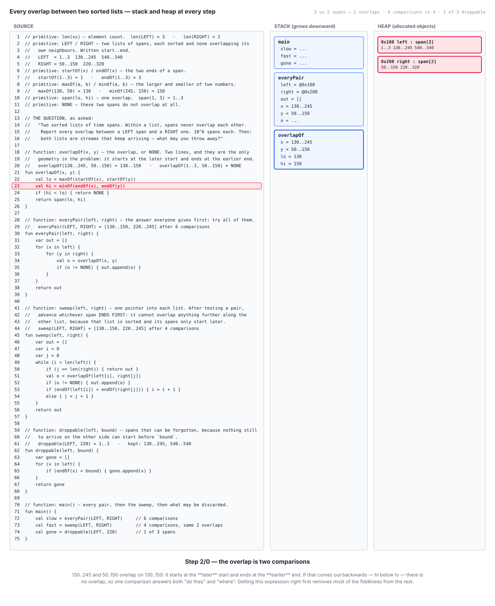

130..245 and 50..150 overlap on 130..150: it starts at the **later** start and ends at the **earlier** end. If that comes out backwards — hi below lo — there is no overlap, so one comparison answers both "do they" and "where". Getting this expression right first removes most of the fiddliness from the rest.

</details>
<details>
<summary><b>Step 3 of 12</b> — every pair: 6 comparisons</summary>

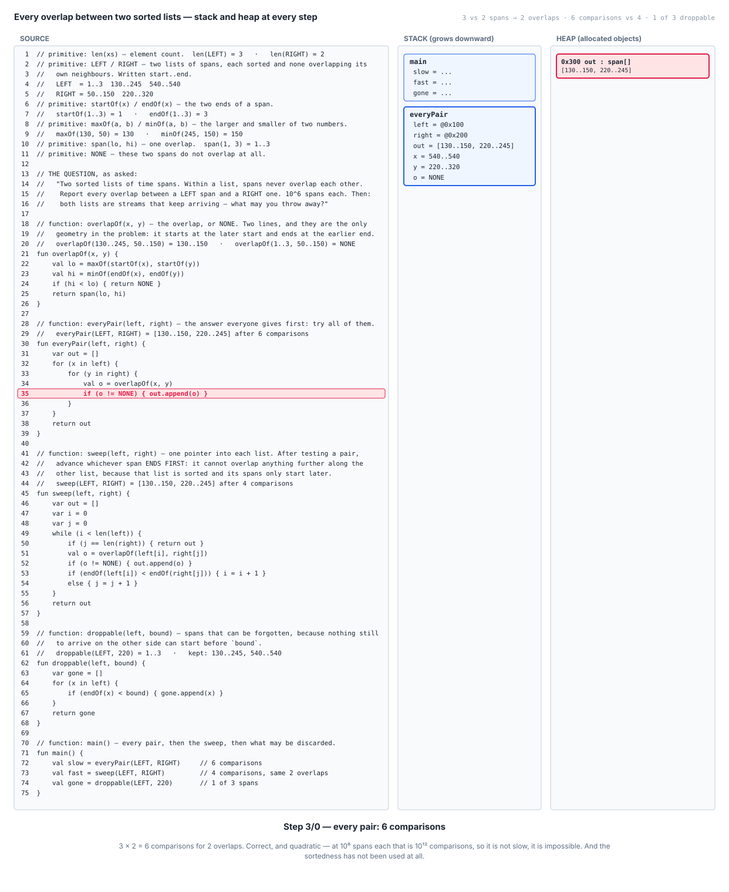

3 × 2 = 6 comparisons for 2 overlaps. Correct, and quadratic — at 10⁶ spans each that is 10¹² comparisons, so it is not slow, it is impossible. And the sortedness has not been used at all.

</details>
<details>
<summary><b>Step 4 of 12</b> — the reframe: one pointer into each</summary>

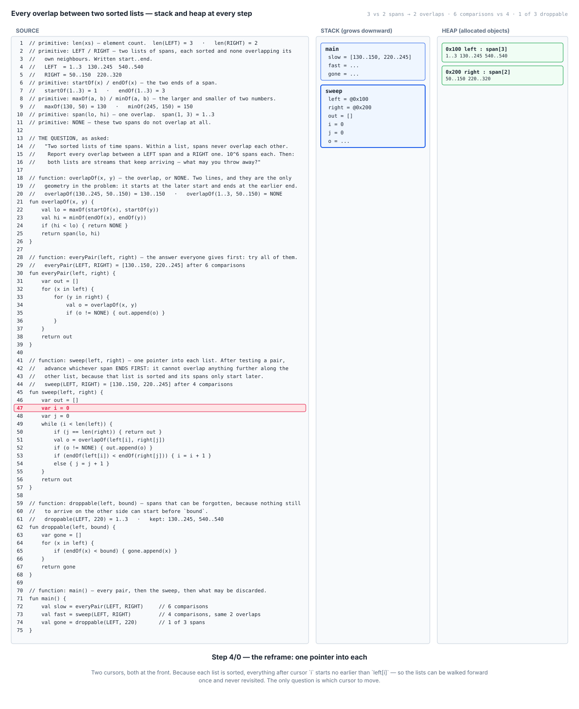

Two cursors, both at the front. Because each list is sorted, everything after cursor `i` starts no earlier than `left[i]` — so the lists can be walked forward once and never revisited. The only question is which cursor to move.

</details>
<details>
<summary><b>Step 5 of 12</b> — 1..3 ends before 50..150, so LEFT advances</summary>

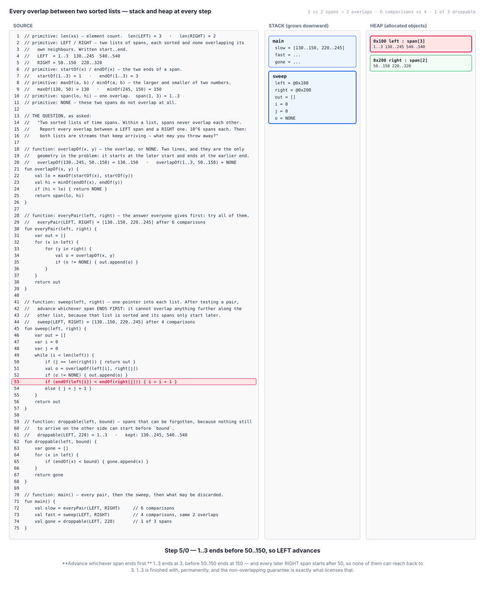

**Advance whichever span ends first.** 1..3 ends at 3, before 50..150 ends at 150 — and every later RIGHT span starts after 50, so none of them can reach back to 3. 1..3 is finished with, permanently, and the non-overlapping guarantee is exactly what licenses that.

</details>
<details>
<summary><b>Step 6 of 12</b> — and here 50..150 ends first, so RIGHT advances</summary>

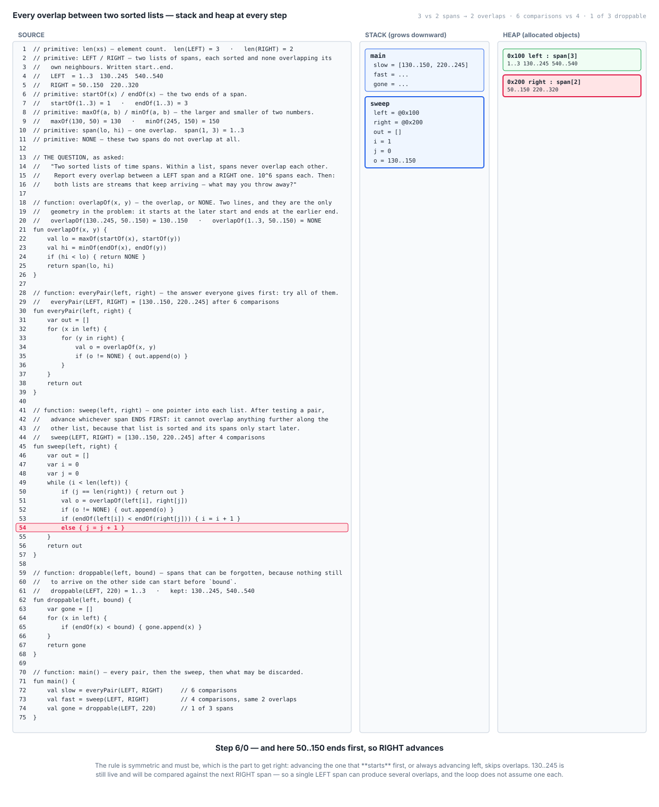

The rule is symmetric and must be, which is the part to get right: advancing the one that **starts** first, or always advancing left, skips overlaps. 130..245 is still live and will be compared against the next RIGHT span — so a single LEFT span can produce several overlaps, and the loop does not assume one each.

</details>
<details>
<summary><b>Step 7 of 12</b> — overlap 2: 220..245</summary>

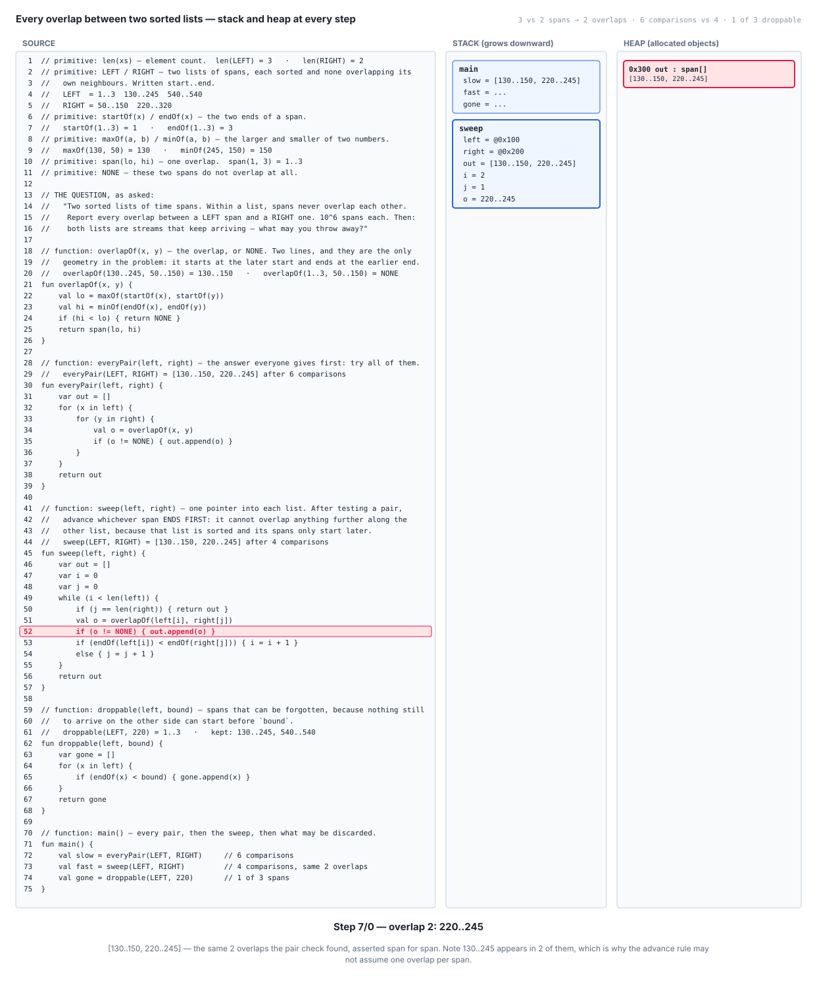

[130..150, 220..245] — the same 2 overlaps the pair check found, asserted span for span. Note 130..245 appears in 2 of them, which is why the advance rule may not assume one overlap per span.

</details>
<details>
<summary><b>Step 8 of 12</b> — a pair that does not overlap at all</summary>

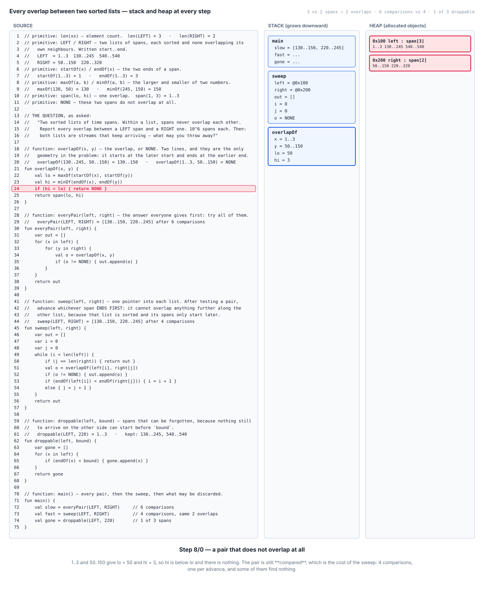

1..3 and 50..150 give lo = 50 and hi = 3, so hi is below lo and there is nothing. The pair is still **compared**, which is the cost of the sweep: 4 comparisons, one per advance, and some of them find nothing.

</details>
<details>
<summary><b>Step 9 of 12</b> — 4 comparisons against 6</summary>

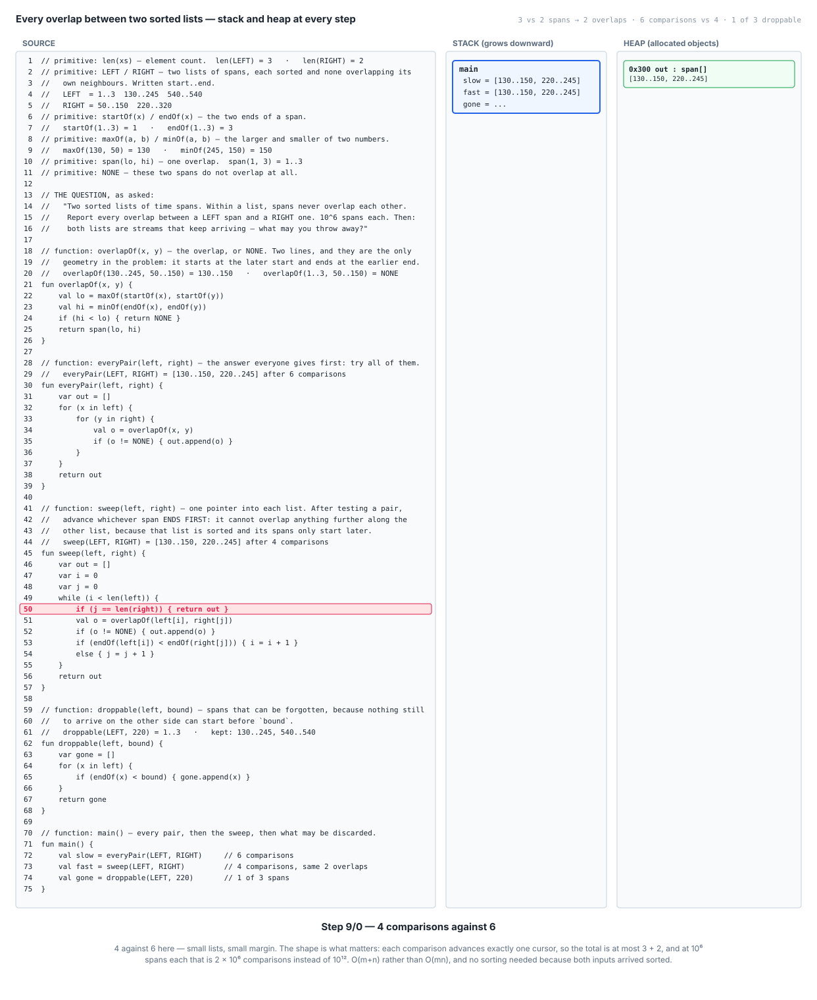

4 against 6 here — small lists, small margin. The shape is what matters: each comparison advances exactly one cursor, so the total is at most 3 + 2, and at 10⁶ spans each that is 2 × 10⁶ comparisons instead of 10¹². O(m+n) rather than O(mn), and no sorting needed because both inputs arrived sorted.

</details>
<details>
<summary><b>Step 10 of 12</b> — now the second half: both lists are streams</summary>

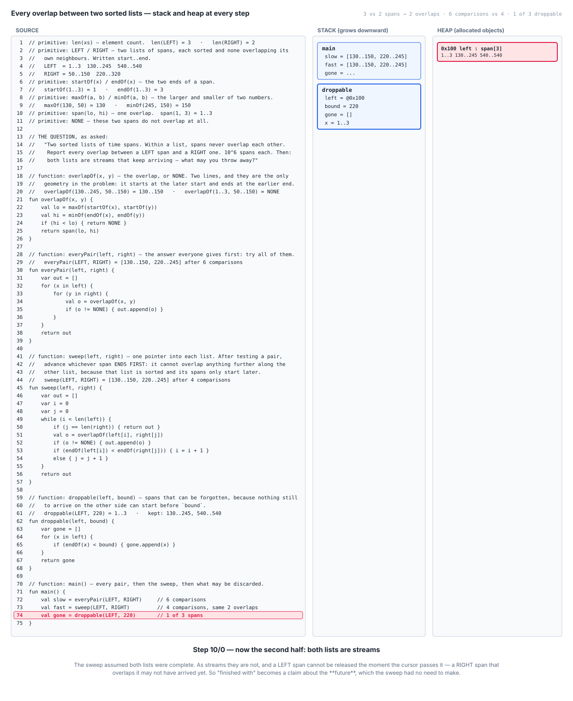

The sweep assumed both lists were complete. As streams they are not, and a LEFT span cannot be released the moment the cursor passes it — a RIGHT span that overlaps it may not have arrived yet. So "finished with" becomes a claim about the **future**, which the sweep had no need to make.

</details>
<details>
<summary><b>Step 11 of 12</b> — 1 of 3 spans may be forgotten</summary>

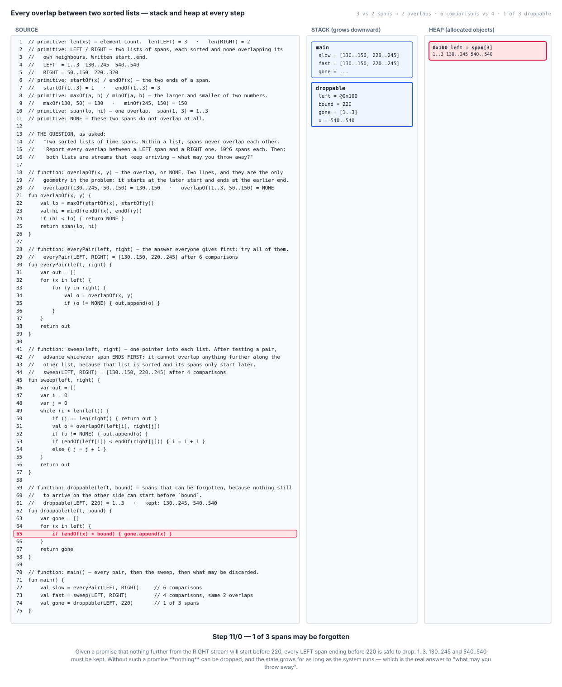

Given a promise that nothing further from the RIGHT stream will start before 220, every LEFT span ending before 220 is safe to drop: 1..3. 130..245 and 540..540 must be kept. Without such a promise **nothing** can be dropped, and the state grows for as long as the system runs — which is the real answer to "what may you throw away".

</details>
<details>
<summary><b>Step 12 of 12</b> — so the bound is the whole design</summary>

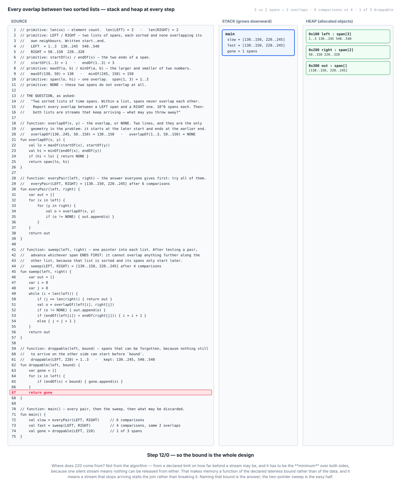

Where does 220 come from? Not from the algorithm — from a declared limit on how far behind a stream may be, and it has to be the **minimum** over both sides, because one silent stream means nothing can be released from either. That makes memory a function of the declared lateness bound rather than of the data, and it means a stream that stops arriving stalls the join rather than breaking it. Naming that bound is the answer; the two-pointer sweep is the easy half.

</details>

<sub>Locals live in the frame and vanish when it is popped; the two cursors are the whole state, which is why the sweep is O(m+n) in time and O(1) in space — and why the streaming half is hard, because a stream cannot drop what it has passed. Every figure is derived from `tools/stream_seed.js` and asserted — including that neither list overlaps itself (the guarantee the advance rule rests on), that the sweep and the pair check agree exactly, that the sweep advances each side at least once, that at least one compared pair does NOT overlap, that the sweep makes fewer comparisons, and that something is droppable while something else is not. Generated by `node tools/gen_ch09_interview.js` on `tools/interviewkit.js`.</sub>

<!-- ch09-interview-memory:end -->


## Links & The Bigger Picture

Concepts this chapter mentions but does not fully unpack are linked below — each pointer names the chapter where the concept is covered in depth and gives a concrete example that ties the two chapters together.

- **[Chapter 3: Watermarks → Propagation and correctness](ch03-watermarks.md#propagation-and-correctness)** — a windowed join is bounded by the minimum of its inputs' watermarks — the exact propagation rule ch03 defines.
  - _Example:_ ch09's "emit when both sides pass 12:05:00" is ch03's stage watermark min(12:06:00, 12:04:30) = 12:04:30: the join waits on the slower stream before emitting a match.
- **[Chapter 4: Advanced Windowing → The window lifecycle](ch04-advanced-windowing.md#the-window-lifecycle)** — a windowed join is a windowing problem — the join window assigns, buffers, and is garbage-collected by the same lifecycle ch04 covers.
  - _Example:_ ch09's join window [12:00,12:05) is ch04's fixed window; ch09's buffer holding impression 12:02 until the click probes it is ch04's assign-then-group step.
- **[Chapter 8: Streaming SQL → Joins and time in SQL](ch08-streaming-sql.md#joins-and-time-in-sql)** — streaming SQL gives the join a declarative spelling — interval joins and temporal joins with the same watermark semantics.
  - _Example:_ ch09's "match within 5 min" is ch08's INTERVAL join; ch09's stream-table enrichment (user_table[42] = tier gold) is ch08's temporal join, which emits without waiting on a watermark.
- **[Chapter 7: The Practicalities of Persistent State → Consistency and recovery](ch07-the-practicalities-of-persistent-state.md#consistency-and-recovery)** — join state is keyed state — bounded by the window and garbage-collected past window + lateness — and ch07 covers how that state is stored and recovered.
  - _Example:_ ch09's impression buffer is the join state; ch07's checkpoint { count: {42:13}, offset: 500 } is how that buffer is snapshotted so a crash does not re-buffer from the start.

## System Design Interview

> **The question:** Design a windowed join between a click stream and an impression stream for ad attribution. Premise: the join must buffer each side until both watermarks pass, and a late row arriving afterward must retract and correct the earlier attribution.

**The pipeline:** click stream + impression stream -> windowed join (buffer + watermark) -> retraction emitter -> attribution store

<a href="../diagrams/d2/decomp/ch09-0.png">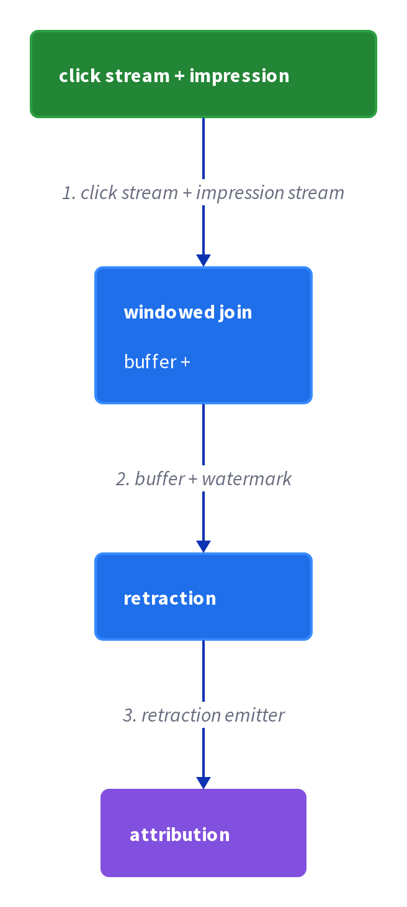</a>

### click stream + impression stream

_Role: two streams — feed the join with event-time rows_

- a click {campaign: "C1", event_time: "12:03:00"} arrives
- an impression {campaign: "C1", event_time: "12:02:00"} arrives
- each side carries its own watermark

### windowed join (buffer + watermark)

_Role: windowed join — buffers one side and matches within a window_

- the impression buffer holds rows within 5 min of a click
- the click probes the buffer and finds the 12:02 impression
- the match is held until both watermarks pass 12:05:00

### retraction emitter

_Role: retraction emitter — corrects matches when late data arrives_

- a late impression within allowed lateness changes the match
- the old match is retracted downstream
- the corrected match is emitted

### attribution store

_Role: attribution store — holds the final matches_

- the store applies retractions so old matches do not double-count
- the final state shows the corrected (click, impression) pair
- join state is garbage-collected past the window + lateness


<!-- ch09-system:begin — generated by tools/gen_ch09.js; do not hand-edit -->

#### Why this design needs to retract a negative, and what it still loses

**The question.** Join a click stream and an impression stream for ad attribution. The join must buffer each side until both watermarks pass, and a late row arriving afterwards must retract and correct the earlier attribution.

**The pipeline:** click stream + impression stream → windowed join (buffer + watermark) → retraction emitter → attribution store.

**The retraction emitter is not optional**, and its hard requirement is unusual: it must be able to retract a **negative**. Click 0 publishes "matched no impression" after event 5, and impression 7 later proves that wrong. Updating a number is easy; un-publishing an absence usually needs an explicit tombstone in the store.

**And here is what the store actually ends up with.** Of the 5 true matches in the data: **1 published correctly first time** (20%), **2 published after a retraction**, **2 never published** (40%) — from 2 clicks whose watermark bound the minimum never reaches.

The never-published group is the one that matters commercially, and the pipeline does not report it. An absent attribution looks exactly like a click that genuinely matched nothing.

**Two settings, and neither fixes the biggest loss.** Widening the join window adds candidate pairs *and* buffer, linearly. Raising allowed lateness holds buffered rows longer so late matches can emit. Neither touches the 2 clicks blocked by the minimum watermark — only an idleness timeout on the slower input does, and that trades away exactly the correctness the minimum rule was protecting.

#### When to ship this, and the four things it does not settle

**Ship it when the attribution consumer tolerates corrections**, including the withdrawal of a no-match, and when an under-count is survivable. For reporting that is usually fine; for payouts it is not.

**Instrument the undelivered case before launch.** Compute, from the retained streams, what the attribution *should* have been and compare. Nothing in the pipeline will tell you about the 2 missing matches.

**Decide the idleness policy deliberately.** It is the only lever on the never-emitted matches, and it is a correctness trade dressed as a timeout value.

**What this design does NOT settle — four gaps:**

1. **2 of the 5 true matches are never published and nothing reports it.** Absence of an attribution is indistinguishable from a genuine non-match, so this gap is invisible from inside the system.
2. **The store must retract a negative result.** "Click 0 matched nothing" is published and later false — a harder store requirement than revising a value.
3. **Buffer is arrival rate × 60s per side**, 5 rows on this stream, and both tuning knobs scale it linearly. Nothing here bounds it at a real traffic rate.
4. **One click matches 2 impressions**, so the join's output can exceed either input and somebody must decide which impression gets the credit. First touch, last touch or split is a business decision this design cannot make — and it cannot ship without one.

#### Visual walkthrough — four stages, the honest count, two knobs

The animation loops through all 4 steps. Expand any step to study it on its own.



<details>
<summary><b>Step 1 of 4</b> — the pipeline, and the stage that only this design needs</summary>


The hard requirement in this design is retracting a **negative**. "Click 0 matched no impression" is published as a fact and later becomes false, so the attribution store needs to express "forget what I said about this click" — which is harder than updating a number, and worth discovering at design time.

</details>
<details>
<summary><b>Step 2 of 4</b> — the attribution outcome, counted honestly</summary>

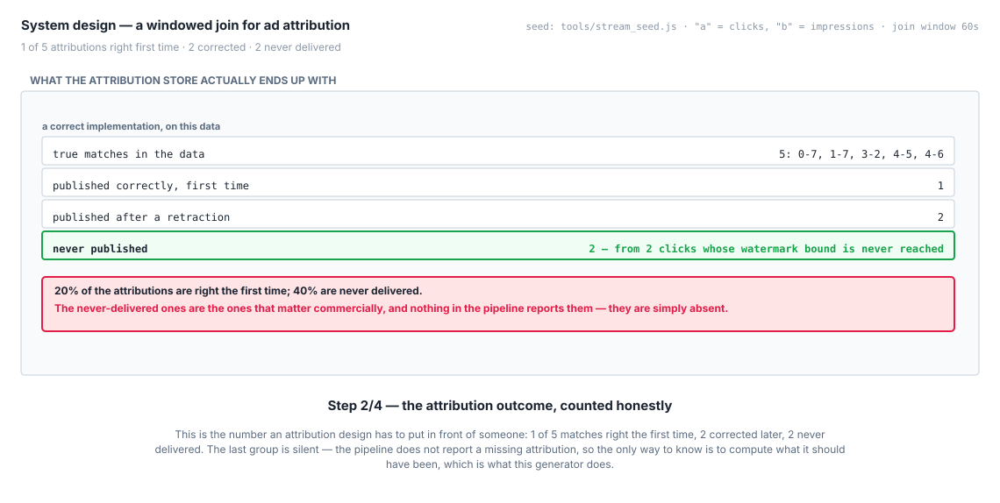

This is the number an attribution design has to put in front of someone: 1 of 5 matches right the first time, 2 corrected later, 2 never delivered. The last group is silent — the pipeline does not report a missing attribution, so the only way to know is to compute what it should have been, which is what this generator does.

</details>
<details>
<summary><b>Step 3 of 4</b> — the two settings, and what each one actually fixes</summary>

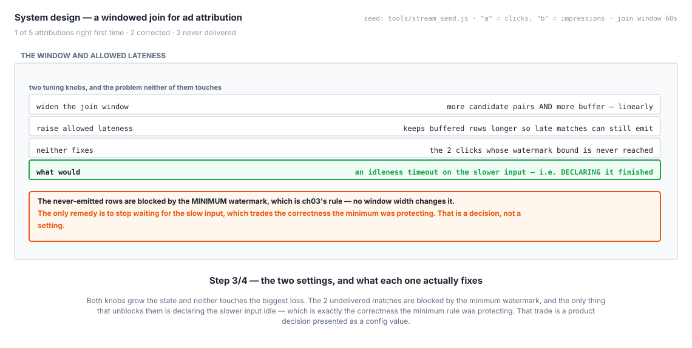

Both knobs grow the state and neither touches the biggest loss. The 2 undelivered matches are blocked by the minimum watermark, and the only thing that unblocks them is declaring the slower input idle — which is exactly the correctness the minimum rule was protecting. That trade is a product decision presented as a config value.

</details>
<details>
<summary><b>Step 4 of 4</b> — and what this design does NOT settle</summary>

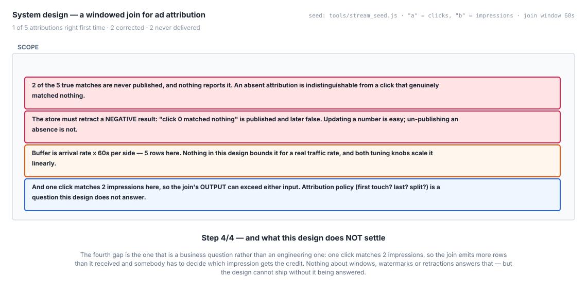

The fourth gap is the one that is a business question rather than an engineering one: one click matches 2 impressions, so the join emits more rows than it received and somebody has to decide which impression gets the credit. Nothing about windows, watermarks or retractions answers that — but the design cannot ship without it being answered.

</details>

<sub>The attribution accounting and both tuning consequences are computed from the seed and asserted. Generated by `node tools/gen_ch09.js`.</sub>

<!-- ch09-system:end -->

<!-- ch09-system-memory:begin — generated by tools/gen_ch09.js; do not hand-edit -->

#### Ad attribution — stack and heap at every step

**What is being answered.** What an attribution store has to be able to do, and what it still never learns.

The unusual requirement is retracting a **negative**. `markUnattributed` publishes `"NONE MATCHED"` for click 0 — correct from everything that had arrived — and impression 7 later proves it false.

Step 3 is why an updating sink is not enough: overwriting the row fixes the store, but a consumer that already read "NONE MATCHED" never learns otherwise. And step 4 is the quieter problem — both stores end identical, and neither mentions the 2 click that never emitted at all, holding 2 of the 5 true matches.

The animation steps through the code, holding each line long enough to read the STACK (call frames and their locals) and the HEAP (allocated arrays and objects) as they are AT THAT MOMENT. Expand any step to study it on its own.



<details>
<summary><b>Step 1 of 4</b> — the join publishes a NEGATIVE attribution</summary>


`rows[0] = "NONE MATCHED"` — a published claim that this click was never attributed. At the moment it is written it is the correct answer from everything that has arrived, which is what makes it dangerous: it is indistinguishable from a settled fact.

</details>
<details>
<summary><b>Step 2 of 4</b> — then a late impression contradicts it</summary>

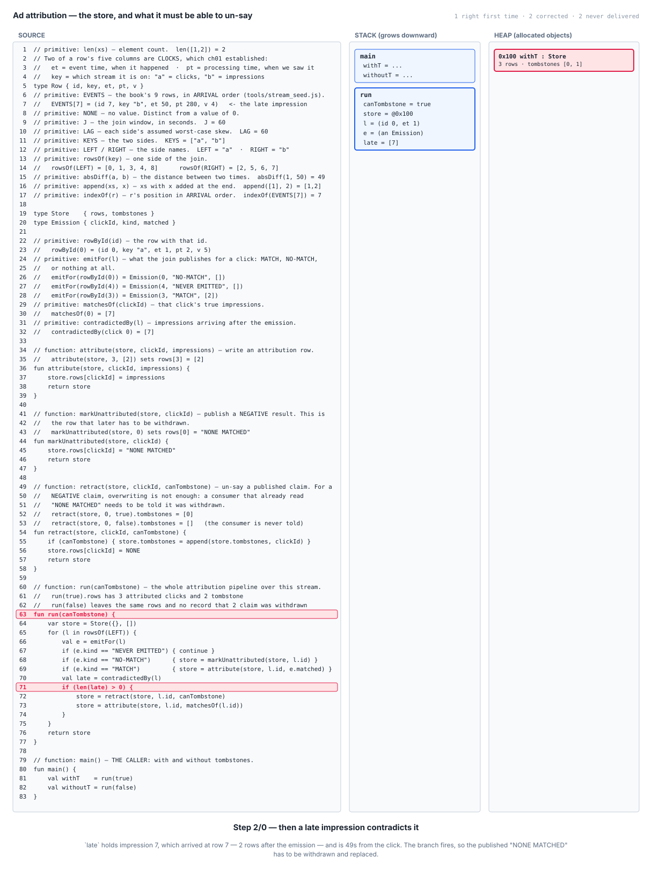

`late` holds impression 7, which arrived at row 7 — 2 rows after the emission — and is 49s from the click. The branch fires, so the published "NONE MATCHED" has to be withdrawn and replaced.

</details>
<details>
<summary><b>Step 3 of 4</b> — retracting a negative needs a TOMBSTONE, not an overwrite</summary>

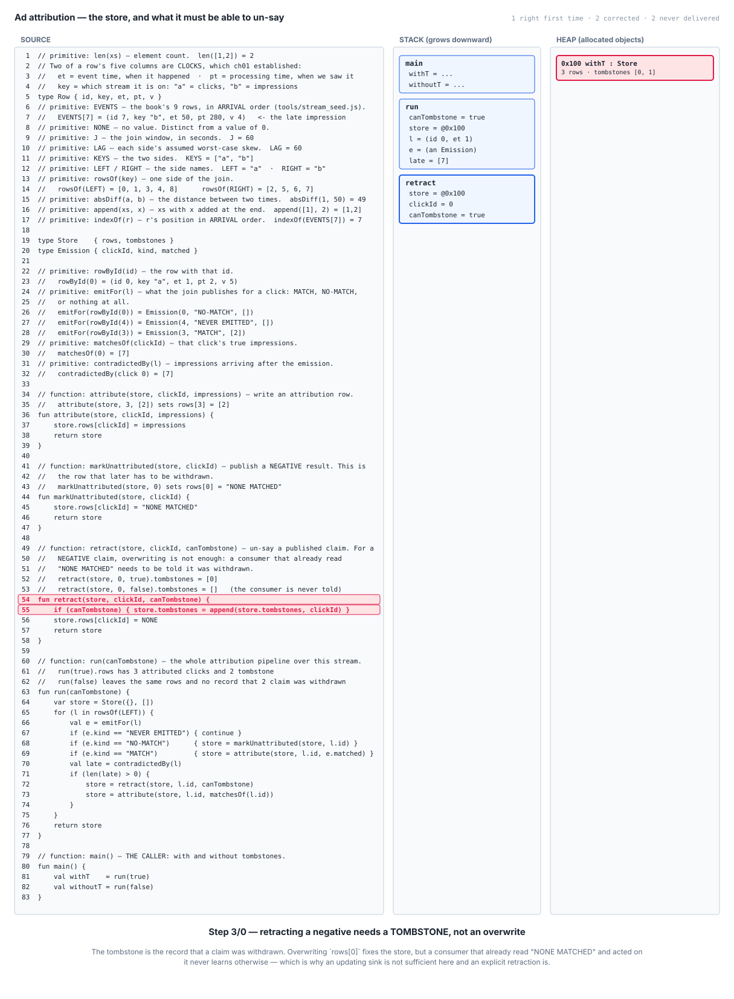

The tombstone is the record that a claim was withdrawn. Overwriting `rows[0]` fixes the store, but a consumer that already read "NONE MATCHED" and acted on it never learns otherwise — which is why an updating sink is not sufficient here and an explicit retraction is.

</details>
<details>
<summary><b>Step 4 of 4</b> — and without it the two stores look identical</summary>

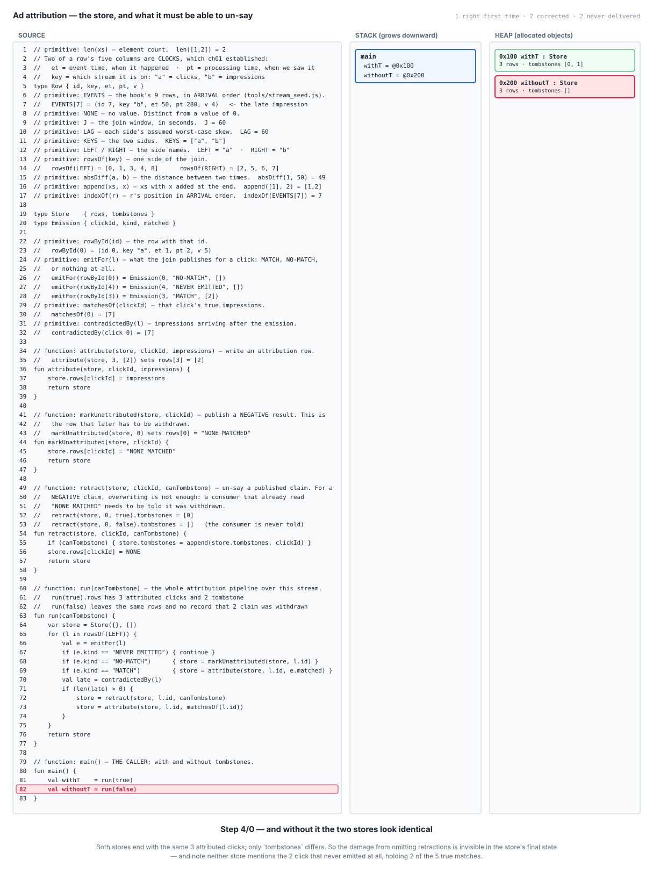

Both stores end with the same 3 attributed clicks; only `tombstones` differs. So the damage from omitting retractions is invisible in the store's final state — and note neither store mentions the 2 click that never emitted at all, holding 2 of the 5 true matches.

</details>

<sub>Both store outcomes and the full match accounting are computed from the seed and asserted. Generated by `node tools/gen_ch09.js` on `tools/memkit.js`.</sub>

<!-- ch09-system-memory:end -->

## Interview Questions

### Q1

An attribution pipeline joins ad impressions with clicks to attribute conversions, but it emits matches before a late impression could arrive, so some conversions are attributed to the wrong ad.

**Interviewer's question:** How do you join two event streams correctly when events can arrive out of order?

**Solution:** Use a windowed join bounded by a time window, and let the watermark decide when a match is complete — emit only when both sides' watermarks pass the join window, with allowed lateness and retractions for late corrections.

**System-design components:**
- Windowed join — interval bound
- Watermark — both sides pass
- Allowed lateness — late corrections
- Retraction — correct emitted matches

```java
// click 12:03, impression 12:02, window 5 min
//   impressions wm 12:04:30 < 12:05 -> hold
//   impressions wm -> 12:06 -> both pass -> emit
//   late impression 12:01 -> retract old, emit corrected
```

_This is exactly the windowed-join and watermark material in this chapter._

_Covers:_ 2. Windowed joins · 5. Watermarks bound the wait · 6. Late data and retractions

_From the 28 problems:_ 21-ad-click-aggregation

### Q2

A click stream needs each click enriched with the user's current subscription tier before aggregation, and the tier changes over time.

**Interviewer's question:** How do you join a stream to a slowly-changing table correctly?

**Solution:** Use a temporal (stream-table) join — probe the table at the join key for the version current at the event's time, rather than a windowed join.

**System-design components:**
- Temporal join — lookup
- Table — changelog-backed
- Join key — user id

```java
// click {user:42, event_time:12:03}
//   probe user_table[42] = {tier: gold}
//   -> click + tier=gold, no window needed
```

_This is exactly the temporal-join material in this chapter._

_Covers:_ 3. Temporal joins · 8. Stream-stream vs stream-table confusion

_From the 28 problems:_ 21-ad-click-aggregation

## Key Concepts

### The Problem

**1. Unbounded joins never finish.** A streaming join needs a time bound — a window or a table lookup — to decide when a match is complete.


### The Solution

A windowed join matches rows whose time attributes are within a window of each other.

```java
// click 12:03, impression 12:02, window 5 min
//   impressions wm 12:04:30 < 12:05 -> hold
//   impressions wm -> 12:06 -> both pass -> emit
//   late impression 12:01 -> retract old, emit corrected
```


### Key Facts

| Fact | Detail | In the wild |
|---|---|---|
| 2. Windowed joins | A windowed join matches rows whose time attributes are within a window of each other. | Flink SQL interval joins are the production form. |
| 3. Temporal joins | A temporal join enriches each stream row with the table version current at its event time. | Flink SQL temporal joins against a changelog table. |
| 4. Join state | Join state buffers one side until the other catches up, bounded by the join window. | Flink holds the buffered side in managed state. |
| 5. Watermarks bound the wait | A join emits when both sides' watermarks pass the join window. | Flink SQL fires interval joins on the watermark. |
| 6. Late data and retractions | Allowed lateness keeps join state alive, and a corrected match retracts the old one before emitting. | Retract streams in Flink SQL correct emitted joins. |
| 7. Garbage-collect join state | Join state is garbage-collected when the watermark passes the window plus allowed lateness. | Flink cleans up interval-join state past the window + lateness. |
| 8. Stream-stream vs stream-table confusion | Join two streams with a window; join a stream to a table with a temporal lookup. | A common bug is a windowed join where a temporal lookup was intended. |


### Tradeoffs & When

- Join state is garbage-collected when the watermark passes the window plus allowed lateness.
- Join two streams with a window; join a stream to a table with a temporal lookup.


### Real-World Examples

- **Flink SQL** — Interval (windowed) joins and temporal joins
- **Apache Beam** — CoGroupByKey as the join primitive with windowing
- **Kafka Streams** — Stream-stream (windowed) and stream-table joins over topics


<details><summary>All concepts (index)</summary>

### Why: 1. Unbounded joins never finish

**Why.** Two unbounded streams have no natural join boundary, so a naive join buffers forever.

**Claim.** A streaming join needs a time bound — a window or a table lookup — to decide when a match is complete.

**Grounding.** The book's central streaming-join point is bounding the unbounded.

**In the wild.** Flink SQL requires an interval for stream-stream joins.

<a href="../diagrams/d2/card/ch09-0.png">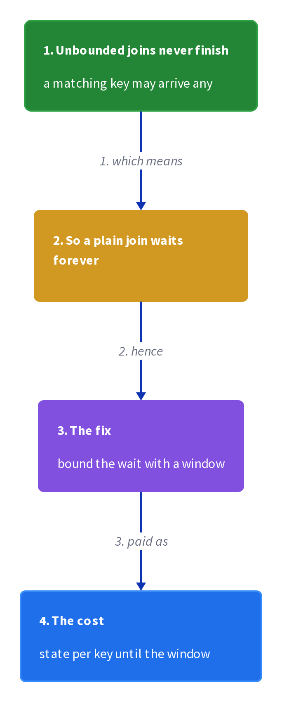</a>
### Stream-stream: 2. Windowed joins

**Why.** Two streams need a time window to bound which rows can match.

**Claim.** A windowed join matches rows whose time attributes are within a window of each other.

**Grounding.** The window bounds the buffer and the watermark bounds the wait.

**In the wild.** Flink SQL interval joins are the production form.

<a href="../diagrams/d2/card/ch09-1.png">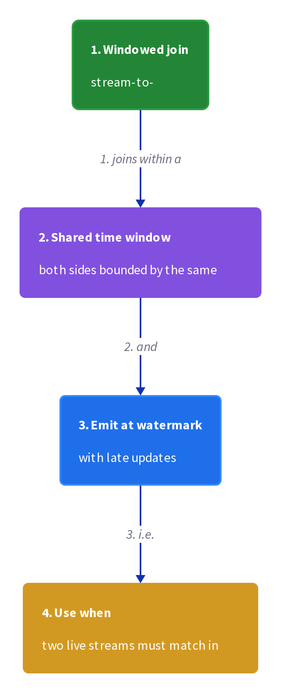</a>
### Stream-table: 3. Temporal joins

**Why.** Enriching a stream against a slowly-changing table is a lookup, not a windowed match.

**Claim.** A temporal join enriches each stream row with the table version current at its event time.

**Grounding.** The table is finite per key, so no window is needed.

**In the wild.** Flink SQL temporal joins against a changelog table.

<a href="../diagrams/d2/card/ch09-2.png">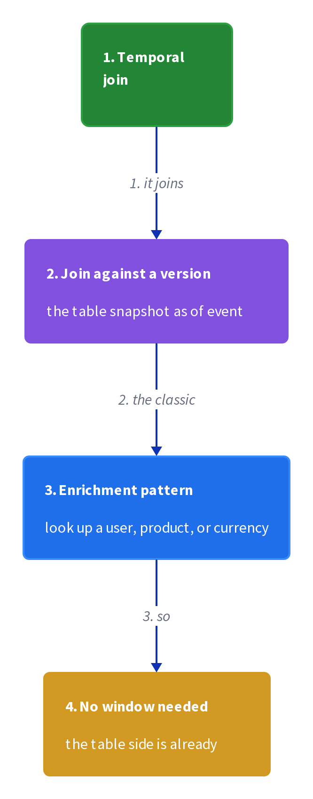</a>
### Buffer: 4. Join state

**Why.** Rows from one side must wait for their counterpart on the other side.

**Claim.** Join state buffers one side until the other catches up, bounded by the join window.

**Grounding.** The buffer is what makes a streaming join possible.

**In the wild.** Flink holds the buffered side in managed state.

<a href="../diagrams/d2/card/ch09-3.png">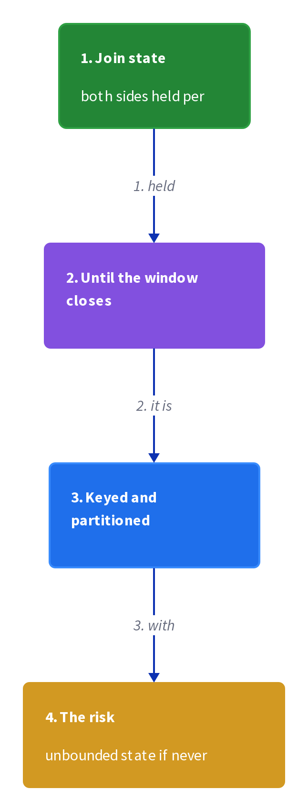</a>
### Signal: 5. Watermarks bound the wait

**Why.** The pipeline needs to know when no more matching rows will arrive for a time range.

**Claim.** A join emits when both sides' watermarks pass the join window.

**Grounding.** Completeness is bounded by the slower stream.

**In the wild.** Flink SQL fires interval joins on the watermark.

<a href="../diagrams/d2/card/ch09-4.png">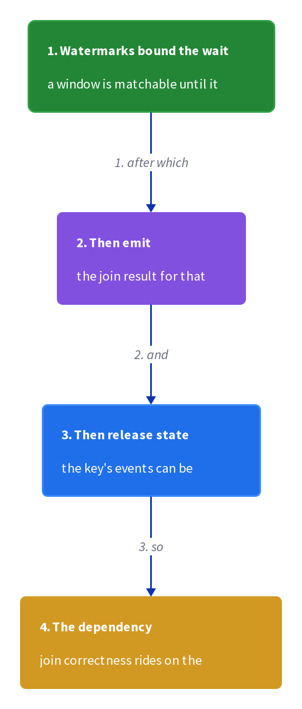</a>
### Correctness: 6. Late data and retractions

**Why.** A late row can arrive after a match was emitted and change it.

**Claim.** Allowed lateness keeps join state alive, and a corrected match retracts the old one before emitting.

**Grounding.** The same accumulation discipline as windows applies to joins.

**In the wild.** Retract streams in Flink SQL correct emitted joins.

<a href="../diagrams/d2/card/ch09-5.png">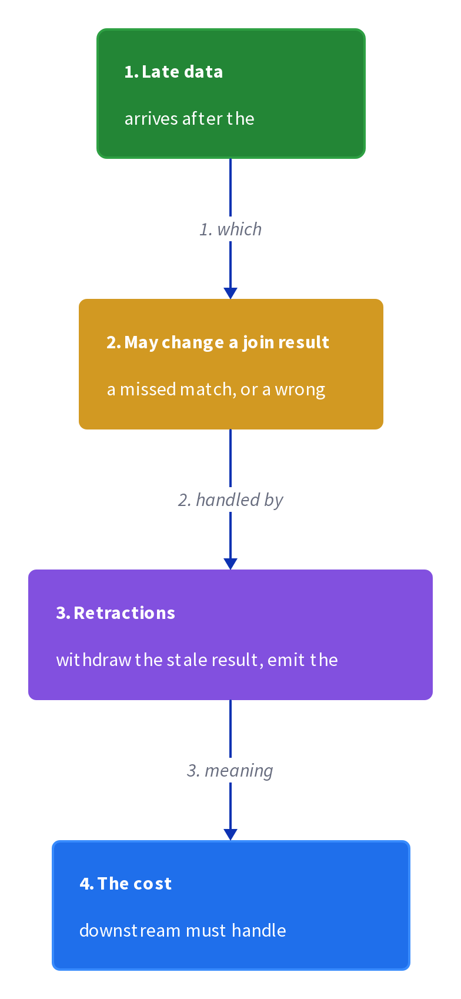</a>
### Growth: 7. Garbage-collect join state

**Why.** A join buffer that never shrinks exhausts memory.

**Claim.** Join state is garbage-collected when the watermark passes the window plus allowed lateness.

**Grounding.** The window and allowed lateness together bound the state.

**In the wild.** Flink cleans up interval-join state past the window + lateness.

<a href="../diagrams/d2/card/ch09-6.png">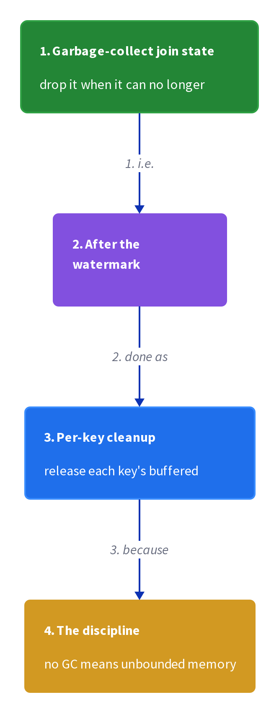</a>
### Mistake: 8. Stream-stream vs stream-table confusion

**Why.** Applying the wrong join type produces unbounded buffers or wrong matches.

**Claim.** Join two streams with a window; join a stream to a table with a temporal lookup.

**Grounding.** The input type — unbounded vs finite-per-key — picks the join type.

**In the wild.** A common bug is a windowed join where a temporal lookup was intended.

<a href="../diagrams/d2/card/ch09-7.png">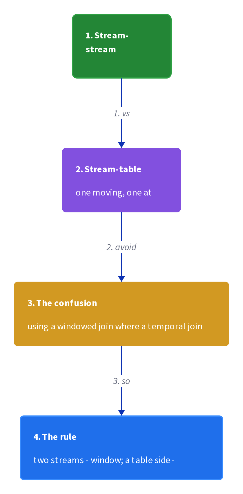</a>

</details>


## Quiz

1. Why do stream-stream joins need a time bound?

   - A. To save CPU
   - B. Two unbounded streams have no natural join boundary
   - C. To create watermarks
   - D. To reduce latency

<details><summary>Reveal answer</summary>

**B.** Without a time bound, a stream-stream join would buffer forever.

</details>

2. What is a windowed join?

   - A. A lookup against a table
   - B. A join matching rows within a time window of each other
   - C. A join with no state
   - D. A batch join

<details><summary>Reveal answer</summary>

**B.** A windowed join matches rows whose time attributes fall within a window.

</details>

3. What is a temporal join?

   - A. A join of two streams in a window
   - B. Enriching a stream against a table version current at event time
   - C. A join with no key
   - D. A join of two tables

<details><summary>Reveal answer</summary>

**B.** A temporal join probes a table at the join key for the current version.

</details>

4. When does a windowed join emit a match?

   - A. When the first row arrives
   - B. When both sides' watermarks pass the join window
   - C. Every second
   - D. When the buffer is empty

<details><summary>Reveal answer</summary>

**B.** The join waits until both streams are complete for the window.

</details>

5. How is join state bounded?

   - A. It is never bounded
   - B. By garbage-collecting past the window plus allowed lateness
   - C. By the CPU
   - D. By the number of keys

<details><summary>Reveal answer</summary>

**B.** State past the window + allowed lateness is garbage-collected.

</details>

## Sources

- [Apache Flink — SQL joins](https://nightlies.apache.org/flink/flink-docs-stable/docs/dev/table/sql/queries/joins/) — Interval and temporal joins and their watermark semantics
- [Akidau et al. — "The Dataflow Model" (VLDB 2015)](https://www.vldb.org/pvldb/vol8/p1792-Akidau.pdf) — Join semantics under the streaming model
- [Apache Beam programming guide](https://beam.apache.org/documentation/programming-guide/) — CoGroupByKey as the join primitive
- [Apache Kafka — Kafka Streams documentation](https://kafka.apache.org/documentation/streams/) — Stream-stream and stream-table joins over topics

