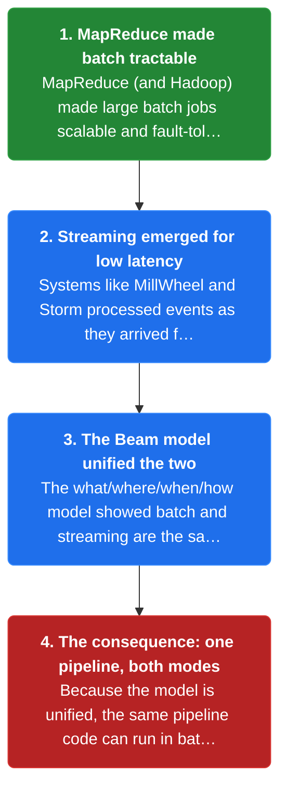
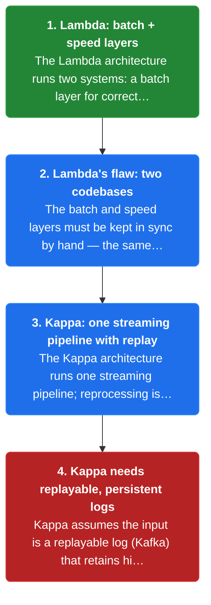
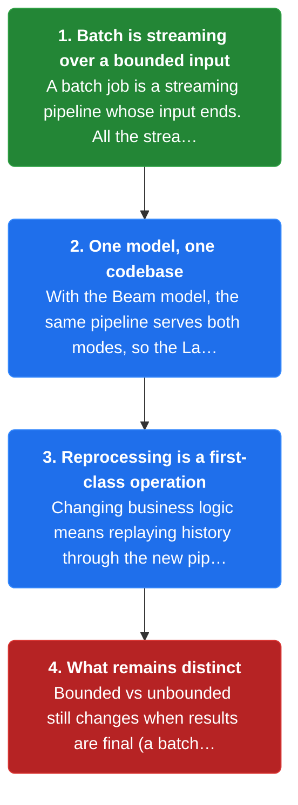
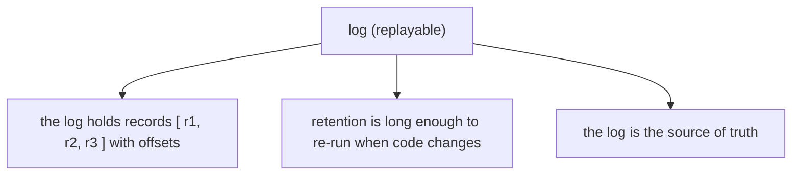
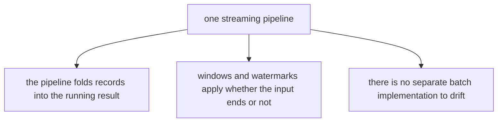
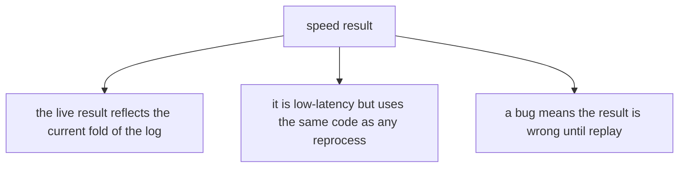
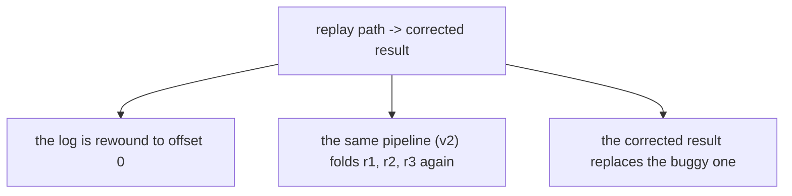
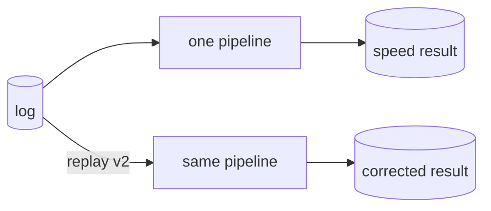
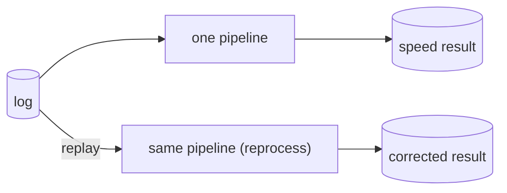
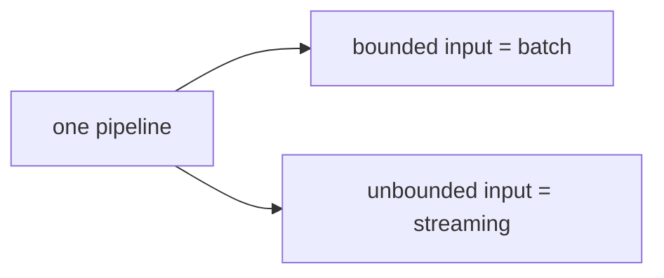

# Chapter 10: The Evolution of Large-Scale Data Processing

> The field moved from batch MapReduce, through the Lambda architecture (batch + speed layers), to the Kappa architecture (one streaming pipeline with replay) — and the Beam model unifies batch and streaming as one thing.

_Also known as: SS Ch10 · Lambda Architecture · Kappa Architecture · Batch-Stream Unification · MapReduce · Reprocessing_

## Flow

### From MapReduce to streaming

> **Why this matters:** The evolution of data processing explains why streaming systems look the way they do, so this section traces the arc from batch to the Beam model.



1. **MapReduce made batch tractable** — MapReduce (and Hadoop) made large batch jobs **scalable and fault-tolerant**, but it was built for finite datasets and had high latency.

2. **Streaming emerged for low latency** — Systems like MillWheel and Storm processed events as they arrived for **low-latency** results, but early versions lacked the correctness of batch (no event time, no watermarks).

3. **The Beam model unified the two** — The what/where/when/how model showed batch and streaming are **the same computation over bounded vs unbounded data** — batch is just streaming over a finite input.

4. **The consequence: one pipeline, both modes** — Because the model is unified, **the same pipeline code can run in batch or streaming** — the only difference is whether the input is bounded.

```java
// UNIFICATION SIDE — the same windowed sum runs over a finite file (batch) and an infinite stream (streaming)
// DEF: pipeline — a windowed sum over 5-min fixed windows
// DEF: batch — the same pipeline over a finite file of 3 records
// DEF: streaming — the same pipeline over an unbounded feed
// -> input : the pipeline is given a bounded file of 3 records or an unbounded stream
//    step 1 · batch run over the file -> the pipeline reads all 3 records -> result : {} -> { "12:00": 3 }
//    step 2 · streaming run over the feed -> the pipeline reads the same 3 records as they arrive -> result : {} -> { "12:00": 3 }
//    step 3 · the only difference is the input -> bounded vs unbounded -> the computation is identical
// <- outcome : the batch and streaming runs both give { "12:00": 3 }   BECAUSE the windowed sum is the same over bounded and unbounded data
//    derivation : batch = streaming over a finite input, so one pipeline serves both modes
```

### Lambda and Kappa

> **Why this matters:** Two architectures tried to reconcile batch correctness with streaming latency, and the difference between them is the difference between dual codebases and one pipeline, so this section contrasts them.



1. **Lambda: batch + speed layers** — The Lambda architecture runs **two systems**: a batch layer for correct results and a speed layer for low-latency approximations. Both compute the same logic.

2. **Lambda's flaw: two codebases** — The batch and speed layers must be kept **in sync by hand** — the same aggregation written twice, in two systems, which drift apart. **That duplication is Lambda's core cost.**

3. **Kappa: one streaming pipeline with replay** — The Kappa architecture runs **one streaming pipeline**; reprocessing is done by replaying the log through the same code. **No second codebase.**

4. **Kappa needs replayable, persistent logs** — Kappa assumes the input is a **replayable log** (Kafka) that retains history long enough to re-run the pipeline when the code changes.

```java
// LAMBDA vs KAPPA SIDE — one aggregation written twice vs written once and replayed
// DEF: lambda — a batch layer and a speed layer computing the same sum in 2 codebases
// DEF: kappa — one streaming pipeline, reprocessing by replaying the log = 1 codebase
// DEF: log — the replayable input history = [ +1, +1, +1 ]
// -> input : the aggregation changes from SUM to COUNT DISTINCT on 3 records, and must be recomputed
//    step 1 · Lambda path -> the change is written in the batch layer AND the speed layer -> 2 edits -> drift risk
//    step 2 · Kappa path -> the change is written once -> 1 edit -> the log is replayed through the new code
//    step 3 · Kappa replays the log -> result : {} -> { distinct: 1 }   BECAUSE the same 3 records re-run through the new pipeline
// <- outcome : Lambda needs 2 synchronized edits, Kappa needs 1 edit + replay   BECAUSE Kappa has one codebase
//    derivation : Kappa reprocess = replay 3 records through new code, no second implementation to keep in sync
```

### Batch and streaming converge

> **Why this matters:** The end of the arc is convergence — batch as a special case of streaming — and this section draws the practical consequences for how systems are built today.



1. **Batch is streaming over a bounded input** — A batch job is a streaming pipeline whose input **ends**. **All the streaming machinery — windows, watermarks, triggers — still applies**, just with a finite input.

2. **One model, one codebase** — With the Beam model, **the same pipeline serves both modes**, so the Lambda duplication disappears. The choice becomes an execution detail, not a rewrite.

3. **Reprocessing is a first-class operation** — Changing business logic means **replaying history through the new pipeline** — the Kappa pattern. The log is the source of truth; the pipeline is disposable.

4. **What remains distinct** — Bounded vs unbounded still changes **when results are final** (a batch run ends; a stream waits on watermarks). The model unifies the how, not the fact that streams never end.

```java
// REPROCESSING SIDE — a bug fix is deployed and history is replayed through the new pipeline
// DEF: log — the retained input history = 3 records [ r1, r2, r3 ]
// DEF: pipeline_v2 — the fixed pipeline code that replaces the buggy v1
// DEF: replay — re-running the log through the new code from the start
// -> input : a bug in v1 is found and pipeline_v2 is deployed
//    step 1 · the log is rewound to the start -> offset : 3 -> 0   BECAUSE reprocessing begins from the first record
//    step 2 · the log is replayed through v2 -> result : {} -> { correct_total: 3 }   BECAUSE the fixed code folds r1, r2, r3
//    step 3 · the old v1 result is replaced -> result : { wrong_total: 4 } -> { correct_total: 3 }   BECAUSE v2 supersedes v1
// <- outcome : history is recomputed to { correct_total: 3 } without a second batch system   BECAUSE replay + one codebase is the Kappa pattern
//    derivation : reprocess = fold 3 records through pipeline_v2, then swap the result table
```


## System Design Interview

**The pipeline:** log (replayable) -> one streaming pipeline -> speed result; replay path -> same pipeline -> corrected result

### log (replayable)

_Role: log — retains input history for replay_



### one streaming pipeline

_Role: one streaming pipeline — the only codebase_



### speed result

_Role: speed result — the live output_



### replay path -> corrected result

_Role: replay path — recomputes history after a code change_





```java
// SYSTEM DESIGN — a bug fix is deployed once and history is replayed through the same pipeline
// DEF: log — the retained input history = 3 records [ r1, r2, r3 ]
// DEF: pipeline_v2 — the fixed pipeline that replaces buggy v1
// DEF: replay — re-running the log through the new code from offset 0
// DEF: result — the pipeline's output table = { wrong_total: 4 }
// STATE (before):
//    result_table : { wrong_total: 4 }
// -> input : a bug in v1 is found and pipeline_v2 is deployed
//    step 1 · the log rewinds -> offset : 3 -> 0   BECAUSE reprocessing starts from the first record
//    step 2 · the log replays through v2 -> result_table : { wrong_total: 4 } -> { correct_total: 3 }   BECAUSE the fixed code folds r1, r2, r3
//    step 3 · the corrected result swaps in -> the buggy v1 output is superseded   BECAUSE v2 is the single codebase
// <- outcome : history is recomputed to { correct_total: 3 } with 1 edit and 1 replay   BECAUSE the Kappa pattern has no second implementation
//    derivation : reprocess = fold 3 records through pipeline_v2, then replace the result table
```

## Interview Questions

### Q1

A team runs a batch job and a streaming job that compute the same metric, and the two numbers disagree — the batch and speed layers have drifted.

**Interviewer's question:** How do you avoid maintaining two divergent implementations of the same computation?

**Solution:** Adopt the Kappa pattern: one streaming pipeline, and reprocess by replaying the retained log through the same code — batch becomes a replay of the same pipeline, not a separate codebase.

**System-design components:**
- One pipeline — Kappa
- Replayable log — Kafka
- Reprocessing — replay history
- Unified model — batch = bounded streaming



```java
// lambda: batch code + speed code -> drift
// kappa : one code, replay log -> no drift
//   bug fix -> edit once -> replay history -> swap result
```

_This is exactly the Lambda vs Kappa material in this chapter._

_Covers:_ 2. Lambda architecture · 3. Kappa architecture · 5. Reprocessing via replay

_From the 28 problems:_ 20-metrics-monitoring · 21-ad-click-aggregation

### Q2

An analyst asks why the company maintains separate batch and streaming pipelines when the business logic is identical.

**Interviewer's question:** Are batch and streaming really the same thing, and how would you unify them?

**Solution:** Yes — batch is streaming over a bounded input. Use a unified model (Beam) so one pipeline runs both modes, and reprocess via replay when logic changes.

**System-design components:**
- Unified model — Beam
- Bounded vs unbounded input
- One codebase



```java
// same windowed sum
//   batch    : read 3 records -> result {12:00: 3}
//   streaming: read 3 records as they arrive -> {12:00: 3}
//   -> identical computation, different input
```

_This is exactly the batch-as-a-special-case material in this chapter._

_Covers:_ 1. Batch and streaming were separate worlds · 4. Batch is a special case

_From the 28 problems:_ 20-metrics-monitoring

## Key Concepts

### The Problem

**1. Batch and streaming were separate worlds.** The Beam model showed batch and streaming are the same computation over bounded vs unbounded data.


### The Solution

Lambda runs a batch layer (correct) and a speed layer (low-latency) computing the same logic in two codebases.


### Key Facts

| Fact | Detail | In the wild |
|---|---|---|
| 2. Lambda architecture | Lambda runs a batch layer (correct) and a speed layer (low-latency) computing the same logic in two codebases. | Nathan Marz's Lambda architecture from the Hadoop era. |
| 3. Kappa architecture | Kappa runs one streaming pipeline and reprocesses by replaying the log through the same code. | Jay Kreps' Kappa architecture on top of Kafka. |
| 4. Batch is a special case | Batch is streaming over a bounded input — windows, watermarks, and triggers still apply, just with an input that ends. | Beam runs batch pipelines with the same windowing as streaming. |
| 5. Reprocessing via replay | Reprocessing replays the retained log through the new pipeline — the Kappa pattern. | Kafka retention + replay is the production form. |
| 6. Replayable logs | Kappa assumes a replayable, persistent log (Kafka) with enough retention to re-run when code changes. | Kafka topic retention is the Kappa prerequisite. |
| 7. Lambda vs Kappa | Lambda pays dual-codebase drift; Kappa pays log retention and replay time. | Most modern systems choose Kappa-style, given a replayable log. |
| 8. What stays distinct | Bounded vs unbounded still changes when results are final — a batch run ends, a stream waits on watermarks. | Streaming jobs run until stopped; batch jobs terminate. |


### Tradeoffs & When

- Lambda pays dual-codebase drift; Kappa pays log retention and replay time.
- Bounded vs unbounded still changes when results are final — a batch run ends, a stream waits on watermarks.


### Real-World Examples

- **Apache Beam** — One pipeline that runs in batch or streaming mode
- **Kafka + Kappa** — Replayable log enabling one-pipeline reprocessing
- **Google MillWheel / Dataflow** — The lineage from early streaming to the unified model


<details><summary>All concepts (index)</summary>

### Why: 1. Batch and streaming were separate worlds

**Why.** Batch had correctness and fault tolerance; streaming had low latency but weak correctness — and teams had to choose.

**Claim.** The Beam model showed batch and streaming are the same computation over bounded vs unbounded data.

**Grounding.** The book's thesis is that the two converge.

**In the wild.** Beam, Flink, and Dataflow all run the same pipeline in both modes.
### Architecture: 2. Lambda architecture

**Why.** To get both correct and low-latency results, run two layers.

**Claim.** Lambda runs a batch layer (correct) and a speed layer (low-latency) computing the same logic in two codebases.

**Grounding.** The duplication is the core cost — the layers drift.

**In the wild.** Nathan Marz's Lambda architecture from the Hadoop era.
### Architecture: 3. Kappa architecture

**Why.** Eliminating the second codebase removes the drift.

**Claim.** Kappa runs one streaming pipeline and reprocesses by replaying the log through the same code.

**Grounding.** One codebase, no synchronization.

**In the wild.** Jay Kreps' Kappa architecture on top of Kafka.
### Insight: 4. Batch is a special case

**Why.** If the model is unified, batch needs no separate machinery.

**Claim.** Batch is streaming over a bounded input — windows, watermarks, and triggers still apply, just with an input that ends.

**Grounding.** This is the consequence of the Beam model.

**In the wild.** Beam runs batch pipelines with the same windowing as streaming.
### Operation: 5. Reprocessing via replay

**Why.** Business logic changes, so history must be recomputed under the new logic.

**Claim.** Reprocessing replays the retained log through the new pipeline — the Kappa pattern.

**Grounding.** The log is the source of truth; the pipeline is disposable.

**In the wild.** Kafka retention + replay is the production form.
### Requirement: 6. Replayable logs

**Why.** Replay-based reprocessing requires the input history to be retained and re-readable.

**Claim.** Kappa assumes a replayable, persistent log (Kafka) with enough retention to re-run when code changes.

**Grounding.** Without retention, history cannot be replayed.

**In the wild.** Kafka topic retention is the Kappa prerequisite.
### Cost: 7. Lambda vs Kappa

**Why.** The architectures differ in what they pay for correctness and latency.

**Claim.** Lambda pays dual-codebase drift; Kappa pays log retention and replay time.

**Grounding.** Kappa's cost is storage and recompute, not coordination.

**In the wild.** Most modern systems choose Kappa-style, given a replayable log.
### Remaining: 8. What stays distinct

**Why.** Unification does not make streams finite.

**Claim.** Bounded vs unbounded still changes when results are final — a batch run ends, a stream waits on watermarks.

**Grounding.** The model unifies the how, not the fact that streams never end.

**In the wild.** Streaming jobs run until stopped; batch jobs terminate.

</details>


## Quiz

1. What is the core cost of the Lambda architecture?

   - A. High latency
   - B. Two codebases that drift apart
   - C. Low throughput
   - D. No fault tolerance

<details><summary>Reveal answer</summary>

**B.** Lambda runs the same logic in a batch layer and a speed layer that must be kept in sync.

</details>

2. How does Kappa reprocess data?

   - A. A separate batch system
   - B. Replaying the log through the same pipeline
   - C. A second codebase
   - D. Manual fixes

<details><summary>Reveal answer</summary>

**B.** Kappa replays the retained log through the one streaming pipeline.

</details>

3. What is batch in the unified model?

   - A. A separate paradigm
   - B. Streaming over a bounded input
   - C. A faster streaming mode
   - D. A type of window

<details><summary>Reveal answer</summary>

**B.** Batch is just streaming over an input that ends.

</details>

4. What does reprocessing require?

   - A. A second codebase
   - B. A replayable, persistent log
   - C. A batch layer
   - D. No state

<details><summary>Reveal answer</summary>

**B.** Replay needs retained, re-readable input history.

</details>

5. What stays distinct between batch and streaming after unification?

   - A. The window types
   - B. When results are final — batch ends, streams wait on watermarks
   - C. The transform logic
   - D. The key grouping

<details><summary>Reveal answer</summary>

**B.** The model unifies the how, not the fact that streams never end.

</details>

