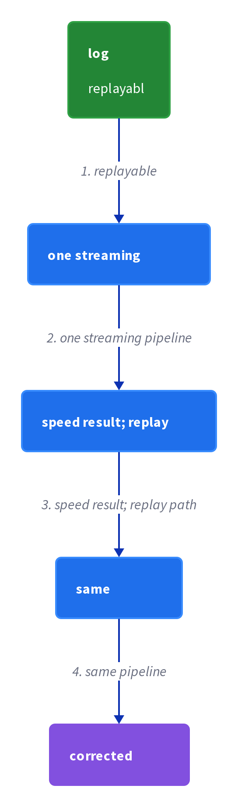
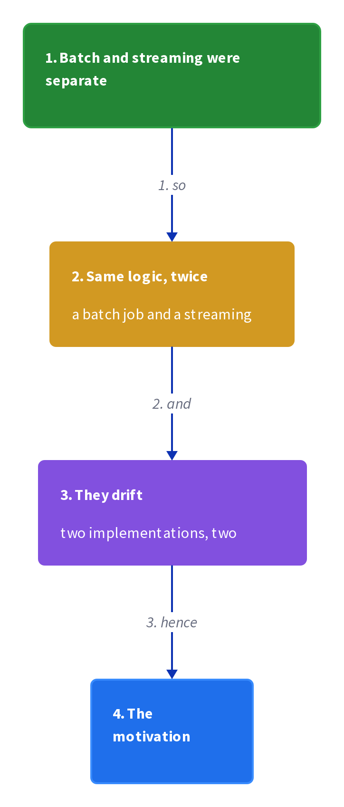
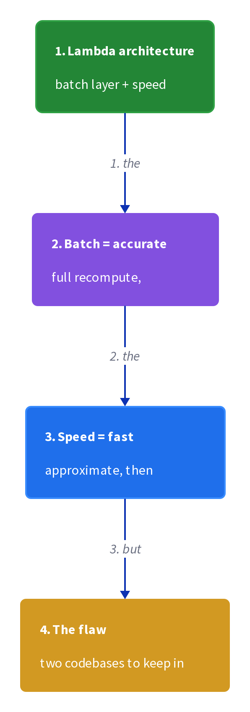
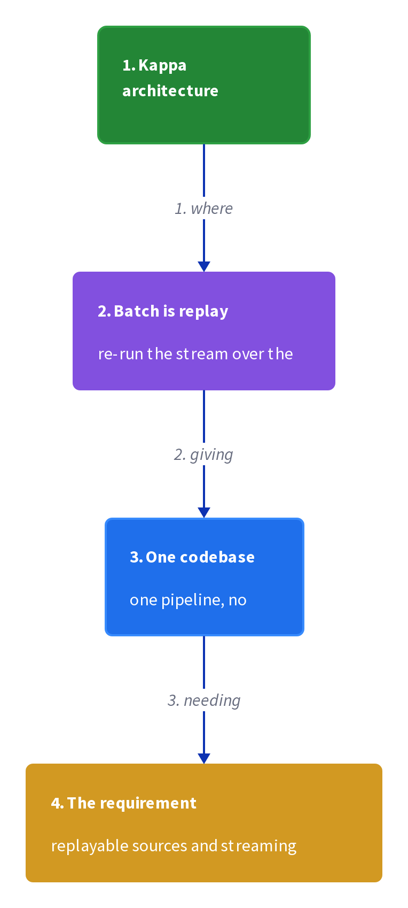
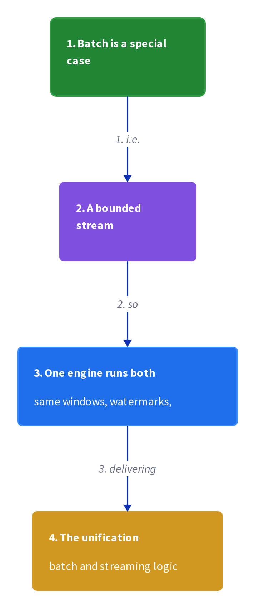
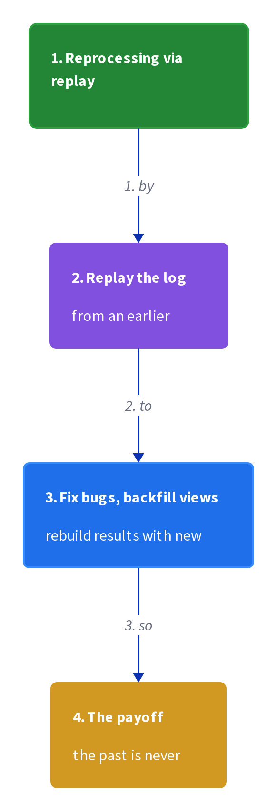
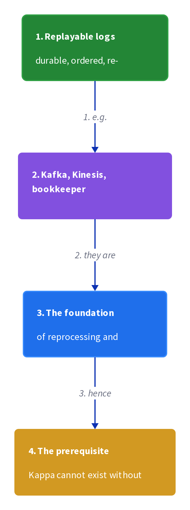
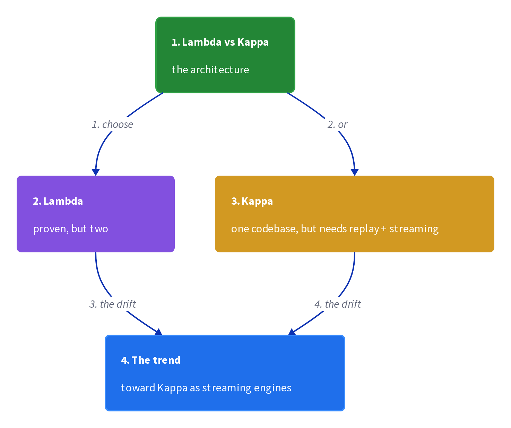
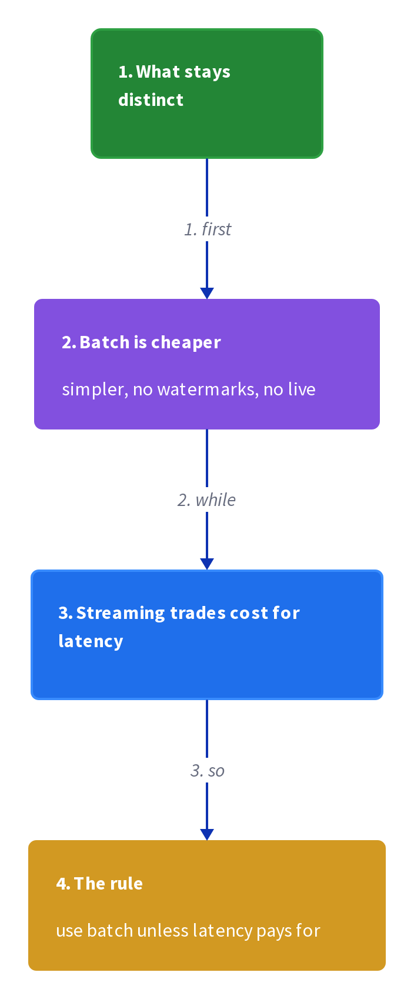

# Chapter 10: The Evolution of Large-Scale Data Processing

> The field moved from batch MapReduce, through the Lambda architecture (batch + speed layers), to the Kappa architecture (one streaming pipeline with replay) — and the Beam model unifies batch and streaming as one thing.

_Also known as: SS Ch10 · Lambda Architecture · Kappa Architecture · Batch-Stream Unification · MapReduce · Reprocessing_

## Flow

### From MapReduce to streaming

> **Why this matters:** The evolution of data processing explains why streaming systems look the way they do, so this section traces the arc from batch to the Beam model.

1. **MapReduce made batch tractable** — MapReduce (and Hadoop) made large batch jobs **scalable and fault-tolerant**, but it was built for finite datasets and had high latency.

2. **Streaming emerged for low latency** — Systems like MillWheel and Storm processed events as they arrived for **low-latency** results, but early versions lacked the correctness of batch (no event time, no watermarks).

3. **The Beam model unified the two** — The what/where/when/how model showed batch and streaming are **the same computation over bounded vs unbounded data** — batch is just streaming over a finite input.

4. **The consequence: one pipeline, both modes** — Because the model is unified, **the same pipeline code can run in batch or streaming** — the only difference is whether the input is bounded.

```java
// UNIFICATION SIDE — the same windowed sum runs over a finite file (batch) and an infinite stream (streaming)
// DEF: pipeline — a windowed sum over 5-min fixed windows = { "12:00": 0 }
// DEF: batch — the same pipeline over a finite file of 3 records = { "12:00": 3 }
// DEF: streaming — the same pipeline over an unbounded feed = { "12:00": 3 }
// STATE (before):
//    result : { "12:00": 0 }
// ======================================================================
// offset 0: {event_time: "12:00:10"}
// offset 1: {event_time: "12:00:20"}
// offset 2: {event_time: "12:00:30"}
// ======================================================================
// step 1 · batch run over the file -> result : { "12:00": 0 } -> { "12:00": 3 }   BECAUSE all 3 records are read before the answer
// step 2 · streaming run over the feed -> result : { "12:00": 0 } -> { "12:00": 3 }   BECAUSE the same 3 records fold in as they arrive
// step 3 · the only difference is the input -> mode : "bounded" -> "unbounded"   BECAUSE the computation is identical
// ======================================================================
// downstream : file 3 records -> window "12:00" -> sum 0 -> 3 = stream 3 records -> sum 3   BECAUSE the windowed sum is the same over bounded and unbounded data
//    derivation : batch = 3 - 3 = 0 extra machinery, streaming over a finite input, so one pipeline serves both modes
```

### Lambda and Kappa

> **Why this matters:** Two architectures tried to reconcile batch correctness with streaming latency, and the difference between them is the difference between dual codebases and one pipeline, so this section contrasts them.

1. **Lambda: batch + speed layers** — The Lambda architecture runs **two systems**: a batch layer for correct results and a speed layer for low-latency approximations. Both compute the same logic.

2. **Lambda's flaw: two codebases** — The batch and speed layers must be kept **in sync by hand** — the same aggregation written twice, in two systems, which drift apart. **That duplication is Lambda's core cost.**

3. **Kappa: one streaming pipeline with replay** — The Kappa architecture runs **one streaming pipeline**; reprocessing is done by replaying the log through the same code. **No second codebase.**

4. **Kappa needs replayable, persistent logs** — Kappa assumes the input is a **replayable log** (Kafka) that retains history long enough to re-run the pipeline when the code changes.

```java
// LAMBDA vs KAPPA SIDE — one aggregation written twice vs written once and replayed
// DEF: lambda — a batch layer and a speed layer computing the same sum in 2 codebases = 2
// DEF: kappa — one streaming pipeline, reprocessing by replaying the log = 1 codebase
// DEF: log — the replayable input history = [ "+1", "+1", "+1" ]
// STATE (before):
//    result : { "sum": 3 }
// ======================================================================
// offset 0: {value: 1}
// offset 1: {value: 1}
// offset 2: {value: 1}
// ======================================================================
// step 1 · Lambda path -> the change is written in the batch layer AND the speed layer -> edits : 0 -> 2   BECAUSE two codebases must stay in sync
// step 2 · Kappa path -> the change is written once -> edits : 0 -> 1   BECAUSE there is one codebase
// step 3 · Kappa replays the log -> result : { "sum": 3 } -> { "distinct": 1 }   BECAUSE the same 3 records re-run through the new pipeline
// ======================================================================
// downstream : SUM -> COUNT DISTINCT -> Lambda 2 edits -> Kappa 1 edit + replay -> result distinct 1   BECAUSE Kappa has one codebase, so nothing can drift
//    derivation : Kappa reprocess = 3 - 3 = 0 second implementations, so replay 3 records through the one new code
```

### Batch and streaming converge

> **Why this matters:** The end of the arc is convergence — batch as a special case of streaming — and this section draws the practical consequences for how systems are built today.

1. **Batch is streaming over a bounded input** — A batch job is a streaming pipeline whose input **ends**. **All the streaming machinery — windows, watermarks, triggers — still applies**, just with a finite input.

2. **One model, one codebase** — With the Beam model, **the same pipeline serves both modes**, so the Lambda duplication disappears. The choice becomes an execution detail, not a rewrite.

3. **Reprocessing is a first-class operation** — Changing business logic means **replaying history through the new pipeline** — the Kappa pattern. The log is the source of truth; the pipeline is disposable.

4. **What remains distinct** — Bounded vs unbounded still changes **when results are final** (a batch run ends; a stream waits on watermarks). The model unifies the how, not the fact that streams never end.

```java
// REPROCESSING SIDE — a bug fix is deployed and history is replayed through the new pipeline
// DEF: log — the retained input history = [ "r1", "r2", "r3" ]
// DEF: pipeline_v2 — the fixed pipeline code that replaces the buggy v1 = "v2"
// DEF: replay — re-running the log through the new code from the start = offset 0
// STATE (before):
//    result : { "wrong_total": 4 }
// ======================================================================
// offset 0: {record: "r1"}
// offset 1: {record: "r2"}
// offset 2: {record: "r3"}
// ======================================================================
// step 1 · the log is rewound to the start -> offset : 3 -> 0   BECAUSE reprocessing begins from the first record
// step 2 · the log is replayed through v2 -> result : { "wrong_total": 4 } -> { "correct_total": 3 }   BECAUSE the fixed code folds r1, r2, r3
// step 3 · the old v1 result is replaced -> result : { "correct_total": 3 } -> { "correct_total": 3 }   BECAUSE v2 supersedes v1
// ======================================================================
// downstream : bug found -> log rewind 0 -> replay r1,r2,r3 -> correct_total 3   BECAUSE replay + one codebase is the Kappa pattern
//    derivation : reprocess = 3 - 0 = 3 records folded through pipeline_v2, then the result table is swapped
```


## Links & The Bigger Picture

Concepts this chapter mentions but does not fully unpack are linked below — each pointer names the chapter where the concept is covered in depth and gives a concrete example that ties the two chapters together.

- **[Chapter 1: Streaming 101 → Three shapes of data](ch01-streaming-101.md#three-shapes-of-data)** — "batch is streaming over a bounded input" is ch01's three-shapes distinction stated as a unification — bounded, unbounded-batched, and unbounded-streaming are the same computation over different inputs.
  - _Example:_ ch10's windowed sum over a 3-record file vs a 3-record stream (both { "12:00": 3 }) is ch01's "batch is a special case of streaming" made concrete.
- **[Chapter 6: Streams and Tables → Why the duality matters in practice](ch06-streams-and-tables.md#why-the-duality-matters-in-practice)** — the Kappa architecture's replayable log is the stream-as-source-of-truth principle from ch06 — the log is retained history, the table is a derived view.
  - _Example:_ ch10's "rewind the log to offset 0 and replay" is ch06's "any past table is a fold of the stream"; ch10's corrected table is ch06's materialized fold under new code.
- **[Chapter 7: The Practicalities of Persistent State → Why state must persist](ch07-the-practicalities-of-persistent-state.md#why-state-must-persist)** — replay-based reprocessing is only practical because state checkpoints let a pipeline resume without re-reading everything — ch07 covers the checkpoint machinery Kappa leans on.
  - _Example:_ ch10's replay folds r1, r2, r3 through v2; ch07's checkpoint { count: {42:13}, offset: 500 } is what avoids replaying the whole log on every crash, so reprocessing is a deliberate re-run, not a recovery tax.
- **[Chapter 2: The What, Where, When, and How of Data Processing → What and Where — transformations and windowing](ch02-the-what-where-when-and-how-of-data-processing.md#what-and-where--transformations-and-windowing)** — the unified model that makes Lambda's duplication unnecessary is the what/where/when/how model — ch02 defines the four axes ch10 unifies.
  - _Example:_ ch10's "one pipeline, batch + streaming" is ch02's four-question spec applied to a bounded vs unbounded input; ch10's reprocessing is ch02's "how" (accumulation) recomputed under new logic.

## System Design Interview

> **The question:** Design a data-processing system that survives a bug fix. Premise: every input is kept in a replayable log, so the corrected pipeline is deployed once and the whole history is replayed through the same code to replace the wrong result.

**The pipeline:** log (replayable) -> one streaming pipeline -> speed result; replay path -> same pipeline -> corrected result

<a href="../diagrams/d2/decomp/ch10-0.png"></a>

### log (replayable)

_Role: log — retains input history for replay_

- the log holds records [ r1, r2, r3 ] with offsets
- retention is long enough to re-run when code changes
- the log is the source of truth

### one streaming pipeline

_Role: one streaming pipeline — the only codebase_

- the pipeline folds records into the running result
- windows and watermarks apply whether the input ends or not
- there is no separate batch implementation to drift

### speed result

_Role: speed result — the live output_

- the live result reflects the current fold of the log
- it is low-latency but uses the same code as any reprocess
- a bug means the result is wrong until replay

### replay path -> corrected result

_Role: replay path — recomputes history after a code change_

- the log is rewound to offset 0
- the same pipeline (v2) folds r1, r2, r3 again
- the corrected result replaces the buggy one

```java
// SYSTEM DESIGN — a bug fix is deployed once and history is replayed through the same pipeline
// DEF: log — the retained input history = [ "r1", "r2", "r3" ]
// DEF: pipeline_v2 — the fixed pipeline that replaces buggy v1 = "v2"
// DEF: replay — re-running the log through the new code from offset 0 = 0
// DEF: result — the pipeline's output table = { "wrong_total": 4 }
// STATE (before):
//    result_table : { "wrong_total": 4 }
// ======================================================================
// offset 0: {record: "r1"}
// offset 1: {record: "r2"}
// offset 2: {record: "r3"}
// ======================================================================
// step 1 · the log rewinds -> offset : 3 -> 0   BECAUSE reprocessing starts from the first record
// step 2 · the log replays through v2 -> result_table : { "wrong_total": 4 } -> { "correct_total": 3 }   BECAUSE the fixed code folds r1, r2, r3
// step 3 · the corrected result swaps in -> result_table : { "correct_total": 3 } -> { "correct_total": 3 }   BECAUSE v2 is the single codebase
// ======================================================================
// downstream : bug found -> rewind 0 -> replay 3 records -> result 3   BECAUSE the Kappa pattern has no second implementation to keep in sync
//    derivation : reprocess = 3 - 0 = 3 records folded through pipeline_v2, then replace the result table
```

## Interview Questions

### Q1

A team runs a batch job and a streaming job that compute the same metric, and the two numbers disagree — the batch and speed layers have drifted.

**Interviewer's question:** How do you avoid maintaining two divergent implementations of the same computation?

**Solution:** Adopt the Kappa pattern: one streaming pipeline, and reprocess by replaying the retained log through the same code — batch becomes a replay of the same pipeline, not a separate codebase.

**System-design components:**
- One pipeline — Kappa
- Replayable log — Kafka
- Reprocessing — replay history
- Unified model — batch = bounded streaming

```java
// lambda: batch code + speed code -> drift
// kappa : one code, replay log -> no drift
//   bug fix -> edit once -> replay history -> swap result
```

_This is exactly the Lambda vs Kappa material in this chapter._

_Covers:_ 2. Lambda architecture · 3. Kappa architecture · 5. Reprocessing via replay

_From the 28 problems:_ 20-metrics-monitoring · 21-ad-click-aggregation

### Q2

An analyst asks why the company maintains separate batch and streaming pipelines when the business logic is identical.

**Interviewer's question:** Are batch and streaming really the same thing, and how would you unify them?

**Solution:** Yes — batch is streaming over a bounded input. Use a unified model (Beam) so one pipeline runs both modes, and reprocess via replay when logic changes.

**System-design components:**
- Unified model — Beam
- Bounded vs unbounded input
- One codebase

```java
// same windowed sum
//   batch    : read 3 records -> result {12:00: 3}
//   streaming: read 3 records as they arrive -> {12:00: 3}
//   -> identical computation, different input
```

_This is exactly the batch-as-a-special-case material in this chapter._

_Covers:_ 1. Batch and streaming were separate worlds · 4. Batch is a special case

_From the 28 problems:_ 20-metrics-monitoring

## Key Concepts

### The Problem

**1. Batch and streaming were separate worlds.** The Beam model showed batch and streaming are the same computation over bounded vs unbounded data.


### The Solution

Lambda runs a batch layer (correct) and a speed layer (low-latency) computing the same logic in two codebases.

```java
// lambda: batch code + speed code -> drift
// kappa : one code, replay log -> no drift
//   bug fix -> edit once -> replay history -> swap result
```


### Key Facts

| Fact | Detail | In the wild |
|---|---|---|
| 2. Lambda architecture | Lambda runs a batch layer (correct) and a speed layer (low-latency) computing the same logic in two codebases. | Nathan Marz's Lambda architecture from the Hadoop era. |
| 3. Kappa architecture | Kappa runs one streaming pipeline and reprocesses by replaying the log through the same code. | Jay Kreps' Kappa architecture on top of Kafka. |
| 4. Batch is a special case | Batch is streaming over a bounded input — windows, watermarks, and triggers still apply, just with an input that ends. | Beam runs batch pipelines with the same windowing as streaming. |
| 5. Reprocessing via replay | Reprocessing replays the retained log through the new pipeline — the Kappa pattern. | Kafka retention + replay is the production form. |
| 6. Replayable logs | Kappa assumes a replayable, persistent log (Kafka) with enough retention to re-run when code changes. | Kafka topic retention is the Kappa prerequisite. |
| 7. Lambda vs Kappa | Lambda pays dual-codebase drift; Kappa pays log retention and replay time. | Most modern systems choose Kappa-style, given a replayable log. |
| 8. What stays distinct | Bounded vs unbounded still changes when results are final — a batch run ends, a stream waits on watermarks. | Streaming jobs run until stopped; batch jobs terminate. |


### Tradeoffs & When

- Lambda pays dual-codebase drift; Kappa pays log retention and replay time.
- Bounded vs unbounded still changes when results are final — a batch run ends, a stream waits on watermarks.


### Real-World Examples

- **Apache Beam** — One pipeline that runs in batch or streaming mode
- **Apache Flink** — A single engine for stream and batch, treating batch as bounded streaming
- **Kafka + Kappa** — A replayable log enabling one-pipeline reprocessing
- **Google MillWheel / Dataflow** — The lineage from early streaming to the unified model


<details><summary>All concepts (index)</summary>

### Why: 1. Batch and streaming were separate worlds

**Why.** Batch had correctness and fault tolerance; streaming had low latency but weak correctness — and teams had to choose.

**Claim.** The Beam model showed batch and streaming are the same computation over bounded vs unbounded data.

**Grounding.** The book's thesis is that the two converge.

**In the wild.** Beam, Flink, and Dataflow all run the same pipeline in both modes.

<a href="../diagrams/d2/card/ch10-0.png"></a>
### Architecture: 2. Lambda architecture

**Why.** To get both correct and low-latency results, run two layers.

**Claim.** Lambda runs a batch layer (correct) and a speed layer (low-latency) computing the same logic in two codebases.

**Grounding.** The duplication is the core cost — the layers drift.

**In the wild.** Nathan Marz's Lambda architecture from the Hadoop era.

<a href="../diagrams/d2/card/ch10-1.png"></a>
### Architecture: 3. Kappa architecture

**Why.** Eliminating the second codebase removes the drift.

**Claim.** Kappa runs one streaming pipeline and reprocesses by replaying the log through the same code.

**Grounding.** One codebase, no synchronization.

**In the wild.** Jay Kreps' Kappa architecture on top of Kafka.

<a href="../diagrams/d2/card/ch10-2.png"></a>
### Insight: 4. Batch is a special case

**Why.** If the model is unified, batch needs no separate machinery.

**Claim.** Batch is streaming over a bounded input — windows, watermarks, and triggers still apply, just with an input that ends.

**Grounding.** This is the consequence of the Beam model.

**In the wild.** Beam runs batch pipelines with the same windowing as streaming.

<a href="../diagrams/d2/card/ch10-3.png"></a>
### Operation: 5. Reprocessing via replay

**Why.** Business logic changes, so history must be recomputed under the new logic.

**Claim.** Reprocessing replays the retained log through the new pipeline — the Kappa pattern.

**Grounding.** The log is the source of truth; the pipeline is disposable.

**In the wild.** Kafka retention + replay is the production form.

<a href="../diagrams/d2/card/ch10-4.png"></a>
### Requirement: 6. Replayable logs

**Why.** Replay-based reprocessing requires the input history to be retained and re-readable.

**Claim.** Kappa assumes a replayable, persistent log (Kafka) with enough retention to re-run when code changes.

**Grounding.** Without retention, history cannot be replayed.

**In the wild.** Kafka topic retention is the Kappa prerequisite.

<a href="../diagrams/d2/card/ch10-5.png"></a>
### Cost: 7. Lambda vs Kappa

**Why.** The architectures differ in what they pay for correctness and latency.

**Claim.** Lambda pays dual-codebase drift; Kappa pays log retention and replay time.

**Grounding.** Kappa's cost is storage and recompute, not coordination.

**In the wild.** Most modern systems choose Kappa-style, given a replayable log.

<a href="../diagrams/d2/card/ch10-6.png"></a>
### Remaining: 8. What stays distinct

**Why.** Unification does not make streams finite.

**Claim.** Bounded vs unbounded still changes when results are final — a batch run ends, a stream waits on watermarks.

**Grounding.** The model unifies the how, not the fact that streams never end.

**In the wild.** Streaming jobs run until stopped; batch jobs terminate.

<a href="../diagrams/d2/card/ch10-7.png"></a>

</details>


## Quiz

1. What is the core cost of the Lambda architecture?

   - A. High latency
   - B. Two codebases that drift apart
   - C. Low throughput
   - D. No fault tolerance

<details><summary>Reveal answer</summary>

**B.** Lambda runs the same logic in a batch layer and a speed layer that must be kept in sync.

</details>

2. How does Kappa reprocess data?

   - A. A separate batch system
   - B. Replaying the log through the same pipeline
   - C. A second codebase
   - D. Manual fixes

<details><summary>Reveal answer</summary>

**B.** Kappa replays the retained log through the one streaming pipeline.

</details>

3. What is batch in the unified model?

   - A. A separate paradigm
   - B. Streaming over a bounded input
   - C. A faster streaming mode
   - D. A type of window

<details><summary>Reveal answer</summary>

**B.** Batch is just streaming over an input that ends.

</details>

4. What does reprocessing require?

   - A. A second codebase
   - B. A replayable, persistent log
   - C. A batch layer
   - D. No state

<details><summary>Reveal answer</summary>

**B.** Replay needs retained, re-readable input history.

</details>

5. What stays distinct between batch and streaming after unification?

   - A. The window types
   - B. When results are final — batch ends, streams wait on watermarks
   - C. The transform logic
   - D. The key grouping

<details><summary>Reveal answer</summary>

**B.** The model unifies the how, not the fact that streams never end.

</details>

## Sources

- [Dean & Ghemawat — "MapReduce" (OSDI 2004)](https://research.google/pubs/pub62/) — The batch model that streaming evolved from
- [Nathan Marz — "How to beat the CAP theorem"](http://nathanmarz.com/blog/how-to-beat-the-cap-theorem.html) — The origin of the Lambda architecture
- [Jay Kreps — "Questioning the Lambda Architecture"](https://www.oreilly.com/radar/questioning-the-lambda-architecture/) — The origin of the Kappa architecture
- [Akidau et al. — "The Dataflow Model" (VLDB 2015)](https://www.vldb.org/pvldb/vol8/p1792-Akidau.pdf) — The paper that unified batch and streaming
- [Akidau et al. — "MillWheel" (VLDB 2013)](https://research.google/pubs/pub41378/) — The early-streaming lineage

