# Chapter 10: The Evolution of Large-Scale Data Processing

> The field moved from batch MapReduce, through the Lambda architecture (batch + speed layers), to the Kappa architecture (one streaming pipeline with replay) — and the Beam model unifies batch and streaming as one thing.

_Also known as: SS Ch10 · Lambda Architecture · Kappa Architecture · Batch-Stream Unification · MapReduce · Reprocessing_

## Flow

### From MapReduce to streaming

> **Why this matters:** The evolution of data processing explains why streaming systems look the way they do, so this section traces the arc from batch to the Beam model.

1. **MapReduce made batch tractable** — MapReduce (and Hadoop) made large batch jobs **scalable and fault-tolerant**, but it was built for finite datasets and had high latency.

2. **Streaming emerged for low latency** — Systems like MillWheel and Storm processed events as they arrived for **low-latency** results, but early versions lacked the correctness of batch (no event time, no watermarks).

3. **The Beam model unified the two** — The what/where/when/how model showed batch and streaming are **the same computation over bounded vs unbounded data** — batch is just streaming over a finite input.

4. **The consequence: one pipeline, both modes** — Because the model is unified, **the same pipeline code can run in batch or streaming** — the only difference is whether the input is bounded.

<!-- ch10-history:begin — generated by tools/gen_ch10.js; do not hand-edit -->

#### Why the end of the input was answering three of the four questions

**MapReduce made batch tractable, and it assumed an ending.** Over this dataset a batch job reads all 9 events, computes 4 windows (19, 11, 7, 8, total 45), and every result is final at event 9 — all at once. It needs no watermark, no trigger and no accumulation mode.

Not because it lacks them, but because **the ending answers three of the four questions for free**: WHERE is the input file (one implicit window), WHEN is end of input, HOW has no panes to relate. Remove the ending and all three defaults stop existing simultaneously. That is the difficulty, and it has nothing to do with latency.

**Early streaming systems got latency and lost correctness** — and it is worth being precise about why. They had no vocabulary for event time, so they bucketed by arrival. On this data that is **3 of the 4 windows wrong, by 26 in total**: window [12:00, 12:02) reads 19 by event time and 15 by arrival. A missing feature, not an inherent limit — which is why a model could fix it.

**The four questions unified them.** Read the WHAT row: batch's map/reduce and streaming's aggregation are the **same**. The computation was never the difference. The other three questions are all about time — which slice, which moment, how successive answers relate — and those are exactly the three an ending used to answer.

**So one pipeline can run in both modes.** The grouping is identical: 4 windows with values 19, 11, 7, 8, bounded or unbounded. The only difference is **when each result is final** — batch closes all 4 at event 9, while in streaming 1 is never final at all.

#### When the unification pays, and what it does not remove

**It pays whenever the same logic serves history and live traffic** — a backfill, a re-derivation after a schema change, a new consumer over old data. One codebase, with the mode chosen by whether the input ends.

**Reach for a bounded run when the input genuinely ends,** and take the free answers. A nightly job over yesterday needs no watermark reasoning, and introducing one buys nothing.

**Do not read "batch is a special case" as "batch is obsolete".** The special case is the easy one: three of the four questions are answered for you and every window is final at once, which is why a bounded run is the right tool whenever the input allows it.

**What this does not settle:** what to do when you need both low latency AND correctness over an unbounded input. Historically the answer was to build two systems, which is the next concept — and the cost of that answer turns out to be measurable on this dataset.

#### Visual walkthrough — the free answers, the lost clock, the unification

The animation loops through all 4 steps. Expand any step to study it on its own.



<details>
<summary><b>Step 1 of 4</b> — MapReduce made batch tractable, and assumed an ending</summary>


Start from what batch actually gives you: 4 window results, all final at event 9, with no watermark and no triggers needed. It is not that batch lacks these mechanisms — it is that the end of the input answers three of the four questions for free. Take the ending away and all three answers disappear together.

</details>
<details>
<summary><b>Step 2 of 4</b> — early streaming got latency and lost correctness</summary>

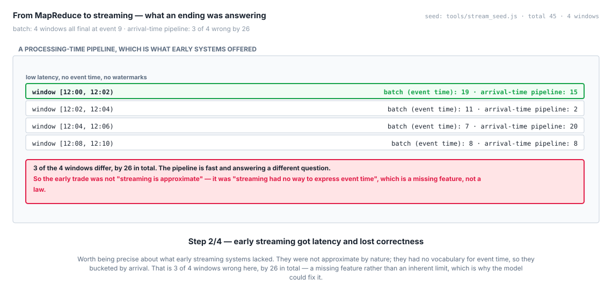

Worth being precise about what early streaming systems lacked. They were not approximate by nature; they had no vocabulary for event time, so they bucketed by arrival. That is 3 of 4 windows wrong here, by 26 in total — a missing feature rather than an inherent limit, which is why the model could fix it.

</details>
<details>
<summary><b>Step 3 of 4</b> — the four questions unified them</summary>

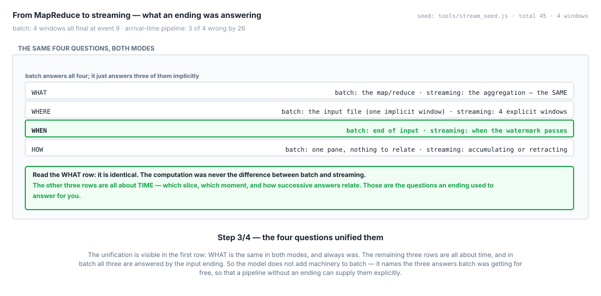

The unification is visible in the first row: WHAT is the same in both modes, and always was. The remaining three rows are all about time, and in batch all three are answered by the input ending. So the model does not add machinery to batch — it names the three answers batch was getting for free, so that a pipeline without an ending can supply them explicitly.

</details>
<details>
<summary><b>Step 4 of 4</b> — so one pipeline can run in both modes</summary>

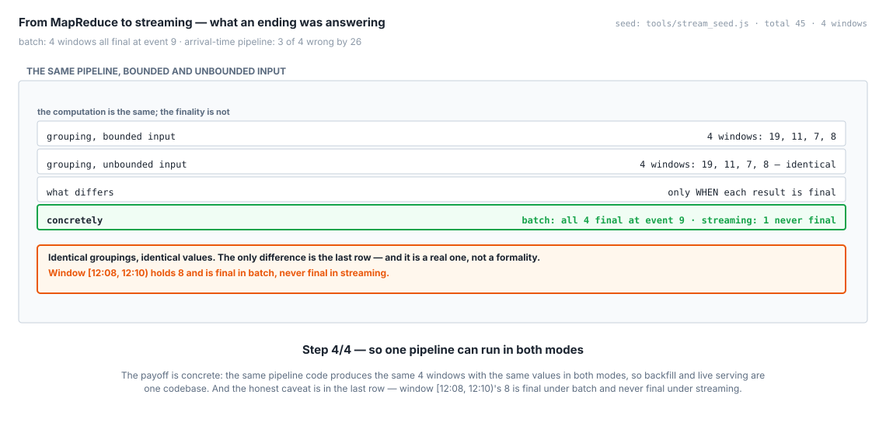

The payoff is concrete: the same pipeline code produces the same 4 windows with the same values in both modes, so backfill and live serving are one codebase. And the honest caveat is in the last row — window [12:08, 12:10)'s 8 is final under batch and never final under streaming.

</details>

<sub>The batch result, the arrival-time divergence and the finality comparison are computed from the seed and asserted. Generated by `node tools/gen_ch10.js`.</sub>

<!-- ch10-history:end -->

<!-- ch10-history-memory:begin — generated by tools/gen_ch10.js; do not hand-edit -->

#### One grouping, two finality rules — stack and heap at every step

**What is being answered.** What the end of an input was doing for a batch job — as one pipeline run in two modes.

`group(events, clock)` is the WHAT and the WHERE, and both modes call it identically with `"et"`. `finalAtBounded` is batch's watermark: it **ignores its argument** and returns 9. That is the trivial-watermark claim made mechanical.

Step 3 is the limit of the convergence — `finalAtStreaming(480)` returns NONE — and step 4 is the historical contrast: the same `group` with `"pt"` differs in the VALUES, 3 of 4 buckets by 26.

The animation steps through the code, holding each line long enough to read the STACK (call frames and their locals) and the HEAP (allocated arrays and objects) as they are AT THAT MOMENT. Expand any step to study it on its own.



<details>
<summary><b>Step 1 of 4</b> — the grouping is one function, and the clock is its argument</summary>


`floorTo(e[clock], WIN)` is the whole of WHERE, and `clock` is an argument. Batch and streaming both call this with `"et"` and get the same 4 buckets — the computation was never what distinguished them. Early streaming systems called it with `"pt"` because they had no other option.

</details>
<details>
<summary><b>Step 2 of 4</b> — batch's watermark is a constant: end of input</summary>

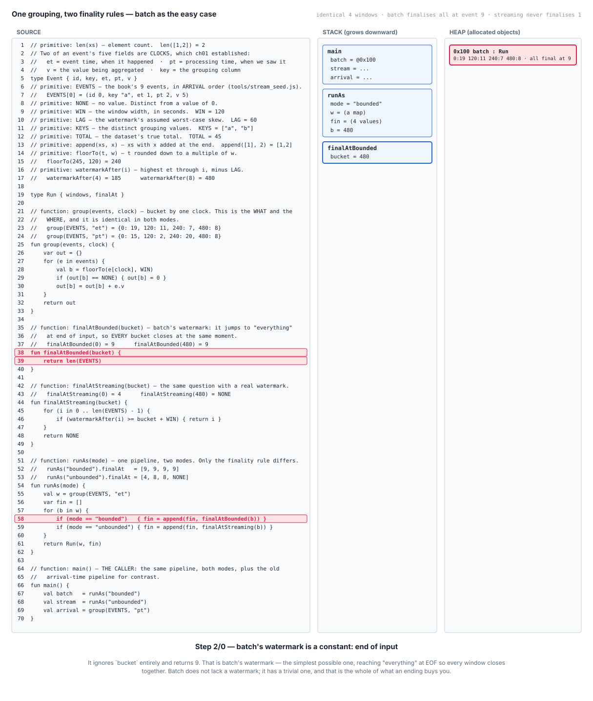

It ignores `bucket` entirely and returns 9. That is batch's watermark — the simplest possible one, reaching "everything" at EOF so every window closes together. Batch does not lack a watermark; it has a trivial one, and that is the whole of what an ending buys you.

</details>
<details>
<summary><b>Step 3 of 4</b> — streaming asks a real watermark, and one bucket gets NONE</summary>

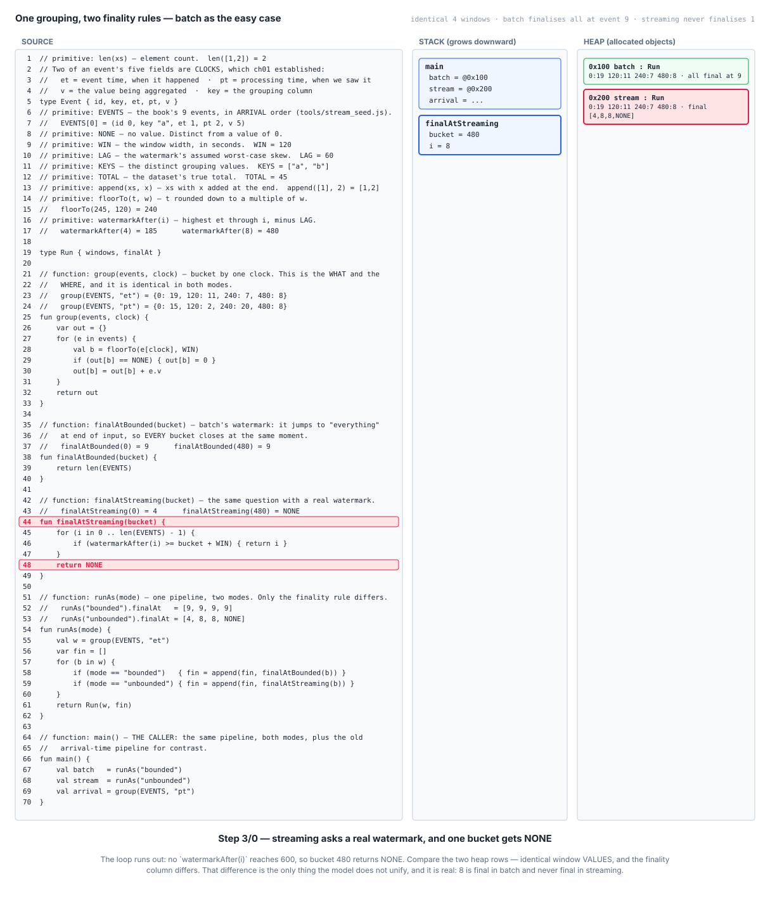

The loop runs out: no `watermarkAfter(i)` reaches 600, so bucket 480 returns NONE. Compare the two heap rows — identical window VALUES, and the finality column differs. That difference is the only thing the model does not unify, and it is real: 8 is final in batch and never final in streaming.

</details>
<details>
<summary><b>Step 4 of 4</b> — and the old arrival-time pipeline differs in the VALUES</summary>

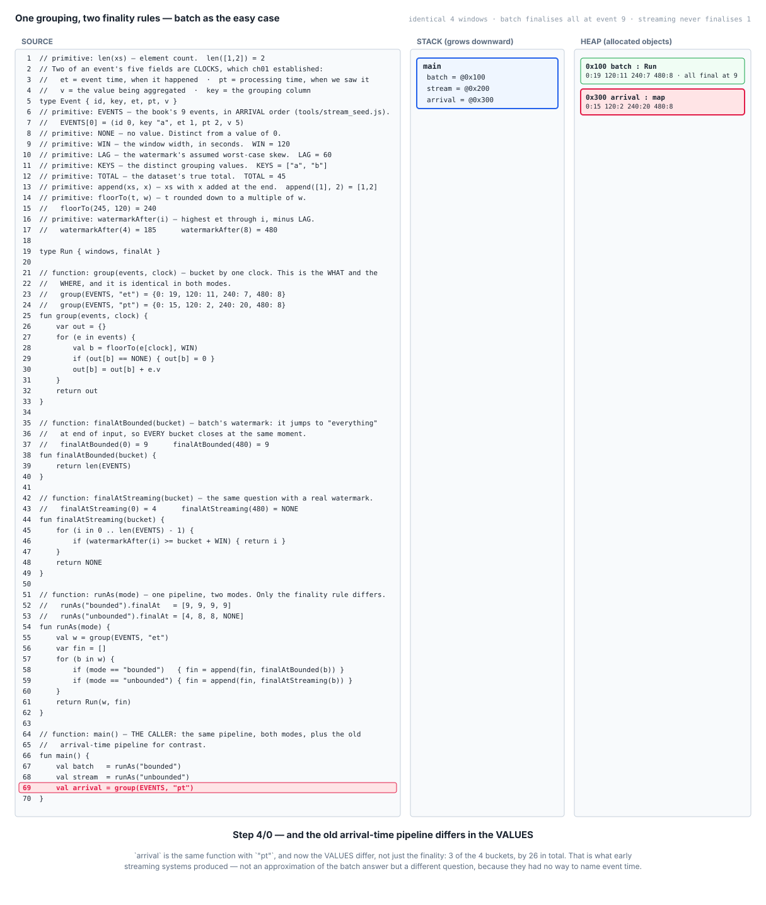

`arrival` is the same function with `"pt"`, and now the VALUES differ, not just the finality: 3 of the 4 buckets, by 26 in total. That is what early streaming systems produced — not an approximation of the batch answer but a different question, because they had no way to name event time.

</details>

<sub>Both finality rules, the identical groupings and the arrival-clock divergence are computed from the seed and asserted. Generated by `node tools/gen_ch10.js` on `tools/memkit.js`.</sub>

<!-- ch10-history-memory:end -->

### Lambda and Kappa

> **Why this matters:** Two architectures tried to reconcile batch correctness with streaming latency, and the difference between them is the difference between dual codebases and one pipeline, so this section contrasts them.

1. **Lambda: batch + speed layers** — The Lambda architecture runs **two systems**: a batch layer for correct results and a speed layer for low-latency approximations. Both compute the same logic.

2. **Lambda's flaw: two codebases** — The batch and speed layers must be kept **in sync by hand** — the same aggregation written twice, in two systems, which drift apart. **That duplication is Lambda's core cost.**

3. **Kappa: one streaming pipeline with replay** — The Kappa architecture runs **one streaming pipeline**; reprocessing is done by replaying the log through the same code. **No second codebase.**

4. **Kappa needs replayable, persistent logs** — Kappa assumes the input is a **replayable log** (Kafka) that retains history long enough to re-run the pipeline when the code changes.

<!-- ch10-lambda:begin — generated by tools/gen_ch10.js; do not hand-edit -->

#### Why Lambda's cost is a second implementation, and Kappa's is retention

**Lambda runs two layers computing the same logic:** a batch layer that re-reads all 9 events (correct, slow), a speed layer that works incrementally over arrivals (fast, approximate), and a serving layer that merges them and prefers the batch answer once it lands.

The shape is sound — it genuinely delivers both low latency and eventual correctness. The cost is that **the same aggregation is written twice, in two systems, kept in agreement by discipline rather than by construction.**

**And the drift has a predictable direction**, which is what makes it more than a theoretical risk. The batch layer has the whole input, so event time is the obvious choice; the speed layer sees arrivals, so arrival time is the obvious choice. Follow that through and **3 of the 4 windows disagree, by 26 in total** — with both layers internally consistent and neither containing a bug.

**Kappa replaces the second layer with replay.** Take a concrete bug: key "a" is halved, so it reads 11 instead of 24 and the total reads 32 instead of 45. Under Lambda the fix must land in **2 places** and both must be verified. Under Kappa it lands in **1**, and replaying 9 events restores 24 and 45.

Kappa does not make the fix cheaper to *write*. It makes it **impossible to apply inconsistently**, because there is only one place to apply it.

**What Kappa assumes, in exchange:** a replayable log, retained for longer than the history the new code must reprocess, and a deterministic pipeline so that the replay produces 45 rather than merely something plausible.

#### When to pick each, and which assumption expires quietly

**Pick Kappa when the input is already a retained log** — which, if you are running Kafka or an equivalent, you have. Then the second layer is pure cost and the single codebase is free.

**Pick Lambda when the batch system already exists and works** and the streaming layer is genuinely a different kind of computation — an approximation, a sketch, something you would not want to be the system of record. Then the duplication is deliberate rather than accidental.

**Never pick Lambda and then try to keep the layers equivalent by review.** The divergence above needs no mistake: each layer's context suggests a different clock, and the result is 3 wrong windows that both teams can defend.

**Assert determinism in a test.** A pipeline that reads the wall clock, a random seed or a mutable lookup table does not reproduce 45 on replay, and nothing about the log will tell you — it is the pipeline that has stopped being a function of its input.

**What this does not settle — and it expires silently:** replay works only as far back as retention. Set 7 days and "we can always reprocess" becomes "we can reprocess 7 days", with nothing in the running system announcing the change.

#### Visual walkthrough — two layers, their drift, and one fix site

The animation loops through all 4 steps. Expand any step to study it on its own.



<details>
<summary><b>Step 1 of 4</b> — Lambda: two layers computing the same logic</summary>


Lambda's shape is sound: a batch layer for correctness, a speed layer for latency, a serving layer that prefers the batch answer when it arrives. It does deliver both properties. The entire criticism is the last row — the aggregation exists twice, and nothing mechanical keeps the two copies equivalent.

</details>
<details>
<summary><b>Step 2 of 4</b> — and the two codebases drift, in a predictable direction</summary>

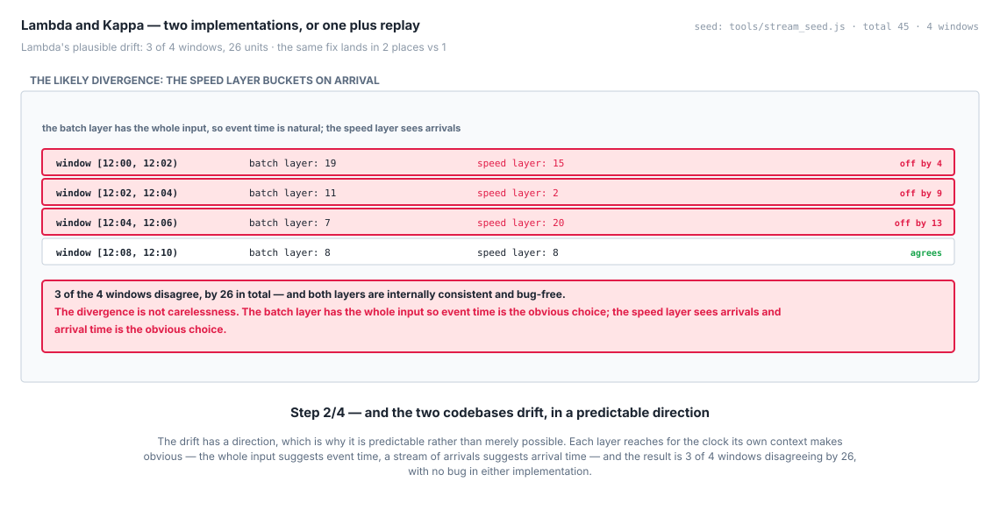

The drift has a direction, which is why it is predictable rather than merely possible. Each layer reaches for the clock its own context makes obvious — the whole input suggests event time, a stream of arrivals suggests arrival time — and the result is 3 of 4 windows disagreeing by 26, with no bug in either implementation.

</details>
<details>
<summary><b>Step 3 of 4</b> — Kappa: one pipeline, and replay instead of a second layer</summary>

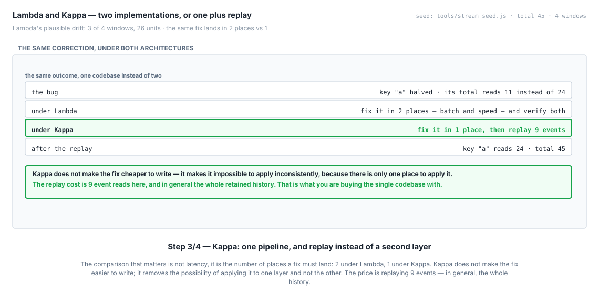

The comparison that matters is not latency, it is the number of places a fix must land: 2 under Lambda, 1 under Kappa. Kappa does not make the fix easier to write; it removes the possibility of applying it to one layer and not the other. The price is replaying 9 events — in general, the whole history.

</details>
<details>
<summary><b>Step 4 of 4</b> — so Kappa's requirement is a retained, replayable log</summary>

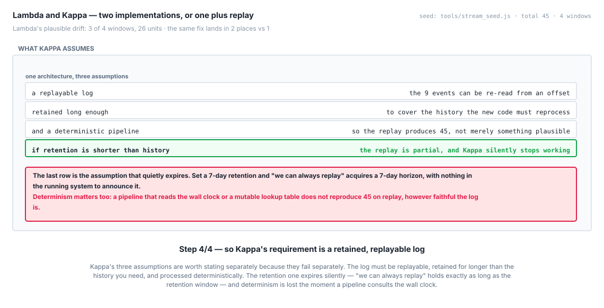

Kappa's three assumptions are worth stating separately because they fail separately. The log must be replayable, retained for longer than the history you need, and processed deterministically. The retention one expires silently — "we can always replay" holds exactly as long as the retention window — and determinism is lost the moment a pipeline consults the wall clock.

</details>

<sub>The layer divergence, the bug's effect and both fix-site counts are computed from the seed and asserted. Generated by `node tools/gen_ch10.js`.</sub>

<!-- ch10-lambda:end -->

<!-- ch10-lambda-memory:begin — generated by tools/gen_ch10.js; do not hand-edit -->

#### Two implementations or one — stack and heap at every step

**What is being answered.** Lambda's real cost, as a count rather than an opinion.

`layerFor(name)` defaults `clock` to `"pt"` and only the batch layer overrides it — the realistic shape of the drift, where each layer reaches for the clock its own context suggests. `drift` then measures the result: **26** across 3 buckets, with no bug in either layer.

`applyFix(architecture)` returns `sites`: 2 for Lambda, 1 for Kappa. The guarantee is not that the fix is easier to write but that applying it inconsistently becomes impossible.

The animation steps through the code, holding each line long enough to read the STACK (call frames and their locals) and the HEAP (allocated arrays and objects) as they are AT THAT MOMENT. Expand any step to study it on its own.



<details>
<summary><b>Step 1 of 4</b> — each layer picks the clock its own context makes obvious</summary>


The default is `"pt"` and only the batch layer overrides it — which is the realistic shape of the divergence. A batch layer holding the whole input naturally reaches for event time; a speed layer processing arrivals naturally reaches for arrival time. Neither developer made an error.

</details>
<details>
<summary><b>Step 2 of 4</b> — so the two layers are 26 apart, with no bug in either</summary>

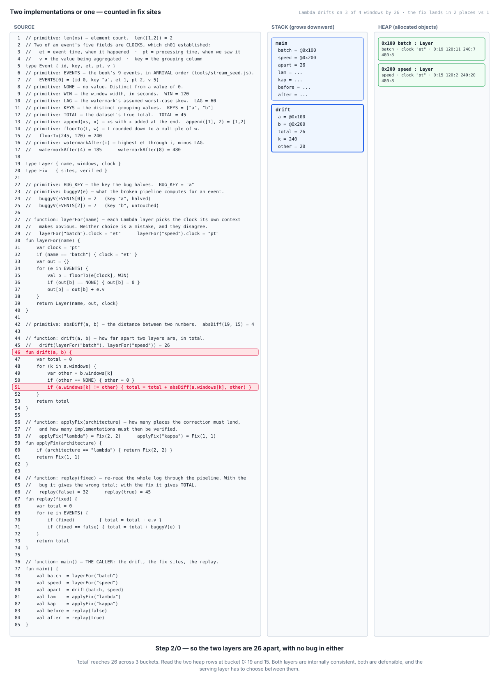

`total` reaches 26 across 3 buckets. Read the two heap rows at bucket 0: 19 and 15. Both layers are internally consistent, both are defensible, and the serving layer has to choose between them.

</details>
<details>
<summary><b>Step 3 of 4</b> — the same fix lands in two places, or in one</summary>

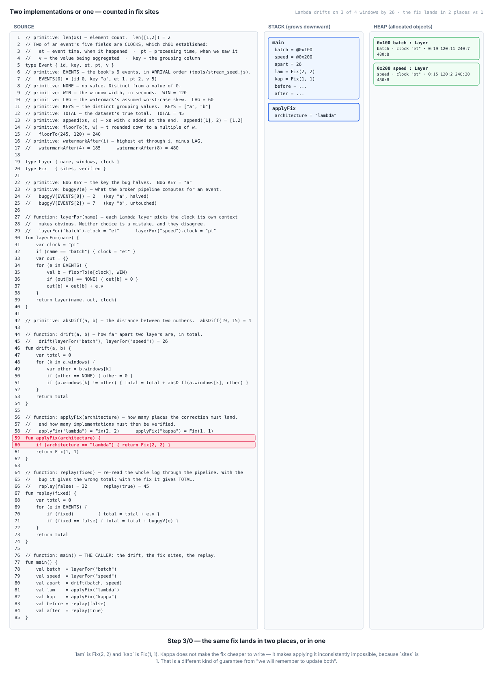

`lam` is Fix(2, 2) and `kap` is Fix(1, 1). Kappa does not make the fix cheaper to write — it makes applying it inconsistently impossible, because `sites` is 1. That is a different kind of guarantee from "we will remember to update both".

</details>
<details>
<summary><b>Step 4 of 4</b> — and the replay restores the correct total from the log</summary>

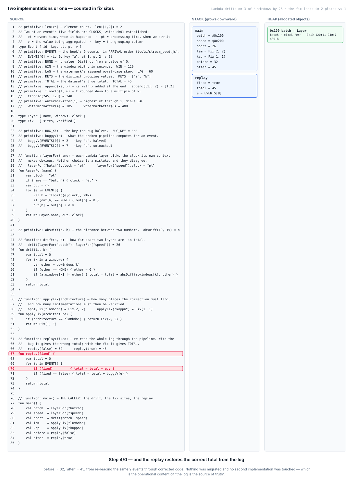

`before` = 32, `after` = 45, from re-reading the same 9 events through corrected code. Nothing was migrated and no second implementation was touched — which is the operational content of "the log is the source of truth".

</details>

<sub>The layer drift, both fix-site counts and both replay totals are computed from the seed and asserted. Generated by `node tools/gen_ch10.js` on `tools/memkit.js`.</sub>

<!-- ch10-lambda-memory:end -->

### Batch and streaming converge

> **Why this matters:** The end of the arc is convergence — batch as a special case of streaming — and this section draws the practical consequences for how systems are built today.

1. **Batch is streaming over a bounded input** — A batch job is a streaming pipeline whose input **ends**. **All the streaming machinery — windows, watermarks, triggers — still applies**, just with a finite input.

2. **One model, one codebase** — With the Beam model, **the same pipeline serves both modes**, so the Lambda duplication disappears. The choice becomes an execution detail, not a rewrite.

3. **Reprocessing is a first-class operation** — Changing business logic means **replaying history through the new pipeline** — the Kappa pattern. The log is the source of truth; the pipeline is disposable.

4. **What remains distinct** — Bounded vs unbounded still changes **when results are final** (a batch run ends; a stream waits on watermarks). The model unifies the how, not the fact that streams never end.

<!-- ch10-converge:begin — generated by tools/gen_ch10.js; do not hand-edit -->

#### Why batch already has all four mechanisms, and what reprocessing becomes

**Batch is streaming over a bounded input,** and the reframing is the whole claim. Batch does not *lack* watermarks — it has the easiest possible one, which reaches infinity at end of input and closes every window at once. It has a trigger too: fire once, at EOF. Three of the four mechanisms are **trivial** in batch rather than absent.

Seeing it that way is what makes one codebase possible: you are not adding streaming machinery to a batch job, you are removing a special case.

**So Lambda's duplication disappears.** The concrete correction: key "a" reads 11 (total 32); one edit in one pipeline; replay 9 events; key "a" reads 24 and the total reads 45.

And note the verification: **key "b" reads 21 before and after.** That unaffected key is how you know the replay *reproduced* history rather than recomputing it differently — without an invariant to check, "the numbers changed" and "the numbers are now right" are indistinguishable.

**Reprocessing becomes a first-class operation.** Changing business logic, fixing a bug and adding a new output are all the same operation: deploy new code, replay the log. This is ch06's duality as an operational practice — the state is a function of the log, so it can be discarded and rebuilt rather than migrated.

Which inverts the usual anxiety: the risky asset is not the pipeline you are replacing, it is **the log you are assuming is still complete.**

**And what stays distinct: streams do not end.** Window [12:08, 12:10) holds 8, has received every one of its events, and is final under batch while **never final** under streaming. The model unifies the *how*; it does not give an unbounded input an ending — and that is not a gap in the model, it is the thing the model is about.

#### When to replay, what to check, and what remains a batch-only property

**Replay for any logic change, not just for incidents.** If reprocessing is a routine operation rather than an emergency, the pipeline becomes genuinely disposable, and that is where the architecture's value is realised.

**Always replay with an invariant.** Pick something the change must not affect — key "b" at 21 here — and check it. A replay that changes everything is indistinguishable from a replay that is wrong in a new way.

**Treat the log's retention as the system's correctness boundary**, not as a storage setting. Every claim about re-derivation has that horizon.

**And do not promise finality on an unbounded input.** 1 of the 4 windows here is never final in streaming, so "replay and you have the right answer" is true of the closed windows and not of that one. If a consumer needs a final figure, it needs a bounded run or an explicit cut-off — which is a product decision, not a configuration.

#### Visual walkthrough — the trivial mechanisms, the single fix, the limit

The animation loops through all 4 steps. Expand any step to study it on its own.



<details>
<summary><b>Step 1 of 4</b> — batch is streaming over a bounded input</summary>


The reframing is the content of the claim. Batch has a watermark — the simplest one, which jumps to infinity at end of input — and a trigger, which fires once. Three of the four mechanisms are trivial rather than absent, and recognising that is what lets one pipeline serve both modes instead of two pipelines serving one each.

</details>
<details>
<summary><b>Step 2 of 4</b> — so one codebase, and Lambda's duplication disappears</summary>

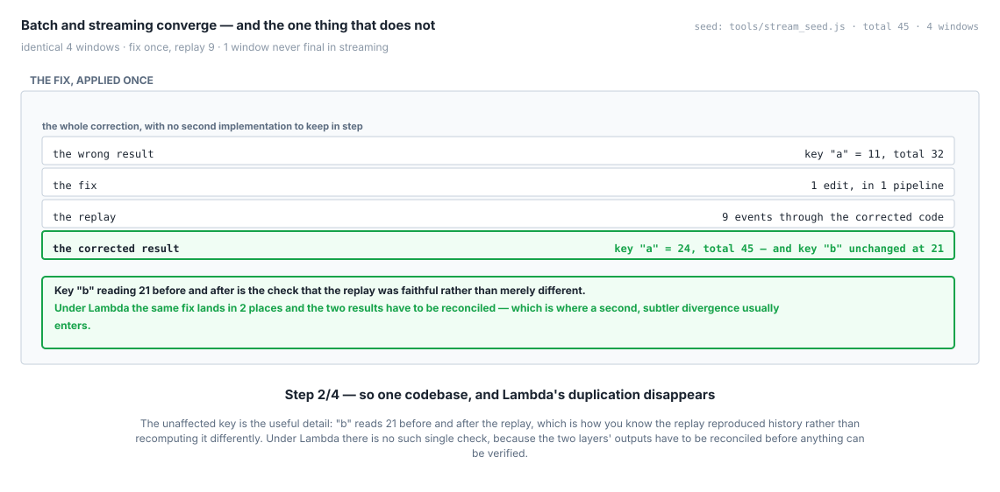

The unaffected key is the useful detail: "b" reads 21 before and after the replay, which is how you know the replay reproduced history rather than recomputing it differently. Under Lambda there is no such single check, because the two layers' outputs have to be reconciled before anything can be verified.

</details>
<details>
<summary><b>Step 3 of 4</b> — reprocessing becomes a first-class operation</summary>

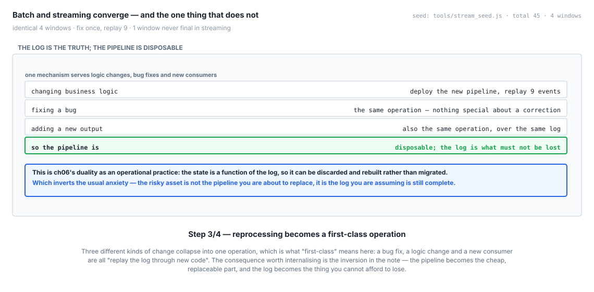

Three different kinds of change collapse into one operation, which is what "first-class" means here: a bug fix, a logic change and a new consumer are all "replay the log through new code". The consequence worth internalising is the inversion in the note — the pipeline becomes the cheap, replaceable part, and the log becomes the thing you cannot afford to lose.

</details>
<details>
<summary><b>Step 4 of 4</b> — and what stays distinct: streams do not end</summary>

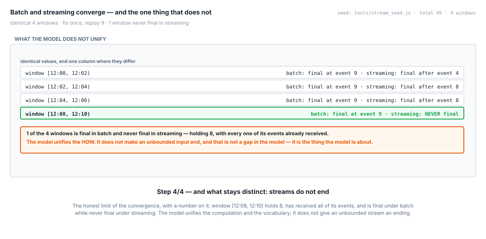

The honest limit of the convergence, with a number on it: window [12:08, 12:10) holds 8, has received all of its events, and is final under batch while never final under streaming. The model unifies the computation and the vocabulary; it does not give an unbounded stream an ending.

</details>

<sub>The identical groupings, the replay result and the never-final window are computed from the seed and asserted. Generated by `node tools/gen_ch10.js`.</sub>

<!-- ch10-converge:end -->

<!-- ch10-converge-memory:begin — generated by tools/gen_ch10.js; do not hand-edit -->

#### The convergence — stack and heap at every step

**What is being answered.** What the convergence actually delivers operationally, and the check that makes a replay trustworthy.

`process(fixed)` is **one** function with one flag — the correction, not a second implementation. Step 2 shows the replay taking key "a" from 11 to 24 by re-reading 9 events.

`unaffectedKeys` is the part worth copying into real work: key "b" reads 21 in **both** results, which is how you know the replay reproduced history rather than computing something else. And step 4 is the residual limit — bucket 480 is never final.

The animation steps through the code, holding each line long enough to read the STACK (call frames and their locals) and the HEAP (allocated arrays and objects) as they are AT THAT MOMENT. Expand any step to study it on its own.



<details>
<summary><b>Step 1 of 4</b> — one pipeline, and the fix is one line inside it</summary>


`fixed` is one flag inside one function — not a second implementation. With it false, key "a" accumulates 11 and the total reaches 32. Under Lambda this same correction would have to be made in a second place, in a different system, and verified separately.

</details>
<details>
<summary><b>Step 2 of 4</b> — the replay runs the same code over the same log</summary>

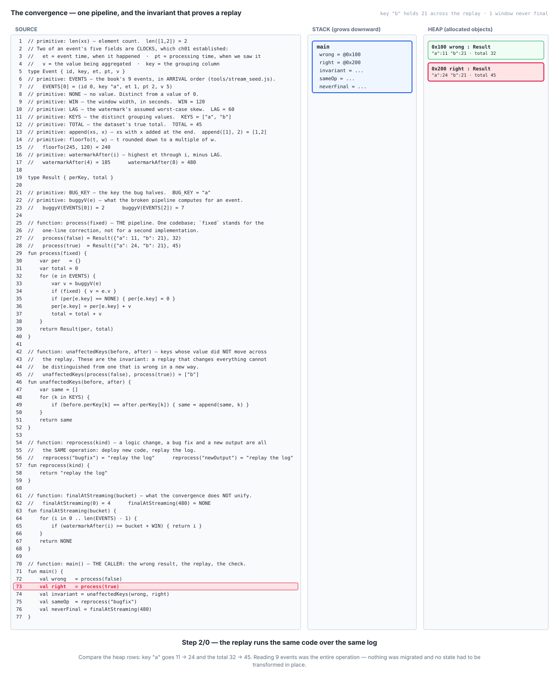

Compare the heap rows: key "a" goes 11 → 24 and the total 32 → 45. Reading 9 events was the entire operation — nothing was migrated and no state had to be transformed in place.

</details>
<details>
<summary><b>Step 3 of 4</b> — and an unaffected key is what makes the replay checkable</summary>

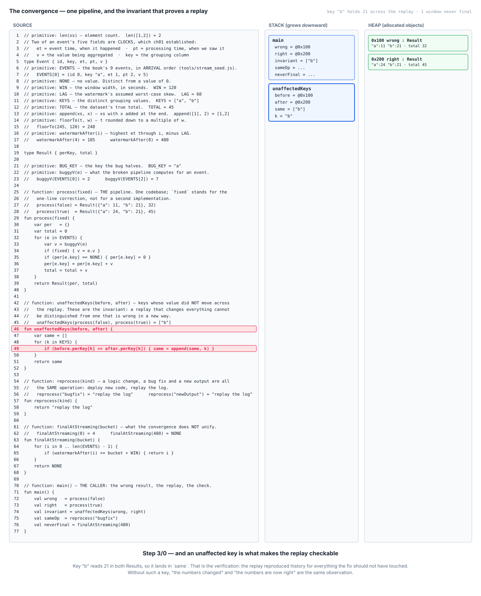

Key "b" reads 21 in both Results, so it lands in `same`. That is the verification: the replay reproduced history for everything the fix should not have touched. Without such a key, "the numbers changed" and "the numbers are now right" are the same observation.

</details>
<details>
<summary><b>Step 4 of 4</b> — but one window is still never final</summary>

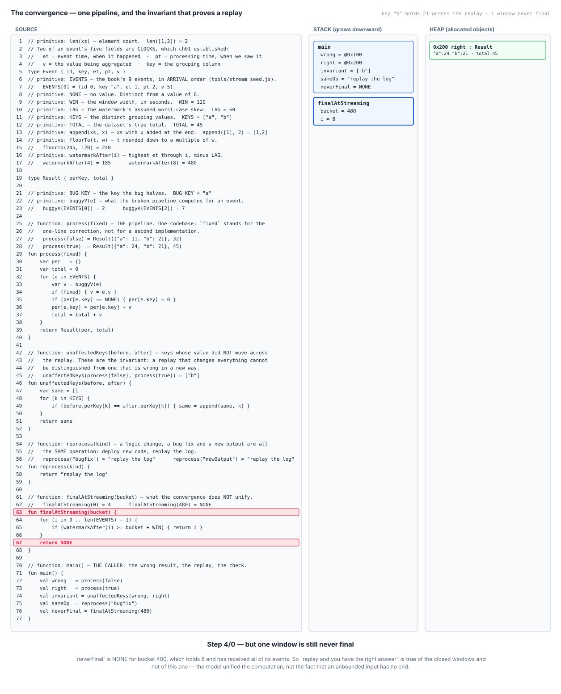

`neverFinal` is NONE for bucket 480, which holds 8 and has received all of its events. So "replay and you have the right answer" is true of the closed windows and not of this one — the model unified the computation, not the fact that an unbounded input has no end.

</details>

<sub>Both results, the invariant key and the never-final window are computed from the seed and asserted. Generated by `node tools/gen_ch10.js` on `tools/memkit.js`.</sub>

<!-- ch10-converge-memory:end -->


## Links & The Bigger Picture

Concepts this chapter mentions but does not fully unpack are linked below — each pointer names the chapter where the concept is covered in depth and gives a concrete example that ties the two chapters together.

- **[Chapter 1: Streaming 101 → Three shapes of data](ch01-streaming-101.md#three-shapes-of-data)** — "batch is streaming over a bounded input" is ch01's three-shapes distinction stated as a unification — bounded, unbounded-batched, and unbounded-streaming are the same computation over different inputs.
  - _Example:_ ch10's windowed sum over a 3-record file vs a 3-record stream (both { "12:00": 3 }) is ch01's "batch is a special case of streaming" made concrete.
- **[Chapter 6: Streams and Tables → Why the duality matters in practice](ch06-streams-and-tables.md#why-the-duality-matters-in-practice)** — the Kappa architecture's replayable log is the stream-as-source-of-truth principle from ch06 — the log is retained history, the table is a derived view.
  - _Example:_ ch10's "rewind the log to offset 0 and replay" is ch06's "any past table is a fold of the stream"; ch10's corrected table is ch06's materialized fold under new code.
- **[Chapter 7: The Practicalities of Persistent State → Why state must persist](ch07-the-practicalities-of-persistent-state.md#why-state-must-persist)** — replay-based reprocessing is only practical because state checkpoints let a pipeline resume without re-reading everything — ch07 covers the checkpoint machinery Kappa leans on.
  - _Example:_ ch10's replay folds r1, r2, r3 through v2; ch07's checkpoint { count: {42:13}, offset: 500 } is what avoids replaying the whole log on every crash, so reprocessing is a deliberate re-run, not a recovery tax.
- **[Chapter 2: The What, Where, When, and How of Data Processing → What and Where — transformations and windowing](ch02-the-what-where-when-and-how-of-data-processing.md#what-and-where--transformations-and-windowing)** — the unified model that makes Lambda's duplication unnecessary is the what/where/when/how model — ch02 defines the four axes ch10 unifies.
  - _Example:_ ch10's "one pipeline, batch + streaming" is ch02's four-question spec applied to a bounded vs unbounded input; ch10's reprocessing is ch02's "how" (accumulation) recomputed under new logic.

## System Design Interview

> **The question:** Design a data-processing system that survives a bug fix. Premise: every input is kept in a replayable log, so the corrected pipeline is deployed once and the whole history is replayed through the same code to replace the wrong result.

**The pipeline:** log (replayable) -> one streaming pipeline -> speed result; replay path -> same pipeline -> corrected result

<a href="../diagrams/d2/decomp/ch10-0.png"></a>

### log (replayable)

_Role: log — retains input history for replay_

- the log holds records [ r1, r2, r3 ] with offsets
- retention is long enough to re-run when code changes
- the log is the source of truth

### one streaming pipeline

_Role: one streaming pipeline — the only codebase_

- the pipeline folds records into the running result
- windows and watermarks apply whether the input ends or not
- there is no separate batch implementation to drift

### speed result

_Role: speed result — the live output_

- the live result reflects the current fold of the log
- it is low-latency but uses the same code as any reprocess
- a bug means the result is wrong until replay

### replay path -> corrected result

_Role: replay path — recomputes history after a code change_

- the log is rewound to offset 0
- the same pipeline (v2) folds r1, r2, r3 again
- the corrected result replaces the buggy one


<!-- ch10-system:begin — generated by tools/gen_ch10.js; do not hand-edit -->

#### Why only one box in this design cannot be rebuilt

**The question.** Design a data-processing system that survives a bug fix: every input is kept in a replayable log, so the corrected pipeline is deployed once and the whole history is replayed through the same code to replace the wrong result.

**The pipeline:** log (replayable) → one streaming pipeline → speed result; and replay path → **the same pipeline** → corrected result.

The pipeline appears twice and is the same code both times. That is the design: **there is no second implementation to keep in agreement.** And the log is the only box that cannot be rebuilt from another box, which makes its retention policy the system's real correctness boundary.

**The incident, with values.** A bug halves key "a": the pipeline produces "a" = 11, "b" = 21, total 32, where the truth is "a" = 24, "b" = 21, total 45. One edit, replay 9 events, and the corrected result lands.

**The verification is the part worth copying:** key "b" reads 21 before *and* after. An unaffected invariant is what distinguishes "the replay reproduced history" from "the replay computed something else".

**And what this buys over Lambda, counted.** Fix sites: 2 against 1. Implementations to verify: 2 against 1. Plausible pre-existing drift: 3 of 4 windows by 26 units, against **none possible**. The third row is structural rather than a matter of effort — with one implementation, layer-to-layer divergence has nowhere to live.

You pay for that in retention and replay time, which is a cost you can budget rather than a failure you have to detect.

#### When this architecture holds, and the four things it does not settle

**It holds when the log is the system of record and the pipeline is a function of it.** Both halves are required: a retained log, and a pipeline that consults nothing outside it.

**Make reprocessing routine, and always with an invariant.** The architecture's value appears only when replay is an ordinary operation, and a replay with nothing to check against cannot be trusted.

**Budget retention against the history you might need to reprocess**, and revisit it whenever that answer changes.

**What this design does NOT settle — four gaps:**

1. **Replay works only as far back as retention.** Set it to 7 days and "we can always reprocess" quietly becomes "we can reprocess 7 days", with nothing in the running system to say so. This is the assumption that expires without an error.
2. **The pipeline must be deterministic.** One that reads the wall clock, a random seed or a mutable lookup table does not reproduce 45 on replay however complete the log is — and the log will not tell you, because it is the pipeline that stopped being a function of its input. Assert it in a test.
3. **Replaying 9 events is free here; replaying a year of production traffic competes with serving it.** Nothing in this design isolates the replay path from the live one.
4. **1 of the 4 windows is never final in streaming**, so "replay and you have the right answer" is true of the closed windows and not of that one. A consumer needing a final figure needs a bounded run or an agreed cut-off.

#### Visual walkthrough — four boxes, one incident, the counted comparison

The animation loops through all 4 steps. Expand any step to study it on its own.



<details>
<summary><b>Step 1 of 4</b> — the pipeline, and the one asset that cannot be lost</summary>


Four boxes, and the asymmetry is the design. The pipeline appears on both paths and is the same code, so there is nothing to keep in sync; every derived result can be thrown away and rebuilt. The log cannot, which means its retention setting — usually chosen for cost — is where this system's correctness actually ends.

</details>
<details>
<summary><b>Step 2 of 4</b> — the bug, the fix, and the replay — with real values</summary>

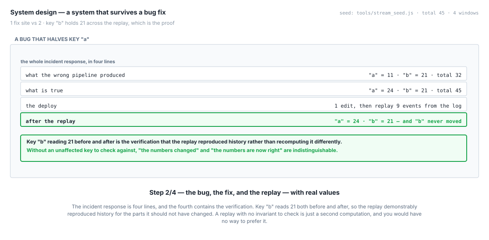

The incident response is four lines, and the fourth contains the verification. Key "b" reads 21 both before and after, so the replay demonstrably reproduced history for the parts it should not have changed. A replay with no invariant to check is just a second computation, and you would have no way to prefer it.

</details>
<details>
<summary><b>Step 3 of 4</b> — what this buys over Lambda, counted</summary>

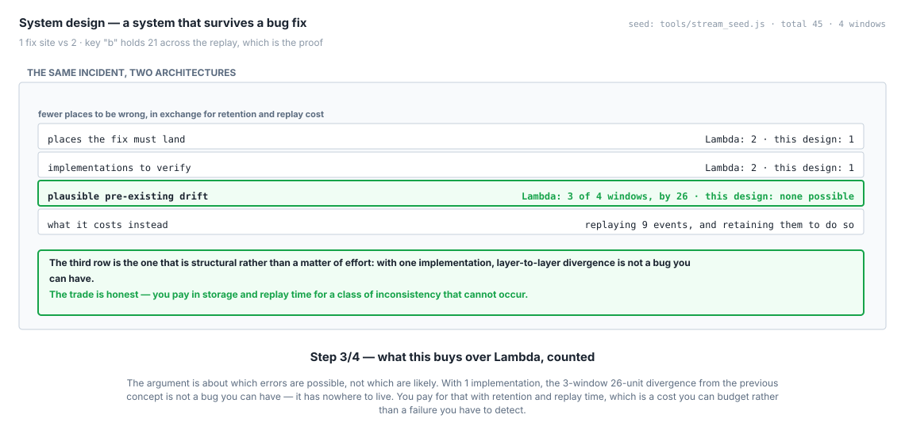

The argument is about which errors are possible, not which are likely. With 1 implementation, the 3-window 26-unit divergence from the previous concept is not a bug you can have — it has nowhere to live. You pay for that with retention and replay time, which is a cost you can budget rather than a failure you have to detect.

</details>
<details>
<summary><b>Step 4 of 4</b> — and what this design does NOT settle</summary>

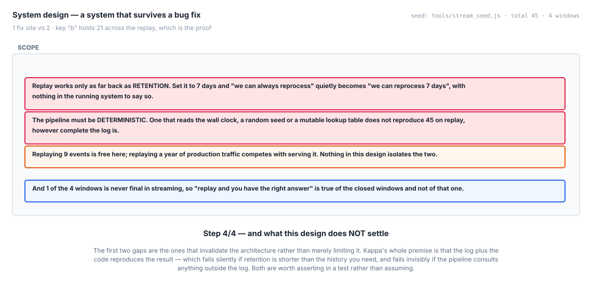

The first two gaps are the ones that invalidate the architecture rather than merely limiting it. Kappa's whole premise is that the log plus the code reproduces the result — which fails silently if retention is shorter than the history you need, and fails invisibly if the pipeline consults anything outside the log. Both are worth asserting in a test rather than assuming.

</details>

<sub>The bug, the replay result, the invariant key and both fix-site counts are computed from the seed and asserted. Generated by `node tools/gen_ch10.js`.</sub>

<!-- ch10-system:end -->

<!-- ch10-system-memory:begin — generated by tools/gen_ch10.js; do not hand-edit -->

#### Surviving a bug fix — stack and heap at every step

**What is being answered.** The two assumptions Kappa rests on, made into checks rather than hopes.

`replayThrough` is the architecture's only recovery mechanism, and it works: 45 from 9 retained events through the fixed pipeline.

`verify` then names what that result depends on. Step 2: 6 retained events give 30 — a confident wrong answer with no error. Step 3: a non-deterministic pipeline gives 45, the **right** total with `trustworthy` false. The totals alone cannot tell you which replay to believe.

The animation steps through the code, holding each line long enough to read the STACK (call frames and their locals) and the HEAP (allocated arrays and objects) as they are AT THAT MOMENT. Expand any step to study it on its own.



<details>
<summary><b>Step 1 of 4</b> — the healthy replay reproduces the true total</summary>


All 9 retained events through the fixed pipeline: `total` = 45. This is the architecture working — one codebase, one replay, the right answer. The two steps that follow are the assumptions this result quietly depends on.

</details>
<details>
<summary><b>Step 2 of 4</b> — short retention produces a smaller total and no error</summary>

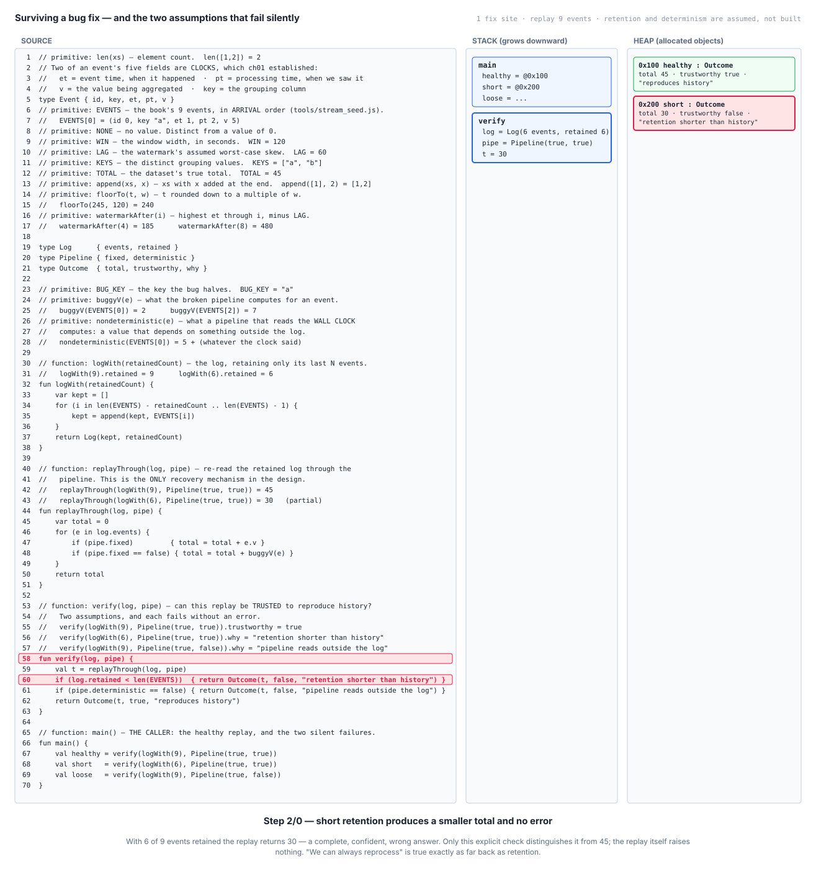

With 6 of 9 events retained the replay returns 30 — a complete, confident, wrong answer. Only this explicit check distinguishes it from 45; the replay itself raises nothing. "We can always reprocess" is true exactly as far back as retention.

</details>
<details>
<summary><b>Step 3 of 4</b> — and a non-deterministic pipeline gives the right total for the wrong reason</summary>

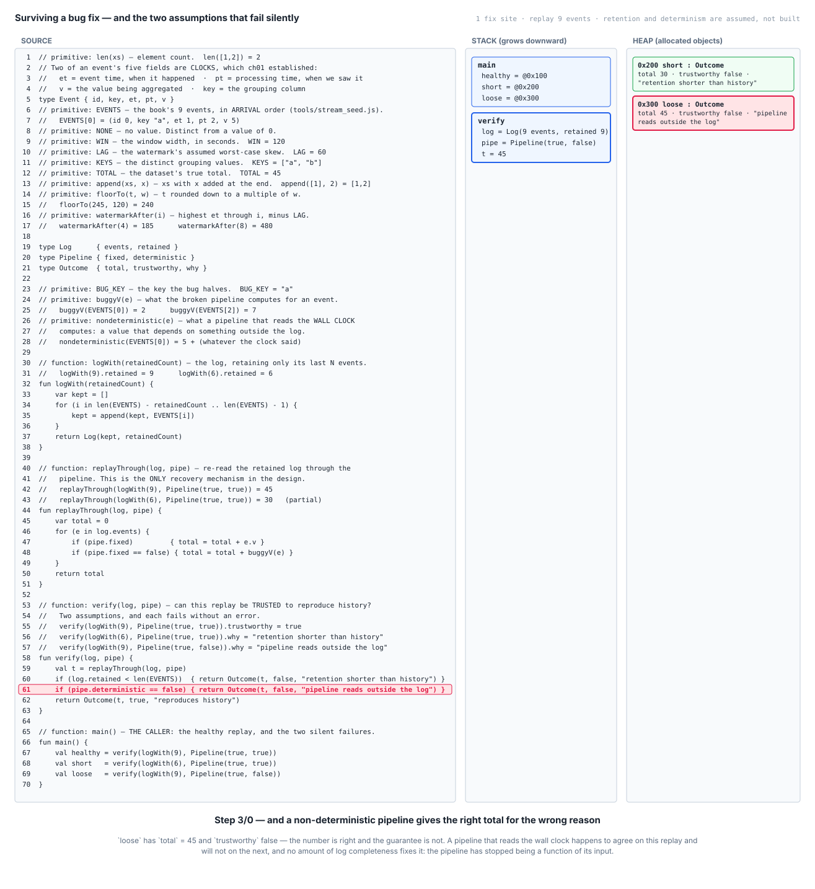

`loose` has `total` = 45 and `trustworthy` false — the number is right and the guarantee is not. A pipeline that reads the wall clock happens to agree on this replay and will not on the next, and no amount of log completeness fixes it: the pipeline has stopped being a function of its input.

</details>
<details>
<summary><b>Step 4 of 4</b> — so two assumptions carry the whole architecture</summary>

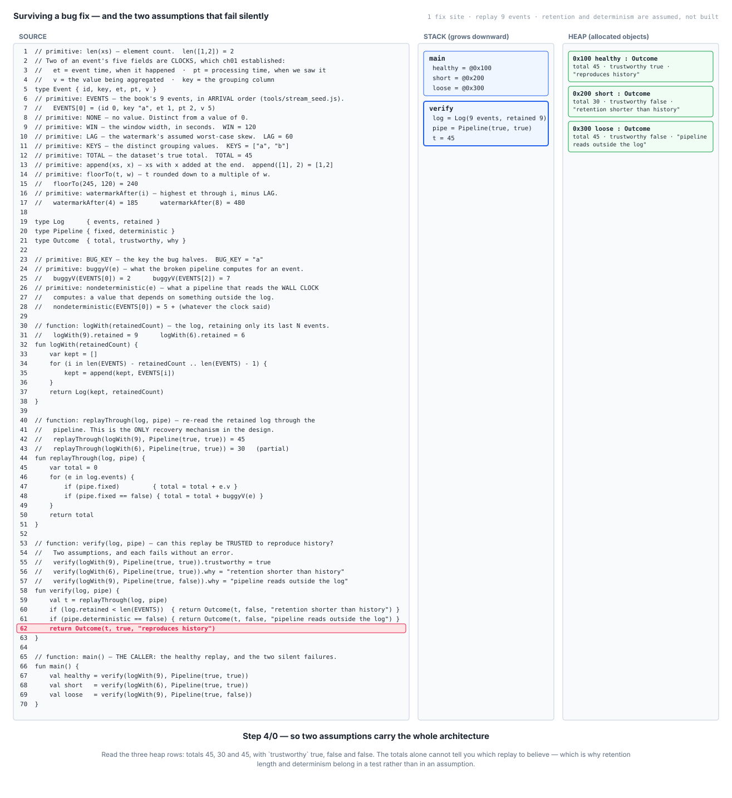

Read the three heap rows: totals 45, 30 and 45, with `trustworthy` true, false and false. The totals alone cannot tell you which replay to believe — which is why retention length and determinism belong in a test rather than in an assumption.

</details>

<sub>All three replay outcomes are computed from the seed and asserted. Generated by `node tools/gen_ch10.js` on `tools/memkit.js`.</sub>

<!-- ch10-system-memory:end -->

## Interview Questions

### Q1

A team runs a batch job and a streaming job that compute the same metric, and the two numbers disagree — the batch and speed layers have drifted.

**Interviewer's question:** How do you avoid maintaining two divergent implementations of the same computation?

**Solution:** Adopt the Kappa pattern: one streaming pipeline, and reprocess by replaying the retained log through the same code — batch becomes a replay of the same pipeline, not a separate codebase.

**System-design components:**
- One pipeline — Kappa
- Replayable log — Kafka
- Reprocessing — replay history
- Unified model — batch = bounded streaming

```java
// lambda: batch code + speed code -> drift
// kappa : one code, replay log -> no drift
//   bug fix -> edit once -> replay history -> swap result
```

_This is exactly the Lambda vs Kappa material in this chapter._

_Covers:_ 2. Lambda architecture · 3. Kappa architecture · 5. Reprocessing via replay

_From the 28 problems:_ 20-metrics-monitoring · 21-ad-click-aggregation

### Q2

An analyst asks why the company maintains separate batch and streaming pipelines when the business logic is identical.

**Interviewer's question:** Are batch and streaming really the same thing, and how would you unify them?

**Solution:** Yes — batch is streaming over a bounded input. Use a unified model (Beam) so one pipeline runs both modes, and reprocess via replay when logic changes.

**System-design components:**
- Unified model — Beam
- Bounded vs unbounded input
- One codebase

```java
// same windowed sum
//   batch    : read 3 records -> result {12:00: 3}
//   streaming: read 3 records as they arrive -> {12:00: 3}
//   -> identical computation, different input
```

_This is exactly the batch-as-a-special-case material in this chapter._

_Covers:_ 1. Batch and streaming were separate worlds · 4. Batch is a special case

_From the 28 problems:_ 20-metrics-monitoring

## Key Concepts

### The Problem

**1. Batch and streaming were separate worlds.** The Beam model showed batch and streaming are the same computation over bounded vs unbounded data.


### The Solution

Lambda runs a batch layer (correct) and a speed layer (low-latency) computing the same logic in two codebases.

```java
// lambda: batch code + speed code -> drift
// kappa : one code, replay log -> no drift
//   bug fix -> edit once -> replay history -> swap result
```


### Key Facts

| Fact | Detail | In the wild |
|---|---|---|
| 2. Lambda architecture | Lambda runs a batch layer (correct) and a speed layer (low-latency) computing the same logic in two codebases. | Nathan Marz's Lambda architecture from the Hadoop era. |
| 3. Kappa architecture | Kappa runs one streaming pipeline and reprocesses by replaying the log through the same code. | Jay Kreps' Kappa architecture on top of Kafka. |
| 4. Batch is a special case | Batch is streaming over a bounded input — windows, watermarks, and triggers still apply, just with an input that ends. | Beam runs batch pipelines with the same windowing as streaming. |
| 5. Reprocessing via replay | Reprocessing replays the retained log through the new pipeline — the Kappa pattern. | Kafka retention + replay is the production form. |
| 6. Replayable logs | Kappa assumes a replayable, persistent log (Kafka) with enough retention to re-run when code changes. | Kafka topic retention is the Kappa prerequisite. |
| 7. Lambda vs Kappa | Lambda pays dual-codebase drift; Kappa pays log retention and replay time. | Most modern systems choose Kappa-style, given a replayable log. |
| 8. What stays distinct | Bounded vs unbounded still changes when results are final — a batch run ends, a stream waits on watermarks. | Streaming jobs run until stopped; batch jobs terminate. |


### Tradeoffs & When

- Lambda pays dual-codebase drift; Kappa pays log retention and replay time.
- Bounded vs unbounded still changes when results are final — a batch run ends, a stream waits on watermarks.


### Real-World Examples

- **Apache Beam** — One pipeline that runs in batch or streaming mode
- **Apache Flink** — A single engine for stream and batch, treating batch as bounded streaming
- **Kafka + Kappa** — A replayable log enabling one-pipeline reprocessing
- **Google MillWheel / Dataflow** — The lineage from early streaming to the unified model


<details><summary>All concepts (index)</summary>

### Why: 1. Batch and streaming were separate worlds

**Why.** Batch had correctness and fault tolerance; streaming had low latency but weak correctness — and teams had to choose.

**Claim.** The Beam model showed batch and streaming are the same computation over bounded vs unbounded data.

**Grounding.** The book's thesis is that the two converge.

**In the wild.** Beam, Flink, and Dataflow all run the same pipeline in both modes.

<a href="../diagrams/d2/card/ch10-0.png"></a>
### Architecture: 2. Lambda architecture

**Why.** To get both correct and low-latency results, run two layers.

**Claim.** Lambda runs a batch layer (correct) and a speed layer (low-latency) computing the same logic in two codebases.

**Grounding.** The duplication is the core cost — the layers drift.

**In the wild.** Nathan Marz's Lambda architecture from the Hadoop era.

<a href="../diagrams/d2/card/ch10-1.png"></a>
### Architecture: 3. Kappa architecture

**Why.** Eliminating the second codebase removes the drift.

**Claim.** Kappa runs one streaming pipeline and reprocesses by replaying the log through the same code.

**Grounding.** One codebase, no synchronization.

**In the wild.** Jay Kreps' Kappa architecture on top of Kafka.

<a href="../diagrams/d2/card/ch10-2.png"></a>
### Insight: 4. Batch is a special case

**Why.** If the model is unified, batch needs no separate machinery.

**Claim.** Batch is streaming over a bounded input — windows, watermarks, and triggers still apply, just with an input that ends.

**Grounding.** This is the consequence of the Beam model.

**In the wild.** Beam runs batch pipelines with the same windowing as streaming.

<a href="../diagrams/d2/card/ch10-3.png"></a>
### Operation: 5. Reprocessing via replay

**Why.** Business logic changes, so history must be recomputed under the new logic.

**Claim.** Reprocessing replays the retained log through the new pipeline — the Kappa pattern.

**Grounding.** The log is the source of truth; the pipeline is disposable.

**In the wild.** Kafka retention + replay is the production form.

<a href="../diagrams/d2/card/ch10-4.png"></a>
### Requirement: 6. Replayable logs

**Why.** Replay-based reprocessing requires the input history to be retained and re-readable.

**Claim.** Kappa assumes a replayable, persistent log (Kafka) with enough retention to re-run when code changes.

**Grounding.** Without retention, history cannot be replayed.

**In the wild.** Kafka topic retention is the Kappa prerequisite.

<a href="../diagrams/d2/card/ch10-5.png"></a>
### Cost: 7. Lambda vs Kappa

**Why.** The architectures differ in what they pay for correctness and latency.

**Claim.** Lambda pays dual-codebase drift; Kappa pays log retention and replay time.

**Grounding.** Kappa's cost is storage and recompute, not coordination.

**In the wild.** Most modern systems choose Kappa-style, given a replayable log.

<a href="../diagrams/d2/card/ch10-6.png"></a>
### Remaining: 8. What stays distinct

**Why.** Unification does not make streams finite.

**Claim.** Bounded vs unbounded still changes when results are final — a batch run ends, a stream waits on watermarks.

**Grounding.** The model unifies the how, not the fact that streams never end.

**In the wild.** Streaming jobs run until stopped; batch jobs terminate.

<a href="../diagrams/d2/card/ch10-7.png"></a>

</details>


## Quiz

1. What is the core cost of the Lambda architecture?

   - A. High latency
   - B. Two codebases that drift apart
   - C. Low throughput
   - D. No fault tolerance

<details><summary>Reveal answer</summary>

**B.** Lambda runs the same logic in a batch layer and a speed layer that must be kept in sync.

</details>

2. How does Kappa reprocess data?

   - A. A separate batch system
   - B. Replaying the log through the same pipeline
   - C. A second codebase
   - D. Manual fixes

<details><summary>Reveal answer</summary>

**B.** Kappa replays the retained log through the one streaming pipeline.

</details>

3. What is batch in the unified model?

   - A. A separate paradigm
   - B. Streaming over a bounded input
   - C. A faster streaming mode
   - D. A type of window

<details><summary>Reveal answer</summary>

**B.** Batch is just streaming over an input that ends.

</details>

4. What does reprocessing require?

   - A. A second codebase
   - B. A replayable, persistent log
   - C. A batch layer
   - D. No state

<details><summary>Reveal answer</summary>

**B.** Replay needs retained, re-readable input history.

</details>

5. What stays distinct between batch and streaming after unification?

   - A. The window types
   - B. When results are final — batch ends, streams wait on watermarks
   - C. The transform logic
   - D. The key grouping

<details><summary>Reveal answer</summary>

**B.** The model unifies the how, not the fact that streams never end.

</details>

## Sources

- [Dean & Ghemawat — "MapReduce" (OSDI 2004)](https://research.google/pubs/pub62/) — The batch model that streaming evolved from
- [Nathan Marz — "How to beat the CAP theorem"](http://nathanmarz.com/blog/how-to-beat-the-cap-theorem.html) — The origin of the Lambda architecture
- [Jay Kreps — "Questioning the Lambda Architecture"](https://www.oreilly.com/radar/questioning-the-lambda-architecture/) — The origin of the Kappa architecture
- [Akidau et al. — "The Dataflow Model" (VLDB 2015)](https://www.vldb.org/pvldb/vol8/p1792-Akidau.pdf) — The paper that unified batch and streaming
- [Akidau et al. — "MillWheel" (VLDB 2013)](https://research.google/pubs/pub41378/) — The early-streaming lineage

